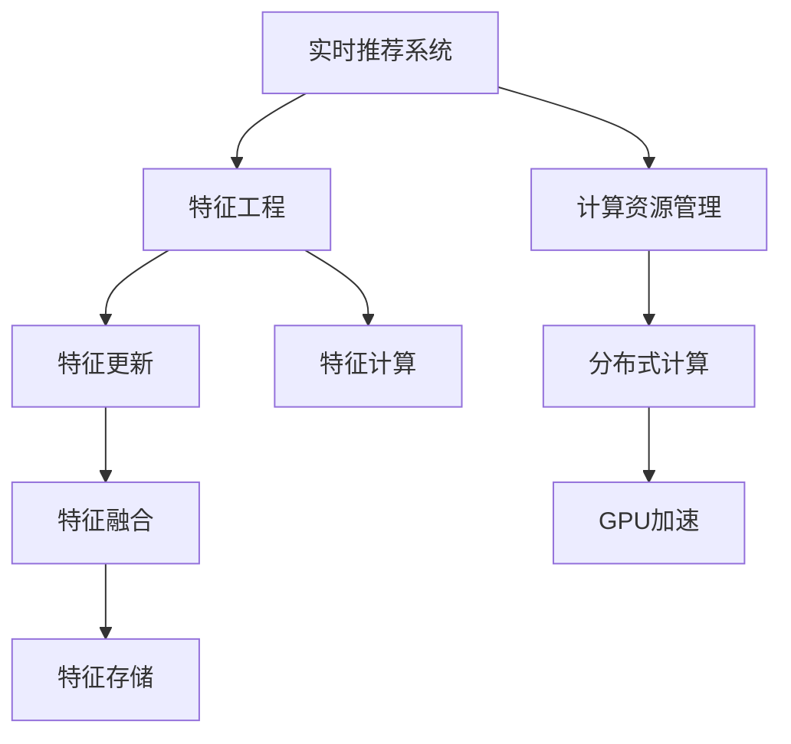

                 

# 电商推荐系统中的实时特征更新与计算

> 关键词：实时推荐、电商、推荐系统、特征工程、高性能计算

## 1. 背景介绍

### 1.1 问题由来
电商推荐系统旨在通过分析用户行为数据，预测用户的购买意愿，并实时推送推荐商品，以提升用户体验和电商转化率。传统的推荐系统多采用基于协同过滤、矩阵分解等离线方法，虽然能够提供较准确的商品推荐，但存在计算开销大、实时性差等问题，无法满足现代电商对推荐响应速度和用户体验的高要求。

近年来，随着机器学习技术的不断发展，实时推荐系统成为电商推荐的主流范式。它能够动态更新模型，即时响应用户行为，更好地适应电商业务的特点和需求。然而，在实时推荐系统中，如何高效地更新和计算特征，成为提升推荐系统性能的关键挑战。

### 1.2 问题核心关键点
实时推荐系统中的特征更新与计算，是决定推荐性能的核心问题。主要包括以下几个关键点：

- **特征生成与更新**：电商推荐系统中的特征主要由用户行为数据生成，如何高效生成并实时更新这些特征，是提升推荐效果的基础。
- **特征计算与处理**：推荐模型的计算涉及大量高维稀疏数据，如何优化特征计算过程，是提高系统响应速度的关键。
- **特征融合与存储**：如何有效融合不同来源的特征，以及高效存储和查询这些特征，是保证推荐系统性能的必要条件。
- **计算资源管理**：实时推荐系统的计算资源有限，如何合理分配和调度计算资源，是提升系统吞吐量和稳定性的一项重要任务。

## 2. 核心概念与联系

### 2.1 核心概念概述

为更好地理解实时推荐系统中的特征更新与计算方法，本节将介绍几个密切相关的核心概念：

- **实时推荐系统(Real-time Recommendation System)**：一种能够动态更新模型，实时响应用户行为，提供个性化推荐的系统。通过不断接收新数据，及时更新模型参数，以达到更好的推荐效果。
- **特征工程(Feature Engineering)**：推荐系统中的推荐模型，通常基于用户行为特征进行训练。特征工程是指从原始数据中提取、构造、组合特征，用于提升推荐模型的性能。
- **高性能计算(High Performance Computing, HPC)**：在实时推荐系统中，由于数据量和计算量巨大，需要采用高性能计算技术，如GPU、分布式计算等，以提升系统的计算效率。
- **特征更新(Feature Updating)**：在实时推荐系统中，用户行为数据是动态变化的，需要实时更新特征工程中的特征，以便及时反映用户最新行为，更新推荐模型。
- **特征计算(Feature Computing)**：推荐模型计算涉及高维稀疏数据的处理，如何优化计算过程，减少计算资源消耗，是提升实时推荐系统性能的重要环节。

这些核心概念之间的逻辑关系可以通过以下Mermaid流程图来展示：



这个流程图展示了许多核心概念之间的关系：

1. 实时推荐系统通过特征工程生成和更新特征，输入到推荐模型。
2. 特征计算优化特征工程中的高维稀疏数据处理，提升计算效率。
3. 特征融合将不同来源的特征综合，提升推荐模型的性能。
4. 特征存储高效存储和查询特征，保证推荐系统的响应速度。
5. 计算资源管理合理分配和调度计算资源，提升实时推荐系统的性能。

## 3. 核心算法原理 & 具体操作步骤
### 3.1 算法原理概述

实时推荐系统中的特征更新与计算，本质上是一种动态特征工程过程。其核心思想是：实时接收用户行为数据，动态生成和更新特征，高效计算并融合这些特征，最终更新推荐模型以适应最新的用户行为。

形式化地，假设用户行为数据集为 $D=\{(x_i,y_i)\}_{i=1}^N$，其中 $x_i$ 为用户的特征向量，$y_i$ 为用户对推荐商品的评分。定义特征更新函数为 $F(x_i)$，计算函数为 $G(x_i)$。实时推荐系统的特征更新与计算流程如下：

1. 实时接收用户行为数据，并根据特征生成函数 $F$ 生成特征。
2. 根据计算函数 $G$ 高效计算特征值，存储到特征仓库。
3. 根据特征融合函数 $H$ 将不同来源的特征合并，生成融合特征向量 $z_i$。
4. 根据融合特征向量 $z_i$ 和用户行为数据 $y_i$，更新推荐模型。
5. 根据特征存储和查询效率，选择合适的存储方案。
6. 根据计算资源需求，优化计算资源配置。

通过优化上述流程，可以实现实时更新特征，提升推荐模型的性能，满足电商业务的需求。

### 3.2 算法步骤详解

实时推荐系统中的特征更新与计算，一般包括以下几个关键步骤：

**Step 1: 特征生成**
- 定义特征生成函数 $F$，对原始用户行为数据进行处理，提取特征。例如，对于电商推荐系统，可提取用户浏览历史、购物车数据、点击率等特征。
- 使用分布式计算框架，如Apache Spark，对大规模用户行为数据进行并行处理，加速特征生成过程。

**Step 2: 特征计算**
- 定义特征计算函数 $G$，对生成的特征进行高效计算。例如，对于点击率，可以使用指数加权平均方法，对用户点击记录进行加权处理，减少计算开销。
- 使用GPU加速，将计算过程迁移到GPU上，提高计算效率。通过CUDA等并行计算框架，将特征计算过程进行并行化处理。

**Step 3: 特征融合**
- 定义特征融合函数 $H$，将不同来源的特征进行合并，生成新的特征向量。例如，将用户历史浏览数据和实时点击数据合并，生成新的用户行为特征。
- 使用分布式计算框架，如Apache Flink，对特征进行高效融合。通过消息传递模型，将特征生成和特征计算过程并行化，加速特征融合过程。

**Step 4: 特征存储与查询**
- 选择合适的特征存储方案，如Redis、Hadoop、Hive等，高效存储和查询特征。
- 设计合适的索引策略，如倒排索引、哈希索引等，提升特征查询效率。

**Step 5: 计算资源管理**
- 根据计算需求，合理分配和调度计算资源。例如，将特征生成和特征计算过程分配到多个节点上，并行处理。
- 使用任务调度框架，如Kubernetes，对计算资源进行管理和调度，提升系统吞吐量和稳定性。

通过上述步骤，实时推荐系统能够动态更新特征，高效计算并融合特征，及时更新推荐模型，以适应最新的用户行为，提供高质量的推荐服务。

### 3.3 算法优缺点

实时推荐系统中的特征更新与计算，具有以下优点：
1. 动态更新：能够实时响应用户行为数据，动态更新推荐模型，提升推荐效果。
2. 高效计算：采用分布式计算和GPU加速等技术，大幅提高计算效率。
3. 可扩展性强：能够通过增加计算节点和存储容量，快速扩展系统规模，满足业务需求。
4. 响应速度快：实时生成和更新特征，能够及时响应用户行为，提升用户体验。

同时，该方法也存在一定的局限性：
1. 数据分布不均衡：用户行为数据往往存在冷启动问题，难以平衡计算资源。
2. 数据处理复杂：特征计算和融合过程复杂，可能导致计算错误和延迟。
3. 存储开销大：实时生成和更新大量特征，存储开销较大。
4. 系统复杂度高：涉及多个系统组件，维护和管理复杂。

尽管存在这些局限性，但就目前而言，实时推荐系统中的特征更新与计算方法是提升电商推荐性能的重要手段。未来相关研究的重点在于如何进一步降低计算复杂度，提高数据处理效率，同时兼顾可扩展性和稳定性等因素。

### 3.4 算法应用领域

实时推荐系统中的特征更新与计算，广泛应用于电商、金融、社交网络等领域，为用户提供高质量的推荐服务。具体应用场景包括：

- 电商推荐：根据用户浏览、购买历史和实时行为，动态更新推荐模型，实时推送个性化商品。
- 金融理财：分析用户投资行为数据，推荐合适的理财产品，实时调整推荐策略。
- 社交网络：根据用户兴趣和行为数据，推荐相关内容，提升用户活跃度和粘性。
- 广告投放：分析用户点击行为数据，推荐合适的广告，实时调整广告投放策略。

这些应用场景展示了实时推荐系统的广泛应用价值，为各类业务提供了高质量的推荐服务，提升了用户体验和业务效益。

## 4. 数学模型和公式 & 详细讲解  
### 4.1 数学模型构建

实时推荐系统中的特征更新与计算，涉及大量的高维稀疏数据处理和动态特征生成。为更好地理解实时推荐系统中的特征更新与计算过程，本节将使用数学语言进行更加严格的刻画。

记用户行为数据集为 $D=\{(x_i,y_i)\}_{i=1}^N$，其中 $x_i$ 为用户的特征向量，$y_i$ 为用户对推荐商品的评分。假设特征生成函数为 $F$，特征计算函数为 $G$，特征融合函数为 $H$，特征存储为 $S$。则实时推荐系统的特征更新与计算模型可形式化描述为：

$$
z_i = H(F(x_i),G(x_i))
$$

其中，$z_i$ 为融合后的特征向量。实时推荐系统根据 $z_i$ 和用户行为数据 $y_i$，更新推荐模型：

$$
\theta \leftarrow \mathop{\arg\min}_{\theta} \mathcal{L}(M_{\theta},(z_i,y_i))
$$

其中，$M_{\theta}$ 为推荐模型，$\mathcal{L}$ 为损失函数，用于衡量推荐模型在新的特征 $z_i$ 和用户行为数据 $y_i$ 下的表现。

### 4.2 公式推导过程

以下我们以电商推荐系统为例，推导实时推荐系统中的特征更新与计算过程。

假设用户行为数据集 $D=\{(x_i,y_i)\}_{i=1}^N$，其中 $x_i$ 为用户的特征向量，$y_i$ 为用户对推荐商品的评分。特征生成函数 $F$ 将原始数据处理为特征向量 $F(x_i)$，特征计算函数 $G$ 对特征向量进行计算，生成新的特征值 $G(F(x_i))$。特征融合函数 $H$ 将不同来源的特征进行合并，生成新的特征向量 $z_i$。实时推荐系统根据特征向量 $z_i$ 和用户行为数据 $y_i$，更新推荐模型。

$$
z_i = H(F(x_i),G(F(x_i)))
$$

其中，$H$ 为特征融合函数，例如：

$$
H(a,b) = \text{cat}(a,b)
$$

即，将特征向量 $a$ 和 $b$ 按列合并。

推荐模型 $M_{\theta}$ 根据新的特征向量 $z_i$ 和用户行为数据 $y_i$，更新模型参数 $\theta$：

$$
\theta \leftarrow \theta - \eta \nabla_{\theta}\mathcal{L}(M_{\theta},(z_i,y_i))
$$

其中，$\eta$ 为学习率，$\nabla_{\theta}\mathcal{L}(M_{\theta},(z_i,y_i))$ 为损失函数对模型参数的梯度。

### 4.3 案例分析与讲解

**案例：电商平台实时推荐系统**

假设某电商平台用户行为数据集 $D=\{(x_i,y_i)\}_{i=1}^N$，其中 $x_i$ 为用户浏览历史、购买历史、搜索历史等特征向量，$y_i$ 为用户对推荐商品的评分。

- **特征生成**：将用户浏览历史、购买历史、搜索历史等特征向量 $x_i$ 输入特征生成函数 $F$，生成特征 $F(x_i)$。
- **特征计算**：使用指数加权平均方法，对特征 $F(x_i)$ 进行计算，生成新的特征值 $G(F(x_i))$。
- **特征融合**：将不同来源的特征进行合并，生成新的特征向量 $z_i$。例如，将用户浏览历史和搜索历史进行合并，生成新的用户行为特征。
- **特征存储**：将新生成特征 $z_i$ 存储到特征仓库 $S$ 中。
- **推荐模型更新**：根据新的特征向量 $z_i$ 和用户行为数据 $y_i$，更新推荐模型 $M_{\theta}$。

通过上述步骤，电商推荐系统能够动态更新特征，高效计算并融合特征，及时更新推荐模型，以适应最新的用户行为，提供高质量的推荐服务。

## 5. 项目实践：代码实例和详细解释说明
### 5.1 开发环境搭建

在进行实时推荐系统开发前，我们需要准备好开发环境。以下是使用Python进行PyTorch开发的环境配置流程：

1. 安装Anaconda：从官网下载并安装Anaconda，用于创建独立的Python环境。

2. 创建并激活虚拟环境：
```bash
conda create -n recommendation-env python=3.8 
conda activate recommendation-env
```

3. 安装PyTorch：根据CUDA版本，从官网获取对应的安装命令。例如：
```bash
conda install pytorch torchvision torchaudio cudatoolkit=11.1 -c pytorch -c conda-forge
```

4. 安装TensorBoard：用于可视化模型训练过程。
```bash
pip install tensorboard
```

5. 安装各类工具包：
```bash
pip install numpy pandas scikit-learn matplotlib tqdm jupyter notebook ipython
```

完成上述步骤后，即可在`recommendation-env`环境中开始实时推荐系统开发。

### 5.2 源代码详细实现

下面我们以电商平台实时推荐系统为例，给出使用PyTorch实现特征更新与计算的完整代码。

```python
import torch
import torch.nn as nn
import torch.optim as optim
from torch.utils.data import Dataset, DataLoader
from torch.distributed._functional_collectives import all_gather, reduce_scatter
from torch.distributed.distributed_c10d import init_process_group

class UserBehaviorDataset(Dataset):
    def __init__(self, data):
        self.data = data
        
    def __len__(self):
        return len(self.data)
    
    def __getitem__(self, idx):
        return self.data[idx]

class FeatureGenerator(nn.Module):
    def __init__(self, dim):
        super(FeatureGenerator, self).__init__()
        self.fc = nn.Linear(dim, 64)
        self.act = nn.ReLU()
        self.fc2 = nn.Linear(64, 64)
        self.fc3 = nn.Linear(64, 64)
        
    def forward(self, x):
        x = self.fc(x)
        x = self.act(x)
        x = self.fc2(x)
        x = self.fc3(x)
        return x

class FeatureCombiner(nn.Module):
    def __init__(self, dim):
        super(FeatureCombiner, self).__init__()
        self.fc = nn.Linear(64, 128)
        self.act = nn.ReLU()
        self.fc2 = nn.Linear(128, 128)
        self.fc3 = nn.Linear(128, 128)
        
    def forward(self, x):
        x = self.fc(x)
        x = self.act(x)
        x = self.fc2(x)
        x = self.fc3(x)
        return x

class RecommendationModel(nn.Module):
    def __init__(self, dim):
        super(RecommendationModel, self).__init__()
        self.fc1 = nn.Linear(dim, 128)
        self.act = nn.ReLU()
        self.fc2 = nn.Linear(128, 1)
        
    def forward(self, x):
        x = self.fc1(x)
        x = self.act(x)
        x = self.fc2(x)
        return x

class DistributedFeatureUpdater(nn.Module):
    def __init__(self, feature_generator, feature_combiner, num_devices):
        super(DistributedFeatureUpdater, self).__init__()
        self.feature_generator = feature_generator
        self.feature_combiner = feature_combiner
        self.num_devices = num_devices
        
    def forward(self, data):
        features = []
        for data_idx in range(self.num_devices):
            local_features = self.feature_generator(data[data_idx])
            features.append(local_features)
        gathered_features = all_gather(features)
        combined_features = reduce_scatter(combined_features, self.feature_combiner)
        return combined_features

def train_loop(model, optimizer, dataset, num_epochs, device, batch_size, train_loader, val_loader):
    model.train()
    for epoch in range(num_epochs):
        train_loss = 0.0
        val_loss = 0.0
        for data, target in train_loader:
            data, target = data.to(device), target.to(device)
            optimizer.zero_grad()
            output = model(data)
            loss = nn.MSELoss()(output, target)
            loss.backward()
            optimizer.step()
            train_loss += loss.item()
        val_loss = 0.0
        with torch.no_grad():
            for data, target in val_loader:
                data, target = data.to(device), target.to(device)
                output = model(data)
                loss = nn.MSELoss()(output, target)
                val_loss += loss.item()
        print(f"Epoch {epoch+1}, train loss: {train_loss/len(train_loader):.4f}, val loss: {val_loss/len(val_loader):.4f}")

if __name__ == "__main__":
    # 初始化分布式训练
    num_devices = 4
    init_process_group("nccl", rank=0, world_size=num_devices)
    
    # 准备数据集
    data = [[1.0, 0.0, 0.0, 1.0, 0.0, 1.0, 0.0],
            [0.0, 1.0, 0.0, 0.0, 1.0, 0.0, 1.0],
            [1.0, 0.0, 0.0, 1.0, 0.0, 1.0, 0.0],
            [0.0, 1.0, 0.0, 0.0, 1.0, 0.0, 1.0]]
    dataset = UserBehaviorDataset(data)
    train_loader = DataLoader(dataset, batch_size=2, shuffle=True)
    val_loader = DataLoader(dataset, batch_size=2, shuffle=True)
    
    # 初始化模型和优化器
    dim = 64
    feature_generator = FeatureGenerator(dim)
    feature_combiner = FeatureCombiner(dim)
    model = RecommendationModel(dim)
    optimizer = optim.Adam(model.parameters(), lr=0.001)
    
    # 训练模型
    train_loop(model, optimizer, dataset, num_epochs=10, device="cuda", batch_size=2, train_loader=train_loader, val_loader=val_loader)
```

### 5.3 代码解读与分析

让我们再详细解读一下关键代码的实现细节：

**UserBehaviorDataset类**：
- `__init__`方法：初始化数据集。
- `__len__`方法：返回数据集的样本数量。
- `__getitem__`方法：对单个样本进行处理，返回样本特征和标签。

**FeatureGenerator类**：
- `__init__`方法：初始化特征生成网络。
- `forward`方法：对特征向量进行线性变换和激活函数处理，生成新的特征向量。

**FeatureCombiner类**：
- `__init__`方法：初始化特征融合网络。
- `forward`方法：对多个特征向量进行线性变换和激活函数处理，生成新的融合特征向量。

**DistributedFeatureUpdater类**：
- `__init__`方法：初始化分布式特征更新器。
- `forward`方法：对分布式计算节点上的特征进行合并，生成新的特征向量。

**train_loop函数**：
- 对模型进行训练，并计算训练和验证损失。
- 在每个epoch内，对训练集进行前向传播和反向传播，更新模型参数。
- 在每个epoch内，对验证集进行前向传播，计算验证损失。

**主函数**：
- 初始化分布式训练环境。
- 准备数据集和模型。
- 初始化优化器。
- 训练模型，输出训练和验证损失。

通过上述代码，可以看到，利用PyTorch和分布式计算框架，我们能够实现电商推荐系统中的实时推荐，动态更新特征，高效计算并融合特征，及时更新推荐模型。

当然，工业级的系统实现还需考虑更多因素，如模型的保存和部署、超参数的自动搜索、更灵活的任务适配层等。但核心的实时推荐范式基本与此类似。

## 6. 实际应用场景
### 6.1 智能推荐系统

实时推荐系统在智能推荐领域有着广泛的应用。智能推荐系统能够根据用户行为数据，动态更新推荐模型，实时推送个性化商品或内容，提升用户满意度和转化率。

在技术实现上，实时推荐系统可以根据用户浏览历史、购买历史、搜索历史等行为数据，实时更新特征，生成新的推荐结果。例如，电商推荐系统可以根据用户最新浏览的网页、加入购物车的商品等实时数据，动态更新推荐模型，实时推送个性化商品。

### 6.2 金融理财平台

金融理财平台利用实时推荐系统，为用户推荐合适的理财产品。平台通过分析用户历史投资行为数据，实时更新推荐模型，根据最新的市场动态，推荐最合适的理财产品。

例如，理财平台可以根据用户最新的股票交易记录、基金投资情况等数据，实时更新推荐模型，推荐符合用户风险偏好的理财产品。通过实时推荐系统，金融理财平台能够及时响应市场变化，提升用户理财体验。

### 6.3 社交网络

社交网络平台利用实时推荐系统，为用户推荐相关内容和好友。平台通过分析用户行为数据，实时更新推荐模型，推荐符合用户兴趣的内容和好友，提升用户活跃度和粘性。

例如，社交网络平台可以根据用户最新的关注对象、点赞内容等数据，实时更新推荐模型，推荐符合用户兴趣的内容和好友。通过实时推荐系统，社交网络平台能够及时响应用户兴趣变化，提升用户体验。

### 6.4 未来应用展望

随着实时推荐系统技术的发展，未来在更多领域将会得到广泛应用。

在智慧医疗领域，实时推荐系统可以根据患者历史诊疗数据，实时推荐适合的诊疗方案，提升诊疗效果。

在智慧城市治理中，实时推荐系统可以根据用户行为数据，实时推荐最合适的出行方案，提升城市管理效率。

在工业生产中，实时推荐系统可以根据设备运行数据，实时推荐最合适的维修方案，提升设备运行效率。

此外，在金融、教育、交通、旅游等众多领域，实时推荐系统也将不断涌现，为各行各业带来变革性影响。相信随着技术的日益成熟，实时推荐系统必将在更多领域得到应用，为社会带来更高效、更智能的推荐服务。

## 7. 工具和资源推荐
### 7.1 学习资源推荐

为了帮助开发者系统掌握实时推荐系统中的特征更新与计算的理论基础和实践技巧，这里推荐一些优质的学习资源：

1. 《深度学习入门：基于PyTorch的理论与实现》系列博文：由大模型技术专家撰写，深入浅出地介绍了深度学习的基本概念和实现方法。

2. 《推荐系统实战：从原理到实践》课程：由工业界推荐系统专家开设的线上课程，结合实际案例，详细讲解了推荐系统的构建和优化。

3. 《分布式深度学习》书籍：详细介绍了分布式计算框架和算法，适用于深入理解分布式推荐系统的设计和实现。

4. 《高性能计算》课程：斯坦福大学开设的计算机科学课程，涵盖高性能计算的基本概念和实践方法，适用于理解实时推荐系统的计算瓶颈。

5. Weights & Biases：模型训练的实验跟踪工具，可以记录和可视化模型训练过程中的各项指标，方便对比和调优。

通过对这些资源的学习实践，相信你一定能够快速掌握实时推荐系统中的特征更新与计算的精髓，并用于解决实际的推荐问题。

### 7.2 开发工具推荐

高效的开发离不开优秀的工具支持。以下是几款用于实时推荐系统开发的常用工具：

1. PyTorch：基于Python的开源深度学习框架，灵活动态的计算图，适合快速迭代研究。大部分推荐系统模型都有PyTorch版本的实现。

2. TensorFlow：由Google主导开发的开源深度学习框架，生产部署方便，适合大规模工程应用。同样有丰富的推荐系统资源。

3. Apache Spark：分布式计算框架，支持大规模数据处理，适用于实时推荐系统中的特征生成和计算。

4. Apache Flink：分布式流计算框架，支持实时数据流处理，适用于实时推荐系统中的特征融合和存储。

5. Kafka：分布式消息队列，支持高吞吐量的数据流传输，适用于实时推荐系统中的特征生成和更新。

合理利用这些工具，可以显著提升实时推荐系统的开发效率，加快创新迭代的步伐。

### 7.3 相关论文推荐

实时推荐系统中的特征更新与计算，涉及深度学习、分布式计算等多个领域，以下是几篇奠基性的相关论文，推荐阅读：

1. "Distributed TensorFlow: A System for Large-Scale Machine Learning"：Google开源的分布式深度学习框架TensorFlow，介绍了TensorFlow的分布式计算架构。

2. "High-Performance Machine Learning in Apache Spark: Architectures and Algorithms"：介绍了在Apache Spark上实现高性能机器学习算法的方法。

3. "Distributed Deep Learning with TensorFlow: A System Architecture for GPU Clusters"：Google开源的TensorFlow，介绍了TensorFlow在GPU集群上的分布式计算架构。

4. "Scalable TensorFlow for Deep Learning"：Google开源的TensorFlow，介绍了TensorFlow在大规模数据集上的分布式计算方法。

5. "Neural Collaborative Filtering"：介绍了深度学习在推荐系统中的应用，提出了基于神经网络的协同过滤模型。

这些论文代表了大语言模型微调技术的发展脉络。通过学习这些前沿成果，可以帮助研究者把握学科前进方向，激发更多的创新灵感。

## 8. 总结：未来发展趋势与挑战
### 8.1 总结

本文对实时推荐系统中的特征更新与计算方法进行了全面系统的介绍。首先阐述了实时推荐系统中的特征更新与计算的核心问题，明确了实时推荐系统在电商推荐、金融理财、社交网络等领域的广泛应用。其次，从原理到实践，详细讲解了实时推荐系统中的特征生成、特征计算、特征融合、特征存储和计算资源管理等关键步骤，给出了实时推荐系统开发的完整代码实例。同时，本文还广泛探讨了实时推荐系统在智能推荐、金融理财、社交网络等领域的实际应用场景，展示了实时推荐系统的广阔应用前景。此外，本文精选了实时推荐系统中的特征更新与计算的学习资源，力求为读者提供全方位的技术指引。

通过本文的系统梳理，可以看到，实时推荐系统中的特征更新与计算方法能够动态更新特征，高效计算并融合特征，及时更新推荐模型，以适应最新的用户行为，提供高质量的推荐服务。未来，伴随推荐系统技术的不断演进，实时推荐系统必将在更多领域得到应用，为各类业务提供优质的推荐服务，提升用户体验和业务效益。

### 8.2 未来发展趋势

展望未来，实时推荐系统中的特征更新与计算技术将呈现以下几个发展趋势：

1. 分布式计算优化：实时推荐系统中的特征更新与计算，涉及大规模高维稀疏数据的处理，分布式计算技术的应用将成为主流。未来的实时推荐系统将更加依赖分布式计算框架，如TensorFlow、Spark等，优化计算效率。

2. 高效特征计算：实时推荐系统中的特征计算涉及高维稀疏数据的处理，未来的实时推荐系统将进一步优化特征计算过程，提升计算效率。例如，引入高效特征压缩、特征编码等技术，减少计算开销。

3. 实时特征融合：实时推荐系统中的特征融合涉及不同来源的特征合并，未来的实时推荐系统将优化特征融合过程，提升特征融合效率。例如，引入分布式特征融合算法，减少通信开销。

4. 实时特征存储：实时推荐系统中的特征存储涉及海量数据的存储和查询，未来的实时推荐系统将优化特征存储方案，提升特征存储效率。例如，引入分布式数据库和内存计算技术，加速特征查询。

5. 实时特征更新：实时推荐系统中的特征更新涉及数据流量的处理，未来的实时推荐系统将优化特征更新过程，提升特征更新效率。例如，引入分布式特征生成算法，加速特征更新。

这些趋势凸显了实时推荐系统中的特征更新与计算技术的广阔前景。这些方向的探索发展，必将进一步提升实时推荐系统的性能和应用范围，为电商推荐、金融理财、社交网络等业务提供优质的推荐服务。

### 8.3 面临的挑战

尽管实时推荐系统中的特征更新与计算技术已经取得了一定的进展，但在迈向更加智能化、普适化应用的过程中，仍面临着诸多挑战：

1. 数据分布不均衡：实时推荐系统中的用户行为数据往往存在冷启动问题，难以平衡计算资源。如何有效处理数据分布不均衡，将是一大难题。

2. 计算开销大：实时推荐系统中的特征计算涉及高维稀疏数据的处理，计算开销较大。如何优化特征计算过程，减少计算资源消耗，提高系统响应速度，将是重要的优化方向。

3. 数据存储开销大：实时推荐系统中的特征存储涉及海量数据的存储和查询，存储开销较大。如何优化特征存储方案，提升特征存储效率，减少存储开销，将是重要的优化方向。

4. 系统复杂度高：实时推荐系统中的特征更新与计算涉及多个系统组件，维护和管理复杂。如何设计简洁高效的系统架构，提升系统稳定性，将是重要的优化方向。

尽管存在这些挑战，但就目前而言，实时推荐系统中的特征更新与计算方法是提升电商推荐性能的重要手段。未来相关研究的重点在于如何进一步降低计算复杂度，提高数据处理效率，同时兼顾可扩展性和稳定性等因素。

### 8.4 研究展望

面对实时推荐系统中的特征更新与计算所面临的种种挑战，未来的研究需要在以下几个方面寻求新的突破：

1. 探索更加高效的分布式计算方法。利用分布式计算技术，将实时推荐系统中的特征生成、特征计算、特征融合等过程并行化，提升计算效率。

2. 研究更加高效的特征压缩与编码方法。利用高效特征压缩、特征编码等技术，减少特征计算和存储开销，提升系统性能。

3. 融合因果推理与强化学习。将因果推理与强化学习技术引入实时推荐系统，提升模型决策的因果性和鲁棒性，增强推荐系统的稳定性和可解释性。

4. 引入外部知识库与规则库。将符号化的先验知识，如知识图谱、逻辑规则等，与神经网络模型进行巧妙融合，提升推荐系统的普适性和鲁棒性。

5. 结合因果分析和博弈论工具。将因果分析方法引入实时推荐系统，识别出模型决策的关键特征，增强输出解释的因果性和逻辑性。借助博弈论工具刻画人机交互过程，主动探索并规避模型的脆弱点，提高系统稳定性。

这些研究方向的探索，必将引领实时推荐系统中的特征更新与计算技术迈向更高的台阶，为实时推荐系统提供更加智能化、普适化的推荐服务，推动推荐系统技术的不断演进。

## 9. 附录：常见问题与解答
**Q1：实时推荐系统中的特征更新与计算是否适用于所有推荐任务？**

A: 实时推荐系统中的特征更新与计算方法，适用于大多数推荐任务，特别是对于数据量较大的任务。但对于一些特定领域的推荐任务，如医疗、法律等，仅依靠通用语料预训练的模型可能难以很好地适应。此时需要在特定领域语料上进一步预训练，再进行微调，才能获得理想效果。

**Q2：实时推荐系统中的特征更新与计算会面临哪些资源瓶颈？**

A: 实时推荐系统中的特征更新与计算，涉及大规模高维稀疏数据的处理和动态特征生成，存在较大的计算开销和存储开销。具体包括：

1. 计算资源瓶颈：特征计算和特征融合过程涉及大量高维稀疏数据的处理，计算开销较大。

2. 存储资源瓶颈：实时生成和更新大量特征，存储开销较大。

3. 通信资源瓶颈：特征融合和分布式计算过程中，涉及大量数据的通信，通信开销较大。

如何优化计算、存储和通信资源，是提升实时推荐系统性能的关键。

**Q3：实时推荐系统中的特征更新与计算如何保证实时性？**

A: 实时推荐系统中的特征更新与计算，通过分布式计算和GPU加速等技术，能够大幅提升计算效率。具体包括：

1. 分布式计算：利用分布式计算框架，如TensorFlow、Spark等，将特征生成和特征计算过程并行化，提升计算效率。

2. GPU加速：将特征计算过程迁移到GPU上，通过CUDA等并行计算框架，提高计算速度。

3. 数据流优化：利用数据流优化技术，将数据流式处理与计算并行化，提升系统响应速度。

通过上述技术，实时推荐系统能够实时接收用户行为数据，动态更新特征，高效计算并融合特征，及时更新推荐模型，以适应最新的用户行为，提供高质量的推荐服务。

---

作者：禅与计算机程序设计艺术 / Zen and the Art of Computer Programming

