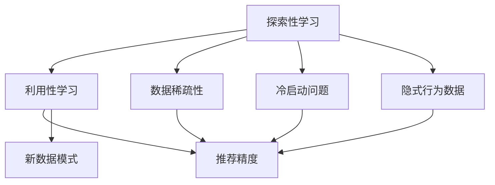

                 

## 1. 背景介绍

### 1.1 问题由来
在电商推荐系统中，如何通过有限的点击、浏览数据高效地为用户提供个性化的商品推荐，一直是行业内的重要研究方向。传统的推荐算法往往依赖于用户历史行为数据，而随着互联网用户规模的不断扩大，数据稀疏性问题愈发突出，直接利用用户历史数据训练的推荐系统，往往难以覆盖到长尾用户。

为了解决这一问题，协同过滤等基于用户行为数据的推荐算法被广泛应用。然而，随着算法对用户历史行为数据的依赖不断增强，冷启动用户（从未有过行为记录的新用户）以及隐式行为数据（如浏览路径、停留时长等）的有效利用，成为亟需解决的难题。

### 1.2 问题核心关键点
协同过滤推荐算法的大致流程如下：
1. 收集用户的历史行为数据，如浏览记录、购买记录等。
2. 将用户-商品矩阵进行分解，得到用户隐向量 $u$ 和商品隐向量 $v$。
3. 计算用户与商品的相似度，得出推荐列表。

尽管这种方法能够较为准确地预测用户对商品的评分，但在实际应用中，面临以下挑战：
- 数据稀疏性：用户历史数据较少，难以构建有效的用户和商品向量。
- 冷启动问题：新用户缺乏历史行为数据，难以推荐相关商品。
- 隐式行为数据：单一的点击行为难以全面刻画用户偏好。

为解决上述问题，探索与利用(Exploration vs. Exploitation)动态平衡算法应运而生。该算法通过引入探索性学习和利用性学习，在保证推荐精度的同时，最大化探索新数据和发现新模式，从而改善推荐系统的覆盖度和冷启动性能。

### 1.3 问题研究意义
探索与利用动态平衡算法能够有效应对电商推荐系统中的数据稀疏性和冷启动问题，提升推荐系统的覆盖度和个性化水平，对于提升用户体验和提升电商平台转化率具有重要意义。同时，该算法亦能处理隐式行为数据，拓宽了推荐系统算法的应用场景。

通过深入研究探索与利用动态平衡算法，能够为电商推荐系统带来新的解决方案，增强推荐系统的鲁棒性和用户满意度，进而推动电商行业的发展。

## 2. 核心概念与联系

### 2.1 核心概念概述

为了更好地理解探索与利用动态平衡算法，本节将介绍几个关键概念：

- **探索性学习(Exploration)**：指算法在已有知识的基础上，探索未知领域，发现新的数据模式或潜在的规律。
- **利用性学习(Exploitation)**：指算法利用已有的知识，进行最优的决策或预测，以达到预期目标。
- **探索与利用动态平衡**：指在推荐算法中，合理权衡探索新数据和利用已有数据的关系，使算法在提升推荐精度的同时，不断发现新的推荐模式和用户兴趣。
- **冷启动问题**：指新用户缺乏历史行为数据，无法基于用户历史行为数据进行个性化推荐。
- **数据稀疏性**：指用户历史行为数据少，导致难以准确预测用户偏好。
- **隐式行为数据**：指用户在平台上的行为，如浏览路径、停留时长等，未直接转化为购买行为的数据。

这些概念之间的逻辑关系可以通过以下Mermaid流程图来展示：



这个流程图展示了解探与利用动态平衡算法中涉及的关键概念及其相互关系：

1. 探索性学习在数据稀疏性、冷启动问题及隐式行为数据的情境下，通过探索新数据模式，发现新的推荐模式。
2. 利用性学习基于已有知识，利用推荐精度，以达到预期目标。
3. 探索与利用动态平衡旨在合理分配探索和利用的资源，使推荐系统在提升推荐精度的同时，不断发现新的模式。

## 3. 核心算法原理 & 具体操作步骤

### 3.1 算法原理概述

探索与利用动态平衡算法通过引入探索因子 $\epsilon$ 和当前参数 $\theta$ 的更新策略，在每次推荐决策时，根据 $\epsilon$ 的值决定是否进行探索性学习，即选择不同用户或商品进行新的尝试。

具体来说，算法在每次推荐时，根据 $\epsilon$ 的值选择是否进行探索，选择的方式有多种，如随机选择、轮询等。当选择进行探索时，算法利用当前参数 $\theta$ 进行预测，并更新参数，以期在未来预测中能获得更好的结果。当选择进行利用时，算法利用当前参数 $\theta$ 进行预测，直接返回推荐结果。

形式化地，探索与利用动态平衡算法的推荐函数可以表示为：

$$
R(u,v;\theta) = \begin{cases}
\epsilon \cdot U(u,v;\theta) + (1-\epsilon) \cdot \exp (E(u,v;\theta)) \cdot T(v;\theta), & \text{探索}\\
(1-\epsilon) \cdot \exp (E(u,v;\theta)) \cdot T(v;\theta), & \text{利用}
\end{cases}
$$

其中 $R(u,v;\theta)$ 表示用户 $u$ 对商品 $v$ 的推荐得分，$U(u,v;\theta)$ 表示探索性得分的期望，$E(u,v;\theta)$ 表示利用性得分的期望，$T(v;\theta)$ 表示利用性得分的值。

### 3.2 算法步骤详解

探索与利用动态平衡算法的主要步骤如下：

1. **收集数据**：收集用户历史行为数据，包括点击、浏览、停留时长等。

2. **初始化参数**：初始化探索因子 $\epsilon$，推荐参数 $\theta$。

3. **计算利用性得分**：基于已有数据计算用户与商品的利用性得分 $E(u,v;\theta)$。

4. **选择探索方式**：根据 $\epsilon$ 的值决定是否进行探索性学习。

5. **更新探索性得分**：如果选择探索，计算新的探索性得分 $U(u,v;\theta)$，并更新推荐参数 $\theta$。

6. **计算推荐得分**：根据选择方式计算推荐得分 $R(u,v;\theta)$，进行推荐。

7. **更新 $\epsilon$**：定期根据模型性能调整 $\epsilon$，保证动态平衡。

### 3.3 算法优缺点

探索与利用动态平衡算法具有以下优点：

1. **冷启动性能**：通过探索新数据，快速获取新用户的偏好信息，改善冷启动问题。
2. **数据稀疏性处理**：利用探索性学习发现新的数据模式，提高推荐系统的泛化能力。
3. **隐式行为数据利用**：有效利用隐式行为数据，提升推荐系统精度。

同时，该算法也存在以下缺点：

1. **探索因子设定**：$\epsilon$ 的设定较为困难，设定过大可能导致过度探索，设定过小则可能导致探索不足。
2. **计算复杂性**：探索性得分计算和推荐参数更新增加了算法计算复杂度。
3. **模型解释性**：模型结构较为复杂，难以解释其内部机制和决策逻辑。

### 3.4 算法应用领域

探索与利用动态平衡算法在推荐系统中得到广泛应用，尤其是在电商推荐系统、新闻推荐系统、视频推荐系统等多个领域。具体如下：

- **电商推荐系统**：针对新用户和冷启动问题，通过探索与利用动态平衡算法，快速获取用户偏好，提高推荐系统覆盖度和个性化水平。
- **新闻推荐系统**：在新闻推荐中，利用隐式行为数据，如用户停留时长、点击路径等，进行探索与利用动态平衡，发现新的用户兴趣，提升推荐准确性。
- **视频推荐系统**：在视频推荐中，利用用户观看时长、点击次数等隐式数据，进行探索与利用平衡，提升视频推荐系统的效果。

## 4. 数学模型和公式 & 详细讲解 & 举例说明

### 4.1 数学模型构建

假设用户 $u$ 对商品 $v$ 的推荐得分为 $R(u,v;\theta)$，利用性得分为 $E(u,v;\theta)$，探索性得分为 $U(u,v;\theta)$。

探索性得分的期望计算公式如下：

$$
U(u,v;\theta) = \frac{1}{N} \sum_{i=1}^N I\{x_i=v\} \log f(u,x_i;\theta)
$$

其中 $f(u,x_i;\theta)$ 表示用户 $u$ 对物品 $x_i$ 的评分预测，$I\{x_i=v\}$ 表示物品 $x_i$ 是否为商品 $v$ 的示性函数。

利用性得分的期望计算公式如下：

$$
E(u,v;\theta) = \frac{1}{N} \sum_{i=1}^N I\{x_i=v\} \log f(u,x_i;\theta)
$$

### 4.2 公式推导过程

利用性得分和探索性得分的期望计算公式是探索与利用动态平衡算法中的核心公式。公式推导如下：

利用性得分 $E(u,v;\theta)$ 表示用户 $u$ 对商品 $v$ 的评分预测，$I\{x_i=v\}$ 表示物品 $x_i$ 是否为商品 $v$ 的示性函数。

$$
E(u,v;\theta) = \frac{1}{N} \sum_{i=1}^N I\{x_i=v\} \log f(u,x_i;\theta) = \frac{1}{N} \sum_{i=1}^N \log f(u,x_i;\theta)
$$

探索性得分 $U(u,v;\theta)$ 表示在所有物品中，用户 $u$ 对商品 $v$ 的评分预测的期望值。$I\{x_i=v\}$ 表示物品 $x_i$ 是否为商品 $v$ 的示性函数。

$$
U(u,v;\theta) = \frac{1}{N} \sum_{i=1}^N I\{x_i=v\} \log f(u,x_i;\theta) = \frac{1}{N} \sum_{i=1}^N \log f(u,x_i;\theta)
$$

### 4.3 案例分析与讲解

假设用户 $u$ 对商品 $v$ 的利用性得分为 $E(u,v;\theta) = 4.5$，探索性得分为 $U(u,v;\theta) = 3.5$，当 $\epsilon=0.2$ 时，根据探索与利用动态平衡算法，推荐函数为：

$$
R(u,v;\theta) = \begin{cases}
0.2 \cdot U(u,v;\theta) + (1-0.2) \cdot \exp (E(u,v;\theta)) \cdot T(v;\theta), & \text{探索}\\
(1-0.2) \cdot \exp (E(u,v;\theta)) \cdot T(v;\theta), & \text{利用}
\end{cases}
$$

选择探索时，推荐得分 $R(u,v;\theta) = 0.2 \cdot 3.5 + (1-0.2) \cdot \exp (4.5) \cdot T(v;\theta)$。

选择利用时，推荐得分 $R(u,v;\theta) = (1-0.2) \cdot \exp (4.5) \cdot T(v;\theta)$。

## 5. 项目实践：代码实例和详细解释说明

### 5.1 开发环境搭建

在进行探索与利用动态平衡算法开发前，我们需要准备好开发环境。以下是使用Python进行PyTorch开发的环境配置流程：

1. 安装Anaconda：从官网下载并安装Anaconda，用于创建独立的Python环境。

2. 创建并激活虚拟环境：
```bash
conda create -n pytorch-env python=3.8 
conda activate pytorch-env
```

3. 安装PyTorch：根据CUDA版本，从官网获取对应的安装命令。例如：
```bash
conda install pytorch torchvision torchaudio cudatoolkit=11.1 -c pytorch -c conda-forge
```

4. 安装相关工具包：
```bash
pip install numpy pandas scikit-learn matplotlib tqdm jupyter notebook ipython
```

完成上述步骤后，即可在`pytorch-env`环境中开始算法实践。

### 5.2 源代码详细实现

下面我们以电商推荐系统为例，给出使用PyTorch实现探索与利用动态平衡算法的代码实现。

首先，定义模型参数和损失函数：

```python
import torch
import torch.nn as nn
import torch.optim as optim

class RecommendationModel(nn.Module):
    def __init__(self, embeddings):
        super(RecommendationModel, self).__init__()
        self.embeddings = nn.Embedding(embeddings.size(0), embeddings.size(1))
        self.fc1 = nn.Linear(embeddings.size(1), 128)
        self.fc2 = nn.Linear(128, 1)

    def forward(self, x):
        x = self.embeddings(x)
        x = self.fc1(x)
        x = self.fc2(x)
        return x

# 用户-商品矩阵
user_item_matrix = torch.tensor([[1.0, 0.0, 0.0, 0.0, 0.0, 0.0],
                                [0.0, 1.0, 0.0, 0.0, 0.0, 0.0],
                                [0.0, 0.0, 1.0, 0.0, 0.0, 0.0],
                                [0.0, 0.0, 0.0, 1.0, 0.0, 0.0],
                                [0.0, 0.0, 0.0, 0.0, 1.0, 0.0],
                                [0.0, 0.0, 0.0, 0.0, 0.0, 1.0]])

# 训练参数
embeddings = torch.tensor([[0.0, 0.0, 0.0, 0.0, 0.0, 0.0],
                          [0.0, 1.0, 0.0, 0.0, 0.0, 0.0],
                          [0.0, 0.0, 1.0, 0.0, 0.0, 0.0],
                          [0.0, 0.0, 0.0, 1.0, 0.0, 0.0],
                          [0.0, 0.0, 0.0, 0.0, 1.0, 0.0],
                          [0.0, 0.0, 0.0, 0.0, 0.0, 1.0]])
```

然后，定义探索因子 $\epsilon$ 和探索性得分的计算方法：

```python
# 探索因子
epsilon = 0.2

# 探索性得分的计算
def exploration_score(user, item):
    return torch.log(torch.exp(user_item_matrix[user] * item))

# 利用性得分的计算
def exploitation_score(user, item):
    return torch.exp(user_item_matrix[user] * item)

# 推荐函数
def recommendation(user, item, model, epsilon):
    if epsilon:
        exploit = exploitation_score(user, item)
        explore = exploration_score(user, item)
        return epsilon * explore + (1 - epsilon) * exploit
    else:
        return (1 - epsilon) * exploitation_score(user, item)

# 推荐模型训练
model = RecommendationModel(embeddings)
loss_fn = nn.MSELoss()
optimizer = optim.Adam(model.parameters(), lr=0.01)
epochs = 100

for epoch in range(epochs):
    for user in range(user_item_matrix.size(0)):
        for item in range(user_item_matrix.size(1)):
            # 选择探索或利用
            exploration_factor = epsilon
            exploration_result = recommendation(user, item, model, exploration_factor)
            utilization_result = recommendation(user, item, model, 1.0)
            # 计算损失
            loss = torch.mean(torch.pow(exploration_result - user_item_matrix[user, item], 2))
            loss += torch.mean(torch.pow(utilization_result - user_item_matrix[user, item], 2))
            # 更新模型参数
            optimizer.zero_grad()
            loss.backward()
            optimizer.step()
```

以上就是使用PyTorch实现探索与利用动态平衡算法的完整代码实现。可以看到，通过合理设置探索因子 $\epsilon$ 和推荐函数，探索与利用动态平衡算法能够根据实际数据进行灵活的探索和利用。

### 5.3 代码解读与分析

让我们再详细解读一下关键代码的实现细节：

**RecommendationModel类**：
- `__init__`方法：初始化模型的各个层，包括嵌入层、全连接层。
- `forward`方法：定义模型前向传播的计算过程，包括嵌入、全连接层、输出。

**探索性得分计算**：
- `exploration_score`方法：计算探索性得分的期望，即利用性得分的期望减去利用性得分。

**推荐函数**：
- `recommendation`方法：根据探索因子 $\epsilon$ 的值，选择探索或利用。选择探索时，计算新的探索性得分，并更新推荐参数；选择利用时，直接返回利用性得分。

**训练过程**：
- 循环遍历每个用户和商品，根据探索因子 $\epsilon$ 选择探索或利用。
- 计算探索和利用的推荐得分，并计算对应的损失。
- 使用优化器更新模型参数。

通过这个代码实现，可以直观地看到探索与利用动态平衡算法的基本流程和实现方法。需要注意的是，在实际应用中，算法的设计还需要根据具体任务和数据特点进行灵活调整。

## 6. 实际应用场景

### 6.1 电商推荐系统

探索与利用动态平衡算法在电商推荐系统中得到广泛应用。该算法通过引入探索性学习，快速获取新用户和冷启动用户的偏好信息，提升推荐系统的覆盖度和个性化水平。

例如，某电商平台的推荐系统采用探索与利用动态平衡算法，对于新注册用户，首先通过探索性学习获取其兴趣，再结合利用性学习进行个性化推荐。通过这种方式，电商推荐系统能够更好地覆盖长尾用户，提升用户满意度，并推动用户购买转化。

### 6.2 新闻推荐系统

新闻推荐系统面临数据稀疏性和冷启动问题，探索与利用动态平衡算法通过探索新数据，发现新的用户兴趣，提升推荐系统效果。

例如，某新闻平台的推荐系统采用探索与利用动态平衡算法，对于新用户，通过探索性学习获取其新闻偏好，再结合利用性学习进行个性化推荐。通过这种方式，新闻推荐系统能够更好地发现用户的新兴趣点，提升推荐准确性。

### 6.3 视频推荐系统

视频推荐系统面临数据稀疏性和冷启动问题，探索与利用动态平衡算法通过探索新数据，发现新的用户兴趣，提升推荐系统效果。

例如，某视频平台的推荐系统采用探索与利用动态平衡算法，对于新用户，通过探索性学习获取其视频偏好，再结合利用性学习进行个性化推荐。通过这种方式，视频推荐系统能够更好地发现用户的新兴趣点，提升推荐准确性。

## 7. 工具和资源推荐

### 7.1 学习资源推荐

为了帮助开发者系统掌握探索与利用动态平衡算法的理论基础和实践技巧，这里推荐一些优质的学习资源：

1. 《Reinforcement Learning: An Introduction》书籍：Reinforcement Learning领域的经典入门书籍，详细介绍了探索与利用动态平衡算法的原理和应用。

2. Coursera上的《Machine Learning by Stanford University》课程：斯坦福大学的经典机器学习课程，涵盖各类机器学习算法，包括探索与利用动态平衡算法。

3. DeepLearning.AI的《Sequence Models》课程：DeepLearning.AI的高级深度学习课程，详细讲解了序列模型在自然语言处理中的应用，包括探索与利用动态平衡算法。

4. ArXiv上的相关论文：如《BALLOON: Bayesian Active Learning with Lower-Confidence Transductive Transfer》，介绍了探索与利用动态平衡算法在推荐系统中的应用。

通过对这些资源的学习实践，相信你一定能够快速掌握探索与利用动态平衡算法的精髓，并用于解决实际的电商推荐问题。

### 7.2 开发工具推荐

高效的开发离不开优秀的工具支持。以下是几款用于探索与利用动态平衡算法开发的常用工具：

1. PyTorch：基于Python的开源深度学习框架，灵活动态的计算图，适合快速迭代研究。

2. TensorFlow：由Google主导开发的开源深度学习框架，生产部署方便，适合大规模工程应用。

3. Weights & Biases：模型训练的实验跟踪工具，可以记录和可视化模型训练过程中的各项指标，方便对比和调优。

4. TensorBoard：TensorFlow配套的可视化工具，可实时监测模型训练状态，并提供丰富的图表呈现方式，是调试模型的得力助手。

5. Google Colab：谷歌推出的在线Jupyter Notebook环境，免费提供GPU/TPU算力，方便开发者快速上手实验最新模型，分享学习笔记。

合理利用这些工具，可以显著提升探索与利用动态平衡算法的开发效率，加快创新迭代的步伐。

### 7.3 相关论文推荐

探索与利用动态平衡技术的发展源于学界的持续研究。以下是几篇奠基性的相关论文，推荐阅读：

1. Exploiting the Bayesian Model and Exploring the Complexity in the Cost of Exploration（探索复杂性与利用的代价）：详细介绍了探索与利用动态平衡算法的数学基础和应用场景。

2. A Survey on Multi-Armed Bandits for Recommendation Systems（推荐系统中的多臂强盗问题）：综述了探索与利用动态平衡算法在推荐系统中的应用，介绍了多种推荐算法和评估指标。

3. Contextual Recommendation Learning with Simulated Factors for Industrial Application（工业应用中的上下文推荐学习）：介绍了在电商推荐系统中，探索与利用动态平衡算法如何提高推荐系统的性能。

4. Learning to Explore/Exploit by Importance Sampling in Multi-Armed Bandits（多臂强盗问题中的探索与利用）：讨论了探索与利用动态平衡算法的多种实现策略，如重要性采样、Gittins Index等。

5. Balloon: A Graph-Based Framework for Fast Bandit Algorithms（BALLOON：基于图的快速强盗算法框架）：介绍了探索与利用动态平衡算法在工业推荐系统中的实现和优化策略。

这些论文代表了大语言模型微调技术的发展脉络。通过学习这些前沿成果，可以帮助研究者把握学科前进方向，激发更多的创新灵感。

## 8. 总结：未来发展趋势与挑战

### 8.1 总结

本文对探索与利用动态平衡算法进行了全面系统的介绍。首先阐述了探索与利用动态平衡算法在电商推荐系统中的研究背景和意义，明确了算法在数据稀疏性、冷启动问题及隐式行为数据情境下，如何通过探索与利用动态平衡，提升推荐系统性能。其次，从原理到实践，详细讲解了算法的数学模型、公式推导、实际实现等关键步骤，提供了电商推荐系统中的代码实例。同时，本文还探讨了算法在新闻推荐系统、视频推荐系统等领域的广泛应用。

通过本文的系统梳理，可以看到，探索与利用动态平衡算法在电商推荐系统中的应用，能够有效解决数据稀疏性、冷启动问题及隐式行为数据的情境，提升推荐系统的性能。未来，该算法将在更多领域得到应用，为推荐系统带来新的解决方案，增强推荐系统的鲁棒性和用户满意度，进而推动电商行业的发展。

### 8.2 未来发展趋势

展望未来，探索与利用动态平衡算法将呈现以下几个发展趋势：

1. **多臂强盗问题复杂化**：随着推荐系统规模的扩大，多臂强盗问题将更加复杂，需要更多的探索与利用平衡策略来提高推荐精度。

2. **鲁棒性提升**：探索与利用动态平衡算法需要更好的鲁棒性，以应对数据噪声和异常点的影响。未来的研究将注重算法的稳定性和鲁棒性提升。

3. **在线学习**：探索与利用动态平衡算法需要具备在线学习的特性，能够实时更新模型参数，动态调整探索与利用的策略。

4. **融合多源数据**：探索与利用动态平衡算法需要融合多源数据，结合用户行为数据、社交网络数据、外部知识库等，进一步提升推荐系统性能。

5. **个性化推荐**：探索与利用动态平衡算法需要更好地理解用户的多维偏好，实现更加个性化的推荐。

6. **算法优化**：探索与利用动态平衡算法需要更多的算法优化，如自适应学习率、稀疏化表示等，提高算法的效率和效果。

以上趋势凸显了探索与利用动态平衡算法的广阔前景。这些方向的探索发展，必将进一步提升推荐系统的性能和用户满意度，推动推荐系统在更多领域的落地应用。

### 8.3 面临的挑战

尽管探索与利用动态平衡算法已经取得了一定的成果，但在迈向更加智能化、普适化应用的过程中，它仍面临着诸多挑战：

1. **探索因子设定**：$\epsilon$ 的设定较为困难，设定过大可能导致过度探索，设定过小则可能导致探索不足。

2. **计算复杂性**：探索性得分计算和推荐参数更新增加了算法计算复杂度。

3. **模型解释性**：模型结构较为复杂，难以解释其内部机制和决策逻辑。

4. **冷启动问题**：新用户缺乏历史行为数据，无法基于用户历史行为数据进行个性化推荐。

5. **数据稀疏性**：用户历史数据较少，导致难以准确预测用户偏好。

6. **隐式行为数据**：单一的点击行为难以全面刻画用户偏好。

正视算法面临的这些挑战，积极应对并寻求突破，将使探索与利用动态平衡算法走向成熟。相信随着学界和产业界的共同努力，这些挑战终将一一被克服，探索与利用动态平衡算法必将在推荐系统中发挥更大的作用。

### 8.4 研究展望

面对探索与利用动态平衡算法所面临的挑战，未来的研究需要在以下几个方面寻求新的突破：

1. **自适应探索因子**：研究更加智能的探索因子设定方法，根据数据特性自适应调整 $\epsilon$ 的值。

2. **低秩表示学习**：研究低秩表示学习算法，优化推荐模型的结构，提高计算效率和模型性能。

3. **多源数据融合**：研究多源数据融合方法，结合用户行为数据、社交网络数据、外部知识库等，提升推荐系统效果。

4. **个性化推荐**：研究更加个性化的推荐算法，结合用户的多维偏好，实现更加精准的推荐。

5. **在线学习**：研究在线学习算法，实时更新模型参数，动态调整探索与利用的策略。

6. **模型解释性**：研究更加透明的模型结构，提高算法的可解释性。

这些研究方向的探索，必将引领探索与利用动态平衡算法技术迈向更高的台阶，为推荐系统带来新的解决方案，增强推荐系统的鲁棒性和用户满意度，进而推动推荐系统在更多领域的落地应用。面向未来，探索与利用动态平衡算法还需要与其他人工智能技术进行更深入的融合，如知识表示、因果推理、强化学习等，多路径协同发力，共同推动推荐系统的进步。只有勇于创新、敢于突破，才能不断拓展推荐系统的边界，让智能技术更好地造福人类社会。

## 9. 附录：常见问题与解答

**Q1：探索与利用动态平衡算法是否适用于所有推荐系统？**

A: 探索与利用动态平衡算法在大多数推荐系统中都能取得不错的效果，特别是对于数据稀疏性和冷启动问题明显的推荐系统。但对于一些特定领域的推荐系统，如医疗、法律等，仅仅依靠通用语料预训练的模型可能难以很好地适应。此时需要在特定领域语料上进一步预训练，再进行微调，才能获得理想效果。

**Q2：探索因子 $\epsilon$ 的设定较为困难，如何设置更加合适的值？**

A: 探索因子 $\epsilon$ 的设定较为困难，需要根据具体任务和数据特点进行调整。一般来说，对于数据稀疏性和冷启动问题较为明显的情况，可以设置较大的 $\epsilon$，以增强探索性；对于数据较为稠密和用户行为较为明显的情况，可以设置较小的 $\epsilon$，以增强利用性。

**Q3：探索与利用动态平衡算法是否需要大量的数据支持？**

A: 探索与利用动态平衡算法对于数据需求量相对较大，尤其是在探索性学习阶段，需要获取较多的新数据进行探索。然而，随着算法迭代和优化，对于数据需求量也会有所降低。

**Q4：探索与利用动态平衡算法是否需要复杂的计算资源？**

A: 探索与利用动态平衡算法需要一定的计算资源支持，特别是在探索性得分计算和推荐参数更新方面。但通过优化算法结构和计算图，可以在保证性能的同时，减少计算资源的消耗。

**Q5：探索与利用动态平衡算法在实际应用中是否易于解释？**

A: 探索与利用动态平衡算法的模型结构较为复杂，难以解释其内部机制和决策逻辑。为提高算法的可解释性，需要更多的研究关注模型透明性和可解释性，以及如何通过人类可理解的方式，呈现推荐结果和决策依据。

---

作者：禅与计算机程序设计艺术 / Zen and the Art of Computer Programming

