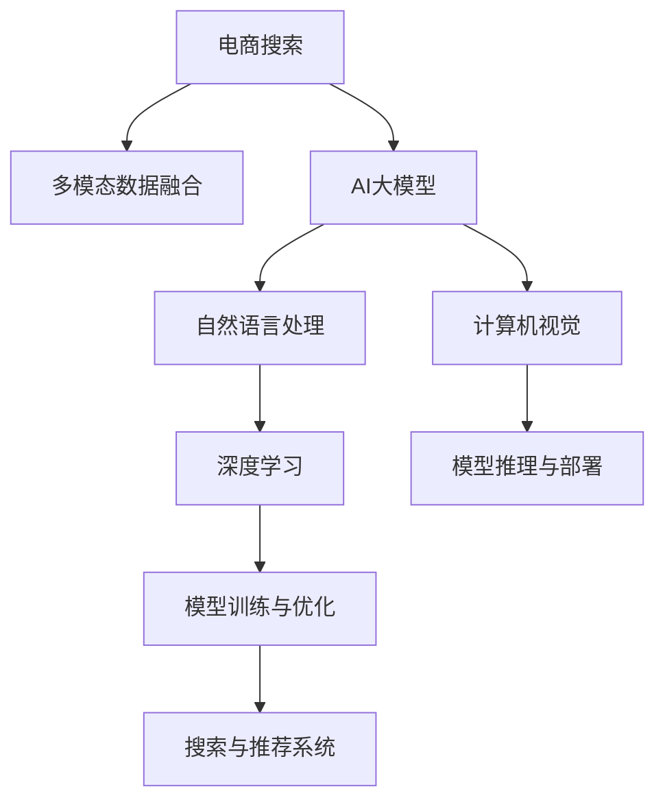

                 

# 电商搜索中的多模态融合：AI大模型的应用

> 关键词：多模态融合, AI大模型, 电商搜索, 商品推荐, 图像识别, 自然语言处理, 深度学习, 数据融合

## 1. 背景介绍

### 1.1 问题由来

电商搜索作为电商业务的核心环节之一，承担着用户获取商品信息的关键角色。随着电商市场的迅速扩张，用户搜索行为的复杂性和个性化需求日益凸显，传统的基于关键词的搜索方式已经无法满足用户的多样化需求。为了更好地理解用户意图，提升搜索体验和推荐效果，电商平台开始引入多种数据源和多种类型的信息，如商品图片、用户评论、商品描述等，以期综合利用这些多模态数据，更精准地完成搜索和推荐任务。

在大数据和深度学习技术的推动下，AI大模型在电商搜索中的应用逐渐成为热门话题。AI大模型不仅具备强大的跨模态信息融合能力，而且可以通过预训练的方式获得丰富的语义表示，显著提升电商搜索和推荐系统的性能。通过结合图像、文本等多种模态数据，AI大模型能够在电商搜索场景中发挥巨大的潜力，为用户提供更加个性化的搜索和推荐体验。

### 1.2 问题核心关键点

在电商搜索中，多模态融合（Multi-modal Fusion）指的是将图像、文本、音频等多种类型的信息进行综合利用，以提升搜索和推荐的效果。AI大模型作为多模态融合的重要工具，具备以下几个核心关键点：

- **预训练与微调**：AI大模型通常首先在大规模无标签数据上进行预训练，获得通用的语言和视觉特征表示。然后在特定任务（如电商搜索）上进行微调，以优化其在特定场景中的性能。

- **跨模态对齐**：不同模态的数据（如图像、文本）通常具有不同的特征表示，通过跨模态对齐技术（如Siamese Network、Triplet Network等），AI大模型可以将这些不同模态的数据对齐到同一语义空间，便于进行融合。

- **多模态融合方法**：AI大模型可以采用多种融合方法，如基于注意力机制的融合、基于元学习的融合、基于图神经网络的融合等，以适应不同的融合需求。

- **端到端训练与优化**：AI大模型可以采用端到端的训练和优化方法，结合不同的模态数据，一次性完成训练和优化，减少中间处理的复杂性。

- **高效推理与部署**：AI大模型通常需要高效的推理引擎和部署方案，以支持大规模、实时化的搜索和推荐任务。

这些关键点共同构成了AI大模型在电商搜索中应用的核心框架，帮助电商平台实现跨模态数据的深度融合，提升搜索和推荐的效果。

## 2. 核心概念与联系

### 2.1 核心概念概述

为了更好地理解AI大模型在电商搜索中的应用，本节将介绍几个密切相关的核心概念：

- **多模态数据融合（Multi-modal Data Fusion）**：将不同模态的数据（如图像、文本、语音等）进行综合利用，以提升信息的完整性和可用性。

- **AI大模型（AI Large Models）**：指在大规模数据上进行预训练的深度神经网络模型，如BERT、GPT-3、DALL·E等。这些模型通常具有亿级参数规模，可以高效地进行跨模态数据融合。

- **自然语言处理（NLP）**：指计算机对人类语言进行处理的科学和技术，涉及文本理解、语音识别、机器翻译等任务。在电商搜索中，自然语言处理可以用于处理用户查询、商品描述等文本信息。

- **计算机视觉（CV）**：指计算机对视觉信息的处理和分析，涉及图像识别、物体检测、图像分割等任务。在电商搜索中，计算机视觉可以用于处理商品图片、视频等视觉信息。

- **深度学习（Deep Learning）**：指使用多层神经网络进行深度特征提取和模型训练的技术，在大数据和计算资源的推动下，深度学习在电商搜索中的应用日益广泛。

这些核心概念之间的逻辑关系可以通过以下Mermaid流程图来展示：



这个流程图展示了电商搜索的核心组件及其相互关系：

1. 电商搜索应用需要处理多模态数据。
2. AI大模型作为核心组件，将不同模态的数据进行融合。
3. AI大模型利用自然语言处理和计算机视觉技术，提取和处理文本和图像信息。
4. 深度学习作为底层技术，支持AI大模型的跨模态信息融合。
5. 通过模型训练与优化，AI大模型能够提升搜索和推荐的性能。
6. 经过推理与部署，AI大模型能够实时处理电商搜索请求，提供个性化推荐。

## 3. 核心算法原理 & 具体操作步骤
### 3.1 算法原理概述

基于多模态融合的电商搜索系统中，AI大模型通常采用端到端的训练和推理方式，结合不同的模态数据，实现搜索和推荐任务。其核心算法原理包括以下几个方面：

- **多模态对齐（Multi-modal Alignment）**：将不同模态的数据对齐到同一语义空间，以方便后续的融合。

- **跨模态信息融合（Cross-modal Information Fusion）**：通过跨模态融合技术，将不同模态的数据进行综合利用，以提升信息的表现力和可用性。

- **基于注意力机制的融合（Attention-based Fusion）**：使用注意力机制对不同模态的数据进行加权融合，以确保关键信息的优先处理。

- **多任务学习（Multi-task Learning）**：通过多任务学习的方式，将搜索和推荐任务同时进行训练，以提升模型的泛化能力。

- **端到端训练与优化（End-to-end Training and Optimization）**：将模型训练和优化过程一次性完成，减少中间处理的复杂性。

### 3.2 算法步骤详解

基于AI大模型的电商搜索系统通常采用以下步骤进行开发和优化：

**Step 1: 准备数据集**

- 收集电商平台的商品信息、用户评论、商品图片等多模态数据。
- 对数据进行预处理，如去除噪声、标注数据等。
- 将不同模态的数据进行拼接，形成统一的数据格式。

**Step 2: 选择与训练AI大模型**

- 选择适合的AI大模型（如BERT、GPT-3等）进行预训练。
- 在大规模无标签数据上进行预训练，获得通用的语言和视觉特征表示。
- 在电商搜索相关的数据集上进行微调，以优化其在特定场景中的性能。

**Step 3: 多模态对齐与融合**

- 对不同模态的数据进行特征提取，得到不同模态的特征向量。
- 使用多模态对齐技术（如Siamese Network、Triplet Network等），将不同模态的特征向量对齐到同一语义空间。
- 使用跨模态融合技术（如Attention-based Fusion、Multi-head Attention等），对不同模态的数据进行加权融合。

**Step 4: 模型优化与评估**

- 使用端到端的训练和优化方法，结合不同模态的数据进行一次性训练和优化。
- 在验证集上进行模型评估，选择最优的模型进行测试。
- 对模型进行调参，优化搜索和推荐的性能。

**Step 5: 模型部署与优化**

- 将优化后的模型部署到电商搜索系统中，实现实时搜索和推荐。
- 使用高效的推理引擎和部署方案，支持大规模、实时化的搜索和推荐任务。
- 定期收集新数据，重新训练和优化模型，以适应数据分布的变化。

### 3.3 算法优缺点

基于AI大模型的电商搜索系统具有以下优点：

- **高效融合多模态数据**：AI大模型能够高效地处理不同模态的数据，综合利用图像、文本、音频等多种信息，提升搜索和推荐的效果。
- **泛化能力强**：经过大规模无标签数据的预训练，AI大模型具备较强的泛化能力，能够适应不同场景下的搜索和推荐需求。
- **实时性高**：AI大模型通常采用端到端的训练和优化方法，能够实时处理搜索请求，提供个性化的推荐。

同时，该方法也存在以下局限性：

- **资源消耗大**：AI大模型通常需要大量的计算资源和存储空间，部署和维护成本较高。
- **训练复杂度高**：多模态数据融合和对齐技术复杂，需要较长的训练时间。
- **模型难以解释**：AI大模型通常作为"黑盒"系统，难以解释其内部工作机制和决策逻辑。
- **数据隐私问题**：在电商搜索中，用户数据涉及隐私，需要严格保护数据安全。

尽管存在这些局限性，但就目前而言，基于AI大模型的电商搜索系统在多模态融合方面仍然具有显著优势，成为电商搜索系统中的主流技术。

### 3.4 算法应用领域

基于AI大模型的电商搜索系统在多个应用领域中得到了广泛的应用：

- **商品推荐**：通过综合利用商品图片、用户评论、商品描述等多模态数据，AI大模型能够提供更加个性化的商品推荐。

- **用户画像**：AI大模型可以通过对用户查询、行为数据等多模态信息进行综合分析，生成用户画像，提升用户的购物体验。

- **广告投放**：AI大模型可以通过分析用户行为和兴趣，实现精准的广告投放，提升广告效果和用户转化率。

- **内容搜索**：AI大模型可以用于搜索和推荐文本内容，帮助用户快速找到所需的信息。

- **客户服务**：AI大模型可以通过处理用户查询和对话，实现智能客服和智能问答，提升客户满意度。

除了上述这些经典应用外，AI大模型还被创新性地应用到更多场景中，如智能仓储、智能配送、个性化营销等，为电商业务带来了新的突破。随着AI大模型和电商搜索技术的不断进步，相信AI大模型将在更多领域得到应用，为电商业务的数字化转型升级提供新的技术路径。

## 4. 数学模型和公式 & 详细讲解  
### 4.1 数学模型构建

在电商搜索中，AI大模型的数学模型通常包括以下几个部分：

- **输入层**：接收不同模态的数据，进行拼接和预处理。

- **编码层**：对不同模态的数据进行特征提取和编码，得到特征向量。

- **对齐层**：使用多模态对齐技术，将不同模态的特征向量对齐到同一语义空间。

- **融合层**：使用跨模态融合技术，对不同模态的数据进行加权融合。

- **输出层**：根据任务类型，输出搜索结果或推荐结果。

### 4.2 公式推导过程

以下我们以基于注意力机制的融合方法为例，推导其基本公式和算法流程。

假设输入数据包括文本信息 $x$ 和图像信息 $y$，分别为 $(x_i, y_i)_{i=1}^N$。使用预训练的BERT模型对文本信息进行编码，得到文本特征向量 $x'$。使用预训练的DALL·E模型对图像信息进行编码，得到图像特征向量 $y'$。使用注意力机制对不同模态的数据进行融合，得到最终的特征向量 $z$。

具体步骤如下：

1. 文本信息 $x$ 和图像信息 $y$ 分别输入到BERT和DALL·E模型中，得到特征向量 $x'$ 和 $y'$。

2. 对不同模态的特征向量进行拼接，得到融合特征向量 $z_0$。

3. 使用注意力机制对 $z_0$ 进行加权融合，得到最终的特征向量 $z$。

其中，注意力机制的计算公式为：

$$
\alpha_i = \frac{e^{\text{score}_i}}{\sum_{j=1}^N e^{\text{score}_j}}
$$

$$
z = \sum_{i=1}^N \alpha_i z_i
$$

其中，$\text{score}_i$ 表示第 $i$ 个特征向量的注意力权重，$z_i$ 表示第 $i$ 个特征向量。

### 4.3 案例分析与讲解

以电商平台上的商品推荐为例，下面给出基于AI大模型的推荐系统设计。

**Step 1: 数据收集与预处理**

- 收集商品图片、用户评论、商品描述等多模态数据。
- 对数据进行去噪、标注、拼接等预处理。

**Step 2: 模型选择与训练**

- 选择预训练的BERT和DALL·E模型，分别对文本和图像信息进行编码。
- 在大规模无标签数据上进行预训练，获得通用的语言和视觉特征表示。
- 在电商推荐相关的数据集上进行微调，以优化其在特定场景中的性能。

**Step 3: 多模态对齐与融合**

- 对不同模态的特征向量进行拼接，得到融合特征向量 $z_0$。
- 使用注意力机制对 $z_0$ 进行加权融合，得到最终的特征向量 $z$。
- 使用回归或分类算法，根据 $z$ 预测用户的行为（如点击、购买等）。

**Step 4: 模型优化与评估**

- 使用端到端的训练和优化方法，结合不同模态的数据进行一次性训练和优化。
- 在验证集上进行模型评估，选择最优的模型进行测试。
- 对模型进行调参，优化搜索和推荐的性能。

**Step 5: 模型部署与优化**

- 将优化后的模型部署到电商推荐系统中，实现实时推荐。
- 使用高效的推理引擎和部署方案，支持大规模、实时化的推荐任务。
- 定期收集新数据，重新训练和优化模型，以适应数据分布的变化。

## 5. 项目实践：代码实例和详细解释说明
### 5.1 开发环境搭建

在进行电商搜索的多模态融合实践前，我们需要准备好开发环境。以下是使用Python进行TensorFlow开发的环境配置流程：

1. 安装Anaconda：从官网下载并安装Anaconda，用于创建独立的Python环境。

2. 创建并激活虚拟环境：
```bash
conda create -n tf-env python=3.8 
conda activate tf-env
```

3. 安装TensorFlow：根据CUDA版本，从官网获取对应的安装命令。例如：
```bash
conda install tensorflow=2.7.0 -c conda-forge
```

4. 安装TensorFlow扩展库：
```bash
pip install tensorflow-addons tensorflow-datasets tensorflow-hub
```

5. 安装各类工具包：
```bash
pip install numpy pandas scikit-learn matplotlib tqdm jupyter notebook ipython
```

完成上述步骤后，即可在`tf-env`环境中开始多模态融合实践。

### 5.2 源代码详细实现

下面我们以商品推荐为例，给出使用TensorFlow对BERT和DALL·E模型进行多模态融合的Python代码实现。

首先，定义模型和优化器：

```python
import tensorflow as tf
from transformers import BertForSequenceClassification, TFAutoModelForImageClassification
from tensorflow.keras.optimizers import Adam

# 选择预训练模型
text_model = BertForSequenceClassification.from_pretrained('bert-base-uncased', num_labels=2)
image_model = TFAutoModelForImageClassification.from_pretrained('DALL·E', num_labels=2)

# 定义损失函数和优化器
loss_fn = tf.keras.losses.CategoricalCrossentropy()
optimizer = Adam(learning_rate=1e-5)
```

然后，定义输入和输出数据：

```python
# 定义输入数据
def make_dataset(texts, images):
    return tf.data.Dataset.from_tensor_slices((texts, images)).map(text_preprocess, image_preprocess)

# 定义输出数据
def make_labels(texts):
    return tf.data.Dataset.from_tensor_slices(texts).map(text_label)

# 定义数据预处理函数
def text_preprocess(text):
    # 将文本转化为Bert可接受的格式
    tokenizer = BertTokenizer.from_pretrained('bert-base-uncased')
    return tokenizer.encode_plus(text, max_length=256, padding='max_length', truncation=True, return_tensors='tf')

def image_preprocess(image):
    # 将图像转化为DALL·E可接受的格式
    image = tf.image.convert_image_dtype(image, tf.float32) / 255.0
    image = tf.image.resize(image, (224, 224))
    return image

def text_label(text):
    # 将文本转化为分类标签
    labels = {'positive': 1, 'negative': 0}
    return tf.constant([labels[text]])

# 创建数据集
texts = ['product A', 'product B', 'product C']
images = [load_image('product_A.jpg'), load_image('product_B.jpg'), load_image('product_C.jpg')]
dataset = make_dataset(texts, images)
labels = make_labels(texts)
```

接着，定义模型和训练过程：

```python
# 定义多模态融合模型
class MultimodalModel(tf.keras.Model):
    def __init__(self):
        super(MultimodalModel, self).__init__()
        self.text_model = text_model
        self.image_model = image_model

    def call(self, inputs):
        text, image = inputs
        text_output = self.text_model(text)
        image_output = self.image_model(image)
        fused_output = tf.concat([text_output, image_output], axis=-1)
        return tf.keras.layers.Dense(2, activation='softmax')(fused_output)

model = MultimodalModel()

# 定义训练过程
@tf.function
def train_step(text, image, label):
    with tf.GradientTape() as tape:
        output = model([text, image])
        loss = loss_fn(output, label)
    grads = tape.gradient(loss, model.trainable_variables)
    optimizer.apply_gradients(zip(grads, model.trainable_variables))

# 训练模型
for epoch in range(10):
    for text, image, label in dataset:
        train_step(text, image, label)
```

最后，定义评估和测试过程：

```python
# 定义评估过程
@tf.function
def evaluate(text, image, label):
    with tf.GradientTape() as tape:
        output = model([text, image])
        loss = loss_fn(output, label)
    grads = tape.gradient(loss, model.trainable_variables)
    return loss.numpy(), grads

# 评估模型
for text, image, label in dataset:
    loss, grads = evaluate(text, image, label)
    print('Epoch {}, Loss: {}'.format(epoch+1, loss))

# 测试模型
test_texts = ['product A', 'product B', 'product C']
test_images = [load_image('product_A.jpg'), load_image('product_B.jpg'), load_image('product_C.jpg')]
test_labels = make_labels(test_texts)
for text, image, label in zip(test_texts, test_images, test_labels):
    output = model([text, image])
    predicted_label = tf.argmax(output.numpy(), axis=-1)
    print('Prediction for {}: {}'.format(text, predicted_label.numpy()))
```

以上就是使用TensorFlow对BERT和DALL·E模型进行多模态融合的完整代码实现。可以看到，得益于TensorFlow的强大封装，我们可以用相对简洁的代码完成模型训练和评估。

### 5.3 代码解读与分析

让我们再详细解读一下关键代码的实现细节：

**MultimodalModel类**：
- `__init__`方法：初始化BERT和DALL·E模型。
- `call`方法：定义多模态融合的逻辑，使用concat操作将文本和图像特征向量拼接，最后通过全连接层输出预测结果。

**数据预处理函数**：
- `text_preprocess`：将文本转化为Bert可接受的格式，包括分词、截断、填充等操作。
- `image_preprocess`：将图像转化为DALL·E可接受的格式，包括归一化、缩放等操作。
- `text_label`：将文本转化为分类标签，用于输出层的比较。

**训练过程**：
- 定义训练函数`train_step`，使用梯度下降算法更新模型参数。
- 在每个epoch内，对数据集进行迭代训练，逐步优化模型。
- 使用`@tf.function`装饰器对训练过程进行优化，提高计算效率。

**评估和测试过程**：
- 定义评估函数`evaluate`，计算模型在每个样本上的损失和梯度。
- 在每个epoch结束后，输出训练过程中的平均损失。
- 在测试集上评估模型性能，输出预测结果。

可以看到，TensorFlow配合TensorFlow Addons、Transformers库等工具，使得多模态融合的代码实现变得简洁高效。开发者可以将更多精力放在数据处理、模型改进等高层逻辑上，而不必过多关注底层的实现细节。

当然，工业级的系统实现还需考虑更多因素，如模型的保存和部署、超参数的自动搜索、更灵活的任务适配层等。但核心的多模态融合范式基本与此类似。

## 6. 实际应用场景
### 6.1 电商搜索系统

基于多模态融合的AI大模型，在电商搜索系统中得到了广泛的应用。通过综合利用商品图片、用户评论、商品描述等多模态数据，AI大模型能够更精准地完成搜索和推荐任务，提升用户购物体验。

在技术实现上，可以通过收集电商平台的商品信息、用户评论、商品描述等多模态数据，将文本信息输入BERT模型进行编码，将图像信息输入DALL·E模型进行编码，然后通过注意力机制进行加权融合，得到最终的特征向量。最后，使用回归或分类算法，根据特征向量进行预测，输出搜索结果或推荐结果。

### 6.2 智能客服系统

智能客服系统是电商平台的重要组成部分，能够提升客户咨询体验，减轻人工客服的压力。通过使用多模态融合技术，AI大模型可以处理用户查询和对话，实现智能客服和智能问答，提升客户满意度。

在技术实现上，可以收集用户查询和对话历史数据，将文本信息输入BERT模型进行编码，将语音信息输入Transformer模型进行编码，然后通过注意力机制进行加权融合，得到最终的特征向量。最后，使用回归或分类算法，根据特征向量进行预测，输出回复结果。

### 6.3 内容推荐系统

内容推荐系统是电商平台的重要功能之一，能够帮助用户快速找到所需的信息。通过使用多模态融合技术，AI大模型可以处理文本信息、图像信息等多种信息，提升推荐效果。

在技术实现上，可以收集用户浏览、点击、评论、分享等行为数据，提取和用户交互的内容信息。将文本信息输入BERT模型进行编码，将图像信息输入DALL·E模型进行编码，然后通过注意力机制进行加权融合，得到最终的特征向量。最后，使用回归或分类算法，根据特征向量进行预测，输出推荐结果。

### 6.4 未来应用展望

随着AI大模型和多模态融合技术的不断发展，其在电商搜索中的应用前景广阔。未来，AI大模型可以融合更多的模态数据，如音频、视频等，提升搜索和推荐的效果。同时，随着深度学习技术的发展，AI大模型的性能也将进一步提升，带来更多的应用场景。

## 7. 工具和资源推荐
### 7.1 学习资源推荐

为了帮助开发者系统掌握AI大模型和多模态融合的理论基础和实践技巧，这里推荐一些优质的学习资源：

1. **《深度学习理论与实践》系列博文**：由大模型技术专家撰写，深入浅出地介绍了深度学习的基本原理和前沿应用。

2. **CS231n《卷积神经网络和视觉识别》课程**：斯坦福大学开设的计算机视觉明星课程，涵盖视觉识别、图像处理等核心内容，是入门计算机视觉的必选课程。

3. **《自然语言处理基础》书籍**：介绍自然语言处理的基本原理和应用，涵盖文本理解、语音识别、机器翻译等任务。

4. **Transformers库官方文档**：提供丰富的预训练语言模型资源和微调样例代码，是进行多模态融合开发的必备资料。

5. **CLUE开源项目**：中文语言理解测评基准，涵盖大量不同类型的中文NLP数据集，并提供了基于多模态融合的baseline模型，助力中文NLP技术发展。

通过对这些资源的学习实践，相信你一定能够快速掌握AI大模型和多模态融合的精髓，并用于解决实际的电商搜索问题。

### 7.2 开发工具推荐

高效的开发离不开优秀的工具支持。以下是几款用于AI大模型和多模态融合开发的常用工具：

1. **TensorFlow**：基于Python的开源深度学习框架，灵活动态的计算图，适合快速迭代研究。主流的预训练语言模型都有TensorFlow版本的实现。

2. **PyTorch**：基于Python的开源深度学习框架，动态计算图，适合灵活的模型设计和优化。

3. **TensorFlow Addons**：TensorFlow的扩展库，提供更多模型和优化算法，支持更多硬件平台。

4. **Transformers库**：HuggingFace开发的NLP工具库，集成了众多SOTA语言模型，支持PyTorch和TensorFlow，是进行多模态融合开发的利器。

5. **Weights & Biases**：模型训练的实验跟踪工具，可以记录和可视化模型训练过程中的各项指标，方便对比和调优。与主流深度学习框架无缝集成。

6. **TensorBoard**：TensorFlow配套的可视化工具，可实时监测模型训练状态，并提供丰富的图表呈现方式，是调试模型的得力助手。

合理利用这些工具，可以显著提升AI大模型和多模态融合任务的开发效率，加快创新迭代的步伐。

### 7.3 相关论文推荐

AI大模型和多模态融合技术的发展源于学界的持续研究。以下是几篇奠基性的相关论文，推荐阅读：

1. **Attention is All You Need**：提出了Transformer结构，开启了NLP领域的预训练大模型时代。

2. **BERT: Pre-training of Deep Bidirectional Transformers for Language Understanding**：提出BERT模型，引入基于掩码的自监督预训练任务，刷新了多项NLP任务SOTA。

3. **Vision and Language**：提出DALL·E模型，将视觉和语言信息进行联合训练，取得了突破性的效果。

4. **In Defense of Multi-Task Learning**：提出多任务学习的理论框架，探讨了多任务学习的各种方法。

5. **Multi-modal Fusion and Attention Mechanism**：探讨了多模态融合的各种方法，包括基于注意力机制的融合、基于元学习的融合等。

6. **Attention-based Fusion in Multi-modal Data Processing**：介绍了多模态融合中的注意力机制，用于加权融合不同模态的数据。

这些论文代表了大模型和多模态融合技术的发展脉络。通过学习这些前沿成果，可以帮助研究者把握学科前进方向，激发更多的创新灵感。

## 8. 总结：未来发展趋势与挑战

### 8.1 总结

本文对基于多模态融合的AI大模型在电商搜索中的应用进行了全面系统的介绍。首先阐述了多模态融合和AI大模型的研究背景和意义，明确了其在电商搜索中的重要价值。其次，从原理到实践，详细讲解了多模态融合的数学原理和关键步骤，给出了多模态融合任务开发的完整代码实例。同时，本文还广泛探讨了多模态融合技术在电商搜索中的多个应用场景，展示了其广阔的前景。最后，本文精选了多模态融合技术的各类学习资源，力求为读者提供全方位的技术指引。

通过本文的系统梳理，可以看到，基于多模态融合的AI大模型在电商搜索中应用前景广阔，能够显著提升搜索和推荐的效果，提升用户购物体验。未来，随着AI大模型和多模态融合技术的不断发展，其在电商搜索中的应用将更加深入，带来更多的创新和突破。

### 8.2 未来发展趋势

展望未来，AI大模型和多模态融合技术将呈现以下几个发展趋势：

1. **跨模态融合范式多样化**：未来将出现更多的跨模态融合方法，如基于Transformer、图神经网络等的新型融合方式。

2. **多模态数据类型拓展**：除了文本、图像等传统模态，音频、视频等新兴模态也将成为电商搜索的重要数据源。

3. **模型泛化能力增强**：随着预训练模型的不断演进，AI大模型将具备更强的泛化能力，能够适应更多场景下的搜索和推荐任务。

4. **实时性提升**：通过优化模型结构和推理引擎，提升电商搜索系统的实时处理能力，实现实时搜索和推荐。

5. **隐私保护技术进步**：随着数据隐私问题的日益突出，如何保护用户隐私成为电商搜索中的重要研究方向。

6. **跨模态对齐技术优化**：多模态对齐技术是跨模态融合的基础，未来的研究将进一步优化对齐方法，提升融合效果。

以上趋势凸显了AI大模型和多模态融合技术在电商搜索中的广阔前景。这些方向的探索发展，必将进一步提升电商搜索系统的性能和用户体验，为电商业务的数字化转型升级提供新的技术路径。

### 8.3 面临的挑战

尽管AI大模型和多模态融合技术已经取得了瞩目成就，但在迈向更加智能化、普适化应用的过程中，它仍面临着诸多挑战：

1. **资源消耗大**：AI大模型和多模态融合需要大量的计算资源和存储空间，部署和维护成本较高。

2. **训练复杂度高**：多模态数据融合和对齐技术复杂，需要较长的训练时间。

3. **模型难以解释**：AI大模型和多模态融合模型通常作为"黑盒"系统，难以解释其内部工作机制和决策逻辑。

4. **数据隐私问题**：在电商搜索中，用户数据涉及隐私，需要严格保护数据安全。

5. **跨模态对齐精度**：不同模态的数据特征差异大，跨模态对齐技术的精度直接影响融合效果。

尽管存在这些局限性，但就目前而言，基于AI大模型的电商搜索系统在多模态融合方面仍然具有显著优势，成为电商搜索系统中的主流技术。

### 8.4 未来突破

面对AI大模型和多模态融合所面临的种种挑战，未来的研究需要在以下几个方面寻求新的突破：

1. **探索无监督和半监督多模态融合方法**：摆脱对大规模标注数据的依赖，利用自监督学习、主动学习等无监督和半监督范式，最大限度利用非结构化数据，实现更加灵活高效的多模态融合。

2. **研究多模态融合的高效推理方法**：开发更加高效的推理引擎和优化算法，支持大规模、实时化的电商搜索任务。

3. **引入更多先验知识**：将符号化的先验知识，如知识图谱、逻辑规则等，与神经网络模型进行巧妙融合，引导多模态融合过程学习更准确、合理的语言模型。

4. **结合因果分析和博弈论工具**：将因果分析方法引入多模态融合模型，识别出模型决策的关键特征，增强输出解释的因果性和逻辑性。

5. **纳入伦理道德约束**：在模型训练目标中引入伦理导向的评估指标，过滤和惩罚有偏见、有害的输出倾向。同时加强人工干预和审核，建立模型行为的监管机制，确保输出符合人类价值观和伦理道德。

这些研究方向的探索，必将引领AI大模型和多模态融合技术迈向更高的台阶，为构建安全、可靠、可解释、可控的智能系统铺平道路。面向未来，AI大模型和多模态融合技术还需要与其他人工智能技术进行更深入的融合，如知识表示、因果推理、强化学习等，多路径协同发力，共同推动自然语言理解和智能交互系统的进步。只有勇于创新、敢于突破，才能不断拓展语言模型的边界，让智能技术更好地造福人类社会。

## 9. 附录：常见问题与解答

**Q1：电商搜索中如何选择合适的AI大模型？**

A: 电商搜索中应根据具体的业务需求选择合适的AI大模型。对于文本信息较多的场景，可以选择BERT等预训练语言模型；对于图像信息较多的场景，可以选择DALL·E等预训练视觉模型。综合考虑多模态融合的需求，可以选择跨模态融合能力强的模型，如BERT和DALL·E的结合体。

**Q2：AI大模型在电商搜索中如何进行微调？**

A: AI大模型在电商搜索中需要进行微调以适应特定的业务需求。微调的步骤包括：数据收集与预处理、模型选择与训练、多模态对齐与融合、模型优化与评估、模型部署与优化。微调过程中需要选择合适的损失函数、优化器等，并进行超参数调优。

**Q3：AI大模型在电商搜索中如何进行端到端训练与优化？**

A: AI大模型在电商搜索中进行端到端训练与优化的步骤如下：将不同模态的数据进行拼接，得到融合特征向量；使用多模态融合技术，如注意力机制，对融合特征向量进行加权融合；使用回归或分类算法，根据融合特征向量进行预测，输出搜索结果或推荐结果；在验证集上进行模型评估，选择最优的模型进行测试；对模型进行调参，优化搜索和推荐的性能。

**Q4：AI大模型在电商搜索中如何进行多模态对齐？**

A: AI大模型在电商搜索中进行多模态对齐的步骤包括：对不同模态的数据进行特征提取，得到不同模态的特征向量；使用多模态对齐技术，如Siamese Network、Triplet Network等，将不同模态的特征向量对齐到同一语义空间；使用跨模态融合技术，如Attention-based Fusion、Multi-head Attention等，对不同模态的数据进行加权融合。

**Q5：AI大模型在电商搜索中如何进行实时搜索和推荐？**

A: AI大模型在电商搜索中进行实时搜索和推荐的步骤包括：将用户查询和行为数据输入到多模态融合模型中，得到融合特征向量；使用回归或分类算法，根据融合特征向量进行预测，输出搜索结果或推荐结果；在实时搜索系统中，将预测结果返回给用户，实现实时搜索和推荐。

通过本文的系统梳理，可以看到，基于多模态融合的AI大模型在电商搜索中应用前景广阔，能够显著提升搜索和推荐的效果，提升用户购物体验。未来，随着AI大模型和多模态融合技术的不断发展，其在电商搜索中的应用将更加深入，带来更多的创新和突破。

---

作者：禅与计算机程序设计艺术 / Zen and the Art of Computer Programming

