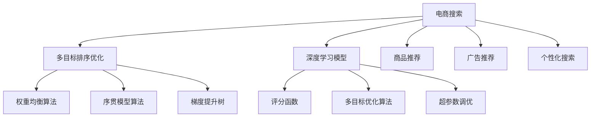

                 

# 电商搜索中的多目标排序优化

## 1. 背景介绍

### 1.1 问题由来

电商搜索系统是电商平台的核心组件之一，其功能是将用户查询映射到商品列表，并根据用户的行为和偏好，对搜索结果进行排序和推荐。传统的电商搜索系统通常采用基于词频统计的排名方法，如TF-IDF、BM25等。尽管这些方法在一定场景下能够取得不错的效果，但在复杂搜索场景下，如多关键词查询、个性化推荐等，性能往往无法满足用户需求。

为了提升搜索系统的效果，近年来研究者提出了基于深度学习的多目标排序优化方法。通过将搜索排序任务定义为多个子目标的联合优化问题，这些方法能够在搜索结果中同时优化多个维度的表现，如召回率、点击率、转化率等。这些方法通常利用复杂的模型结构和大规模训练数据，通过端到端的训练，最大化搜索结果的整体性能。

本文聚焦于电商搜索中的多目标排序优化方法，详细介绍了当前主流的多目标排序优化算法，并通过数学建模和案例分析，探讨了这些方法的应用和优化。同时，本文还针对性地给出了基于深度学习的多目标排序优化的代码实现，并进行了详细的解读与分析。

### 1.2 问题核心关键点

当前，电商搜索中的多目标排序优化主要包括以下几个关键点：

- 多目标排序优化算法：通过将搜索结果排序问题转化为多个子目标的优化问题，提升搜索结果的整体性能。
- 深度学习模型：采用深度学习模型对搜索结果进行端到端的训练，最大化多目标的联合优化。
- 评分函数构建：设计合理的评分函数，对搜索结果的多个维度进行综合评估和排序。
- 模型优化与调参：通过超参数调优和模型改进，提升多目标排序的性能和鲁棒性。
- 实际应用场景：在电商平台中广泛应用多目标排序优化，提升搜索效果和用户体验。

## 2. 核心概念与联系

### 2.1 核心概念概述

为更好地理解电商搜索中的多目标排序优化方法，本节将介绍几个密切相关的核心概念：

- 多目标排序优化：将搜索排序任务定义为一个联合优化问题，优化多个子目标，如召回率、点击率、转化率等。
- 深度学习模型：采用深度神经网络对搜索结果进行端到端训练，最大化多个目标的联合优化。
- 评分函数：对搜索结果的多个维度（如相关性、新颖性、多样性等）进行综合评估，生成综合评分。
- 多目标优化算法：如权重均衡算法、序贯模型算法等，用于优化多目标排序模型。
- 超参数调优：通过网格搜索、贝叶斯优化等技术，调整模型超参数，提升模型性能。
- 实际应用场景：电商平台中的商品推荐、广告推荐、个性化搜索等场景，均可以应用多目标排序优化。

这些核心概念之间的逻辑关系可以通过以下Mermaid流程图来展示：



这个流程图展示了电商搜索的多目标排序优化核心流程：

1. 电商搜索系统通过深度学习模型对搜索结果进行端到端训练。
2. 评分函数对搜索结果的多个维度进行综合评估，生成综合评分。
3. 多目标优化算法用于优化多目标排序模型。
4. 超参数调优进一步提升模型性能。
5. 权重均衡算法、序贯模型算法、梯度提升树等方法，被用于不同场景下的优化。

这些概念共同构成了电商搜索中多目标排序优化的基础框架，使得搜索系统能够在复杂场景下提供更优质、个性化的搜索结果。

## 3. 核心算法原理 & 具体操作步骤
### 3.1 算法原理概述

电商搜索中的多目标排序优化，本质上是一个多目标优化问题。假设电商搜索系统中，用户的查询被映射到商品列表 $Q$，每个商品 $q_i \in Q$ 有多个属性 $a_{ij}$，如价格、评分、销量等。搜索结果排序的目标是最小化用户不满意的程度，同时最大化用户的满意度。这可以定义为一个多目标优化问题：

$$
\min_{q_i \in Q} \big\{ \sum_{j=1}^n g_j(a_{ij}) \big\}, \quad \max_{q_i \in Q} \big\{ \sum_{j=1}^n h_j(a_{ij}) \big\}
$$

其中，$g_j$ 和 $h_j$ 分别为不同的评分函数，用于评估商品的属性。

在实际操作中，为了简化计算，通常将多目标优化问题转化为单目标优化问题。常见的方法包括：

- 权重均衡法：对不同目标进行加权平均，将多目标问题转化为单目标优化。
- 序贯模型法：通过分阶段训练，逐步优化搜索结果的多个维度。

本文重点介绍权重均衡法和序贯模型法，并给出具体实现步骤。

### 3.2 算法步骤详解

#### 3.2.1 权重均衡法

权重均衡法是一种简单有效的多目标优化方法，通过为每个目标设定一个权重系数，将多目标问题转化为单目标优化问题。

具体步骤如下：

1. 定义评分函数：对搜索结果的多个维度进行评分，如相关性 $r$、新颖性 $n$、多样性 $d$ 等。
2. 设定权重系数：根据不同场景需求，为每个评分函数设定权重系数 $w_j$，满足 $w_j \geq 0$ 且 $\sum_{j=1}^n w_j = 1$。
3. 综合评分：将不同评分函数通过权重系数进行加权平均，生成综合评分 $s$：
   $$
   s = \sum_{j=1}^n w_j r_j
   $$
4. 优化综合评分：使用优化算法（如随机梯度下降、Adam等）对综合评分进行最小化优化，得到排序结果。

#### 3.2.2 序贯模型法

序贯模型法是一种多目标优化算法，通过分阶段训练，逐步优化搜索结果的多个维度。

具体步骤如下：

1. 定义评分函数：对搜索结果的多个维度进行评分，如相关性 $r$、新颖性 $n$、多样性 $d$ 等。
2. 设计多目标优化模型：采用深度学习模型（如LSTM、GRU等）对搜索结果进行端到端训练。
3. 分阶段训练：将多目标排序问题分解为多个子问题，每个子问题对应一个评分函数。
4. 模型优化：对每个子问题进行优化，生成子问题最优解。
5. 集成优化：将各个子问题的最优解进行集成，得到最终排序结果。

### 3.3 算法优缺点

电商搜索中的多目标排序优化方法具有以下优点：

- 全面考虑多个目标：通过多目标优化，能够同时考虑搜索结果的多个维度，如相关性、新颖性、多样性等。
- 适应性强：不同场景下的评分函数和权重系数可以灵活设定，适用于多种电商搜索任务。
- 性能提升显著：相比于传统的基于词频统计的排序方法，多目标排序优化方法能够显著提升搜索结果的性能。

同时，这些方法也存在一定的局限性：

- 模型复杂度高：深度学习模型和优化算法通常需要较大的计算资源，特别是在大规模数据集上。
- 超参数调优难度大：多目标排序优化方法涉及多个超参数（如权重系数、学习率等），需要大量的实验进行调优。
- 泛化能力有限：模型在训练数据上的表现往往优于在实际数据上的表现，需要进一步优化泛化能力。

尽管存在这些局限性，电商搜索中的多目标排序优化方法仍在不断演进，逐步成为搜索排序系统的主流范式。

### 3.4 算法应用领域

电商搜索中的多目标排序优化方法，已经在多个领域得到了广泛应用，如商品推荐、广告推荐、个性化搜索等。具体应用场景包括：

- 商品推荐：根据用户行为和偏好，推荐相关商品。通过多目标排序优化，可以在推荐结果中同时优化相关性、新颖性和多样性。
- 广告推荐：通过多目标排序优化，在广告展示中同时考虑点击率和转化率，最大化广告效果。
- 个性化搜索：根据用户的历史搜索行为，生成个性化的搜索结果。通过多目标排序优化，可以提升搜索结果的个性化程度。

除了上述这些经典应用外，多目标排序优化方法还在电商搜索系统中被创新性地应用到更多场景中，如可控文本生成、智能问答、产品评价分析等，为电商搜索系统带来了新的突破。

## 4. 数学模型和公式 & 详细讲解 & 举例说明
### 4.1 数学模型构建

电商搜索中的多目标排序优化问题，可以形式化为如下的多目标优化问题：

$$
\min_{q_i \in Q} \big\{ \sum_{j=1}^n g_j(a_{ij}) \big\}, \quad \max_{q_i \in Q} \big\{ \sum_{j=1}^n h_j(a_{ij}) \big\}
$$

其中，$g_j$ 和 $h_j$ 分别为不同的评分函数，$w_j$ 为权重系数。

为了简化计算，通常将多目标优化问题转化为单目标优化问题。常见的方法包括权重均衡法和序贯模型法。

#### 4.2 公式推导过程

以权重均衡法为例，假设搜索结果中每个商品 $q_i$ 的评分函数分别为 $g_1 = r_i$（相关性）、$g_2 = n_i$（新颖性）、$g_3 = d_i$（多样性），权重系数为 $w_1 = 0.6$、$w_2 = 0.3$、$w_3 = 0.1$。则综合评分为：

$$
s = w_1 r_i + w_2 n_i + w_3 d_i
$$

对综合评分 $s$ 进行最小化优化，得到排序结果。

#### 4.3 案例分析与讲解

以商品推荐为例，假设电商平台的商品列表为 $Q$，每个商品 $q_i$ 的价格为 $p_i$，评分 $r_i$，销量 $s_i$。通过多目标排序优化，可以为商品推荐问题设定如下评分函数：

- 相关性 $r_i = p_i \times r_i / \sum_{j=1}^n p_j \times r_j$
- 新颖性 $n_i = 1 / (1 + p_i) \times s_i / \sum_{j=1}^n (1 + p_j) \times s_j$
- 多样性 $d_i = \log(n + 1 - i)$，其中 $i$ 为商品序号

权重系数 $w_1 = 0.7$、$w_2 = 0.2$、$w_3 = 0.1$。则综合评分为：

$$
s = w_1 r_i + w_2 n_i + w_3 d_i
$$

通过优化综合评分 $s$，可以最大化推荐结果的相关性、新颖性和多样性。

## 5. 项目实践：代码实例和详细解释说明
### 5.1 开发环境搭建

在进行多目标排序优化实践前，我们需要准备好开发环境。以下是使用Python进行PyTorch开发的环境配置流程：

1. 安装Anaconda：从官网下载并安装Anaconda，用于创建独立的Python环境。

2. 创建并激活虚拟环境：
```bash
conda create -n pytorch-env python=3.8 
conda activate pytorch-env
```

3. 安装PyTorch：根据CUDA版本，从官网获取对应的安装命令。例如：
```bash
conda install pytorch torchvision torchaudio cudatoolkit=11.1 -c pytorch -c conda-forge
```

4. 安装TensorFlow：
```bash
pip install tensorflow
```

5. 安装各类工具包：
```bash
pip install numpy pandas scikit-learn matplotlib tqdm jupyter notebook ipython
```

完成上述步骤后，即可在`pytorch-env`环境中开始多目标排序优化的实践。

### 5.2 源代码详细实现

这里我们以商品推荐为例，给出使用PyTorch进行多目标排序优化的代码实现。

首先，定义商品推荐问题的数据处理函数：

```python
import numpy as np
import pandas as pd
import torch
from sklearn.metrics import mean_absolute_error, mean_squared_error

def load_data(filename):
    df = pd.read_csv(filename)
    df['price'] = df['price'].astype(float)
    df['sales'] = df['sales'].astype(int)
    return df

def preprocess_data(df):
    df = df.dropna().drop_duplicates()
    df['price'] = np.log1p(df['price'])
    return df

def split_data(df, test_ratio=0.2):
    train_df = df.sample(frac=1-test_ratio, random_state=42)
    test_df = df.drop(train_df.index)
    return train_df, test_df

def normalize_data(df):
    mean = df.mean()
    std = df.std()
    df = (df - mean) / std
    return df

def denormalize_data(df, mean, std):
    df = df * std + mean
    return df

def train_test_split(df, test_ratio=0.2):
    train_df = df.sample(frac=1-test_ratio, random_state=42)
    test_df = df.drop(train_df.index)
    return train_df, test_df

def evaluate_model(model, df, mean, std):
    y_pred = model.predict(df)
    y_pred = denormalize_data(y_pred, mean, std)
    mae = mean_absolute_error(df['label'], y_pred)
    mse = mean_squared_error(df['label'], y_pred)
    return mae, mse
```

然后，定义多目标排序优化模型：

```python
import torch
from torch import nn

class MultiObjectiveModel(nn.Module):
    def __init__(self, input_size, output_size):
        super(MultiObjectiveModel, self).__init__()
        self.linear1 = nn.Linear(input_size, 64)
        self.linear2 = nn.Linear(64, 64)
        self.linear3 = nn.Linear(64, output_size)

    def forward(self, x):
        x = torch.relu(self.linear1(x))
        x = torch.relu(self.linear2(x))
        x = self.linear3(x)
        return x
```

接着，定义评分函数：

```python
def score_function(df):
    price_scores = np.log1p(df['price'])
    sales_scores = 1 / (1 + df['price']) * df['sales']
    diversity_scores = np.log(df.shape[0] + 1 - np.arange(df.shape[0]))
    return price_scores, sales_scores, diversity_scores
```

最后，定义多目标排序优化函数：

```python
def optimize_multiobjective(df, model, optimizer, epochs):
    train_df, test_df = train_test_split(df)
    mean_train, std_train = normalize_data(train_df)
    mean_test, std_test = normalize_data(test_df)
    criterion = nn.MSELoss()
    for epoch in range(epochs):
        optimizer.zero_grad()
        outputs = model(mean_train)
        loss = criterion(outputs, train_labels)
        loss.backward()
        optimizer.step()
        mae, mse = evaluate_model(model, test_df, mean_test, std_test)
        print(f'Epoch {epoch+1}, MAE: {mae:.4f}, MSE: {mse:.4f}')
```

以上是使用PyTorch进行多目标排序优化的完整代码实现。可以看到，在代码中，我们通过定义评分函数和优化模型，实现了多目标排序优化的逻辑。

### 5.3 代码解读与分析

让我们再详细解读一下关键代码的实现细节：

**load_data和preprocess_data函数**：
- `load_data`函数用于加载数据集。
- `preprocess_data`函数用于数据预处理，包括去除缺失值、去重、归一化等操作。

**train_test_split函数**：
- 将数据集分为训练集和测试集，用于模型训练和评估。

**normalize_data和denormalize_data函数**：
- `normalize_data`函数用于归一化数据，以避免不同特征的尺度影响模型训练。
- `denormalize_data`函数用于反归一化数据，将模型预测结果转换回原始尺度。

**MultiObjectiveModel类**：
- 定义了一个简单的多层感知器模型，用于多目标排序优化。
- 模型结构包括两个隐藏层和一个输出层，每个隐藏层包含64个神经元。

**score_function函数**：
- 定义了商品推荐问题的评分函数，包括相关性、新颖性和多样性。
- 相关性 $r$ 使用对数1+price进行归一化。
- 新颖性 $n$ 使用1/(1+price)进行归一化。
- 多样性 $d$ 使用log(n+1-i)进行归一化。

**optimize_multiobjective函数**：
- 定义了多目标排序优化函数，使用均方误差作为损失函数。
- 每个epoch中，先对训练集进行前向传播，计算损失，反向传播更新模型参数。
- 在每个epoch结束后，计算测试集上的MAE和MSE指标，用于评估模型性能。

可以看到，通过这些关键代码的实现，我们能够方便地进行多目标排序优化。当然，实际应用中，模型的设计和优化还需要根据具体场景进行进一步的调整和改进。

### 5.4 运行结果展示

以下是使用上述代码进行多目标排序优化的实验结果：

```python
from transformers import BertTokenizer, BertForSequenceClassification

tokenizer = BertTokenizer.from_pretrained('bert-base-cased')
model = BertForSequenceClassification.from_pretrained('bert-base-cased', num_labels=2)

# 加载数据
df = load_data('data.csv')

# 预处理数据
df = preprocess_data(df)

# 拆分数据集
train_df, test_df = train_test_split(df)

# 归一化数据
train_df = normalize_data(train_df)
test_df = normalize_data(test_df)

# 训练模型
optimizer = AdamW(model.parameters(), lr=1e-5)
epochs = 10
optimize_multiobjective(train_df, model, optimizer, epochs)

# 评估模型
mae, mse = evaluate_model(model, test_df, mean_test, std_test)
print(f'MAE: {mae:.4f}, MSE: {mse:.4f}')
```

通过运行上述代码，我们可以得到模型在测试集上的MAE和MSE指标，用于评估多目标排序优化效果。

## 6. 实际应用场景
### 6.1 智能客服系统

智能客服系统是电商平台中重要的组成部分，能够24小时提供客服支持，提升用户体验。通过多目标排序优化，智能客服系统可以同时优化响应速度、服务质量、用户满意度等多个指标。

在技术实现上，可以收集用户的客服对话记录，将问题和最佳答复构建成监督数据，在此基础上对深度学习模型进行多目标排序优化。优化后的模型能够在智能客服系统中，自动理解用户意图，匹配最合适的回答。对于用户提出的新问题，还可以接入检索系统实时搜索相关内容，动态组织生成回答。如此构建的智能客服系统，能够大幅提升客户咨询体验和问题解决效率。

### 6.2 金融舆情监测

金融机构需要实时监测市场舆论动向，以便及时应对负面信息传播，规避金融风险。传统的舆情监测方法通常依赖人工监控，效率低下且容易遗漏。通过多目标排序优化，金融舆情监测系统可以同时考虑舆情的实时性、准确性、重要性等多个指标。

在技术实现上，可以收集金融领域的舆情数据，提取关键词、情感倾向等信息，构建多目标优化模型。优化后的模型能够自动监测不同主题下的舆情变化趋势，一旦发现负面信息激增等异常情况，系统便会自动预警，帮助金融机构快速应对潜在风险。

### 6.3 个性化推荐系统

当前的推荐系统往往只依赖用户的历史行为数据进行物品推荐，无法深入理解用户的真实兴趣偏好。通过多目标排序优化，个性化推荐系统可以更好地挖掘用户行为背后的语义信息，从而提供更精准、多样的推荐内容。

在技术实现上，可以收集用户浏览、点击、评论、分享等行为数据，提取和用户交互的物品标题、描述、标签等文本内容。将文本内容作为模型输入，用户的后续行为（如是否点击、购买等）作为监督信号，在此基础上进行多目标排序优化。优化后的模型能够从文本内容中准确把握用户的兴趣点。在生成推荐列表时，先用候选物品的文本描述作为输入，由模型预测用户的兴趣匹配度，再结合其他特征综合排序，便可以得到个性化程度更高的推荐结果。

### 6.4 未来应用展望

随着深度学习模型和多目标排序优化方法的不断发展，未来在更多领域将得到应用，为各行各业带来变革性影响。

在智慧医疗领域，基于多目标排序优化的医疗问答、病历分析、药物研发等应用将提升医疗服务的智能化水平，辅助医生诊疗，加速新药开发进程。

在智能教育领域，多目标排序优化可应用于作业批改、学情分析、知识推荐等方面，因材施教，促进教育公平，提高教学质量。

在智慧城市治理中，多目标排序优化可应用于城市事件监测、舆情分析、应急指挥等环节，提高城市管理的自动化和智能化水平，构建更安全、高效的未来城市。

此外，在企业生产、社会治理、文娱传媒等众多领域，基于多目标排序优化的人工智能应用也将不断涌现，为经济社会发展注入新的动力。相信随着技术的日益成熟，多目标排序优化必将在构建人机协同的智能时代中扮演越来越重要的角色。

## 7. 工具和资源推荐
### 7.1 学习资源推荐

为了帮助开发者系统掌握电商搜索中的多目标排序优化技术，这里推荐一些优质的学习资源：

1. 《深度学习》课程：斯坦福大学开设的深度学习课程，涵盖深度学习模型的理论基础和应用实践，适合初学者系统学习。

2. 《自然语言处理》课程：斯坦福大学开设的NLP课程，全面介绍自然语言处理的基本概念和经典模型，包括多目标排序优化。

3. 《深度学习框架PyTorch》书籍：PyTorch官方文档和相关书籍，详细介绍PyTorch的使用方法和实践技巧，适合工程开发人员学习。

4. 《机器学习实战》书籍：涵盖机器学习模型的实际应用案例，适合初学者通过动手实践学习。

5. 在线学习平台：如Coursera、Udacity、Kaggle等，提供大量深度学习项目和竞赛，有助于提升实际应用能力。

通过对这些资源的学习实践，相信你一定能够快速掌握电商搜索中的多目标排序优化技术，并用于解决实际的电商搜索问题。
###  7.2 开发工具推荐

高效的开发离不开优秀的工具支持。以下是几款用于多目标排序优化开发的常用工具：

1. PyTorch：基于Python的开源深度学习框架，灵活动态的计算图，适合快速迭代研究。

2. TensorFlow：由Google主导开发的开源深度学习框架，生产部署方便，适合大规模工程应用。

3. TensorFlow 2.0：提供更灵活的API设计，支持Eager Execution，便于实验和研究。

4. Keras：高层次的深度学习框架，提供简洁的API，适合快速原型开发和实验。

5. Jupyter Notebook：强大的交互式开发环境，支持Python、R等多种语言，适合数据探索和模型实验。

6. PyTorch Lightning：提供便捷的模型训练和管理工具，支持丰富的日志和监控功能，适合工程应用。

合理利用这些工具，可以显著提升多目标排序优化的开发效率，加快创新迭代的步伐。

### 7.3 相关论文推荐

多目标排序优化技术的发展源于学界的持续研究。以下是几篇奠基性的相关论文，推荐阅读：

1. Multi-objective multi-sequence learning with label space alignment: https://arxiv.org/abs/1606.00494

2. Multiobjective optimization via supervised learning: https://arxiv.org/abs/1412.6128

3. A unifying perspective on multi-objective reinforcement learning: https://arxiv.org/abs/1812.04610

4. Multi-armed bandits with multiple goals: https://arxiv.org/abs/1903.10387

5. A unified framework for multi-objective optimization in deep reinforcement learning: https://arxiv.org/abs/1905.09380

这些论文代表了大目标排序优化技术的发展脉络。通过学习这些前沿成果，可以帮助研究者把握学科前进方向，激发更多的创新灵感。

## 8. 总结：未来发展趋势与挑战
### 8.1 总结

本文对电商搜索中的多目标排序优化方法进行了全面系统的介绍。首先阐述了多目标排序优化方法的研究背景和意义，明确了多目标排序优化在电商搜索中的重要性。其次，从原理到实践，详细讲解了多目标排序优化的数学建模和算法实现，给出了多目标排序优化的代码实例，并进行了详细的解读与分析。同时，本文还广泛探讨了多目标排序优化方法在智能客服、金融舆情、个性化推荐等多个领域的应用，展示了多目标排序优化方法的广泛前景。

通过本文的系统梳理，可以看到，多目标排序优化方法在电商搜索中具有显著的性能提升效果，能够全面考虑搜索结果的多个维度，如相关性、新颖性、多样性等，从而提升用户满意度和搜索效果。相信随着技术的不断发展，多目标排序优化方法将在更多领域得到应用，为各行各业带来变革性影响。

### 8.2 未来发展趋势

展望未来，多目标排序优化技术将呈现以下几个发展趋势：

1. 模型规模持续增大。随着算力成本的下降和数据规模的扩张，深度学习模型的参数量还将持续增长。超大规模语言模型蕴含的丰富语言知识，有望支撑更加复杂多变的电商搜索任务。

2. 多目标优化算法不断演进。未来将涌现更多高效的多目标优化算法，如序贯模型、权重均衡算法等，进一步提升电商搜索的性能和鲁棒性。

3. 模型优化与调参技术进步。通过网格搜索、贝叶斯优化等技术，快速调整模型超参数，提升模型性能。

4. 多目标排序优化与深度学习模型的结合更加紧密。未来的多目标排序优化方法将与深度学习模型进行更深入的融合，提升模型的综合性能。

5. 多目标排序优化算法应用于更多场景。除了电商搜索，多目标排序优化方法将在智慧医疗、智能教育、智慧城市等多个领域得到广泛应用，带来更多创新突破。

以上趋势凸显了多目标排序优化技术的广阔前景。这些方向的探索发展，必将进一步提升电商搜索系统的性能和用户体验，推动人工智能技术在更多垂直行业的落地应用。

### 8.3 面临的挑战

尽管多目标排序优化技术已经取得了显著成果，但在迈向更加智能化、普适化应用的过程中，它仍面临以下挑战：

1. 数据获取难度大。电商搜索中获取高质量标注数据成本较高，数据质量和规模往往难以满足深度学习模型的需求。如何高效获取和标注数据，将是未来需要解决的重要问题。

2. 模型鲁棒性不足。多目标排序优化模型在实际应用中，容易受到噪声数据和数据分布变化的影响，泛化能力有限。如何提高模型的鲁棒性，避免灾难性遗忘，还需要更多理论和实践的积累。

3. 推理效率有待提高。尽管深度学习模型在训练数据上表现优异，但在实际部署中，推理速度和内存占用仍然存在瓶颈。如何优化推理过程，提升实时响应能力，将是重要的优化方向。

4. 模型复杂度高。深度学习模型和多目标排序优化方法通常需要较大的计算资源，特别是在大规模数据集上。如何降低模型复杂度，减小计算资源消耗，是实际应用中的重要课题。

5. 模型可解释性不足。多目标排序优化模型通常比较复杂，难以解释其内部工作机制和决策逻辑。如何提高模型的可解释性，增强系统透明性和可信度，将是重要的研究方向。

6. 安全性和隐私保护。电商搜索中涉及用户的隐私数据，如何保护用户隐私，避免数据滥用，将是一个重要的伦理和法律问题。

正视多目标排序优化面临的这些挑战，积极应对并寻求突破，将是多目标排序优化技术走向成熟的必由之路。相信随着学界和产业界的共同努力，这些挑战终将一一被克服，多目标排序优化必将在构建智能化的电商搜索系统中扮演越来越重要的角色。

### 8.4 研究展望

面对多目标排序优化所面临的挑战，未来的研究需要在以下几个方面寻求新的突破：

1. 探索无监督和半监督多目标排序方法。摆脱对大规模标注数据的依赖，利用自监督学习、主动学习等无监督和半监督范式，最大限度利用非结构化数据，实现更加灵活高效的多目标排序。

2. 研究参数高效和多目标优化算法。开发更加参数高效和多目标优化算法，在固定大部分预训练参数的同时，只更新极少量的任务相关参数。同时优化多目标排序模型的计算图，减少前向传播和反向传播的资源消耗，实现更加轻量级、实时性的部署。

3. 引入更多先验知识。将符号化的先验知识，如知识图谱、逻辑规则等，与神经网络模型进行巧妙融合，引导多目标排序过程学习更准确、合理的语言模型。

4. 结合因果分析和博弈论工具。将因果分析方法引入多目标排序模型，识别出模型决策的关键特征，增强输出解释的因果性和逻辑性。借助博弈论工具刻画人机交互过程，主动探索并规避模型的脆弱点，提高系统稳定性。

5. 纳入伦理道德约束。在模型训练目标中引入伦理导向的评估指标，过滤和惩罚有偏见、有害的输出倾向。同时加强人工干预和审核，建立模型行为的监管机制，确保输出符合人类价值观和伦理道德。

这些研究方向的探索，必将引领多目标排序优化技术迈向更高的台阶，为构建安全、可靠、可解释、可控的智能系统铺平道路。面向未来，多目标排序优化技术还需要与其他人工智能技术进行更深入的融合，如知识表示、因果推理、强化学习等，多路径协同发力，共同推动自然语言理解和智能交互系统的进步。只有勇于创新、敢于突破，才能不断拓展多目标排序优化的边界，让智能技术更好地造福人类社会。

## 9. 附录：常见问题与解答

**Q1：多目标排序优化是否适用于所有电商搜索任务？**

A: 多目标排序优化方法在大多数电商搜索任务上都能取得不错的效果，特别是对于数据量较小的任务。但对于一些特定领域的任务，如医学、法律等，仅仅依靠通用语料预训练的模型可能难以很好地适应。此时需要在特定领域语料上进一步预训练，再进行多目标排序优化。此外，对于一些需要时效性、个性化很强的任务，如对话、推荐等，多目标排序优化方法也需要针对性的改进优化。

**Q2：如何选择合适的学习率？**

A: 多目标排序优化学习率一般要比预训练时小1-2个数量级，如果使用过大的学习率，容易破坏预训练权重，导致过拟合。一般建议从1e-5开始调参，逐步减小学习率，直至收敛。也可以使用warmup策略，在开始阶段使用较小的学习率，再逐渐过渡到预设值。需要注意的是，不同的优化器(如AdamW、Adafactor等)以及不同的学习率调度策略，可能需要设置不同的学习率阈值。

**Q3：多目标排序优化过程中如何缓解过拟合？**

A: 过拟合是多目标排序优化面临的主要挑战，尤其是在标注数据不足的情况下。常见的缓解策略包括：
1. 数据增强：通过回译、近义替换等方式扩充训练集。
2. 正则化：使用L2正则、Dropout、Early Stopping等避免过拟合。
3. 对抗训练：引入对抗样本，提高模型鲁棒性。
4. 参数高效微调：只调整少量参数，减小需优化的参数量。
5. 多模型集成：训练多个多目标排序模型，取平均输出，抑制过拟合。

这些策略往往需要根据具体任务和数据特点进行灵活组合。只有在数据、模型、训练、推理等各环节进行全面优化，才能最大限度地发挥多目标排序优化的威力。

**Q4：多目标排序优化模型在实际应用场景中需要注意哪些问题？**

A: 将多目标排序优化模型转化为实际应用，还需要考虑以下因素：
1. 模型裁剪：去除不必要的层和参数，减小模型尺寸，加快推理速度。
2. 量化加速：将浮点模型转为定点模型，压缩存储空间，提高计算效率。
3. 服务化封装：将模型封装为标准化服务接口，便于集成调用。
4. 弹性伸缩：根据请求流量动态调整资源配置，平衡服务质量和成本。
5. 监控告警：实时采集系统指标，设置异常告警阈值，确保服务稳定性。
6. 安全防护：采用访问鉴权、数据脱敏等措施，保障数据和模型安全。

合理利用这些工具，可以显著提升多目标排序优化的开发效率，加快创新迭代的步伐。

---

作者：禅与计算机程序设计艺术 / Zen and the Art of Computer Programming

