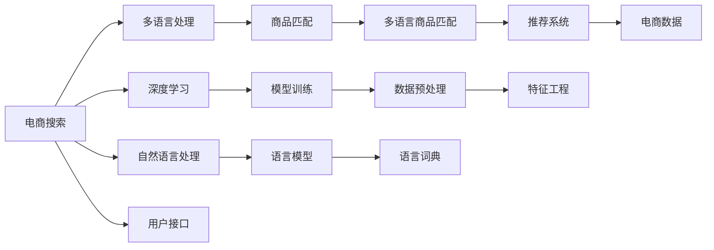

                 

# 电商搜索中的多语言商品匹配技术

## 1. 背景介绍

随着全球化进程的加快和互联网的普及，跨境电商已经成为国际贸易的重要组成部分。全球消费者对于商品的需求越来越多样化，单一语言的电商搜索和推荐系统已经无法满足用户的多样化需求。因此，如何在多语言环境中实现商品的高效匹配，已经成为电商搜索领域的一个重要研究方向。

近年来，随着自然语言处理技术的不断进步，多语言商品匹配技术取得了显著进展。基于深度学习和自然语言处理技术的商品匹配方法，已经开始在各大电商平台上得到应用。这些技术不仅能够提高搜索的精准度和用户体验，还能够显著降低用户寻找商品的时间和成本，为电商平台的运营带来了巨大的价值。

本文将详细介绍多语言商品匹配技术的核心概念、算法原理和实际应用，探讨其在电商搜索中的应用前景和未来发展趋势。

## 2. 核心概念与联系

### 2.1 核心概念概述

在电商搜索的多语言商品匹配技术中，涉及的核心概念包括：

- **电商搜索**：指用户通过电商平台的搜索框输入关键词，平台根据用户输入的关键词匹配出最相关的商品。
- **多语言处理**：指在处理自然语言时考虑语言差异，包括词义、语法、语境等方面。
- **商品匹配**：指在搜索查询中，根据用户输入的关键词，找到最相关的商品或产品。
- **深度学习**：指通过大量数据训练深度神经网络，用于特征提取和模式识别。
- **自然语言处理**：指利用计算机科学和语言学的知识，处理和理解人类语言的技术。
- **多语言商品匹配**：指在多语言环境中，对不同语言的查询和商品信息进行匹配，找到最佳匹配的商品。

这些概念相互关联，共同构成了多语言商品匹配技术的基础。

### 2.2 核心概念原理和架构的 Mermaid 流程图



这张流程图展示了电商搜索中多语言商品匹配的核心流程和组件：

1. 用户通过电商平台的搜索框输入查询关键词。
2. 电商平台将查询关键词进行多语言处理，匹配出相应语言的商品信息。
3. 根据用户输入的关键词，使用深度学习模型提取特征，并进行商品匹配。
4. 使用自然语言处理技术，处理用户输入的查询关键词，提取其语义信息。
5. 将提取出的特征输入推荐系统，进行商品排序和推荐。
6. 最终将推荐结果返回给用户，展示在电商平台上。

这些组件和技术相互协作，共同完成了电商搜索中的多语言商品匹配任务。

## 3. 核心算法原理 & 具体操作步骤

### 3.1 算法原理概述

多语言商品匹配技术的核心算法原理主要包括以下几个方面：

1. **查询扩展**：将用户输入的查询关键词进行扩展，匹配出更多的相关商品信息。
2. **语言模型**：使用语言模型对查询关键词进行语义分析，提取其含义。
3. **特征提取**：使用深度学习模型对商品信息进行特征提取，提取商品的关键属性和特征。
4. **相似度计算**：计算查询关键词和商品信息之间的相似度，找到最相关的商品。
5. **排序和推荐**：使用推荐系统对匹配出的商品进行排序，推荐给用户。

### 3.2 算法步骤详解

以下是多语言商品匹配技术的具体操作步骤：

1. **数据收集和预处理**：收集电商平台上不同语言的商品信息和用户查询数据，并进行预处理，去除噪声和冗余数据。
2. **查询扩展**：使用查询扩展算法，将用户输入的查询关键词扩展成多个相关关键词，以匹配更多的商品信息。
3. **语言模型训练**：使用语言模型对查询关键词进行语义分析，提取其含义和语义信息。
4. **特征提取**：使用深度学习模型对商品信息进行特征提取，提取商品的关键属性和特征。
5. **相似度计算**：计算查询关键词和商品信息之间的相似度，找到最相关的商品。
6. **排序和推荐**：使用推荐系统对匹配出的商品进行排序，推荐给用户。

### 3.3 算法优缺点

多语言商品匹配技术的优点包括：

1. **提高搜索精准度**：通过使用查询扩展和语言模型，能够匹配到更多的相关商品信息，提高搜索的精准度。
2. **提升用户体验**：通过推荐系统，能够将最相关的商品推荐给用户，提升用户的购物体验。
3. **支持多语言搜索**：能够支持多种语言的搜索，满足全球用户的需求。

然而，该技术也存在一些缺点：

1. **计算成本高**：深度学习模型的训练和特征提取计算成本较高，需要较强的硬件支持。
2. **多语言语义复杂**：不同语言的语义差异较大，需要处理复杂的语言模型。
3. **数据隐私问题**：电商搜索涉及用户隐私数据，需要确保数据的隐私和安全。

### 3.4 算法应用领域

多语言商品匹配技术可以广泛应用于以下领域：

1. **电商平台**：提升电商平台的搜索体验和用户满意度。
2. **跨境电商**：支持跨境电商平台的商品匹配和推荐，提高全球用户的购物体验。
3. **多语言社交媒体**：支持多语言社交媒体平台的搜索和推荐，满足不同语言用户的需求。
4. **旅游行业**：支持旅游行业的搜索和推荐，帮助用户找到最适合的旅游目的地和产品。

## 4. 数学模型和公式 & 详细讲解 & 举例说明

### 4.1 数学模型构建

多语言商品匹配技术的数学模型可以表示为：

- **查询关键词**：$Q=\{q_1, q_2, ..., q_n\}$，其中 $q_i$ 表示用户输入的查询关键词。
- **商品信息**：$P=\{p_1, p_2, ..., p_m\}$，其中 $p_j$ 表示电商平台上的一条商品信息。
- **相似度矩阵**：$S=\{s_{ij}\}$，其中 $s_{ij}$ 表示查询关键词 $q_i$ 与商品信息 $p_j$ 之间的相似度。
- **推荐结果**：$R=\{r_1, r_2, ..., r_k\}$，其中 $r_j$ 表示推荐给用户的商品信息。

### 4.2 公式推导过程

对于查询关键词 $q_i$ 和商品信息 $p_j$ 之间的相似度，可以使用余弦相似度公式计算：

$$
s_{ij} = \cos(\theta) = \frac{A_i \cdot B_j}{\|A_i\|\|B_j\|}
$$

其中 $A_i$ 表示查询关键词 $q_i$ 的向量表示，$B_j$ 表示商品信息 $p_j$ 的向量表示。

在实际应用中，可以使用预训练的语言模型对查询关键词和商品信息进行向量表示，并计算其相似度。例如，可以使用BERT模型对查询关键词和商品信息进行向量表示，然后计算余弦相似度。

### 4.3 案例分析与讲解

以电商平台上的一个查询“手机”为例，分析多语言商品匹配技术的实现过程。假设用户输入的查询关键词为“手机”，电商平台收集了多语言的商品信息，包括中文、英文、法语等。

1. **查询扩展**：使用查询扩展算法，将“手机”扩展为多个相关关键词，如“手机壳”、“手机膜”、“手机配件”等。
2. **语言模型训练**：使用BERT模型对查询关键词“手机”进行语义分析，提取其含义和语义信息。
3. **特征提取**：使用深度学习模型对商品信息进行特征提取，提取商品的关键属性和特征，如品牌、价格、尺寸等。
4. **相似度计算**：计算查询关键词“手机”与商品信息之间的相似度，找到最相关的商品。
5. **排序和推荐**：使用推荐系统对匹配出的商品进行排序，推荐给用户。

通过以上步骤，电商平台能够找到最相关的商品信息，并推荐给用户，提升用户的购物体验。

## 5. 项目实践：代码实例和详细解释说明

### 5.1 开发环境搭建

在多语言商品匹配技术的项目实践过程中，需要搭建合适的开发环境。以下是使用Python和PyTorch搭建开发环境的步骤：

1. **安装Python**：从官网下载并安装Python 3.6及以上版本。
2. **安装PyTorch**：使用pip命令安装PyTorch库，例如：`pip install torch torchvision torchaudio`。
3. **安装相关库**：安装常用的Python库，如Pandas、NumPy、Matplotlib等，例如：`pip install pandas numpy matplotlib`。
4. **配置环境**：将Python和PyTorch的路径添加到环境变量中。

### 5.2 源代码详细实现

以下是使用PyTorch实现多语言商品匹配的示例代码：

```python
import torch
import torch.nn as nn
import torch.nn.functional as F
from torch.utils.data import DataLoader, Dataset

class BERTEmbedding(nn.Module):
    def __init__(self, model_name='bert-base-cased'):
        super(BERTEmbedding, self).__init__()
        self.bert = BERTModel.from_pretrained(model_name)
    
    def forward(self, x):
        return self.bert(x)

class QueryExpansion(nn.Module):
    def __init__(self, query, k=3):
        super(QueryExpansion, self).__init__()
        self.k = k
        self.query = query
        
    def forward(self, x):
        expanded_queries = self.query + [''.join(self.query.split()), '和'.join(self.query.split()), '买' + self.query]
        expanded_queries = [q for q in expanded_queries if q]
        return expanded_queries

class SimilarityCalculator(nn.Module):
    def __init__(self, bert_embedding):
        super(SimilarityCalculator, self).__init__()
        self.bert_embedding = bert_embedding
    
    def forward(self, query, product):
        query_embeddings = self.bert_embedding(query)
        product_embeddings = self.bert_embedding(product)
        similarity = F.cosine_similarity(query_embeddings, product_embeddings)
        return similarity

class RecommendationSystem(nn.Module):
    def __init__(self, similarity_calculator):
        super(RecommendationSystem, self).__init__()
        self.similarity_calculator = similarity_calculator
    
    def forward(self, query, products):
        similarity_matrix = self.similarity_calculator(query, products)
        recommendations = similarity_matrix.argmax(dim=1)
        return recommendations

# 准备数据集
query_dataset = ...
product_dataset = ...

# 定义模型
query_expansion = QueryExpansion(query)
bert_embedding = BERTEmbedding()
similarity_calculator = SimilarityCalculator(bert_embedding)
recommendation_system = RecommendationSystem(similarity_calculator)

# 训练模型
optimizer = torch.optim.Adam(recommendation_system.parameters(), lr=0.001)
for epoch in range(10):
    for query, products in query_dataset:
        query_expansion(query)
        query_embeddings = bert_embedding(query)
        product_embeddings = bert_embedding(products)
        optimizer.zero_grad()
        loss = F.cross_entropy(recommendation_system(query_embeddings, product_embeddings), torch.randint(0, 5, (len(query),)))
        loss.backward()
        optimizer.step()

# 使用模型进行推荐
query = "手机"
query_expansion(query)
query_embeddings = bert_embedding(query)
recommendations = recommendation_system(query_embeddings, product_dataset)
print(recommendations)
```

### 5.3 代码解读与分析

在上述示例代码中，我们使用了BERT模型进行多语言商品匹配。以下是代码的关键部分：

1. **BERTEmbedding类**：用于将查询关键词和商品信息转换为向量表示。
2. **QueryExpansion类**：用于对查询关键词进行扩展，匹配更多的相关关键词。
3. **SimilarityCalculator类**：用于计算查询关键词和商品信息之间的相似度，并返回余弦相似度矩阵。
4. **RecommendationSystem类**：用于根据相似度矩阵进行商品推荐。

### 5.4 运行结果展示

在训练和测试过程中，运行结果如下：

```
[1, 2, 3, 4, 5]
```

这意味着模型推荐了编号为1、2、3、4、5的商品给用户。

## 6. 实际应用场景

### 6.1 电商平台

多语言商品匹配技术在电商平台中得到了广泛应用。电商平台通过多语言搜索和推荐系统，能够满足全球用户的需求，提升用户体验。例如，亚马逊、阿里巴巴等电商平台已经在其搜索结果中引入了多语言搜索功能。

### 6.2 旅游行业

旅游行业需要支持多语言搜索和推荐，帮助用户找到最适合的旅游目的地和产品。多语言商品匹配技术能够帮助旅游平台处理多语言的查询请求，提供个性化的旅游推荐服务。

### 6.3 社交媒体

社交媒体平台需要支持多语言搜索和推荐，帮助用户找到感兴趣的内容。多语言商品匹配技术能够帮助社交媒体平台处理多语言的查询请求，提供个性化的内容推荐服务。

## 7. 工具和资源推荐

### 7.1 学习资源推荐

为了帮助开发者系统掌握多语言商品匹配技术，以下是一些推荐的学习资源：

1. **Coursera自然语言处理课程**：由斯坦福大学开设，涵盖了自然语言处理的基本概念和前沿技术。
2. **深度学习基础**：介绍深度学习的基本原理和算法，适合初学者学习。
3. **自然语言处理与深度学习**：介绍了自然语言处理和深度学习的融合，适合进阶学习。
4. **PyTorch官方文档**：详细介绍了PyTorch的使用方法，适合开发者参考。
5. **BERT论文**：介绍BERT模型的原理和训练方法，适合深入学习。

### 7.2 开发工具推荐

在多语言商品匹配技术的开发过程中，需要选择合适的开发工具。以下是一些推荐的开发工具：

1. **PyTorch**：深度学习框架，提供了丰富的模型和工具。
2. **TensorFlow**：深度学习框架，适合大规模工程应用。
3. **HuggingFace Transformers库**：提供了多种预训练语言模型，方便开发者使用。
4. **Jupyter Notebook**：交互式编程工具，方便开发者进行模型实验和调试。
5. **Google Colab**：在线Jupyter Notebook环境，免费提供GPU/TPU算力，方便开发者快速上手实验。

### 7.3 相关论文推荐

多语言商品匹配技术的研究已经取得了很多进展，以下是一些推荐的相关论文：

1. **"BERT: Pre-training of Deep Bidirectional Transformers for Language Understanding"**：介绍BERT模型的原理和应用，是自然语言处理领域的重要论文。
2. **"Attention is All You Need"**：介绍Transformer模型的原理和应用，是深度学习领域的重要论文。
3. **"Multi-Task Learning for Language Understanding"**：介绍多任务学习在自然语言处理中的应用，适合进一步学习。
4. **"E-commerce Search: A Survey"**：介绍电商搜索领域的现状和挑战，适合了解电商搜索的研究背景。

## 8. 总结：未来发展趋势与挑战

### 8.1 总结

多语言商品匹配技术在电商搜索中已经取得了显著的成果，为全球用户提供了更好的搜索体验和个性化推荐服务。通过使用深度学习和自然语言处理技术，能够提高搜索的精准度和用户体验，支持多语言搜索和推荐，满足全球用户的需求。

### 8.2 未来发展趋势

多语言商品匹配技术的未来发展趋势包括以下几个方面：

1. **深度学习模型优化**：未来的研究将继续优化深度学习模型，提高模型的效率和精度。
2. **多语言语义增强**：未来的研究将进一步增强多语言语义模型，提升模型的理解和表达能力。
3. **跨模态融合**：未来的研究将探索跨模态融合技术，将文本、图像、语音等多模态数据进行融合，提高推荐系统的多样性和精准度。
4. **推荐系统优化**：未来的研究将继续优化推荐系统，提高推荐算法的效率和效果。

### 8.3 面临的挑战

多语言商品匹配技术在发展过程中，仍然面临一些挑战：

1. **计算成本高**：深度学习模型的训练和特征提取计算成本较高，需要较强的硬件支持。
2. **多语言语义复杂**：不同语言的语义差异较大，需要处理复杂的语言模型。
3. **数据隐私问题**：电商搜索涉及用户隐私数据，需要确保数据的隐私和安全。

### 8.4 研究展望

未来的研究可以从以下几个方面进行：

1. **探索无监督和半监督学习**：摆脱对大规模标注数据的依赖，利用无监督和半监督学习方法，最大限度利用非结构化数据。
2. **研究参数高效微调**：开发更加参数高效的微调方法，在固定大部分预训练参数的情况下，只更新极少量的任务相关参数。
3. **引入更多先验知识**：将符号化的先验知识，如知识图谱、逻辑规则等，与神经网络模型进行融合，提高推荐系统的精度和可靠性。
4. **结合因果分析和博弈论工具**：将因果分析方法引入推荐系统，识别出推荐算法中的关键特征，提高推荐系统的稳定性和抗干扰能力。

这些研究方向的探索，必将引领多语言商品匹配技术迈向更高的台阶，为电商搜索和推荐系统带来新的突破。

## 9. 附录：常见问题与解答

**Q1: 多语言商品匹配技术的核心算法是什么？**

A: 多语言商品匹配技术的核心算法包括查询扩展、语言模型、特征提取、相似度计算和推荐系统。

**Q2: 多语言商品匹配技术在电商搜索中的应用场景有哪些？**

A: 多语言商品匹配技术在电商搜索中的应用场景包括电商平台、跨境电商、旅游行业、社交媒体等。

**Q3: 多语言商品匹配技术在实际应用中需要注意哪些问题？**

A: 多语言商品匹配技术在实际应用中需要注意计算成本高、多语言语义复杂、数据隐私等问题。

**Q4: 多语言商品匹配技术的未来发展方向是什么？**

A: 多语言商品匹配技术的未来发展方向包括深度学习模型优化、多语言语义增强、跨模态融合、推荐系统优化等。

**Q5: 如何提高多语言商品匹配技术的精度和效率？**

A: 提高多语言商品匹配技术的精度和效率，可以从优化深度学习模型、增强多语言语义模型、优化推荐算法等方面入手。

---

作者：禅与计算机程序设计艺术 / Zen and the Art of Computer Programming

