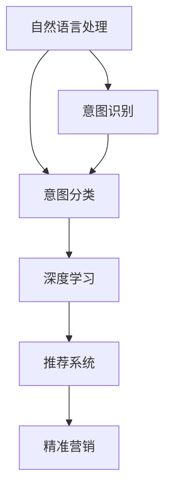

                 

# 电商搜索中的意图识别与分类模型

> 关键词：电商搜索, 意图识别, 分类模型, 深度学习, 自然语言处理, 推荐系统, 精准营销

## 1. 背景介绍

### 1.1 问题由来
随着电商市场的快速发展和消费行为的复杂化，电商搜索已经成为电商平台中不可或缺的重要功能。然而，电商搜索用户输入的查询往往具有高度的歧义性和个性化，如何准确理解用户的查询意图，并将其转化为明确的搜索需求，是电商搜索优化的首要任务。

传统电商搜索系统主要依赖关键词匹配和文本相似度排序，但在处理查询意图复杂化、产品多样化和个性化需求等方面存在明显的局限。随着深度学习和大规模预训练语言模型的兴起，许多电商企业开始探索基于意图识别和分类模型的新型搜索算法。这些模型通过学习自然语言表征，能够更好地理解查询意图的真实含义，从而提供更精准的搜索结果和个性化推荐。

### 1.2 问题核心关键点
电商搜索中的意图识别与分类模型，旨在通过深度学习算法对用户查询进行自然语言理解，进而将其转化为具体的搜索指令。其核心关键点包括：
- 如何通过自然语言处理技术提取和表示查询意图的语义信息。
- 如何设计有效的分类模型对查询意图进行精准识别和分类。
- 如何在电商搜索中应用意图识别和分类模型，提升搜索准确性和用户体验。
- 如何处理查询意图的歧义性和个性化，提供个性化推荐和精准营销服务。

## 2. 核心概念与联系

### 2.1 核心概念概述

为更好地理解电商搜索中的意图识别与分类模型，本节将介绍几个密切相关的核心概念：

- 意图识别（Intent Recognition）：指从用户输入的自然语言查询中，提取和识别出用户的真实意图。
- 意图分类（Intent Classification）：将意图识别得到的类别进一步细化，赋予具体的动作指令，如搜索商品、查看商品评价、比较商品等。
- 自然语言处理（NLP）：通过分词、词性标注、依存句法分析等技术，对自然语言进行结构化处理，为后续的意图识别和分类提供基础。
- 深度学习（Deep Learning）：利用神经网络模型，通过多层次特征提取，对自然语言数据进行高效处理和建模。
- 推荐系统（Recommendation System）：根据用户的查询意图，推荐符合用户兴趣的商品和服务，提升电商平台的转化率和用户体验。
- 精准营销（Precision Marketing）：通过意图识别和分类模型，对用户进行精准细分，实现个性化的营销策略和广告投放。

这些核心概念之间的逻辑关系可以通过以下Mermaid流程图来展示：



这个流程图展示了几大核心概念及其之间的关系：

1. 自然语言处理技术为电商搜索提供输入数据的结构化表示。
2. 意图识别模型对自然语言进行理解，提取查询意图的语义信息。
3. 意图分类模型对意图识别结果进行细化，赋予具体的搜索动作。
4. 深度学习模型用于对输入数据进行高效特征提取和建模。
5. 推荐系统根据意图分类结果，为用户提供个性化商品推荐。
6. 精准营销系统根据用户意图进行精准的营销和广告投放。

## 3. 核心算法原理 & 具体操作步骤
### 3.1 算法原理概述

电商搜索中的意图识别与分类模型，通常采用深度学习中的序列到序列（Sequence-to-Sequence, Seq2Seq）模型进行构建。该模型通过编码器（Encoder）提取查询的自然语言特征，并利用解码器（Decoder）将这些特征映射为具体的意图分类。

算法的基本流程包括以下几个步骤：
1. 将用户查询文本输入编码器，提取语义特征。
2. 将编码器输出的特征映射到意图分类器的输入，得到意图类别。
3. 根据意图分类结果，对用户进行个性化推荐和营销策略调整。

### 3.2 算法步骤详解

#### 3.2.1 编码器（Encoder）
编码器通常采用Transformer等自注意力模型，对输入的自然语言文本进行编码。具体步骤如下：
1. 对查询文本进行分词，得到单词序列。
2. 将单词序列输入编码器，通过多层Transformer模型提取语义特征。
3. 使用全局平均池化（Global Average Pooling）或最大池化（Max Pooling）等方法，将特征向量降维，生成意图表示向量。

#### 3.2.2 意图分类器（Intent Classifier）
意图分类器通常采用全连接层（Fully Connected Layer）或卷积神经网络（Convolutional Neural Network, CNN）等模型，对意图表示向量进行分类。具体步骤如下：
1. 将编码器输出的意图表示向量输入意图分类器。
2. 通过全连接层或CNN对意图表示向量进行特征提取和分类。
3. 将分类结果映射为具体的意图类别。

#### 3.2.3 推荐系统（Recommendation System）
推荐系统通常基于用户查询意图进行个性化推荐。具体步骤如下：
1. 根据意图分类结果，从商品数据库中检索匹配的商品。
2. 利用协同过滤、内容推荐等算法，生成个性化推荐列表。
3. 将推荐列表反馈给用户，提升搜索体验。

### 3.3 算法优缺点

#### 3.3.1 优点
1. 能够处理复杂的自然语言查询，提取语义信息。
2. 基于深度学习模型，能够自动学习特征表示，提高意图识别的准确性。
3. 能够提供个性化的推荐和营销策略，提升用户满意度和转化率。
4. 实时性强，能够根据用户实时输入进行动态调整。

#### 3.3.2 缺点
1. 模型复杂度较高，训练和推理需要较大的计算资源。
2. 需要大量的标注数据进行训练，标注成本较高。
3. 模型可能存在过拟合问题，需要对数据进行严格的预处理和清洗。
4. 模型需要持续更新和优化，以适应查询意图的动态变化。

### 3.4 算法应用领域

电商搜索中的意图识别与分类模型，在以下几个领域具有广泛应用：

- 商品搜索：根据用户查询意图，快速匹配和检索商品，提升搜索效率和准确性。
- 个性化推荐：基于用户查询意图，推荐符合用户兴趣的商品，提高转化率和用户体验。
- 精准营销：根据用户查询意图进行精准细分，实现个性化的营销策略和广告投放。
- 用户画像：构建详细的用户画像，为电商平台的个性化服务和推荐提供依据。
- 自然语言客服：实现自动化的客服系统，通过意图识别和分类，提供智能化的客服服务。

## 4. 数学模型和公式 & 详细讲解  
### 4.1 数学模型构建

电商搜索中的意图识别与分类模型，通常采用序列到序列（Seq2Seq）框架进行构建。假设查询文本为 $x = (x_1, x_2, ..., x_n)$，意图分类器为 $y = (y_1, y_2, ..., y_m)$，其中 $n$ 和 $m$ 分别为查询文本长度和意图类别数。模型的整体框架如下图所示：


其中，编码器 $B$ 和解码器 $C$ 分别采用Transformer模型，意图分类器 $D$ 采用全连接层。模型的输入和输出分别为查询文本和意图类别。

### 4.2 公式推导过程

以编码器 $B$ 为例，其结构可以表示为：

$$
h_t = \text{TransformerEncoder}(x_t, h_{t-1})
$$

其中 $h_t$ 为时间步 $t$ 的隐状态，$x_t$ 为输入单词序列，$h_{t-1}$ 为前一时间步的隐状态。TransformerEncoder由多个自注意力层和前馈层组成，具体计算公式如下：

$$
Q = \text{Linear}(h_{t-1}) \cdot W_Q^T
$$
$$
K = \text{Linear}(h_{t-1}) \cdot W_K^T
$$
$$
V = \text{Linear}(h_{t-1}) \cdot W_V^T
$$
$$
a_t = \text{Softmax}(\text{DotProduct}(Q, K))
$$
$$
c_t = a_t \cdot V
$$
$$
h_t = c_t + h_{t-1}
$$

其中 $Q, K, V$ 分别为查询、键和值，$a_t$ 为注意力权重，$c_t$ 为注意力向量，$W_Q, W_K, W_V$ 为权重矩阵。

### 4.3 案例分析与讲解

假设用户输入的查询文本为 "打折 手机", 意图分类器的输入为 "打折" 和 "手机"，输出为 "查找打折手机" 的意图。具体分析如下：

1. 对查询文本进行分词，得到单词序列 ["打折", "手机"]。
2. 将单词序列输入编码器，通过Transformer模型提取语义特征。
3. 使用全局平均池化（Global Average Pooling）方法，将特征向量降维，生成意图表示向量。
4. 将意图表示向量输入意图分类器，通过全连接层进行分类。
5. 输出意图分类结果 "查找打折手机"。

## 5. 项目实践：代码实例和详细解释说明
### 5.1 开发环境搭建

在进行意图识别与分类模型的开发实践前，我们需要准备好开发环境。以下是使用Python进行TensorFlow开发的环境配置流程：

1. 安装Anaconda：从官网下载并安装Anaconda，用于创建独立的Python环境。

2. 创建并激活虚拟环境：
```bash
conda create -n intent_recognition python=3.8 
conda activate intent_recognition
```

3. 安装TensorFlow：根据CUDA版本，从官网获取对应的安装命令。例如：
```bash
conda install tensorflow tensorflow-gpu -c conda-forge
```

4. 安装各类工具包：
```bash
pip install numpy pandas scikit-learn matplotlib tqdm jupyter notebook ipython
```

完成上述步骤后，即可在`intent_recognition`环境中开始项目实践。

### 5.2 源代码详细实现

下面以电商搜索中的意图识别与分类模型为例，给出使用TensorFlow进行模型开发的完整代码实现。

首先，定义意图分类器的数据处理函数：

```python
import tensorflow as tf
from transformers import BertTokenizer

class IntentClassifier(tf.keras.Model):
    def __init__(self, intent_count, embedding_dim):
        super(IntentClassifier, self).__init__()
        self.dense = tf.keras.layers.Dense(intent_count, activation='softmax')
    
    def call(self, inputs):
        x = self.dense(inputs)
        return x
```

然后，定义编码器（BertEncoder）和意图分类器（IntentClassifier）的模型：

```python
from transformers import BertModel, BertTokenizer

tokenizer = BertTokenizer.from_pretrained('bert-base-cased')

class BertEncoder(tf.keras.layers.Layer):
    def __init__(self, embedding_dim):
        super(BertEncoder, self).__init__()
        self.bert = BertModel.from_pretrained('bert-base-cased')
        self.pooler = tf.keras.layers.GlobalAveragePooling1D()
        self.dense = tf.keras.layers.Dense(embedding_dim)
    
    def call(self, inputs):
        _, pooled_output = self.bert(inputs)
        x = self.pooler(pooled_output)
        x = self.dense(x)
        return x

class IntentClassifier(tf.keras.Model):
    def __init__(self, intent_count, embedding_dim):
        super(IntentClassifier, self).__init__()
        self.dense = tf.keras.layers.Dense(intent_count, activation='softmax')
    
    def call(self, inputs):
        x = self.dense(inputs)
        return x
```

接着，定义训练和评估函数：

```python
def train_model(model, train_dataset, validation_dataset, batch_size, epochs):
    optimizer = tf.keras.optimizers.Adam(learning_rate=2e-5)
    loss_fn = tf.keras.losses.CategoricalCrossentropy()

    model.compile(optimizer=optimizer, loss=loss_fn, metrics=['accuracy'])

    model.fit(train_dataset, validation_data=validation_dataset, epochs=epochs, batch_size=batch_size, verbose=2)

def evaluate_model(model, test_dataset, batch_size):
    test_dataset = tf.data.Dataset.from_tensor_slices(test_dataset)
    test_dataset = test_dataset.batch(batch_size)
    test_dataset = test_dataset.prefetch(buffer_size=tf.data.experimental.AUTOTUNE)

    test_loss, test_acc = model.evaluate(test_dataset, verbose=2)
    print(f'Test accuracy: {test_acc:.4f}')
```

最后，启动模型训练和评估：

```python
# 定义训练集、验证集和测试集
train_dataset = ...
validation_dataset = ...
test_dataset = ...

# 定义模型和超参数
embedding_dim = 128
intent_count = ...
batch_size = 32
epochs = 10

# 构建模型
model = BertEncoder(embedding_dim)
intent_classifier = IntentClassifier(intent_count, embedding_dim)
model.add(intent_classifier)

# 训练模型
train_model(model, train_dataset, validation_dataset, batch_size, epochs)

# 评估模型
evaluate_model(model, test_dataset, batch_size)
```

以上就是使用TensorFlow进行电商搜索中的意图识别与分类模型的完整代码实现。可以看到，通过利用TensorFlow的高级API，可以相对简洁地实现意图分类器的构建和训练。

### 5.3 代码解读与分析

让我们再详细解读一下关键代码的实现细节：

**IntentClassifier类**：
- `__init__`方法：初始化意图分类器，定义全连接层。
- `call`方法：前向传播计算，将输入通过全连接层输出分类结果。

**BertEncoder类**：
- `__init__`方法：初始化编码器，定义Bert模型、全局平均池化层和全连接层。
- `call`方法：前向传播计算，通过Bert模型和全连接层提取语义特征。

**train_model函数**：
- 定义优化器和损失函数。
- 使用`compile`方法编译模型，定义训练过程。
- 使用`fit`方法进行模型训练，记录验证集上的性能指标。

**evaluate_model函数**：
- 将测试集转换为DataLoader，进行批量处理和预处理。
- 使用`evaluate`方法评估模型在测试集上的性能，输出测试准确率。

**训练流程**：
- 定义训练集、验证集和测试集。
- 定义模型和超参数。
- 构建模型，将编码器和意图分类器依次连接。
- 调用`train_model`函数进行模型训练，记录验证集上的性能指标。
- 调用`evaluate_model`函数评估模型在测试集上的性能，输出测试准确率。

可以看到，TensorFlow提供了丰富的API和模型构建工具，大大简化了意图识别与分类模型的开发过程。开发者可以更加专注于算法设计，而不必过多关注底层的实现细节。

当然，在实际应用中，还需要考虑更多因素，如模型的保存和部署、超参数的自动搜索、更加灵活的任务适配层等。但核心的意图识别与分类算法基本与此类似。

## 6. 实际应用场景
### 6.1 智能客服系统

电商平台的智能客服系统，通过意图识别与分类模型，能够自动理解用户的查询意图，匹配最合适的回答。当用户询问商品信息时，系统能够快速检索并返回相关商品信息，极大提升用户咨询体验。

在技术实现上，可以收集客户的历史咨询记录，将问题和最佳答复构建成监督数据，在此基础上对预训练语言模型进行微调。微调后的意图识别模型能够自动理解用户意图，匹配最合适的回答模板。对于新问题，还可以接入检索系统实时搜索相关内容，动态组织生成回答。如此构建的智能客服系统，能显著提升客户咨询体验和问题解决效率。

### 6.2 个性化推荐系统

电商平台的个性化推荐系统，通过意图识别与分类模型，能够实时捕捉用户查询意图的动态变化，提供符合用户兴趣的商品推荐。当用户输入查询文本时，系统能够自动提取查询意图，并根据意图分类结果，生成个性化推荐列表，提升用户购买意愿和平台转化率。

在技术实现上，可以收集用户浏览、点击、评论、分享等行为数据，提取和用户交互的物品标题、描述、标签等文本内容。将文本内容作为模型输入，用户的后续行为（如是否点击、购买等）作为监督信号，在此基础上微调预训练语言模型。微调后的意图识别模型能够从文本内容中准确把握用户的兴趣点。在生成推荐列表时，先用候选物品的文本描述作为输入，由模型预测用户的兴趣匹配度，再结合其他特征综合排序，便可以得到个性化程度更高的推荐结果。

### 6.3 精准营销

电商平台的精准营销系统，通过意图识别与分类模型，能够对用户进行精准细分，实现个性化的营销策略和广告投放。当用户输入查询文本时，系统能够自动提取查询意图，并根据意图分类结果，对用户进行精准细分，推送符合用户兴趣的广告和营销内容。

在技术实现上，可以将用户查询数据、行为数据和历史交易数据整合，进行意图分类和用户画像构建。基于用户画像，平台可以针对不同用户群体，设计差异化的营销策略和广告投放方案。同时，系统能够实时捕捉用户查询意图的动态变化，及时调整营销策略，提高广告的点击率和转化率。

### 6.4 未来应用展望

随着深度学习和大规模预训练语言模型的不断发展，电商搜索中的意图识别与分类模型将呈现以下几个发展趋势：

1. 模型规模持续增大。随着算力成本的下降和数据规模的扩张，预训练语言模型的参数量还将持续增长。超大规模语言模型蕴含的丰富语言知识，有望支撑更加复杂多变的查询意图识别。

2. 意图分类模型将引入更多先验知识。将符号化的先验知识，如知识图谱、逻辑规则等，与神经网络模型进行巧妙融合，引导意图分类过程学习更准确、合理的语言模型。

3. 多模态意图识别模型将出现。当前模型主要聚焦于纯文本数据，未来将进一步拓展到图像、视频、语音等多模态数据微调。多模态信息的融合，将显著提升语言模型对现实世界的理解和建模能力。

4. 实时意图识别和分类将更广泛应用。目前的模型大多依赖离线训练数据进行推理，未来将结合实时数据流，实现更加灵活、动态的意图识别和分类。

5. 深度学习与强化学习结合将带来新突破。结合强化学习技术，模型能够不断调整策略，学习更优的意图识别和分类策略，提升模型性能。

6. 意图识别的泛化能力将进一步增强。通过引入更多领域数据和跨领域迁移学习，模型能够更好地应对电商搜索中的多样化、复杂化查询。

以上趋势凸显了电商搜索中的意图识别与分类模型的广阔前景。这些方向的探索发展，必将进一步提升电商搜索系统的性能和应用范围，为电商平台的智能化转型提供重要技术支撑。

## 7. 工具和资源推荐
### 7.1 学习资源推荐

为了帮助开发者系统掌握电商搜索中的意图识别与分类模型的理论基础和实践技巧，这里推荐一些优质的学习资源：

1. 《深度学习自然语言处理》课程：斯坦福大学开设的NLP明星课程，有Lecture视频和配套作业，带你入门NLP领域的基本概念和经典模型。

2. 《序列到序列模型：最新进展与实践》书籍：详细讲解了Seq2Seq模型在NLP中的应用，包括电商搜索中的意图识别与分类。

3. 《Transformer模型》书籍：介绍了Transformer模型的原理和应用，提供了丰富的代码实例。

4. 《TensorFlow官方文档》：TensorFlow的官方文档，提供了全面的API文档和代码示例。

5. 《自然语言处理与深度学习》博客：深度学习社区NLP方向的博客，提供丰富的学习资源和实践指南。

通过对这些资源的学习实践，相信你一定能够快速掌握电商搜索中的意图识别与分类模型的精髓，并用于解决实际的NLP问题。

### 7.2 开发工具推荐

高效的开发离不开优秀的工具支持。以下是几款用于电商搜索中的意图识别与分类模型开发的常用工具：

1. TensorFlow：基于Python的开源深度学习框架，灵活动态的计算图，适合快速迭代研究。提供了丰富的API和模型构建工具。

2. PyTorch：基于Python的开源深度学习框架，易于使用，适合学术研究和工程开发。提供了灵活的动态图和静态图模型。

3. Transformers库：HuggingFace开发的NLP工具库，集成了多种预训练模型和微调范式，适合构建电商搜索中的意图识别与分类模型。

4. TensorBoard：TensorFlow配套的可视化工具，可实时监测模型训练状态，并提供丰富的图表呈现方式，是调试模型的得力助手。

5. Weights & Biases：模型训练的实验跟踪工具，可以记录和可视化模型训练过程中的各项指标，方便对比和调优。

6. Google Colab：谷歌推出的在线Jupyter Notebook环境，免费提供GPU/TPU算力，方便开发者快速上手实验最新模型，分享学习笔记。

合理利用这些工具，可以显著提升电商搜索中的意图识别与分类模型的开发效率，加快创新迭代的步伐。

### 7.3 相关论文推荐

电商搜索中的意图识别与分类模型，在以下几个方向的研究成果奠定了基础：

1. Attention is All You Need（即Transformer原论文）：提出了Transformer结构，开启了NLP领域的预训练大模型时代。

2. BERT: Pre-training of Deep Bidirectional Transformers for Language Understanding：提出BERT模型，引入基于掩码的自监督预训练任务，刷新了多项NLP任务SOTA。

3. Sequence to Sequence Learning with Neural Networks：提出Seq2Seq模型，是NLP中序列到序列任务的基础。

4. Neural Machine Translation by Jointly Learning to Align and Translate：提出Seq2Seq模型在机器翻译中的应用。

5. Transfer Learning from Language Models to Visual Denoising：利用预训练语言模型进行视觉任务微调，证明了预训练的通用性。

6. A Survey of Techniques for Zero-Shot Natural Language Processing：综述了零样本学习的最新进展和应用。

这些论文代表了大语言模型微调技术的发展脉络。通过学习这些前沿成果，可以帮助研究者把握学科前进方向，激发更多的创新灵感。

## 8. 总结：未来发展趋势与挑战
### 8.1 总结

本文对电商搜索中的意图识别与分类模型进行了全面系统的介绍。首先阐述了电商搜索中查询意图的复杂性及其对电商搜索优化的重要性，明确了意图识别与分类模型在提升电商搜索效果和用户体验方面的独特价值。其次，从原理到实践，详细讲解了意图识别与分类模型的数学原理和关键步骤，给出了意图识别与分类模型的完整代码实例。同时，本文还广泛探讨了意图识别与分类模型在电商搜索中的实际应用场景，展示了意图识别与分类模型的巨大潜力。此外，本文精选了意图识别与分类技术的各类学习资源，力求为读者提供全方位的技术指引。

通过本文的系统梳理，可以看到，电商搜索中的意图识别与分类模型正在成为电商搜索优化的重要手段，极大地提升了电商搜索系统的性能和用户体验。未来，伴随预训练语言模型和微调方法的持续演进，意图识别与分类模型必将在电商搜索中发挥更大的作用，推动电商搜索系统的智能化转型。

### 8.2 未来发展趋势

展望未来，电商搜索中的意图识别与分类模型将呈现以下几个发展趋势：

1. 模型规模持续增大。随着算力成本的下降和数据规模的扩张，预训练语言模型的参数量还将持续增长。超大规模语言模型蕴含的丰富语言知识，有望支撑更加复杂多变的查询意图识别。

2. 多模态意图识别模型将出现。当前模型主要聚焦于纯文本数据，未来将进一步拓展到图像、视频、语音等多模态数据微调。多模态信息的融合，将显著提升语言模型对现实世界的理解和建模能力。

3. 实时意图识别和分类将更广泛应用。目前的模型大多依赖离线训练数据进行推理，未来将结合实时数据流，实现更加灵活、动态的意图识别和分类。

4. 深度学习与强化学习结合将带来新突破。结合强化学习技术，模型能够不断调整策略，学习更优的意图识别和分类策略，提升模型性能。

5. 意图识别与分类的泛化能力将进一步增强。通过引入更多领域数据和跨领域迁移学习，模型能够更好地应对电商搜索中的多样化、复杂化查询。

6. 更多先验知识的引入将提升意图识别与分类的准确性。将符号化的先验知识，如知识图谱、逻辑规则等，与神经网络模型进行巧妙融合，引导意图分类过程学习更准确、合理的语言模型。

以上趋势凸显了电商搜索中的意图识别与分类模型的广阔前景。这些方向的探索发展，必将进一步提升电商搜索系统的性能和应用范围，为电商平台的智能化转型提供重要技术支撑。

### 8.3 面临的挑战

尽管电商搜索中的意图识别与分类模型已经取得了瞩目成就，但在迈向更加智能化、普适化应用的过程中，它仍面临着诸多挑战：

1. 标注成本瓶颈。虽然意图识别与分类模型在少量标注数据上也能取得不错的效果，但对于长尾应用场景，获取高质量标注数据的成本较高，成为制约意图识别与分类模型的瓶颈。如何进一步降低对标注样本的依赖，将是一大难题。

2. 模型鲁棒性不足。当前模型面对域外数据时，泛化性能往往大打折扣。对于测试样本的微小扰动，意图识别与分类模型也可能发生波动。如何提高模型的鲁棒性，避免灾难性遗忘，还需要更多理论和实践的积累。

3. 推理效率有待提高。超大批次的训练和推理可能需要较高的计算资源，可能存在内存不足和计算速度慢等问题。如何在保证性能的同时，简化模型结构，提升推理速度，优化资源占用，将是重要的优化方向。

4. 可解释性亟需加强。当前意图识别与分类模型多为"黑盒"系统，难以解释其内部工作机制和决策逻辑。对于医疗、金融等高风险应用，算法的可解释性和可审计性尤为重要。如何赋予意图识别与分类模型更强的可解释性，将是亟待攻克的难题。

5. 安全性有待保障。意图识别与分类模型可能学习到有偏见、有害的信息，通过电商搜索传递到用户，产生误导性、歧视性的输出，给实际应用带来安全隐患。如何从数据和算法层面消除模型偏见，避免恶意用途，确保输出的安全性，也将是重要的研究课题。

6. 模型更新频率不足。电商搜索中的查询意图是动态变化的，需要模型能够实时更新。当前模型更新频率较低，无法及时捕捉到查询意图的动态变化。如何设计更灵活、动态的模型更新机制，将是重要的研究方向。

正视意图识别与分类模型面临的这些挑战，积极应对并寻求突破，将是大语言模型微调走向成熟的必由之路。相信随着学界和产业界的共同努力，这些挑战终将一一被克服，意图识别与分类模型必将在构建智能电商搜索中扮演越来越重要的角色。

### 8.4 研究展望

面对电商搜索中的意图识别与分类模型所面临的种种挑战，未来的研究需要在以下几个方面寻求新的突破：

1. 探索无监督和半监督意图识别与分类方法。摆脱对大规模标注数据的依赖，利用自监督学习、主动学习等无监督和半监督范式，最大限度利用非结构化数据，实现更加灵活高效的意图识别与分类。

2. 研究参数高效和计算高效的意图识别与分类范式。开发更加参数高效的意图识别与分类方法，在固定大部分预训练参数的同时，只更新极少量的任务相关参数。同时优化意图识别与分类模型的计算图，减少前向传播和反向传播的资源消耗，实现更加轻量级、实时性的部署。

3. 引入更多先验知识。将符号化的先验知识，如知识图谱、逻辑规则等，与神经网络模型进行巧妙融合，引导意图分类过程学习更准确、合理的语言模型。同时加强不同模态数据的整合，实现视觉、语音等多模态信息与文本信息的协同建模。

4. 结合因果分析和博弈论工具。将因果分析方法引入意图识别与分类模型，识别出模型决策的关键特征，增强输出解释的因果性和逻辑性。借助博弈论工具刻画人机交互过程，主动探索并规避模型的脆弱点，提高系统稳定性。

5. 纳入伦理道德约束。在模型训练目标中引入伦理导向的评估指标，过滤和惩罚有偏见、有害的输出倾向。同时加强人工干预和审核，建立模型行为的监管机制，确保输出符合人类价值观和伦理道德。

这些研究方向的探索，必将引领电商搜索中的意图识别与分类模型迈向更高的台阶，为构建智能电商搜索系统提供新的技术突破。面向未来，意图识别与分类技术还需要与其他人工智能技术进行更深入的融合，如知识表示、因果推理、强化学习等，多路径协同发力，共同推动自然语言理解和智能交互系统的进步。只有勇于创新、敢于突破，才能不断拓展语言模型的边界，让智能技术更好地造福人类社会。

## 9. 附录：常见问题与解答

**Q1：电商搜索中的意图识别与分类模型是否适用于所有查询类型？**

A: 电商搜索中的意图识别与分类模型适用于大多数查询类型，特别是对于包含明确动作指令的查询，如 "查找手机", "比较商品" 等。但对于一些含糊不清、模糊多义的查询，模型可能存在一定的误判。此时需要结合用户行为数据，进行更细致的意图推理和修正。

**Q2：电商搜索中的意图识别与分类模型是否依赖大规模标注数据？**

A: 电商搜索中的意图识别与分类模型在少量标注数据上也能取得不错的效果，特别是在词义相似度较高的场景中。但对于长尾应用场景，标注数据的获取成本较高，需要结合领域知识，进行手动标注或半监督学习。

**Q3：电商搜索中的意图识别与分类模型是否适用于多模态数据？**

A: 当前模型主要聚焦于纯文本数据，但对于多模态数据的处理，如结合图像、视频、语音等多模态信息，仍需进行更多的探索和优化。多模态信息的融合，将显著提升模型对现实世界的理解和建模能力。

**Q4：电商搜索中的意图识别与分类模型是否容易过拟合？**

A: 电商搜索中的意图识别与分类模型在处理大数据集时，存在一定的过拟合风险。为避免过拟合，可以结合数据增强、正则化、对抗训练等技术，提高模型的泛化性能。

**Q5：电商搜索中的意图识别与分类模型是否需要频繁更新？**

A: 电商搜索中的查询意图是动态变化的，需要模型能够实时更新。当前模型更新频率较低，无法及时捕捉到查询意图的动态变化。如何设计更灵活、动态的模型更新机制，将是重要的研究方向。

---

作者：禅与计算机程序设计艺术 / Zen and the Art of Computer Programming

