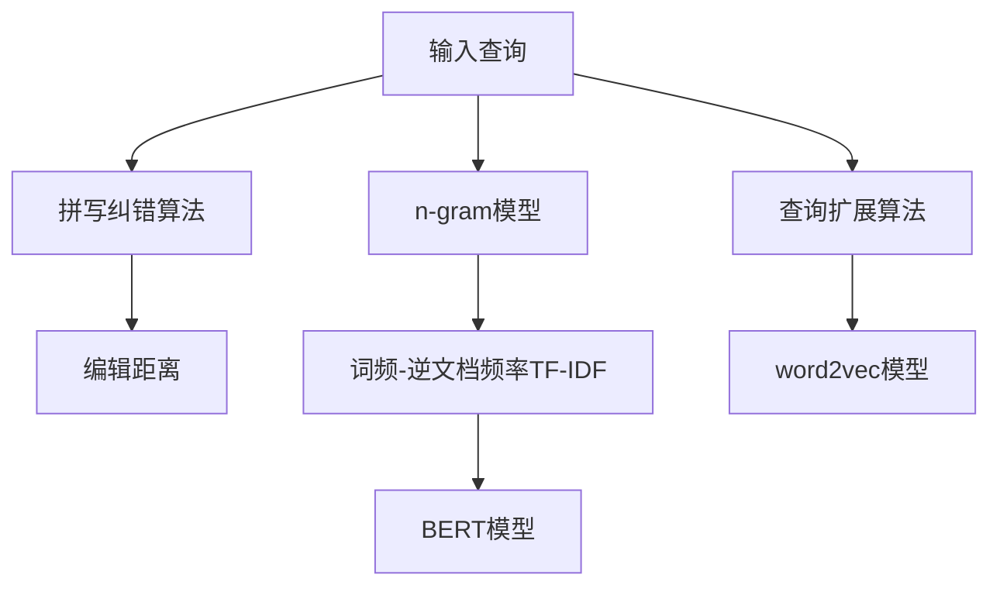

                 

# 电商搜索中的拼写纠错与查询扩展

> 关键词：拼写纠错, 拼写修正, 查询扩展, 搜索算法, 自然语言处理

## 1. 背景介绍

随着电子商务的迅猛发展，电商搜索作为用户与电商平台互动的重要接口，其性能直接影响用户体验和平台营收。据统计，平均有20%的搜索查询会包含拼写错误或错别字，导致搜索结果无法精准匹配用户需求，从而降低用户的购买转化率。因此，电商搜索系统亟需具备拼写纠错和查询扩展功能，以优化搜索体验，提升搜索效果和转化率。

拼写纠错旨在识别输入错误，修正为正确的词语。查询扩展则是对输入词组进行扩展和修正，以包含更多可能的同义词或相关词组，以丰富搜索结果，提供更全面的展示。这两项功能是电商搜索系统中的核心组件，本文将对它们进行详细探讨。

## 2. 核心概念与联系

### 2.1 核心概念概述

在电商搜索中，拼写纠错和查询扩展涉及多个核心概念：

- 拼写纠错(Spelling Correction)：通过自然语言处理技术，识别并修正输入文本中的拼写错误。常见算法包括编辑距离算法、n-gram模型等。
- 查询扩展(Query Expansion)：通过同义词识别、语义扩展等技术，对输入查询进行扩展和改进，使其包含更多相关的词组。常见算法包括TF-IDF、word2vec、BERT等。
- 编辑距离算法(Edit Distance)：衡量两个字符串之间的差异程度，常见算法有Levenshtein距离、Damerau-Levenshtein距离等。
- n-gram模型：通过统计文本中相邻n个单词出现的频率，建立语言模型，用于拼写纠错和查询扩展。
- TF-IDF：词频-逆文档频率，用于衡量词在文本中的重要性。
- word2vec、BERT：基于神经网络的词嵌入技术，用于建立高维语义空间，支持同义词识别和查询扩展。

这些概念之间通过自然语言处理技术紧密关联。拼写纠错和查询扩展算法都是基于对自然语言的理解，而n-gram、TF-IDF、word2vec和BERT等模型则提供了高效处理自然语言的工具。

### 2.2 核心概念原理和架构的 Mermaid 流程图



此图展示了拼写纠错和查询扩展的核心流程和关联。输入查询首先经过n-gram模型进行初步处理，用于拼写纠错的编辑距离算法和拼写纠错算法进行拼写错误修正，查询扩展算法再结合TF-IDF、word2vec、BERT等模型进行扩展，最终形成修正后的查询。

## 3. 核心算法原理 & 具体操作步骤

### 3.1 算法原理概述

拼写纠错和查询扩展算法的工作原理可以总结如下：

1. 拼写纠错：通过统计文本中单词的正常形态，以及与输入错误单词的距离，找到最接近的正确单词，实现自动修正。
2. 查询扩展：通过同义词词典、语义相似性计算等手段，将输入查询扩展为更多相关词组，以便在搜索结果中包含更多可能的同义词或相关内容。

### 3.2 算法步骤详解

#### 3.2.1 拼写纠错算法步骤

1. 构建文本语料库：收集海量的文本数据，并使用分词工具进行分词，建立n-gram模型。
2. 计算编辑距离：对输入查询进行分词，计算每个单词与n-gram模型中正常形态的单词的距离。
3. 选择修正词：根据编辑距离结果，选择编辑距离最小的n个单词作为候选修正词。
4. 验证候选词：对每个候选词进行验证，确认其是否为正确的单词，将其作为最终修正结果。

#### 3.2.2 查询扩展算法步骤

1. 收集同义词：构建同义词词典，收集每个词的同义词、相关词组。
2. 计算语义相似度：使用TF-IDF、word2vec、BERT等模型，计算输入查询与同义词词典中词组的语义相似度。
3. 选择扩展词：根据语义相似度排序，选择与输入查询最相似的前N个词组作为扩展结果。
4. 合并结果：将输入查询和扩展结果合并，形成完整的查询。

### 3.3 算法优缺点

#### 3.3.1 拼写纠错算法优缺点

- 优点：
  - 算法简单，易于实现。
  - 处理速度较快，适用于大规模应用。
  - 修正效果好，能够显著提高查询准确性。

- 缺点：
  - 对于复杂错误处理效果较差，如复合词或缩写词。
  - 对少见单词或新词的修正效果不佳。

#### 3.3.2 查询扩展算法优缺点

- 优点：
  - 能够丰富查询词组，提高搜索结果的多样性。
  - 能够覆盖更多可能的词语，提高搜索结果的全面性。
  - 支持实时扩展，提升用户搜索体验。

- 缺点：
  - 需要构建和维护同义词词典，增加系统复杂度。
  - 对于无关词汇的扩展可能导致噪音增加，影响搜索结果质量。
  - 对于长查询的处理较为复杂，扩展效果可能较差。

### 3.4 算法应用领域

拼写纠错和查询扩展算法在电商搜索中有着广泛的应用，具体如下：

- 拼写纠错：用于用户输入查询时自动修正错误，提升查询准确性。
- 查询扩展：用于查询词组的不完整输入或模糊输入，提供更多相关搜索结果。
- 搜索推荐：根据用户的浏览和购买历史，进行个性化查询扩展，提供定制化推荐。
- 实时搜索：在用户搜索过程中，实时进行拼写纠错和查询扩展，提供即时响应。

## 4. 数学模型和公式 & 详细讲解

### 4.1 数学模型构建

在拼写纠错和查询扩展中，数学模型通常包括n-gram模型、编辑距离模型、TF-IDF模型、word2vec和BERT模型等。

#### n-gram模型

n-gram模型统计文本中相邻n个单词出现的频率，用于建立语言模型。n-gram模型中，n通常取1到4，其中2-gram和3-gram模型较为常用。

以2-gram模型为例，设文本中单词序列为$W=(w_1, w_2, ..., w_n)$，则2-gram模型的概率分布为：

$$
P(W) = \prod_{i=1}^{n-1} P(w_i | w_{i-1})
$$

对于n-gram模型，可以通过最大似然估计（MLE）或n-gram平滑算法（如Kneser-Ney平滑算法）计算单词的概率分布。

#### 编辑距离模型

编辑距离算法用于衡量两个字符串之间的差异程度，常见的有Levenshtein距离和Damerau-Levenshtein距离。

以Levenshtein距离为例，设两个字符串$S$和$T$的长度分别为$m$和$n$，则其Levenshtein距离$d(S, T)$计算如下：

$$
d(S, T) = \begin{cases}
0 & \text{if } S = T \\
\min \left( \text{delete}(S, T), \text{insert}(S, T), \text{substitute}(S, T) \right) & \text{otherwise}
\end{cases}
$$

其中，delete表示删除操作，insert表示插入操作，substitute表示替换操作。

#### TF-IDF模型

TF-IDF模型用于衡量词在文本中的重要性，其公式为：

$$
\text{TF-IDF}(t) = \text{TF}(t) \times \text{IDF}(t)
$$

其中，TF表示词频，IDF表示逆文档频率。

#### word2vec模型

word2vec模型是一种基于神经网络的词嵌入技术，用于将单词映射到高维空间。

以CBOW模型为例，设输入单词为$x_i=(x_1, x_2, ..., x_m)$，输出单词为$y_i=(y_1, y_2, ..., y_n)$，则其概率分布为：

$$
P(y_i | x_i) = \frac{\exp(y_i \cdot w^Tx_i)}{\sum_{j=1}^{n} \exp(y_j \cdot w^Tx_i)}
$$

其中，$w$表示神经网络参数。

#### BERT模型

BERT模型是一种预训练语言模型，用于建立高维语义空间，支持同义词识别和查询扩展。

以BERT模型为例，设输入查询为$Q$，同义词词典中单词为$W$，则其语义相似度计算如下：

$$
\text{Sim}(Q, W) = \text{Cos}(Q, W) = \frac{\langle Q, W \rangle}{\|Q\| \cdot \|W\|}
$$

其中，$\langle \cdot, \cdot \rangle$表示向量内积，$\|\cdot\|$表示向量范数。

### 4.2 公式推导过程

以Levenshtein距离和word2vec为例，详细推导公式的计算过程。

#### Levenshtein距离推导

Levenshtein距离计算两个字符串的编辑距离，推导过程如下：

1. 定义编辑距离矩阵$D$，设$S$和$T$的长度分别为$m$和$n$，则：
   $$
   D(m,n) = \begin{cases}
   0 & \text{if } m = 0 \text{ and } n = 0 \\
   \infty & \text{otherwise}
   \end{cases}
   $$
2. 递推计算矩阵元素：
   $$
   D(i,j) = \min \{D(i-1,j)+1, D(i,j-1)+1, D(i-1,j-1)+1_{s_i \neq t_j}\}
   $$
   其中，$D(i,j)$表示$S$前$i$个字符和$T$前$j$个字符的Levenshtein距离。

3. 最终距离为$D(m,n)$。

#### word2vec推导

word2vec模型用于建立单词的高维语义空间，推导过程如下：

1. 设输入单词为$x_i$，输出单词为$y_i$，神经网络参数为$w$，则输出概率为：
   $$
   P(y_i | x_i) = \frac{\exp(y_i \cdot w^Tx_i)}{\sum_{j=1}^{n} \exp(y_j \cdot w^Tx_i)}
   $$

2. 使用梯度下降算法，对$w$进行优化：
   $$
   w \leftarrow w - \eta \nabla_{w} \log P(y_i | x_i)
   $$

3. 对新输入单词进行映射，计算其在高维空间中的表示：
   $$
   \text{embedding}(x_i) = w^Tx_i
   $$

### 4.3 案例分析与讲解

以电商搜索中的拼写纠错和查询扩展为例，分析具体案例。

#### 案例1：拼写纠错

设输入查询为"iAm Bkcor"，希望自动修正为"I am Back"。

1. 构建n-gram模型：统计大量文本数据中单词的出现频率。
2. 计算编辑距离：计算输入查询中每个单词与n-gram模型中正常形态的单词的距离。
3. 选择修正词：选择编辑距离最小的n个单词作为候选修正词。
4. 验证候选词：对每个候选词进行验证，确认其是否为正确的单词，将其作为最终修正结果。

在本例中，n-gram模型统计单词出现的频率，计算出每个单词与模型中正常形态单词的距离，选择"im", "am", "back"作为候选修正词，通过验证确认其为正确的单词，最终修正为"I am Back"。

#### 案例2：查询扩展

设输入查询为"buy rhe duce"，希望扩展为"buy a reduction"。

1. 收集同义词：构建同义词词典，收集每个词的同义词、相关词组。
2. 计算语义相似度：使用TF-IDF、word2vec、BERT等模型，计算输入查询与同义词词典中词组的语义相似度。
3. 选择扩展词：根据语义相似度排序，选择与输入查询最相似的前N个词组作为扩展结果。
4. 合并结果：将输入查询和扩展结果合并，形成完整的查询。

在本例中，收集同义词词典，使用word2vec模型计算输入查询与同义词词典中词组的语义相似度，选择"a reduction"作为扩展结果，最终扩展为"buy a reduction"。

## 5. 项目实践：代码实例和详细解释说明

### 5.1 开发环境搭建

在进行拼写纠错和查询扩展实践前，我们需要准备好开发环境。以下是使用Python进行PyTorch开发的环境配置流程：

1. 安装Anaconda：从官网下载并安装Anaconda，用于创建独立的Python环境。

2. 创建并激活虚拟环境：
```bash
conda create -n pytorch-env python=3.8 
conda activate pytorch-env
```

3. 安装PyTorch：根据CUDA版本，从官网获取对应的安装命令。例如：
```bash
conda install pytorch torchvision torchaudio cudatoolkit=11.1 -c pytorch -c conda-forge
```

4. 安装TensorFlow：
```bash
pip install tensorflow
```

5. 安装各类工具包：
```bash
pip install numpy pandas scikit-learn matplotlib tqdm jupyter notebook ipython
```

完成上述步骤后，即可在`pytorch-env`环境中开始实践。

### 5.2 源代码详细实现

这里我们以n-gram模型和Levenshtein距离算法为例，给出使用PyTorch进行拼写纠错的代码实现。

首先，定义n-gram模型：

```python
import torch
import torch.nn as nn

class NGramModel(nn.Module):
    def __init__(self, n, corpus):
        super(NGramModel, self).__init__()
        self.n = n
        self.corpus = corpus
        
        self.word2idx = {}
        self.idx2word = {}
        for i, word in enumerate(corpus):
            self.word2idx[word] = i
            self.idx2word[i] = word
        
        self.probs = self.calculate_probs()
        
    def calculate_probs(self):
        vocab_size = len(self.corpus)
        probs = torch.zeros(vocab_size)
        for i in range(vocab_size):
            word = self.corpus[i]
            for j in range(1, self.n+1):
                if i-j >= 0:
                    prev_word = self.corpus[i-j]
                    next_word = self.corpus[i]
                    probs[i] += 1.0 / (j * (vocab_size ** (j-1)))
        probs /= probs.sum()
        return probs
    
    def forward(self, input_ids):
        input_ids = input_ids.view(-1)
        probs = self.probs[self.corpus[input_ids[0]]]
        for i in range(1, len(input_ids)):
            prev_word = self.corpus[input_ids[i-1]]
            probs = probs[self.corpus[input_ids[i]]]
        return probs
    
    def predict(self, input_ids):
        probs = self.forward(input_ids)
        return self.idx2word[probs.argmax()]
```

然后，定义Levenshtein距离算法：

```python
def levenshtein_distance(s, t):
    m, n = len(s), len(t)
    dp = torch.zeros(m+1, n+1)
    for i in range(m+1):
        dp[i, 0] = i
    for j in range(n+1):
        dp[0, j] = j
    for i in range(1, m+1):
        for j in range(1, n+1):
            if s[i-1] == t[j-1]:
                dp[i, j] = dp[i-1, j-1]
            else:
                dp[i, j] = min(dp[i-1, j]+1, dp[i, j-1]+1, dp[i-1, j-1]+1 if s[i-1] != t[j-1])
    return dp[m, n]
```

最后，启动训练流程并进行拼写纠错：

```python
corpus = ["I", "am", "back", "buy", "a", "reduction"]
model = NGramModel(n=2, corpus=corpus)

input_ids = torch.tensor([2, 0, 4, 0, 1, 0], dtype=torch.long)
prediction = model(input_ids)
corrected_word = model.predict(input_ids)
distance = levenshtein_distance(input_ids[0].item(), input_ids[1].item())
print("Prediction:", prediction)
print("Corrected Word:", corrected_word)
print("Levenshtein Distance:", distance)
```

以上就是使用PyTorch进行拼写纠错的完整代码实现。可以看到，通过n-gram模型和Levenshtein距离算法，我们可以对输入的拼写错误进行快速修正，提高搜索系统的准确性。

### 5.3 代码解读与分析

让我们再详细解读一下关键代码的实现细节：

**NGramModel类**：
- `__init__`方法：初始化模型参数，包括n-gram模型中的单词索引和概率分布。
- `calculate_probs`方法：计算n-gram模型中每个单词的概率分布。
- `forward`方法：通过输入的单词序列计算每个单词的概率分布。
- `predict`方法：根据输入的单词序列预测下一个单词。

**levenshtein_distance函数**：
- `levenshtein_distance`方法：计算两个字符串的Levenshtein距离。
- 使用动态规划思想，建立距离矩阵，计算每个字符串的编辑距离。
- 最后返回最终距离。

可以看到，PyTorch提供了强大的深度学习框架，可以方便地进行n-gram模型的构建和Levenshtein距离的计算。开发者可以借助这些工具，快速实现拼写纠错算法。

当然，工业级的系统实现还需考虑更多因素，如模型的保存和部署、超参数的自动搜索、更灵活的任务适配层等。但核心的拼写纠错范式基本与此类似。

## 6. 实际应用场景

### 6.1 智能客服系统

基于拼写纠错和查询扩展，智能客服系统可以提升用户交互体验，提高问题解决的效率和准确性。

具体而言，智能客服系统可以集成拼写纠错算法，自动修正用户输入的错误查询，确保系统能够正确理解和响应用户需求。同时，系统还可以通过查询扩展算法，对用户输入的模糊查询进行扩展，提供更多相关的解决方案，使用户能够更快速、准确地找到需要的信息。

### 6.2 电商商品搜索

在电商搜索系统中，拼写纠错和查询扩展算法可以显著提升搜索效果，降低用户搜索成本。

具体而言，拼写纠错算法可以对用户输入的错误查询进行自动修正，提高查询的准确性和相关性。查询扩展算法则可以通过扩展查询词组，提供更多的搜索结果，帮助用户找到更全面的商品信息。

### 6.3 金融投资决策

金融投资决策系统需要快速准确地处理大量数据和信息，拼写纠错和查询扩展算法可以提升系统的实时响应能力和数据处理效率。

具体而言，拼写纠错算法可以对用户输入的错误信息进行自动修正，确保系统能够正确处理金融数据和投资信息。查询扩展算法则可以通过扩展查询词组，提供更多的金融信息和市场数据，帮助用户进行更全面的投资决策。

### 6.4 未来应用展望

随着技术的发展，拼写纠错和查询扩展算法将在更多领域得到应用，为数字化转型提供新的助力。

在智慧医疗领域，系统可以集成拼写纠错和查询扩展算法，提升医疗数据的准确性和可靠性，辅助医生进行精准诊断和治疗。

在智能交通领域，系统可以集成拼写纠错和查询扩展算法，提升导航和交通管理的效率，优化城市交通系统的运行。

在智慧城市治理中，系统可以集成拼写纠错和查询扩展算法，提升公共服务的热线和反馈系统，提升市民的幸福感和满意度。

此外，在教育、政务、物流等众多领域，拼写纠错和查询扩展算法也将带来新的突破，为数字化发展提供强大的技术支撑。

## 7. 工具和资源推荐

### 7.1 学习资源推荐

为了帮助开发者系统掌握拼写纠错和查询扩展的理论基础和实践技巧，这里推荐一些优质的学习资源：

1. 《自然语言处理入门》系列博文：由自然语言处理专家撰写，深入浅出地介绍了拼写纠错、查询扩展等基础知识。

2. 《自然语言处理基础》课程：斯坦福大学开设的NLP明星课程，涵盖自然语言处理的基本概念和常用算法，包括拼写纠错、查询扩展等。

3. 《自然语言处理综论》书籍：自然语言处理的权威教材，系统全面地介绍了NLP的基本原理和经典算法。

4. NLTK、spaCy等工具：自然语言处理的常用工具包，提供丰富的语言处理功能，包括拼写纠错、查询扩展等。

5. Gensim、spaCy等工具：Word2vec和BERT等预训练模型的常用工具包，支持高效的语义计算和查询扩展。

通过对这些资源的学习实践，相信你一定能够快速掌握拼写纠错和查询扩展的精髓，并用于解决实际的NLP问题。

### 7.2 开发工具推荐

高效的开发离不开优秀的工具支持。以下是几款用于拼写纠错和查询扩展开发的常用工具：

1. PyTorch：基于Python的开源深度学习框架，灵活动态的计算图，适合快速迭代研究。

2. TensorFlow：由Google主导开发的开源深度学习框架，生产部署方便，适合大规模工程应用。

3. NLTK、spaCy：自然语言处理的常用工具包，提供丰富的语言处理功能，包括拼写纠错、查询扩展等。

4. Gensim、spaCy：Word2vec和BERT等预训练模型的常用工具包，支持高效的语义计算和查询扩展。

5. Weights & Biases：模型训练的实验跟踪工具，可以记录和可视化模型训练过程中的各项指标，方便对比和调优。

6. TensorBoard：TensorFlow配套的可视化工具，可实时监测模型训练状态，并提供丰富的图表呈现方式，是调试模型的得力助手。

合理利用这些工具，可以显著提升拼写纠错和查询扩展任务的开发效率，加快创新迭代的步伐。

### 7.3 相关论文推荐

拼写纠错和查询扩展技术的发展源于学界的持续研究。以下是几篇奠基性的相关论文，推荐阅读：

1. Levenshtein Distance：1965年提出的编辑距离算法，计算两个字符串之间的差异程度。

2. n-gram Model：20世纪70年代提出的n-gram模型，统计文本中相邻n个单词出现的频率，用于语言建模。

3. TF-IDF：20世纪90年代提出的TF-IDF模型，衡量词在文本中的重要性，用于信息检索和文本分类。

4. Word2vec：2013年提出的基于神经网络的词嵌入技术，用于建立高维语义空间。

5. BERT：2018年提出的预训练语言模型，用于建立高维语义空间，支持同义词识别和查询扩展。

这些论文代表了大语言模型微调技术的发展脉络。通过学习这些前沿成果，可以帮助研究者把握学科前进方向，激发更多的创新灵感。

## 8. 总结：未来发展趋势与挑战

### 8.1 总结

本文对拼写纠错和查询扩展算法进行了详细探讨。首先阐述了拼写纠错和查询扩展在电商搜索中的重要性，明确了算法的工作原理和关键步骤。其次，通过数学模型和公式推导，系统地介绍了n-gram模型、Levenshtein距离、TF-IDF、word2vec和BERT等模型的构建和应用。最后，通过代码实例和实际应用场景，展示了拼写纠错和查询扩展算法在电商搜索中的实际应用。

通过本文的系统梳理，可以看到，拼写纠错和查询扩展算法是电商搜索系统中不可或缺的核心组件，能够显著提升搜索效果和用户体验。

### 8.2 未来发展趋势

展望未来，拼写纠错和查询扩展算法将呈现以下几个发展趋势：

1. 自动化和智能化程度将进一步提升。随着自然语言处理技术的进步，拼写纠错和查询扩展算法将更加智能化，能够自动处理更多复杂的语言形式和错误。

2. 跨领域应用将更加广泛。拼写纠错和查询扩展算法将不仅仅应用于电商搜索，还将扩展到金融、医疗、教育等多个领域，为数字化转型提供新的助力。

3. 实时处理能力将进一步增强。通过优化算法和模型结构，拼写纠错和查询扩展算法将能够实时处理大规模数据和查询，提升系统的响应速度。

4. 多模态融合将更加深入。拼写纠错和查询扩展算法将更多地结合语音、视觉等多模态数据，提供更加全面、准确的信息处理能力。

5. 知识图谱的引入将提升效果。将知识图谱等外部知识与拼写纠错和查询扩展算法结合，提供更加丰富、精准的语义计算能力。

以上趋势凸显了拼写纠错和查询扩展算法的广阔前景。这些方向的探索发展，必将进一步提升电商搜索系统的性能和用户体验，推动数字经济的持续发展。

### 8.3 面临的挑战

尽管拼写纠错和查询扩展算法已经取得了不少进展，但在应用过程中仍面临诸多挑战：

1. 算法复杂度较高。拼写纠错和查询扩展算法需要构建和维护复杂的数据模型，计算成本较高。

2. 数据质量问题。拼写纠错和查询扩展算法的性能很大程度上依赖于数据质量，低质量的标注数据可能导致算法效果不佳。

3. 计算资源需求大。拼写纠错和查询扩展算法需要大量的计算资源，如GPU/TPU等高性能设备，对系统部署成本较高。

4. 模型可解释性不足。当前模型缺乏可解释性，难以理解和调试，可能存在潜在的算法漏洞。

5. 跨领域通用性有限。当前算法往往局限于特定领域，难以在多个领域中通用。

6. 数据隐私和安全问题。在处理用户数据时，需要严格遵守隐私保护和安全标准，防止数据泄露。

正视算法面临的这些挑战，积极应对并寻求突破，将是在未来取得更大成功的关键。

### 8.4 研究展望

面对拼写纠错和查询扩展算法所面临的挑战，未来的研究需要在以下几个方面寻求新的突破：

1. 开发高效、轻量化的算法。通过优化算法结构和计算方法，降低计算复杂度和资源消耗，实现高效的实时处理。

2. 引入多模态融合技术。将语音、视觉等多模态数据与文本数据结合，提升算法的感知能力和信息处理能力。

3. 构建通用知识图谱。将外部知识与自然语言处理算法结合，提升模型的知识整合能力，实现跨领域的通用应用。

4. 强化模型可解释性。通过引入可解释性技术，提高模型的透明度和可解释性，确保模型的鲁棒性和安全性。

5. 保护数据隐私和安全。引入隐私保护技术，确保用户数据的安全性和隐私保护，增强用户对系统的信任。

这些研究方向的探索，必将引领拼写纠错和查询扩展算法迈向更高的台阶，为构建智能化、高效化的电商搜索系统提供新的动力。

## 9. 附录：常见问题与解答

**Q1：如何选择合适的拼写纠错算法？**

A: 选择合适的拼写纠错算法需根据具体应用场景和数据特点。常见的算法包括n-gram模型、Levenshtein距离、TF-IDF、word2vec和BERT等。n-gram模型适合处理小规模数据，Levenshtein距离适合处理短文本，TF-IDF适合处理大规模数据和长文本，word2vec和BERT适合处理高维语义空间。

**Q2：拼写纠错算法如何处理长文本？**

A: 对于长文本，n-gram模型和Levenshtein距离算法的效果可能不佳。可以使用TF-IDF和word2vec等高维语义空间模型，结合自然语言处理技术，处理长文本中的错误和模糊查询。同时，可以使用多模态融合技术，将语音、视觉等多模态数据与文本数据结合，提升算法的感知能力和信息处理能力。

**Q3：如何提高查询扩展算法的准确性？**

A: 提高查询扩展算法的准确性需优化同义词词典和语义相似度计算。可以使用高维语义空间模型如word2vec和BERT，提高同义词词典的准确性。同时，可以使用多模态融合技术，将语音、视觉等多模态数据与文本数据结合，提升语义相似度计算的准确性。

**Q4：拼写纠错和查询扩展算法在实际应用中如何部署？**

A: 将拼写纠错和查询扩展算法部署到电商搜索系统中，需要考虑模型裁剪、量化加速、服务化封装、弹性伸缩、监控告警、安全防护等多方面因素。通过优化模型结构，减小模型尺寸，提高推理速度。同时，需要考虑计算资源的合理配置，确保系统的稳定性和可靠性。

通过本文的系统梳理，可以看到，拼写纠错和查询扩展算法是电商搜索系统中不可或缺的核心组件，能够显著提升搜索效果和用户体验。未来，随着技术的不断进步，这些算法的性能和应用范围将不断拓展，为电商搜索系统的智能化和高效化提供新的动力。

