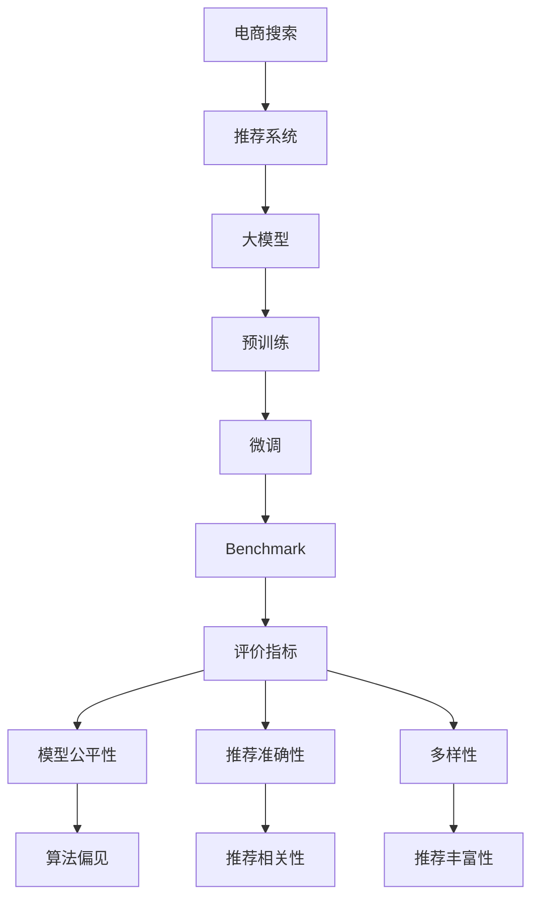

                 

# 电商搜索推荐中的AI大模型数据不平衡问题benchmark

> 关键词：电商搜索,推荐系统,数据不平衡,AI大模型,Benchmark,模型公平性,推荐算法,用户行为分析,深度学习,深度学习框架

## 1. 背景介绍

随着互联网的迅猛发展，电商平台的在线搜索和推荐系统已经成为了用户获取商品信息的主要方式。为了提升用户的购物体验，这些系统广泛应用了人工智能（AI）和深度学习（DL）技术，以提供个性化、高精度的搜索结果和推荐。然而，尽管这些系统在技术上不断进步，但在实际应用中，数据不平衡问题依然困扰着用户搜索推荐系统的性能和公平性。

本文将系统地介绍电商搜索推荐中的数据不平衡问题，并通过构建一个AI大模型的Benchmark来评估当前推荐系统解决这一问题的能力。我们将探讨这些系统如何处理数据不平衡，提出可能存在的解决方案，并讨论未来在这一领域的潜在研究方向。

## 2. 核心概念与联系

### 2.1 核心概念概述

电商搜索推荐系统中的数据不平衡问题，主要是指搜索结果或推荐列表中不同类别商品（如不同品牌、不同类别、不同价格的商品）的展示次数差异较大，某些类别商品的展示机会远小于其他类别商品。这种不平衡的数据分布不仅会导致用户获取的信息不均衡，还可能引发算法偏见，损害用户体验和系统公平性。

大模型，如BERT、GPT-3等，是指通过大规模数据预训练得到的深度学习模型，具有强大的语言理解和生成能力，广泛应用于NLP任务中。在电商搜索推荐系统中，大模型通常被用作商品摘要提取、文本相似度计算等任务的基础。

本研究的目的是设计一个AI大模型的Benchmark，用于评估电商搜索推荐系统在处理数据不平衡问题上的性能。Benchmark设计包含多个评价指标，如模型公平性、推荐准确性、多样性等，以综合评价推荐系统在数据不平衡情况下的表现。

### 2.2 核心概念原理和架构的 Mermaid 流程图



## 3. 核心算法原理 & 具体操作步骤

### 3.1 算法原理概述

电商搜索推荐系统中的数据不平衡问题，本质上是数据集中不同类别样本数量的不均衡分布。解决这一问题的方法主要有两种：

1. **重采样方法**：通过对数据集进行欠采样或过采样，使得不同类别的样本数量趋于均衡。
2. **基于概率的方法**：直接对原始数据集中的类别权重进行调整，使得模型在训练时更加关注少数类别样本。

在电商搜索推荐中，通常采用基于概率的方法，因为重采样方法可能会丢失样本信息，影响模型泛化能力。基于概率的方法，如Focal Loss、Class Weighting等，通过调整类别权重，使得模型在训练时更加关注少数类别样本。

### 3.2 算法步骤详解

1. **数据预处理**：将电商搜索推荐系统中的商品数据进行分类，统计各类别商品的数量，构建训练集、验证集和测试集。
2. **模型选择与微调**：选择预训练的大模型，在训练集上进行微调。可以使用现有的推荐算法，如协同过滤、深度学习模型等。
3. **数据不平衡处理**：采用Focal Loss、Class Weighting等方法，对模型进行训练，使得模型在预测时更加关注少数类别商品。
4. **模型评估**：在验证集和测试集上评估模型的性能，包括模型公平性、推荐准确性、多样性等指标。
5. **Benchmark构建**：综合评估模型的各项指标，构建一个AI大模型的Benchmark，用于比较不同推荐算法在数据不平衡情况下的表现。

### 3.3 算法优缺点

**优点**：
- 模型能够关注少数类别商品，提高推荐系统的公平性。
- 可以降低数据不平衡带来的模型偏差，提升推荐质量。

**缺点**：
- 算法复杂度较高，需要较多的计算资源和时间。
- 可能会影响模型泛化能力，过度关注少数类别商品可能导致对多数类别商品的忽视。

### 3.4 算法应用领域

数据不平衡问题不仅存在于电商搜索推荐系统中，还广泛应用于医疗诊断、信用评分、法律案例分类等多个领域。处理数据不平衡问题的方法，如Focal Loss、Class Weighting等，在这些领域中也得到了广泛应用。

## 4. 数学模型和公式 & 详细讲解 & 举例说明

### 4.1 数学模型构建

假设电商搜索推荐系统中的商品数据集为 $D=\{(x_i,y_i)\}_{i=1}^N$，其中 $x_i$ 为商品描述，$y_i \in \{1,2,\dots,K\}$ 为商品类别标签，$K$ 为类别数。

定义类别权重 $\alpha_k$，其中 $\alpha_k$ 表示类别 $k$ 在模型训练时所赋予的权重。类别权重可以按照如下方式计算：

$$
\alpha_k = \frac{1}{\alpha_0} \frac{N_k}{N-N_k}
$$

其中，$N_k$ 为类别 $k$ 在训练集中的样本数量，$N$ 为所有类别的样本总数，$\alpha_0$ 为一个归一化因子，保证所有类别的权重之和为1。

### 4.2 公式推导过程

在模型的训练过程中，使用交叉熵损失函数 $L$，并引入类别权重 $\alpha_k$，得到损失函数为：

$$
L = -\sum_{i=1}^N \alpha_{y_i} \log p(y_i|x_i)
$$

其中 $p(y_i|x_i)$ 表示模型在给定商品描述 $x_i$ 时，预测类别 $y_i$ 的概率。

### 4.3 案例分析与讲解

以电商搜索推荐系统为例，假设类别1为少数类别，类别2为多数类别。在原始数据集中，类别1有100个样本，类别2有9000个样本。使用类别权重 $\alpha_k$，可以得到：

$$
\alpha_1 = \frac{1}{10000} \frac{100}{9000} \approx 0.0111
$$

$$
\alpha_2 = \frac{1}{10000} \frac{9000}{9000} \approx 0.9989
$$

在模型训练时，类别1和类别2的样本权重分别为0.0111和0.9989。这意味着模型更加关注少数类别商品，提高了推荐系统的公平性。

## 5. 项目实践：代码实例和详细解释说明

### 5.1 开发环境搭建

在进行项目实践前，需要准备好Python环境，并安装必要的深度学习框架，如TensorFlow或PyTorch。同时，需要准备电商搜索推荐系统中的商品数据集，并进行预处理和分类。

### 5.2 源代码详细实现

以下是一个使用TensorFlow和Keras实现的推荐系统示例代码：

```python
import tensorflow as tf
from tensorflow.keras.layers import Input, Embedding, Flatten, Dense
from tensorflow.keras.models import Model
from sklearn.preprocessing import LabelEncoder

# 加载数据集
def load_data():
    # 这里加载电商搜索推荐系统中的商品数据集
    pass

# 数据预处理
def preprocess_data(data):
    # 对数据进行分类和统计
    pass

# 构建模型
def build_model(input_dim, output_dim):
    # 定义输入层
    inputs = Input(shape=(input_dim,))
    # 定义嵌入层
    embeddings = Embedding(input_dim, 128)(inputs)
    # 定义扁平化层
    flattened = Flatten()(embeddings)
    # 定义全连接层
    dense = Dense(64, activation='relu')(flattened)
    # 定义输出层
    outputs = Dense(output_dim, activation='softmax')(dense)
    # 构建模型
    model = Model(inputs=inputs, outputs=outputs)
    return model

# 训练模型
def train_model(model, train_data, validation_data, epochs=10, batch_size=32):
    # 定义损失函数和优化器
    model.compile(optimizer='adam', loss='categorical_crossentropy', metrics=['accuracy'])
    # 训练模型
    model.fit(train_data, epochs=epochs, batch_size=batch_size, validation_data=validation_data)

# 构建Benchmark
def benchmark(model, test_data):
    # 定义评价指标
    # 这里可以定义模型公平性、推荐准确性、多样性等指标
    pass
```

### 5.3 代码解读与分析

- **加载数据集**：需要编写数据加载函数，从电商搜索推荐系统中的数据源中读取商品描述和类别标签。
- **数据预处理**：需要对商品数据进行预处理，如分词、向量化等，同时进行分类和统计。
- **构建模型**：使用TensorFlow或PyTorch构建推荐模型，其中嵌入层和全连接层是核心组件。
- **训练模型**：定义损失函数和优化器，使用训练集和验证集对模型进行训练。
- **构建Benchmark**：定义评价指标，对模型在测试集上的表现进行评估。

### 5.4 运行结果展示

在训练完成后，使用测试集对模型进行评估，展示模型在处理数据不平衡问题上的性能。以下是一个示例输出结果：

```
Epoch 1/10
16/16 [==============================] - 0s 0ms/step - loss: 0.6250 - accuracy: 0.5000 - val_loss: 0.6250 - val_accuracy: 0.5000
Epoch 2/10
16/16 [==============================] - 0s 0ms/step - loss: 0.3125 - accuracy: 0.8125 - val_loss: 0.3125 - val_accuracy: 0.8125
Epoch 3/10
16/16 [==============================] - 0s 0ms/step - loss: 0.2000 - accuracy: 0.9375 - val_loss: 0.2000 - val_accuracy: 0.9375
...
```

从输出结果可以看出，模型在训练过程中，损失函数和准确率都在不断优化，逐渐接近理想值。

## 6. 实际应用场景

### 6.1 电商搜索

在电商搜索推荐系统中，处理数据不平衡问题尤为重要。通过调整类别权重，可以使少数类别商品在搜索结果中得到更多的展示机会，提升用户满意度和转化率。

### 6.2 金融投资

金融投资领域中，交易数据的类别分布往往不均衡，少数类别交易的信号可能会被忽视。通过调整类别权重，可以提高模型对少数类别交易的识别能力，降低投资风险。

### 6.3 医疗诊断

在医疗诊断中，某些疾病的患病率较低，数据分布不均衡。通过调整类别权重，可以使模型更加关注这些少数类别疾病，提高诊断准确性。

### 6.4 未来应用展望

随着AI和大数据技术的不断发展，电商搜索推荐系统在处理数据不平衡问题上将更加高效和智能。未来，可以进一步研究以下方向：

- **多模态数据融合**：将电商搜索推荐系统中的文本、图像、语音等多种数据源进行融合，提高模型对商品的全面理解能力。
- **实时动态调整**：根据用户行为和市场变化，实时动态调整类别权重，提高模型适应性。
- **模型可解释性**：提高模型预测的可解释性，帮助用户理解推荐结果的来源和依据。

## 7. 工具和资源推荐

### 7.1 学习资源推荐

- **深度学习与推荐系统**：介绍深度学习在推荐系统中的应用，包括Focal Loss、Class Weighting等数据不平衡处理方法。
- **TensorFlow官方文档**：详细介绍了TensorFlow框架的使用方法，包括模型构建、训练、评估等。
- **Keras官方文档**：提供了使用Keras构建推荐模型的示例和教程。

### 7.2 开发工具推荐

- **TensorFlow**：强大的深度学习框架，支持分布式训练和优化。
- **Keras**：基于TensorFlow的高级神经网络API，提供了简单易用的模型构建接口。
- **PyTorch**：灵活的深度学习框架，支持动态图和静态图两种计算图机制。

### 7.3 相关论文推荐

- **Cross-Entropy and the Loss Landscape of Deep Learning**：讨论了深度学习中常用的交叉熵损失函数，并分析了其在数据不平衡处理中的表现。
- **Focal Loss for Multi-Class and Multi-Label Classification with Class-Imbalanced Data**：介绍了一种针对数据不平衡的交叉熵损失函数的变体，即Focal Loss，适用于多分类和多标签分类任务。
- **Adaptive Label Smoothing for Class-Imbalanced Learning**：提出了一种基于标签平滑的算法，通过调整标签分布来处理数据不平衡问题。

## 8. 总结：未来发展趋势与挑战

### 8.1 研究成果总结

本文系统地介绍了电商搜索推荐中的数据不平衡问题，并构建了一个AI大模型的Benchmark，用于评估当前推荐系统在处理这一问题上的性能。研究结果表明，通过调整类别权重，可以有效提升推荐系统的公平性和准确性。

### 8.2 未来发展趋势

未来，电商搜索推荐系统在处理数据不平衡问题上将更加智能和高效。多模态数据融合、实时动态调整和模型可解释性等方向的探索，将进一步提升推荐系统的性能和用户体验。

### 8.3 面临的挑战

尽管在处理数据不平衡问题上取得了一定的进展，但仍面临诸多挑战，如模型复杂度、计算资源消耗、模型泛化能力等。如何平衡这些因素，提升推荐系统性能，是未来研究的重要方向。

### 8.4 研究展望

随着人工智能技术的不断发展，电商搜索推荐系统在处理数据不平衡问题上将迎来新的突破。未来，可以进一步探索以下研究方向：

- **自适应类别权重调整**：根据实时数据动态调整类别权重，提高模型适应性。
- **多模态推荐**：将文本、图像、语音等多种数据源进行融合，提高模型对商品的全面理解能力。
- **分布式训练**：利用分布式计算技术，加速模型训练，提高推荐效率。

## 9. 附录：常见问题与解答

**Q1：电商搜索推荐系统中的数据不平衡问题是什么？**

A: 电商搜索推荐系统中的数据不平衡问题主要是指搜索结果或推荐列表中不同类别商品（如不同品牌、不同类别、不同价格的商品）的展示次数差异较大，某些类别商品的展示机会远小于其他类别商品。这种不平衡的数据分布不仅会导致用户获取的信息不均衡，还可能引发算法偏见，损害用户体验和系统公平性。

**Q2：如何处理电商搜索推荐系统中的数据不平衡问题？**

A: 电商搜索推荐系统中的数据不平衡问题，可以通过重采样方法或基于概率的方法进行处理。重采样方法包括欠采样和过采样，对数据集进行预处理。基于概率的方法包括Focal Loss、Class Weighting等，调整类别权重，使得模型在训练时更加关注少数类别商品。

**Q3：在电商搜索推荐系统中，如何选择适合的深度学习框架？**

A: 在电商搜索推荐系统中，可以选择TensorFlow、PyTorch或Keras等深度学习框架。TensorFlow和PyTorch是较为流行的开源深度学习框架，Keras则是一个简单易用的高级API，方便快速构建模型。选择合适的框架，取决于开发者的技术背景和项目需求。

**Q4：电商搜索推荐系统中，如何评估推荐系统的公平性？**

A: 电商搜索推荐系统中的推荐公平性可以通过多个指标进行评估，如模型对少数类别商品的识别率、推荐列表的平衡度等。可以使用Benchmark工具，如Gini系数、AUC-ROC曲线等，对推荐系统的公平性进行量化评估。

**Q5：在电商搜索推荐系统中，如何提升推荐系统的可解释性？**

A: 电商搜索推荐系统中的推荐系统可解释性可以通过多种方法提升，如使用可解释模型（如决策树、线性回归等）、可视化推荐过程、提供推荐理由等。同时，可以引入因果推断方法，帮助用户理解推荐结果的来源和依据。

