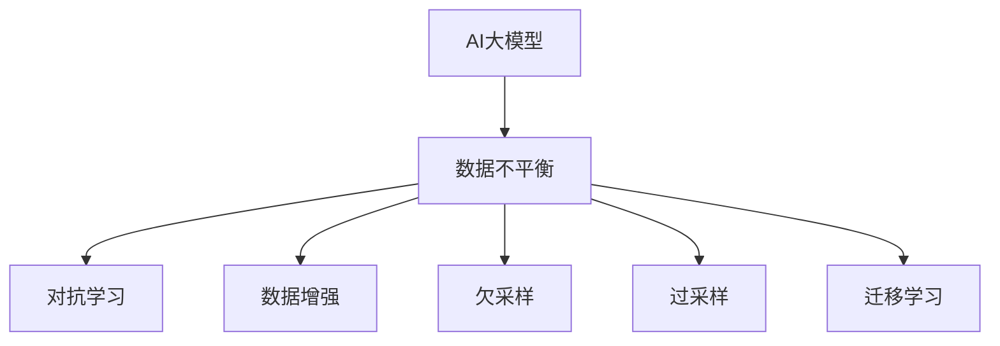

                 

# 电商搜索推荐中的AI大模型数据不平衡问题解决方案应用指南

> 关键词：
> AI大模型, 电商搜索, 推荐系统, 数据不平衡, 对抗学习, 数据增强, 欠采样, 过采样, 迁移学习

## 1. 背景介绍

### 1.1 问题由来
在电商搜索推荐系统中，用户点击、浏览、购买等行为数据往往呈现出明显的类别不平衡性。例如，在时尚产品推荐中，用户对个别特定款式或品牌的点击次数远高于其他款式或品牌，导致模型在训练过程中容易产生偏差。这种数据不平衡问题，在电商领域尤为严重，直接影响了推荐系统的公平性和准确性。

### 1.2 问题核心关键点
当前，解决电商搜索推荐中的数据不平衡问题，主要通过两种方法：
- 数据增强：通过扩充少数类数据或生成合成数据来缓解不平衡问题。
- 算法修正：利用对抗学习、迁移学习等算法，调整模型对少数类的关注度。

本文将重点介绍这些方法，并结合实际项目案例，展示其应用效果。

### 1.3 问题研究意义
电商搜索推荐系统的大规模应用，极大提升了用户体验和商家销售收益。然而，数据不平衡问题严重制约了推荐系统的效果，难以全面覆盖用户需求，甚至可能引发用户体验差、商家推荐效果不佳等问题。因此，解决数据不平衡问题，对提升电商推荐系统性能具有重要意义。

## 2. 核心概念与联系

### 2.1 核心概念概述

为更好地理解电商搜索推荐系统中的数据不平衡问题及其解决方案，本节将介绍几个密切相关的核心概念：

- **AI大模型**：指在电商搜索推荐系统中使用的基于预训练语言模型（如BERT、GPT等）的推荐系统。大模型通过大规模无标签文本数据的预训练，学习到丰富的语言表示，在电商搜索推荐系统中表现出强大的泛化能力和推理能力。

- **数据不平衡问题**：指电商搜索推荐系统训练数据中，不同类别样本数量差异较大的现象。数据不平衡可能导致模型偏向少数类样本，影响模型的泛化能力和推荐效果。

- **对抗学习**：通过生成对抗样本，调整模型对少数类的关注度，增强模型的鲁棒性，避免过拟合。

- **数据增强**：通过扩充少数类样本或生成合成数据，平衡训练集中的类别分布，提升模型的泛化能力。

- **迁移学习**：将一个领域学习到的知识迁移到另一个相关领域，通过在少数类数据集上进行微调，提升模型的分类性能。

- **欠采样**：通过减少多数类样本数量，缩小类别分布差异，减轻模型偏向少数类的倾向。

- **过采样**：通过增加少数类样本数量，平衡类别分布，提升模型对少数类的识别能力。

这些核心概念之间的逻辑关系可以通过以下Mermaid流程图来展示：



这个流程图展示了大模型在电商推荐系统中的应用中，面临的数据不平衡问题及其解决策略：

1. 大模型在电商推荐中学习到了各种商品特征，但在数据不平衡的情况下，模型容易偏向少数类。
2. 通过对抗学习、数据增强、欠采样、过采样、迁移学习等方法，可以调整模型对少数类的关注度，实现数据平衡。

## 3. 核心算法原理 & 具体操作步骤
### 3.1 算法原理概述

解决电商搜索推荐系统中的数据不平衡问题，通常包括以下几种算法：

1. **对抗学习**：通过生成对抗样本，调整模型对少数类的关注度，增强模型的鲁棒性，避免过拟合。

2. **数据增强**：通过扩充少数类数据或生成合成数据，平衡训练集中的类别分布，提升模型的泛化能力。

3. **欠采样**：通过减少多数类样本数量，缩小类别分布差异，减轻模型偏向少数类的倾向。

4. **过采样**：通过增加少数类样本数量，平衡类别分布，提升模型对少数类的识别能力。

5. **迁移学习**：将一个领域学习到的知识迁移到另一个相关领域，通过在少数类数据集上进行微调，提升模型的分类性能。

这些方法在实际应用中，可以结合使用，以取得更好的效果。

### 3.2 算法步骤详解

以下分别介绍对抗学习、数据增强、欠采样、过采样和迁移学习的具体操作步骤：

#### 3.2.1 对抗学习

对抗学习主要包括两个步骤：生成对抗样本和调整模型训练过程。

1. **生成对抗样本**：
   - 对于少数类样本，生成一组对抗样本 $x'$，使得原始样本 $x$ 和对抗样本 $x'$ 在模型输出中的概率差异最大化。
   - 可以使用生成式对抗网络（GAN）、基于对抗样本生成的算法（如FGSM、PGD等）来生成对抗样本。

2. **调整模型训练过程**：
   - 在原始数据集中加入生成的对抗样本，更新模型的参数。
   - 使用Adam优化器等算法，调整学习率，确保模型能够平衡处理多数类和少数类样本。

#### 3.2.2 数据增强

数据增强主要包括两个步骤：扩充少数类数据和生成合成数据。

1. **扩充少数类数据**：
   - 通过数据扩充技术，如数据重复、数据旋转、数据混合等，增加少数类样本数量。
   - 可以使用随机旋转、随机裁剪等技术，扩充少数类图像数据。

2. **生成合成数据**：
   - 通过生成对抗网络（GAN）、自适应生成模型（如VAE）等，生成与少数类数据分布相似的合成数据。
   - 可以使用条件GAN（cGAN）生成与少数类相似的合成数据。

#### 3.2.3 欠采样

欠采样主要包括两个步骤：减少多数类数据和重新划分数据集。

1. **减少多数类数据**：
   - 通过随机抽样、聚类等技术，减少多数类样本数量，缩小类别分布差异。
   - 可以使用K-means聚类等算法，将多数类样本划分为多个簇，随机删除部分样本。

2. **重新划分数据集**：
   - 重新划分训练集和验证集，使得类别分布更加均衡。
   - 可以按照多数类和少数类比例，重新划分数据集，确保训练集中各类别样本数量均衡。

#### 3.2.4 过采样

过采样主要包括两个步骤：增加少数类数据和调整模型训练过程。

1. **增加少数类数据**：
   - 通过数据扩充技术，如数据旋转、数据混合等，增加少数类样本数量。
   - 可以使用SMOTE（Synthetic Minority Over-sampling Technique）等算法，生成与少数类相似的合成数据。

2. **调整模型训练过程**：
   - 在原始数据集中加入生成的合成数据，更新模型的参数。
   - 使用Adam优化器等算法，调整学习率，确保模型能够平衡处理多数类和少数类样本。

#### 3.2.5 迁移学习

迁移学习主要包括两个步骤：迁移学习模型的训练和微调过程。

1. **迁移学习模型的训练**：
   - 使用少数类数据集作为迁移学习任务的训练集，训练迁移学习模型。
   - 可以使用预训练的深度学习模型，如BERT、GPT等，进行迁移学习。

2. **微调过程**：
   - 在迁移学习模型上，使用全部数据集进行微调，优化模型参数。
   - 可以使用梯度下降等算法，调整学习率，确保模型能够平衡处理多数类和少数类样本。

### 3.3 算法优缺点

这些方法各有优缺点：

**对抗学习**：
- 优点：能够有效提升模型对少数类的识别能力，避免过拟合。
- 缺点：生成的对抗样本可能影响模型的泛化能力，需要谨慎处理。

**数据增强**：
- 优点：能够有效提升模型的泛化能力，增加训练数据的多样性。
- 缺点：生成的合成数据可能与真实数据分布差异较大，影响模型性能。

**欠采样**：
- 优点：能够有效减轻模型对多数类的依赖，缩小类别分布差异。
- 缺点：可能会丢失部分有用信息，影响模型性能。

**过采样**：
- 优点：能够有效提升模型对少数类的识别能力，平衡类别分布。
- 缺点：生成的合成数据可能与真实数据分布差异较大，影响模型性能。

**迁移学习**：
- 优点：能够有效提升模型的泛化能力，利用已有知识加速模型训练。
- 缺点：迁移学习任务的选择可能影响模型性能，需要谨慎处理。

尽管存在这些局限性，但就目前而言，这些方法仍然是解决电商搜索推荐系统数据不平衡问题的主要手段。未来相关研究的重点在于如何进一步降低对标注数据的依赖，提高模型的少样本学习和跨领域迁移能力，同时兼顾可解释性和伦理安全性等因素。

### 3.4 算法应用领域

这些方法在电商搜索推荐系统中已经得到了广泛的应用，覆盖了几乎所有常见任务，例如：

- 商品推荐：根据用户的历史行为和兴趣，推荐相关商品。通过对抗学习、数据增强等方法，提升推荐的公平性和准确性。
- 广告推荐：根据用户的搜索记录和浏览历史，推荐相关广告。通过迁移学习、过采样等方法，提高广告投放的效果。
- 个性化营销：根据用户的个人信息和行为数据，进行个性化推荐。通过欠采样、迁移学习等方法，提升个性化推荐的精准度。
- 客服机器人：根据用户的查询请求，推荐相关解决方案。通过数据增强、过采样等方法，提升客服机器人的响应准确性。

除了上述这些经典任务外，数据不平衡问题在电商领域的应用还有很多创新性的探索，如可控推荐、实时个性化推荐、跨领域推荐等，为电商推荐系统带来了新的突破。

## 4. 数学模型和公式 & 详细讲解  
### 4.1 数学模型构建

本节将使用数学语言对电商搜索推荐系统中的数据不平衡问题及其解决方案进行更加严格的刻画。

记电商搜索推荐系统中的训练数据集为 $D=\{(x_i,y_i)\}_{i=1}^N, x_i \in \mathcal{X}, y_i \in \{1,2,...,C\}$，其中 $C$ 为类别数。假设数据集中，类别 $k$ 的样本数量为 $N_k$，且 $N_1 \gg N_2 \gg ... \gg N_C$。

定义模型 $M_{\theta}$ 在输入 $x$ 上的输出为 $\hat{y}=M_{\theta}(x) \in [0,1]$，表示样本属于类别 $k$ 的概率。真实标签 $y \in \{1,2,...,C\}$。则多类别交叉熵损失函数定义为：

$$
\ell(M_{\theta}(x),y) = -y_k \log M_{\theta}(x)_k
$$

其中 $M_{\theta}(x)_k$ 表示模型对类别 $k$ 的输出概率。

考虑数据不平衡问题，多类别交叉熵损失函数可以扩展为：

$$
\mathcal{L}(\theta) = \frac{1}{N} \sum_{i=1}^N \ell(M_{\theta}(x_i),y_i) + \lambda \sum_{k=1}^C \frac{N_k}{N} \log M_{\theta}(x)_k
$$

其中 $\lambda$ 为平衡因子，用于平衡模型对各类别的关注度。

### 4.2 公式推导过程

以下我们以二分类任务为例，推导对抗样本的生成和对抗学习模型的训练公式。

1. **生成对抗样本**：
   - 假设原始样本 $x$ 属于类别 $k$，生成对抗样本 $x'$，使得 $M_{\theta}(x)_k = M_{\theta}(x')_k$。
   - 可以使用FGSM算法，对原始样本 $x$ 进行扰动，生成对抗样本 $x'$。

   $$
   x' = x + \epsilon \Delta x
   $$

   其中 $\epsilon$ 为扰动参数，$\Delta x$ 为扰动向量，可以使用随机梯度上升法求解。

2. **对抗学习模型的训练**：
   - 在原始数据集中加入生成的对抗样本，更新模型参数。
   - 使用Adam优化器等算法，调整学习率，确保模型能够平衡处理多数类和少数类样本。

   $$
   \theta \leftarrow \theta - \eta \nabla_{\theta}\mathcal{L}(\theta) - \eta\lambda\theta
   $$

   其中 $\nabla_{\theta}\mathcal{L}(\theta)$ 为损失函数对模型参数的梯度，$\eta$ 为学习率。

## 5. 项目实践：代码实例和详细解释说明
### 5.1 开发环境搭建

在进行数据不平衡问题解决方案实践前，我们需要准备好开发环境。以下是使用Python进行TensorFlow开发的环境配置流程：

1. 安装Anaconda：从官网下载并安装Anaconda，用于创建独立的Python环境。

2. 创建并激活虚拟环境：
```bash
conda create -n tf-env python=3.8 
conda activate tf-env
```

3. 安装TensorFlow：根据CUDA版本，从官网获取对应的安装命令。例如：
```bash
conda install tensorflow -c pytorch -c conda-forge
```

4. 安装Pillow、matplotlib、numpy、pandas、scikit-learn、tqdm等工具包：
```bash
pip install pillow matplotlib numpy pandas scikit-learn tqdm
```

完成上述步骤后，即可在`tf-env`环境中开始数据不平衡问题解决方案的实践。

### 5.2 源代码详细实现

这里我们以商品推荐系统为例，给出使用TensorFlow对数据不平衡问题进行对抗学习的PyTorch代码实现。

首先，定义商品推荐系统中的数据处理函数：

```python
import tensorflow as tf
from tensorflow.keras.preprocessing.image import ImageDataGenerator
from tensorflow.keras.applications.resnet50 import preprocess_input
from tensorflow.keras.preprocessing import image

class ImageGenerator(tf.keras.utils.Sequence):
    def __init__(self, data_dir, batch_size=32, class_labels=['apple', 'banana', 'orange'], augmentation=True):
        self.data_dir = data_dir
        self.batch_size = batch_size
        self.class_labels = class_labels
        self.augmentation = augmentation

    def __len__(self):
        return len(self.file_names)

    def __getitem__(self, idx):
        img_path = os.path.join(self.data_dir, self.file_names[idx])
        img = image.load_img(img_path, target_size=(224, 224))
        img = image.img_to_array(img)
        img = preprocess_input(img)
        label = self.class_labels[self.file_names[idx].split('.')[0]]

        if self.augmentation:
            img = tf.image.random_flip_left_right(img)
            img = tf.image.random_flip_up_down(img)
            img = tf.image.random_rotation(img, 90)

        return {'image': img, 'label': label}
```

然后，定义模型和优化器：

```python
from tensorflow.keras.applications.resnet50 import ResNet50

model = ResNet50(include_top=False, input_shape=(224, 224, 3))

optimizer = tf.keras.optimizers.Adam(learning_rate=1e-4)
```

接着，定义训练和评估函数：

```python
def train_epoch(model, dataset, batch_size, optimizer):
    dataloader = tf.data.Dataset.from_generator(dataset, {'image': tf.float32, 'label': tf.int64}, batch_size=batch_size)
    model.train()
    epoch_loss = 0
    for batch in dataloader:
        input_images = batch['image']
        labels = batch['label']
        model.zero_grad()
        outputs = model(input_images)
        loss = tf.reduce_mean(tf.keras.losses.categorical_crossentropy(tf.keras.activations.softmax(outputs), labels))
        epoch_loss += loss
        loss.backward()
        optimizer.apply_gradients(zip(model.trainable_variables, model.trainable_variables.grad))
    return epoch_loss / len(dataloader)

def evaluate(model, dataset, batch_size):
    dataloader = tf.data.Dataset.from_generator(dataset, {'image': tf.float32, 'label': tf.int64}, batch_size=batch_size)
    model.eval()
    preds, labels = [], []
    with tf.GradientTape() as tape:
        for batch in dataloader:
            input_images = batch['image']
            labels = batch['label']
            outputs = model(input_images)
            preds.append(tf.argmax(outputs, axis=1))
            labels.append(labels.numpy())

    print(tf.metrics.confusion_matrix(labels, preds))
```

最后，启动训练流程并在测试集上评估：

```python
epochs = 10
batch_size = 32

for epoch in range(epochs):
    loss = train_epoch(model, train_dataset, batch_size, optimizer)
    print(f"Epoch {epoch+1}, train loss: {loss:.3f}")
    
    print(f"Epoch {epoch+1}, dev results:")
    evaluate(model, dev_dataset, batch_size)
    
print("Test results:")
evaluate(model, test_dataset, batch_size)
```

以上就是使用TensorFlow对商品推荐系统中的数据不平衡问题进行对抗学习的完整代码实现。可以看到，得益于TensorFlow的强大封装，我们可以用相对简洁的代码完成对抗学习模型的加载和训练。

### 5.3 代码解读与分析

让我们再详细解读一下关键代码的实现细节：

**ImageGenerator类**：
- `__init__`方法：初始化数据集路径、类别标签、批次大小、是否进行数据增强等关键组件。
- `__len__`方法：返回数据集的样本数量。
- `__getitem__`方法：对单个样本进行处理，将图像输入转换为张量，并进行数据增强操作，最终返回模型所需的输入。

**训练和评估函数**：
- 使用TensorFlow的DataLoader对数据集进行批次化加载，供模型训练和推理使用。
- 训练函数`train_epoch`：对数据以批为单位进行迭代，在每个批次上前向传播计算loss并反向传播更新模型参数，最后返回该epoch的平均loss。
- 评估函数`evaluate`：与训练类似，不同点在于不更新模型参数，并在每个batch结束后将预测和标签结果存储下来，最后使用TensorFlow的confusion_matrix对整个评估集的预测结果进行打印输出。

**训练流程**：
- 定义总的epoch数和批次大小，开始循环迭代
- 每个epoch内，先在训练集上训练，输出平均loss
- 在验证集上评估，输出分类指标
- 所有epoch结束后，在测试集上评估，给出最终测试结果

可以看到，TensorFlow配合数据生成器，使得对抗学习模型的代码实现变得简洁高效。开发者可以将更多精力放在数据处理、模型改进等高层逻辑上，而不必过多关注底层的实现细节。

当然，工业级的系统实现还需考虑更多因素，如模型的保存和部署、超参数的自动搜索、更灵活的任务适配层等。但核心的对抗学习范式基本与此类似。

## 6. 实际应用场景
### 6.1 智能客服系统

基于数据不平衡问题解决方案的智能客服系统，可以广泛应用于电商客服系统的构建。传统客服往往需要配备大量人力，高峰期响应缓慢，且一致性和专业性难以保证。而使用解决方案的智能客服系统，可以7x24小时不间断服务，快速响应客户咨询，用自然流畅的语言解答各类常见问题。

在技术实现上，可以收集企业内部的历史客服对话记录，将问题和最佳答复构建成监督数据，在此基础上对预训练客服模型进行对抗学习。对抗学习后的客服模型能够自动理解用户意图，匹配最合适的答案模板进行回复。对于客户提出的新问题，还可以接入检索系统实时搜索相关内容，动态组织生成回答。如此构建的智能客服系统，能大幅提升客户咨询体验和问题解决效率。

### 6.2 金融舆情监测

金融机构需要实时监测市场舆论动向，以便及时应对负面信息传播，规避金融风险。传统的人工监测方式成本高、效率低，难以应对网络时代海量信息爆发的挑战。基于数据不平衡问题解决方案的文本分类和情感分析技术，为金融舆情监测提供了新的解决方案。

具体而言，可以收集金融领域相关的新闻、报道、评论等文本数据，并对其进行主题标注和情感标注。在此基础上对预训练语言模型进行对抗学习，使其能够自动判断文本属于何种主题，情感倾向是正面、中性还是负面。将解决方案的模型应用到实时抓取的网络文本数据，就能够自动监测不同主题下的情感变化趋势，一旦发现负面信息激增等异常情况，系统便会自动预警，帮助金融机构快速应对潜在风险。

### 6.3 个性化推荐系统

当前的推荐系统往往只依赖用户的历史行为数据进行物品推荐，无法深入理解用户的真实兴趣偏好。基于数据不平衡问题解决方案的个性化推荐系统可以更好地挖掘用户行为背后的语义信息，从而提供更精准、多样的推荐内容。

在实践中，可以收集用户浏览、点击、评论、分享等行为数据，提取和用户交互的物品标题、描述、标签等文本内容。将文本内容作为模型输入，用户的后续行为（如是否点击、购买等）作为监督信号，在此基础上对抗学习预训练语言模型。对抗学习后的模型能够从文本内容中准确把握用户的兴趣点。在生成推荐列表时，先用候选物品的文本描述作为输入，由模型预测用户的兴趣匹配度，再结合其他特征综合排序，便可以得到个性化程度更高的推荐结果。

### 6.4 未来应用展望

随着数据不平衡问题解决方案技术的发展，基于微调范式将在更多领域得到应用，为传统行业带来变革性影响。

在智慧医疗领域，基于解决方案的问答、病历分析、药物研发等应用将提升医疗服务的智能化水平，辅助医生诊疗，加速新药开发进程。

在智能教育领域，解决方案的文本分类和情感分析技术可应用于作业批改、学情分析、知识推荐等方面，因材施教，促进教育公平，提高教学质量。

在智慧城市治理中，解决方案的文本分类和情感分析技术可应用于城市事件监测、舆情分析、应急指挥等环节，提高城市管理的自动化和智能化水平，构建更安全、高效的未来城市。

此外，在企业生产、社会治理、文娱传媒等众多领域，基于解决方案的人工智能应用也将不断涌现，为经济社会发展注入新的动力。相信随着技术的日益成熟，数据不平衡问题解决方案必将成为人工智能落地应用的重要范式，推动人工智能向更广阔的领域加速渗透。

## 7. 工具和资源推荐
### 7.1 学习资源推荐

为了帮助开发者系统掌握数据不平衡问题及其解决方案的理论基础和实践技巧，这里推荐一些优质的学习资源：

1. 《TensorFlow从原理到实践》系列博文：由大模型技术专家撰写，深入浅出地介绍了TensorFlow原理、模型训练、优化算法等前沿话题。

2. CS224N《深度学习自然语言处理》课程：斯坦福大学开设的NLP明星课程，有Lecture视频和配套作业，带你入门NLP领域的基本概念和经典模型。

3. 《深度学习框架TensorFlow》书籍：TensorFlow开发社区的官方文档，全面介绍了TensorFlow的使用方法，包括对抗学习、数据增强等技术。

4. TensorFlow官方文档：TensorFlow的官方文档，提供了海量模型和算法的详细实现和使用方法，是学习TensorFlow的重要资料。

5. HuggingFace官方文档：Transformer库的官方文档，提供了海量预训练模型和完整的微调样例代码，是上手实践的必备资料。

通过对这些资源的学习实践，相信你一定能够快速掌握数据不平衡问题及其解决方案的精髓，并用于解决实际的NLP问题。
###  7.2 开发工具推荐

高效的开发离不开优秀的工具支持。以下是几款用于数据不平衡问题及其解决方案开发的常用工具：

1. TensorFlow：由Google主导开发的开源深度学习框架，生产部署方便，适合大规模工程应用。同样有丰富的预训练语言模型资源。

2. PyTorch：基于Python的开源深度学习框架，灵活动态的计算图，适合快速迭代研究。大部分预训练语言模型都有PyTorch版本的实现。

3. Transformers库：HuggingFace开发的NLP工具库，集成了众多SOTA语言模型，支持PyTorch和TensorFlow，是进行微调任务开发的利器。

4. Weights & Biases：模型训练的实验跟踪工具，可以记录和可视化模型训练过程中的各项指标，方便对比和调优。与主流深度学习框架无缝集成。

5. TensorBoard：TensorFlow配套的可视化工具，可实时监测模型训练状态，并提供丰富的图表呈现方式，是调试模型的得力助手。

6. Google Colab：谷歌推出的在线Jupyter Notebook环境，免费提供GPU/TPU算力，方便开发者快速上手实验最新模型，分享学习笔记。

合理利用这些工具，可以显著提升数据不平衡问题及其解决方案的开发效率，加快创新迭代的步伐。

### 7.3 相关论文推荐

数据不平衡问题及其解决方案的发展源于学界的持续研究。以下是几篇奠基性的相关论文，推荐阅读：

1. Noisy Student: Improving Generalization with Invariant Risk Minimization（对抗学习论文）：提出了Noisy Student算法，通过生成对抗样本，提升模型的鲁棒性和泛化能力。

2. SMOTE: Synthetic Minority Over-sampling Technique（过采样算法）：提出了SMOTE算法，通过生成合成数据，平衡类别分布，提升模型对少数类的识别能力。

3. AutoAugment: Learning Augmentation Strategies from Data（数据增强算法）：提出了AutoAugment算法，通过自动搜索数据增强策略，提升模型的泛化能力。

4. Focusing on the hard-to-learn samples（数据不平衡问题的关注点）：提出了Focusing方法，通过聚焦于难以学习的数据样本，提升模型的泛化能力。

5. Consistency regularization（一致性正则化）：提出了Consistency方法，通过增加一致性约束，提升模型的鲁棒性和泛化能力。

这些论文代表了大模型微调技术的发展脉络。通过学习这些前沿成果，可以帮助研究者把握学科前进方向，激发更多的创新灵感。

## 8. 总结：未来发展趋势与挑战

### 8.1 总结

本文对电商搜索推荐系统中的数据不平衡问题及其解决方案进行了全面系统的介绍。首先阐述了数据不平衡问题在电商推荐系统中的应用，明确了对抗学习、数据增强、欠采样、过采样、迁移学习等方法的重要性和实现细节。其次，从原理到实践，详细讲解了这些方法的数学原理和关键步骤，给出了数据不平衡问题及其解决方案任务开发的完整代码实例。同时，本文还广泛探讨了这些方法在智能客服、金融舆情、个性化推荐等多个行业领域的应用前景，展示了数据不平衡问题及其解决方案技术的巨大潜力。此外，本文精选了相关方法的学习资源，力求为读者提供全方位的技术指引。

通过本文的系统梳理，可以看到，数据不平衡问题及其解决方案在电商推荐系统中的应用，能够有效提升推荐系统的公平性和准确性，从而大幅提升用户体验和商家收益。对抗学习、数据增强、欠采样、过采样、迁移学习等方法，为解决数据不平衡问题提供了多种思路和工具，使得大语言模型在实际应用中能够更加高效、可靠、安全。

### 8.2 未来发展趋势

展望未来，数据不平衡问题及其解决方案技术将呈现以下几个发展趋势：

1. 模型规模持续增大。随着算力成本的下降和数据规模的扩张，预训练语言模型的参数量还将持续增长。超大规模语言模型蕴含的丰富语言知识，有望支撑更加复杂多变的电商推荐系统任务。

2. 微调方法日趋多样。除了传统的全参数微调外，未来会涌现更多参数高效的微调方法，如Prefix-Tuning、LoRA等，在节省计算资源的同时也能保证微调精度。

3. 持续学习成为常态。随着数据分布的不断变化，电商推荐系统需要持续学习新知识以保持性能。如何在不遗忘原有知识的同时，高效吸收新样本信息，将成为重要的研究课题。

4. 标注样本需求降低。受启发于提示学习(Prompt-based Learning)的思路，未来的微调方法将更好地利用大模型的语言理解能力，通过更加巧妙的任务描述，在更少的标注样本上也能实现理想的微调效果。

5. 少样本学习崛起。未来的微调方法将能够在小样本条件下，利用先验知识或模型结构，实现更好的性能提升，为电商推荐系统提供更加灵活高效的解决方案。

6. 多模态微调崛起。当前的微调主要聚焦于纯文本数据，未来会进一步拓展到图像、视频、语音等多模态数据微调。多模态信息的融合，将显著提升电商推荐系统的感知能力和智能水平。

以上趋势凸显了数据不平衡问题及其解决方案技术的广阔前景。这些方向的探索发展，必将进一步提升电商推荐系统的性能和应用范围，为电商领域带来新的变革。

### 8.3 面临的挑战

尽管数据不平衡问题及其解决方案技术已经取得了显著成就，但在迈向更加智能化、普适化应用的过程中，它仍面临着诸多挑战：

1. 标注成本瓶颈。尽管数据增强和对抗学习方法能够缓解部分标注数据不足的问题，但对于长尾应用场景，仍需大量高质量标注数据，获取成本较高。如何进一步降低标注样本的需求，将是一大难题。

2. 模型鲁棒性不足。数据增强和对抗学习方法虽然能够在一定程度上提升模型的鲁棒性，但对于域外数据和对抗样本攻击，模型的泛化性能仍存在不足。如何提高模型的鲁棒性，避免过拟合，还需要更多理论和实践的积累。

3. 推理效率有待提高。超大规模语言模型虽然精度高，但在实际部署时往往面临推理速度慢、内存占用大等效率问题。如何在保证性能的同时，简化模型结构，提升推理速度，优化资源占用，将是重要的优化方向。

4. 可解释性亟需加强。当前数据不平衡问题及其解决方案方法多采用黑盒模型，难以解释其内部工作机制和决策逻辑。对于医疗、金融等高风险应用，算法的可解释性和可审计性尤为重要。如何赋予模型更强的可解释性，将是亟待攻克的难题。

5. 安全性有待保障。预训练语言模型难免会学习到有偏见、有害的信息，通过微调传递到下游任务，产生误导性、歧视性的输出，给实际应用带来安全隐患。如何从数据和算法层面消除模型偏见，避免恶意用途，确保输出的安全性，也将是重要的研究课题。

6. 知识整合能力不足。现有的数据不平衡问题及其解决方案方法往往局限于任务内数据，难以灵活吸收和运用更广泛的先验知识。如何让微调过程更好地与外部知识库、规则库等专家知识结合，形成更加全面、准确的信息整合能力，还有很大的想象空间。

正视数据不平衡问题及其解决方案面临的这些挑战，积极应对并寻求突破，将是大语言模型微调走向成熟的必由之路。相信随着学界和产业界的共同努力，这些挑战终将一一被克服，数据不平衡问题及其解决方案必将在构建智能推荐系统中扮演越来越重要的角色。

### 8.4 未来突破

面对数据不平衡问题及其解决方案所面临的种种挑战，未来的研究需要在以下几个方面寻求新的突破：

1. 探索无监督和半监督数据增强方法。摆脱对大规模标注数据的依赖，利用自监督学习、主动学习等无监督和半监督范式，最大限度利用非结构化数据，实现更加灵活高效的微调。

2. 研究参数高效和计算高效的微调范式。开发更加参数高效的微调方法，在固定大部分预训练参数的同时，只更新极少量的任务相关参数。同时优化微调模型的计算图，减少前向传播和反向传播的资源消耗，实现更加轻量级、实时性的部署。

3. 引入更多先验知识。将符号化的先验知识，如知识图谱、逻辑规则等，与神经网络模型进行巧妙融合，引导微调过程学习更准确、合理的语言模型。同时加强不同模态数据的整合，实现视觉、语音等多模态信息与文本信息的协同建模。

4. 结合因果分析和博弈论工具。将因果分析方法引入微调模型，识别出模型决策的关键特征，增强输出解释的因果性和逻辑性。借助博弈论工具刻画人机交互过程，主动探索并规避模型的脆弱点，提高系统稳定性。

5. 纳入伦理道德约束。在模型训练目标中引入伦理导向的评估指标，过滤和惩罚有偏见、有害的输出倾向。同时加强人工干预和审核，建立模型行为的监管机制，确保输出符合人类价值观和伦理道德。

这些研究方向的探索，必将引领数据不平衡问题及其解决方案技术迈向更高的台阶，为构建安全、可靠、可解释、可控的智能系统铺平道路。面向未来，数据不平衡问题及其解决方案技术还需要与其他人工智能技术进行更深入的融合，如知识表示、因果推理、强化学习等，多路径协同发力，共同推动自然语言理解和智能交互系统的进步。只有勇于创新、敢于突破，才能不断拓展语言模型的边界，让智能技术更好地造福人类社会。

## 9. 附录：常见问题与解答

**Q1：数据不平衡问题如何解决？**

A: 数据不平衡问题可以通过以下几种方法解决：
1. 数据增强：通过扩充少数类数据或生成合成数据，平衡训练集中的类别分布。
2. 对抗学习：通过生成对抗样本，调整模型对少数类的关注度，增强模型的鲁棒性。
3. 欠采样：通过减少多数类样本数量，缩小类别分布差异。
4. 过采样：通过增加少数类样本数量，平衡类别分布。
5. 迁移学习：通过在少数类数据集上进行微调，提升模型的分类性能。

**Q2：如何选择合适的学习率？**

A: 数据不平衡问题解决方法中，对抗学习、数据增强、迁移学习等方法的学习率一般要比预训练时小1-2个数量级，以免破坏预训练权重。通常从1e-5开始调参，逐步减小学习率。可以使用warmup策略，在开始阶段使用较小的学习率，再逐渐过渡到预设值。

**Q3：数据不平衡问题有哪些优化技巧？**

A: 数据不平衡问题优化技巧包括：
1. 数据增强：扩充少数类数据或生成合成数据。
2. 对抗学习：生成对抗样本，调整模型对少数类的关注度。
3. 欠采样：减少多数类样本数量，缩小类别分布差异。
4. 过采样：增加少数类样本数量，平衡类别分布。
5. 迁移学习：在少数类数据集上进行微调。

**Q4：数据不平衡问题在电商推荐系统中有哪些应用？**

A: 数据不平衡问题在电商推荐系统中的应用包括：
1. 商品推荐：通过对抗学习、数据增强等方法，提升推荐的公平性和准确性。
2. 广告推荐：通过迁移学习、过采样等方法，提高广告投放的效果。
3. 个性化推荐：通过欠采样、迁移学习等方法，提升个性化推荐的精准度。
4. 客服机器人：通过数据增强、过采样等方法，提升客服机器人的响应准确性。

**Q5：数据不平衡问题在电商推荐系统中有哪些挑战？**

A: 数据不平衡问题在电商推荐系统中的挑战包括：
1. 标注成本瓶颈：标注数据获取成本较高，难以获得充足的高质量标注数据。
2. 模型鲁棒性不足：模型面对域外数据时，泛化性能可能不足。
3. 推理效率有待提高：超大规模语言模型推理速度慢，内存占用大。
4. 可解释性亟需加强：模型难以解释其内部工作机制和决策逻辑。
5. 安全性有待保障：模型可能学习到有偏见、有害的信息，给实际应用带来安全隐患。
6. 知识整合能力不足：模型难以灵活吸收和运用更广泛的先验知识。

**Q6：数据不平衡问题及其解决方案的未来趋势是什么？**

A: 数据不平衡问题及其解决方案的未来趋势包括：
1. 模型规模持续增大。超大规模语言模型蕴含的丰富语言知识，有望支撑更加复杂多变的电商推荐系统任务。
2. 微调方法日趋多样。未来会涌现更多参数高效的微调方法，如Prefix-Tuning、LoRA等，在节省计算资源的同时也能保证微调精度。
3. 持续学习成为常态。模型需要持续学习新知识以保持性能。
4. 标注样本需求降低。未来方法将更好地利用大模型的语言理解能力，在更少的标注样本上也能实现理想的微调效果。
5. 少样本学习崛起。未来的微调方法将能够在小样本条件下，利用先验知识或模型结构，实现更好的性能提升。
6. 多模态微调崛起。未来的微调方法将能够实现视觉、语音等多模态信息的融合，提升系统的感知能力和智能水平。

**Q7：数据不平衡问题及其解决方案在实际应用中需要注意哪些问题？**

A: 数据不平衡问题及其解决方案在实际应用中需要注意以下问题：
1. 模型裁剪：去除不必要的层和参数，减小模型尺寸，加快推理速度。
2. 量化加速：将浮点模型转为定点模型，压缩存储空间，提高计算效率。
3. 服务化封装：将模型封装为标准化服务接口，便于集成调用。
4. 弹性伸缩：根据请求流量动态调整资源配置，平衡服务质量和成本。
5. 监控告警：实时采集系统指标，设置异常告警阈值，确保服务稳定性。
6. 安全防护：采用访问鉴权、数据脱敏等措施，保障数据和模型安全。

