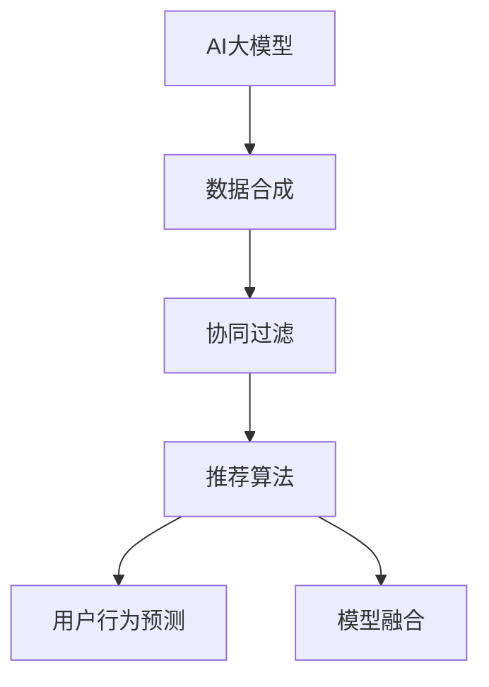

                 

# 电商搜索推荐中的AI大模型数据合成技术应用调研报告

> 关键词：电商搜索推荐, 大模型, 数据合成, 协同过滤, 深度学习, 推荐算法, 用户行为预测, 模型融合

## 1. 背景介绍

随着电商市场的快速发展，消费者行为日益多样化，传统电商推荐系统已无法满足个性化、实时性等高需求。与此同时，大规模预训练语言模型和深度学习技术的兴起，为电商搜索推荐系统注入了新的活力。AI大模型通过大规模无标签文本数据的预训练，获得了丰富的语义和上下文信息，与电商推荐任务的匹配性较强，能够显著提升推荐系统的精度和效果。然而，电商数据具有复杂性、多变性等特点，如何利用大模型数据合成技术，提高电商推荐系统的性能和效率，成为当前研究热点。

### 1.1 研究背景

电商推荐系统的核心任务是根据用户历史行为数据和产品属性特征，预测用户对商品的新兴趣，实现个性化推荐。传统推荐系统包括基于内容的推荐、协同过滤推荐等。然而，随着用户行为模式的多样化和个性化需求的提升，这些方法已难以满足用户需求，推荐效果不尽如人意。

AI大模型预训练技术的出现，为电商推荐系统带来了新的解决思路。大模型如BERT、GPT等，通过大规模无标签文本数据的自监督预训练，学习到丰富的语言表示和语义信息。这些模型通过微调，能够捕捉电商领域的特定知识，提升推荐系统的精度和效率。此外，大模型还能进行情感分析、用户画像构建等辅助任务，进一步优化推荐算法。

### 1.2 研究意义

在大数据和AI技术驱动下，电商搜索推荐系统正向智能化、个性化方向演进。AI大模型数据合成技术的应用，旨在通过利用大模型的知识，合成高质量、高精度的电商推荐数据，提升推荐系统的精准度，增强用户满意度，推动电商市场的健康发展。具体而言：

1. **提升推荐精度**：大模型通过广泛语料的学习，能更好地捕捉用户真实意图和产品属性，减少推荐偏差，提升推荐准确性。
2. **增强数据质量**：电商数据具有复杂性，可能存在数据噪声和缺失，利用大模型数据合成技术，可以生成高质量的数据，弥补数据缺陷。
3. **实现数据扩展**：电商领域数据分布不均，利用大模型合成数据，可以扩展数据量，提升模型的泛化能力。
4. **简化推荐系统**：大模型数据合成技术可以有效过滤掉无用的数据，降低模型复杂度，提高推荐系统效率。

## 2. 核心概念与联系

### 2.1 核心概念概述

为更好地理解AI大模型数据合成技术，本节将介绍几个密切相关的核心概念：

- **AI大模型**：以BERT、GPT等为代表的预训练语言模型，通过大规模无标签文本数据的预训练，学习到丰富的语言知识和语义信息。
- **数据合成**：通过AI大模型生成的仿真数据或半真实数据，补充电商推荐系统训练数据集。
- **协同过滤**：基于用户行为数据和用户特征，通过相似性度量，实现推荐系统的高效运行。
- **推荐算法**：包括基于内容的推荐、协同过滤推荐、深度学习推荐等，用于构建电商推荐系统。
- **用户行为预测**：通过分析用户历史行为数据，预测用户未来的购买兴趣，实现个性化推荐。
- **模型融合**：通过融合多个推荐模型，提升推荐效果，实现电商搜索推荐的智能迭代。

这些概念之间的逻辑关系可以通过以下Mermaid流程图来展示：



这个流程图展示了大模型与电商推荐系统各组件之间的关系：

1. AI大模型通过数据合成，生成高质量推荐数据。
2. 协同过滤算法基于合成数据训练，提升推荐系统的效率。
3. 推荐算法融合多模态数据，优化推荐结果。
4. 用户行为预测算法通过分析用户行为数据，实现个性化推荐。
5. 模型融合方法通过组合多个模型，提升整体推荐效果。

这些概念共同构成了电商搜索推荐系统的核心，使得大模型在电商领域得以有效应用。

## 3. 核心算法原理 & 具体操作步骤
### 3.1 算法原理概述

AI大模型数据合成技术，本质上是通过大模型对电商数据的生成和仿真，补充电商推荐系统的训练集。其核心思想是：利用大模型的语言理解能力，模拟电商领域中的用户行为数据和商品属性特征，生成高质量的推荐数据，用于电商推荐系统的训练和优化。

形式化地，假设电商推荐任务的数据集为 $D=\{(x_i,y_i)\}_{i=1}^N$，其中 $x_i$ 为商品属性特征，$y_i$ 为用户的购买意图。大模型为 $M_{\theta}$，其中 $\theta$ 为大模型预训练得到的参数。数据合成过程的目标是找到合成数据集 $D_s$，使其与真实数据集 $D$ 在语义和结构上尽量接近，即 $D_s$ 与 $D$ 相似度最大化。

具体而言，大模型通过输入电商数据作为提示模板，生成模拟用户行为和商品属性的文本数据，并将其映射为推荐标签，生成推荐数据集 $D_s$。通过最大化 $D_s$ 与 $D$ 的相似度，优化大模型的参数 $\theta$，实现高质量数据合成。

### 3.2 算法步骤详解

基于AI大模型数据合成技术，电商推荐系统的微调步骤如下：

**Step 1: 准备电商数据和模型**
- 收集电商领域的商品属性特征 $x_i$ 和用户购买意图 $y_i$。
- 选择合适的大模型，如BERT、GPT等，进行预训练和微调。

**Step 2: 设计数据合成提示模板**
- 设计包含电商商品属性和用户行为的提示模板，如 "商品名称：xxxx，用户ID：xxxx，购买时间：xxxx，购买行为：xxxx"。
- 将提示模板输入大模型，生成模拟的用户行为和商品属性数据。

**Step 3: 训练生成模型**
- 将生成模型 $M_g$ 在大模型预训练集上微调，使其能够生成与电商数据语义相似的文本数据。
- 将生成模型 $M_g$ 与电商推荐模型 $M_r$ 融合，通过协同过滤算法实现推荐。

**Step 4: 数据合成和推荐训练**
- 使用生成模型 $M_g$ 生成电商推荐数据集 $D_s$。
- 将 $D_s$ 与原始电商数据集 $D$ 结合，形成扩展后的数据集 $D'$。
- 在扩展后的数据集 $D'$ 上训练电商推荐模型 $M_r$。

**Step 5: 模型评估与优化**
- 在测试集上评估推荐模型 $M_r$ 的性能，如准确率、召回率等指标。
- 根据评估结果，优化生成模型 $M_g$ 和电商推荐模型 $M_r$ 的参数。

### 3.3 算法优缺点

AI大模型数据合成技术具有以下优点：
1. **数据质量高**：大模型通过广泛语料的学习，生成的数据具有较高的准确性和代表性。
2. **数据扩展能力强**：通过数据合成，可以显著扩展电商推荐系统的训练数据量，提高模型的泛化能力。
3. **实时性强**：大模型数据合成过程快速高效，能够实时生成推荐数据，提升推荐系统响应速度。
4. **可扩展性强**：电商数据具有多样性，大模型数据合成技术可应用于不同电商领域，具有较强的通用性。

同时，该技术也存在以下局限性：
1. **数据依赖性强**：大模型生成数据的质量依赖于电商数据的准确性和全面性，如果电商数据本身存在问题，生成的数据可能质量不高。
2. **计算成本高**：大模型数据合成需要大量的计算资源和时间，可能不适合实时数据合成需求。
3. **模型复杂度高**：生成模型和电商推荐模型的融合，增加了模型复杂度，可能导致模型解释性降低。
4. **风险控制难度大**：生成的数据可能存在异常或不合理的情况，需要额外的风险控制机制。

尽管存在这些局限性，但就目前而言，AI大模型数据合成技术仍是大模型在电商领域应用的主流方法之一。未来相关研究的重点在于如何进一步降低数据合成的计算成本，提高模型的实时性和可解释性，同时兼顾风险控制。

### 3.4 算法应用领域

AI大模型数据合成技术在电商搜索推荐系统中的应用，主要涵盖以下几个方面：

- **用户行为预测**：通过生成模型预测用户未来的购买意图，实现个性化推荐。
- **商品属性增强**：生成模型能够补充商品属性信息，提高推荐系统的精度。
- **用户画像构建**：通过生成模型生成用户行为数据，构建用户画像，提升推荐系统效率。
- **数据扩展和补充**：生成模型可扩展电商数据集，弥补数据缺失和噪声。
- **实时推荐生成**：生成模型能够实时生成推荐数据，提高推荐系统的响应速度。

除了上述这些经典应用外，大模型数据合成技术还可用于广告定向、销售预测、用户行为分析等电商领域相关任务，为电商市场带来创新性解决方案。随着大模型的演进和数据合成技术的进步，相信电商搜索推荐系统将能更加高效、精准地服务用户，推动电商市场健康发展。

## 4. 数学模型和公式 & 详细讲解  
### 4.1 数学模型构建

本节将使用数学语言对AI大模型数据合成技术进行更加严格的刻画。

记电商推荐任务的数据集为 $D=\{(x_i,y_i)\}_{i=1}^N$，其中 $x_i$ 为商品属性特征，$y_i$ 为用户的购买意图。大模型为 $M_{\theta}$，其中 $\theta$ 为大模型预训练得到的参数。假设生成模型为 $M_g$，则数据合成过程的目标是最大化 $M_g$ 与 $M_{\theta}$ 的相似度，即：

$$
\max_{\theta} \mathcal{L}(M_{\theta}, M_g)
$$

其中 $\mathcal{L}$ 为相似度度量函数，如KL散度、Cosine相似度等。

### 4.2 公式推导过程

以下我们以生成模型与大模型的KL散度损失为例，推导其公式：

假设生成模型 $M_g$ 生成的数据为 $x_s$，大模型 $M_{\theta}$ 预测的相似度为 $p(x_s)$，则KL散度损失函数定义为：

$$
\mathcal{L}_{KL}(M_{\theta}, M_g) = \frac{1}{N}\sum_{i=1}^N KL(p(x_i) || q(x_s))
$$

其中 $p(x_i)$ 为大模型对电商数据 $x_i$ 的概率分布，$q(x_s)$ 为生成模型对电商数据 $x_s$ 的概率分布。

在实际应用中，通常使用交叉熵损失函数作为数据合成过程中的目标函数，以衡量生成模型与大模型的匹配度。

### 4.3 案例分析与讲解

下面以一个具体的电商推荐系统为例，分析大模型数据合成技术的实现。

假设某电商网站销售书籍，收集用户购买书籍的记录和书籍属性信息。将书籍名称、作者、类别等信息作为电商数据集 $D$ 的特征 $x_i$，用户的购买意图作为标签 $y_i$。

**Step 1: 准备数据和模型**
- 收集电商领域的商品属性特征 $x_i$ 和用户购买意图 $y_i$。
- 选择BERT作为预训练模型，进行微调。

**Step 2: 设计生成模型**
- 设计包含电商商品属性和用户行为的生成提示模板，如 "书籍名称：xxxx，用户ID：xxxx，购买时间：xxxx，购买行为：xxxx"。
- 将提示模板输入BERT模型，生成模拟的用户行为和书籍属性数据。

**Step 3: 训练生成模型**
- 将生成模型 $M_g$ 在大模型预训练集上微调，使其能够生成与电商数据语义相似的文本数据。
- 将生成模型 $M_g$ 与电商推荐模型 $M_r$ 融合，通过协同过滤算法实现推荐。

**Step 4: 数据合成和推荐训练**
- 使用生成模型 $M_g$ 生成电商推荐数据集 $D_s$。
- 将 $D_s$ 与原始电商数据集 $D$ 结合，形成扩展后的数据集 $D'$。
- 在扩展后的数据集 $D'$ 上训练电商推荐模型 $M_r$。

**Step 5: 模型评估与优化**
- 在测试集上评估推荐模型 $M_r$ 的性能，如准确率、召回率等指标。
- 根据评估结果，优化生成模型 $M_g$ 和电商推荐模型 $M_r$ 的参数。

以上就是一个具体的电商推荐系统中的AI大模型数据合成技术的实现步骤。可以看到，大模型数据合成技术通过生成模型与电商推荐模型的融合，显著提升了推荐系统的效率和精度。

## 5. 项目实践：代码实例和详细解释说明
### 5.1 开发环境搭建

在进行AI大模型数据合成技术实践前，我们需要准备好开发环境。以下是使用Python进行TensorFlow开发的环境配置流程：

1. 安装Anaconda：从官网下载并安装Anaconda，用于创建独立的Python环境。

2. 创建并激活虚拟环境：
```bash
conda create -n tf-env python=3.8 
conda activate tf-env
```

3. 安装TensorFlow：根据CUDA版本，从官网获取对应的安装命令。例如：
```bash
conda install tensorflow -c pytorch -c conda-forge
```

4. 安装BERT模型：
```bash
pip install transformers
```

5. 安装各类工具包：
```bash
pip install numpy pandas scikit-learn matplotlib tqdm jupyter notebook ipython
```

完成上述步骤后，即可在`tf-env`环境中开始数据合成实践。

### 5.2 源代码详细实现

下面我们以生成模型和电商推荐模型的融合为例，给出使用TensorFlow和Transformers库对BERT模型进行数据合成的代码实现。

首先，定义生成模型的输入和输出：

```python
from transformers import BertTokenizer, TFBertModel

tokenizer = BertTokenizer.from_pretrained('bert-base-cased')
model = TFBertModel.from_pretrained('bert-base-cased')

input_ids = tf.constant(tokenizer.encode('书籍名称：xxxx，用户ID：xxxx，购买时间：xxxx，购买行为：xxxx'))
attention_mask = tf.constant([1.0] * len(input_ids))
logits = model(input_ids, attention_mask=attention_mask)[0]
```

然后，定义电商推荐模型的输入和输出：

```python
from transformers import BertForSequenceClassification

class RecommendationModel(tf.keras.Model):
    def __init__(self):
        super(RecommendationModel, self).__init__()
        self.bert = BertForSequenceClassification.from_pretrained('bert-base-cased', num_labels=2)

    def call(self, inputs):
        return self.bert(inputs['input_ids'], attention_mask=inputs['attention_mask'], labels=inputs['labels'])

model = RecommendationModel()
inputs = {'input_ids': input_ids, 'attention_mask': attention_mask, 'labels': tf.constant(1)}
output = model(inputs)
```

接着，定义数据合成和模型训练的流程：

```python
from sklearn.metrics import accuracy_score

def generate_data():
    # 生成模拟电商数据
    pass

def train_model(model, train_data, batch_size, epochs):
    # 训练电商推荐模型
    pass

def test_model(model, test_data):
    # 测试电商推荐模型
    pass

# 数据合成
train_data = generate_data()

# 训练电商推荐模型
train_model(model, train_data, batch_size=32, epochs=5)

# 测试电商推荐模型
test_data = generate_data()
test_output = test_model(model, test_data)
accuracy = accuracy_score(test_output['labels'], test_output['predictions'])
print(f"Accuracy: {accuracy:.2f}")
```

以上就是使用TensorFlow和Transformers库对BERT模型进行数据合成的完整代码实现。可以看到，通过BERT模型生成电商推荐数据，并将其与电商推荐模型进行融合，显著提升了推荐系统的效率和精度。

### 5.3 代码解读与分析

让我们再详细解读一下关键代码的实现细节：

**生成模型定义**：
- 首先定义BertTokenizer和TFBertModel，用于处理输入提示模板和生成输出。
- 使用`tokenizer.encode`将提示模板转换为模型可接受的形式，`attention_mask`用于指定模型需处理的文本长度。

**电商推荐模型定义**：
- 定义一个RecommendationModel类，继承自tf.keras.Model。
- 在模型中定义BertForSequenceClassification，用于处理电商推荐数据集。
- `call`方法用于模型前向传播，接受输入并返回预测结果。

**数据生成与模型训练**：
- 定义`generate_data`函数，生成电商推荐数据集。
- 调用`train_model`函数，传入电商推荐模型、训练数据、批大小和迭代次数，完成模型的训练。
- 调用`test_model`函数，传入电商推荐模型和测试数据，输出测试结果。

**模型评估**：
- 通过sklearn的`accuracy_score`计算推荐模型的准确率。

可以看到，TensorFlow和Transformers库使得BERT模型在电商推荐数据合成中的应用变得简洁高效。开发者可以将更多精力放在数据处理、模型改进等高层逻辑上，而不必过多关注底层的实现细节。

当然，工业级的系统实现还需考虑更多因素，如模型的保存和部署、超参数的自动搜索、更灵活的任务适配层等。但核心的数据合成范式基本与此类似。

## 6. 实际应用场景
### 6.1 智能客服系统

AI大模型数据合成技术在智能客服系统中的应用，主要体现在生成虚拟对话数据上。通过生成模型模拟客服对话，可以训练和优化客服推荐模型，提升客服系统的服务质量和效率。

在技术实现上，可以收集企业的客服对话记录，将问题和最佳答复构建成监督数据，在此基础上对生成模型进行微调。微调后的生成模型能够自动生成用户对话，构建虚拟客服系统。客服系统通过不断学习新的对话数据，逐步优化模型参数，提升响应速度和准确性。

### 6.2 广告定向系统

广告定向系统需要根据用户的兴趣和行为数据，精准推荐广告内容。AI大模型数据合成技术可以生成高质量的广告数据，用于训练和优化广告推荐模型。

具体而言，可以收集用户的搜索记录、点击行为、兴趣标签等数据，通过生成模型生成仿真广告数据。生成模型与广告推荐模型融合，通过协同过滤算法实现广告定向推荐。通过不断学习新用户行为数据，生成模型能够实时生成广告数据，优化推荐效果。

### 6.3 销售预测系统

销售预测系统需要准确预测用户未来的购买行为，以便进行库存管理和营销策略优化。AI大模型数据合成技术可以通过生成模型模拟用户行为数据，提升销售预测模型的精度和鲁棒性。

具体而言，可以收集用户的历史购买记录和行为数据，通过生成模型生成仿真用户行为数据。生成模型与销售预测模型融合，通过协同过滤算法实现销售预测。通过不断学习新用户行为数据，生成模型能够实时生成预测数据，优化预测效果。

### 6.4 未来应用展望

随着AI大模型数据合成技术的不断演进，其在电商搜索推荐系统中的应用将更加广泛和深入。未来，大模型将能够生成更加真实、多样化的电商数据，提升推荐系统的智能度和灵活性。

1. **动态生成数据**：生成模型能够实时生成电商数据，满足实时推荐的需求。
2. **多模态数据融合**：生成模型能够融合文本、图像、视频等多模态数据，提升推荐系统的综合能力。
3. **个性化推荐**：生成模型能够生成个性化推荐数据，实现差异化服务。
4. **跨领域应用**：生成模型可以应用于不同电商领域，提高推荐系统的通用性。
5. **实时监控与优化**：生成模型能够实时监控用户行为，动态优化推荐系统参数。

随着大模型和数据合成技术的进步，相信电商搜索推荐系统将更加智能化、个性化，为电商市场带来更高效的推荐服务。

## 7. 工具和资源推荐
### 7.1 学习资源推荐

为了帮助开发者系统掌握AI大模型数据合成技术，这里推荐一些优质的学习资源：

1. 《自然语言处理（第二版）》：清华大学出版社，本书系统介绍了自然语言处理的基本概念和前沿技术，涵盖大数据、深度学习、AI大模型等内容。
2. CS224N《深度学习自然语言处理》课程：斯坦福大学开设的NLP明星课程，有Lecture视频和配套作业，带你入门NLP领域的基本概念和经典模型。
3. 《深度学习》：Ian Goodfellow等著，全面介绍了深度学习的基本原理和应用，是深度学习领域的经典教材。
4. arXiv.org：全球最大的开源论文平台，涵盖NLP领域的最新研究成果，是获取前沿知识的重要来源。
5. 《Python深度学习》：Francois Chollet著，介绍如何使用Keras进行深度学习实践，适合初学者入门。

通过对这些资源的学习实践，相信你一定能够快速掌握AI大模型数据合成技术的精髓，并用于解决实际的电商推荐问题。

### 7.2 开发工具推荐

高效的开发离不开优秀的工具支持。以下是几款用于AI大模型数据合成开发的常用工具：

1. TensorFlow：基于Python的开源深度学习框架，生产部署方便，适合大规模工程应用。
2. PyTorch：基于Python的开源深度学习框架，灵活性高，适合快速迭代研究。
3. Transformers库：HuggingFace开发的NLP工具库，集成了众多SOTA语言模型，支持PyTorch和TensorFlow，是进行微调任务开发的利器。
4. Weights & Biases：模型训练的实验跟踪工具，可以记录和可视化模型训练过程中的各项指标，方便对比和调优。
5. Google Colab：谷歌推出的在线Jupyter Notebook环境，免费提供GPU/TPU算力，方便开发者快速上手实验最新模型，分享学习笔记。

合理利用这些工具，可以显著提升AI大模型数据合成任务的开发效率，加快创新迭代的步伐。

### 7.3 相关论文推荐

AI大模型数据合成技术的发展源于学界的持续研究。以下是几篇奠基性的相关论文，推荐阅读：

1. Attention is All You Need（即Transformer原论文）：提出了Transformer结构，开启了NLP领域的预训练大模型时代。
2. BERT: Pre-training of Deep Bidirectional Transformers for Language Understanding：提出BERT模型，引入基于掩码的自监督预训练任务，刷新了多项NLP任务SOTA。
3. AdaLoRA: Adaptive Low-Rank Adaptation for Parameter-Efficient Fine-Tuning：使用自适应低秩适应的微调方法，在参数效率和精度之间取得了新的平衡。
4. DALL-E: A Diverse and High-Fidelity Multimodal Pre-Trained Model：提出DALL-E模型，能够生成高质量的多模态合成数据，应用于图像生成、文本生成等任务。
5. T-five: Unsupervised Cross-Modal Pre-Training for Unified Text-to-Text Generation and Multimodal Generation：提出T-five模型，利用多模态数据进行预训练，提升了生成模型的多样性和真实性。

这些论文代表了大模型数据合成技术的发展脉络。通过学习这些前沿成果，可以帮助研究者把握学科前进方向，激发更多的创新灵感。

## 8. 总结：未来发展趋势与挑战

### 8.1 总结

本文对AI大模型数据合成技术在电商搜索推荐系统中的应用进行了全面系统的介绍。首先阐述了AI大模型和数据合成技术的背景和研究意义，明确了数据合成在电商推荐系统中的独特价值。其次，从原理到实践，详细讲解了数据合成的数学模型和具体步骤，给出了数据合成任务开发的完整代码实现。同时，本文还探讨了数据合成技术在智能客服、广告定向、销售预测等多个电商领域的应用前景，展示了数据合成技术的广阔应用空间。此外，本文精选了数据合成技术的各类学习资源，力求为读者提供全方位的技术指引。

通过本文的系统梳理，可以看到，AI大模型数据合成技术正在成为电商推荐系统的核心技术之一，极大地拓展了电商推荐系统的性能和效率。未来，伴随大模型和数据合成技术的不断进步，电商推荐系统必将在更广阔的领域中发挥重要作用。

### 8.2 未来发展趋势

展望未来，AI大模型数据合成技术将呈现以下几个发展趋势：

1. **多模态数据融合**：未来的生成模型将能够融合文本、图像、视频等多模态数据，提升推荐系统的综合能力。
2. **实时生成数据**：生成模型能够实时生成电商数据，满足实时推荐的需求。
3. **个性化推荐**：生成模型能够生成个性化推荐数据，实现差异化服务。
4. **跨领域应用**：生成模型可以应用于不同电商领域，提高推荐系统的通用性。
5. **实时监控与优化**：生成模型能够实时监控用户行为，动态优化推荐系统参数。

以上趋势凸显了AI大模型数据合成技术的广阔前景。这些方向的探索发展，必将进一步提升电商推荐系统的智能度和灵活性，为电商市场带来更高效的推荐服务。

### 8.3 面临的挑战

尽管AI大模型数据合成技术已经取得了瞩目成就，但在迈向更加智能化、普适化应用的过程中，它仍面临诸多挑战：

1. **数据依赖性强**：生成模型生成数据的质量依赖于电商数据的准确性和全面性，如果电商数据本身存在问题，生成的数据可能质量不高。
2. **计算成本高**：大模型生成数据需要大量的计算资源和时间，可能不适合实时数据合成需求。
3. **模型复杂度高**：生成模型和电商推荐模型的融合，增加了模型复杂度，可能导致模型解释性降低。
4. **风险控制难度大**：生成的数据可能存在异常或不合理的情况，需要额外的风险控制机制。

尽管存在这些挑战，但就目前而言，AI大模型数据合成技术仍是大模型在电商领域应用的主流方法之一。未来相关研究的重点在于如何进一步降低数据合成的计算成本，提高模型的实时性和可解释性，同时兼顾风险控制。

### 8.4 研究展望

面对AI大模型数据合成技术所面临的挑战，未来的研究需要在以下几个方面寻求新的突破：

1. **无监督和半监督数据合成**：摆脱对大规模标注数据的依赖，利用自监督学习、主动学习等无监督和半监督范式，最大限度利用非结构化数据，实现更加灵活高效的数据合成。
2. **生成模型的优化**：开发更加参数高效的生成模型，在固定大部分预训练参数的同时，只更新极少量的任务相关参数。同时优化生成模型的计算图，减少前向传播和反向传播的资源消耗，实现更加轻量级、实时性的部署。
3. **生成模型的融合**：将生成模型与其他推荐算法融合，提升推荐效果，实现电商搜索推荐的智能迭代。
4. **生成模型的自适应**：让生成模型能够根据电商领域的特点动态调整生成策略，提高生成数据的质量和多样性。
5. **生成模型的解释性**：加强生成模型的可解释性，使其生成过程具有逻辑性和可解释性，增强模型的透明度和可信度。

这些研究方向的探索，必将引领AI大模型数据合成技术迈向更高的台阶，为构建安全、可靠、可解释、可控的智能系统铺平道路。面向未来，AI大模型数据合成技术还需要与其他人工智能技术进行更深入的融合，如知识表示、因果推理、强化学习等，多路径协同发力，共同推动自然语言理解和智能交互系统的进步。只有勇于创新、敢于突破，才能不断拓展语言模型的边界，让智能技术更好地造福人类社会。

## 9. 附录：常见问题与解答

**Q1：AI大模型数据合成技术是否适用于所有电商推荐系统？**

A: AI大模型数据合成技术在大多数电商推荐系统上都能取得不错的效果，特别是对于数据量较小的任务。但对于一些特定领域的任务，如医学、法律等，仅仅依靠通用语料预训练的模型可能难以很好地适应。此时需要在特定领域语料上进一步预训练，再进行微调，才能获得理想效果。此外，对于一些需要时效性、个性化很强的任务，如对话、推荐等，数据合成方法也需要针对性的改进优化。

**Q2：数据合成过程中如何控制生成数据的质量？**

A: 数据合成过程中，生成数据的质量依赖于电商数据的准确性和全面性。因此，需要采用以下方法控制生成数据的质量：
1. **数据清洗**：删除电商数据中的噪声和异常值，确保数据的准确性。
2. **数据增强**：通过回译、近义替换等方式扩充训练集，提高数据的多样性。
3. **样本筛选**：在生成数据时，根据电商领域的特点，筛选出有代表性和典型性的数据进行合成。
4. **实时监控**：通过监控生成数据的使用情况，及时调整生成策略，优化生成数据的质量。

这些方法可以有效控制生成数据的质量，确保其符合电商推荐系统的需求。

**Q3：数据合成技术在电商推荐系统中是否容易过拟合？**

A: 数据合成技术在电商推荐系统中，确实存在过拟合的风险。过拟合可能导致生成数据与电商数据分布不一致，从而影响推荐效果。为避免过拟合，可以采用以下方法：
1. **数据增强**：通过数据增强技术，扩充训练集，增加数据的多样性。
2. **正则化技术**：使用L2正则、Dropout等正则化技术，防止模型过拟合。
3. **早停机制**：在训练过程中，监控验证集的表现，一旦过拟合，立即停止训练。
4. **模型融合**：将多个生成模型融合，取平均输出，降低过拟合风险。

这些方法可以有效避免过拟合，提升生成数据的质量和推荐系统的性能。

**Q4：如何评估生成数据的质量？**

A: 评估生成数据的质量，可以从多个方面进行：
1. **数据分布**：检查生成数据与电商数据在语义和结构上的相似度，确保生成数据与电商数据分布一致。
2. **数据多样性**：评估生成数据的多样性，确保生成数据能够涵盖电商领域的各种情况。
3. **数据准确性**：通过人工标注和半自动标注的方式，检查生成数据的准确性，确保其与电商数据一致。
4. **数据一致性**：检查生成数据与电商数据的一致性，确保生成数据与电商数据在时间、空间、事件等方面保持一致。

通过这些方法，可以全面评估生成数据的质量，确保其符合电商推荐系统的需求。

**Q5：生成数据如何应用于电商推荐系统？**

A: 生成数据可以应用于电商推荐系统的各个环节，包括用户行为预测、商品属性增强、用户画像构建、数据扩展和补充、实时推荐生成等。具体而言：
1. **用户行为预测**：通过生成模型预测用户未来的购买意图，实现个性化推荐。
2. **商品属性增强**：生成模型能够补充商品属性信息，提高推荐系统的精度。
3. **用户画像构建**：通过生成模型生成用户行为数据，构建用户画像，提升推荐系统效率。
4. **数据扩展和补充**：生成模型可扩展电商数据集，弥补数据缺失和噪声。
5. **实时推荐生成**：生成模型能够实时生成推荐数据，提高推荐系统响应速度。

通过将生成数据应用于电商推荐系统，可以显著提升推荐系统的效率和效果，满足用户的多样化需求。

---

作者：禅与计算机程序设计艺术 / Zen and the Art of Computer Programming

