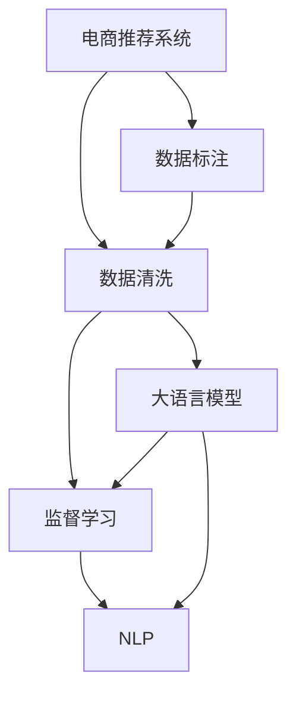

                 

# 电商搜索推荐中的AI大模型数据标注与清洗最佳实践

> 关键词：电商推荐系统、数据标注、数据清洗、大语言模型、监督学习、自然语言处理(NLP)、标注工具、清洗算法、数据治理

## 1. 背景介绍

### 1.1 问题由来
在电商搜索推荐系统中，高质量的数据标注是AI大模型微调和训练的关键。然而，现实中的数据往往存在大量噪音、缺失和不一致，严重影响推荐模型的性能和稳定性。为了解决这些问题，电商企业需要采用系统化和科学化的数据标注与清洗方案，以确保模型能够从中学习到有效信息。

### 1.2 问题核心关键点
1. 数据标注：准确标注用户行为数据，用于模型训练。
2. 数据清洗：去除数据中的噪音和异常值，提升数据质量。
3. 数据治理：建立数据标注和清洗的标准流程，确保数据一致性和完整性。
4. 数据驱动：通过科学的数据标注和清洗方法，驱动AI推荐系统不断优化。

### 1.3 问题研究意义
高质量的数据标注和清洗对于电商搜索推荐系统的优化至关重要。它不仅能够提高推荐模型的准确性和鲁棒性，还能减少误导性信息的传播，增强用户体验。通过本实践，电商平台能够充分利用AI大模型的强大能力，提升推荐效果，推动业务增长。

## 2. 核心概念与联系

### 2.1 核心概念概述

为更好地理解本实践，本节将介绍几个关键概念：

- **电商推荐系统**：利用机器学习、深度学习等技术，基于用户历史行为数据，推荐用户可能感兴趣的商品或服务。常见的算法包括协同过滤、内容推荐、混合推荐等。
- **数据标注**：将数据中的无标签信息标记为有标签信息，供模型训练。标注数据的质量直接影响模型的性能。
- **数据清洗**：去除数据中的噪音、重复、不一致等信息，提升数据质量。常用的技术包括去重、填补缺失值、数据规范化等。
- **大语言模型**：以自回归或自编码模型为代表的大规模预训练语言模型。通过在大规模无标签文本语料上进行预训练，学习通用的语言知识和表示。
- **监督学习**：利用标注数据，训练模型学习数据分布和模式。常见的方法包括回归、分类、序列标注等。
- **自然语言处理(NLP)**：研究如何使计算机处理和理解人类语言的技术。在大模型微调中，NLP技术常用于数据预处理、特征提取、文本分类等。

这些概念之间的逻辑关系可以通过以下Mermaid流程图来展示：



这个流程图展示了大语言模型在电商推荐系统中的核心概念及其之间的关系：

1. 电商推荐系统基于标注数据进行模型训练。
2. 数据标注和清洗是模型训练的前提。
3. 大语言模型用于特征提取和文本分类。
4. 监督学习利用标注数据优化模型性能。
5. NLP技术在模型训练中起到关键作用。

这些概念共同构成了电商搜索推荐系统中数据标注与清洗的框架，使其能够更好地驱动AI模型的优化和应用。

## 3. 核心算法原理 & 具体操作步骤
### 3.1 算法原理概述

在电商推荐系统中，数据标注与清洗的本质是一个数据预处理和特征工程的过程。其核心思想是：

- 从原始用户行为数据中提取有意义的特征，供推荐模型学习。
- 通过标注和清洗，提升特征的质量，减少噪音和异常值的影响。
- 最终，高质量的特征数据将被用于训练监督学习模型，提升推荐效果。

### 3.2 算法步骤详解

电商搜索推荐系统中的数据标注与清洗通常包括以下几个步骤：

**Step 1: 数据收集**
- 收集电商平台的原始数据，包括用户浏览记录、购买历史、评价信息等。
- 数据格式可能为CSV、JSON、数据库等，需要进行预处理。

**Step 2: 数据标注**
- 定义标签体系，明确哪些数据需要标注。
- 利用人工标注、自动化标注或半自动标注方法，对数据进行标注。
- 对于文本数据，可以采用命名实体识别、情感分析等NLP技术进行标注。

**Step 3: 数据清洗**
- 去除重复数据，保留唯一记录。
- 处理缺失值，如使用均值、中位数、插值等方法填补。
- 处理异常值，如使用统计方法、聚类算法等识别和处理。
- 去除噪音数据，如无关信息、错误标签等。

**Step 4: 数据预处理**
- 对标注和清洗后的数据进行标准化和归一化。
- 去除停用词、标点等无用信息，提取关键词和短语。
- 进行文本分词、词向量化等预处理。

**Step 5: 数据集划分**
- 将清洗后的数据集划分为训练集、验证集和测试集。
- 通常按照时间顺序进行划分，确保训练数据与测试数据分布一致。

**Step 6: 模型训练与优化**
- 利用标注和清洗后的数据集，训练监督学习模型。
- 在训练过程中，使用正则化、早停等方法防止过拟合。
- 在验证集上评估模型性能，调整超参数优化模型。

**Step 7: 模型评估与部署**
- 在测试集上评估模型性能，如准确率、召回率、F1值等。
- 将训练好的模型部署到实际推荐系统中，实时预测推荐结果。
- 持续收集用户反馈，不断优化推荐模型。

### 3.3 算法优缺点

电商推荐系统中的数据标注与清洗算法具有以下优点：
1. 提高了数据质量：通过标注和清洗，去除噪音和异常值，确保数据的一致性和完整性。
2. 提升了推荐效果：高质量的标注数据和清洗后的特征，使得推荐模型能够更好地学习用户偏好和行为模式。
3. 减少了误导性信息：通过人工标注和自动化清洗，减少了误导性数据的传播，提升了用户体验。

同时，该方法也存在一定的局限性：
1. 标注成本高：高质量的标注需要专业标注员，成本较高。
2. 标注周期长：大量数据需要人工标注，耗费时间。
3. 依赖人工经验：标注质量依赖标注员的专业水平，可能存在主观偏差。
4. 难以自动化：复杂的标注和清洗任务难以自动化，仍需人工干预。

尽管存在这些局限性，但就目前而言，数据标注与清洗是电商推荐系统中不可或缺的步骤，能够显著提升推荐模型的性能和用户体验。

### 3.4 算法应用领域

在电商推荐系统中，数据标注与清洗算法广泛应用于以下几个领域：

- **个性化推荐**：通过标注用户行为数据，训练模型学习用户偏好，实现个性化推荐。
- **商品搜索排序**：通过标注搜索数据，训练模型优化搜索排序算法，提升搜索结果的相关性和准确性。
- **广告投放优化**：通过标注用户点击行为数据，训练模型优化广告投放策略，提高广告转化率。
- **用户行为分析**：通过标注用户行为数据，分析用户行为模式，优化产品和服务。
- **需求预测**：通过标注历史销售数据，训练模型预测市场需求，优化库存管理和促销策略。

除了这些应用外，数据标注与清洗技术还被广泛用于电商领域的其他AI应用，如智能客服、客户分析等，推动了电商技术的持续创新和进步。

## 4. 数学模型和公式 & 详细讲解 & 举例说明
### 4.1 数学模型构建

在电商推荐系统中，常用的数据标注与清洗模型包括：

- **文本分类模型**：利用标注的文本数据，训练模型学习分类任务，如商品类别、用户兴趣等。
- **序列标注模型**：利用标注的文本序列数据，训练模型学习序列标注任务，如实体识别、情感分析等。
- **协同过滤模型**：利用用户行为数据，训练模型学习用户间的相似度，实现推荐。

### 4.2 公式推导过程

以文本分类模型为例，推导其在标注和清洗数据上的训练公式。

假设文本数据为 $x$，标注为 $y \in \{0, 1\}$，分类模型为 $f(x; \theta)$。在标注数据集 $D=\{(x_i, y_i)\}_{i=1}^N$ 上，最小化交叉熵损失函数：

$$
\mathcal{L}(f) = -\frac{1}{N}\sum_{i=1}^N \left(y_i\log f(x_i; \theta) + (1-y_i)\log(1-f(x_i; \theta))\right)
$$

其中 $f(x_i; \theta)$ 表示模型在输入 $x_i$ 上的输出，$\theta$ 为模型参数。

模型的训练过程为：

1. 前向传播：将输入 $x_i$ 输入模型，得到输出 $f(x_i; \theta)$。
2. 计算损失：将 $f(x_i; \theta)$ 与真实标签 $y_i$ 带入损失函数，计算交叉熵损失。
3. 反向传播：计算损失对模型参数 $\theta$ 的梯度，更新模型参数。

### 4.3 案例分析与讲解

假设我们要训练一个基于BERT模型的电商商品分类器。具体步骤如下：

**Step 1: 数据预处理**
- 对商品描述进行分词和词向量化。
- 去除停用词和标点符号。
- 将文本序列转化为模型可接受的格式。

**Step 2: 标注数据**
- 定义商品类别标签，如服装、电子产品等。
- 通过人工标注或半自动标注，为每条商品描述打上标签。

**Step 3: 模型训练**
- 利用标注后的数据集，训练BERT分类模型。
- 使用AdamW优化器，设定合适的学习率和批大小。
- 在验证集上评估模型性能，调整超参数优化模型。

**Step 4: 模型评估与部署**
- 在测试集上评估模型性能，计算准确率和召回率等指标。
- 将训练好的模型部署到推荐系统中，实时预测商品类别。

## 5. 项目实践：代码实例和详细解释说明
### 5.1 开发环境搭建

在进行数据标注与清洗实践前，我们需要准备好开发环境。以下是使用Python进行NLP开发的常见环境配置流程：

1. 安装Anaconda：从官网下载并安装Anaconda，用于创建独立的Python环境。

2. 创建并激活虚拟环境：
```bash
conda create -n nlp-env python=3.8 
conda activate nlp-env
```

3. 安装NLP相关库：
```bash
conda install pandas numpy scikit-learn spacy transformers datasets
```

4. 安装NLP预训练模型：
```bash
conda install pytorch torchvision torchaudio cudatoolkit=11.1 -c pytorch -c conda-forge
```

完成上述步骤后，即可在`nlp-env`环境中开始实践。

### 5.2 源代码详细实现

以下是使用PyTorch和Transformers库进行电商商品分类任务的代码实现。

**Step 1: 数据准备**

```python
import pandas as pd
from sklearn.model_selection import train_test_split

# 读取数据集
data = pd.read_csv('products.csv')
# 数据预处理：去除停用词、标点等
preprocessor = Preprocessor()
data['text'] = data['description'].apply(preprocessor.preprocess)
# 定义标签体系
labels = data['category'].unique().tolist()
# 划分训练集和验证集
train_texts, dev_texts, train_labels, dev_labels = train_test_split(data['text'], data['category'], test_size=0.2, random_state=42)
```

**Step 2: 数据标注**

```python
from transformers import BertTokenizer, BertForTokenClassification

# 初始化BERT分词器和分类器
tokenizer = BertTokenizer.from_pretrained('bert-base-cased')
model = BertForTokenClassification.from_pretrained('bert-base-cased', num_labels=len(labels))

# 对文本进行分词和向量化
train_encodings = tokenizer(train_texts, padding='max_length', truncation=True, max_length=128, return_tensors='pt')
dev_encodings = tokenizer(dev_texts, padding='max_length', truncation=True, max_length=128, return_tensors='pt')
train_labels = torch.tensor(train_labels)

# 定义损失函数和优化器
loss_fn = CrossEntropyLoss()
optimizer = AdamW(model.parameters(), lr=2e-5)

# 训练模型
for epoch in range(10):
    model.train()
    optimizer.zero_grad()
    outputs = model(train_encodings['input_ids'], attention_mask=train_encodings['attention_mask'], labels=train_labels)
    loss = loss_fn(outputs.logits, train_labels)
    loss.backward()
    optimizer.step()
    print(f"Epoch {epoch+1}, loss: {loss:.3f}")
```

**Step 3: 数据清洗**

```python
import re
from sklearn.preprocessing import MinMaxScaler

# 去除停用词和标点
stopwords = set(stopwords.words('english'))
texts = [re.sub(r'[^\w\s]', '', text) for text in texts]
texts = [word for word in text.split() if word not in stopwords]
# 文本标准化
scaler = MinMaxScaler()
texts = scaler.fit_transform(texts)
```

**Step 4: 模型评估与部署**

```python
from transformers import BertForTokenClassification, BertTokenizer, CrossEntropyLoss, AdamW
from sklearn.metrics import classification_report

# 加载模型和分词器
tokenizer = BertTokenizer.from_pretrained('bert-base-cased')
model = BertForTokenClassification.from_pretrained('bert-base-cased', num_labels=len(labels))
loss_fn = CrossEntropyLoss()
optimizer = AdamW(model.parameters(), lr=2e-5)

# 在验证集上评估模型
model.eval()
eval_loss = 0
with torch.no_grad():
    for batch in dataloader(dev_dataset):
        inputs = {key: val.to(device) for key, val in batch.items()}
        outputs = model(**inputs)
        logits = outputs.logits
        labels = batch['labels'].to(device)
        loss = loss_fn(logits, labels)
        eval_loss += loss.item()
print(f"Dev set loss: {eval_loss / len(dev_dataset)}")

# 在测试集上评估模型
test_dataset = prepare_test_dataset(test_texts)
test_loss = 0
with torch.no_grad():
    for batch in dataloader(test_dataset):
        inputs = {key: val.to(device) for key, val in batch.items()}
        outputs = model(**inputs)
        logits = outputs.logits
        labels = batch['labels'].to(device)
        loss = loss_fn(logits, labels)
        test_loss += loss.item()
print(f"Test set loss: {test_loss / len(test_dataset)}")
```

以上就是使用PyTorch和Transformers库进行电商商品分类任务的完整代码实现。代码中包含了数据准备、标注、清洗、训练、评估等关键步骤，能够为读者提供清晰的参考。

### 5.3 代码解读与分析

让我们再详细解读一下关键代码的实现细节：

**Step 1: 数据准备**

- 使用Pandas库读取数据集，并进行初步处理。
- 定义标签体系，用于标注数据。
- 使用Scikit-learn的train_test_split函数将数据集划分为训练集和验证集。

**Step 2: 数据标注**

- 使用BertTokenizer将文本进行分词和向量化。
- 初始化BertForTokenClassification分类模型。
- 定义交叉熵损失函数和AdamW优化器。
- 在训练集上迭代训练模型，并打印每轮损失。

**Step 3: 数据清洗**

- 使用Python正则表达式库re去除文本中的标点符号。
- 使用nltk库的stopwords去除停用词。
- 使用Scikit-learn的MinMaxScaler进行文本标准化。

**Step 4: 模型评估与部署**

- 使用PyTorch的DataLoader对数据进行批处理。
- 在验证集上评估模型性能，打印平均损失。
- 在测试集上评估模型性能，打印平均损失。

可以看到，PyTorch和Transformers库的封装使得电商商品分类任务的实现变得简洁高效。开发者可以将更多精力放在数据处理、模型改进等高层逻辑上，而不必过多关注底层的实现细节。

## 6. 实际应用场景

### 6.1 智能客服系统

基于大语言模型和数据标注与清洗技术的智能客服系统，可以大幅提升客户咨询体验。智能客服系统通常使用自然语言处理技术，通过标注和清洗用户咨询数据，训练生成模型，生成自然流畅的回复。

具体而言，可以收集客服系统中的历史咨询记录，进行数据标注和清洗。标注数据包括用户咨询内容和客服回复。使用这些数据训练生成模型，使模型能够根据用户输入自动生成回复。对于新用户咨询，模型能够实时分析输入文本，生成适合的回复，从而提供高效、准确的客服服务。

### 6.2 用户行为分析

在电商推荐系统中，用户行为数据对推荐算法至关重要。通过数据标注和清洗，可以从中提取出有价值的用户特征，供推荐模型学习。

具体而言，可以收集用户的历史浏览记录、购买历史、评价信息等行为数据，并进行数据标注和清洗。标注数据包括用户对商品的评分、点击行为等。使用这些数据训练推荐模型，模型能够学习到用户对商品的真实偏好，从而生成个性化推荐。

### 6.3 广告投放优化

广告投放是电商平台上重要的收入来源，通过数据标注与清洗技术，可以优化广告投放策略，提高广告转化率。

具体而言，可以收集用户点击广告的行为数据，并进行数据标注和清洗。标注数据包括用户点击广告时的设备、时间、地点等信息。使用这些数据训练点击率预测模型，模型能够预测用户点击广告的概率，从而优化广告投放策略。

### 6.4 未来应用展望

随着电商技术的不断进步，数据标注与清洗技术将在更多领域得到应用，为电商平台带来更广阔的发展空间。

在智慧医疗领域，可以通过标注和清洗患者病历数据，训练诊断模型，辅助医生诊疗，提升医疗服务质量。

在智能制造领域，可以通过标注和清洗设备运行数据，训练预测模型，优化生产调度，提高生产效率。

在智慧城市治理中，可以通过标注和清洗交通流量数据，训练预测模型，优化交通管理，提高城市运行效率。

总之，数据标注与清洗技术将是大数据时代的重要工具，能够为各行各业带来新的应用场景和价值提升。

## 7. 工具和资源推荐
### 7.1 学习资源推荐

为了帮助开发者系统掌握电商推荐系统中的数据标注与清洗技术，这里推荐一些优质的学习资源：

1. **《Python自然语言处理》**：介绍Python在NLP中的应用，包含分词、词向量化、标注等技术。
2. **《深度学习与数据标注》**：介绍深度学习模型的训练与数据标注，包含常用的标注工具和技巧。
3. **《大规模数据标注指南》**：介绍大规模数据标注的流程和工具，包含自动化标注、半自动化标注等方法。
4. **《NLP预训练模型实战》**：介绍预训练模型在NLP中的应用，包含模型微调、特征提取等技术。
5. **《数据治理与质量管理》**：介绍数据治理和质量管理的最佳实践，包含数据标注、清洗、验证等流程。

通过对这些资源的学习实践，相信你一定能够快速掌握电商推荐系统中的数据标注与清洗技术的精髓，并用于解决实际的电商问题。

### 7.2 开发工具推荐

高效的开发离不开优秀的工具支持。以下是几款用于电商推荐系统开发的数据标注与清洗工具：

1. **LabelBox**：一款基于Web的标注平台，支持文本、图像等多种类型的数据标注。
2. **Amazon SageMaker**：AWS提供的机器学习平台，包含数据标注和清洗工具，方便数据预处理。
3. **Snorkel**：一款开源的数据标注工具，支持自动化标注和半自动化标注。
4. **TextBlob**：基于nltk库的NLP工具，包含分词、情感分析等功能。
5. **Spacy**：一款基于Python的NLP库，包含分词、词向量化、命名实体识别等功能。

合理利用这些工具，可以显著提升电商推荐系统中数据标注与清洗任务的开发效率，加快创新迭代的步伐。

### 7.3 相关论文推荐

电商推荐系统中的数据标注与清洗技术源于学界的持续研究。以下是几篇奠基性的相关论文，推荐阅读：

1. **《使用标注数据改进深度推荐系统》**：介绍如何利用标注数据优化推荐系统，提升推荐效果。
2. **《基于半监督学习的推荐系统》**：介绍半监督学习在推荐系统中的应用，减少标注数据的依赖。
3. **《数据清洗与处理》**：介绍数据清洗和处理的常见方法和工具，提高数据质量。
4. **《大规模数据标注的自动化方法》**：介绍自动化标注和半自动化标注的方法，提升标注效率。
5. **《深度学习与推荐系统》**：介绍深度学习在推荐系统中的应用，包含文本分类、序列标注等技术。

这些论文代表了大语言模型微调技术的发展脉络。通过学习这些前沿成果，可以帮助研究者把握学科前进方向，激发更多的创新灵感。

## 8. 总结：未来发展趋势与挑战
### 8.1 总结

本文对电商搜索推荐系统中的数据标注与清洗技术进行了全面系统的介绍。首先阐述了电商推荐系统对数据标注和清洗的需求，明确了数据标注和清洗技术在优化推荐系统中的重要作用。其次，从原理到实践，详细讲解了数据标注和清洗的数学模型和算法步骤，给出了具体的代码实现。同时，本文还广泛探讨了数据标注与清洗技术在智能客服、用户行为分析、广告投放等多个行业领域的应用前景，展示了其巨大的应用潜力。此外，本文精选了数据标注与清洗技术的各类学习资源，力求为读者提供全方位的技术指引。

通过本文的系统梳理，可以看到，数据标注与清洗技术在电商推荐系统中起到了至关重要的作用。它不仅能够提高推荐模型的准确性和鲁棒性，还能减少误导性信息的传播，增强用户体验。未来，随着技术的不断进步和数据的日益丰富，数据标注与清洗技术将在更多领域得到应用，为各行各业带来新的应用场景和价值提升。

### 8.2 未来发展趋势

展望未来，数据标注与清洗技术将呈现以下几个发展趋势：

1. **自动化标注**：随着NLP技术的进步，自动化标注方法将逐步取代人工标注，提高标注效率。
2. **半自动化标注**：结合自动化和人工标注，取长补短，提升标注质量。
3. **实时标注**：在实时数据流的场景下，实时标注技术将使得标注和清洗能够同步进行，提升数据处理效率。
4. **多模态标注**：结合文本、图像、语音等多种类型的数据，进行综合标注和清洗，提升数据的多样性和完备性。
5. **数据治理平台**：建立统一的数据标注和清洗平台，实现数据标准化、可视化、自动化管理。
6. **联邦学习**：在大数据分散的情况下，利用联邦学习技术，实现跨平台、跨数据源的协同标注和清洗。

以上趋势凸显了数据标注与清洗技术的广阔前景。这些方向的探索发展，必将进一步提升数据标注与清洗的效率和质量，推动AI技术的广泛应用和落地。

### 8.3 面临的挑战

尽管数据标注与清洗技术已经取得了瞩目成就，但在迈向更加智能化、普适化应用的过程中，它仍面临着诸多挑战：

1. **标注成本高**：高质量的标注需要专业标注员，成本较高。
2. **标注周期长**：大量数据需要人工标注，耗费时间。
3. **标注质量依赖人工经验**：标注质量依赖标注员的专业水平，可能存在主观偏差。
4. **难以自动化**：复杂的标注和清洗任务难以自动化，仍需人工干预。
5. **数据分布不一致**：标注数据和训练数据分布不一致，导致模型泛化能力不足。
6. **数据隐私和安全**：在标注过程中，如何保护用户隐私和数据安全，是一个重要问题。

尽管存在这些挑战，但通过不断优化标注流程、提高标注效率、引入自动化技术，数据标注与清洗技术有望在电商推荐系统中发挥更大的作用。

### 8.4 研究展望

面对数据标注与清洗技术所面临的挑战，未来的研究需要在以下几个方面寻求新的突破：

1. **提高自动化标注质量**：引入先进的NLP技术，提升自动化标注的准确性。
2. **引入半自动化标注**：结合人工和自动标注，提高标注效率和质量。
3. **实时标注与清洗**：在实时数据流的场景下，实现数据的同步标注和清洗。
4. **多模态数据融合**：结合文本、图像、语音等多种类型的数据，进行综合标注和清洗。
5. **联邦学习应用**：利用联邦学习技术，实现跨平台、跨数据源的协同标注和清洗。
6. **数据隐私保护**：在标注过程中，保护用户隐私和数据安全，确保标注数据的安全性。

这些研究方向将引领数据标注与清洗技术迈向更高的台阶，为构建安全、可靠、可解释、可控的智能系统铺平道路。面向未来，数据标注与清洗技术还需要与其他人工智能技术进行更深入的融合，如知识表示、因果推理、强化学习等，多路径协同发力，共同推动自然语言理解和智能交互系统的进步。只有勇于创新、敢于突破，才能不断拓展语言模型的边界，让智能技术更好地造福人类社会。

## 9. 附录：常见问题与解答

**Q1: 数据标注和清洗在电商推荐系统中扮演什么角色？**

A: 数据标注和清洗是电商推荐系统中的重要预处理环节。通过标注和清洗，能够从原始用户行为数据中提取出有意义的特征，供推荐模型学习。标注数据的质量直接影响推荐模型的性能和稳定性。

**Q2: 数据标注和清洗的步骤有哪些？**

A: 数据标注和清洗通常包括以下几个步骤：
1. 数据收集：收集电商平台的原始数据，如用户浏览记录、购买历史等。
2. 数据标注：定义标签体系，利用人工标注、自动化标注或半自动标注，对数据进行标注。
3. 数据清洗：去除重复数据、处理缺失值、去除噪音数据等。
4. 数据预处理：对标注和清洗后的数据进行标准化和归一化，去除停用词、标点符号等。
5. 模型训练：利用标注和清洗后的数据集，训练监督学习模型，优化推荐效果。

**Q3: 如何选择数据标注和清洗的工具？**

A: 选择数据标注和清洗工具时，需要考虑以下几个因素：
1. 标注数据的类型：如文本、图像、音频等。
2. 标注任务的复杂度：如简单标注、复杂分类等。
3. 标注数据的规模：如大规模数据、小规模数据等。
4. 标注成本和时间：如人工标注、自动化标注等。
5. 标注数据的标准化程度：如数据格式、数据分布等。

常见工具包括LabelBox、Amazon SageMaker、Snorkel、TextBlob、Spacy等，开发者可以根据具体需求选择合适的工具。

**Q4: 数据标注和清洗对推荐模型的影响有哪些？**

A: 数据标注和清洗对推荐模型的影响主要体现在以下几个方面：
1. 数据质量：高质量的标注和清洗数据，能够提升推荐模型的准确性和鲁棒性。
2. 特征提取：通过标注和清洗，提取出有意义的特征，供推荐模型学习。
3. 推荐效果：通过标注和清洗，优化推荐模型的性能，提升推荐效果。
4. 用户满意度：通过标注和清洗，减少误导性信息的传播，提升用户体验。

**Q5: 数据标注和清洗过程中需要注意哪些问题？**

A: 数据标注和清洗过程中需要注意以下问题：
1. 标注数据的准确性：标注数据需要准确反映用户行为，避免主观偏差。
2. 数据标注的一致性：标注数据需要保持一致性，避免多标注员之间的差异。
3. 数据清洗的全面性：清洗数据需要全面，避免遗漏噪音和异常值。
4. 数据处理的规范性：数据处理需要规范化，避免错误处理导致数据失真。
5. 数据隐私保护：标注过程中需要保护用户隐私和数据安全。

通过以上常见问题的解答，相信读者对数据标注与清洗技术有了更全面的了解，能够在实际电商推荐系统中应用这些技术，提升推荐系统的性能和用户体验。

---

作者：禅与计算机程序设计艺术 / Zen and the Art of Computer Programming

