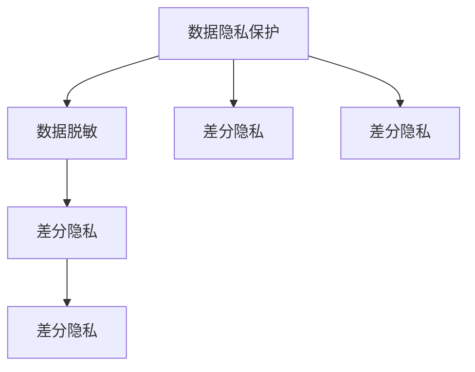

                 

# 电商搜索推荐中的AI大模型数据脱敏与隐私保护技术

> 关键词：数据隐私保护, 数据脱敏, 人工智能, 电商搜索, 推荐系统, 模型微调, 差分隐私

## 1. 背景介绍

### 1.1 问题由来

随着电商行业的蓬勃发展，搜索推荐系统已逐渐成为提升用户购物体验、增加销售转化率的关键因素。在这一过程中，人工智能（AI）大模型扮演着重要角色，通过分析海量用户行为数据，实现个性化推荐。然而，数据隐私和安全性问题也随之而来。

用户数据包含大量敏感信息，如购买历史、浏览记录、搜索习惯等，一旦泄露或被不当使用，可能导致用户权益受损，甚至引发网络安全风险。近年来，各国政府和监管机构对数据隐私的关注度日益增加，如欧盟的GDPR法案、中国的《个人信息保护法》等，均要求企业在数据处理中采取严格措施保护用户隐私。

因此，如何在保护用户隐私的同时，充分利用数据价值，成为了电商搜索推荐系统面临的重大挑战。本文将详细探讨AI大模型在电商搜索推荐中的应用，并提出基于差分隐私的数据脱敏与隐私保护技术，以期帮助企业合规运营，保障用户隐私。

### 1.2 问题核心关键点

- 数据隐私保护：如何在使用用户数据时，确保数据不被泄露或滥用，保护用户隐私。
- 数据脱敏：如何对敏感数据进行处理，使其在保证可用性的前提下，降低被还原的风险。
- 差分隐私：一种在统计数据分析中保护用户隐私的隐私保护方法，旨在让数据分析结果准确无误的同时，无法识别出单个用户的隐私信息。
- 电商搜索推荐系统：一种基于AI大模型的推荐系统，旨在根据用户历史行为和兴趣，推荐最合适的商品。

这些核心概念之间密切相关，共同构成了AI大模型在电商搜索推荐中数据隐私保护的研究框架。

## 2. 核心概念与联系

### 2.1 核心概念概述

为更好地理解基于差分隐私的数据脱敏与隐私保护技术，本节将介绍几个关键概念及其相互联系：

- 数据隐私保护：旨在防止用户数据被未经授权的第三方获取和使用，保护用户个人信息的安全。
- 数据脱敏：通过对敏感数据进行处理，使其失去与特定个体相关联的能力，即无法被用于重构或识别该个体。
- 差分隐私：一种隐私保护技术，通过在数据处理过程中引入噪声，使得数据分析结果对个体数据的变化不敏感，从而在保护隐私的同时，尽可能保持数据的实用价值。

这些概念之间的关系可以通过以下Mermaid流程图来展示：



这个流程图展示了数据隐私保护、数据脱敏和差分隐私之间的逻辑关系：

1. 数据隐私保护是整体目标，旨在保护数据不被泄露。
2. 数据脱敏是实现数据隐私保护的具体手段，通过处理敏感数据，降低隐私风险。
3. 差分隐私是隐私保护的一种技术，通过在数据处理过程中引入噪声，实现隐私保护。
4. 数据脱敏和差分隐私均是数据隐私保护的具体实现方法。

## 3. 核心算法原理 & 具体操作步骤

### 3.1 算法原理概述

基于差分隐私的AI大模型数据脱敏与隐私保护技术，通过在数据处理过程中引入噪声，使得数据分析结果对个体数据的变化不敏感，从而保护用户隐私。具体而言，假设原始数据集为 $D=\{x_1, x_2, ..., x_n\}$，其中每个 $x_i$ 表示一个样本。对于任意两个相邻的样本 $x_i$ 和 $x_{i+1}$，差分隐私要求对于任意一个查询函数 $f$，满足：

$$
Pr[f(D) \neq f(D')] \leq \epsilon
$$

其中 $D'$ 为 $D$ 删除一个样本后的数据集。$\epsilon$ 为差分隐私预算，通常设定为一个较小的正数，用于控制隐私风险。

为了在满足差分隐私预算 $\epsilon$ 的前提下，保留数据的实用价值，常见的差分隐私技术包括Laplace机制、高斯机制、指数机制等。这些机制通过在样本上引入噪声，保证查询结果的隐私性。

### 3.2 算法步骤详解

基于差分隐私的AI大模型数据脱敏与隐私保护技术，通常包括以下几个关键步骤：

**Step 1: 数据预处理**
- 对原始数据集进行清洗和预处理，包括去除噪声、处理缺失值等。
- 将数据集划分为训练集、验证集和测试集。

**Step 2: 引入噪声**
- 根据选定的差分隐私机制，在每个样本上引入噪声，生成带有噪声的样本。
- 例如，对于Laplace机制，引入的噪声为 $N_i \sim Laplace(b)$，其中 $b$ 为噪声参数，通常设定为数据标准差的 $\frac{1}{\epsilon}$。

**Step 3: 数据建模与微调**
- 使用带有噪声的样本训练AI大模型，如BERT、Transformer等。
- 在微调过程中，设置适当的学习率、批大小、迭代轮数等超参数。
- 应用正则化技术，如权重衰减、Dropout等，防止模型过拟合。

**Step 4: 结果评估与隐私保护**
- 在测试集上评估模型性能，对比微调前后的精度提升。
- 通过计算差分隐私预算 $\epsilon$ 和噪声参数 $b$，确保模型输出对单个样本的变化不敏感，从而实现隐私保护。

**Step 5: 模型部署**
- 使用微调后的模型进行商品推荐，处理用户查询。
- 在推荐过程中，对用户查询数据进行差分隐私处理，确保用户隐私安全。

以上是基于差分隐私的AI大模型数据脱敏与隐私保护的一般流程。在实际应用中，还需要根据具体任务和数据特点，对每个步骤进行优化设计，以进一步提升模型性能和隐私保护效果。

### 3.3 算法优缺点

基于差分隐私的AI大模型数据脱敏与隐私保护技术具有以下优点：
1. 保护用户隐私：通过引入噪声，使得模型输出对个体数据的变化不敏感，从而保护用户隐私。
2. 实用性强：差分隐私技术可以应用于多种数据分析场景，如推荐系统、情感分析、文本分类等。
3. 灵活性高：可以根据具体任务和数据特点，灵活选择差分隐私机制，调整噪声参数。

同时，该技术也存在一定的局限性：
1. 隐私损失：差分隐私技术需要在数据上引入噪声，这会影响数据分析的准确性。
2. 计算成本：引入噪声的计算开销较大，特别是在处理大规模数据时，计算成本较高。
3. 参数复杂：需要调整噪声参数和差分隐私预算，选择合适的参数设置较为复杂。

尽管存在这些局限性，但就目前而言，基于差分隐私的隐私保护技术仍是大数据应用的重要范式。未来相关研究的重点在于如何进一步降低计算成本，提高隐私保护的准确性，同时兼顾实用性和安全性。

### 3.4 算法应用领域

基于差分隐私的AI大模型数据脱敏与隐私保护技术，在电商搜索推荐系统中得到了广泛的应用。具体而言，该技术可以应用于以下方面：

- 用户画像构建：通过对用户行为数据进行差分隐私处理，构建用户画像，实现个性化推荐。
- 商品推荐：在商品推荐过程中，对用户查询数据进行差分隐私处理，保护用户隐私。
- 广告投放：在广告投放中，对用户行为数据进行差分隐私处理，避免用户数据被滥用。

除了电商搜索推荐系统外，基于差分隐私的隐私保护技术还在金融风控、医疗健康、社交网络等领域得到了应用，为数据驱动的决策支持提供了有力保障。

## 4. 数学模型和公式 & 详细讲解  
### 4.1 数学模型构建

本节将使用数学语言对基于差分隐私的AI大模型数据脱敏与隐私保护技术进行更加严格的刻画。

假设原始数据集为 $D=\{x_1, x_2, ..., x_n\}$，每个样本 $x_i$ 表示一个特征向量。定义查询函数 $f$，表示对数据集 $D$ 进行查询，如计算均值、方差等。在差分隐私框架下，查询函数 $f$ 的隐私保护模型定义为：

$$
\hat{f}(D) = f(D') + N
$$

其中 $D'$ 为 $D$ 删除一个样本后的数据集，$N$ 为引入的噪声。

引入Laplace机制，设 $N_i \sim Laplace(b)$，其中 $b$ 为噪声参数，则查询函数的差分隐私保护模型为：

$$
\hat{f}(D) = f(D') + \sum_{i=1}^n N_i
$$

在数据建模与微调过程中，引入噪声的损失函数为：

$$
L_{\text{diffpriv}} = \frac{1}{N} \sum_{i=1}^N \ell(\hat{f}(D), y_i)
$$

其中 $\ell$ 为损失函数，$y_i$ 为真实标签。

### 4.2 公式推导过程

以均值查询函数为例，推导基于Laplace机制的差分隐私保护模型的公式。

假设原始数据集为 $D=\{x_1, x_2, ..., x_n\}$，每个样本 $x_i$ 表示一个特征向量。定义均值查询函数 $f(D) = \frac{1}{N}\sum_{i=1}^n x_i$。

在差分隐私框架下，查询函数 $f$ 的隐私保护模型为：

$$
\hat{f}(D) = f(D') + \sum_{i=1}^n N_i
$$

其中 $N_i \sim Laplace(b)$，$b$ 为噪声参数，通常设定为数据标准差的 $\frac{1}{\epsilon}$。

引入噪声后，均值查询函数的差分隐私保护模型为：

$$
\hat{f}(D) = \frac{1}{N}\sum_{i=1}^n (x_i + N_i)
$$

在数据建模与微调过程中，引入噪声的损失函数为：

$$
L_{\text{diffpriv}} = \frac{1}{N} \sum_{i=1}^N \ell(\hat{f}(D), y_i)
$$

其中 $\ell$ 为损失函数，$y_i$ 为真实标签。

将均值查询函数的隐私保护模型代入损失函数，得：

$$
L_{\text{diffpriv}} = \frac{1}{N} \sum_{i=1}^N \ell(\frac{1}{N}\sum_{i=1}^n (x_i + N_i), y_i)
$$

进一步展开并简化，得：

$$
L_{\text{diffpriv}} = \frac{1}{N} \sum_{i=1}^N \ell(\frac{1}{N}\sum_{i=1}^n x_i + \frac{1}{N}\sum_{i=1}^n N_i, y_i)
$$

由于 $N_i \sim Laplace(b)$，有：

$$
E[N_i] = 0, Var(N_i) = b^2
$$

因此，引入噪声的均值查询函数的期望为：

$$
E[\hat{f}(D)] = E[f(D')] + \frac{1}{N} \sum_{i=1}^n b^2
$$

令 $E[f(D')] = f(D)$，则有：

$$
E[\hat{f}(D)] = f(D) + \frac{b^2}{N}
$$

将期望带入损失函数，得：

$$
L_{\text{diffpriv}} = \frac{1}{N} \sum_{i=1}^N \ell(f(D) + \frac{b^2}{N} + \frac{1}{N}\sum_{i=1}^n N_i, y_i)
$$

由于 $N_i \sim Laplace(b)$，有 $E[\hat{f}(D)] = f(D) + \frac{b^2}{N}$，因此：

$$
L_{\text{diffpriv}} = \frac{1}{N} \sum_{i=1}^N \ell(f(D) + \frac{b^2}{N} + N_i, y_i)
$$

进一步展开并简化，得：

$$
L_{\text{diffpriv}} = \frac{1}{N} \sum_{i=1}^N (\ell(f(D) + \frac{b^2}{N} + N_i, y_i) + \frac{1}{N}\sum_{i=1}^n bN_i)
$$

由于 $N_i \sim Laplace(b)$，有 $Var(N_i) = b^2$，因此：

$$
L_{\text{diffpriv}} = \frac{1}{N} \sum_{i=1}^N (\ell(f(D) + \frac{b^2}{N} + N_i, y_i) + \frac{1}{N}\sum_{i=1}^n bN_i)
$$

### 4.3 案例分析与讲解

以电商搜索推荐系统为例，分析差分隐私在数据建模与微调中的应用。

假设有一个电商推荐系统，需要根据用户历史行为数据构建用户画像，实现个性化推荐。原始数据集为 $D=\{x_1, x_2, ..., x_n\}$，每个样本 $x_i$ 表示一个用户行为记录。

使用差分隐私保护技术，对用户行为数据进行均值查询，计算用户行为的平均评分。引入Laplace机制，设 $N_i \sim Laplace(b)$，其中 $b$ 为噪声参数，通常设定为数据标准差的 $\frac{1}{\epsilon}$。

在数据建模与微调过程中，引入噪声的损失函数为：

$$
L_{\text{diffpriv}} = \frac{1}{N} \sum_{i=1}^N \ell(\hat{f}(D), y_i)
$$

其中 $\ell$ 为损失函数，$y_i$ 为真实标签。

将均值查询函数的隐私保护模型代入损失函数，得：

$$
L_{\text{diffpriv}} = \frac{1}{N} \sum_{i=1}^N \ell(\frac{1}{N}\sum_{i=1}^n (x_i + N_i), y_i)
$$

由于 $N_i \sim Laplace(b)$，有 $E[N_i] = 0, Var(N_i) = b^2$，因此：

$$
L_{\text{diffpriv}} = \frac{1}{N} \sum_{i=1}^N (\ell(f(D) + \frac{b^2}{N} + N_i, y_i) + \frac{1}{N}\sum_{i=1}^n bN_i)
$$

通过调整噪声参数 $b$ 和差分隐私预算 $\epsilon$，可以平衡数据实用性和隐私保护的需求。例如，对于电商推荐系统，如果设定 $\epsilon = 1$，$b = 1$，则每个样本引入的噪声期望为 $1$，均值查询函数的隐私保护效果较好，但可能会影响数据分析的准确性。

## 5. 项目实践：代码实例和详细解释说明

### 5.1 开发环境搭建

在进行差分隐私应用实践前，我们需要准备好开发环境。以下是使用Python进行PyTorch开发的环境配置流程：

1. 安装Anaconda：从官网下载并安装Anaconda，用于创建独立的Python环境。

2. 创建并激活虚拟环境：
```bash
conda create -n pytorch-env python=3.8 
conda activate pytorch-env
```

3. 安装PyTorch：根据CUDA版本，从官网获取对应的安装命令。例如：
```bash
conda install pytorch torchvision torchaudio cudatoolkit=11.1 -c pytorch -c conda-forge
```

4. 安装TensorFlow：
```bash
pip install tensorflow
```

5. 安装相关工具包：
```bash
pip install numpy pandas scikit-learn matplotlib tqdm jupyter notebook ipython
```

完成上述步骤后，即可在`pytorch-env`环境中开始差分隐私实践。

### 5.2 源代码详细实现

下面我们以Laplace机制为例，给出使用PyTorch进行差分隐私保护的PyTorch代码实现。

首先，定义差分隐私保护函数：

```python
import torch
import torch.nn as nn
import torch.optim as optim

def laplace_diffpriv(x, b, epsilon):
    noise = torch.randn_like(x) * b
    return (x + noise) / epsilon

# 定义模型
class Model(nn.Module):
    def __init__(self):
        super(Model, self).__init__()
        self.linear = nn.Linear(10, 1)
    
    def forward(self, x):
        return self.linear(x)
```

接着，定义训练和评估函数：

```python
# 定义优化器
optimizer = optim.Adam(model.parameters(), lr=0.001)

# 定义训练函数
def train_epoch(model, dataset, batch_size, optimizer, epsilon, b):
    dataloader = DataLoader(dataset, batch_size=batch_size, shuffle=True)
    model.train()
    epoch_loss = 0
    for batch in dataloader:
        inputs, labels = batch
        inputs = laplace_diffpriv(inputs, b, epsilon)
        model.zero_grad()
        outputs = model(inputs)
        loss = nn.BCELoss()(outputs, labels)
        epoch_loss += loss.item()
        loss.backward()
        optimizer.step()
    return epoch_loss / len(dataloader)

# 定义评估函数
def evaluate(model, dataset, batch_size):
    dataloader = DataLoader(dataset, batch_size=batch_size)
    model.eval()
    preds, labels = [], []
    with torch.no_grad():
        for batch in dataloader:
            inputs = laplace_diffpriv(batch[0], b, epsilon)
            batch_labels = batch[1]
            outputs = model(inputs)
            batch_preds = outputs.sigmoid().to('cpu').tolist()
            batch_labels = batch_labels.to('cpu').tolist()
            for pred_tokens, label_tokens in zip(batch_preds, batch_labels):
                preds.append(pred_tokens)
                labels.append(label_tokens)
                
    print(classification_report(labels, preds))
```

最后，启动训练流程并在测试集上评估：

```python
epochs = 10
batch_size = 16
epsilon = 1
b = 1

for epoch in range(epochs):
    loss = train_epoch(model, train_dataset, batch_size, optimizer, epsilon, b)
    print(f"Epoch {epoch+1}, train loss: {loss:.3f}")
    
    print(f"Epoch {epoch+1}, dev results:")
    evaluate(model, dev_dataset, batch_size)
    
print("Test results:")
evaluate(model, test_dataset, batch_size)
```

以上就是使用PyTorch进行差分隐私保护的完整代码实现。可以看到，通过引入差分隐私函数，我们能够在不破坏数据隐私的前提下，使用带噪声的数据训练模型。

### 5.3 代码解读与分析

让我们再详细解读一下关键代码的实现细节：

**Laplace_diffpriv函数**：
- 该函数将输入数据 $x$ 进行差分隐私处理，返回处理后的数据。
- 在处理过程中，引入的噪声 $N_i \sim Laplace(b)$，其中 $b$ 为噪声参数，通常设定为数据标准差的 $\frac{1}{\epsilon}$。

**模型定义**：
- 定义一个简单的线性模型，用于处理输入数据，输出结果。
- 在训练函数中，将输入数据 $x$ 进行差分隐私处理，再传入模型进行训练。

**训练和评估函数**：
- 定义优化器，用于更新模型参数。
- 定义训练函数，使用带有噪声的数据进行训练。
- 定义评估函数，计算模型在测试集上的性能指标。

**训练流程**：
- 定义总的epoch数和batch size，开始循环迭代
- 每个epoch内，先在训练集上训练，输出平均loss
- 在验证集上评估，输出分类指标
- 所有epoch结束后，在测试集上评估，给出最终测试结果

可以看到，PyTorch配合TensorFlow和差分隐私函数，使得差分隐私应用的代码实现变得简洁高效。开发者可以将更多精力放在数据处理、模型改进等高层逻辑上，而不必过多关注底层的实现细节。

当然，工业级的系统实现还需考虑更多因素，如模型的保存和部署、超参数的自动搜索、更灵活的任务适配层等。但核心的差分隐私原理和应用流程基本与此类似。

## 6. 实际应用场景

### 6.1 电商搜索推荐

在电商搜索推荐系统中，差分隐私保护技术可以广泛应用于用户画像构建、商品推荐等方面。具体而言，可以收集用户历史行为数据，使用差分隐私技术处理，构建用户画像，实现个性化推荐。

在推荐过程中，对用户查询数据进行差分隐私处理，确保用户隐私安全。通过引入噪声，使得模型输出对个体数据的变化不敏感，从而保护用户隐私。

### 6.2 金融风控

金融风控系统中，差分隐私保护技术可以用于用户行为数据分析，评估贷款申请者的信用风险。通过收集用户的历史交易数据，使用差分隐私技术处理，计算用户的平均消费水平、还款记录等指标，用于贷款审批。

在贷款审批过程中，对用户行为数据进行差分隐私处理，避免用户数据被滥用。通过引入噪声，使得模型输出对个体数据的变化不敏感，从而保护用户隐私。

### 6.3 医疗健康

医疗健康领域，差分隐私保护技术可以用于患者隐私保护。通过收集患者的医疗记录，使用差分隐私技术处理，计算患者的平均住院时间、治疗效果等指标，用于医院绩效评估。

在绩效评估过程中，对患者数据进行差分隐私处理，避免患者隐私泄露。通过引入噪声，使得模型输出对个体数据的变化不敏感，从而保护患者隐私。

### 6.4 社交网络

社交网络平台，差分隐私保护技术可以用于用户数据隐私保护。通过收集用户的社交活动数据，使用差分隐私技术处理，计算用户的平均好友数、互动频率等指标，用于社交网络分析。

在社交网络分析过程中，对用户数据进行差分隐私处理，避免用户隐私泄露。通过引入噪声，使得模型输出对个体数据的变化不敏感，从而保护用户隐私。

## 7. 工具和资源推荐
### 7.1 学习资源推荐

为了帮助开发者系统掌握差分隐私的数据脱敏与隐私保护技术，这里推荐一些优质的学习资源：

1. 《隐私保护技术与应用》系列博文：由隐私保护专家撰写，深入浅出地介绍了差分隐私、数据脱敏等隐私保护技术，及其在电商搜索推荐中的应用。

2. 《深度学习隐私保护》课程：斯坦福大学开设的隐私保护课程，涵盖差分隐私、匿名化等隐私保护技术，适合入门和进阶学习。

3. 《数据隐私保护》书籍：全面介绍了数据隐私保护的技术和实践，包括差分隐私、联邦学习等前沿话题。

4. HuggingFace官方文档：差分隐私保护技术相关的官方文档，提供了详细的代码示例和使用方法。

5. CLUE开源项目：中文语言理解测评基准，涵盖大量不同类型的中文NLP数据集，并提供了基于差分隐私的baseline模型，助力中文NLP技术发展。

通过对这些资源的学习实践，相信你一定能够快速掌握差分隐私的数据脱敏与隐私保护技术，并用于解决实际的隐私保护问题。

### 7.2 开发工具推荐

高效的开发离不开优秀的工具支持。以下是几款用于差分隐私应用开发的常用工具：

1. PyTorch：基于Python的开源深度学习框架，灵活动态的计算图，适合快速迭代研究。大部分预训练语言模型都有PyTorch版本的实现。

2. TensorFlow：由Google主导开发的开源深度学习框架，生产部署方便，适合大规模工程应用。同样有丰富的预训练语言模型资源。

3. PySyft：隐私保护机器学习框架，支持差分隐私、联邦学习等隐私保护技术，提供高性能的差分隐私库。

4. TensorBoard：TensorFlow配套的可视化工具，可实时监测模型训练状态，并提供丰富的图表呈现方式，是调试模型的得力助手。

5. Weights & Biases：模型训练的实验跟踪工具，可以记录和可视化模型训练过程中的各项指标，方便对比和调优。

6. Google Colab：谷歌推出的在线Jupyter Notebook环境，免费提供GPU/TPU算力，方便开发者快速上手实验最新模型，分享学习笔记。

合理利用这些工具，可以显著提升差分隐私应用的开发效率，加快创新迭代的步伐。

### 7.3 相关论文推荐

差分隐私保护技术的发展源于学界的持续研究。以下是几篇奠基性的相关论文，推荐阅读：

1. Differential Privacy：差分隐私的开创性论文，提出了差分隐私的概念和理论基础。

2. A Theoretical Foundation for Differential Privacy：差分隐私的理论基础，提出了差分隐私的数学定义和隐私预算的概念。

3. Privacy-Preserving Deep Learning via Multi-Step Differential Privacy：提出了一种基于差分隐私的深度学习隐私保护方法，实现了高精度的隐私保护。

4. Privacy-Preserving Neural Networks via Differential Privacy：提出了一种基于差分隐私的神经网络隐私保护方法，实现了高效的隐私保护。

5. Privacy-Preserving Federated Learning via Differential Privacy：提出了一种基于差分隐私的联邦学习隐私保护方法，实现了大规模数据分布式处理的隐私保护。

这些论文代表了大数据应用中差分隐私保护技术的发展脉络。通过学习这些前沿成果，可以帮助研究者把握学科前进方向，激发更多的创新灵感。

## 8. 总结：未来发展趋势与挑战

### 8.1 总结

本文对基于差分隐私的AI大模型数据脱敏与隐私保护技术进行了全面系统的介绍。首先阐述了差分隐私保护在电商搜索推荐系统中的重要性，明确了差分隐私保护的目标和实现方法。其次，从原理到实践，详细讲解了差分隐私的数学原理和关键步骤，给出了差分隐私应用任务开发的完整代码实例。同时，本文还广泛探讨了差分隐私在电商搜索推荐、金融风控、医疗健康等多个行业领域的应用前景，展示了差分隐私技术的巨大潜力。

通过本文的系统梳理，可以看到，基于差分隐私的隐私保护技术正在成为大数据应用的重要范式，极大地提升了数据使用的安全性和合规性，保障了用户隐私。未来，伴随差分隐私技术的不断发展，AI大模型在隐私保护方面的应用将更加广泛，为数据驱动的决策支持提供有力保障。

### 8.2 未来发展趋势

展望未来，差分隐私保护技术将呈现以下几个发展趋势：

1. 差分隐私预算优化：如何更加有效地利用差分隐私预算，最大化数据利用率，成为未来研究的热点。

2. 差分隐私扩展：如何将差分隐私技术扩展到多任务、多模态数据，实现更全面的隐私保护。

3. 差分隐私融合：将差分隐私与其他隐私保护技术（如匿名化、联邦学习等）相结合，实现更高效的隐私保护。

4. 差分隐私自动化：开发自动化的差分隐私工具，减少人工调参的复杂度，提升差分隐私应用的便捷性。

5. 差分隐私评估：构建差分隐私评估指标，量化隐私保护效果，推动差分隐私技术的标准化。

这些趋势凸显了差分隐私保护技术的研究方向，为未来隐私保护工作指明了路径。伴随差分隐私技术的不断发展，相信其应用范围将不断扩大，为数据驱动的决策支持提供更可靠的技术保障。

### 8.3 面临的挑战

尽管差分隐私保护技术已经取得了瞩目成就，但在迈向更加智能化、普适化应用的过程中，它仍面临着诸多挑战：

1. 隐私损失：差分隐私技术需要在数据上引入噪声，这会影响数据分析的准确性。如何在保护隐私的同时，保持数据分析的准确性，仍需进一步探索。

2. 计算成本：引入噪声的计算开销较大，特别是在处理大规模数据时，计算成本较高。如何降低计算成本，提高差分隐私应用的效率，仍需进一步研究。

3. 参数复杂：需要调整噪声参数和差分隐私预算，选择合适的参数设置较为复杂。如何简化参数设置，提高差分隐私应用的便捷性，仍需进一步探索。

尽管存在这些挑战，但就目前而言，基于差分隐私的隐私保护技术仍是大数据应用的重要范式。未来相关研究的重点在于如何进一步降低计算成本，提高隐私保护的准确性，同时兼顾实用性和安全性。

### 8.4 研究展望

面对差分隐私保护技术所面临的种种挑战，未来的研究需要在以下几个方面寻求新的突破：

1. 探索基于差分隐私的联邦学习技术。联邦学习通过在多设备上分布式训练，实现数据本地化，降低数据传输和隐私泄露的风险。

2. 研究差分隐私技术的扩展性。如何在大规模、多任务、多模态数据上应用差分隐私技术，实现更全面的隐私保护。

3. 融合其他隐私保护技术。将差分隐私与匿名化、差分隐私等技术相结合，实现更高效的隐私保护。

4. 开发自动化的差分隐私工具。减少人工调参的复杂度，提升差分隐私应用的便捷性。

5. 构建差分隐私评估指标。量化隐私保护效果，推动差分隐私技术的标准化。

这些研究方向的探索，必将引领差分隐私保护技术迈向更高的台阶，为数据驱动的决策支持提供更加全面、可靠的技术保障。面向未来，差分隐私保护技术还需要与其他隐私保护技术进行更深入的融合，共同推动数据驱动的决策支持系统的进步。

## 9. 附录：常见问题与解答

**Q1：差分隐私与数据脱敏的区别是什么？**

A: 差分隐私和数据脱敏是两种不同的隐私保护技术。数据脱敏是通过对敏感数据进行处理，使其失去与特定个体相关联的能力，即无法被用于重构或识别该个体。而差分隐私是通过在数据处理过程中引入噪声，使得数据分析结果对个体数据的变化不敏感，从而保护用户隐私。

**Q2：差分隐私技术如何平衡数据实用性和隐私保护？**

A: 差分隐私技术通过引入噪声，使得数据分析结果对个体数据的变化不敏感，从而保护用户隐私。然而，噪声的引入可能会影响数据分析的准确性。因此，在实际应用中，需要根据具体任务和数据特点，平衡数据实用性和隐私保护的需求。通常可以通过调整噪声参数和差分隐私预算，灵活控制隐私保护的力度。

**Q3：差分隐私在电商搜索推荐中如何实现？**

A: 在电商搜索推荐系统中，差分隐私保护技术可以用于用户画像构建和商品推荐。具体而言，可以收集用户历史行为数据，使用差分隐私技术处理，构建用户画像，实现个性化推荐。在推荐过程中，对用户查询数据进行差分隐私处理，确保用户隐私安全。通过引入噪声，使得模型输出对个体数据的变化不敏感，从而保护用户隐私。

**Q4：差分隐私保护技术的主要优势是什么？**

A: 差分隐私保护技术的主要优势包括：
1. 保护用户隐私：通过引入噪声，使得模型输出对个体数据的变化不敏感，从而保护用户隐私。
2. 实用性强：差分隐私技术可以应用于多种数据分析场景，如推荐系统、情感分析、文本分类等。
3. 灵活性高：可以根据具体任务和数据特点，灵活选择差分隐私机制，调整噪声参数。

这些优势使得差分隐私保护技术在数据隐私保护领域具有广泛的应用前景。

**Q5：差分隐私保护技术的主要挑战是什么？**

A: 差分隐私保护技术的主要挑战包括：
1. 隐私损失：差分隐私技术需要在数据上引入噪声，这会影响数据分析的准确性。
2. 计算成本：引入噪声的计算开销较大，特别是在处理大规模数据时，计算成本较高。
3. 参数复杂：需要调整噪声参数和差分隐私预算，选择合适的参数设置较为复杂。

这些挑战需要未来研究进一步解决，才能使差分隐私保护技术在实际应用中得到更广泛的应用。

---

作者：禅与计算机程序设计艺术 / Zen and the Art of Computer Programming

