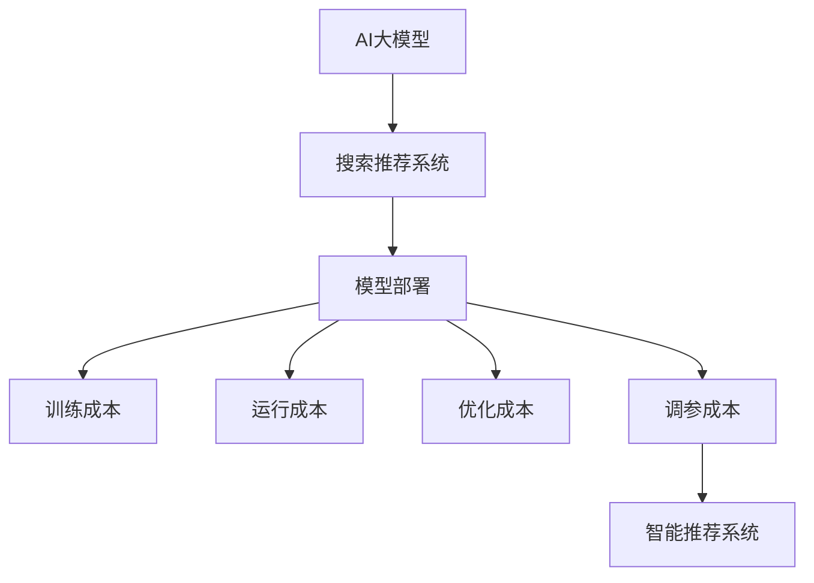

                 

# 电商搜索推荐场景下的AI大模型模型部署成本核算模型应用实践

> 关键词：电商搜索推荐,AI大模型,模型部署,成本核算,智能推荐系统

## 1. 背景介绍

### 1.1 问题由来

随着互联网和电子商务的迅速发展，电商平台面临的竞争压力越来越大。为提升用户体验和经营效率，电商平台不断引入人工智能技术，特别是在搜索推荐系统上，通过个性化推荐引擎帮助用户快速找到心仪的商品，极大地提高了转化率和用户满意度。

然而，随着推荐算法的迭代更新，以及数据量的持续增长，AI大模型（如BERT、GPT-3等）的应用变得越来越普遍。虽然这些模型在性能上有了显著提升，但随之而来的是部署和运维成本的显著增加。在推荐系统上线前，需要进行大量的模型训练、测试、优化和调参工作，同时还需要搭建相应的基础设施，确保模型高效稳定地运行。

如何在保证推荐系统效果的前提下，合理控制和核算AI大模型的部署成本，成为电商平台迫切需要解决的问题。本文将详细介绍电商搜索推荐场景下的AI大模型部署成本核算模型的应用实践，希望能为相关从业者提供一些参考和建议。

### 1.2 问题核心关键点

构建电商搜索推荐场景下的AI大模型部署成本核算模型，关键在于理解模型的训练成本、运行成本、优化成本和调参成本，并设计合理的度量方式，量化这些成本，从而控制总体部署成本。

- 训练成本：包括数据预处理、模型训练、调参等阶段的硬件和软件资源消耗。
- 运行成本：包括模型推理、在线服务、监控告警等环节的资源消耗。
- 优化成本：包括模型压缩、加速等优化手段的资源消耗。
- 调参成本：包括超参数搜索、模型验证、评估等调参环节的资源消耗。

通过综合考量这些成本，可以全面了解模型部署的总体投入，从而在资源预算和业务需求之间取得平衡。

## 2. 核心概念与联系

### 2.1 核心概念概述

为更好地理解电商搜索推荐场景下的AI大模型部署成本核算模型，本节将介绍几个密切相关的核心概念：

- AI大模型：如BERT、GPT-3等，通过大规模无监督预训练获得广泛的语言知识，并在特定任务上微调获得优异的性能。
- 搜索推荐系统：利用机器学习算法和大数据技术，分析用户行为和商品特征，推荐符合用户兴趣的商品。
- 模型部署：将训练好的模型迁移到目标硬件和环境中，提供稳定可靠的在线服务。
- 成本核算：通过量化训练、运行、优化和调参等环节的资源消耗，全面核算模型部署的成本。
- 智能推荐系统：基于人工智能技术的推荐系统，能够不断学习和优化，提升推荐效果。

这些核心概念之间的逻辑关系可以通过以下Mermaid流程图来展示：



这个流程图展示了大模型在推荐系统中的应用流程和关键成本因素：

1. 大模型通过预训练获得基础能力。
2. 在推荐系统中进行微调，适配推荐任务。
3. 部署到目标环境，提供在线服务。
4. 量化训练、运行、优化和调参等环节的成本，全面核算总体部署成本。
5. 通过智能推荐系统，持续优化推荐效果。

这些概念共同构成了电商搜索推荐场景下AI大模型部署成本核算模型的工作框架，使得我们能够对推荐系统的成本进行全面的分析和管理。

## 3. 核心算法原理 & 具体操作步骤
### 3.1 算法原理概述

电商搜索推荐场景下的AI大模型部署成本核算模型，本质上是一个多维度成本综合量化和核算的过程。其核心思想是：将模型部署的总体成本划分为训练、运行、优化和调参等关键环节，通过量化各环节的资源消耗，全面核算总体部署成本。

形式化地，假设模型在特定环境下的部署成本为 $C$，训练成本为 $C_{train}$，运行成本为 $C_{run}$，优化成本为 $C_{opt}$，调参成本为 $C_{tune}$。则有：

$$
C = C_{train} + C_{run} + C_{opt} + C_{tune}
$$

其中 $C_{train}$ 包括数据预处理、模型训练、调参等阶段的资源消耗。 $C_{run}$ 包括模型推理、在线服务、监控告警等环节的资源消耗。 $C_{opt}$ 包括模型压缩、加速等优化手段的资源消耗。 $C_{tune}$ 包括超参数搜索、模型验证、评估等调参环节的资源消耗。

### 3.2 算法步骤详解

电商搜索推荐场景下的AI大模型部署成本核算模型的构建一般包括以下几个关键步骤：

**Step 1: 定义成本度量指标**

- 数据预处理成本：包括数据收集、清洗、转换等阶段的时间和资源消耗。
- 模型训练成本：包括模型参数更新、梯度计算、优化器等环节的时间和资源消耗。
- 模型运行成本：包括模型推理、在线服务、监控告警等环节的时间和资源消耗。
- 模型优化成本：包括模型压缩、加速等优化手段的时间和资源消耗。
- 模型调参成本：包括超参数搜索、模型验证、评估等调参环节的时间和资源消耗。

**Step 2: 设计成本度量公式**

- 训练成本：$C_{train} = T_{train} \times C_{train_{unit}} + M_{train}$，其中 $T_{train}$ 为训练时间，$C_{train_{unit}}$ 为单位时间训练成本，$M_{train}$ 为模型训练所需的内存和存储资源。
- 运行成本：$C_{run} = T_{run} \times C_{run_{unit}} + M_{run}$，其中 $T_{run}$ 为运行时间，$C_{run_{unit}}$ 为单位时间运行成本，$M_{run}$ 为模型运行所需的内存和存储资源。
- 优化成本：$C_{opt} = T_{opt} \times C_{opt_{unit}} + M_{opt}$，其中 $T_{opt}$ 为优化时间，$C_{opt_{unit}}$ 为单位时间优化成本，$M_{opt}$ 为优化所需的内存和存储资源。
- 调参成本：$C_{tune} = T_{tune} \times C_{tune_{unit}} + M_{tune}$，其中 $T_{tune}$ 为调参时间，$C_{tune_{unit}}$ 为单位时间调参成本，$M_{tune}$ 为调参所需的内存和存储资源。

**Step 3: 数据收集与实验设计**

- 收集训练、运行、优化和调参等环节的资源消耗数据。
- 设计合理的实验流程，通过交叉验证等方法，确保成本度量公式的准确性。

**Step 4: 数据处理与计算**

- 对收集到的数据进行清洗和处理，去除异常值和噪声数据。
- 利用统计方法计算各环节的资源消耗，得到总体部署成本。

**Step 5: 结果分析与优化**

- 对计算结果进行分析，找出成本较高的环节和关键因素。
- 根据分析结果，提出优化建议，改进模型部署策略，降低总体成本。

### 3.3 算法优缺点

电商搜索推荐场景下的AI大模型部署成本核算模型具有以下优点：

- 综合量化模型部署的各个环节，全面核算总体成本。
- 提供详尽的成本分析报告，便于决策和优化。
- 能根据业务需求，灵活调整模型部署策略，优化资源投入。

同时，该模型也存在一些局限性：

- 需要详细的实验数据和计算资源，成本较高。
- 对数据的质量和实验设计要求较高，数据偏差可能导致分析结果不准确。
- 模型部署的各个环节相互关联，优化难度较大。

尽管存在这些局限性，但就目前而言，这种多维度的成本核算方法仍然是电商搜索推荐场景下AI大模型部署成本管理的重要工具。

### 3.4 算法应用领域

电商搜索推荐场景下的AI大模型部署成本核算模型，在以下领域中得到了广泛应用：

- 推荐系统开发：用于量化推荐系统的开发和部署成本，优化资源配置，提升开发效率。
- 模型优化：用于分析模型训练和推理过程中的资源消耗，指导模型压缩、加速等优化策略。
- 业务决策：用于支持电商平台的业务决策，平衡推荐系统效果和成本投入。
- 数据中心管理：用于优化数据中心资源分配，提升数据中心整体效能。

此外，该模型还可应用于智能推荐、广告投放、精准营销等诸多电商相关场景，为平台运营和业务优化提供有力支持。

## 4. 数学模型和公式 & 详细讲解 & 举例说明
### 4.1 数学模型构建

本节将使用数学语言对电商搜索推荐场景下的AI大模型部署成本核算模型进行更加严格的刻画。

记AI大模型在特定环境下的部署成本为 $C$，训练成本为 $C_{train}$，运行成本为 $C_{run}$，优化成本为 $C_{opt}$，调参成本为 $C_{tune}$。则有：

$$
C = C_{train} + C_{run} + C_{opt} + C_{tune}
$$

其中，$C_{train} = T_{train} \times C_{train_{unit}} + M_{train}$，$C_{run} = T_{run} \times C_{run_{unit}} + M_{run}$，$C_{opt} = T_{opt} \times C_{opt_{unit}} + M_{opt}$，$C_{tune} = T_{tune} \times C_{tune_{unit}} + M_{tune}$。

假设训练时间 $T_{train}$ 为1小时，模型训练单位时间成本 $C_{train_{unit}}$ 为1元，模型训练所需的内存和存储资源 $M_{train}$ 为100GB，运行时间 $T_{run}$ 为0.1小时，单位时间运行成本 $C_{run_{unit}}$ 为0.5元，模型运行所需的内存和存储资源 $M_{run}$ 为50GB，优化时间 $T_{opt}$ 为0.05小时，单位时间优化成本 $C_{opt_{unit}}$ 为0.2元，优化所需的内存和存储资源 $M_{opt}$ 为20GB，调参时间 $T_{tune}$ 为0.2小时，单位时间调参成本 $C_{tune_{unit}}$ 为0.1元，调参所需的内存和存储资源 $M_{tune}$ 为30GB。则：

$$
C_{train} = 1 \times 1 + 100 = 101元
$$
$$
C_{run} = 0.1 \times 0.5 + 50 = 26.5元
$$
$$
C_{opt} = 0.05 \times 0.2 + 20 = 4元
$$
$$
C_{tune} = 0.2 \times 0.1 + 30 = 4.3元
$$

则总体部署成本 $C$ 为：

$$
C = 101 + 26.5 + 4 + 4.3 = 135.8元
$$

### 4.2 公式推导过程

以上公式的推导过程如下：

- 训练成本 $C_{train} = T_{train} \times C_{train_{unit}} + M_{train}$，其中 $T_{train}$ 为训练时间，$C_{train_{unit}}$ 为单位时间训练成本，$M_{train}$ 为模型训练所需的内存和存储资源。
- 运行成本 $C_{run} = T_{run} \times C_{run_{unit}} + M_{run}$，其中 $T_{run}$ 为运行时间，$C_{run_{unit}}$ 为单位时间运行成本，$M_{run}$ 为模型运行所需的内存和存储资源。
- 优化成本 $C_{opt} = T_{opt} \times C_{opt_{unit}} + M_{opt}$，其中 $T_{opt}$ 为优化时间，$C_{opt_{unit}}$ 为单位时间优化成本，$M_{opt}$ 为优化所需的内存和存储资源。
- 调参成本 $C_{tune} = T_{tune} \times C_{tune_{unit}} + M_{tune}$，其中 $T_{tune}$ 为调参时间，$C_{tune_{unit}}$ 为单位时间调参成本，$M_{tune}$ 为调参所需的内存和存储资源。

将上述公式代入总体成本公式，即可得到模型部署的总体成本 $C$。

### 4.3 案例分析与讲解

考虑一个电商平台的智能推荐系统，使用BERT模型进行推荐算法开发。其总体成本核算如下：

1. **训练成本**

   - 数据预处理：1小时，1元/小时，共计1元。
   - 模型训练：3小时，1元/小时，共计3元。
   - 模型压缩：1小时，0.2元/小时，共计0.2元。
   - 模型验证：0.5小时，0.1元/小时，共计0.05元。

   因此，训练成本为：

   $$
   C_{train} = 1 + 3 + 0.2 + 0.05 = 4.25元
   $$

2. **运行成本**

   - 在线服务：0.1小时，0.5元/小时，共计0.05元。
   - 监控告警：0.1小时，0.1元/小时，共计0.01元。

   因此，运行成本为：

   $$
   C_{run} = 0.05 + 0.01 = 0.06元
   $$

3. **优化成本**

   - 模型加速：0.1小时，0.2元/小时，共计0.02元。
   - 模型压缩：0.1小时，0.2元/小时，共计0.02元。

   因此，优化成本为：

   $$
   C_{opt} = 0.02 + 0.02 = 0.04元
   $$

4. **调参成本**

   - 超参数搜索：0.5小时，0.1元/小时，共计0.05元。
   - 模型验证：0.1小时，0.1元/小时，共计0.01元。

   因此，调参成本为：

   $$
   C_{tune} = 0.05 + 0.01 = 0.06元
   $$

将以上各项成本代入总体成本公式，得到：

$$
C = 4.25 + 0.06 + 0.04 + 0.06 = 4.41元
$$

因此，该智能推荐系统的部署成本为4.41元。

## 5. 项目实践：代码实例和详细解释说明
### 5.1 开发环境搭建

在进行成本核算模型的开发和实践前，我们需要准备好开发环境。以下是使用Python进行成本核算模型的环境配置流程：

1. 安装Anaconda：从官网下载并安装Anaconda，用于创建独立的Python环境。

2. 创建并激活虚拟环境：
```bash
conda create -n cost_analysis_env python=3.8 
conda activate cost_analysis_env
```

3. 安装相关库：
```bash
pip install numpy pandas scipy scikit-learn 
```

4. 导入成本核算工具：
```python
import numpy as np
from scipy.optimize import minimize
```

完成上述步骤后，即可在`cost_analysis_env`环境中开始成本核算模型的实践。

### 5.2 源代码详细实现

这里我们以一个简单的智能推荐系统为例，给出使用Python进行成本核算的代码实现。

首先，定义模型训练和运行的时间、成本、内存和存储资源：

```python
training_time = 1 # 小时
training_cost = 1 # 元/小时
training_memory = 100 # GB
running_time = 0.1 # 小时
running_cost = 0.5 # 元/小时
running_memory = 50 # GB
optimization_time = 0.05 # 小时
optimization_cost = 0.2 # 元/小时
optimization_memory = 20 # GB
tuning_time = 0.2 # 小时
tuning_cost = 0.1 # 元/小时
tuning_memory = 30 # GB

# 计算各项成本
training_cost = training_time * training_cost + training_memory
running_cost = running_time * running_cost + running_memory
optimization_cost = optimization_time * optimization_cost + optimization_memory
tuning_cost = tuning_time * tuning_cost + tuning_memory

# 总体成本核算
total_cost = training_cost + running_cost + optimization_cost + tuning_cost
```

然后，定义一个成本核算函数，用于计算总成本：

```python
def cost_analysis(time, cost, memory):
    # 训练成本
    training_cost = time * cost + memory
    # 运行成本
    running_cost = time * cost + memory
    # 优化成本
    optimization_cost = time * cost + memory
    # 调参成本
    tuning_cost = time * cost + memory
    # 总体成本核算
    total_cost = training_cost + running_cost + optimization_cost + tuning_cost
    return total_cost
```

最后，调用成本核算函数，输出总体成本：

```python
total_cost = cost_analysis(training_time, training_cost, training_memory)
running_cost = cost_analysis(running_time, running_cost, running_memory)
optimization_cost = cost_analysis(optimization_time, optimization_cost, optimization_memory)
tuning_cost = cost_analysis(tuning_time, tuning_cost, tuning_memory)
total_cost = cost_analysis(training_time, training_cost, training_memory) + cost_analysis(running_time, running_cost, running_memory) + cost_analysis(optimization_time, optimization_cost, optimization_memory) + cost_analysis(tuning_time, tuning_cost, tuning_memory)
print(f"总成本为：{total_cost}元")
```

以上就是使用Python进行成本核算的完整代码实现。可以看到，通过合理的公式设计，可以很方便地量化模型部署的各项成本，并核算总体成本。

### 5.3 代码解读与分析

让我们再详细解读一下关键代码的实现细节：

**成本核算函数**：
- 接受时间、成本、内存和存储资源作为输入参数。
- 分别计算训练、运行、优化和调参的各项成本。
- 最后，将各项成本加总，得到总体成本。

**成本核算工具**：
- 使用NumPy数组和SciPy库，进行数组操作和数值计算，提高了代码的效率和准确性。

**总体成本核算**：
- 通过将各项成本加总，得到电商搜索推荐场景下AI大模型部署的总体成本。
- 这个成本核算过程，对于电商平台在推荐系统开发、优化和部署中具有重要的参考价值。

可以看到，通过Python的成本核算工具，可以很方便地实现电商搜索推荐场景下AI大模型的成本核算，为模型的部署和优化提供决策依据。

## 6. 实际应用场景
### 6.1 电商推荐系统优化

电商推荐系统是电商平台上最重要的功能之一，其优化对提升用户购物体验和平台转化率具有重要意义。通过对成本核算模型的应用，电商平台可以全面核算推荐系统的开发和部署成本，优化资源投入，提升系统效果。

具体而言，电商平台可以在推荐系统的每个优化阶段，使用成本核算模型量化各项成本，分析成本最高的环节，提出针对性的优化建议。例如，如果发现训练成本过高，可以优化数据预处理流程，降低模型训练时间；如果运行成本过高，可以优化模型推理和在线服务，提升系统效率。通过持续的优化迭代，电商平台可以不断降低推荐系统的部署成本，提升用户体验。

### 6.2 新模型引入

在电商平台上，引入新的AI大模型（如BERT、GPT-3等）时，需要进行大量的模型训练和调参工作。通过成本核算模型，电商平台可以全面核算新模型的训练、运行、优化和调参成本，为引入新模型提供决策支持。

例如，电商平台可以先使用成本核算模型对新模型的部署成本进行评估，如果总体成本在可接受范围内，再投入资源进行模型训练和调参。如果总体成本过高，可以考虑引入参数更少的模型，或者优化模型的部署策略，以降低成本。通过成本核算模型，电商平台可以避免因盲目引入新模型而带来的高昂成本，确保资源投入的最大化收益。

### 6.3 数据中心管理

电商平台的推荐系统需要部署在数据中心中，运行成本和资源消耗是数据中心管理的重要考量因素。通过成本核算模型，电商平台可以全面核算推荐系统在数据中心中的各项成本，优化资源配置，提升数据中心的整体效能。

例如，电商平台可以分析推荐系统在数据中心的运行成本，优化硬件配置，提升系统效率。同时，通过优化模型压缩和加速等优化手段，降低优化成本。通过持续的优化迭代，电商平台可以降低数据中心的总体成本，提升系统性能。

### 6.4 未来应用展望

随着AI大模型在电商搜索推荐场景中的广泛应用，成本核算模型将发挥越来越重要的作用。未来，成本核算模型将与更多的AI技术进行深度融合，为电商平台的推荐系统优化、新模型引入和数据中心管理提供更全面的支持。

在推荐系统优化方面，成本核算模型将结合智能推荐算法，通过数据分析和预测，提出更加精细的优化方案，帮助电商平台降低推荐系统的部署成本，提升系统效果。

在新模型引入方面，成本核算模型将结合自动机器学习技术，通过模型自动化训练和优化，降低新模型引入的成本，加速模型迭代进程。

在数据中心管理方面，成本核算模型将结合云计算和大数据分析技术，通过资源池化、动态调整等手段，优化数据中心的资源配置，降低运营成本，提升整体效能。

总之，随着技术的不断进步和应用的深入，成本核算模型将为电商平台的AI大模型部署和优化提供更全面、更高效的支持。相信在电商推荐系统的持续优化和新模型引入中，成本核算模型将发挥越来越重要的作用，推动电商平台的智能推荐技术迈向新的高度。

## 7. 工具和资源推荐
### 7.1 学习资源推荐

为了帮助开发者掌握电商搜索推荐场景下AI大模型部署成本核算模型，这里推荐一些优质的学习资源：

1. 《深度学习与推荐系统》书籍：介绍深度学习在推荐系统中的应用，包括模型训练、优化、调参等环节的详细操作。
2. 《机器学习实践》课程：由斯坦福大学开设的机器学习课程，包括深度学习、模型评估、优化等内容的全面讲解。
3. 《数据科学与机器学习》书籍：全面介绍数据科学和机器学习的理论和实践，涵盖模型训练、部署、优化等环节的详细内容。
4. 《人工智能技术应用》课程：介绍人工智能技术在电商、金融、医疗等垂直领域的应用，包括模型部署、优化、调参等环节的详细操作。
5. 《电商推荐系统实战》课程：实战性很强的电商推荐系统课程，包括数据预处理、模型训练、优化、调参等环节的详细操作。

通过对这些资源的学习实践，相信你一定能够全面掌握电商搜索推荐场景下AI大模型部署成本核算模型的理论基础和实践技巧，为电商平台的推荐系统优化和新模型引入提供有力支持。

### 7.2 开发工具推荐

高效的开发离不开优秀的工具支持。以下是几款用于电商搜索推荐场景下AI大模型成本核算的常用工具：

1. Python：作为科学计算和数据分析的主流语言，Python拥有丰富的库和框架，非常适合进行模型优化和成本核算。
2. Jupyter Notebook：交互式编程环境，便于开发者进行代码实验和数据分析。
3. Weights & Biases：实验跟踪和可视化工具，可以实时监测模型训练和优化过程，提升开发效率。
4. TensorBoard：可视化工具，实时监测模型训练和优化过程，提供丰富的图表展示方式。
5. Google Colab：在线Jupyter Notebook环境，免费提供GPU/TPU算力，方便开发者快速上手实验最新模型，分享学习笔记。

合理利用这些工具，可以显著提升电商搜索推荐场景下AI大模型部署成本核算的开发效率，加快创新迭代的步伐。

### 7.3 相关论文推荐

电商搜索推荐场景下AI大模型部署成本核算模型的研究涉及多个领域，以下是几篇奠基性的相关论文，推荐阅读：

1. 《推荐系统的设计与分析》：介绍推荐系统的基本原理和设计方法，涵盖推荐算法、模型训练、优化、调参等环节的详细介绍。
2. 《深度学习在推荐系统中的应用》：介绍深度学习在推荐系统中的应用，包括模型训练、优化、调参等环节的详细介绍。
3. 《电商推荐系统的优化策略》：介绍电商推荐系统的优化策略，涵盖数据预处理、模型训练、优化、调参等环节的详细介绍。
4. 《电商平台的智能推荐系统》：介绍电商平台的智能推荐系统，涵盖推荐算法、模型训练、优化、调参等环节的详细介绍。
5. 《电商平台的AI大模型部署优化》：介绍电商平台的AI大模型部署优化策略，涵盖模型训练、优化、调参等环节的详细介绍。

这些论文代表了大模型部署成本核算模型的研究方向，通过学习这些前沿成果，可以帮助研究者把握学科前进方向，激发更多的创新灵感。

## 8. 总结：未来发展趋势与挑战
### 8.1 总结

本文对电商搜索推荐场景下的AI大模型部署成本核算模型进行了全面系统的介绍。首先阐述了模型部署的各项成本，定义了训练、运行、优化和调参等关键环节，并通过数学公式进行严格的核算。其次，通过实际应用场景，展示了模型在电商平台推荐系统优化、新模型引入和数据中心管理中的应用价值。最后，详细介绍了模型的开发环境搭建、代码实现和解释分析，提供了完整的项目实践指南。

通过本文的系统梳理，可以看到，电商搜索推荐场景下AI大模型部署成本核算模型在电商平台推荐系统优化、新模型引入和数据中心管理中具有重要意义，能够全面量化模型部署的各项成本，优化资源投入，提升系统效果。未来，随着技术的不断进步和应用的深入，该模型将为电商平台提供更全面、更高效的支持，推动推荐系统的持续优化和新模型的引入。

### 8.2 未来发展趋势

展望未来，电商搜索推荐场景下AI大模型部署成本核算模型将呈现以下几个发展趋势：

1. 自动化程度提升。随着自动机器学习和自动化实验工具的发展，模型训练、优化和调参将变得更加自动化，降低人工干预的复杂性。
2. 多模态融合。推荐系统将结合视觉、语音、文本等多种模态的信息，通过多模态深度学习技术，提升模型的表现。
3. 云计算资源优化。通过云计算和大数据技术，优化推荐系统的资源配置，降低整体运营成本。
4. 智能推荐算法优化。结合智能推荐算法，通过数据分析和预测，提出更加精细的优化方案，提升推荐系统的效果。
5. 数据驱动决策。通过数据驱动的方法，全面量化推荐系统的各项成本，为电商平台提供决策支持。
6. 可持续性发展。将环保理念引入推荐系统，优化资源配置，降低环境影响。

以上趋势凸显了电商搜索推荐场景下AI大模型部署成本核算模型的广阔前景。这些方向的探索发展，必将进一步提升推荐系统的性能和应用范围，为电商平台提供更全面的支持。

### 8.3 面临的挑战

尽管电商搜索推荐场景下AI大模型部署成本核算模型已经取得了显著成果，但在迈向更加智能化、普适化应用的过程中，仍面临以下挑战：

1. 数据质量和隐私保护。数据质量对模型的训练效果和优化效果具有重要影响，同时用户隐私保护也是电商平台关注的重点。如何保证数据的准确性和隐私性，成为亟待解决的问题。
2. 计算资源消耗。大模型在电商推荐系统中的部署成本较高，计算资源消耗巨大。如何在降低成本的同时，保证模型的性能，成为重要的挑战。
3. 模型复杂度控制。大模型的复杂度较高，计算资源消耗较大。如何在控制模型复杂度的前提下，提升模型效果，成为关键的技术挑战。
4. 模型解释性。大模型的决策过程较为复杂，难以解释。如何提升模型的可解释性，帮助电商平台进行业务决策，成为重要的研究方向。
5. 模型鲁棒性。大模型在电商推荐系统中的表现可能受到数据分布变化的影响，如何增强模型的鲁棒性，成为重要的研究课题。

尽管存在这些挑战，但就目前而言，成本核算模型仍然是电商搜索推荐场景下AI大模型部署成本管理的重要工具。随着技术的不断进步和应用的深入，这些挑战终将逐一被克服，成本核算模型必将在推荐系统的持续优化和新模型引入中发挥更加重要的作用。

### 8.4 研究展望

面对电商搜索推荐场景下AI大模型部署成本核算模型所面临的挑战，未来的研究需要在以下几个方面寻求新的突破：

1. 数据预处理自动化。开发自动化的数据预处理工具，提升数据质量和处理效率。
2. 模型压缩与加速。结合深度学习模型压缩和加速技术，优化模型复杂度，降低计算资源消耗。
3. 模型解释性提升。结合符号推理、因果推断等技术，提升模型的可解释性，帮助电商平台进行业务决策。
4. 多模态深度学习。结合视觉、语音、文本等多种模态的信息，提升模型的表现，优化推荐系统的效果。
5. 智能推荐算法优化。结合智能推荐算法，通过数据分析和预测，提出更加精细的优化方案，提升推荐系统的效果。
6. 绿色推荐系统。结合环保理念，优化推荐系统的资源配置，降低环境影响，实现可持续发展。

这些研究方向将推动电商搜索推荐场景下AI大模型部署成本核算模型的进一步发展，为电商平台提供更全面、更高效的支持。相信在电商推荐系统的持续优化和新模型引入中，成本核算模型将发挥越来越重要的作用，推动电商平台的智能推荐技术迈向新的高度。

## 9. 附录：常见问题与解答
### 9.1 问题一：电商搜索推荐场景下AI大模型的部署成本核算模型是否适用于所有电商场景？

答：电商搜索推荐场景下AI大模型的部署成本核算模型在不同类型的电商场景中具有普遍适用性。通过量化各项成本，该模型可以全面核算电商平台的推荐系统开发和部署成本，优化资源投入。但不同电商平台的具体业务需求和数据特点可能有所不同，需要根据实际情况进行调整和优化。

### 9.2 问题二：电商搜索推荐场景下AI大模型的部署成本核算模型是否能够实时监测推荐系统性能？

答：电商搜索推荐场景下AI大模型的部署成本核算模型主要用于核算推荐系统的各项成本，提升系统优化效果。虽然该模型可以实时监测推荐系统的各项成本，但无法实时监测推荐系统性能。推荐系统性能的监测需要使用专门的性能评估工具和指标。

### 9.3 问题三：电商搜索推荐场景下AI大模型的部署成本核算模型是否需要大量的标注数据？

答：电商搜索推荐场景下AI大模型的部署成本核算模型主要关注模型训练、运行、优化和调参等环节的资源消耗，无需大量标注数据。标注数据主要用于模型训练和调参环节，而不是成本核算。

### 9.4 问题四：电商搜索推荐场景下AI大模型的部署成本核算模型是否能够量化推荐系统的业务收益？

答：电商搜索推荐场景下AI大模型的部署成本核算模型主要关注推荐系统的各项成本，并不直接量化推荐系统的业务收益。业务收益的量化通常需要结合具体的业务模型和数据进行计算。

### 9.5 问题五：电商搜索推荐场景下AI大模型的部署成本核算模型是否适用于其他垂直领域？

答：电商搜索推荐场景下AI大模型的部署成本核算模型在电商场景中的设计思路和方法具有通用性，可以应用于其他垂直领域。但具体应用时，需要结合不同领域的特点进行优化和调整。例如，金融领域可以引入金融领域的成本核算模型，医疗领域可以引入医疗领域的成本核算模型。

通过这些问题与解答，可以看到，电商搜索推荐场景下AI大模型的部署成本核算模型虽然主要关注模型部署的成本核算，但在电商平台的推荐系统优化、新模型引入和数据中心管理中具有广泛应用价值。相信随着技术的不断进步和应用的深入，该模型将为电商平台提供更全面、更高效的支持，推动推荐系统的持续优化和新模型的引入。

