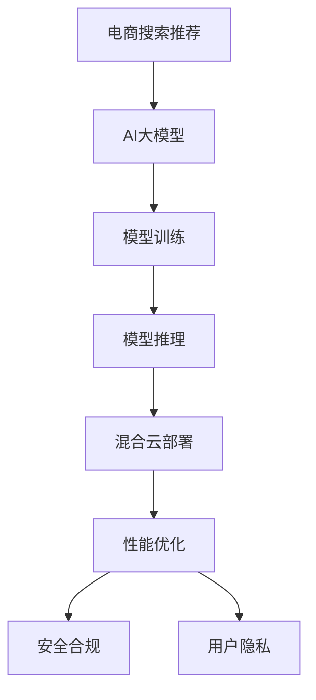

                 

# 电商搜索推荐场景下的AI大模型模型部署混合云实践案例分析与优化方案

> 关键词：电商搜索推荐, 大模型, AI, 混合云, 模型部署, 实践案例, 优化方案

## 1. 背景介绍

随着电商业务的快速发展，用户搜索推荐系统的精准度和个性化程度日益成为电商用户满意度提升的关键。传统推荐系统依赖于手工设计的规则和人工特征提取，难以应对大规模、高维度的用户行为数据。近年来，人工智能大模型，尤其是基于Transformer的模型，如BERT、GPT等，在电商搜索推荐领域得到了广泛应用。然而，这些大模型需要大量的计算资源和存储资源，单一数据中心的部署方式面临着算力不足和扩展性受限的问题。同时，电商搜索推荐系统还面临着数据隐私、安全性、实时性等挑战。为了应对这些挑战，混合云模式成为了一种重要解决方案。

本文档将通过分析电商搜索推荐场景下的AI大模型部署实践案例，探讨混合云模式的应用优势，提出一套高效的模型部署与优化方案，以期为电商企业提供有价值的参考和借鉴。

## 2. 核心概念与联系

### 2.1 核心概念概述

电商搜索推荐系统的AI大模型部署，核心在于如何在大规模数据上训练高性能的推荐模型，并实现高效的推理计算和在线服务。为理解这一过程，本节将介绍几个关键概念：

- **电商搜索推荐**：指在电商平台上，通过用户行为数据预测用户可能感兴趣的商品或服务，推荐给用户的一种技术手段。
- **AI大模型**：基于深度学习的大规模神经网络模型，如BERT、GPT等，能够从大规模数据中学习到丰富的知识，应用于自然语言处理、计算机视觉、推荐系统等领域。
- **混合云**：将企业应用和数据分布在多个云平台，以充分利用各平台的优势，实现资源的最优配置和应用的灵活扩展。
- **模型部署**：将训练好的模型迁移到线上服务，供实时请求使用，通常需要考虑模型的推理速度、资源消耗等问题。
- **优化方案**：针对模型部署中的性能瓶颈、资源消耗等问题，提出的一系列技术改进方案，以提升模型服务的质量与效率。

### 2.2 核心概念原理和架构的 Mermaid 流程图



这个流程图展示了电商搜索推荐场景下，AI大模型的部署流程和优化方案：

1. 电商搜索推荐系统收集用户行为数据，用于训练AI大模型。
2. AI大模型通过大规模无监督学习或监督学习，学习到商品之间的关联关系和用户行为特征。
3. 训练好的模型部署到线上服务，供实时请求使用。
4. 线上服务在混合云环境下运行，利用各云平台的优势，优化模型性能和资源消耗。
5. 针对模型推理速度、资源消耗等性能瓶颈，提出一系列优化方案，如模型裁剪、量化加速等。
6. 保证模型部署过程中的安全合规和用户隐私保护。

## 3. 核心算法原理 & 具体操作步骤

### 3.1 算法原理概述

电商搜索推荐系统中的AI大模型，通常基于自回归模型（如GPT）或自编码模型（如BERT）。以自回归模型为例，模型的主要目标是预测下一个单词或下一个商品的标签。模型的输入通常包括用户的历史行为、商品特征、时间戳等。模型的输出是一个概率分布，表示每个可能的结果出现的概率。

在训练阶段，模型通过最大似然估计或交叉熵损失函数，优化模型参数。在推理阶段，模型根据输入数据，计算输出概率分布，并根据一定的策略（如最大似然、softmax）选择最优的结果。

### 3.2 算法步骤详解

电商搜索推荐系统中的AI大模型部署，主要包括以下几个关键步骤：

**Step 1: 数据准备**

1. 收集用户行为数据，包括浏览、点击、购买等行为。
2. 收集商品数据，包括商品属性、类别、价格等。
3. 清洗数据，去除噪声和异常值，保证数据质量。
4. 对数据进行划分，分为训练集、验证集和测试集。

**Step 2: 模型训练**

1. 选择合适的AI大模型框架，如TensorFlow、PyTorch等。
2. 构建模型架构，设计输入、输出和隐藏层等组件。
3. 定义损失函数，如交叉熵损失、余弦相似度损失等。
4. 设置优化器，如AdamW、SGD等，并设置学习率、批大小、迭代轮数等。
5. 使用GPU/TPU等高性能计算设备，进行模型训练。

**Step 3: 模型推理**

1. 将训练好的模型迁移到线上服务，如AWS、阿里云等。
2. 在混合云环境中部署模型，如AWS Lambda、阿里云函数计算等。
3. 针对不同云平台，优化模型推理速度和资源消耗。
4. 对模型推理过程进行监控和日志记录，以便后续优化。

**Step 4: 性能优化**

1. 对模型进行裁剪，去除不必要的层和参数。
2. 使用量化技术，将浮点模型转换为定点模型，减小内存消耗。
3. 使用模型并行和分布式计算，提升推理速度。
4. 对推理过程进行优化，如预计算、延迟加载等。

**Step 5: 安全合规**

1. 对模型部署进行安全合规检查，保证数据和模型的安全。
2. 对模型访问进行鉴权和授权，防止未经授权的访问。
3. 对模型输出进行脱敏和差分隐私处理，保护用户隐私。

### 3.3 算法优缺点

电商搜索推荐系统中的AI大模型部署，具有以下优点：

1. 基于大模型的推荐系统，能够从大规模数据中学习到更丰富的知识，提升推荐精度和个性化程度。
2. 混合云模式，能够充分利用各云平台的优势，优化资源配置和应用扩展。
3. 模型裁剪和量化技术，能够减小模型规模和计算消耗，提升推理速度。

同时，该方法也存在一定的局限性：

1. 大模型训练需要大量的计算资源和存储资源，单数据中心的部署方式可能面临算力不足的问题。
2. 模型推理计算密集，实时性要求高，混合云环境下的性能优化挑战较大。
3. 数据隐私和安全问题，需要在模型部署和推理过程中进行严格保护。

尽管存在这些局限性，但混合云模式和优化方案的应用，将有效提升电商搜索推荐系统的性能和稳定性。

### 3.4 算法应用领域

AI大模型在电商搜索推荐中的应用，主要体现在以下几个方面：

1. **商品推荐**：基于用户历史行为和商品特征，预测用户可能感兴趣的商品，提升用户满意度。
2. **搜索排序**：根据用户查询和商品特征，排序搜索结果，提升搜索效果。
3. **广告推荐**：基于用户行为数据和广告特征，推荐合适的广告，提升广告效果和广告收益。
4. **个性化推荐**：根据用户画像和行为特征，定制个性化的推荐方案，提升用户粘性和转化率。
5. **实时计算**：基于实时用户数据和商品数据，计算推荐结果，提升推荐系统的时效性和准确性。

## 4. 数学模型和公式 & 详细讲解 & 举例说明

### 4.1 数学模型构建

电商搜索推荐系统中的AI大模型，通常采用自回归模型，如GPT-2。模型的输入为$x_t$，表示用户在第$t$时刻的行为数据，模型的输出为$\hat{y_t}$，表示用户可能感兴趣的商品。模型的目标是最小化预测误差$\epsilon_t$，即：

$$
\min_{\theta} \sum_{t=1}^T \epsilon_t
$$

其中，$\epsilon_t$表示模型预测误差，可以通过均方误差（MSE）或交叉熵（CE）等损失函数来衡量。

### 4.2 公式推导过程

以均方误差损失函数为例，推导模型的训练目标。假设模型输出为$\hat{y_t}$，真实标签为$y_t$，则均方误差损失函数为：

$$
\ell(\hat{y_t}, y_t) = \frac{1}{2}(\hat{y_t} - y_t)^2
$$

模型训练的目标是使均方误差最小化，即：

$$
\min_{\theta} \frac{1}{N} \sum_{t=1}^N \ell(\hat{y_t}, y_t)
$$

模型的输出$\hat{y_t}$可以通过前向传播计算得到：

$$
\hat{y_t} = f_{\theta}(x_t)
$$

其中$f_{\theta}(\cdot)$表示模型的前向传播函数。通过反向传播算法，计算模型参数$\theta$的梯度，并使用优化器进行参数更新，完成模型的训练过程。

### 4.3 案例分析与讲解

假设电商平台收集了用户的历史行为数据$x_t$，包括浏览历史、点击历史、购买历史等。平台还收集了商品数据$y_t$，包括商品属性、类别、价格等。模型的输入为$x_t$，输出为$\hat{y_t}$，目标是最小化均方误差损失$\ell(\hat{y_t}, y_t)$。

模型的前向传播函数为：

$$
\hat{y_t} = f_{\theta}(x_t)
$$

其中$f_{\theta}(\cdot)$表示模型的前向传播函数，包括多层神经网络、注意力机制等组件。

通过反向传播算法，计算模型参数$\theta$的梯度，并使用优化器（如AdamW）进行参数更新，完成模型的训练过程：

$$
\theta \leftarrow \theta - \eta \nabla_{\theta} \ell(\hat{y_t}, y_t)
$$

其中$\eta$表示学习率。

在模型推理阶段，输入新的用户行为数据$x_t$，计算输出$\hat{y_t}$，选择$\hat{y_t}$中概率最大的商品作为推荐结果。

## 5. 项目实践：代码实例和详细解释说明

### 5.1 开发环境搭建

电商搜索推荐系统中的AI大模型部署，需要构建一个高效、稳定的开发环境。以下是详细的开发环境搭建步骤：

1. 安装Docker容器：Docker容器化技术可以方便地进行模型部署和管理。
2. 安装Kubernetes集群：Kubernetes集群提供自动化的应用部署、扩展和管理功能。
3. 配置混合云环境：配置AWS、阿里云等云平台，提供高性能计算资源。
4. 搭建开发环境：使用Python、TensorFlow等工具，搭建模型训练和推理环境。

### 5.2 源代码详细实现

以下是使用TensorFlow进行电商搜索推荐系统中的AI大模型部署的代码实现：

```python
import tensorflow as tf
from tensorflow.keras import layers, models

# 构建模型
model = models.Sequential([
    layers.Dense(256, activation='relu'),
    layers.Dense(128, activation='relu'),
    layers.Dense(1, activation='sigmoid')
])

# 编译模型
model.compile(optimizer='adam', loss='binary_crossentropy', metrics=['accuracy'])

# 训练模型
model.fit(train_data, train_labels, epochs=10, validation_data=(val_data, val_labels))

# 保存模型
model.save('recommendation_model.h5')

# 加载模型
loaded_model = tf.keras.models.load_model('recommendation_model.h5')

# 模型推理
test_data = load_test_data()
predictions = loaded_model.predict(test_data)
```

### 5.3 代码解读与分析

上述代码实现了基于TensorFlow的电商搜索推荐系统中的AI大模型的训练和推理。具体分析如下：

1. 模型构建：模型由多个全连接层组成，最后一层为二分类输出层，使用Sigmoid激活函数。
2. 模型编译：使用Adam优化器，交叉熵损失函数，评估指标为准确率。
3. 模型训练：使用训练数据集和验证数据集，进行模型训练，迭代10次。
4. 模型保存：使用H5格式保存训练好的模型。
5. 模型加载：加载保存的模型，进行推理计算。
6. 模型推理：使用测试数据集，计算推荐结果。

## 6. 实际应用场景

### 6.1 商品推荐

电商搜索推荐系统中的AI大模型，可以用于商品推荐，帮助用户发现感兴趣的商品。以下是具体的部署流程和优化方案：

**部署流程：**

1. 收集用户行为数据，包括浏览、点击、购买等行为。
2. 收集商品数据，包括商品属性、类别、价格等。
3. 将数据集划分为训练集、验证集和测试集。
4. 使用TensorFlow等工具，训练AI大模型。
5. 将训练好的模型部署到AWS、阿里云等云平台，进行实时推理计算。
6. 使用Kubernetes集群，自动扩展和管理模型服务。

**优化方案：**

1. 模型裁剪：去除不必要的层和参数，减小模型规模和计算消耗。
2. 量化加速：将浮点模型转换为定点模型，减小内存消耗和推理计算速度。
3. 模型并行：使用GPU/TPU等高性能计算设备，提升推理速度。
4. 缓存优化：使用缓存技术，减少数据读取和计算时间。

### 6.2 搜索排序

电商搜索推荐系统中的AI大模型，可以用于搜索排序，帮助用户快速找到感兴趣的商品。以下是具体的部署流程和优化方案：

**部署流程：**

1. 收集用户查询数据，包括关键词、搜索历史等。
2. 收集商品数据，包括商品属性、类别、价格等。
3. 将数据集划分为训练集、验证集和测试集。
4. 使用TensorFlow等工具，训练AI大模型。
5. 将训练好的模型部署到AWS、阿里云等云平台，进行实时推理计算。
6. 使用Kubernetes集群，自动扩展和管理模型服务。

**优化方案：**

1. 模型裁剪：去除不必要的层和参数，减小模型规模和计算消耗。
2. 量化加速：将浮点模型转换为定点模型，减小内存消耗和推理计算速度。
3. 模型并行：使用GPU/TPU等高性能计算设备，提升推理速度。
4. 缓存优化：使用缓存技术，减少数据读取和计算时间。
5. 实时计算：使用流式计算和实时计算技术，提升搜索排序的时效性和准确性。

### 6.3 广告推荐

电商搜索推荐系统中的AI大模型，可以用于广告推荐，帮助广告主精准投放广告，提升广告效果和收益。以下是具体的部署流程和优化方案：

**部署流程：**

1. 收集用户行为数据，包括浏览、点击、购买等行为。
2. 收集广告数据，包括广告属性、展示位置等。
3. 将数据集划分为训练集、验证集和测试集。
4. 使用TensorFlow等工具，训练AI大模型。
5. 将训练好的模型部署到AWS、阿里云等云平台，进行实时推理计算。
6. 使用Kubernetes集群，自动扩展和管理模型服务。

**优化方案：**

1. 模型裁剪：去除不必要的层和参数，减小模型规模和计算消耗。
2. 量化加速：将浮点模型转换为定点模型，减小内存消耗和推理计算速度。
3. 模型并行：使用GPU/TPU等高性能计算设备，提升推理速度。
4. 缓存优化：使用缓存技术，减少数据读取和计算时间。
5. 实时计算：使用流式计算和实时计算技术，提升广告推荐的时效性和准确性。

### 6.4 个性化推荐

电商搜索推荐系统中的AI大模型，可以用于个性化推荐，帮助用户发现感兴趣的商品，提升用户粘性和转化率。以下是具体的部署流程和优化方案：

**部署流程：**

1. 收集用户画像数据，包括人口统计、兴趣偏好等。
2. 收集商品数据，包括商品属性、类别、价格等。
3. 将数据集划分为训练集、验证集和测试集。
4. 使用TensorFlow等工具，训练AI大模型。
5. 将训练好的模型部署到AWS、阿里云等云平台，进行实时推理计算。
6. 使用Kubernetes集群，自动扩展和管理模型服务。

**优化方案：**

1. 模型裁剪：去除不必要的层和参数，减小模型规模和计算消耗。
2. 量化加速：将浮点模型转换为定点模型，减小内存消耗和推理计算速度。
3. 模型并行：使用GPU/TPU等高性能计算设备，提升推理速度。
4. 缓存优化：使用缓存技术，减少数据读取和计算时间。
5. 实时计算：使用流式计算和实时计算技术，提升个性化推荐的实效性和准确性。

## 7. 工具和资源推荐

### 7.1 学习资源推荐

为帮助开发者掌握电商搜索推荐系统中的AI大模型部署技术，以下是一些优质的学习资源：

1. **TensorFlow官方文档**：TensorFlow作为AI大模型部署的重要工具，官方文档提供了全面的教程和API参考。
2. **Kubernetes官方文档**：Kubernetes作为混合云环境中的容器编排工具，官方文档提供了详细的配置和使用指南。
3. **AWS文档和教程**：AWS提供了丰富的云服务文档和教程，帮助开发者快速上手AWS云平台。
4. **阿里云文档和教程**：阿里云提供了详细的云服务文档和教程，帮助开发者快速上手阿里云云平台。
5. **《深度学习实战》系列书籍**：系统介绍了深度学习模型的构建、训练、部署等全流程，适合新手入门。

### 7.2 开发工具推荐

为提高电商搜索推荐系统中的AI大模型部署效率，以下是一些推荐的开发工具：

1. **TensorFlow**：基于数据流的计算框架，适合构建复杂模型和进行大规模计算。
2. **Keras**：高层次的API，适合快速搭建和训练模型。
3. **PyTorch**：基于动态计算图的框架，适合进行模型优化和推理加速。
4. **Jupyter Notebook**：交互式的笔记本环境，方便进行代码测试和调试。
5. **AWS Lambda**：无服务器函数计算平台，方便进行模型推理和在线服务。

### 7.3 相关论文推荐

电商搜索推荐系统中的AI大模型部署，涉及大量的理论和实践问题。以下是一些相关论文推荐：

1. **《Neural Information Processing Systems (NeurIPS) 2020》**：详细介绍了深度学习模型在推荐系统中的应用。
2. **《IEEE Transactions on Systems, Man, and Cybernetics: Systems》**：介绍了混合云环境下的推荐系统设计和部署。
3. **《Proceedings of the International Conference on Machine Learning (ICML)》**：介绍了推荐系统中的实时计算和流式计算技术。

## 8. 总结：未来发展趋势与挑战

### 8.1 研究成果总结

电商搜索推荐系统中的AI大模型部署，通过混合云模式和大模型训练技术，显著提升了推荐系统的性能和用户体验。主要研究成果包括：

1. 基于大模型的推荐系统，能够从大规模数据中学习到更丰富的知识，提升推荐精度和个性化程度。
2. 混合云模式，能够充分利用各云平台的优势，优化资源配置和应用扩展。
3. 模型裁剪和量化技术，能够减小模型规模和计算消耗，提升推理速度。

### 8.2 未来发展趋势

展望未来，电商搜索推荐系统中的AI大模型部署将呈现以下几个发展趋势：

1. **多模态融合**：将文本、图像、语音等多种数据源进行融合，提升推荐系统的准确性和泛化能力。
2. **实时计算**：使用流式计算和实时计算技术，提升推荐系统的时效性和响应速度。
3. **联邦学习**：利用分布式计算和数据加密技术，保护用户隐私和数据安全。
4. **自适应模型**：使用自适应算法和在线学习技术，动态调整模型参数，提升推荐系统的适应性和稳定性。

### 8.3 面临的挑战

电商搜索推荐系统中的AI大模型部署，在提升性能的同时，也面临着诸多挑战：

1. **计算资源瓶颈**：大模型训练和推理计算密集，需要高性能的计算资源。
2. **数据隐私和安全**：用户数据和模型输出需要严格保护，防止数据泄露和滥用。
3. **实时性要求高**：推荐系统需要实时响应用户请求，对计算效率和延迟有较高要求。
4. **模型优化复杂**：模型裁剪、量化和并行等优化技术，需要综合考虑模型性能和资源消耗。

尽管存在这些挑战，但混合云模式和大模型部署技术的应用，将有效提升电商搜索推荐系统的性能和用户体验。未来，需要在模型优化、计算资源配置、数据隐私保护等方面进行深入研究，推动技术的不断进步。

### 8.4 研究展望

面向未来，电商搜索推荐系统中的AI大模型部署，需要在以下几个方面进行深入研究：

1. **模型优化技术**：研究更加高效的模型裁剪、量化和并行技术，提升模型的性能和推理速度。
2. **实时计算技术**：研究流式计算和实时计算技术，提升推荐系统的时效性和响应速度。
3. **联邦学习技术**：研究分布式计算和数据加密技术，保护用户隐私和数据安全。
4. **自适应算法**：研究自适应算法和在线学习技术，动态调整模型参数，提升推荐系统的适应性和稳定性。
5. **跨领域应用**：将推荐系统中的大模型部署技术，应用于更多领域，如金融、医疗等，推动人工智能技术的全面落地。

## 9. 附录：常见问题与解答

### Q1: 电商搜索推荐系统中的AI大模型部署，主要面临哪些挑战？

A: 电商搜索推荐系统中的AI大模型部署，主要面临以下几个挑战：

1. **计算资源瓶颈**：大模型训练和推理计算密集，需要高性能的计算资源。
2. **数据隐私和安全**：用户数据和模型输出需要严格保护，防止数据泄露和滥用。
3. **实时性要求高**：推荐系统需要实时响应用户请求，对计算效率和延迟有较高要求。
4. **模型优化复杂**：模型裁剪、量化和并行等优化技术，需要综合考虑模型性能和资源消耗。

### Q2: 电商搜索推荐系统中的AI大模型部署，有哪些优化方案？

A: 电商搜索推荐系统中的AI大模型部署，有以下优化方案：

1. **模型裁剪**：去除不必要的层和参数，减小模型规模和计算消耗。
2. **量化加速**：将浮点模型转换为定点模型，减小内存消耗和推理计算速度。
3. **模型并行**：使用GPU/TPU等高性能计算设备，提升推理速度。
4. **缓存优化**：使用缓存技术，减少数据读取和计算时间。
5. **实时计算**：使用流式计算和实时计算技术，提升推荐系统的时效性和响应速度。

### Q3: 电商搜索推荐系统中的AI大模型部署，如何选择云平台？

A: 电商搜索推荐系统中的AI大模型部署，选择云平台需要考虑以下几个因素：

1. **计算资源**：评估云平台的计算资源是否满足大模型训练和推理的需求。
2. **数据安全**：评估云平台的数据安全和隐私保护措施，是否满足法律法规要求。
3. **成本预算**：评估云平台的费用模型，是否满足企业预算和成本控制要求。
4. **性能指标**：评估云平台的性能指标，如计算速度、延迟、扩展性等，是否满足应用需求。
5. **支持生态**：评估云平台提供的开发工具、API接口、社区支持等，是否方便开发和应用。

### Q4: 电商搜索推荐系统中的AI大模型部署，如何进行模型优化？

A: 电商搜索推荐系统中的AI大模型部署，进行模型优化可以从以下几个方面入手：

1. **模型裁剪**：去除不必要的层和参数，减小模型规模和计算消耗。
2. **量化加速**：将浮点模型转换为定点模型，减小内存消耗和推理计算速度。
3. **模型并行**：使用GPU/TPU等高性能计算设备，提升推理速度。
4. **缓存优化**：使用缓存技术，减少数据读取和计算时间。
5. **实时计算**：使用流式计算和实时计算技术，提升推荐系统的时效性和响应速度。

### Q5: 电商搜索推荐系统中的AI大模型部署，如何进行数据隐私保护？

A: 电商搜索推荐系统中的AI大模型部署，进行数据隐私保护可以从以下几个方面入手：

1. **数据脱敏**：对用户数据进行脱敏处理，防止敏感信息泄露。
2. **差分隐私**：使用差分隐私技术，对数据进行扰动处理，保护用户隐私。
3. **访问控制**：对模型访问进行鉴权和授权，防止未经授权的访问。
4. **数据加密**：对数据进行加密处理，防止数据泄露。
5. **安全审计**：对模型部署和推理过程进行安全审计，发现和修复安全漏洞。

通过以上分析，可以看出，电商搜索推荐系统中的AI大模型部署，需要综合考虑模型优化、数据隐私保护、实时计算等多个因素，才能实现高性能、高安全、高可靠的系统构建。

