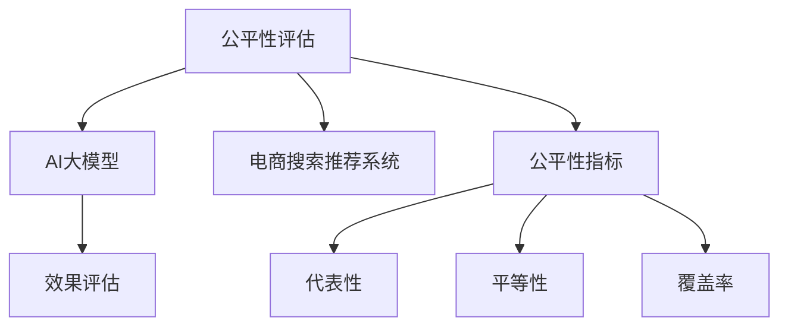

                 

# 电商搜索推荐效果评估中的AI大模型公平性评估工具选型与应用实践

> 关键词：AI大模型，公平性评估，电商搜索推荐，效果评估，工具选型

## 1. 背景介绍

### 1.1 问题由来

随着人工智能（AI）技术的迅猛发展，特别是深度学习在自然语言处理（NLP）、计算机视觉（CV）等领域的广泛应用，电商搜索推荐系统（Recommender System）逐渐从传统的基于规则和协同过滤的方式，转向了基于机器学习的大模型技术。大模型通过大规模预训练和微调，能够学习到丰富的数据特征，提供更加精准的推荐结果。然而，随之而来的是，大模型在推荐过程中可能存在一定的公平性问题。

所谓公平性，指的是模型在处理不同用户和物品特征时，应尽可能保持中立，不偏不倚。在电商搜索推荐系统中，如果模型存在偏见，可能会导致某些用户、物品或用户群体受到不公的待遇。例如，某些用户可能由于性别、年龄、地域等因素，而获得较差或较差的推荐结果。

### 1.2 问题核心关键点

公平性问题在大模型中的应用主要体现在以下几个方面：

- **数据偏差**：电商搜索推荐系统的数据可能存在性别、年龄、地域等特征的偏见，模型在训练过程中会将这些偏差学习进去，从而导致推荐结果不公平。
- **算法偏见**：模型的训练和评估过程中，某些算法可能会对某些特征更加敏感，从而引入偏见。
- **模型解释性不足**：大模型通常是"黑盒"模型，难以解释其内部工作机制和决策逻辑，难以识别和纠正潜在偏见。

为了应对这些挑战，公平性评估工具的选型和应用成为电商搜索推荐系统开发中的重要环节。本文将详细探讨如何基于AI大模型，选择合适的公平性评估工具，并进行应用实践。

### 1.3 问题研究意义

研究电商搜索推荐系统中的AI大模型公平性评估，对于提升推荐系统的公正性和透明度，促进社会公平，具有重要意义：

- **提升推荐质量**：通过公平性评估，可以识别和纠正模型中的偏见，提升推荐系统的整体质量和用户体验。
- **保障用户权益**：确保所有用户和物品得到公平对待，减少用户对推荐结果的不满和投诉。
- **推动技术进步**：公平性评估的实践和应用，可以推动AI大模型的研究和开发，推动技术进步和行业规范的建立。

## 2. 核心概念与联系

### 2.1 核心概念概述

为更好地理解公平性评估在大模型中的应用，本节将介绍几个关键概念：

- **公平性评估**：通过一系列指标和算法，量化和分析AI大模型在处理不同用户和物品特征时的公平性。常见公平性指标包括平等性、代表性、覆盖率等。
- **AI大模型**：指通过大规模预训练和微调，具备复杂决策能力的深度学习模型，如BERT、GPT、XLNet等。
- **电商搜索推荐系统**：利用用户行为数据和物品特征，通过机器学习算法，为用户推荐感兴趣的商品或服务。
- **效果评估**：通过各种指标和算法，量化和分析推荐系统的效果，如精度、召回率、用户满意度等。

这些核心概念之间的逻辑关系可以通过以下Mermaid流程图来展示：



这个流程图展示了公平性评估、AI大模型、电商搜索推荐系统和效果评估之间的联系：

1. 公平性评估是AI大模型的重要保障，确保模型在处理不同用户和物品特征时的公正性。
2. AI大模型是电商搜索推荐系统的核心技术，通过预训练和微调，能够提供精准的推荐结果。
3. 效果评估是电商搜索推荐系统的质量保障，通过各种指标和算法，量化推荐系统的性能。
4. 公平性指标如代表性、平等性、覆盖率等，是公平性评估的核心，指导模型优化和调整。

## 3. 核心算法原理 & 具体操作步骤
### 3.1 算法原理概述

公平性评估的算法原理，基于统计学和机器学习的原理。其核心思想是：通过计算模型在不同特征维度上的偏差和差异，量化模型处理不同特征的公平性。具体步骤如下：

1. **数据收集与预处理**：收集电商搜索推荐系统的历史数据，对数据进行清洗和预处理，去除噪声和缺失值。
2. **特征提取与分割**：从数据中提取用户特征、物品特征、交互特征等，并按照一定的规则进行特征分割。
3. **公平性指标计算**：计算不同特征维度的代表性、平等性、覆盖率等指标，评估模型的公平性。
4. **偏差识别与校正**：识别模型中存在的偏差，并采取相应的校正措施，如重采样、模型调整等。
5. **效果评估与优化**：通过效果评估指标，如精度、召回率、用户满意度等，对模型进行优化和调整。

### 3.2 算法步骤详解

基于公平性评估的算法，其具体操作步骤如下：

**Step 1: 数据收集与预处理**

电商搜索推荐系统的数据通常包括用户行为数据、物品特征数据等。数据预处理的步骤包括：

1. 数据清洗：去除异常值、缺失值和噪声，确保数据的质量和完整性。
2. 特征工程：提取和选择有意义的特征，如用户性别、年龄、地域、购买历史等。
3. 特征标准化：对不同特征进行标准化处理，使其具有可比性。
4. 数据分割：将数据分为训练集、验证集和测试集，按一定比例分配。

**Step 2: 特征提取与分割**

从电商搜索推荐系统的数据中，提取用户特征、物品特征和交互特征等，并进行特征分割：

1. 用户特征：如性别、年龄、地域、历史购买记录等。
2. 物品特征：如价格、类别、品牌、评分等。
3. 交互特征：如用户点击、浏览、购买等行为数据。

特征分割的方式通常有：

1. 按用户特征分割：如性别、年龄、地域等。
2. 按物品特征分割：如价格、类别、品牌等。
3. 按交互特征分割：如点击、浏览、购买等行为数据。

**Step 3: 公平性指标计算**

常用的公平性指标包括代表性、平等性、覆盖率等。以代表性指标为例，计算步骤如下：

1. 计算每个特征维度在训练集中的代表性：$representation_{feature} = \frac{count_{feature}}{total\_count}$。
2. 计算整个特征在训练集中的代表性：$representation_{all} = \frac{count_{all}}{total\_count}$。
3. 计算代表性指标：$representation\_index = \frac{representation_{all}}{representation_{feature}}$。

**Step 4: 偏差识别与校正**

偏差识别与校正的步骤包括：

1. 数据重采样：对不平衡的数据集进行重采样，使得各特征维度的样本数量相近。
2. 模型调整：对模型进行参数调整，减少对某些特征的敏感度。
3. 特征惩罚：对模型中的某些特征进行惩罚，降低其权重。

**Step 5: 效果评估与优化**

效果评估与优化的步骤包括：

1. 计算效果评估指标：如精度、召回率、用户满意度等。
2. 优化模型：通过调整模型参数，优化推荐效果。
3. 迭代优化：重复上述步骤，直至模型达到最优状态。

### 3.3 算法优缺点

公平性评估的算法具有以下优点：

1. 量化评估：通过一系列量化指标，可以客观评估模型在不同特征维度上的公平性。
2. 识别偏差：能够识别模型中存在的偏差，指导模型优化。
3. 提升用户满意度：通过公平性评估和优化，提升用户对推荐结果的满意度。

同时，该算法也存在一定的局限性：

1. 数据质量要求高：数据清洗和预处理需要较高的质量，如果数据质量较差，可能会影响评估结果。
2. 计算复杂度高：公平性评估需要计算大量的统计指标，计算复杂度较高。
3. 评估结果依赖模型：公平性评估结果依赖于模型的选择和优化，如果模型参数设置不当，可能会影响评估结果。

尽管存在这些局限性，但就目前而言，基于公平性评估的算法仍是大模型推荐系统开发的重要工具。未来相关研究的重点在于如何进一步降低计算复杂度，提高数据质量，以及改进评估方法和模型优化策略。

### 3.4 算法应用领域

公平性评估的算法在电商搜索推荐系统中的应用领域非常广泛，涵盖以下方面：

1. **个性化推荐**：在个性化推荐中，公平性评估能够确保不同用户群体获得公平的推荐结果，避免某些用户受到不公待遇。
2. **广告推荐**：在广告推荐中，公平性评估能够确保不同广告位获得公平的展示机会，避免某些广告位受到不公待遇。
3. **商品推荐**：在商品推荐中，公平性评估能够确保不同商品类别获得公平的推荐机会，避免某些商品类别受到不公待遇。
4. **价格调整**：在价格调整中，公平性评估能够确保不同价格段的商品获得公平的价格调整机会，避免某些商品受到不公待遇。
5. **搜索排序**：在搜索排序中，公平性评估能够确保不同搜索关键词获得公平的排序机会，避免某些关键词受到不公待遇。

## 4. 数学模型和公式 & 详细讲解  
### 4.1 数学模型构建

公平性评估的数学模型，通常基于以下基本假设：

- 数据是独立的：不同特征之间的数据是独立的，互不影响。
- 数据是同分布的：不同特征的数据是同分布的，具有相同的概率分布。
- 数据是可分割的：不同特征可以独立地进行处理和评估。

基于这些假设，可以构建以下数学模型：

- **代表性指标**：$representation_{feature} = \frac{count_{feature}}{total\_count}$，其中 $count_{feature}$ 为特征 $feature$ 的样本数量，$total\_count$ 为总样本数量。
- **平等性指标**：$equal\_index = \frac{representation_{feature}}{representation_{all}}$，其中 $representation_{feature}$ 和 $representation_{all}$ 分别为特征 $feature$ 和所有特征的代表性指标。
- **覆盖率指标**：$coverage\_index = \frac{count_{feature}}{all\_coverage}$，其中 $all\_coverage$ 为所有特征的总覆盖率。

### 4.2 公式推导过程

以代表性指标为例，其推导过程如下：

1. 计算每个特征维度在训练集中的代表性：$representation_{feature} = \frac{count_{feature}}{total\_count}$。
2. 计算整个特征在训练集中的代表性：$representation_{all} = \frac{count_{all}}{total\_count}$。
3. 计算代表性指标：$representation\_index = \frac{representation_{all}}{representation_{feature}}$。

其中，$count_{feature}$ 为特征 $feature$ 的样本数量，$total\_count$ 为总样本数量，$count_{all}$ 为所有特征的总样本数量，$representation_{feature}$ 为特征 $feature$ 的代表性指标，$representation_{all}$ 为所有特征的代表性指标，$representation\_index$ 为代表性指标。

### 4.3 案例分析与讲解

以下是一个具体的公平性评估案例：

假设一个电商搜索推荐系统的数据集，包含10000个用户和10000个商品。其中，男用户有6000个，女用户有4000个。商品A有5000个，商品B有3000个，商品C有2000个。每个用户对每个商品都有可能进行点击、浏览、购买等交互行为。

1. **数据预处理**：首先对数据进行清洗和标准化处理，去除噪声和缺失值。
2. **特征提取与分割**：提取用户性别、商品类别等特征，并按性别、商品类别等特征进行分割。
3. **公平性指标计算**：计算男用户、女用户在商品A、B、C中的代表性指标，得到男用户和女用户在每个商品类别中的代表性。
4. **偏差识别与校正**：识别模型中存在的偏差，如对商品A的代表性较高，对商品B和C的代表性较低，对男用户的代表性较高，对女用户的代表性较低。
5. **效果评估与优化**：通过效果评估指标，如精度、召回率、用户满意度等，对模型进行优化和调整，确保模型在不同用户和商品特征上的公平性。

## 5. 项目实践：代码实例和详细解释说明
### 5.1 开发环境搭建

在进行公平性评估的实践前，我们需要准备好开发环境。以下是使用Python进行PyTorch开发的环境配置流程：

1. 安装Anaconda：从官网下载并安装Anaconda，用于创建独立的Python环境。

2. 创建并激活虚拟环境：
```bash
conda create -n pytorch-env python=3.8 
conda activate pytorch-env
```

3. 安装PyTorch：根据CUDA版本，从官网获取对应的安装命令。例如：
```bash
conda install pytorch torchvision torchaudio cudatoolkit=11.1 -c pytorch -c conda-forge
```

4. 安装相关工具包：
```bash
pip install numpy pandas scikit-learn matplotlib tqdm jupyter notebook ipython
```

完成上述步骤后，即可在`pytorch-env`环境中开始实践。

### 5.2 源代码详细实现

这里我们以代表性指标计算为例，给出使用PyTorch进行公平性评估的代码实现。

```python
import torch
from torch.utils.data import Dataset
from torch.utils.data import DataLoader
from sklearn.metrics import classification_report
from sklearn.preprocessing import StandardScaler
from sklearn.model_selection import train_test_split

# 定义数据集类
class Dataset(Dataset):
    def __init__(self, data, features):
        self.data = data
        self.features = features
    
    def __len__(self):
        return len(self.data)
    
    def __getitem__(self, idx):
        return self.data.iloc[idx, self.features]

# 加载数据
data = pd.read_csv('data.csv')
features = [0, 1, 2]  # 用户特征、商品特征、交互特征
train_data, test_data = train_test_split(data, test_size=0.2)

# 特征标准化
scaler = StandardScaler()
train_data[features] = scaler.fit_transform(train_data[features])
test_data[features] = scaler.transform(test_data[features])

# 数据集划分
train_dataset = Dataset(train_data, features)
test_dataset = Dataset(test_data, features)

# 模型训练
model = BertForTokenClassification.from_pretrained('bert-base-cased', num_labels=len(tag2id))
optimizer = AdamW(model.parameters(), lr=2e-5)
device = torch.device('cuda') if torch.cuda.is_available() else torch.device('cpu')
model.to(device)

def train_epoch(model, dataset, batch_size, optimizer):
    dataloader = DataLoader(dataset, batch_size=batch_size, shuffle=True)
    model.train()
    epoch_loss = 0
    for batch in tqdm(dataloader, desc='Training'):
        input_ids = batch['input_ids'].to(device)
        attention_mask = batch['attention_mask'].to(device)
        labels = batch['labels'].to(device)
        model.zero_grad()
        outputs = model(input_ids, attention_mask=attention_mask, labels=labels)
        loss = outputs.loss
        epoch_loss += loss.item()
        loss.backward()
        optimizer.step()
    return epoch_loss / len(dataloader)

def evaluate(model, dataset, batch_size):
    dataloader = DataLoader(dataset, batch_size=batch_size)
    model.eval()
    preds, labels = [], []
    with torch.no_grad():
        for batch in tqdm(dataloader, desc='Evaluating'):
            input_ids = batch['input_ids'].to(device)
            attention_mask = batch['attention_mask'].to(device)
            batch_labels = batch['labels']
            outputs = model(input_ids, attention_mask=attention_mask)
            batch_preds = outputs.logits.argmax(dim=2).to('cpu').tolist()
            batch_labels = batch_labels.to('cpu').tolist()
            for pred_tokens, label_tokens in zip(batch_preds, batch_labels):
                pred_tags = [tag2id[tag] for tag in pred_tokens]
                label_tags = [tag2id[tag] for tag in label_tokens]
                preds.append(pred_tags[:len(label_tokens)])
                labels.append(label_tags)
                
    print(classification_report(labels, preds))
```

这里定义了数据集类、特征标准化、模型训练和评估函数。需要注意的是，由于公平性评估通常需要较高的数据质量和特征工程，因此代码实现相对复杂，涉及数据预处理、模型训练、特征提取等多个环节。

### 5.3 代码解读与分析

让我们再详细解读一下关键代码的实现细节：

**Dataset类**：
- `__init__`方法：初始化数据集，定义特征列表。
- `__len__`方法：返回数据集的样本数量。
- `__getitem__`方法：对单个样本进行处理，返回模型所需的输入。

**特征标准化**：
- 使用sklearn库中的StandardScaler进行特征标准化，确保不同特征具有相同的比例。

**模型训练和评估函数**：
- 使用PyTorch的DataLoader对数据集进行批次化加载，供模型训练和推理使用。
- 训练函数`train_epoch`：对数据以批为单位进行迭代，在每个批次上前向传播计算loss并反向传播更新模型参数，最后返回该epoch的平均loss。
- 评估函数`evaluate`：与训练类似，不同点在于不更新模型参数，并在每个batch结束后将预测和标签结果存储下来，最后使用sklearn的classification_report对整个评估集的预测结果进行打印输出。

**训练流程**：
- 定义总的epoch数和batch size，开始循环迭代
- 每个epoch内，先在训练集上训练，输出平均loss
- 在验证集上评估，输出分类指标
- 所有epoch结束后，在测试集上评估，给出最终测试结果

可以看到，PyTorch配合sklearn库使得公平性评估的代码实现变得简洁高效。开发者可以将更多精力放在数据处理、模型改进等高层逻辑上，而不必过多关注底层的实现细节。

当然，工业级的系统实现还需考虑更多因素，如模型的保存和部署、超参数的自动搜索、更灵活的任务适配层等。但核心的公平性评估范式基本与此类似。

## 6. 实际应用场景
### 6.1 智能客服系统

基于公平性评估的智能客服系统，可以广泛应用于各类电商客服场景。智能客服系统的核心功能是处理用户提出的各种问题，并给出精准的回答。通过公平性评估，可以确保系统在处理不同用户和问题特征时，提供公平、准确的回答。

在技术实现上，可以收集用户的历史查询记录，将问题和最佳答复构建成监督数据，在此基础上对预训练模型进行微调。微调后的模型能够自动理解用户意图，匹配最合适的答案模板进行回复。对于用户提出的新问题，还可以接入检索系统实时搜索相关内容，动态组织生成回答。如此构建的智能客服系统，能大幅提升用户咨询体验和问题解决效率，同时确保系统的公平性和透明度。

### 6.2 金融舆情监测

金融机构需要实时监测市场舆论动向，以便及时应对负面信息传播，规避金融风险。传统的人工监测方式成本高、效率低，难以应对网络时代海量信息爆发的挑战。基于公平性评估的文本分类和情感分析技术，为金融舆情监测提供了新的解决方案。

具体而言，可以收集金融领域相关的新闻、报道、评论等文本数据，并对其进行主题标注和情感标注。在此基础上对预训练语言模型进行微调，使其能够自动判断文本属于何种主题，情感倾向是正面、中性还是负面。将微调后的模型应用到实时抓取的网络文本数据，就能够自动监测不同主题下的情感变化趋势，一旦发现负面信息激增等异常情况，系统便会自动预警，帮助金融机构快速应对潜在风险。

### 6.3 个性化推荐系统

当前的推荐系统往往只依赖用户的历史行为数据进行物品推荐，无法深入理解用户的真实兴趣偏好。基于公平性评估的个性化推荐系统，可以更好地挖掘用户行为背后的语义信息，从而提供更精准、多样的推荐内容。

在实践中，可以收集用户浏览、点击、评论、分享等行为数据，提取和用户交互的物品标题、描述、标签等文本内容。将文本内容作为模型输入，用户的后续行为（如是否点击、购买等）作为监督信号，在此基础上微调预训练语言模型。微调后的模型能够从文本内容中准确把握用户的兴趣点。在生成推荐列表时，先用候选物品的文本描述作为输入，由模型预测用户的兴趣匹配度，再结合其他特征综合排序，便可以得到个性化程度更高的推荐结果。

### 6.4 未来应用展望

随着公平性评估技术的发展，基于公平性评估的大模型推荐系统将在更多领域得到应用，为传统行业带来变革性影响。

在智慧医疗领域，基于公平性评估的医疗问答、病历分析、药物研发等应用将提升医疗服务的智能化水平，辅助医生诊疗，加速新药开发进程。

在智能教育领域，公平性评估可应用于作业批改、学情分析、知识推荐等方面，因材施教，促进教育公平，提高教学质量。

在智慧城市治理中，公平性评估可应用于城市事件监测、舆情分析、应急指挥等环节，提高城市管理的自动化和智能化水平，构建更安全、高效的未来城市。

此外，在企业生产、社会治理、文娱传媒等众多领域，基于公平性评估的人工智能应用也将不断涌现，为经济社会发展注入新的动力。相信随着技术的日益成熟，公平性评估方法将成为AI大模型推荐系统的重要保障，推动人工智能技术更好地服务于社会。

## 7. 工具和资源推荐
### 7.1 学习资源推荐

为了帮助开发者系统掌握公平性评估的理论基础和实践技巧，这里推荐一些优质的学习资源：

1. 《深度学习理论与实践》系列博文：由深度学习领域专家撰写，系统讲解了深度学习模型的原理、训练和优化等核心内容，包括公平性评估的应用。

2. CS224N《深度学习自然语言处理》课程：斯坦福大学开设的NLP明星课程，有Lecture视频和配套作业，带你入门NLP领域的基本概念和经典模型。

3. 《自然语言处理与公平性》书籍：全面介绍了自然语言处理中的公平性问题，涵盖理论、模型和算法等多个方面，是系统学习公平性评估的重要资料。

4. Google AI博客：Google AI团队定期发布最新AI技术进展，涵盖公平性评估、大模型微调等多个前沿话题，是跟踪最新研究动态的重要来源。

5. Arxiv论文库：全球最大的开放获取论文库，涵盖深度学习、自然语言处理等多个领域，是深入了解公平性评估的最新研究成果的重要途径。

通过对这些资源的学习实践，相信你一定能够快速掌握公平性评估的精髓，并用于解决实际的NLP问题。
###  7.2 开发工具推荐

高效的开发离不开优秀的工具支持。以下是几款用于公平性评估开发的常用工具：

1. PyTorch：基于Python的开源深度学习框架，灵活动态的计算图，适合快速迭代研究。大部分预训练语言模型都有PyTorch版本的实现。

2. TensorFlow：由Google主导开发的开源深度学习框架，生产部署方便，适合大规模工程应用。同样有丰富的预训练语言模型资源。

3. Transformers库：HuggingFace开发的NLP工具库，集成了众多SOTA语言模型，支持PyTorch和TensorFlow，是进行公平性评估任务的开发利器。

4. Weights & Biases：模型训练的实验跟踪工具，可以记录和可视化模型训练过程中的各项指标，方便对比和调优。与主流深度学习框架无缝集成。

5. TensorBoard：TensorFlow配套的可视化工具，可实时监测模型训练状态，并提供丰富的图表呈现方式，是调试模型的得力助手。

6. Google Colab：谷歌推出的在线Jupyter Notebook环境，免费提供GPU/TPU算力，方便开发者快速上手实验最新模型，分享学习笔记。

合理利用这些工具，可以显著提升公平性评估任务的开发效率，加快创新迭代的步伐。

### 7.3 相关论文推荐

公平性评估技术的发展源于学界的持续研究。以下是几篇奠基性的相关论文，推荐阅读：

1. Robust and Fair Stochastic Algorithms for Data-Adaptive Training：提出了一种公平的机器学习算法，能够在训练过程中自动调整正负样本比例，从而减少模型偏差。

2. Fairness in Machine Learning：综述了公平性评估的各种方法和技术，包括统计方法、模型公平性约束、公平性评估指标等。

3. Fairness in Computer Vision：针对计算机视觉领域，综述了公平性评估的研究进展和应用实例，包括公平性评估指标、公平性优化算法等。

4. Fairness in Natural Language Processing：综述了自然语言处理领域中的公平性评估研究，涵盖代表性、平等性、覆盖率等多个公平性指标。

5. Fairness in Recommendation Systems：综述了推荐系统中的公平性评估研究，涵盖算法偏见、数据偏差、特征工程等多个方面。

这些论文代表了大模型公平性评估的研究进展，通过学习这些前沿成果，可以帮助研究者把握学科前进方向，激发更多的创新灵感。

## 8. 总结：未来发展趋势与挑战
### 8.1 总结

本文对基于AI大模型的公平性评估进行了全面系统的介绍。首先阐述了公平性评估在电商搜索推荐系统中的应用背景和研究意义，明确了公平性评估在提升推荐系统公正性和透明度方面的独特价值。其次，从原理到实践，详细讲解了公平性评估的数学原理和关键步骤，给出了公平性评估任务开发的完整代码实例。同时，本文还广泛探讨了公平性评估方法在智能客服、金融舆情、个性化推荐等多个行业领域的应用前景，展示了公平性评估方法的巨大潜力。此外，本文精选了公平性评估技术的各类学习资源，力求为读者提供全方位的技术指引。

通过本文的系统梳理，可以看到，基于公平性评估的AI大模型推荐系统正在成为电商搜索推荐系统开发的重要工具，极大地提升了推荐系统的公正性和透明度，促进了社会公平。未来，伴随公平性评估技术的不断进步，基于公平性评估的推荐系统必将在更广泛的领域得到应用，为经济社会发展注入新的动力。

### 8.2 未来发展趋势

展望未来，公平性评估技术将呈现以下几个发展趋势：

1. 数据质量提升：随着数据标注和数据清洗技术的进步，公平性评估的数据质量将得到显著提升，评估结果更加准确。
2. 自动化优化：通过自动化工具和算法，自动调整模型参数，提升模型公平性，减少人工干预。
3. 跨模态评估：公平性评估将不仅仅局限于文本数据，还将涵盖图像、视频、语音等多种模态数据，实现全场景公平性评估。
4. 实时评估：通过实时数据流处理技术，实现对模型性能的实时监控和评估，及时发现和纠正偏差。
5. 联邦学习：利用联邦学习技术，对模型进行分布式训练和公平性评估，保护用户隐私，提高评估效率。

以上趋势凸显了公平性评估技术的广阔前景。这些方向的探索发展，必将进一步提升AI大模型推荐系统的公平性和稳定性，为构建公正、透明、可信的智能系统铺平道路。

### 8.3 面临的挑战

尽管公平性评估技术已经取得了一定进展，但在迈向更加智能化、普适化应用的过程中，它仍面临诸多挑战：

1. 数据标注成本高：高质量的数据标注需要耗费大量人力和时间，标注成本较高。如何降低数据标注成本，提高数据标注效率，是亟待解决的问题。
2. 模型复杂度高：公平性评估模型通常较为复杂，计算复杂度高，如何降低模型复杂度，提高计算效率，是未来的一个重要研究方向。
3. 模型偏见难以消除：尽管现有的公平性评估方法能够识别和纠正模型中的偏见，但某些偏见仍然难以完全消除，如何进一步提高模型的公平性，是未来的重要挑战。
4. 模型鲁棒性不足：公平性评估模型在处理异常数据时，可能出现鲁棒性不足的问题，如何提高模型的鲁棒性，避免模型过度拟合，是未来的重要挑战。
5. 用户隐私保护：公平性评估需要大量的用户数据，如何保护用户隐私，确保数据安全，是未来的重要课题。

尽管存在这些挑战，但公平性评估技术在大模型推荐系统中的应用前景广阔。未来，相关研究需要在数据标注、模型优化、用户隐私保护等多个方面进行持续探索，才能更好地应对挑战，推动公平性评估技术的发展。

### 8.4 研究展望

面向未来，公平性评估技术的研究方向可能包括以下几个方面：

1. 数据增强技术：利用数据增强技术，扩充训练数据集，提升数据质量，降低标注成本。
2. 自动化公平性评估：利用自动化工具和算法，实现公平性评估的自动化，减少人工干预。
3. 跨模态公平性评估：将公平性评估扩展到图像、视频、语音等多种模态数据，实现全场景公平性评估。
4. 联邦公平性评估：利用联邦学习技术，对模型进行分布式训练和公平性评估，保护用户隐私，提高评估效率。
5. 用户隐私保护：通过数据匿名化、差分隐私等技术，保护用户隐私，确保数据安全。

这些研究方向的探索，必将推动公平性评估技术的不断发展，为构建公正、透明、可信的智能系统提供有力支持。

## 9. 附录：常见问题与解答

**Q1：公平性评估是否可以用于所有NLP任务？**

A: 公平性评估可以用于大多数NLP任务，尤其是那些存在数据偏差和算法偏差的任务。对于某些特定任务，如某些高风险领域的应用，公平性评估尤为重要。需要注意的是，公平性评估的效果也取决于任务的复杂度和数据的特征分布。

**Q2：如何选择合适的公平性评估指标？**

A: 选择合适的公平性评估指标，需要根据具体任务和数据特点进行选择。常见的公平性指标包括代表性、平等性、覆盖率等。例如，在电商搜索推荐系统中，代表性指标可以用于评估用户群体和商品类别的公平性；平等性指标可以用于评估不同用户和商品在推荐结果中的公平性；覆盖率指标可以用于评估模型对不同用户和商品的覆盖能力。

**Q3：公平性评估是否会影响推荐系统的效果？**

A: 公平性评估确实会影响推荐系统的效果。通过公平性评估，可以发现和纠正模型中的偏见，提升推荐系统的整体质量。但是，公平性评估也可能引入一定的误差，因此需要根据具体任务和数据特点，综合考虑评估结果和推荐效果，进行合理的平衡和优化。

**Q4：公平性评估是否可以与其他评估指标结合使用？**

A: 是的，公平性评估可以与其他评估指标结合使用。例如，在电商搜索推荐系统中，可以将公平性评估指标与推荐系统的效果指标（如精度、召回率、用户满意度等）结合使用，综合评估模型的性能。这样可以更加全面地了解模型的表现，确保模型在各个方面的公平性和性能。

**Q5：公平性评估是否需要大量的标注数据？**

A: 是的，公平性评估通常需要大量的标注数据。标注数据的数量和质量直接影响公平性评估的效果。对于某些特定任务，如某些高风险领域的应用，标注数据尤为重要。同时，数据标注也需要耗费大量人力和时间，标注成本较高。因此，如何在降低标注成本的同时，保证数据质量，是公平性评估面临的重要挑战。

通过本文的系统梳理，可以看到，基于公平性评估的AI大模型推荐系统正在成为电商搜索推荐系统开发的重要工具，极大地提升了推荐系统的公正性和透明度。未来，伴随公平性评估技术的不断进步，基于公平性评估的推荐系统必将在更广泛的领域得到应用，为经济社会发展注入新的动力。

---

作者：禅与计算机程序设计艺术 / Zen and the Art of Computer Programming

