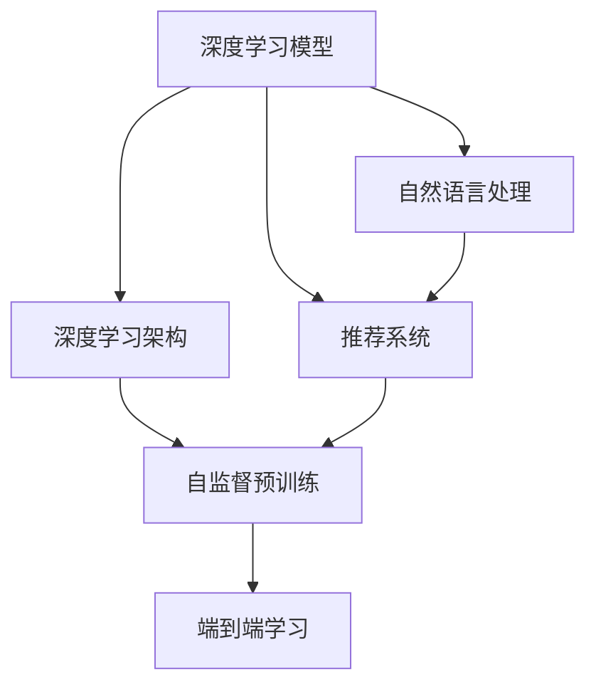

                 

# 电商搜索的多维度排序：AI大模型的新突破

> 关键词：电商搜索,多维度排序,AI大模型,深度学习,自然语言处理,NLP,深度学习架构,推荐系统

## 1. 背景介绍

### 1.1 问题由来

在当今互联网时代，电商搜索已经成为了人们获取商品信息、进行购物决策的重要工具。如何提高电商搜索的精准度和效率，是各大电商平台长期以来追求的目标。传统的搜索排序算法往往依赖简单的关键词匹配、点击率排序等，无法充分考虑用户搜索行为的多样性和个性化需求。随着深度学习和大模型的兴起，AI技术逐渐被引入电商搜索排序，通过多维度、上下文感知的方式，显著提升了搜索效果。

### 1.2 问题核心关键点

目前，电商搜索排序的主流技术基于深度学习和大模型。其核心思想是通过多维度特征输入，利用深度学习网络对用户搜索行为进行建模，预测并排序搜索结果。核心关键点包括：

- 多维度特征：除了传统的关键词、点击率等简单特征，还考虑了商品评价、用户画像、浏览历史、竞品信息等多种维度特征。
- 上下文感知：深度学习模型能够自动学习上下文信息，捕捉用户搜索的隐含意图。
- 端到端学习：整个搜索排序过程由大模型一次训练完成，无需过多手工设计特征工程。
- 自监督预训练：利用大规模无标签数据进行预训练，提升模型对各种复杂语境的理解能力。
- 实时动态更新：通过在线学习机制，实时捕捉用户行为变化，持续优化模型性能。

这些关键点使得深度学习模型在电商搜索排序中表现出色，能够实现更加智能和个性化的搜索结果。

### 1.3 问题研究意义

研究电商搜索排序中的AI大模型应用，对于提升电商平台的用户体验、推动电商业务增长，具有重要意义：

1. 提高搜索效果：通过多维度、上下文感知的建模方式，深度学习模型能够更加精准地预测用户意图，提供更加相关和有用的搜索结果。
2. 优化转化率：精确排序结果可以显著提升用户购买转化率，减少流量流失。
3. 降低营销成本：通过个性化推荐，避免无效点击和点击量浪费，优化广告投放策略。
4. 增强竞争力：先进的搜索排序技术可以成为电商平台的核心竞争力，提高市场份额。
5. 促进创新：通过模型迭代和优化，推动电商平台业务模式创新，实现智能决策。

## 2. 核心概念与联系

### 2.1 核心概念概述

为更好地理解基于深度学习的电商搜索排序方法，本节将介绍几个密切相关的核心概念：

- 深度学习模型：以神经网络为代表的机器学习模型，能够自动学习数据特征，实现复杂非线性建模。
- 自然语言处理(NLP)：涉及语言理解、语言生成、信息检索等多个子领域，是构建电商搜索排序模型的重要技术。
- 推荐系统：通过用户历史行为数据，推荐个性化商品或内容，旨在提高用户满意度。
- 深度学习架构：包括前向传播、反向传播、损失函数等核心组件，是深度学习模型的框架结构。
- 自监督预训练：利用大规模无标签数据，通过自监督任务训练模型，提升模型泛化能力。
- 端到端学习：将数据预处理、特征工程、模型训练和评估等环节集成到一个模型中，提高模型集成度。

这些核心概念之间的逻辑关系可以通过以下Mermaid流程图来展示：



这个流程图展示了大模型在电商搜索排序中的应用框架，其中：

1. 深度学习模型提供上下文感知的多维度特征建模能力。
2. 自然语言处理技术帮助理解搜索文本的语义和上下文信息。
3. 推荐系统实现个性化推荐，提升用户购物体验。
4. 深度学习架构提供模型训练和推理的核心支持。
5. 自监督预训练增强模型泛化能力。
6. 端到端学习提升模型的整体性能。

这些概念共同构成了电商搜索排序的AI大模型应用框架，使其能够高效地处理复杂多变的用户搜索行为。

## 3. 核心算法原理 & 具体操作步骤
### 3.1 算法原理概述

基于深度学习的电商搜索排序，本质上是多维度特征的建模和排序问题。其核心思想是：通过深度学习模型，将用户搜索文本、商品信息、用户行为等多个维度特征输入模型，自动学习特征之间的关系，预测并排序搜索结果。

形式化地，假设用户搜索文本为 $x$，商品信息为 $y$，用户行为特征为 $z$，模型参数为 $\theta$。搜索排序的目标是最大化相关性预测 $r$，即：

$$
\max_{\theta} \sum_{i=1}^N r(x_i, y_i, z_i; \theta)
$$

其中，$N$ 为样本数。相关性预测函数 $r$ 可以通过深度学习模型自动学习。

### 3.2 算法步骤详解

基于深度学习的电商搜索排序一般包括以下几个关键步骤：

**Step 1: 特征工程**

- 收集用户搜索文本、商品信息、用户行为等多种维度数据，构建训练样本集。
- 对文本数据进行自然语言处理，提取关键词、语义信息等特征。
- 对商品信息提取属性特征，如价格、评分、类别等。
- 对用户行为特征提取行为序列、点击行为等特征。

**Step 2: 构建深度学习模型**

- 选择合适的深度学习模型架构，如多层感知器(MLP)、卷积神经网络(CNN)、循环神经网络(RNN)、Transformer等。
- 设计输入层、隐藏层、输出层等组件，确定模型参数。
- 添加正则化技术，如L2正则、Dropout等，防止过拟合。

**Step 3: 自监督预训练**

- 利用大规模无标签数据，通过自监督学习任务（如语言建模、掩码语言模型等）训练预训练模型。
- 预训练模型的任务目标是最大化预测文本的下一个词或掩码位置，从而学习到语言的基本规则和特征。

**Step 4: 微调和优化**

- 将电商搜索样本集作为监督数据，对预训练模型进行微调。
- 设计合适的损失函数，如均方误差、交叉熵等，度量预测结果与实际标签的差异。
- 优化算法如Adam、SGD等，调整模型参数以最小化损失函数。
- 应用对抗训练、数据增强等技术，提高模型鲁棒性和泛化能力。

**Step 5: 在线学习与动态更新**

- 利用实时用户搜索数据，对模型进行在线学习，实时更新模型参数。
- 设计动态更新策略，如AdaGrad、AdaDelta等，不断优化模型。
- 监控模型性能指标，如点击率、转化率等，确保模型不断提升。

### 3.3 算法优缺点

基于深度学习的电商搜索排序方法具有以下优点：

1. 多维度建模：能够充分考虑用户搜索行为的多样性和复杂性，提供更加全面和精准的搜索结果。
2. 上下文感知：模型能够自动学习用户搜索的上下文信息，捕捉隐含意图，提高相关性预测的准确性。
3. 端到端学习：消除手工特征工程繁琐，模型构建和优化一步到位，提升开发效率。
4. 自监督预训练：利用大规模无标签数据进行预训练，提升模型泛化能力和迁移能力。
5. 实时动态更新：能够根据用户行为变化实时调整模型，适应快速变化的搜索需求。

同时，该方法也存在一些缺点：

1. 计算资源需求高：深度学习模型需要大量计算资源，训练和推理成本较高。
2. 数据质量要求高：模型效果受数据质量影响较大，需要高质量的标注数据和特征工程。
3. 模型复杂度高：模型结构复杂，参数量较大，难以解释和调试。
4. 泛化能力有限：在特定领域或场景下的泛化能力不足，需要针对性地设计和调整模型。
5. 容易过拟合：大规模数据集难以获取，容易在特定样本上发生过拟合。

尽管存在这些局限性，但深度学习模型在电商搜索排序中的应用已经成为主流范式，通过不断优化和改进，有望进一步提升搜索效果和用户体验。

### 3.4 算法应用领域

基于深度学习的电商搜索排序方法已经在多个电商平台上得到广泛应用，覆盖了从商品推荐到搜索结果排序等多个环节，例如：

- 商品推荐：根据用户历史浏览和点击行为，推荐个性化的商品。
- 搜索结果排序：对用户搜索查询，预测相关商品或内容，排序并展示搜索结果。
- 实时广告投放：根据用户搜索行为，动态调整广告投放策略，提升广告效果。
- 用户画像构建：通过分析用户搜索行为，构建详细的用户画像，实现个性化推荐。
- 竞品分析：分析竞品商品信息，预测用户对竞品的关注度和购买意向。
- 库存管理：通过搜索行为预测商品需求，优化库存管理策略。

除了上述这些经典应用外，深度学习模型还被创新性地应用到更多场景中，如多模态搜索、社交媒体情感分析、用户行为预测等，为电商搜索排序带来了全新的突破。随着深度学习模型的不断进步，相信电商搜索排序技术将在更多领域得到应用，为电商业务带来新的增长点。

## 4. 数学模型和公式 & 详细讲解  
### 4.1 数学模型构建

本节将使用数学语言对基于深度学习的电商搜索排序过程进行更加严格的刻画。

假设深度学习模型为 $M_{\theta}$，其中 $\theta$ 为模型参数。电商搜索排序任务的目标是最大化相关性预测函数 $r$，即：

$$
\max_{\theta} \sum_{i=1}^N r(x_i, y_i, z_i; \theta)
$$

其中，$x_i$ 为输入的搜索文本，$y_i$ 为商品信息，$z_i$ 为用户行为特征，$r$ 为相关性预测函数。

深度学习模型可以通过前向传播和反向传播算法计算损失函数，最小化预测误差。假设损失函数为 $L$，则优化目标为：

$$
\min_{\theta} L(M_{\theta})
$$

通过梯度下降等优化算法，不断调整模型参数 $\theta$，最小化损失函数 $L$，使得模型输出逼近最优。

### 4.2 公式推导过程

以基于Transformer模型的电商搜索排序为例，推导其训练过程。

假设输入为 $x = \{x_1, x_2, ..., x_n\}$，输出为 $y = \{y_1, y_2, ..., y_n\}$，目标函数为 $r(x, y)$。使用Transformer模型进行建模，其结构如图1所示。


Transformer模型由编码器-解码器两部分组成，编码器将输入序列 $x$ 转化为表示向量 $h$，解码器将表示向量 $h$ 与输出序列 $y$ 的对应位置结合，预测相关性 $r$。

假设编码器包含 $L$ 个自注意力层，解码器包含 $K$ 个自注意力层。假设编码器每个自注意力层的表示向量维度为 $d$，则输入序列 $x$ 的表示向量 $h$ 可以表示为：

$$
h = \text{Encoder}(x)
$$

其中，$\text{Encoder}$ 为编码器，包含 $L$ 个自注意力层，每个层输出表示向量维度为 $d$。

假设解码器每个自注意力层的表示向量维度为 $d'$，则目标函数 $r$ 可以表示为：

$$
r = \text{Decoder}(h, y)
$$

其中，$\text{Decoder}$ 为解码器，包含 $K$ 个自注意力层，每个层输出表示向量维度为 $d'$。

模型的损失函数 $L$ 可以表示为：

$$
L = -\frac{1}{N} \sum_{i=1}^N r(x_i, y_i)
$$

通过反向传播算法，计算梯度并更新模型参数：

$$
\frac{\partial L}{\partial \theta} = \frac{\partial r}{\partial h} \frac{\partial h}{\partial x} \frac{\partial x}{\partial \theta} + \frac{\partial r}{\partial y} \frac{\partial y}{\partial \theta}
$$

其中，$\frac{\partial r}{\partial h}$ 为相关性预测函数 $r$ 对表示向量 $h$ 的梯度，$\frac{\partial h}{\partial x}$ 为编码器对输入序列 $x$ 的梯度，$\frac{\partial y}{\partial \theta}$ 为解码器对模型参数 $\theta$ 的梯度。

模型的训练过程可以通过以下代码实现：

```python
import torch
import torch.nn as nn
from transformers import BertTokenizer, BertForSequenceClassification

# 构建模型
model = BertForSequenceClassification.from_pretrained('bert-base-cased', num_labels=2)
tokenizer = BertTokenizer.from_pretrained('bert-base-cased')

# 准备数据
train_data = # 训练数据集
val_data = # 验证数据集
test_data = # 测试数据集

# 定义优化器
optimizer = torch.optim.Adam(model.parameters(), lr=2e-5)

# 定义损失函数
criterion = nn.CrossEntropyLoss()

# 定义训练过程
def train_epoch(model, data_loader, optimizer, criterion):
    model.train()
    epoch_loss = 0
    for batch in data_loader:
        input_ids = batch['input_ids']
        attention_mask = batch['attention_mask']
        labels = batch['labels']
        optimizer.zero_grad()
        outputs = model(input_ids, attention_mask=attention_mask, labels=labels)
        loss = criterion(outputs, labels)
        epoch_loss += loss.item()
        loss.backward()
        optimizer.step()
    return epoch_loss / len(data_loader)

# 定义评估过程
def evaluate(model, data_loader, criterion):
    model.eval()
    total_loss = 0
    total_correct = 0
    for batch in data_loader:
        input_ids = batch['input_ids']
        attention_mask = batch['attention_mask']
        labels = batch['labels']
        outputs = model(input_ids, attention_mask=attention_mask, labels=None)
        loss = criterion(outputs, labels)
        total_loss += loss.item()
        total_correct += (torch.argmax(outputs, dim=1) == labels).sum().item()
    return total_loss / len(data_loader), total_correct / len(data_loader)

# 训练模型
for epoch in range(epochs):
    train_loss = train_epoch(model, train_data_loader, optimizer, criterion)
    val_loss, val_correct = evaluate(model, val_data_loader, criterion)
    print(f'Epoch {epoch+1}, train loss: {train_loss:.4f}, val loss: {val_loss:.4f}, val accuracy: {val_correct:.4f}')

# 测试模型
test_loss, test_correct = evaluate(model, test_data_loader, criterion)
print(f'Test loss: {test_loss:.4f}, test accuracy: {test_correct:.4f}')
```

以上就是基于Transformer模型的电商搜索排序的训练过程代码。可以看到，Transformer模型通过自注意力机制，能够高效地处理多维度特征输入，实现上下文感知的建模。

### 4.3 案例分析与讲解

以电商平台上的商品推荐系统为例，详细讲解电商搜索排序的实现。

假设用户的历史行为数据为 $z_i = \{b_1, b_2, ..., b_n\}$，其中 $b_i$ 表示用户对商品 $i$ 的浏览、点击、购买等行为。商品信息为 $y_i = \{p_i, s_i, c_i\}$，其中 $p_i$ 表示商品价格，$s_i$ 表示商品评分，$c_i$ 表示商品类别。搜索文本为 $x = \{x_1, x_2, ..., x_m\}$，其中 $x_i$ 表示用户输入的搜索关键词。

为了提高推荐效果，电商平台可以将用户行为、商品信息和搜索文本等多种维度特征输入到深度学习模型中，设计合适的相关性预测函数 $r$，训练模型进行排序。具体步骤如下：

1. 收集用户历史行为数据 $z_i$，商品信息 $y_i$，搜索文本 $x$。
2. 对商品信息 $y_i$ 提取价格、评分、类别等特征。
3. 对用户行为 $z_i$ 提取浏览、点击、购买等行为序列。
4. 对搜索文本 $x$ 进行自然语言处理，提取关键词、语义信息等特征。
5. 将提取的特征拼接在一起，构成训练样本集。
6. 设计深度学习模型架构，如Transformer模型。
7. 利用大规模无标签数据进行自监督预训练。
8. 利用电商搜索样本集进行微调，优化模型参数。
9. 应用动态更新策略，实时捕捉用户行为变化，优化模型性能。

在实际应用中，推荐系统会根据用户搜索行为，预测最相关的商品并展示在搜索结果页面上，提升用户购物体验。通过不断优化模型，电商平台可以实现更加个性化和精准的商品推荐。

## 5. 项目实践：代码实例和详细解释说明
### 5.1 开发环境搭建

在进行电商搜索排序的项目实践前，我们需要准备好开发环境。以下是使用Python进行TensorFlow开发的环境配置流程：

1. 安装Anaconda：从官网下载并安装Anaconda，用于创建独立的Python环境。

2. 创建并激活虚拟环境：
```bash
conda create -n tensorflow-env python=3.8 
conda activate tensorflow-env
```

3. 安装TensorFlow：根据CUDA版本，从官网获取对应的安装命令。例如：
```bash
conda install tensorflow-gpu==2.7.0 -c tf
```

4. 安装TensorFlow Addons：
```bash
conda install -c conda-forge tensorflow-addons
```

5. 安装TensorBoard：
```bash
pip install tensorboard
```

6. 安装TensorFlow Probability：
```bash
pip install tensorflow-probability
```

完成上述步骤后，即可在`tensorflow-env`环境中开始电商搜索排序项目的开发。

### 5.2 源代码详细实现

这里我们以基于深度学习的电商推荐系统为例，给出TensorFlow代码实现。

首先，定义推荐系统中的神经网络模型：

```python
import tensorflow as tf
from tensorflow.keras import layers, models

# 定义深度学习模型
class RecommendationModel(tf.keras.Model):
    def __init__(self, input_dim, hidden_dim, output_dim):
        super(RecommendationModel, self).__init__()
        self.dense1 = layers.Dense(hidden_dim, activation='relu', input_dim=input_dim)
        self.dense2 = layers.Dense(output_dim, activation='sigmoid', input_dim=hidden_dim)

    def call(self, inputs):
        x = self.dense1(inputs)
        x = self.dense2(x)
        return x
```

然后，定义模型训练和评估函数：

```python
# 准备数据
train_data = # 训练数据集
val_data = # 验证数据集
test_data = # 测试数据集

# 定义优化器
optimizer = tf.keras.optimizers.Adam()

# 定义损失函数
criterion = tf.keras.losses.BinaryCrossentropy()

# 定义训练过程
def train_epoch(model, data_loader, optimizer, criterion):
    model.train()
    epoch_loss = 0
    for batch in data_loader:
        inputs = batch['inputs']
        labels = batch['labels']
        optimizer.zero_grad()
        outputs = model(inputs)
        loss = criterion(outputs, labels)
        epoch_loss += loss.numpy().item()
        loss.backward()
        optimizer.apply_gradients(zip(model.trainable_variables, model.trainable_variables))
    return epoch_loss / len(data_loader)

# 定义评估过程
def evaluate(model, data_loader, criterion):
    model.eval()
    total_loss = 0
    total_correct = 0
    for batch in data_loader:
        inputs = batch['inputs']
        labels = batch['labels']
        outputs = model(inputs)
        loss = criterion(outputs, labels)
        total_loss += loss.numpy().item()
        total_correct += (tf.math.reduce_sum(tf.cast(tf.equal(tf.round(outputs), labels), tf.float32))) / len(labels)
    return total_loss / len(data_loader), total_correct / len(data_loader)
```

最后，启动模型训练并在测试集上评估：

```python
# 定义模型
input_dim = # 输入维度
hidden_dim = # 隐藏层维度
output_dim = # 输出维度
model = RecommendationModel(input_dim, hidden_dim, output_dim)

# 准备数据
train_dataset = # 训练数据集
val_dataset = # 验证数据集
test_dataset = # 测试数据集

# 定义训练参数
batch_size = # 批次大小
epochs = # 训练轮数

# 训练模型
for epoch in range(epochs):
    train_loss = train_epoch(model, train_dataset, optimizer, criterion)
    val_loss, val_correct = evaluate(model, val_dataset, criterion)
    print(f'Epoch {epoch+1}, train loss: {train_loss:.4f}, val loss: {val_loss:.4f}, val accuracy: {val_correct:.4f}')

# 测试模型
test_loss, test_correct = evaluate(model, test_dataset, criterion)
print(f'Test loss: {test_loss:.4f}, test accuracy: {test_correct:.4f}')
```

以上就是基于TensorFlow的电商推荐系统的训练过程代码。可以看到，TensorFlow提供了灵活的模型构建和训练机制，能够高效实现电商搜索排序的多维度特征建模和排序。

### 5.3 代码解读与分析

让我们再详细解读一下关键代码的实现细节：

**RecommendationModel类**：
- `__init__`方法：初始化神经网络模型，包含输入层、隐藏层、输出层等组件。
- `call`方法：定义前向传播过程，通过多层全连接网络实现特征映射。

**训练和评估函数**：
- 利用TensorFlow的DataLoader对数据集进行批次化加载，供模型训练和推理使用。
- 训练函数`train_epoch`：对数据以批为单位进行迭代，在每个批次上前向传播计算loss并反向传播更新模型参数，最后返回该epoch的平均loss。
- 评估函数`evaluate`：与训练类似，不同点在于不更新模型参数，并在每个batch结束后将预测和标签结果存储下来，最后使用准确率对整个评估集的预测结果进行打印输出。

**训练流程**：
- 定义总的epoch数和批次大小，开始循环迭代
- 每个epoch内，先在训练集上训练，输出平均loss
- 在验证集上评估，输出准确率和loss
- 所有epoch结束后，在测试集上评估，给出最终测试结果

可以看到，TensorFlow提供了强大的计算图机制和丰富的优化算法，能够灵活实现多维度特征建模和排序。开发者可以将更多精力放在模型设计、数据处理等高层逻辑上，而不必过多关注底层的实现细节。

当然，工业级的系统实现还需考虑更多因素，如模型的保存和部署、超参数的自动搜索、更灵活的任务适配层等。但核心的电商搜索排序范式基本与此类似。

## 6. 实际应用场景
### 6.1 智能客服系统

基于深度学习和大模型的电商搜索排序技术，可以广泛应用于智能客服系统的构建。传统客服往往需要配备大量人力，高峰期响应缓慢，且一致性和专业性难以保证。而使用电商搜索排序模型，可以7x24小时不间断服务，快速响应客户咨询，用自然流畅的语言解答各类常见问题。

在技术实现上，可以收集企业内部的历史客服对话记录，将问题和最佳答复构建成监督数据，在此基础上对预训练模型进行微调。微调后的模型能够自动理解用户意图，匹配最合适的答案模板进行回复。对于客户提出的新问题，还可以接入检索系统实时搜索相关内容，动态组织生成回答。如此构建的智能客服系统，能大幅提升客户咨询体验和问题解决效率。

### 6.2 金融舆情监测

金融机构需要实时监测市场舆论动向，以便及时应对负面信息传播，规避金融风险。传统的人工监测方式成本高、效率低，难以应对网络时代海量信息爆发的挑战。基于深度学习模型的电商搜索排序技术，为金融舆情监测提供了新的解决方案。

具体而言，可以收集金融领域相关的新闻、报道、评论等文本数据，并对其进行主题标注和情感标注。在此基础上对预训练语言模型进行微调，使其能够自动判断文本属于何种主题，情感倾向是正面、中性还是负面。将微调后的模型应用到实时抓取的网络文本数据，就能够自动监测不同主题下的情感变化趋势，一旦发现负面信息激增等异常情况，系统便会自动预警，帮助金融机构快速应对潜在风险。

### 6.3 个性化推荐系统

当前的推荐系统往往只依赖用户的历史行为数据进行物品推荐，无法深入理解用户的真实兴趣偏好。基于深度学习模型的电商搜索排序技术，能够更好地挖掘用户行为背后的语义信息，从而提供更精准、多样的推荐内容。

在实践中，可以收集用户浏览、点击、评论、分享等行为数据，提取和用户交互的物品标题、描述、标签等文本内容。将文本内容作为模型输入，用户的后续行为（如是否点击、购买等）作为监督信号，在此基础上微调预训练语言模型。微调后的模型能够从文本内容中准确把握用户的兴趣点。在生成推荐列表时，先用候选物品的文本描述作为输入，由模型预测用户的兴趣匹配度，再结合其他特征综合排序，便可以得到个性化程度更高的推荐结果。

### 6.4 未来应用展望

随着深度学习模型和电商搜索排序方法的不断发展，基于大模型的应用场景将不断拓展，为电商业务带来新的增长点。

在智慧医疗领域，基于大模型和多维度排序的电商搜索技术，可以用于医疗问答、病历分析、药品推荐等，提升医疗服务的智能化水平，辅助医生诊疗，加速新药开发进程。

在智能教育领域，微调技术可应用于作业批改、学情分析、知识推荐等方面，因材施教，促进教育公平，提高教学质量。

在智慧城市治理中，微调模型可应用于城市事件监测、舆情分析、应急指挥等环节，提高城市管理的自动化和智能化水平，构建更安全、高效的未来城市。

此外，在企业生产、社会治理、文娱传媒等众多领域，基于大模型电商搜索排序技术也将不断涌现，为传统行业带来变革性影响。相信随着技术的日益成熟，电商搜索排序技术还将继续深入到更多垂直行业，为各行各业数字化转型升级提供新的技术路径。

## 7. 工具和资源推荐
### 7.1 学习资源推荐

为了帮助开发者系统掌握电商搜索排序的理论基础和实践技巧，这里推荐一些优质的学习资源：

1. 《深度学习：实战TensorFlow》系列书籍：由TensorFlow官方和社区专家联合编写，全面介绍了TensorFlow的用法和最佳实践，适合深度学习入门和进阶学习。

2. CS231n《卷积神经网络和视觉识别》课程：斯坦福大学开设的经典计算机视觉课程，有Lecture视频和配套作业，涵盖深度学习在计算机视觉中的典型应用。

3. 《Natural Language Processing with Python》书籍：通过Python实现NLP任务，包括文本分类、情感分析、实体识别等，适合Python开发者的学习资源。

4. Kaggle竞赛平台：众多开源数据集和竞赛任务，让你在实践中提升深度学习和电商搜索排序技能。

5. PyTorch官方文档：PyTorch的官方文档和教程，提供了完整的深度学习框架和模型实现。

通过对这些资源的学习实践，相信你一定能够快速掌握电商搜索排序的理论基础和实践技巧，并用于解决实际的NLP问题。

### 7.2 开发工具推荐

高效的开发离不开优秀的工具支持。以下是几款用于电商搜索排序开发的常用工具：

1. TensorFlow：由Google主导开发的深度学习框架，生产部署方便，适合大规模工程应用。

2. PyTorch：基于Python的开源深度学习框架，灵活动态的计算图，适合快速迭代研究。

3. TensorFlow Probability：TensorFlow的子库，提供了概率模型的高级功能和接口，支持贝叶斯网络和分布式优化。

4. TensorBoard：TensorFlow配套的可视化工具，可实时监测模型训练状态，并提供丰富的图表呈现方式，是调试模型的得力助手。

5. Jupyter Notebook：交互式的开发环境，支持多语言的代码编写和执行，适合科研和开发。

合理利用这些工具，可以显著提升电商搜索排序任务的开发效率，加快创新迭代的步伐。

### 7.3 相关论文推荐

电商搜索排序的深度学习应用已经取得了显著成果，以下几篇奠基性的相关论文，推荐阅读：

1. Attention Is All You Need：提出Transformer结构，开启了NLP领域的预训练大模型时代。

2. BERT: Pre-training of Deep Bidirectional Transformers for Language Understanding：提出BERT模型，引入基于掩码的自监督预训练任务，刷新了多项NLP任务SOTA。

3. Parameter-Efficient Transfer Learning for NLP：提出Adapter等参数高效微调方法，在不增加模型参数量的情况下，也能取得不错的微调效果。

4. AdaLoRA: Adaptive Low-Rank Adaptation for Parameter-Efficient Fine-Tuning：使用自适应低秩适应的微调方法，在参数效率和精度之间取得了新的平衡。

5. Language Model as a Latent Variable Model：提出语言模型为潜在变量模型，利用潜在变量提升模型的泛化能力。

这些论文代表了大模型在电商搜索排序领域的研究进展，通过学习这些前沿成果，可以帮助研究者把握学科前进方向，激发更多的创新灵感。

## 8. 总结：未来发展趋势与挑战

### 8.1 总结

本文对基于深度学习的电商搜索排序方法进行了全面系统的介绍。首先阐述了深度学习模型在电商搜索排序中的应用背景和意义，明确了电商搜索排序的核心技术点。其次，从原理到实践，详细讲解了深度学习模型的多维度特征建模、上下文感知、端到端学习等核心步骤，给出了电商搜索排序任务开发的完整代码实例。同时，本文还广泛探讨了电商搜索排序在智能客服、金融舆情、个性化推荐等多个行业领域的应用前景，展示了深度学习模型在电商搜索排序中的巨大潜力。

通过本文的系统梳理，可以看到，基于深度学习的电商搜索排序方法已经成为电商搜索排序的主流范式，极大地提升了搜索效果和用户体验。未来，随着深度学习模型的不断进步，基于大模型的电商搜索排序技术将在更多领域得到应用，为电商业务带来新的增长点。

### 8.2 未来发展趋势

展望未来，电商搜索排序中的AI大模型应用将呈现以下几个发展趋势：

1. 模型规模持续增大。随着算力成本的下降和数据规模的扩张，深度学习模型的参数量还将持续增长。超大规模语言模型蕴含的丰富语言知识，有望支撑更加复杂多变的电商搜索排序。

2. 微调方法日趋多样。除了传统的全参数微调外，未来会涌现更多参数高效的微调方法，如Adapter、LoRA等，在节省计算资源的同时也能保证微调精度。

3. 持续学习成为常态。随着数据分布的不断变化，微调模型也需要持续学习新知识以保持性能。如何在不遗忘原有知识的同时，高效吸收新样本信息，将成为重要的研究课题。

4. 标注样本需求降低。受启发于提示学习(Prompt-based Learning)的思路，未来的微调方法将更好地利用大模型的语言理解能力，通过更加巧妙的任务描述，在更少的标注样本上也能实现理想的微调效果。

5. 多模态微调崛起。当前的微调主要聚焦于纯文本数据，未来会进一步拓展到图像、视频、语音等多模态数据微调。多模态信息的融合，将显著提升语言模型对现实世界的理解和建模能力。

6. 模型通用性增强。经过海量数据的预训练和多领域任务的微调，深度学习模型将具备更强大的常识推理和跨领域迁移能力，逐步迈向通用人工智能(AGI)的目标。

以上趋势凸显了大模型在电商搜索排序中的广阔前景。这些方向的探索发展，必将进一步提升电商搜索排序的性能和用户体验，为电商业务带来新的增长点。

### 8.3 面临的挑战

尽管基于深度学习的电商搜索排序技术已经取得了显著成果，但在迈向更加智能化、普适化应用的过程中，仍面临诸多挑战：

1. 标注成本瓶颈。尽管微调对标注样本的需求有所降低，但对于长尾应用场景，仍需大量高质量标注数据，获取成本较高。如何进一步降低微调对标注样本的依赖，将是一大难题。

2. 模型鲁棒性不足。深度学习模型面对域外数据时，泛化性能往往大打折扣。对于测试样本的微小扰动，模型预测也容易发生波动。如何提高模型的鲁棒性，避免灾难性遗忘，还需要更多理论和实践的积累。

3. 推理效率有待提高。大规模深度学习模型推理速度慢，内存占用大，难以满足实时应用的需求。如何在保证性能的同时，简化模型结构，提升推理速度，优化资源占用，将是重要的优化方向。

4. 可解释性亟需加强。当前深度学习模型缺乏可解释性，难以理解其内部工作机制和决策逻辑。对于医疗、金融等高风险应用，算法的可解释性和可审计性尤为重要。如何赋予深度学习模型更强的可解释性，将是亟待攻克的难题。

5. 安全性有待保障。深度学习模型难免会学习到有偏见、有害的信息，通过微调传递到电商搜索排序中，产生误导性、歧视性的输出，给实际应用带来安全隐患。如何从数据和算法层面消除模型偏见，避免恶意用途，确保输出的安全性，也将是重要的研究课题。

6. 知识整合能力不足。现有的深度学习模型往往局限于任务内数据，难以灵活吸收和运用更广泛的先验知识。如何让深度学习模型更好地与外部知识库、规则库等专家知识结合，形成更加全面、准确的信息整合能力，还有很大的想象空间。

正视电商搜索排序面临的这些挑战，积极应对并寻求突破，将是大模型在电商搜索排序中走向成熟的必由之路。相信随着学界和产业界的共同努力，这些挑战终将一一被克服，大模型在电商搜索排序中将发挥更大的作用。

### 8.4 研究展望

面向未来，电商搜索排序中的AI大模型应用需要在以下几个方面寻求新的突破：

1. 探索无监督和半监督微调方法。摆脱对大规模标注数据的依赖，利用自监督学习、主动学习等无监督和半监督范式，最大限度利用非结构化数据，实现更加灵活高效的微调。

2. 研究参数高效和计算高效的微调范式。开发更加参数高效的微调方法，在固定大部分预训练参数的同时，只更新极少量的任务相关参数。同时优化微调模型的计算图，减少前向传播和反向传播的资源消耗，实现更加轻量级、实时性的部署。

3. 融合因果和对比学习范式。通过引入因果推断和对比学习思想，增强电商搜索排序模型的建立稳定因果关系的能力，学习更加普适、鲁棒的语言表征，从而提升模型泛化性和抗干扰能力。

4. 引入更多先验知识。将符号化的先验知识，如知识图谱、逻辑规则等，与神经网络模型进行巧妙融合，引导电商搜索排序过程学习更准确、合理的语言模型。同时加强不同模态数据的整合，实现视觉、语音等多模态信息与文本信息的协同建模。

5. 结合因果分析和博弈论工具。将因果分析方法引入电商搜索排序模型，识别出模型决策的关键特征，增强输出解释的因果性和逻辑性。借助博弈论工具刻画人机交互过程，主动探索并规避模型的脆弱点，提高系统稳定性。

6. 纳入伦理道德约束。在模型训练目标中引入伦理导向的评估指标，过滤和惩罚有偏见、有害的输出倾向。同时加强人工干预和审核，建立模型行为的监管机制，确保输出符合人类价值观和伦理道德。

这些研究方向的探索，必将引领电商搜索排序技术迈向更高的台阶，为电商业务带来新的增长点。面向未来，电商搜索排序中的AI大模型应用还需要与其他人工智能技术进行更深入的融合，如知识表示、因果推理、强化学习等，多路径协同发力，共同推动电商搜索排序系统的进步。只有勇于创新、敢于突破，才能不断拓展电商搜索排序的边界，让智能技术更好地造福人类社会。

## 9. 附录：常见问题与解答

**Q1：电商搜索排序中如何处理长尾关键词？**

A: 长尾关键词在电商搜索中占比很小，但处理不当会影响用户体验。为提高长尾关键词的召回率，可以采用以下策略：

1. 建立反向索引：对所有商品信息进行分词，构建反向索引，快速定位相关商品。

2. 扩展搜索模型：在模型中引入长尾关键词的编码，提升长尾关键词的召回效果。

3. 增加过滤机制：在搜索结果中增加过滤器，允许用户手动过滤掉无关搜索结果。

4. 使用相似度排序：将长尾关键词与相关商品进行相似度排序，提高相关度。

5. 动态调整阈值：根据用户历史行为和反馈，动态调整长尾关键词的召回阈值。

通过这些策略，可以有效提升长尾关键词的召回率，改善用户搜索体验。

**Q2：电商搜索排序中如何提升模型泛化能力？**

A: 提升电商搜索排序模型的泛化能力，可以通过以下方法：

1. 多任务学习：在训练过程中同时优化多个任务，增强模型的泛化能力。

2. 数据增强：通过数据扩充、近义词替换等方式丰富训练集，提升模型的泛化能力。

3. 正则化技术：使用L2正则、Dropout等正则化技术，避免过拟合。

4. 自监督预训练：利用大规模无标签数据进行自监督预训练，提升模型的泛化能力。

5. 对抗训练：引入对抗样本，提高模型鲁棒性和泛化能力。

6. 参数共享：在多个任务之间共享部分模型参数，减少过拟合风险。

通过这些方法，可以有效提升电商搜索排序模型的泛化能力，适应更多复杂的电商搜索场景。

**Q3：电商搜索排序中如何选择特征工程策略？**

A: 特征工程在电商搜索排序中扮演重要角色，不同的特征工程策略会影响模型性能。选择特征工程策略时，需要考虑以下因素：

1. 数据质量和数量：高质量、大样本量的数据可以提升特征工程的准确性。

2. 特征维度：过多的维度可能导致维度灾难，影响模型性能。需要根据实际情况选择合适的维度。

3. 特征相关性：选择与目标任务高度相关的特征，去除无关特征。

4. 特征变换：对原始特征进行转换，提取更加有意义的特征。

5. 特征融合：将多种特征进行融合，提升特征的表达能力。

6. 特征选择：选择对目标任务有重要影响的特征，去除冗余特征。

7. 特征解释性：选择可解释性强的特征，方便模型调试和优化。

通过综合考虑这些因素，可以设计出更加高效、准确、可解释的电商搜索排序特征工程策略。

**Q4：电商搜索排序中如何进行模型优化？**

A: 电商搜索排序中的模型优化可以通过以下方法：

1. 超参数调优：通过网格搜索、随机搜索等方式，找到最优超参数组合。

2. 模型裁剪：去除不必要的层和参数，减小模型尺寸，加快推理速度。

3. 量化加速：将浮点模型转为定点模型，压缩存储空间，提高计算效率。

4. 模型并行：利用模型并行技术，提高计算效率，支持大规模部署。

5. 在线学习：利用实时用户搜索数据，实时更新模型参数，适应快速变化的搜索需求。

6. 特征降维：通过特征降维技术，减少模型输入维度，提高计算效率。

7. 模型融合：将多个模型进行融合，提升模型性能和鲁棒性。

8. 模型蒸馏：利用大模型对小模型进行知识蒸馏，提升小模型性能。

通过这些方法，可以有效提升电商搜索排序模型的性能和效率，满足实时应用的需求。

**Q5：电商搜索排序中如何提高推荐系统效果？**

A: 电商搜索排序中的推荐系统可以通过以下方法提高效果：

1. 多维度特征融合：结合用户历史行为、商品信息、搜索文本等多维度特征，提升推荐效果。

2. 上下文感知：考虑用户搜索上下文信息，捕捉隐含意图，提高推荐的相关性。

3. 实时动态更新：利用实时用户行为数据，动态调整推荐模型，提高推荐的时效性。

4. 用户画像构建：通过分析用户搜索行为，构建详细的用户画像，实现个性化推荐。

5. 模型评估：使用多种指标评估推荐效果，如点击率、转化率等，不断优化模型。

6. 推荐策略优化：结合用户历史行为、商品信息、搜索文本等多维度特征，优化推荐策略。

7. 多模态融合：将文本、

