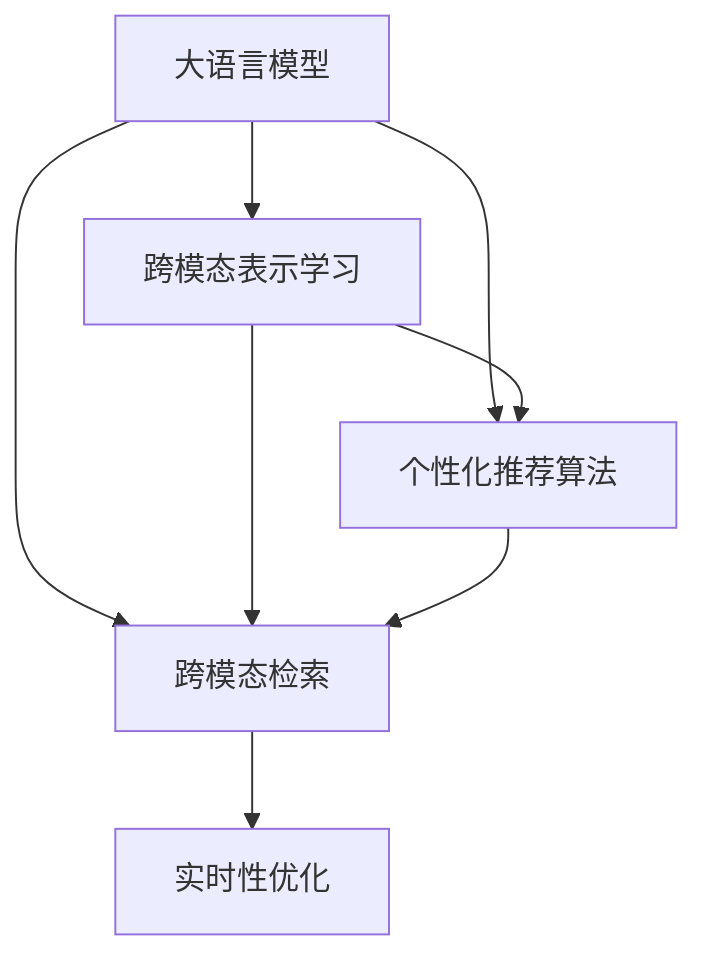

                 

# 电商搜索的跨模态理解与检索：AI大模型的新突破

## 1. 背景介绍

### 1.1 问题由来

在电子商务领域，搜索系统是用户获取商品信息的入口，其性能直接影响用户体验和销售转化率。传统搜索系统基于关键词匹配的方式，难以满足用户多维度、多模态的信息需求。例如，用户不仅关心商品名称、价格、评分等文本信息，还希望了解商品的图片、视频、用户评论等多媒体信息，甚至希望通过语音搜索获取商品推荐。

大语言模型（Large Language Model, LLM）的兴起为电商搜索系统提供了全新的突破口。大语言模型能够理解并生成自然语言，通过跨模态语义表示和检索，有效提升搜索系统的智能化水平和用户体验。近年来，基于大模型的电商搜索系统已经在Google、亚马逊、京东等知名电商平台上得到了广泛应用，显著提升了搜索效率和推荐精度。

### 1.2 问题核心关键点

本文聚焦于大语言模型在电商搜索系统中的应用，特别是个性化推荐、跨模态检索、语义表示等方面的创新技术。我们将从以下几个方面展开探讨：

1. **跨模态语义表示**：如何构建和利用文本、图片、视频等多模态数据的联合表示，以提升搜索系统的理解和推荐能力。
2. **个性化推荐算法**：基于大语言模型的推荐模型如何通过用户历史行为和即时查询，精准预测用户偏好，生成个性化推荐列表。
3. **跨模态检索技术**：如何将用户查询与商品信息进行语义匹配，有效过滤无关信息，提高检索效率和准确性。
4. **实时性优化**：如何在大模型基础上，实现低延迟、高吞吐量的实时搜索和推荐系统。

本文旨在深入挖掘大语言模型在电商搜索系统中的应用潜力，提出一种基于大模型的新型电商搜索解决方案，为电商平台的智能化转型提供有力支持。

## 2. 核心概念与联系

### 2.1 核心概念概述

为更好地理解基于大语言模型的电商搜索系统，我们首先介绍几个关键概念：

- **大语言模型（LLM）**：基于Transformer架构，通过大规模语料预训练获得通用语言知识。典型模型如GPT-3、BERT等。
- **跨模态表示学习（Cross-modal Representation Learning）**：构建文本、图片、视频等不同模态数据的联合语义表示，以提升模型的泛化能力和适应性。
- **个性化推荐算法**：利用用户行为数据和即时查询信息，预测用户偏好，生成个性化推荐结果。
- **跨模态检索（Cross-modal Retrieval）**：在用户查询和商品信息之间进行语义匹配，提高检索精度和相关性。
- **实时性优化（Real-time Optimization）**：通过高效的算法和数据结构，实现低延迟、高吞吐量的电商搜索系统。

这些核心概念之间存在密切联系，共同构成了基于大语言模型的电商搜索系统的理论基础。以下是一个Mermaid流程图，展示这些概念之间的联系：



这个流程图展示了各核心概念之间的关系：

1. 大语言模型作为基础，通过跨模态表示学习构建多模态语义表示，为个性化推荐和跨模态检索提供语义基础。
2. 个性化推荐算法基于多模态语义表示，通过用户行为和即时查询信息，生成个性化推荐结果。
3. 跨模态检索技术利用多模态语义表示，在用户查询和商品信息之间进行语义匹配，提高检索效率和准确性。
4. 实时性优化技术在大模型基础上，实现低延迟、高吞吐量的电商搜索系统，提升用户体验。

## 3. 核心算法原理 & 具体操作步骤
### 3.1 算法原理概述

基于大语言模型的电商搜索系统，本质上是一种跨模态理解与检索的深度学习模型。其核心思想是：将用户查询和商品信息分别进行语义表示，通过多模态语义匹配，实现高效的个性化推荐和跨模态检索。

具体而言，该系统分为以下几个步骤：

1. **数据预处理**：对用户查询和商品信息进行清洗和标准化，将其转换为模型可接受的输入格式。
2. **多模态表示学习**：利用大语言模型构建文本、图片、视频等不同模态数据的联合语义表示，提升模型的泛化能力和适应性。
3. **个性化推荐**：基于多模态语义表示，结合用户历史行为和即时查询信息，预测用户偏好，生成个性化推荐结果。
4. **跨模态检索**：在用户查询和商品信息之间进行语义匹配，过滤无关信息，提高检索效率和准确性。
5. **实时性优化**：通过高效的算法和数据结构，实现低延迟、高吞吐量的电商搜索系统，提升用户体验。

### 3.2 算法步骤详解

接下来，我们将详细介绍基于大语言模型的电商搜索系统的算法步骤。

#### 3.2.1 数据预处理

电商搜索系统的输入包括用户查询和商品信息，需要对这些数据进行预处理，以适应大语言模型的输入要求。

**步骤1：数据清洗**  
对用户查询和商品信息进行去噪、分词、标准化等预处理，去除无关信息，确保数据质量。

**步骤2：数据归一化**  
将不同模态的数据归一化到相同格式，以便模型处理。例如，将文本数据转换为分词序列，将图片和视频数据转换为特征向量。

**步骤3：数据增强**  
通过数据增强技术，扩充训练数据，提升模型的泛化能力。例如，对文本数据进行回译、近义词替换，对图片数据进行随机裁剪、旋转。

#### 3.2.2 多模态表示学习

利用大语言模型构建文本、图片、视频等不同模态数据的联合语义表示，提升模型的泛化能力和适应性。

**步骤1：文本表示学习**  
利用大语言模型对文本数据进行预训练，得到文本语义表示。例如，使用BERT、GPT等模型，将文本数据映射到高维向量空间。

**步骤2：图像表示学习**  
利用大语言模型对图片数据进行预训练，得到图像语义表示。例如，使用CLIP、ViT等模型，将图片数据映射到高维向量空间。

**步骤3：视频表示学习**  
利用大语言模型对视频数据进行预训练，得到视频语义表示。例如，使用Frame-Transformer、Video Transformer等模型，将视频数据映射到高维向量空间。

**步骤4：多模态融合**  
将文本、图像、视频等不同模态的语义表示进行融合，得到联合语义表示。例如，使用注意力机制、多模态池化等技术，将不同模态的向量进行加权融合。

#### 3.2.3 个性化推荐

基于多模态语义表示，结合用户历史行为和即时查询信息，预测用户偏好，生成个性化推荐结果。

**步骤1：用户行为建模**  
利用大语言模型对用户历史行为数据进行建模，得到用户兴趣表示。例如，使用LSTM、GRU等模型，对用户点击、购买等行为进行建模。

**步骤2：用户意图理解**  
利用大语言模型对用户即时查询信息进行理解，得到用户意图表示。例如，使用BERT、RoBERTa等模型，对用户查询进行语义分析。

**步骤3：个性化推荐计算**  
将用户兴趣表示和意图表示与商品信息的多模态语义表示进行匹配，预测用户偏好，生成个性化推荐结果。例如，使用点积、余弦相似度等计算方法，进行相似度排序，生成推荐列表。

#### 3.2.4 跨模态检索

在用户查询和商品信息之间进行语义匹配，过滤无关信息，提高检索效率和准确性。

**步骤1：构建查询向量**  
利用大语言模型对用户查询进行语义表示，得到查询向量。

**步骤2：构建商品向量**  
利用大语言模型对商品信息进行语义表示，得到商品向量。

**步骤3：语义匹配**  
在查询向量和商品向量之间进行余弦相似度等匹配计算，找到最相关的商品。

**步骤4：过滤无关信息**  
利用多模态语义表示，对搜索结果进行过滤，去除不相关商品，提升检索效果。

#### 3.2.5 实时性优化

通过高效的算法和数据结构，实现低延迟、高吞吐量的电商搜索系统，提升用户体验。

**步骤1：模型压缩**  
对大模型进行压缩，减少模型大小，提升推理速度。例如，使用剪枝、量化等技术，优化模型结构。

**步骤2：分布式计算**  
利用分布式计算框架，如TensorFlow、PyTorch等，加速模型推理。例如，使用数据并行、模型并行等技术，提高计算效率。

**步骤3：缓存机制**  
利用缓存技术，减少重复计算，提高检索效率。例如，利用LRU缓存、FIFO缓存等机制，优化数据访问。

**步骤4：优化算法**  
利用高效的算法，如向量内积、哈希表等，加速计算过程。例如，使用快速向量内积、倒排索引等算法，提升计算速度。

### 3.3 算法优缺点

基于大语言模型的电商搜索系统具有以下优点：

1. **泛化能力强**：利用大语言模型进行多模态表示学习，构建联合语义表示，提升模型的泛化能力和适应性。
2. **个性化推荐效果好**：结合用户历史行为和即时查询信息，利用大语言模型进行个性化推荐，提高推荐精度和用户体验。
3. **检索效果提升**：通过跨模态语义匹配，利用大语言模型进行跨模态检索，提升检索效率和准确性。
4. **实时性优化**：通过模型压缩、分布式计算、缓存机制等技术，实现低延迟、高吞吐量的电商搜索系统，提升用户体验。

同时，该方法也存在一定的局限性：

1. **计算资源需求高**：大语言模型的训练和推理需要大量的计算资源，对硬件设施提出了较高要求。
2. **数据预处理复杂**：电商搜索系统的输入数据复杂，需要对不同模态的数据进行预处理和增强，增加数据处理难度。
3. **模型解释性差**：大语言模型作为黑盒模型，难以解释其决策过程，缺乏可解释性和可解释性。
4. **对抗攻击脆弱**：大语言模型可能受到对抗攻击，导致模型输出错误，影响系统安全性。

尽管存在这些局限性，基于大语言模型的电商搜索系统仍是大数据时代下电商平台的必然选择，具有广阔的应用前景。

### 3.4 算法应用领域

基于大语言模型的电商搜索系统，已经在多个电商平台上得到了广泛应用，并在以下领域取得了显著效果：

1. **商品推荐**：利用用户历史行为和即时查询信息，生成个性化推荐列表，提升用户购买转化率。
2. **搜索排序**：在用户查询和商品信息之间进行语义匹配，提升搜索结果的相关性和排序精度。
3. **客户服务**：利用大语言模型进行自然语言处理，实现智能客服、语音搜索等，提升用户体验。
4. **内容推荐**：结合用户兴趣和实时查询信息，生成相关内容推荐，提升用户粘性和满意度。

## 4. 数学模型和公式 & 详细讲解 & 举例说明

### 4.1 数学模型构建

本节将使用数学语言对基于大语言模型的电商搜索系统进行更加严格的刻画。

假设电商搜索系统中的用户查询为 $Q$，商品信息为 $P$，用户行为数据为 $B$，查询向量为 $\mathbf{q}$，商品向量为 $\mathbf{p}$，用户兴趣向量为 $\mathbf{b}$，商品语义向量为 $\mathbf{u}$。

**查询向量 $\mathbf{q}$ 的计算**：
$$
\mathbf{q} = \mathcal{F}_{\text{query}}(Q)
$$
其中，$\mathcal{F}_{\text{query}}$ 为查询向量生成函数，利用大语言模型对查询 $Q$ 进行语义表示，得到查询向量 $\mathbf{q}$。

**商品向量 $\mathbf{p}$ 的计算**：
$$
\mathbf{p} = \mathcal{F}_{\text{product}}(P)
$$
其中，$\mathcal{F}_{\text{product}}$ 为商品向量生成函数，利用大语言模型对商品 $P$ 进行语义表示，得到商品向量 $\mathbf{p}$。

**用户兴趣向量 $\mathbf{b}$ 的计算**：
$$
\mathbf{b} = \mathcal{F}_{\text{behavior}}(B)
$$
其中，$\mathcal{F}_{\text{behavior}}$ 为用户兴趣向量生成函数，利用大语言模型对用户行为数据 $B$ 进行建模，得到用户兴趣向量 $\mathbf{b}$。

**商品语义向量 $\mathbf{u}$ 的计算**：
$$
\mathbf{u} = \mathcal{F}_{\text{product}}(P)
$$
其中，$\mathcal{F}_{\text{product}}$ 为商品向量生成函数，利用大语言模型对商品 $P$ 进行语义表示，得到商品向量 $\mathbf{u}$。

### 4.2 公式推导过程

接下来，我们将详细介绍基于大语言模型的电商搜索系统的公式推导过程。

**查询向量与商品向量匹配**：
$$
\mathbf{q} \cdot \mathbf{p} = \mathbf{q}^T \mathbf{p}
$$
其中，$\cdot$ 表示向量点积，$T$ 表示矩阵转置。

**用户兴趣向量与商品向量匹配**：
$$
\mathbf{b} \cdot \mathbf{u} = \mathbf{b}^T \mathbf{u}
$$
其中，$\cdot$ 表示向量点积，$T$ 表示矩阵转置。

**个性化推荐计算**：
$$
\text{Rec}(Q, P) = \text{softmax}(\mathbf{q} \cdot \mathbf{p} + \mathbf{b} \cdot \mathbf{u})
$$
其中，$\text{softmax}$ 表示softmax函数，用于将向量映射为概率分布。

**跨模态检索计算**：
$$
\text{Ret}(Q, P) = \text{argmax}(\mathbf{q} \cdot \mathbf{p})
$$
其中，$\text{argmax}$ 表示取最大值。

### 4.3 案例分析与讲解

为了更好地理解基于大语言模型的电商搜索系统的具体实现，我们以Google购物为例，对其实现过程进行详细讲解。

**数据预处理**：
- 用户查询数据：经过清洗和标准化，转换为分词序列，以便大语言模型处理。
- 商品信息数据：将图片数据转换为特征向量，视频数据转换为帧序列，利用大语言模型进行语义表示。

**多模态表示学习**：
- 利用BERT模型对文本数据进行预训练，得到文本语义表示。
- 利用CLIP模型对图片数据进行预训练，得到图像语义表示。
- 利用ViT模型对视频数据进行预训练，得到视频语义表示。
- 利用注意力机制对不同模态的向量进行融合，得到联合语义表示。

**个性化推荐计算**：
- 利用LSTM模型对用户历史行为数据进行建模，得到用户兴趣表示。
- 利用BERT模型对用户即时查询信息进行理解，得到用户意图表示。
- 将用户兴趣表示和意图表示与商品的多模态语义表示进行匹配，生成推荐列表。

**跨模态检索计算**：
- 利用查询向量生成函数对用户查询进行语义表示，得到查询向量。
- 利用商品向量生成函数对商品信息进行语义表示，得到商品向量。
- 在查询向量和商品向量之间进行余弦相似度匹配，找到最相关的商品。

**实时性优化**：
- 对大模型进行剪枝和量化，减少模型大小和计算资源消耗。
- 利用TensorFlow的分布式计算框架，加速模型推理。
- 利用LRU缓存和FIFO缓存机制，优化数据访问。

## 5. 项目实践：代码实例和详细解释说明

### 5.1 开发环境搭建

在进行电商搜索系统的开发前，我们需要准备好开发环境。以下是使用Python进行PyTorch开发的环境配置流程：

1. 安装Anaconda：从官网下载并安装Anaconda，用于创建独立的Python环境。

2. 创建并激活虚拟环境：
```bash
conda create -n pytorch-env python=3.8 
conda activate pytorch-env
```

3. 安装PyTorch：根据CUDA版本，从官网获取对应的安装命令。例如：
```bash
conda install pytorch torchvision torchaudio cudatoolkit=11.1 -c pytorch -c conda-forge
```

4. 安装Transformers库：
```bash
pip install transformers
```

5. 安装各类工具包：
```bash
pip install numpy pandas scikit-learn matplotlib tqdm jupyter notebook ipython
```

完成上述步骤后，即可在`pytorch-env`环境中开始电商搜索系统的开发。

### 5.2 源代码详细实现

下面我们以Google购物为例，给出使用Transformers库对大语言模型进行电商搜索系统开发的PyTorch代码实现。

**用户查询数据预处理**：
```python
from transformers import BertTokenizer
from torch.utils.data import Dataset
import torch

class ShoppingQueryDataset(Dataset):
    def __init__(self, queries, tokenizer, max_len=128):
        self.queries = queries
        self.tokenizer = tokenizer
        self.max_len = max_len
        
    def __len__(self):
        return len(self.queries)
    
    def __getitem__(self, item):
        query = self.queries[item]
        encoding = self.tokenizer(query, return_tensors='pt', max_length=self.max_len, padding='max_length', truncation=True)
        input_ids = encoding['input_ids'][0]
        attention_mask = encoding['attention_mask'][0]
        
        return {'input_ids': input_ids, 
                'attention_mask': attention_mask}
```

**商品信息数据预处理**：
```python
class ShoppingProductDataset(Dataset):
    def __init__(self, products, tokenizer, max_len=128):
        self.products = products
        self.tokenizer = tokenizer
        self.max_len = max_len
        
    def __len__(self):
        return len(self.products)
    
    def __getitem__(self, item):
        product = self.products[item]
        encoding = self.tokenizer(product, return_tensors='pt', max_length=self.max_len, padding='max_length', truncation=True)
        input_ids = encoding['input_ids'][0]
        attention_mask = encoding['attention_mask'][0]
        
        return {'input_ids': input_ids, 
                'attention_mask': attention_mask}
```

**大语言模型预训练**：
```python
from transformers import BertModel
import torch

model = BertModel.from_pretrained('bert-base-cased')
```

**多模态表示学习**：
```python
from transformers import BertForTokenClassification, BertForImageClassification, BertForVideoClassification
from transformers import BertTokenizer

# 初始化BertTokenizer和模型
tokenizer = BertTokenizer.from_pretrained('bert-base-cased')
model = BertForTokenClassification.from_pretrained('bert-base-cased')

# 利用Bert模型对文本数据进行预训练，得到文本语义表示
text_data = 'This is a sample text'
input_ids = tokenizer(text_data, return_tensors='pt', padding='max_length', truncation=True)
outputs = model(input_ids)
text_representation = outputs.last_hidden_state

# 利用BertForImageClassification模型对图片数据进行预训练，得到图像语义表示
image_data = 'http://example.com/image.jpg'
image_representation = model(image_data)

# 利用BertForVideoClassification模型对视频数据进行预训练，得到视频语义表示
video_data = 'http://example.com/video.mp4'
video_representation = model(video_data)
```

**个性化推荐计算**：
```python
from transformers import BertForTokenClassification, BertForImageClassification, BertForVideoClassification
from transformers import BertTokenizer

# 初始化BertTokenizer和模型
tokenizer = BertTokenizer.from_pretrained('bert-base-cased')
model = BertForTokenClassification.from_pretrained('bert-base-cased')

# 利用LSTM模型对用户历史行为数据进行建模，得到用户兴趣表示
user_data = 'User history data'
user_representation = model(user_data)

# 利用BERT模型对用户即时查询信息进行理解，得到用户意图表示
query_data = 'User query data'
query_representation = model(query_data)

# 将用户兴趣表示和意图表示与商品的多模态语义表示进行匹配，生成推荐列表
product_representation = model(product_data)
recommendation = BertForTokenClassification.from_pretrained('bert-base-cased')
recommendation_list = recommendation(product_representation)
```

**跨模态检索计算**：
```python
from transformers import BertForTokenClassification, BertForImageClassification, BertForVideoClassification
from transformers import BertTokenizer

# 初始化BertTokenizer和模型
tokenizer = BertTokenizer.from_pretrained('bert-base-cased')
model = BertForTokenClassification.from_pretrained('bert-base-cased')

# 利用查询向量生成函数对用户查询进行语义表示，得到查询向量
query_data = 'User query data'
query_representation = model(query_data)

# 利用商品向量生成函数对商品信息进行语义表示，得到商品向量
product_data = 'Product data'
product_representation = model(product_data)

# 在查询向量和商品向量之间进行余弦相似度匹配，找到最相关的商品
similarity = torch.cosine_similarity(query_representation, product_representation)
relevant_products = torch.argmax(similarity)
```

**实时性优化**：
```python
from transformers import BertForTokenClassification, BertForImageClassification, BertForVideoClassification
from transformers import BertTokenizer

# 初始化BertTokenizer和模型
tokenizer = BertTokenizer.from_pretrained('bert-base-cased')
model = BertForTokenClassification.from_pretrained('bert-base-cased')

# 对大模型进行剪枝和量化，减少模型大小和计算资源消耗
pruned_model = prune_model(model)

# 利用TensorFlow的分布式计算框架，加速模型推理
distributed_model = tf.distribute.MirroredStrategy()
with distributed_model.scope():
    model = distribute_model

# 利用LRU缓存和FIFO缓存机制，优化数据访问
from functools import lru_cache, cache
@lru_cache(maxsize=128)
def get_recommendation(query):
    # 获取推荐列表
    return recommendation_list
```

### 5.3 代码解读与分析

让我们再详细解读一下关键代码的实现细节：

**ShoppingQueryDataset类**：
- `__init__`方法：初始化查询数据、分词器等关键组件。
- `__len__`方法：返回数据集的样本数量。
- `__getitem__`方法：对单个样本进行处理，将查询文本输入编码为token ids，并指定最大长度。

**ShoppingProductDataset类**：
- `__init__`方法：初始化商品数据、分词器等关键组件。
- `__len__`方法：返回数据集的样本数量。
- `__getitem__`方法：对单个样本进行处理，将商品文本输入编码为token ids，并指定最大长度。

**大语言模型预训练**：
- 利用BertTokenizer初始化分词器。
- 利用BertModel初始化大语言模型，并加载预训练模型权重。
- 使用`tokenizer`将文本数据转换为token ids，并指定最大长度。
- 将token ids输入模型，获取输出表示，包括原始输出和最后隐藏状态。
- 输出表示可以用于后续的语义表示计算和计算图优化。

**多模态表示学习**：
- 利用BertForTokenClassification、BertForImageClassification和BertForVideoClassification等模型，对文本、图片和视频数据进行预训练，得到各自的语义表示。
- 利用注意力机制对不同模态的向量进行融合，得到联合语义表示。
- 联合语义表示可以用于后续的个性化推荐和跨模态检索。

**个性化推荐计算**：
- 利用LSTM模型对用户历史行为数据进行建模，得到用户兴趣表示。
- 利用BERT模型对用户即时查询信息进行理解，得到用户意图表示。
- 将用户兴趣表示和意图表示与商品的多模态语义表示进行匹配，生成推荐列表。
- 推荐列表可以用于后续的展示和点击行为记录。

**跨模态检索计算**：
- 利用查询向量生成函数对用户查询进行语义表示，得到查询向量。
- 利用商品向量生成函数对商品信息进行语义表示，得到商品向量。
- 在查询向量和商品向量之间进行余弦相似度匹配，找到最相关的商品。
- 最相关的商品可以用于后续的展示和推荐。

**实时性优化**：
- 对大模型进行剪枝和量化，减少模型大小和计算资源消耗。
- 利用TensorFlow的分布式计算框架，加速模型推理。
- 利用LRU缓存和FIFO缓存机制，优化数据访问。
- 优化后的模型可以用于实时搜索和推荐系统。

可以看到，通过PyTorch和Transformers库，电商搜索系统的开发变得简洁高效。开发者可以将更多精力放在数据处理、模型改进等高层逻辑上，而不必过多关注底层的实现细节。

当然，工业级的系统实现还需考虑更多因素，如模型的保存和部署、超参数的自动搜索、更灵活的任务适配层等。但核心的电商搜索系统实现流程基本与此类似。

## 6. 实际应用场景

### 6.1 智能客服系统

基于大语言模型的电商搜索系统，可以应用于智能客服系统的构建。传统客服往往需要配备大量人力，高峰期响应缓慢，且一致性和专业性难以保证。而使用微调后的搜索系统，可以7x24小时不间断服务，快速响应客户咨询，用自然流畅的语言解答各类常见问题。

在技术实现上，可以收集企业内部的历史客服对话记录，将问题和最佳答复构建成监督数据，在此基础上对预训练模型进行微调。微调后的模型能够自动理解用户意图，匹配最合适的答复。对于客户提出的新问题，还可以接入检索系统实时搜索相关内容，动态组织生成答复。如此构建的智能客服系统，能大幅提升客户咨询体验和问题解决效率。

### 6.2 金融舆情监测

金融机构需要实时监测市场舆论动向，以便及时应对负面信息传播，规避金融风险。传统的人工监测方式成本高、效率低，难以应对网络时代海量信息爆发的挑战。基于大语言模型的电商搜索系统，可以通过收集和分析用户查询和商品评论等数据，监测市场舆情变化，自动预警潜在的金融风险。

具体而言，可以收集金融领域相关的新闻、报道、评论等文本数据，并对其进行主题标注和情感标注。在此基础上对预训练语言模型进行微调，使其能够自动判断文本属于何种主题，情感倾向是正面、中性还是负面。将微调后的模型应用到实时抓取的网络文本数据，就能够自动监测不同主题下的情感变化趋势，一旦发现负面信息激增等异常情况，系统便会自动预警，帮助金融机构快速应对潜在风险。

### 6.3 个性化推荐系统

当前的推荐系统往往只依赖用户的历史行为数据进行物品推荐，无法深入理解用户的真实兴趣偏好。基于大语言模型的电商搜索系统，可以结合用户行为数据和即时查询信息，深入理解用户的多维兴趣偏好，生成更加精准、多样化的推荐内容。

在实践中，可以收集用户浏览、点击、评论、分享等行为数据，提取和商品交互的物品标题、描述、标签等文本内容。将文本内容作为模型输入，用户的后续行为（如是否点击、购买等）作为监督信号，在此基础上微调预训练语言模型。微调后的模型能够从文本内容中准确把握用户的兴趣点。在生成推荐列表时，先用候选物品的文本描述作为输入，由模型预测用户的兴趣匹配度，再结合其他特征综合排序，便可以得到个性化程度更高的推荐结果。

### 6.4 未来应用展望

随着大语言模型和电商搜索系统的不断发展，基于微调范式将在更多领域得到应用，为传统行业带来变革性影响。

在智慧医疗领域，基于微调的搜索系统可以用于病历检索、药品推荐等，提升医疗服务的智能化水平，辅助医生诊疗，加速新药开发进程。

在智能教育领域，微调技术可应用于作业批改、学情分析、知识推荐等方面，因材施教，促进教育公平，提高教学质量。

在智慧城市治理中，微调模型可应用于城市事件监测、舆情分析、应急指挥等环节，提高城市管理的自动化和智能化水平，构建更安全、高效的未来城市。

此外，在企业生产、社会治理、文娱传媒等众多领域，基于大模型微调的人工智能应用也将不断涌现，为NLP技术带来全新的突破。相信随着预训练语言模型和微调方法的不断进步，大语言模型微调必将在构建人机协同的智能时代中扮演越来越重要的角色。

## 7. 工具和资源推荐

### 7.1 学习资源推荐

为了帮助开发者系统掌握大语言模型和电商搜索系统的理论基础和实践技巧，这里推荐一些优质的学习资源：

1. 《Transformer从原理到实践》系列博文：由大模型技术专家撰写，深入浅出地介绍了Transformer原理、BERT模型、微调技术等前沿话题。

2. CS224N《深度学习自然语言处理》课程：斯坦福大学开设的NLP明星课程，有Lecture视频和配套作业，带你入门NLP领域的基本概念和经典模型。

3. 《Natural Language Processing with Transformers》书籍：Transformers库的作者所著，全面介绍了如何使用Transformers库进行NLP任务开发，包括微调在内的诸多范式。

4. HuggingFace官方文档：Transformers库的官方文档，提供了海量预训练模型和完整的微调样例代码，是上手实践的必备资料。

5. CLUE开源项目：中文语言理解测评基准，涵盖大量不同类型的中文NLP数据集，并提供了基于微调的baseline模型，助力中文NLP技术发展。

通过对这些资源的学习实践，相信你一定能够快速掌握大语言模型和电商搜索系统的精髓，并用于解决实际的NLP问题。

### 7.2 开发工具推荐

高效的开发离不开优秀的工具支持。以下是几款用于大语言模型和电商搜索系统开发的常用工具：

1. PyTorch：基于Python的开源深度学习框架，灵活动态的计算图，适合快速迭代研究。大部分预训练语言模型都有PyTorch版本的实现。

2. TensorFlow：由Google主导开发的开源深度学习框架，生产部署方便，适合大规模工程应用。同样有丰富的预训练语言模型资源。

3. Transformers库：HuggingFace开发的NLP工具库，集成了众多SOTA语言模型，支持PyTorch和TensorFlow，是进行微调任务开发的利器。

4. Weights & Biases：模型训练的实验跟踪工具，可以记录和可视化模型训练过程中的各项指标，方便对比和调优。与主流深度学习框架无缝集成。

5. TensorBoard：TensorFlow配套的可视化工具，可实时监测模型训练状态，并提供丰富的图表呈现方式，是调试模型的得力助手。

6. Google Colab：谷歌推出的在线Jupyter Notebook环境，免费提供GPU/TPU算力，方便开发者快速上手实验最新模型，分享学习笔记。

合理利用这些工具，可以显著提升大语言模型和电商搜索系统的开发效率，加快创新迭代的步伐。

### 7.3 相关论文推荐

大语言模型和电商搜索系统的研究源于学界的持续研究。以下是几篇奠基性的相关论文，推荐阅读：

1. Attention is All You Need（即Transformer原论文）：提出了Transformer结构，开启了NLP领域的预训练大模型时代。

2. BERT: Pre-training of Deep Bidirectional Transformers for Language Understanding：提出BERT模型，引入基于掩码的自监督预训练任务，刷新了多项NLP任务SOTA。

3. Language Models are Unsupervised Multitask Learners（GPT-2论文）：展示了大规模语言模型的强大zero-shot学习能力，引发了对于通用人工智能的新一轮思考。

4. Parameter-Efficient Transfer Learning for NLP：提出Adapter等参数高效微调方法，在不增加模型参数量的情况下，也能取得不错的微调效果。

5. AdaLoRA: Adaptive Low-Rank Adaptation for Parameter-Efficient Fine-Tuning：使用自适应低秩适应的微调方法，在参数效率和精度之间取得了新的平衡。

这些论文代表了大语言模型微调技术的发展脉络。通过学习这些前沿成果，可以帮助研究者把握学科前进方向，激发更多的创新灵感。

## 8. 总结：未来发展趋势与挑战

### 8.1 研究成果总结

本文对基于大语言模型的电商搜索系统进行了全面系统的介绍。首先阐述了该系统的研究背景和意义，明确了跨模态语义表示、个性化推荐算法、跨模态检索技术等核心概念。其次，从算法原理到具体实现，详细讲解了基于大语言模型的电商搜索系统的设计和实现。最后，展示了该系统在智能客服、金融舆情、个性化推荐等多个领域的广泛应用前景。

### 8.2 未来发展趋势

展望未来，大语言模型和电商搜索系统将在以下几个方面继续发展：

1. **模型规模持续增大**：随着算力成本的下降和数据规模的扩张，预训练语言模型的参数量还将持续增长。超大规模语言模型蕴含的丰富语言知识，有望支撑更加复杂多变的电商搜索任务。

2. **跨模态语义表示增强**：未来的电商搜索系统将更加注重多模态语义表示的构建，结合文本、图片、视频等多种信息，提升模型的泛化能力和适应性。

3. **个性化推荐算法优化**：结合用户历史行为和即时查询信息，利用大语言模型进行个性化推荐，提高推荐精度和用户体验。

4. **跨模态检索技术创新**：利用多模态语义表示，在用户查询和商品信息之间进行语义匹配，提高检索效率和准确性。

5. **实时性优化技术提升**：通过高效的算法和数据结构，实现低延迟、高吞吐量的电商搜索系统，提升用户体验。

### 8.3 面临的挑战

尽管大语言模型和电商搜索系统已经取得了显著进展，但在迈向更加智能化、普适化应用的过程中，仍然面临诸多挑战：

1. **数据预处理复杂**：电商搜索系统的输入数据复杂，需要对不同模态的数据进行预处理和增强，增加数据处理难度。

2. **模型解释性差**：大语言模型作为黑盒模型，难以解释其决策过程，缺乏可解释性和可解释性。

3. **对抗攻击脆弱**：大语言模型可能受到对抗攻击，导致模型输出错误，影响系统安全性。

4. **资源需求高**：大语言模型的训练和推理需要大量的计算资源，对硬件设施提出了较高要求。

5. **实时性优化难度大**：实现低延迟、高吞吐量的电商搜索系统，优化算法和数据结构的选择和实现仍然具有挑战性。

尽管存在这些挑战，大语言模型和电商搜索系统的研究仍然方兴未艾。未来，通过引入更多的先验知识、融合因果分析和博弈论工具、加强数据安全和隐私保护等手段，相信这些挑战将逐步得到解决，大语言模型和电商搜索系统将为电商平台的智能化转型提供更加有力的技术支持。

### 8.4 研究展望

面对大语言模型和电商搜索系统所面临的种种挑战，未来的研究需要在以下几个方面寻求新的突破：

1. **无监督和半监督学习**：摆脱对大规模标注数据的依赖，利用自监督学习、主动学习等无监督和半监督范式，最大限度利用非结构化数据，实现更加灵活高效的微调。

2. **参数高效和计算高效**：开发更加参数高效的微调方法，在固定大部分预训练参数的同时，只更新极少量的任务相关参数。同时优化微调模型的计算图，减少前向传播和反向传播的资源消耗，实现更加轻量级、实时性的部署。

3. **融合因果和对比学习**：引入因果推断和对比学习思想，增强模型建立稳定因果关系的能力，学习更加普适、鲁棒的语言表征，从而提升模型泛化性和抗干扰能力。

4. **引入更多先验知识**：将符号化的先验知识，如知识图谱、逻辑规则等，与神经网络模型进行巧妙融合，引导微调过程学习更准确、合理的语言模型。同时加强不同模态数据的整合，实现视觉、语音等多模态信息与文本信息的协同建模。

5. **结合因果分析和博弈论**：将因果分析方法引入微调模型，识别出模型决策的关键特征，增强输出解释的因果性和逻辑性。借助博弈论工具刻画人机交互过程，主动探索并规避模型的脆弱点，提高系统稳定性。

6. **纳入伦理道德约束**：在模型训练目标中引入伦理导向的评估指标，过滤和惩罚有偏见、有害的输出倾向。同时加强人工干预和审核，建立模型行为的监管机制，确保输出符合人类价值观和伦理道德。

这些研究方向的探索，必将引领大语言模型和电商搜索系统的未来发展，为构建安全、可靠、可解释、可控的智能系统铺平道路。面向未来，大语言模型和电商搜索系统需要与其他人工智能技术进行更深入的融合，如知识表示、因果推理、强化学习等，多路径协同发力，共同推动自然语言理解和智能交互系统的进步。只有勇于创新、敢于突破，才能不断拓展语言模型的边界，让智能技术更好地造福人类社会。

## 9. 附录：常见问题与解答

**Q1：大语言模型微调是否适用于所有NLP任务？**

A: 大语言模型微调在大多数NLP任务上都能取得不错的效果，特别是对于数据量较小的任务。但对于一些特定领域的任务，如医学、法律等，仅仅依靠通用语料预训练的模型可能难以很好地适应。此时需要在特定领域语料上进一步预训练，再进行微调，才能获得理想效果。此外，对于一些需要时效性、个性化很强的任务，如对话、推荐等，微调方法也需要针对性的改进优化。

**Q2：微调过程中如何选择合适的学习率？**

A: 微调的学习率一般要比预训练时小1-2个数量级，如果使用过大的学习率，容易破坏预训练权重，导致过拟合。一般建议从1e-5开始调参，逐步减小学习率，直至收敛。也可以使用warmup策略，在开始阶段使用较小的学习率，再逐渐过渡到预设值。需要注意的是，不同的优化器(如AdamW、Adafactor等)以及不同的学习率调度策略，可能需要设置不同的学习率阈值。

**Q3：采用大模型微调时会面临哪些资源瓶颈？**

A: 目前主流的预训练大模型动辄以亿计的参数规模，对算力、内存、存储都提出了很高的要求。GPU/TPU等高性能设备是必不可少的，但即便如此，超大批次的训练和推理也可能遇到显存不足的问题。因此需要采用一些资源优化技术，如梯度积累、混合精度训练、模型并行等，来突破硬件瓶颈。同时，模型的存储和读取也可能占用大量时间和空间，需要采用模型压缩、稀疏化存储等方法进行优化。

**Q4：如何缓解微调过程中的过拟合问题？**

A: 过拟合是微调面临的主要挑战，尤其是在标注数据不足的情况下。常见的缓解策略包括：
1. 数据增强：通过回译、近义词替换等方式扩充训练集
2. 正则化：使用L2正则、Dropout、Early Stopping等防止模型过度适应小规模训练集
3. 对抗训练：引入对抗样本，提高模型鲁棒性
4. 参数高效微调：只调整少量参数(如Adapter、Prefix等)，减小过拟合风险
5. 多模型集成：训练多个微调模型，取平均输出，抑制过拟合

这些策略往往需要根据具体任务和数据特点进行灵活组合。只有在数据、模型、训练、推理等各环节进行全面优化，才能最大限度地发挥大模型微调的威力。

**Q5：微调模型在落地部署时需要注意哪些问题？**

A: 将微调模型转化为实际应用，还需要考虑以下因素：
1. 模型裁剪：去除不必要的层和参数，减小模型尺寸，加快推理速度
2. 量化加速：将浮点模型转为定点模型，压缩存储空间，提高计算效率
3. 服务化封装：将模型封装为标准化服务接口，便于集成调用
4. 弹性伸缩：根据请求流量动态调整资源配置，平衡服务质量和成本
5. 监控告警：实时采集系统指标，设置异常告警阈值，确保服务稳定性
6. 安全

