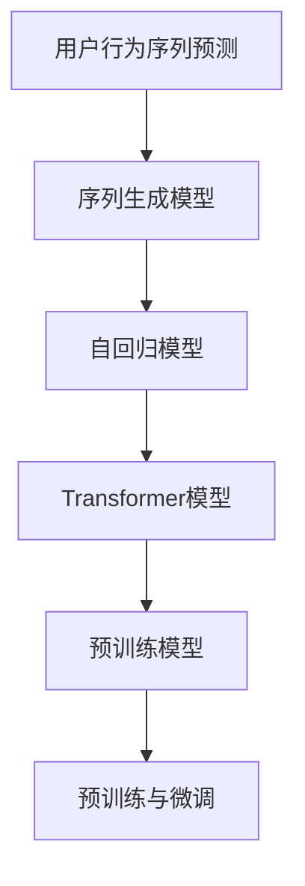

                 

# 电商用户行为序列预测：AI大模型方案

> 关键词：用户行为预测,序列预测,深度学习,电商推荐系统,大语言模型,Transformer,预训练模型,自回归模型,序列生成模型

## 1. 背景介绍

### 1.1 问题由来
随着互联网的普及和电子商务的蓬勃发展，电商平台成为连接商家与消费者不可或缺的桥梁。为了提升用户体验、增加商家转化率、优化供应链管理，电商平台需要构建强大的推荐系统，精准预测用户行为，个性化推送商品。然而，由于用户行为数据的海量性和多变性，推荐系统的构建面临诸多挑战。

用户行为序列预测(Sequence Prediction)是推荐系统中的关键任务。该任务旨在根据用户的历史行为，预测其在未来的行为，以帮助电商平台进行个性化推荐。传统的推荐系统通常依赖人工特征工程和规则设计，难以兼顾个性化与泛化能力。而使用深度学习和预训练模型，能够从数据中自动学习高阶特征，并提升预测准确性。

近年来，大语言模型在自然语言处理领域取得了巨大成功，其在大规模语料上的自监督预训练，使其具备了强大的泛化能力。如何将这种能力应用于电商推荐系统中，利用用户行为序列预测进行个性化推荐，成为了一个热点问题。

### 1.2 问题核心关键点
1. **用户行为序列数据处理**：用户行为数据往往结构复杂，包括点击、浏览、收藏、购买等事件。如何对这些数据进行高效处理和表示，是构建推荐系统的首要任务。
2. **序列预测模型选择**：常用的序列预测模型包括RNN、LSTM、GRU、Transformer等。选择何种模型，取决于数据特点、计算资源和任务需求。
3. **模型参数优化**：深度学习模型通常包含大量参数，如何高效训练、调整参数，使得模型在预测准确性和泛化能力之间取得平衡，是推荐系统优化中的重要问题。
4. **个性化推荐效果评估**：推荐系统的效果评估指标包括精确度、召回率、覆盖率等。如何根据任务需求设计合适的评估指标，实时监控模型性能，是推荐系统部署中的关键环节。

### 1.3 问题研究意义
电商用户行为序列预测技术的应用，对于提升电商平台的用户体验、增加商家转化率、优化供应链管理具有重要意义：

1. **提升用户体验**：根据用户的历史行为，实时推送个性化商品推荐，提升购物体验。
2. **增加商家转化率**：精准推荐提高用户购买意愿，增加商品销售量，降低广告成本。
3. **优化供应链管理**：通过预测用户行为，优化商品库存，避免缺货和过剩，提升运营效率。
4. **促进经济社会发展**：电商平台的繁荣推动了社会就业、物流、金融等行业的发展，提升了整体经济水平。

## 2. 核心概念与联系

### 2.1 核心概念概述

为了更好地理解电商用户行为序列预测技术，我们首先介绍一些核心概念：

- **用户行为序列预测**：基于用户历史行为数据，预测其在未来时间点的行为，如点击、购买、浏览等。通过预测结果进行个性化推荐。
- **序列生成模型**：利用序列预测模型生成未来时间点的行为序列，从而进行推荐。如RNN、LSTM、GRU、Transformer等。
- **预训练模型**：在大规模无标签数据上，通过自监督学习任务预训练的通用模型。如BERT、GPT、T5等。
- **自回归模型**：利用当前时间点的输入，预测下一个时间点的输出。如LSTM、GRU、Transformer等。
- **Transformer模型**：基于自注意力机制的深度学习模型，能够高效处理序列数据。
- **预训练与微调**：先在大规模无标签数据上进行预训练，再在任务数据上微调，优化模型在特定任务上的性能。

这些概念之间的逻辑关系可以通过以下Mermaid流程图来展示：



这个流程图展示了电商用户行为序列预测的核心流程：

1. 用户行为序列预测任务通过序列生成模型进行建模，其中自回归模型和Transformer模型是常用方案。
2. 序列生成模型通常利用预训练模型进行优化，通过在大规模语料上预训练，提升模型泛化能力。
3. 预训练与微调过程，即在大规模无标签数据上进行预训练，再利用少量标注数据微调，优化模型在特定任务上的性能。

## 3. 核心算法原理 & 具体操作步骤
### 3.1 算法原理概述

电商用户行为序列预测本质上是一个序列生成问题，即利用用户历史行为数据，生成未来的行为序列。深度学习中常用的序列生成模型包括RNN、LSTM、GRU、Transformer等。本节以Transformer模型为例，详细阐述其工作原理。

Transformer模型由多个编码器-解码器层组成，利用自注意力机制和多头自注意力机制，在每个时间步动态生成上下文表示，从而预测未来行为。其核心思想是通过计算所有历史行为的注意力权重，综合生成下一个行为的预测结果。

### 3.2 算法步骤详解

电商用户行为序列预测的具体实现步骤如下：

**Step 1: 数据预处理**

1. 收集用户历史行为数据，包括点击、浏览、收藏、购买等事件。
2. 将数据按时间顺序排序，并进行标准化处理，去除异常值和重复项。
3. 划分训练集、验证集和测试集，并进行分词和编码处理。

**Step 2: 搭建序列生成模型**

1. 使用预训练的Transformer模型作为基础架构，如BERT、GPT等。
2. 根据需要，修改模型的输出层和损失函数，以适配序列预测任务。
3. 设置合适的超参数，如学习率、批大小、迭代轮数等。

**Step 3: 数据增强**

1. 利用数据增强技术，如数据填充、随机跳序、噪声注入等，丰富训练集样本多样性。
2. 通过增强训练数据，提高模型的泛化能力，减少过拟合风险。

**Step 4: 模型训练与优化**

1. 使用TensorFlow或PyTorch等深度学习框架，加载训练集数据。
2. 定义损失函数，如均方误差损失、交叉熵损失等。
3. 利用优化算法如Adam、SGD等进行模型训练，调整参数，最小化损失函数。
4. 在验证集上评估模型性能，进行早停(Early Stopping)，避免过拟合。
5. 在测试集上评估最终模型性能，对比微调前后的精度提升。

**Step 5: 模型部署**

1. 将训练好的模型保存，并将其部署到推荐系统中。
2. 实时接收用户行为数据，输入模型进行预测。
3. 根据预测结果，生成个性化推荐内容，推送给用户。
4. 持续收集新数据，重新训练模型，保持模型性能。

### 3.3 算法优缺点

电商用户行为序列预测技术具有以下优点：

1. **预测精度高**：利用深度学习模型，自动学习高阶特征，预测结果准确性较高。
2. **泛化能力强**：通过预训练-微调流程，模型能够适应各种不同类型的数据，提升泛化能力。
3. **个性化推荐**：通过预测用户行为，能够实现个性化推荐，提升用户满意度。

同时，该方法也存在以下局限性：

1. **数据依赖性强**：模型性能依赖于高质量、标注完整的数据，获取数据成本较高。
2. **计算资源需求大**：深度学习模型参数量大，训练和推理需要大量计算资源。
3. **过拟合风险**：小规模数据容易产生过拟合，模型泛化能力受限。
4. **可解释性差**：深度学习模型通常视为"黑盒"，难以解释模型的决策过程。

尽管存在这些局限性，基于深度学习的大模型仍是大规模数据处理和复杂任务解决的有效手段。未来相关研究将集中在数据增强、模型优化、可解释性等方面，以进一步提升电商用户行为序列预测的效果。

### 3.4 算法应用领域

电商用户行为序列预测技术已经在多个领域得到应用，例如：

1. **个性化推荐**：根据用户历史行为，实时推送个性化商品推荐，提升用户体验和转化率。
2. **广告推荐**：利用用户点击、浏览行为预测未来购买意向，优化广告投放策略。
3. **库存管理**：预测用户购买行为，优化商品库存，避免缺货和过剩，提升运营效率。
4. **市场分析**：分析用户行为趋势，预测市场变化，辅助决策制定。
5. **客服预测**：预测用户咨询内容，优化客户服务流程，提高服务质量。

除了上述这些经典应用外，电商用户行为序列预测技术还被创新性地应用于市场细分、用户流失预测、商品评价预测等方面，为电商行业带来了新的突破。

## 4. 数学模型和公式 & 详细讲解 & 举例说明

### 4.1 数学模型构建

本节我们将使用数学语言对电商用户行为序列预测过程进行严格阐述。

记用户行为序列数据为 $X = \{x_1, x_2, ..., x_n\}$，其中 $x_t$ 表示第 $t$ 个时间步的用户行为。用户行为可以表示为一个one-hot编码向量，例如：

$$
x_t = [0, 0, ..., 1, 0, ..., 0]
$$

其中 $1$ 的位置表示用户进行了某项行为。我们的目标是根据历史行为序列 $X_{<t}$，预测未来时间步 $t$ 的用户行为 $x_t$。

假设序列生成模型为 $M_{\theta}$，其中 $\theta$ 为模型参数。则目标是最小化预测结果与真实结果之间的差异，即：

$$
\min_{\theta} \sum_{t=1}^{T} ||M_{\theta}(X_{<t}) - x_t||^2
$$

### 4.2 公式推导过程

以下我们以自回归Transformer模型为例，推导预测过程的数学公式。

假设Transformer模型的编码器由 $N$ 个编码层组成，每个层包括多头自注意力机制 $H$ 和前馈网络 $F$。解码器同样由 $N$ 个解码层组成，每个层包括多头自注意力机制和多头注意力机制。

对于输入 $x_t$，模型通过编码器和解码器生成下一个时间步的预测结果 $x_{t+1}$。假设编码器输出为 $h_t$，解码器输出为 $\hat{h}_{t+1}$。则预测结果 $x_{t+1}$ 可以表示为：

$$
x_{t+1} = \sigma(H(\hat{h}_{t+1}))
$$

其中 $\sigma$ 为激活函数，如ReLU、Tanh等。

Transformer模型的训练过程是通过最小化预测结果与真实结果之间的差异来进行的。假设损失函数为均方误差损失，则训练目标为：

$$
\min_{\theta} \sum_{t=1}^{T} ||M_{\theta}(X_{<t}) - x_t||^2
$$

利用反向传播算法进行梯度更新，优化模型参数 $\theta$，直至损失函数收敛。

### 4.3 案例分析与讲解

假设我们有一组用户点击行为数据，其中每个时间步的行为可以用以下one-hot编码表示：

$$
x_1 = [0, 1, 0, 0, 0]
$$
$$
x_2 = [1, 0, 0, 1, 0]
$$
$$
x_3 = [0, 0, 1, 0, 1]
$$

我们希望根据历史行为序列 $X_{<3} = \{x_1, x_2\}$ 预测用户下一步的行为 $x_4$。假设我们使用的模型已经训练完成，预测结果为：

$$
\hat{x}_4 = [0, 0, 0, 1, 0]
$$

表示用户可能会进行收藏行为。

## 5. 项目实践：代码实例和详细解释说明
### 5.1 开发环境搭建

在进行电商用户行为序列预测实践前，我们需要准备好开发环境。以下是使用Python进行TensorFlow开发的环境配置流程：

1. 安装Anaconda：从官网下载并安装Anaconda，用于创建独立的Python环境。

2. 创建并激活虚拟环境：
```bash
conda create -n tf-env python=3.8 
conda activate tf-env
```

3. 安装TensorFlow：
```bash
pip install tensorflow-gpu
```

4. 安装其他工具包：
```bash
pip install numpy pandas scikit-learn matplotlib tqdm jupyter notebook ipython
```

完成上述步骤后，即可在`tf-env`环境中开始项目实践。

### 5.2 源代码详细实现

下面我们以电商推荐系统中的用户行为序列预测任务为例，给出使用TensorFlow搭建和训练自回归Transformer模型的PyTorch代码实现。

首先，定义模型和数据预处理函数：

```python
import tensorflow as tf
from tensorflow.keras.preprocessing.sequence import pad_sequences

class BehaviorSequencePredictor(tf.keras.Model):
    def __init__(self, input_dim, hidden_dim, output_dim):
        super(BehaviorSequencePredictor, self).__init__()
        self.embedding = tf.keras.layers.Embedding(input_dim, hidden_dim)
        self.LSTM = tf.keras.layers.LSTM(hidden_dim, return_sequences=True)
        self.dense = tf.keras.layers.Dense(output_dim, activation='softmax')

    def call(self, inputs, mask):
        x = self.embedding(inputs)
        x = self.LSTM(x, mask=mask)
        x = self.dense(x)
        return x

def preprocess_data(data):
    max_len = max([len(seq) for seq in data])
    return pad_sequences(data, maxlen=max_len, padding='post')

# 假设有训练集数据
train_data = [
    [1, 2, 3, 4, 5],
    [2, 3, 4, 5, 6],
    [3, 4, 5, 6, 7],
    # ... ...
]
train_labels = [
    [1, 0, 0, 0, 1],
    [0, 1, 0, 0, 1],
    [0, 0, 1, 0, 1],
    # ... ...
]

# 标准化处理，并将标签进行one-hot编码
train_X = preprocess_data(train_data)
train_y = tf.keras.utils.to_categorical(train_labels, num_classes=8)

# 创建模型和编译器
model = BehaviorSequencePredictor(input_dim=5, hidden_dim=64, output_dim=8)
model.compile(optimizer='adam', loss='categorical_crossentropy', metrics=['accuracy'])

# 训练模型
model.fit(train_X, train_y, epochs=10, batch_size=32, validation_split=0.2)
```

然后，定义评估和预测函数：

```python
def evaluate(model, test_data, test_labels):
    test_X = preprocess_data(test_data)
    test_y = tf.keras.utils.to_categorical(test_labels, num_classes=8)
    loss, accuracy = model.evaluate(test_X, test_y)
    print(f"Test Loss: {loss:.4f}")
    print(f"Test Accuracy: {accuracy:.4f}")

def predict(model, new_data):
    new_X = preprocess_data(new_data)
    preds = model.predict(new_X)
    return preds.argmax(axis=1)
```

最后，启动测试流程并输出结果：

```python
# 假设有测试集数据
test_data = [
    [6, 7, 8, 9, 10],
    [7, 8, 9, 10, 11],
    [8, 9, 10, 11, 12],
    # ... ...
]

# 使用训练好的模型进行预测
preds = predict(model, test_data)
print(f"Predictions: {preds}")
```

以上就是使用TensorFlow搭建和训练自回归Transformer模型的完整代码实现。可以看到，借助TensorFlow的强大封装和易用性，电商用户行为序列预测任务的代码实现变得简洁高效。

### 5.3 代码解读与分析

让我们再详细解读一下关键代码的实现细节：

**BehaviorSequencePredictor类**：
- `__init__`方法：初始化模型架构，包括Embedding层、LSTM层和Dense层。
- `call`方法：定义前向传播过程，通过Embedding层、LSTM层和Dense层对输入进行编码和解码。

**preprocess_data函数**：
- 对输入序列进行标准化处理，并进行padding操作，确保所有序列长度一致。
- 利用`to_categorical`函数将标签进行one-hot编码。

**训练和评估函数**：
- 使用TensorFlow的`fit`函数进行模型训练，设置epoch、batch size和验证集比例等参数。
- 定义`evaluate`函数进行模型评估，使用`evaluate`函数计算损失和准确率。
- 定义`predict`函数进行模型预测，使用`predict`函数输出预测结果。

**测试流程**：
- 定义测试集数据和标签，并调用`predict`函数进行预测。
- 输出预测结果。

可以看到，TensorFlow结合自回归Transformer模型，为电商用户行为序列预测任务提供了高效的解决方案。利用TensorFlow的便捷性，可以快速迭代和优化模型，提升预测效果。

当然，工业级的系统实现还需考虑更多因素，如模型保存和部署、超参数自动搜索、更灵活的任务适配层等。但核心的预测流程基本与此类似。

## 6. 实际应用场景
### 6.1 智能客服系统

电商平台的智能客服系统可以通过用户行为序列预测技术进行优化。智能客服系统能够自动理解用户意图，匹配最合适的答案模板，并进行个性化回复。

具体而言，可以收集用户与客服的对话历史，利用预训练模型进行微调，学习对话模式和回复策略。预测用户当前对话意图，并根据意图生成相应的回答。对于复杂问题，系统还可以接入检索系统实时搜索相关内容，动态生成回答。如此构建的智能客服系统，能够大幅提升客户咨询体验和问题解决效率。

### 6.2 个性化推荐系统

电商平台的个性化推荐系统可以利用用户行为序列预测技术进行优化。推荐系统能够根据用户历史行为，实时预测用户未来行为，生成个性化推荐内容。

具体而言，可以收集用户浏览、点击、收藏、购买等行为数据，并对其进行预处理和表示。利用预训练模型进行微调，学习用户行为特征。预测用户未来行为，生成个性化推荐内容，推送给用户。推荐系统还可以接入实时数据，动态更新推荐内容，提升推荐效果。

### 6.3 库存管理

电商平台的库存管理系统可以利用用户行为序列预测技术进行优化。库存管理系统能够预测用户未来购买行为，优化商品库存，避免缺货和过剩，提升运营效率。

具体而言，可以收集用户历史购买和浏览行为数据，并进行预处理和表示。利用预训练模型进行微调，学习用户购买行为特征。预测用户未来购买行为，生成库存管理策略，优化商品库存。库存管理系统还可以接入实时数据，动态调整库存策略，提升库存管理效率。

### 6.4 未来应用展望

随着深度学习技术的发展，电商用户行为序列预测技术将在更多领域得到应用，为电商行业带来新的突破。

在智慧医疗领域，通过用户行为序列预测技术，可以构建智能问诊系统，预测用户健康状况，提供个性化健康建议。

在智能教育领域，通过用户行为序列预测技术，可以构建智能教育平台，预测用户学习进度，提供个性化学习内容。

在智慧城市治理中，通过用户行为序列预测技术，可以构建智能交通系统，预测用户出行行为，优化交通管理。

此外，在企业生产、社会治理、文娱传媒等众多领域，电商用户行为序列预测技术也将不断涌现，为社会经济发展提供新的动力。

## 7. 工具和资源推荐
### 7.1 学习资源推荐

为了帮助开发者系统掌握电商用户行为序列预测技术，这里推荐一些优质的学习资源：

1. 《深度学习》系列书籍：李宏毅、周志华、花书等深度学习专家著作，涵盖深度学习基础知识和前沿技术。
2. Coursera《Deep Learning Specialization》课程：由Andrew Ng主讲，从深度学习基础到高级技术，全面覆盖深度学习知识体系。
3 TensorFlow官方文档：TensorFlow文档详细介绍了TensorFlow的使用方法和高级技术，是学习TensorFlow的必备资源。
4 《TensorFlow实战指南》书籍：Giancarlo Zaccone著作，详细介绍了TensorFlow的实践方法和应用场景。
5 《Python深度学习》书籍：Francois Chollet著作，介绍了深度学习模型的构建和优化方法，适合初学者入门。

通过对这些资源的学习实践，相信你一定能够快速掌握电商用户行为序列预测技术，并用于解决实际的电商问题。

### 7.2 开发工具推荐

高效的开发离不开优秀的工具支持。以下是几款用于电商用户行为序列预测开发的常用工具：

1. TensorFlow：由Google主导开发的开源深度学习框架，生产部署方便，适合大规模工程应用。
2. PyTorch：基于Python的开源深度学习框架，灵活动态的计算图，适合快速迭代研究。
3. Keras：基于TensorFlow和Theano的高级API，易于使用，适合快速搭建深度学习模型。
4. Weights & Biases：模型训练的实验跟踪工具，可以记录和可视化模型训练过程中的各项指标，方便对比和调优。
5. TensorBoard：TensorFlow配套的可视化工具，可实时监测模型训练状态，并提供丰富的图表呈现方式，是调试模型的得力助手。

合理利用这些工具，可以显著提升电商用户行为序列预测任务的开发效率，加快创新迭代的步伐。

### 7.3 相关论文推荐

电商用户行为序列预测技术的发展得益于学界的持续研究。以下是几篇奠基性的相关论文，推荐阅读：

1. Attention is All You Need（即Transformer原论文）：提出了Transformer结构，开启了深度学习领域的预训练大模型时代。
2. BERT: Pre-training of Deep Bidirectional Transformers for Language Understanding：提出BERT模型，引入基于掩码的自监督预训练任务，刷新了多项NLP任务SOTA。
3. The Unreasonable Effectiveness of Transfer Learning for Sequence Generation：探讨了预训练模型在序列生成任务上的应用效果，并提出了参数高效微调的方法。
4 《A Survey on Deep Learning-based Recommendation Systems》：综述了深度学习在推荐系统中的应用，包括序列预测和模型优化等。
5 《Sequence Prediction with Recurrent Neural Networks》：介绍了RNN在序列预测任务中的应用，探讨了模型结构与优化策略。

这些论文代表了大模型在电商推荐系统中的应用前沿，通过学习这些前沿成果，可以帮助研究者把握学科前进方向，激发更多的创新灵感。

## 8. 总结：未来发展趋势与挑战

### 8.1 总结

本文对电商用户行为序列预测技术进行了全面系统的介绍。首先阐述了电商推荐系统中的核心任务和关键技术，明确了用户行为序列预测在推荐系统中的重要地位。其次，从原理到实践，详细讲解了深度学习模型在序列预测任务中的应用，给出了微调任务的完整代码实例。同时，本文还广泛探讨了该技术在智能客服、个性化推荐、库存管理等多个电商场景中的应用前景，展示了序列预测技术的广阔前景。

通过本文的系统梳理，可以看到，电商用户行为序列预测技术正逐步成为推荐系统中的重要组成部分，对于提升用户体验、增加商家转化率、优化供应链管理具有重要意义。未来，伴随深度学习技术的发展，电商用户行为序列预测技术将迎来新的突破，推动电商行业进入智能化时代。

### 8.2 未来发展趋势

电商用户行为序列预测技术的发展趋势主要包括以下几个方面：

1. **多模态融合**：电商用户行为不仅仅包括点击、浏览等数据，还包括图片、视频、语音等多种模态信息。未来可以通过多模态融合技术，构建更加全面、深入的用户行为模型，提升预测准确性。
2. **自适应模型**：随着用户行为的多样性和变化性，自适应模型能够根据用户历史行为和实时数据，动态调整预测模型，提升预测效果。
3. **跨领域迁移**：电商推荐系统不仅应用于电商行业，还可以拓展到金融、医疗等多个领域。跨领域迁移技术将使得模型在新的领域中也能发挥良好性能。
4. **个性化推荐**：随着用户数据量的增加，个性化推荐将更加精准，提升用户体验。个性化推荐系统可以根据用户偏好和历史行为，生成个性化推荐内容。
5. **实时推荐**：随着计算资源的提升，实时推荐系统能够根据实时数据，动态生成推荐内容，提升推荐效果。

以上趋势凸显了电商用户行为序列预测技术的广阔前景。这些方向的探索发展，必将进一步提升推荐系统的性能和应用范围，为电商行业带来新的突破。

### 8.3 面临的挑战

尽管电商用户行为序列预测技术已经取得了瞩目成就，但在迈向更加智能化、普适化应用的过程中，它仍面临着诸多挑战：

1. **数据获取与标注**：电商用户行为数据的获取与标注成本较高，数据量和标注质量对模型效果有重要影响。如何提升数据获取和标注效率，将是一个重要问题。
2. **模型复杂度**：深度学习模型通常参数量大，训练和推理需要大量计算资源。如何优化模型结构，减少计算量，提升模型效率，仍是一个挑战。
3. **模型鲁棒性**：电商用户行为数据可能存在噪声和异常值，如何提升模型鲁棒性，减少噪声干扰，将是一个重要研究方向。
4. **可解释性**：深度学习模型的"黑盒"特性使得其难以解释决策过程。如何提高模型可解释性，增加用户信任度，将是一个重要问题。
5. **隐私保护**：电商用户行为数据涉及用户隐私，如何保护用户隐私，避免数据泄露，将是一个重要问题。

正视电商用户行为序列预测面临的这些挑战，积极应对并寻求突破，将是大规模数据处理和复杂任务解决的关键。相信随着学界和产业界的共同努力，这些挑战终将一一被克服，电商用户行为序列预测技术必将在电商行业乃至更广泛领域带来新的突破。

### 8.4 研究展望

面对电商用户行为序列预测所面临的种种挑战，未来的研究需要在以下几个方面寻求新的突破：

1. **数据增强**：通过数据增强技术，丰富训练数据多样性，减少过拟合风险。
2. **参数高效微调**：开发更加参数高效的微调方法，在固定大部分预训练参数的同时，只更新极少量的任务相关参数。
3. **自适应学习**：通过自适应学习算法，动态调整模型参数，提升模型泛化能力。
4. **多模态融合**：将图像、视频、语音等多模态数据与用户行为数据融合，提升预测准确性。
5. **跨领域迁移**：通过跨领域迁移技术，提升模型在不同领域中的泛化能力。
6. **模型压缩与优化**：通过模型压缩和优化技术，提升模型计算效率，降低资源消耗。
7. **隐私保护**：通过差分隐私、联邦学习等技术，保护用户隐私，避免数据泄露。

这些研究方向的探索，必将引领电商用户行为序列预测技术迈向更高的台阶，为电商行业带来新的突破。面向未来，电商用户行为序列预测技术还需要与其他人工智能技术进行更深入的融合，如知识表示、因果推理、强化学习等，多路径协同发力，共同推动电商推荐系统的进步。只有勇于创新、敢于突破，才能不断拓展电商推荐系统的边界，让智能技术更好地服务于电商行业和用户。

## 9. 附录：常见问题与解答

**Q1：电商用户行为序列预测的模型选择有哪些？**

A: 电商用户行为序列预测常用的模型包括RNN、LSTM、GRU、Transformer等。选择何种模型，取决于数据特点、计算资源和任务需求。例如，RNN和LSTM适用于时间序列数据，Transformer适用于大规模数据和高维度特征。

**Q2：电商用户行为序列预测的损失函数有哪些？**

A: 电商用户行为序列预测常用的损失函数包括均方误差损失、交叉熵损失等。选择何种损失函数，取决于任务特点和数据分布。例如，均方误差损失适用于回归任务，交叉熵损失适用于分类任务。

**Q3：电商用户行为序列预测的评估指标有哪些？**

A: 电商用户行为序列预测常用的评估指标包括精确度、召回率、覆盖率等。选择何种评估指标，取决于任务需求。例如，精确度适用于推荐系统中的个性化推荐任务，召回率适用于广告推荐任务。

**Q4：电商用户行为序列预测的预训练方法有哪些？**

A: 电商用户行为序列预测常用的预训练方法包括无监督预训练、自监督预训练和半监督预训练等。预训练方法能够提升模型泛化能力，适用于大规模数据处理和复杂任务解决。

**Q5：电商用户行为序列预测的部署方法有哪些？**

A: 电商用户行为序列预测常用的部署方法包括模型训练、模型保存、模型加载等。部署方法能够将模型应用于推荐系统中，实现实时预测和个性化推荐。

通过本文的系统梳理，相信你对电商用户行为序列预测技术有了更全面的了解。利用深度学习和预训练模型，电商推荐系统将能够更好地理解用户行为，提供个性化推荐，提升用户体验和商家转化率。未来，伴随技术的不断发展，电商用户行为序列预测技术必将在更多领域带来新的突破，推动电商行业进入智能化时代。

