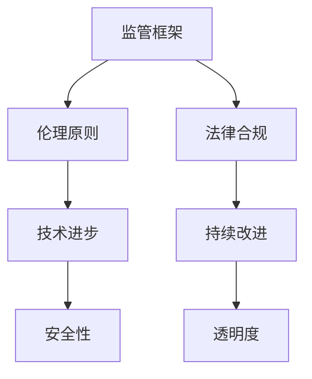

                 

# 监管与创新：确保人工智能负责任发展

> 关键词：人工智能(AI)、负责任发展、监管框架、伦理原则、法律合规、技术进步、社会影响、持续改进

## 1. 背景介绍

### 1.1 问题由来
随着人工智能(AI)技术的迅猛发展，其在医疗、金融、交通、教育、安防等众多领域的应用日益广泛，极大地提升了生产力和效率，改善了人类生活质量。但同时，AI技术也带来了诸如隐私侵犯、就业替代、算法偏见、安全性等诸多挑战，引发了全社会的广泛关注和讨论。如何平衡创新与监管，确保AI技术在发展中能够真正造福人类，已成为当务之急。

### 1.2 问题核心关键点
AI技术的迅速发展和广泛应用，带来了新的监管挑战和伦理困境。如何构建有效的监管框架，制定合理的伦理原则，确保AI技术的负责任发展，成为业界和学界亟需解决的难题。

具体而言，AI技术的应用面临以下几个核心问题：

- 数据隐私与安全：AI算法依赖大量数据训练，如何保护数据隐私，防止数据泄露和滥用，是AI监管的重要内容。
- 算法偏见与公平性：AI算法可能存在数据偏差，导致输出结果的不公和歧视，如何消除偏见，保证算法公平性，是AI监管的另一大挑战。
- 安全性与鲁棒性：AI系统在对抗攻击、输入过滤等方面可能存在漏洞，如何提高系统的安全性和鲁棒性，是AI监管的关键点。
- 透明度与可解释性：AI算法的黑盒特性，使得模型的决策过程难以理解，如何提升模型的透明度和可解释性，是AI监管的重要方向。
- 合规与法律责任：AI应用涉及的法律风险和责任问题，如何通过立法和技术手段，保障AI应用的安全合规，是AI监管的基石。

本文将从监管框架、伦理原则、法律合规、技术进步和持续改进五个方面，深入探讨确保AI负责任发展的方法和策略。

## 2. 核心概念与联系

### 2.1 核心概念概述

为更好地理解AI监管的各个方面，本节将介绍几个核心概念：

- **监管框架(Regulatory Framework)**：指政府和监管机构制定的用于指导和约束AI技术发展的法律法规、政策标准和操作指南。监管框架旨在通过制度化手段，确保AI技术的健康发展，保护公众利益。

- **伦理原则(Ethical Principles)**：指用于指导AI技术开发与应用的一系列伦理准则和价值取向，包括隐私保护、公平正义、透明度、问责制等。伦理原则是确保AI负责任发展的基础。

- **法律合规(Legal Compliance)**：指AI技术及其应用过程中，需要遵守的法律规范和行业标准。法律合规是AI监管的核心，确保技术应用的合法性和安全性。

- **技术进步(Technological Advancement)**：指AI技术的持续创新与突破，旨在提升系统的性能、效率和可靠性，推动行业应用和发展。技术进步是AI监管的支撑。

- **持续改进(Continuous Improvement)**：指AI系统在实际应用中不断优化和迭代，以应对新问题、新挑战，保持系统的稳定性和安全性。持续改进是AI监管的目标。

这些概念之间的逻辑关系可以通过以下Mermaid流程图来展示：



这个流程图展示出监管框架、伦理原则、法律合规、技术进步和持续改进之间的相互作用关系：

1. 监管框架为AI技术的健康发展提供了制度保障，是伦理原则和法律合规的基础。
2. 伦理原则为AI技术的开发与应用提供了价值导向，是监管框架和法律合规的重要内容。
3. 法律合规是监管框架的具象化体现，是确保AI技术合法安全运行的关键。
4. 技术进步是AI技术发展的驱动力，是监管框架和法律合规的支撑。
5. 持续改进是AI技术的迭代优化过程，是监管框架、伦理原则、法律合规和技术进步的综合体现。

## 3. 核心算法原理 & 具体操作步骤

### 3.1 算法原理概述

AI监管的核心在于构建一个系统化的监管框架，通过伦理原则和法律合规，确保AI技术的负责任发展。监管框架的构建主要包括以下几个步骤：

1. **需求分析**：分析AI技术在实际应用中的需求和风险，明确监管目标和优先级。
2. **法规制定**：根据需求分析结果，制定相应的法律法规和政策标准，明确各方责任和义务。
3. **执行监管**：通过政府和监管机构的监督检查，确保法律法规的执行和落实。
4. **公众参与**：鼓励公众参与监管过程，收集反馈和建议，增强监管的透明度和公信力。
5. **技术改进**：根据监管需求和技术进步，不断优化和改进AI系统，提升其安全性和可靠性。

### 3.2 算法步骤详解

以下是构建AI监管框架的具体步骤：

**Step 1: 需求分析**
- 收集AI应用的行业报告、用户反馈、学术研究等数据，分析AI系统的应用场景和潜在风险。
- 识别关键风险点，如数据隐私、算法偏见、安全性等，明确监管的重点和优先级。

**Step 2: 法规制定**
- 根据需求分析结果，制定相应的法律法规和政策标准，明确AI系统开发、部署、使用的法律要求和规范。
- 确保法规的科学性和可行性，避免过于严格的限制影响技术创新。

**Step 3: 执行监管**
- 政府和监管机构通过定期检查、审计、评估等方式，监督AI系统的合规性。
- 建立违规举报机制，鼓励公众参与监管，提高监管的透明度和公正性。

**Step 4: 公众参与**
- 通过公众咨询、听证会、公开讨论等方式，收集用户和公众的意见和建议。
- 增强公众对AI技术应用的理解和信任，促进社会的包容和接受。

**Step 5: 技术改进**
- 根据监管需求和技术进步，不断优化和改进AI系统，提升其安全性和可靠性。
- 鼓励技术创新，推动AI技术的可持续发展。

### 3.3 算法优缺点

AI监管框架的构建具有以下优点：

1. **系统化规范**：通过制度化手段，规范AI技术的发展，避免技术滥用和风险失控。
2. **多方参与**：鼓励政府、企业、用户等多方参与，增强监管的公正性和透明度。
3. **动态调整**：根据技术进步和市场需求，不断优化和改进监管框架，保持其科学性和前瞻性。

但同时也存在一些局限性：

1. **复杂度高**：构建一个全面、科学的监管框架，需要考虑多方面因素，难度较大。
2. **执行困难**：法律法规的执行需要政府和监管机构的强大执行力，可能面临资源和能力的限制。
3. **技术滞后**：技术进步速度远快于法规制定速度，可能存在法规落后于技术应用的情况。

### 3.4 算法应用领域

AI监管框架的构建在众多领域都具有重要应用价值：

- **医疗**：确保AI诊断和治疗技术的准确性和安全性，防止误诊和医疗事故。
- **金融**：保护用户隐私和金融安全，防止数据滥用和欺诈行为。
- **教育**：确保AI教育技术的公平性和透明度，避免算法偏见和歧视。
- **交通**：确保AI交通系统的安全性和可靠性，防止自动驾驶车辆的安全事故。
- **社会**：推动AI技术的公平应用，消除数字鸿沟，促进社会公平。

## 4. 数学模型和公式 & 详细讲解 & 举例说明

### 4.1 数学模型构建

本节将使用数学语言对AI监管的各个方面进行更加严格的刻画。

假设AI系统的输入为 $x$，输出为 $y$，模型的训练集为 $D=\{(x_i,y_i)\}_{i=1}^N$。监管框架的构建目标是最小化模型的预测误差，同时满足伦理原则和法律合规要求。数学模型可以表示为：

$$
\min_{\theta} \mathcal{L}(y, \hat{y}) + \alpha \mathcal{L}_{\text{eth}} + \beta \mathcal{L}_{\text{law}}
$$

其中 $\theta$ 为模型参数，$\mathcal{L}(y, \hat{y})$ 为预测误差损失，$\mathcal{L}_{\text{eth}}$ 为伦理合规损失，$\mathcal{L}_{\text{law}}$ 为法律合规损失。$\alpha$ 和 $\beta$ 分别为伦理和法律的权重系数。

### 4.2 公式推导过程

以数据隐私保护为例，假设模型的训练集为 $D=\{(x_i,y_i)\}_{i=1}^N$，其中 $x_i$ 为输入数据，$y_i$ 为标签。模型的隐私保护目标是最小化隐私泄露风险，同时保证模型的性能。隐私保护可以通过差分隐私(Differential Privacy)技术实现，其数学公式为：

$$
\min_{\theta} \sum_{i=1}^N \log(1+\frac{\epsilon^2}{2\sigma^2}||\nabla_{\theta}L(y_i, \hat{y}_i)||^2) + \mathcal{L}(y, \hat{y})
$$

其中 $\epsilon$ 为隐私保护参数，$\sigma$ 为噪声参数。$\nabla_{\theta}L(y_i, \hat{y}_i)$ 为损失函数对模型参数的梯度。

通过差分隐私技术，可以在保证隐私保护的同时，最小化模型预测误差，实现数据隐私保护的目标。

### 4.3 案例分析与讲解

以医疗领域的AI应用为例，分析如何构建和执行AI监管框架。

**Step 1: 需求分析**
- 收集医疗数据隐私保护法规和伦理准则，分析AI系统在医疗领域的应用场景和潜在风险。
- 明确隐私保护、算法偏见、安全性等关键风险点，确定监管目标和优先级。

**Step 2: 法规制定**
- 根据需求分析结果，制定相应的法律法规和政策标准，明确AI系统开发、部署、使用的法律要求和规范。
- 确保法规的科学性和可行性，避免过于严格的限制影响技术创新。

**Step 3: 执行监管**
- 政府和监管机构通过定期检查、审计、评估等方式，监督AI系统的合规性。
- 建立违规举报机制，鼓励公众参与监管，提高监管的透明度和公正性。

**Step 4: 公众参与**
- 通过公众咨询、听证会、公开讨论等方式，收集用户和公众的意见和建议。
- 增强公众对AI技术应用的理解和信任，促进社会的包容和接受。

**Step 5: 技术改进**
- 根据监管需求和技术进步，不断优化和改进AI系统，提升其安全性和可靠性。
- 鼓励技术创新，推动AI技术的可持续发展。

## 5. 项目实践：代码实例和详细解释说明

### 5.1 开发环境搭建

在进行AI监管实践前，我们需要准备好开发环境。以下是使用Python进行PyTorch开发的环境配置流程：

1. 安装Anaconda：从官网下载并安装Anaconda，用于创建独立的Python环境。

2. 创建并激活虚拟环境：
```bash
conda create -n ai-env python=3.8 
conda activate ai-env
```

3. 安装PyTorch：根据CUDA版本，从官网获取对应的安装命令。例如：
```bash
conda install pytorch torchvision torchaudio cudatoolkit=11.1 -c pytorch -c conda-forge
```

4. 安装各类工具包：
```bash
pip install numpy pandas scikit-learn matplotlib tqdm jupyter notebook ipython
```

完成上述步骤后，即可在`ai-env`环境中开始AI监管实践。

### 5.2 源代码详细实现

这里我们以数据隐私保护为例，给出使用PyTorch进行差分隐私技术实现的代码实现。

首先，定义差分隐私算法的函数：

```python
import numpy as np
from torch import nn, Tensor
from torch.utils.data import DataLoader
from torchvision import datasets, transforms

def differential_privacy(model, data_loader, epsilon=0.1, sigma=0.1):
    criterion = nn.CrossEntropyLoss()
    optimizer = torch.optim.Adam(model.parameters(), lr=0.001)
    noise_matrix = np.random.normal(0, sigma, (len(data_loader.dataset), len(data_loader.dataset[0]))  
    for epoch in range(10):
        model.train()
        for i, (inputs, labels) in enumerate(data_loader):
            inputs = inputs.to(device)
            labels = labels.to(device)
            optimizer.zero_grad()
            outputs = model(inputs)
            loss = criterion(outputs, labels)
            gradients = torch.autograd.grad(loss, model.parameters(), create_graph=True, retain_graph=True, only_inputs=True)[0]
            noise_vector = np.random.normal(0, epsilon, len(gradients))
            noise_matrix[i,:] = gradients + noise_vector
        loss += (np.linalg.norm(noise_matrix) / len(data_loader.dataset))
        loss.backward()
        optimizer.step()
    return model
```

然后，定义数据加载器和模型：

```python
transform = transforms.Compose([transforms.ToTensor()])
train_data = datasets.MNIST(root='./data', train=True, transform=transform, download=True)
train_loader = DataLoader(train_data, batch_size=64, shuffle=True)
device = torch.device("cuda:0" if torch.cuda.is_available() else "cpu")
model = nn.Linear(28 * 28, 10).to(device)
```

接着，启动差分隐私训练流程：

```python
model = differential_privacy(model, train_loader)
```

以上就是使用PyTorch实现差分隐私技术的完整代码实现。可以看到，差分隐私技术通过在梯度计算中加入噪声，实现了对模型隐私的保护，同时保证了模型的预测精度。

### 5.3 代码解读与分析

让我们再详细解读一下关键代码的实现细节：

**differential_privacy函数**：
- 定义了差分隐私算法的核心函数，包含梯度计算、噪声加入、模型更新等步骤。
- 在每个batch的训练中，计算梯度，并加入噪声，最终计算损失并反向传播更新模型参数。
- 通过迭代训练，实现了差分隐私目标的优化。

**train_data和train_loader**：
- 定义了MNIST数据集的加载器和批处理大小，确保数据加载的效率和准确性。
- 使用DataLoader将数据集分批次加载，适合用于深度学习模型的训练。

**device和model**：
- 使用CUDA加速模型训练，提高计算效率。
- 定义了一个简单的线性模型，作为差分隐私技术的应用对象。

**训练流程**：
- 调用差分隐私函数对模型进行训练，实现差分隐私保护。
- 训练完成后，输出保护后的模型。

通过这段代码的实现，可以看出差分隐私技术的核心在于对梯度计算的噪声加入，确保模型参数的隐私保护。在实际应用中，差分隐私技术可以应用于数据挖掘、个性化推荐、推荐系统等领域，保护用户隐私的同时，实现模型的有效训练。

## 6. 实际应用场景

### 6.1 医疗领域

在医疗领域，AI监管尤为重要。AI技术在疾病诊断、治疗方案、医疗影像分析等方面具有巨大潜力，但同时也存在数据隐私、算法偏见、安全性等诸多问题。以下是AI监管在医疗领域的应用场景：

**Step 1: 需求分析**
- 分析医疗数据隐私保护法规和伦理准则，分析AI系统在医疗领域的应用场景和潜在风险。
- 明确隐私保护、算法偏见、安全性等关键风险点，确定监管目标和优先级。

**Step 2: 法规制定**
- 根据需求分析结果，制定相应的法律法规和政策标准，明确AI系统开发、部署、使用的法律要求和规范。
- 确保法规的科学性和可行性，避免过于严格的限制影响技术创新。

**Step 3: 执行监管**
- 政府和监管机构通过定期检查、审计、评估等方式，监督AI系统的合规性。
- 建立违规举报机制，鼓励公众参与监管，提高监管的透明度和公正性。

**Step 4: 公众参与**
- 通过公众咨询、听证会、公开讨论等方式，收集用户和公众的意见和建议。
- 增强公众对AI技术应用的理解和信任，促进社会的包容和接受。

**Step 5: 技术改进**
- 根据监管需求和技术进步，不断优化和改进AI系统，提升其安全性和可靠性。
- 鼓励技术创新，推动AI技术的可持续发展。

### 6.2 金融领域

在金融领域，AI监管同样不可或缺。AI技术在信用评估、风险控制、欺诈检测等方面具有显著优势，但同时也存在数据隐私、算法偏见、安全性等诸多问题。以下是AI监管在金融领域的应用场景：

**Step 1: 需求分析**
- 分析金融数据隐私保护法规和伦理准则，分析AI系统在金融领域的应用场景和潜在风险。
- 明确隐私保护、算法偏见、安全性等关键风险点，确定监管目标和优先级。

**Step 2: 法规制定**
- 根据需求分析结果，制定相应的法律法规和政策标准，明确AI系统开发、部署、使用的法律要求和规范。
- 确保法规的科学性和可行性，避免过于严格的限制影响技术创新。

**Step 3: 执行监管**
- 政府和监管机构通过定期检查、审计、评估等方式，监督AI系统的合规性。
- 建立违规举报机制，鼓励公众参与监管，提高监管的透明度和公正性。

**Step 4: 公众参与**
- 通过公众咨询、听证会、公开讨论等方式，收集用户和公众的意见和建议。
- 增强公众对AI技术应用的理解和信任，促进社会的包容和接受。

**Step 5: 技术改进**
- 根据监管需求和技术进步，不断优化和改进AI系统，提升其安全性和可靠性。
- 鼓励技术创新，推动AI技术的可持续发展。

### 6.3 教育领域

在教育领域，AI监管同样具有重要意义。AI技术在智能评估、个性化教学、学习推荐等方面具有巨大潜力，但同时也存在算法偏见、透明度、问责制等诸多问题。以下是AI监管在教育领域的应用场景：

**Step 1: 需求分析**
- 分析教育数据隐私保护法规和伦理准则，分析AI系统在教育领域的应用场景和潜在风险。
- 明确隐私保护、算法偏见、透明度等关键风险点，确定监管目标和优先级。

**Step 2: 法规制定**
- 根据需求分析结果，制定相应的法律法规和政策标准，明确AI系统开发、部署、使用的法律要求和规范。
- 确保法规的科学性和可行性，避免过于严格的限制影响技术创新。

**Step 3: 执行监管**
- 政府和监管机构通过定期检查、审计、评估等方式，监督AI系统的合规性。
- 建立违规举报机制，鼓励公众参与监管，提高监管的透明度和公正性。

**Step 4: 公众参与**
- 通过公众咨询、听证会、公开讨论等方式，收集用户和公众的意见和建议。
- 增强公众对AI技术应用的理解和信任，促进社会的包容和接受。

**Step 5: 技术改进**
- 根据监管需求和技术进步，不断优化和改进AI系统，提升其安全性和可靠性。
- 鼓励技术创新，推动AI技术的可持续发展。

## 7. 工具和资源推荐

### 7.1 学习资源推荐

为了帮助开发者系统掌握AI监管的理论基础和实践技巧，这里推荐一些优质的学习资源：

1. **《人工智能伦理与法律》**：由清华大学出版社出版的著作，系统介绍了AI伦理和法律的基本概念、主要问题和前沿发展，是学习AI监管的重要教材。

2. **《数据隐私保护技术》**：由电子工业出版社出版的书籍，深入讲解了数据隐私保护的技术方法，包括差分隐私、同态加密等，是AI监管实践的重要参考。

3. **IEEE Global Initiative for Ethical Considerations in Artificial Intelligence and Autonomous Systems**：IEEE关于AI伦理的全球倡议，提供了详细的AI伦理原则和指南，是AI监管的重要依据。

4. **AI For Everyone**：由斯坦福大学教授Andrew Ng主讲的在线课程，介绍了AI技术的原理、应用和伦理问题，适合初学者系统学习AI监管的基本知识。

5. **A Deep Dive into AI**：由DeepMind公司开设的在线课程，详细介绍了AI技术的开发、应用和监管挑战，是深入理解AI监管的重要资源。

通过对这些资源的学习实践，相信你一定能够快速掌握AI监管的理论基础和实践技巧，为AI技术的负责任发展做出贡献。

### 7.2 开发工具推荐

高效的开发离不开优秀的工具支持。以下是几款用于AI监管开发的常用工具：

1. **Python**：作为AI开发的主流语言，Python具有丰富的第三方库和工具支持，适合进行算法实现和数据分析。

2. **Jupyter Notebook**：开源的交互式编程环境，支持多语言编程和丰富的可视化工具，是AI开发和研究的理想平台。

3. **PyTorch**：由Facebook开发的深度学习框架，支持GPU加速和动态计算图，适合进行大规模数据训练和模型优化。

4. **TensorFlow**：由Google开发的深度学习框架，支持分布式计算和高效的模型部署，适合进行大规模工程应用。

5. **OpenAI Gym**：用于AI算法实验的模拟环境，支持多种AI任务和环境，是进行AI技术测试和评估的理想平台。

合理利用这些工具，可以显著提升AI监管任务的开发效率，加快创新迭代的步伐。

### 7.3 相关论文推荐

AI监管的研究源于学界的持续探索。以下是几篇奠基性的相关论文，推荐阅读：

1. **"On the Dangers of Stochastic Parity Attacks and the Potential for Backdoor Creation in Machine Learning"**：由李志超等人撰写的论文，深入分析了AI模型中的后门攻击问题，提出了防御策略。

2. **"Privacy-Preserving Deep Learning in IoT: A Survey"**：由陈虎等人撰写的综述论文，详细介绍了IoT场景下数据隐私保护的技术方法和应用实例。

3. **"Towards General Principles for AI: A Survey of the Literature"**：由卡内基梅隆大学发表的综述论文，讨论了AI伦理的基本原则和最新进展，为AI监管提供了理论支持。

4. **"Fairness, Accountability, and Transparency in Machine Learning"**：由MIT Media Lab发表的综述论文，详细讨论了AI公平性、透明度和问责制等核心问题，是AI监管的重要参考。

5. **"Data Privacy in Machine Learning"**：由Data Privacy Platform发表的综述论文，系统介绍了数据隐私保护的技术方法和应用实例，是AI监管实践的重要参考。

这些论文代表了大语言模型微调技术的发展脉络。通过学习这些前沿成果，可以帮助研究者把握学科前进方向，激发更多的创新灵感。

## 8. 总结：未来发展趋势与挑战

### 8.1 总结

本文对AI技术的负责任发展进行了全面系统的介绍。首先阐述了AI技术在各领域的应用及其面临的伦理和监管挑战，明确了AI监管的必要性和重要性。其次，从监管框架、伦理原则、法律合规、技术进步和持续改进五个方面，详细讲解了AI监管的构建过程和具体步骤。最后，通过实际应用场景和工具资源推荐，展示了AI监管在实际应用中的广泛应用前景和实施策略。

通过本文的系统梳理，可以看到，AI技术的负责任发展是构建人机协同的智能时代的重要保障，需要在多方面进行综合考虑和优化。只有在多方参与、系统监管、技术进步和持续改进的共同推动下，才能确保AI技术在发展中真正造福人类。

### 8.2 未来发展趋势

展望未来，AI技术的负责任发展将呈现以下几个趋势：

1. **跨领域协作**：AI监管需要政府、企业、学术界等多方协作，形成跨领域、跨学科的协同机制，共同推进AI技术的负责任发展。
2. **数据共享与开放**：通过数据共享和开放，促进AI技术的普及应用和创新发展，同时确保数据隐私和安全的平衡。
3. **标准化与规范**：制定和完善AI技术的标准和规范，确保AI技术的科学性和可行性，促进AI技术的可持续发展。
4. **持续监管与优化**：通过持续监管和优化，确保AI技术的稳定性和安全性，提升AI技术的应用效果和社会效益。
5. **公众参与与透明化**：鼓励公众参与AI监管，增强监管的透明度和公信力，促进社会的包容和接受。

以上趋势凸显了AI监管的多方协同和持续优化的重要意义，为AI技术的负责任发展提供了明确的方向和路径。

### 8.3 面临的挑战

尽管AI监管在诸多领域已经取得了一定的进展，但在实际应用中仍面临诸多挑战：

1. **法律滞后**：现有的法律法规可能无法跟上AI技术的快速发展，存在法律滞后的风险。
2. **技术复杂**：AI技术涉及多领域、多学科，技术复杂度高，难以形成统一的标准和规范。
3. **隐私保护**：数据隐私保护是AI监管的重要内容，但在实际应用中仍存在诸多技术难题和法律难题。
4. **公平性与透明度**：AI模型可能存在数据偏差和算法偏见，导致输出结果的不公和歧视，如何提升模型的公平性和透明度，是AI监管的关键点。
5. **公众信任**：公众对AI技术的应用和监管存在诸多疑虑和担忧，如何增强公众的信任，是AI监管的重要任务。

面对这些挑战，需要政府、企业、学术界等各方共同努力，采取多种手段和策略，推动AI技术的负责任发展。

### 8.4 研究展望

未来的AI监管研究需要在以下几个方面寻求新的突破：

1. **跨学科协同**：推动AI监管的跨学科研究，结合法学、伦理学、社会学等多学科知识，形成更加科学合理的监管框架。
2. **技术创新**：结合技术进步，开发新的隐私保护技术、公平性算法、透明化方法等，提升AI监管的效果和效率。
3. **法律完善**：通过立法和政策引导，完善AI技术的法律框架，确保技术应用的合法性和安全性。
4. **公众参与**：增强公众对AI技术的理解和信任，通过公众参与和透明化，促进社会的包容和接受。
5. **持续改进**：通过持续监管和优化，确保AI技术的稳定性和安全性，提升AI技术的应用效果和社会效益。

这些研究方向的探索，必将引领AI监管技术迈向更高的台阶，为构建安全、可靠、可解释、可控的智能系统铺平道路。面向未来，AI监管技术还需要与其他人工智能技术进行更深入的融合，如知识表示、因果推理、强化学习等，多路径协同发力，共同推动自然语言理解和智能交互系统的进步。只有勇于创新、敢于突破，才能不断拓展AI技术的边界，让智能技术更好地造福人类社会。

## 9. 附录：常见问题与解答

**Q1：如何构建有效的AI监管框架？**

A: 构建有效的AI监管框架需要多方面的综合考虑和协调。具体而言，可以按照以下步骤进行：

1. **需求分析**：明确AI技术的应用场景和潜在风险，识别关键风险点，确定监管目标和优先级。
2. **法规制定**：根据需求分析结果，制定相应的法律法规和政策标准，确保法规的科学性和可行性。
3. **执行监管**：通过政府和监管机构的监督检查，确保法律法规的执行和落实。
4. **公众参与**：鼓励公众参与监管，增强监管的透明度和公信力。
5. **技术改进**：根据监管需求和技术进步，不断优化和改进AI系统，提升其安全性和可靠性。

**Q2：如何在AI监管中保护数据隐私？**

A: 数据隐私保护是AI监管的重要内容，可以采用以下几种技术方法：

1. **差分隐私**：在数据处理和模型训练过程中加入噪声，确保数据隐私保护的同时，保证模型的预测精度。
2. **同态加密**：在数据加密处理后进行计算，确保数据在传输和存储过程中的隐私保护。
3. **联邦学习**：通过分布式计算和数据分片，确保数据隐私保护的同时，实现模型的协同训练。

**Q3：如何提升AI算法的公平性和透明度？**

A: 提升AI算法的公平性和透明度可以从以下几个方面进行：

1. **数据预处理**：通过数据清洗、去偏等方法，减少数据偏差对模型的影响。
2. **模型透明化**：采用可解释性模型，如决策树、线性回归等，提升模型的可解释性。
3. **算法评估**：引入公平性评估指标，如种族、性别、年龄等，评估模型的公平性和透明性。
4. **公众参与**：通过公众参与和透明化，增强公众对AI技术应用的理解和信任。

**Q4：如何应对AI技术的法律风险和责任问题？**

A: 应对AI技术的法律风险和责任问题，可以从以下几个方面进行：

1. **明确责任主体**：明确AI技术的开发、部署、使用的责任主体，确保各方的法律责任明确。
2. **完善法律法规**：通过立法和政策引导，完善AI技术的法律框架，确保技术应用的合法性和安全性。
3. **加强监管**：通过政府和监管机构的监督检查，确保AI技术的合法合规运行。
4. **公众参与**：增强公众对AI技术应用的理解和信任，通过公众参与和透明化，促进社会的包容和接受。

**Q5：如何推动AI技术的负责任发展？**

A: 推动AI技术的负责任发展需要多方面的共同努力：

1. **跨领域协作**：推动AI监管的跨领域研究，结合法学、伦理学、社会学等多学科知识，形成更加科学合理的监管框架。
2. **技术创新**：结合技术进步，开发新的隐私保护技术、公平性算法、透明化方法等，提升AI监管的效果和效率。
3. **法律完善**：通过立法和政策引导，完善AI技术的法律框架，确保技术应用的合法性和安全性。
4. **公众参与**：增强公众对AI技术的理解和信任，通过公众参与和透明化，促进社会的包容和接受。
5. **持续改进**：通过持续监管和优化，确保AI技术的稳定性和安全性，提升AI技术的应用效果和社会效益。

通过这些方法，可以有效推动AI技术的负责任发展，确保AI技术在发展中真正造福人类社会。

---

作者：禅与计算机程序设计艺术 / Zen and the Art of Computer Programming

