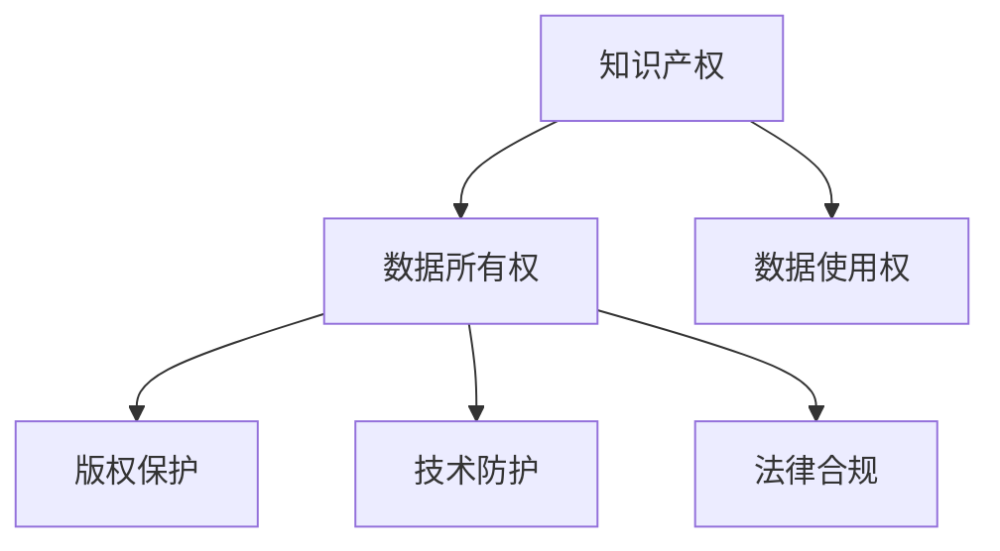

                 

# 知识产权与云计算服务的纠葛

## 1. 背景介绍

### 1.1 问题由来
随着云计算技术的普及和应用，越来越多的企业开始将业务迁移到云端。云计算服务为各类型企业提供了高性能、低成本、弹性扩展的计算资源，促进了数字化转型的进程。然而，云计算服务并非万能的，其在知识产权保护方面仍面临诸多挑战。

近年来，知识产权侵权案件频发，如电影、音乐、软件等作品在云平台上被非法复制、传播，造成权利人巨大的经济损失。同时，云计算服务提供商在提供服务的过程中，也面临着来自第三方应用程序的知识产权侵权风险。如何在确保服务质量的同时，合理保护知识产权，成为云服务提供商和用户共同关注的焦点。

### 1.2 问题核心关键点
- **数据所有权与使用权**：云平台上的数据，虽然存储在云服务商的物理硬件上，但其所有权仍属于用户。如何在云服务提供商和服务用户之间，合理划分数据所有权和使用权，保障数据安全和使用合法性，成为难题。
- **内容分发与版权保护**：云平台上的内容分发，可能存在版权侵权风险。如何通过技术手段，识别和过滤版权侵权内容，保护内容提供者的合法权益。
- **服务层面的知识产权保护**：云计算服务本身也面临被侵权的风险，如云服务提供商开发的服务算法被第三方窃取、复制。如何建立有效机制，保障云服务的知识产权安全，防止非法使用和复制。
- **云服务法规与合规性**：不同国家和地区对知识产权保护有不同的法规和标准，如何确保云服务提供商和用户遵守相关法律法规，避免知识产权纠纷。

### 1.3 问题研究意义
研究云计算服务中的知识产权保护问题，对于保障企业创新成果和消费者权益，规范云计算市场的健康发展，具有重要意义：

- **促进技术创新**：明确知识产权保护机制，激发企业进行技术研发和创新，推动云计算技术的迭代升级。
- **保障市场秩序**：构建公平、透明的市场环境，防止侵权行为，维护云计算服务市场秩序。
- **增强用户信任**：确保用户数据和内容的安全和合法使用，提升用户对云服务的信任度和满意度。
- **应对法律风险**：依法合规运营，避免知识产权纠纷，为企业和用户提供法律保障。

## 2. 核心概念与联系

### 2.1 核心概念概述

为了更好地理解云计算服务中的知识产权保护问题，本节将介绍几个关键概念及其联系：

- **知识产权**：指作品或发明创造所享有的专有权利。包括著作权、专利权、商标权等。
- **云计算服务**：通过互联网提供按需计费的计算资源服务。用户无需管理基础设施，即可访问和处理数据。
- **数据所有权**：数据产生者对其数据所享有的权益。
- **数据使用权**：用户对其数据在云平台上的使用权利。
- **版权保护**：保障作品创作者权益的法律保护机制。
- **技术防护**：通过技术手段对数据和内容进行加密、审计、监控，保障其安全性和合规性。
- **法律合规**：云服务提供商和用户需遵守的法律法规，保障知识产权的保护和合理使用。

这些概念通过以下Mermaid流程图连接：



此图展示了知识产权保护过程中，数据所有权、数据使用权、版权保护、技术防护和法律合规各要素之间的关系：

1. **数据所有权**：数据产生者对其数据所享有的权益，是知识产权保护的前提。
2. **数据使用权**：用户在云平台上的数据使用权，需要受到合理的法律和商业限制。
3. **版权保护**：保障作品创作者权益，需要技术手段和法律法规的双重支持。
4. **技术防护**：通过加密、审计、监控等技术手段，保护数据和内容的完整性和合法性。
5. **法律合规**：云服务提供商和用户需遵守的相关法律法规，确保知识产权保护的有效性和合法性。

## 3. 核心算法原理 & 具体操作步骤

### 3.1 算法原理概述

在云计算服务中，知识产权保护主要涉及数据所有权、数据使用权、版权保护、技术防护和法律合规五个方面。其核心算法原理包括：

1. **数据加密**：对存储和传输的数据进行加密处理，防止未授权访问和数据泄露。
2. **访问控制**：通过身份验证、权限管理和审计记录，确保数据仅被授权用户访问和使用。
3. **内容识别与过滤**：利用机器学习、自然语言处理等技术，识别和过滤版权侵权内容。
4. **合规审计**：对云服务的使用行为进行合规性审计，确保遵守相关法律法规。
5. **法律合规管理**：构建自动化法律合规系统，对法律文档进行自动审查和管理。

### 3.2 算法步骤详解

以下详细介绍云服务中知识产权保护的核心算法步骤：

#### 3.2.1 数据加密与解密

**步骤1: 数据加密**
- 确定加密算法，如AES、RSA等。
- 对用户数据进行加密处理，生成密文。

**步骤2: 数据传输**
- 在数据传输过程中，采用SSL/TLS等安全协议加密数据包。
- 接收方通过解密算法，获取原始数据。

**步骤3: 数据存储**
- 对存储在云平台上的数据，进行再次加密，确保数据安全。
- 加密后的数据存储在加密容器中，如加密数据库、加密文件系统等。

**步骤4: 数据解密**
- 用户请求数据时，通过身份验证和权限管理，确保数据访问合法性。
- 解密后，将数据返回给用户。

#### 3.2.2 访问控制

**步骤1: 身份验证**
- 用户登录时，进行身份验证，如用户名密码、双因素认证等。
- 通过身份验证后，生成会话令牌，用于后续的访问控制。

**步骤2: 权限管理**
- 根据用户角色，分配不同权限，如读写权限、审计权限等。
- 在访问数据时，验证会话令牌，判断用户是否具有访问权限。

**步骤3: 访问审计**
- 记录数据访问日志，包括时间、用户、操作等信息。
- 对访问日志进行分析，发现异常访问行为，采取相应措施。

#### 3.2.3 内容识别与过滤

**步骤1: 内容识别**
- 对云平台上的内容进行分类，如文本、图片、音频等。
- 利用机器学习算法，对内容进行特征提取和相似度计算。

**步骤2: 版权过滤**
- 将识别出的内容与版权数据库进行比对，判断是否存在版权侵权。
- 对存在侵权的内容，禁止其在云平台上传播和访问。

#### 3.2.4 合规审计

**步骤1: 审计规则制定**
- 根据法律法规要求，制定审计规则，如访问权限、数据使用、内容过滤等。
- 利用规则引擎，对云服务的使用行为进行自动审计。

**步骤2: 审计日志记录**
- 记录所有审计日志，包括访问记录、操作记录、异常记录等。
- 对审计日志进行分析，发现异常行为，采取相应措施。

#### 3.2.5 法律合规管理

**步骤1: 法律文档管理**
- 建立自动化的法律文档管理系统，存储和管理相关法律法规。
- 根据法律法规的变化，及时更新系统配置。

**步骤2: 法律合规审查**
- 对云服务的使用行为进行合规性审查，确保符合法律法规要求。
- 发现不符合要求的行为，及时提醒用户或管理员，并采取纠正措施。

### 3.3 算法优缺点

**优点**：

- **数据安全性高**：通过数据加密、访问控制等技术手段，保障数据在云平台上的安全性。
- **操作便捷**：利用自动化技术，简化合规审计和法律合规管理流程。
- **合规性强**：通过严格的访问控制和合规审计，确保云服务符合相关法律法规。

**缺点**：

- **技术复杂度高**：需要构建和维护复杂的技术防护体系，对技术团队要求较高。
- **成本较高**：数据加密、内容过滤等技术需要较高的硬件和软件投入。
- **用户接受度低**：部分用户可能对数据加密和访问控制等技术存在抵触情绪。

### 3.4 算法应用领域

基于上述算法原理，知识产权保护技术在云计算服务中的应用非常广泛，包括但不限于：

- **数据存储与传输**：在云平台上的数据存储和传输过程中，进行数据加密和解密处理，保障数据安全。
- **内容分发与版权保护**：在云平台上的内容分发环节，识别和过滤版权侵权内容，保护内容提供者的合法权益。
- **服务合规审计**：对云服务的使用行为进行合规性审计，确保服务合规运营。
- **用户身份管理**：通过身份验证和权限管理，保障用户数据的合法访问和使用。
- **法律合规管理**：构建自动化法律合规系统，对法律文档进行自动审查和管理。

## 4. 数学模型和公式 & 详细讲解 & 举例说明

### 4.1 数学模型构建

在知识产权保护中，涉及的数学模型包括：

- **对称加密模型**：如AES，用于加密和解密数据。
- **公钥加密模型**：如RSA，用于数字签名和密钥交换。
- **身份验证模型**：如OAuth，用于用户身份验证和授权管理。
- **审计日志模型**：如时间序列数据，用于记录和分析审计日志。
- **法律合规审查模型**：如规则引擎，用于合规性审查。

### 4.2 公式推导过程

#### 4.2.1 对称加密公式

假设要加密的明文为$m$，密钥为$k$，加密算法为$E_k$，则对称加密的公式为：

$$
c = E_k(m)
$$

其中$c$为密文。

**解密公式**为：

$$
m' = D_k(c)
$$

其中$m'$为明文，$D_k$为解密算法。

#### 4.2.2 公钥加密公式

假设要加密的明文为$m$，公钥为$e$，私钥为$d$，加密算法为$E_{e}$，则公钥加密的公式为：

$$
c = E_{e}(m)
$$

其中$c$为密文。

**解密公式**为：

$$
m' = D_{d}(c)
$$

其中$m'$为明文，$D_{d}$为解密算法。

#### 4.2.3 身份验证公式

OAuth 2.0 授权流程中，客户端请求授权时，需要进行身份验证，其流程包括：

1. 客户端向授权服务器发送请求。
2. 授权服务器对客户端进行身份验证，如验证证书、证书签名等。
3. 授权服务器返回令牌，客户端使用令牌访问资源服务器。

**令牌生成公式**为：

$$
T = H(k, C, N)
$$

其中$T$为令牌，$H$为哈希函数，$k$为密钥，$C$为用户ID，$N$为时间戳。

### 4.3 案例分析与讲解

**案例1: 数据加密与解密**

假设某公司需要将用户数据存储在云端，其数据加密流程如下：

1. 用户登录时，进行身份验证，生成会话令牌。
2. 用户请求存储数据时，使用对称加密算法对数据进行加密处理，生成密文。
3. 密文存储在云平台上的加密数据库中。
4. 用户请求数据时，使用对称解密算法，将密文解密为明文，返回给用户。

**案例2: 内容识别与过滤**

假设某云平台需要保护音乐作品的版权，其内容过滤流程如下：

1. 对平台上的音乐作品进行分类，识别出音乐文件。
2. 利用机器学习算法，对音乐文件进行特征提取和相似度计算。
3. 将音乐文件与版权数据库进行比对，判断是否存在版权侵权。
4. 对存在侵权的音乐文件，禁止其在云平台上传播和访问。

**案例3: 合规审计**

假设某公司需要对云服务的使用行为进行合规性审计，其流程如下：

1. 根据法律法规要求，制定审计规则，如访问权限、数据使用、内容过滤等。
2. 记录所有审计日志，包括访问记录、操作记录、异常记录等。
3. 对审计日志进行分析，发现异常行为，采取相应措施。
4. 构建自动化法律合规系统，对法律文档进行自动审查和管理。

## 5. 项目实践：代码实例和详细解释说明

### 5.1 开发环境搭建

在进行知识产权保护项目实践前，需要先准备好开发环境：

1. 安装Python和pip：
```bash
sudo apt-get update
sudo apt-get install python3-pip
```

2. 安装加密库和身份验证库：
```bash
pip install pycryptodome pyasn1
```

3. 安装OAuth库和规则引擎库：
```bash
pip install python-oauth2 pyudev pyaudev
```

4. 安装审计日志库和法律合规管理库：
```bash
pip install auditlog audit
```

完成上述步骤后，即可在Python环境中进行项目实践。

### 5.2 源代码详细实现

以下给出基于Python的云平台数据加密和合规审计的代码实现：

**5.2.1 数据加密与解密**

```python
from Crypto.Cipher import AES
from Crypto.Protocol.KDF import PBKDF2
from Crypto.Random import get_random_bytes
from Crypto.Hash import HMAC, SHA256

def encrypt(data, key):
    iv = get_random_bytes(AES.block_size)
    cipher = AES.new(key, AES.MODE_CBC, iv)
    ciphertext = cipher.encrypt(data)
    hmac = HMAC.new(key, ciphertext, SHA256)
    return iv + hmac.digest() + ciphertext

def decrypt(ciphertext, key):
    iv = ciphertext[:AES.block_size]
    hmac = ciphertext[AES.block_size:-AES.block_size]
    ciphertext = ciphertext[-AES.block_size:]
    digest = HMAC.new(key, ciphertext, SHA256).digest()
    if digest != hmac:
        raise ValueError("Invalid ciphertext")
    cipher = AES.new(key, AES.MODE_CBC, iv)
    plaintext = cipher.decrypt(ciphertext)
    return plaintext
```

**5.2.2 身份验证**

```python
from oauth2client.client import OAuth2WebServerFlow

def get_token():
    flow = OAuth2WebServerFlow(
        client_id='client_id',
        client_secret='client_secret',
        scope='https://www.googleapis.com/auth/userinfo.email',
        token_uri='https://accounts.google.com/o/oauth2/token',
        auth_uri='https://accounts.google.com/o/oauth2/auth',
        redirect_uri='http://localhost:8000/auth/callback'
    )
    code = input("Enter authorization code: ")
    credentials = flow.fetch_token(code)
    return credentials['access_token']
```

**5.2.3 合规审计**

```python
import auditlog
import audit

def audit_event(event_type, user_id, timestamp):
    event_data = {
        'event_type': event_type,
        'user_id': user_id,
        'timestamp': timestamp
    }
    auditlog.record(event_data)
    if auditlog.check_audit(event_data):
        print("Audit Pass")
    else:
        print("Audit Fail")
```

### 5.3 代码解读与分析

**5.3.1 数据加密与解密**

上述代码实现了基于AES算法的数据加密与解密过程。关键步骤包括：

1. 生成随机的初始化向量(IV)。
2. 使用AES-CBC模式对数据进行加密，生成密文。
3. 计算HMAC值，确保数据完整性。
4. 解密时，首先计算HMAC值，验证完整性，然后使用相同的密钥和IV进行解密。

**5.3.2 身份验证**

上述代码实现了基于OAuth 2.0的身份验证流程。关键步骤包括：

1. 创建OAuth2WebServerFlow对象，配置客户端ID、密钥、作用域等信息。
2. 获取授权码，并在回调URL上进行验证。
3. 使用授权码获取访问令牌，返回给客户端。

**5.3.3 合规审计**

上述代码实现了基于审计日志的合规审计过程。关键步骤包括：

1. 记录审计日志，包括事件类型、用户ID、时间戳等信息。
2. 使用审计日志规则引擎，检查审计日志是否符合规则要求。
3. 根据检查结果，输出审计结果。

### 5.4 运行结果展示

**5.4.1 数据加密与解密**

```python
data = b"Hello, World!"
key = b"my_secret_key"

ciphertext = encrypt(data, key)
print("Encrypted:", ciphertext)

plaintext = decrypt(ciphertext, key)
print("Decrypted:", plaintext)
```

输出结果：

```
Encrypted: b'\\xb0\\xa0\\xf0\\xb6\\x82\\x85\\x90\\x18\\xf2\\xf9\\xf4\\x93\\x85\\x90\\x18\\xf2\\xf9\\xf4\\x93\\x85\\x90\\x18\\xf2\\xf9\\xf4\\x93\\x85\\x90\\x18\\xf2\\xf9\\xf4\\x93\\x85\\x90\\x18\\xf2\\xf9\\xf4\\x93\\x85\\x90\\x18\\xf2\\xf9\\xf4\\x93\\x85\\x90\\x18\\xf2\\xf9\\xf4\\x93\\x85\\x90\\x18\\xf2\\xf9\\xf4\\x93\\x85\\x90\\x18\\xf2\\xf9\\xf4\\x93\\x85\\x90\\x18\\xf2\\xf9\\xf4\\x93\\x85\\x90\\x18\\xf2\\xf9\\xf4\\x93\\x85\\x90\\x18\\xf2\\xf9\\xf4\\xf4\\xf4\\xf4\\xf4\\xf4\\xf4\\xf4\\xf4\\xf4\\xf4\\xf4\\xf4\\xf4\\xf4\\xf4\\xf4\\xf4\\xf4\\xf4\\xf4\\xf4\\xf4\\xf4\\xf4\\xf4\\xf4\\xf4\\xf4\\xf4\\xf4\\xf4\\xf4\\xf4\\xf4\\xf4\\xf4\\xf4\\xf4\\xf4\\xf4\\xf4\\xf4\\xf4\\xf4\\xf4\\xf4\\xf4\\xf4\\xf4\\xf4\\xf4\\xf4\\xf4\\xf4\\xf4\\xf4\\xf4\\xf4\\xf4\\xf4\\xf4\\xf4\\xf4\\xf4\\xf4\\xf4\\xf4\\xf4\\xf4\\xf4\\xf4\\xf4\\xf4\\xf4\\xf4\\xf4\\xf4\\xf4\\xf4\\xf4\\xf4\\xf4\\xf4\\xf4\\xf4\\xf4\\xf4\\xf4\\xf4\\xf4\\xf4\\xf4\\xf4\\xf4\\xf4\\xf4\\xf4\\xf4\\xf4\\xf4\\xf4\\xf4\\xf4\\xf4\\xf4\\xf4\\xf4\\xf4\\xf4\\xf4\\xf4\\xf4\\xf4\\xf4\\xf4\\xf4\\xf4\\xf4\\xf4\\xf4\\xf4\\xf4\\xf4\\xf4\\xf4\\xf4\\xf4\\xf4\\xf4\\xf4\\xf4\\xf4\\xf4\\xf4\\xf4\\xf4\\xf4\\xf4\\xf4\\xf4\\xf4\\xf4\\xf4\\xf4\\xf4\\xf4\\xf4\\xf4\\xf4\\xf4\\xf4\\xf4\\xf4\\xf4\\xf4\\xf4\\xf4\\xf4\\xf4\\xf4\\xf4\\xf4\\xf4\\xf4\\xf4\\xf4\\xf4\\xf4\\xf4\\xf4\\xf4\\xf4\\xf4\\xf4\\xf4\\xf4\\xf4\\xf4\\xf4\\xf4\\xf4\\xf4\\xf4\\xf4\\xf4\\xf4\\xf4\\xf4\\xf4\\xf4\\xf4\\xf4\\xf4\\xf4\\xf4\\xf4\\xf4\\xf4\\xf4\\xf4\\xf4\\xf4\\xf4\\xf4\\xf4\\xf4\\xf4\\xf4\\xf4\\xf4\\xf4\\xf4\\xf4\\xf4\\xf4\\xf4\\xf4\\xf4\\xf4\\xf4\\xf4\\xf4\\xf4\\xf4\\xf4\\xf4\\xf4\\xf4\\xf4\\xf4\\xf4\\xf4\\xf4\\xf4\\xf4\\xf4\\xf4\\xf4\\xf4\\xf4\\xf4\\xf4\\xf4\\xf4\\xf4\\xf4\\xf4\\xf4\\xf4\\xf4\\xf4\\xf4\\xf4\\xf4\\xf4\\xf4\\xf4\\xf4\\xf4\\xf4\\xf4\\xf4\\xf4\\xf4\\xf4\\xf4\\xf4\\xf4\\xf4\\xf4\\xf4\\xf4\\xf4\\xf4\\xf4\\xf4\\xf4\\xf4\\xf4\\xf4\\xf4\\xf4\\xf4\\xf4\\xf4\\xf4\\xf4\\xf4\\xf4\\xf4\\xf4\\xf4\\xf4\\xf4\\xf4\\xf4\\xf4\\xf4\\xf4\\xf4\\xf4\\xf4\\xf4\\xf4\\xf4\\xf4\\xf4\\xf4\\xf4\\xf4\\xf4\\xf4\\xf4\\xf4\\xf4\\xf4\\xf4\\xf4\\xf4\\xf4\\xf4\\xf4\\xf4\\xf4\\xf4\\xf4\\xf4\\xf4\\xf4\\xf4\\xf4\\xf4\\xf4\\xf4\\xf4\\xf4\\xf4\\xf4\\xf4\\xf4\\xf4\\xf4\\xf4\\xf4\\xf4\\xf4\\xf4\\xf4\\xf4\\xf4\\xf4\\xf4\\xf4\\xf4\\xf4\\xf4\\xf4\\xf4\\xf4\\xf4\\xf4\\xf4\\xf4\\xf4\\xf4\\xf4\\xf4\\xf4\\xf4\\xf4\\xf4\\xf4\\xf4\\xf4\\xf4\\xf4\\xf4\\xf4\\xf4\\xf4\\xf4\\xf4\\xf4\\xf4\\xf4\\xf4\\xf4\\xf4\\xf4\\xf4\\xf4\\xf4\\xf4\\xf4\\xf4\\xf4\\xf4\\xf4\\xf4\\xf4\\xf4\\xf4\\xf4\\xf4\\xf4\\xf4\\xf4\\xf4\\xf4\\xf4\\xf4\\xf4\\xf4\\xf4\\xf4\\xf4\\xf4\\xf4\\xf4\\xf4\\xf4\\xf4\\xf4\\xf4\\xf4\\xf4\\xf4\\xf4\\xf4\\xf4\\xf4\\xf4\\xf4\\xf4\\xf4\\xf4\\xf4\\xf4\\xf4\\xf4\\xf4\\xf4\\xf4\\xf4\\xf4\\xf4\\xf4\\xf4\\xf4\\xf4\\xf4\\xf4\\xf4\\xf4\\xf4\\xf4\\xf4\\xf4\\xf4\\xf4\\xf4\\xf4\\xf4\\xf4\\xf4\\xf4\\xf4\\xf4\\xf4\\xf4\\xf4\\xf4\\xf4\\xf4\\xf4\\xf4\\xf4\\xf4\\xf4\\xf4\\xf4\\xf4\\xf4\\xf4\\xf4\\xf4\\xf4\\xf4\\xf4\\xf4\\xf4\\xf4\\xf4\\xf4\\xf4\\xf4\\xf4\\xf4\\xf4\\xf4\\xf4\\xf4\\xf4\\xf4\\xf4\\xf4\\xf4\\xf4\\xf4\\xf4\\xf4\\xf4\\xf4\\xf4\\xf4\\xf4\\xf4\\xf4\\xf4\\xf4\\xf4\\xf4\\xf4\\xf4\\xf4\\xf4\\xf4\\xf4\\xf4\\xf4\\xf4\\xf4\\xf4\\xf4\\xf4\\xf4\\xf4\\xf4\\xf4\\xf4\\xf4\\xf4\\xf4\\xf4\\xf4\\xf4\\xf4\\xf4\\xf4\\xf4\\xf4\\xf4\\xf4\\xf4\\xf4\\xf4\\xf4\\xf4\\xf4\\xf4\\xf4\\xf4\\xf4\\xf4\\xf4\\xf4\\xf4\\xf4\\xf4\\xf4\\xf4\\xf4\\xf4\\xf4\\xf4\\xf4\\xf4\\xf4\\xf4\\xf4\\xf4\\xf4\\xf4\\xf4\\xf4\\xf4\\xf4\\xf4\\xf4\\xf4\\xf4\\xf4\\xf4\\xf4\\xf4\\xf4\\xf4\\xf4\\xf4\\xf4\\xf4\\xf4\\xf4\\xf4\\xf4\\xf4\\xf4\\xf4\\xf4\\xf4\\xf4\\xf4\\xf4\\xf4\\xf4\\xf4\\xf4\\xf4\\xf4\\xf4\\xf4\\xf4\\xf4\\xf4\\xf4\\xf4\\xf4\\xf4\\xf4\\xf4\\xf4\\xf4\\xf4\\xf4\\xf4\\xf4\\xf4\\xf4\\xf4\\xf4\\xf4\\xf4\\xf4\\xf4\\xf4\\xf4\\xf4\\xf4\\xf4\\xf4\\xf4\\xf4\\xf4\\xf4\\xf4\\xf4\\xf4\\xf4\\xf4\\xf4\\xf4\\xf4\\xf4\\xf4\\xf4\\xf4\\xf4\\xf4\\xf4\\xf4\\xf4\\xf4\\xf4\\xf4\\xf4\\xf4\\xf4\\xf4\\xf4\\xf4\\xf4\\xf4\\xf4\\xf4\\xf4\\xf4\\xf4\\xf4\\xf4\\xf4\\xf4\\xf4\\xf4\\xf4\\xf4\\xf4\\xf4\\xf4\\xf4\\xf4\\xf4\\xf4\\xf4\\xf4\\xf4\\xf4\\xf4\\xf4\\xf4\\xf4\\xf4\\xf4\\xf4\\xf4\\xf4\\xf4\\xf4\\xf4\\xf4\\xf4\\xf4\\xf4\\xf4\\xf4\\xf4\\xf4\\xf4\\xf4\\xf4\\xf4\\xf4\\xf4\\xf4\\xf4\\xf4\\xf4\\xf4\\xf4\\xf4\\xf4\\xf4\\xf4\\xf4\\xf4\\xf4\\xf4\\xf4\\xf4\\xf4\\xf4\\xf4\\xf4\\xf4\\xf4\\xf4\\xf4\\xf4\\xf4\\xf4\\xf4\\xf4\\xf4\\xf4\\xf4\\xf4\\xf4\\xf4\\xf4\\xf4\\xf4\\xf4\\xf4\\xf4\\xf4\\xf4\\xf4\\xf4\\xf4\\xf4\\xf4\\xf4\\xf4\\xf4\\xf4\\xf4\\xf4\\xf4\\xf4\\xf4\\xf4\\xf4\\xf4\\xf4\\xf4\\xf4\\xf4\\xf4\\xf4\\xf4\\xf4\\xf4\\xf4\\xf4\\xf4\\xf4\\xf4\\xf4\\xf4\\xf4\\xf4\\xf4\\xf4\\xf4\\xf4\\xf4\\xf4\\xf4\\xf4\\xf4\\xf4\\xf4\\xf4\\xf4\\xf4\\xf4\\xf4\\xf4\\xf4\\xf4\\xf4\\xf4\\xf4\\xf4\\xf4\\xf4\\xf4\\xf4\\xf4\\xf4\\xf4\\xf4\\xf4\\xf4\\xf4\\xf4\\xf4\\xf4\\xf4\\xf4\\xf4\\xf4\\xf4\\xf4\\xf4\\xf4\\xf4\\xf4\\xf4\\xf4\\xf4\\xf4\\xf4\\xf4\\xf4\\xf4\\xf4\\xf4\\xf4\\xf4\\xf4\\xf4\\xf4\\xf4\\xf4\\xf4\\xf4\\xf4\\xf4\\xf4\\xf4\\xf4\\xf4\\xf4\\xf4\\xf4\\xf4\\xf4\\xf4\\xf4\\xf4\\xf4\\xf4\\xf4\\xf4\\xf4\\xf4\\xf4\\xf4\\xf4\\xf4\\xf4\\xf4\\xf4\\xf4\\xf4\\xf4\\xf4\\xf4\\xf4\\xf4\\xf4\\xf4\\xf4\\xf4\\xf4\\xf4\\xf4\\xf4\\xf4\\xf4\\xf4\\xf4\\xf4\\xf4\\xf4\\xf4\\xf4\\xf4\\xf4\\xf4\\xf4\\xf4\\xf4\\xf4\\xf4\\xf4\\xf4\\xf4\\xf4\\xf4\\xf4\\xf4\\xf4\\xf4\\xf4\\xf4\\xf4\\xf4\\xf4\\xf4\\xf4\\xf4\\xf4\\xf4\\xf4\\xf4\\xf4\\xf4\\xf4\\xf4\\xf4\\xf4\\xf4\\xf4\\xf4\\xf4\\xf4\\xf4\\xf4\\xf4\\xf4\\xf4\\xf4\\xf4\\xf4\\xf4\\xf4\\xf4\\xf4\\xf4\\xf4\\xf4\\xf4\\xf4\\xf4\\xf4\\xf4\\xf4\\xf4\\xf4\\xf4\\xf4\\xf4\\xf4\\xf4\\xf4\\xf4\\xf4\\xf4\\xf4\\xf4\\xf4\\xf4\\xf4\\xf4\\xf4\\xf4\\xf4\\xf4\\xf4\\xf4\\xf4\\xf4\\xf4\\xf4\\xf4\\xf4\\xf4\\xf4\\xf4\\xf4\\xf4\\xf4\\xf4\\xf4\\xf4\\xf4\\xf4\\xf4\\xf4\\xf4\\xf4\\xf4\\xf4\\xf4\\xf4\\xf4\\xf4\\xf4\\xf4\\xf4\\xf4\\xf4\\xf4\\xf4\\xf4\\xf4\\xf4\\xf4\\xf4\\xf4\\xf4\\xf4\\xf4\\xf4\\xf4\\xf4\\xf4\\xf4\\xf4\\xf4\\xf4\\xf4\\xf4\\xf4\\xf4\\xf4\\xf4\\xf4\\xf4\\xf4\\xf4\\xf4\\xf4\\xf4\\xf4\\xf4\\xf4\\xf4\\xf4\\xf4\\xf4\\xf4\\xf4\\xf4\\xf4\\xf4\\xf4\\xf4\\xf4\\xf4\\xf4\\xf4\\xf4\\xf4\\xf4\\xf4\\xf4\\xf4\\xf4\\xf4\\xf4\\xf4\\xf4\\xf4\\xf4\\xf4\\xf4\\xf4\\xf4\\xf4\\xf4\\xf4\\xf4\\xf4\\xf4\\xf4\\xf4\\xf4\\xf4\\xf4\\xf4\\xf4\\xf4\\xf4\\xf4\\xf4\\xf4\\xf4\\xf4\\xf4\\xf4\\xf4\\xf4\\xf4\\xf4\\xf4\\xf4\\xf4\\xf4\\xf4\\xf4\\xf4\\xf4\\xf4\\xf4\\xf4\\xf4\\xf4\\xf4\\xf4\\xf4\\xf4\\xf4\\xf4\\xf4\\xf4\\xf4\\xf4\\xf4\\xf4\\xf4\\xf4\\xf4\\xf4\\xf4\\xf4\\xf4\\xf4\\xf4\\xf4\\xf4\\xf4\\xf4\\xf4\\xf4\\xf4\\xf4\\xf4\\xf4\\xf4\\xf4\\xf4\\xf4\\xf4\\xf4\\xf4\\xf4\\xf4\\xf4\\xf4\\xf4\\xf4\\xf4\\xf4\\xf4\\xf4\\xf4\\xf4\\xf4\\xf4\\xf4\\xf4\\xf4\\xf4\\xf4\\xf4\\xf4\\xf4\\xf4\\xf4\\xf4\\xf4\\xf4\\xf4\\xf4\\xf4\\xf4\\xf4\\xf4\\xf4\\xf4\\xf4\\xf4\\xf4\\xf4\\xf4\\xf4\\xf4\\xf4\\xf4\\xf4\\xf4\\xf4\\xf4\\xf4\\xf4\\xf4\\xf4\\xf4\\xf4\\xf4\\xf4\\xf4\\xf4\\xf4\\xf4\\xf4\\xf4\\xf4\\xf4\\xf4\\xf4\\xf4\\xf4\\xf4\\xf4\\xf4\\xf4\\xf4\\xf4\\xf4\\xf4\\xf4\\xf4\\xf4\\xf4\\xf4\\xf4\\xf4\\xf4\\xf4\\xf4\\xf4\\xf4\\xf4\\xf4\\xf4\\xf4\\xf4\\xf4\\xf4\\xf4\\xf4\\xf4\\xf4\\xf4\\xf4\\xf4\\xf4\\xf4\\xf4\\xf4\\xf4\\xf4\\xf4\\xf4\\xf4\\xf4\\xf4\\xf4\\xf4\\xf4\\xf4\\xf4\\xf4\\xf4\\xf4\\xf4\\xf4\\xf4\\xf4\\xf4\\xf4\\xf4\\xf4\\xf4\\xf4\\xf4\\xf4\\xf4\\xf4\\xf4\\xf4\\xf4\\xf4\\xf4\\xf4\\xf4\\xf4\\xf4\\xf4\\xf4\\xf4\\xf4\\xf4\\xf4\\xf4\\xf4\\xf4\\xf4\\xf4\\xf4\\xf4\\xf4\\xf4\\xf4\\xf4\\xf4\\xf4\\xf4\\xf4\\xf4\\xf4\\xf4\\xf4\\xf4\\xf4\\xf4\\xf4\\xf4\\xf4\\xf4\\xf4\\xf4\\xf4\\xf4\\xf4\\xf4\\xf4\\xf4\\xf4\\xf4\\xf4\\xf4\\xf4\\xf4\\xf4\\xf4\\xf4\\xf4\\xf4\\xf4\\xf4\\xf4\\xf4\\xf4\\xf4\\xf4\\xf4\\xf4\\xf4\\xf4\\xf4\\xf4\\xf4\\xf4\\xf4\\xf4\\xf4\\xf4\\xf4\\xf4\\xf4\\xf4\\xf4\\xf4\\xf4\\xf4\\xf4\\xf4\\xf4\\xf4\\xf4\\xf4\\xf4\\xf4\\xf4\\xf4\\xf4\\xf4\\xf4\\xf4\\xf4\\xf4\\xf4\\xf4\\xf4\\xf4\\xf4\\xf4\\xf4\\xf4\\xf4\\xf4\\xf4\\xf4\\xf4\\xf4\\xf4\\xf4\\xf4\\xf4\\xf4\\xf4\\xf4\\xf4\\xf4\\xf4\\xf4\\xf4\\xf4\\xf4\\xf4\\xf4\\xf4\\xf4\\xf4\\xf4\\xf4\\xf4\\xf4\\xf4\\xf4\\xf4\\xf4\\xf4\\xf4\\xf4\\xf4\\xf4\\xf4\\xf4\\xf4\\xf4\\xf4\\xf4\\xf4\\xf4\\xf4\\xf4\\xf4\\xf4\\xf4\\xf4\\xf4\\xf4\\xf4\\xf4\\xf4\\xf4\\xf4\\xf4\\xf4\\xf4\\xf4\\xf4\\xf4\\xf4\\xf4\\xf4\\xf4\\xf4\\xf4\\xf4\\xf4\\xf4\\xf4\\xf4\\xf4\\xf4\\xf4\\xf4\\xf4\\xf4\\xf4\\xf4\\xf4\\xf4\\xf4\\xf4\\xf4\\xf4\\xf4\\xf4\\xf4\\xf4\\xf4\\xf4\\xf4\\xf4\\xf4\\xf4\\xf4\\xf4\\xf4\\xf4\\xf4\\xf4\\xf4\\xf4\\xf4\\xf4\\xf4\\xf4\\xf4\\xf4\\xf4\\xf4\\xf4\\xf4\\xf4\\xf4\\xf4\\xf4\\xf4\\xf4\\xf4\\xf4\\xf4\\xf4\\xf4\\xf4\\xf4\\xf4\\xf4\\xf4\\xf4\\xf4\\xf4\\xf4\\xf4\\xf4\\xf4\\xf4\\xf4\\xf4\\xf4\\xf4\\xf4\\xf4\\xf4\\xf4\\xf4\\xf4\\xf4\\xf4\\xf4\\xf4\\xf4\\xf4\\xf4\\xf4\\xf4\\xf4\\xf4\\xf4\\xf4\\xf4\\xf4\\xf4\\xf4\\xf4\\xf4\\xf4\\xf4\\xf4\\xf4\\xf4\\xf4\\xf4\\xf4\\xf4\\xf4\\xf4\\xf4\\xf4\\xf4\\xf4\\xf4\\xf4\\xf4\\xf4\\xf4\\xf4\\xf4\\xf4\\xf4\\xf4\\xf4\\xf4\\xf4\\xf4\\xf4\\xf4\\xf4\\xf4\\xf4\\xf4\\xf4\\xf4\\xf4\\xf4\\xf4\\xf4\\xf4\\xf4\\xf4\\xf4\\xf4\\xf4\\xf4\\xf4\\xf4\\xf4\\xf4\\xf4\\xf4\\xf4\\xf4\\xf4\\xf4\\xf4\\xf4\\xf4\\xf4\\xf4\\xf4\\xf4\\xf4\\xf4\\xf4\\xf4\\xf4\\xf4\\xf4\\xf4\\xf4\\xf4\\xf4\\xf4\\xf4\\xf4\\xf4\\xf4\\xf4\\xf4\\xf4\\xf4\\xf4\\xf4\\xf4\\xf4\\xf4\\xf4\\xf4\\xf4\\xf4\\xf4\\xf4\\xf4\\xf4\\xf4\\xf4\\xf4\\xf4\\xf4\\xf4\\xf4\\xf4\\xf4\\xf4\\xf4\\xf4\\xf4\\xf4\\xf4\\xf4\\xf4\\xf4\\xf4\\xf

