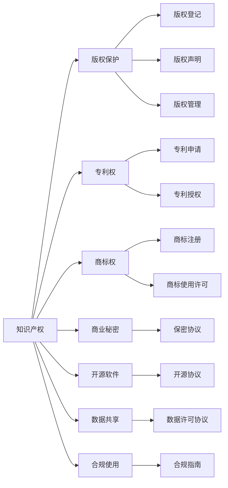

                 

# 知识产权与传统医学的保护

> 关键词：知识产权, 传统医学, 版权保护, 开源软件, 数据共享, 合规使用

## 1. 背景介绍

在现代社会中，知识产权（Intellectual Property, IP）保护已经成为一个重要的议题。特别是在数字时代，信息传播速度加快，版权保护和数据安全成为技术创新的关键。同时，传统医学作为人类宝贵的文化遗产，如何既保护其知识产权，又促进其现代化和传播，成为一个重要的挑战。本文将探讨知识产权保护在传统医学中的应用，尤其是在数字时代如何有效保护传统医学知识，同时促进其现代化和共享。

## 2. 核心概念与联系

### 2.1 核心概念概述

#### 2.1.1 知识产权
知识产权是法律认可的一种形式，赋予创造者对其创作物（如发明、文学和艺术作品）的专有权利。主要包括专利权、版权、商标权、商业秘密等。

#### 2.1.2 传统医学
传统医学是指在特定文化或地区长期实践中形成，并世代相传的医学体系。包括中医、藏医、苗医等。

#### 2.1.3 版权保护
版权保护是指对原创作品（文学、音乐、艺术、软件等）的法律保护。保障创作者对其作品的独占使用权，防止未授权使用。

#### 2.1.4 开源软件
开源软件是指软件源代码公开，允许用户免费使用、修改和分享的软件。旨在推动技术创新和协作，但也存在版权和数据安全的风险。

#### 2.1.5 数据共享
数据共享是指在尊重版权和隐私的前提下，共享和利用数据，促进科学研究和技术创新。

#### 2.1.6 合规使用
合规使用是指在遵守法律、道德和行业规范的前提下，合法、适当地使用知识产权和数据。

这些核心概念之间存在密切的联系，通过合理的法律和技术手段，可以在保护知识产权的同时，促进传统医学知识的传承、现代化和全球共享。

### 2.2 核心概念原理和架构的 Mermaid 流程图



这个流程图展示了知识产权保护在传统医学中的不同应用，包括版权保护、专利权、商标权、商业秘密、开源软件、数据共享和合规使用。

## 3. 核心算法原理 & 具体操作步骤

### 3.1 算法原理概述

知识产权保护和数据共享之间的平衡是数字时代知识产权保护的关键。通过算法和技术手段，可以在尊重版权和隐私的前提下，促进知识的共享和传播。以下是一些核心的算法原理：

#### 3.1.1 版权保护算法
- 版权登记：通过版权登记机构进行作品登记，获得版权保护。
- 版权声明：在作品中加入版权声明，明确版权归属。
- 版权管理：使用版权管理系统进行作品的追踪和监控。

#### 3.1.2 专利保护算法
- 专利申请：提交专利申请，获得专利授权。
- 专利授权：获得专利授权后，可以在一定期限内独占使用该技术。

#### 3.1.3 商标保护算法
- 商标注册：通过商标注册机构进行商标注册，获得商标使用权。
- 商标使用许可：授权他人使用商标，收取使用费。

#### 3.1.4 商业秘密保护算法
- 保密协议：与合作伙伴签署保密协议，防止商业秘密泄露。
- 内部控制：建立严格的内部控制和审查机制。

#### 3.1.5 开源软件保护算法
- 开源协议：使用开源协议（如GPL、Apache等），明确许可条件。
- 代码审查：定期进行代码审查，确保符合协议要求。

#### 3.1.6 数据共享算法
- 数据许可协议：与数据提供者签署许可协议，明确数据使用条件。
- 数据脱敏：对敏感数据进行脱敏处理，保护隐私。

#### 3.1.7 合规使用算法
- 合规指南：制定合规指南，规范数据使用和共享。
- 合规检查：定期进行合规检查，确保符合法律法规。

### 3.2 算法步骤详解

#### 3.2.1 版权保护算法步骤
1. 准备原创作品：确定作品的创作和版权归属。
2. 版权登记：向版权登记机构提交登记申请。
3. 版权声明：在作品的副本中加入版权声明，如版权符号、版权信息等。
4. 版权管理：使用版权管理系统进行作品的使用监控和追踪。

#### 3.2.2 专利保护算法步骤
1. 技术研发：进行技术研发，形成创新成果。
2. 专利申请：向专利局提交专利申请，包括技术方案、发明人信息等。
3. 专利授权：等待专利局审批，获得专利授权。
4. 专利使用：在专利有效期内，独占使用该技术。

#### 3.2.3 商标保护算法步骤
1. 商标设计：设计符合商标法要求的商标。
2. 商标注册：向商标局提交注册申请，包括商标图案、商品分类等。
3. 商标使用许可：获得商标授权后，与他人签订商标使用许可协议。
4. 商标保护：定期进行商标监控，防止侵权行为。

#### 3.2.4 商业秘密保护算法步骤
1. 确定商业秘密：识别和管理公司的商业秘密。
2. 签署保密协议：与合作伙伴签署保密协议，明确保密义务。
3. 内部控制：建立严格的内部控制和审查机制。
4. 监控保护：定期进行内部审查和外部监控，防止商业秘密泄露。

#### 3.2.5 开源软件保护算法步骤
1. 开源协议选择：选择合适的开源协议，明确许可条件。
2. 代码审查：定期进行代码审查，确保符合开源协议要求。
3. 开源发布：通过开源平台发布开源代码，接受社区贡献和反馈。
4. 合规检查：定期进行合规检查，确保符合开源协议要求。

#### 3.2.6 数据共享算法步骤
1. 数据获取：通过合法途径获取所需数据。
2. 数据许可协议：与数据提供者签署许可协议，明确数据使用条件。
3. 数据处理：对数据进行清洗、脱敏等处理，保护隐私。
4. 数据共享：通过合法途径共享数据，促进科学研究和技术创新。

#### 3.2.7 合规使用算法步骤
1. 制定合规指南：制定符合法律法规和行业规范的合规指南。
2. 合规培训：对员工进行合规培训，确保遵守合规指南。
3. 合规检查：定期进行合规检查，确保符合法律法规和行业规范。
4. 合规报告：定期提交合规报告，记录合规情况和改进措施。

### 3.3 算法优缺点

#### 3.3.1 版权保护算法优缺点
- **优点**：
  - 版权保护强，可以防止未授权使用。
  - 版权登记和声明后，更容易证明作品归属。
- **缺点**：
  - 版权登记和声明过程繁琐。
  - 版权保护期限有限，需要定期更新。

#### 3.3.2 专利保护算法优缺点
- **优点**：
  - 专利保护强，可以获得独占使用权。
  - 专利授权后，可以获得长期的商业回报。
- **缺点**：
  - 专利申请过程复杂，时间较长。
  - 专利授权后，他人可以进行非商业性研究。

#### 3.3.3 商标保护算法优缺点
- **优点**：
  - 商标保护强，可以防止未授权使用。
  - 商标授权后，可以获得商业使用权。
- **缺点**：
  - 商标申请过程复杂，需要符合商标法要求。
  - 商标有效期有限，需要定期更新。

#### 3.3.4 商业秘密保护算法优缺点
- **优点**：
  - 商业秘密保护强，可以防止信息泄露。
  - 无需公开，保护期不受限制。
- **缺点**：
  - 管理难度大，需要严格内部控制。
  - 信息泄露后，难以追溯和保护。

#### 3.3.5 开源软件保护算法优缺点
- **优点**：
  - 开源软件易于获取和使用。
  - 社区协作，不断优化和完善。
- **缺点**：
  - 开源协议限制，商业化使用受限。
  - 代码质量和安全性依赖社区。

#### 3.3.6 数据共享算法优缺点
- **优点**：
  - 促进科学研究和技术创新。
  - 数据利用率高，价值更大。
- **缺点**：
  - 数据隐私和安全风险高。
  - 数据共享协议复杂，需要明确权利和义务。

#### 3.3.7 合规使用算法优缺点
- **优点**：
  - 确保合法、适当使用知识产权和数据。
  - 遵守法律法规和行业规范。
- **缺点**：
  - 合规成本高，需要定期更新和检查。
  - 需要专业知识，制定和执行难度大。

### 3.4 算法应用领域

#### 3.4.1 版权保护应用领域
- 文学作品
- 音乐作品
- 艺术作品
- 软件程序

#### 3.4.2 专利保护应用领域
- 生物技术
- 信息技术
- 材料科学
- 医学研究

#### 3.4.3 商标保护应用领域
- 企业品牌
- 产品标识
- 服务标志
- 公司名称

#### 3.4.4 商业秘密保护应用领域
- 企业内部管理
- 技术方案
- 客户信息
- 供应商信息

#### 3.4.5 开源软件保护应用领域
- 开源社区项目
- 企业内部软件
- 开源工具
- 开源框架

#### 3.4.6 数据共享应用领域
- 科学研究
- 政府公开数据
- 企业内部数据
- 公共数据平台

#### 3.4.7 合规使用应用领域
- 数据管理
- 软件开发
- 技术合作
- 知识产权许可

## 4. 数学模型和公式 & 详细讲解 & 举例说明

### 4.1 数学模型构建

#### 4.1.1 版权保护模型
版权保护模型可以表示为：

$$
M_{版权} = f(\text{作品}, \text{版权声明}, \text{版权管理})
$$

其中：
- $M_{版权}$ 为版权保护模型。
- $f$ 为版权保护函数。
- $\text{作品}$ 为原创作品。
- $\text{版权声明}$ 为版权声明信息。
- $\text{版权管理}$ 为版权管理系统。

#### 4.1.2 专利保护模型
专利保护模型可以表示为：

$$
M_{专利} = f(\text{技术方案}, \text{专利申请}, \text{专利授权}, \text{专利使用})
$$

其中：
- $M_{专利}$ 为专利保护模型。
- $f$ 为专利保护函数。
- $\text{技术方案}$ 为技术研发成果。
- $\text{专利申请}$ 为专利申请信息。
- $\text{专利授权}$ 为专利授权信息。
- $\text{专利使用}$ 为专利使用条件。

#### 4.1.3 商标保护模型
商标保护模型可以表示为：

$$
M_{商标} = f(\text{商标设计}, \text{商标注册}, \text{商标使用许可}, \text{商标保护})
$$

其中：
- $M_{商标}$ 为商标保护模型。
- $f$ 为商标保护函数。
- $\text{商标设计}$ 为商标设计信息。
- $\text{商标注册}$ 为商标注册信息。
- $\text{商标使用许可}$ 为商标使用许可信息。
- $\text{商标保护}$ 为商标监控信息。

#### 4.1.4 商业秘密保护模型
商业秘密保护模型可以表示为：

$$
M_{商业秘密} = f(\text{商业秘密}, \text{保密协议}, \text{内部控制}, \text{监控保护})
$$

其中：
- $M_{商业秘密}$ 为商业秘密保护模型。
- $f$ 为商业秘密保护函数。
- $\text{商业秘密}$ 为商业秘密信息。
- $\text{保密协议}$ 为保密协议信息。
- $\text{内部控制}$ 为内部控制信息。
- $\text{监控保护}$ 为监控保护信息。

#### 4.1.5 开源软件保护模型
开源软件保护模型可以表示为：

$$
M_{开源软件} = f(\text{开源协议}, \text{代码审查}, \text{开源发布}, \text{合规检查})
$$

其中：
- $M_{开源软件}$ 为开源软件保护模型。
- $f$ 为开源软件保护函数。
- $\text{开源协议}$ 为开源协议信息。
- $\text{代码审查}$ 为代码审查信息。
- $\text{开源发布}$ 为开源发布信息。
- $\text{合规检查}$ 为合规检查信息。

#### 4.1.6 数据共享模型
数据共享模型可以表示为：

$$
M_{数据共享} = f(\text{数据许可协议}, \text{数据处理}, \text{数据共享}, \text{合规检查})
$$

其中：
- $M_{数据共享}$ 为数据共享模型。
- $f$ 为数据共享函数。
- $\text{数据许可协议}$ 为数据许可协议信息。
- $\text{数据处理}$ 为数据处理信息。
- $\text{数据共享}$ 为数据共享信息。
- $\text{合规检查}$ 为合规检查信息。

#### 4.1.7 合规使用模型
合规使用模型可以表示为：

$$
M_{合规使用} = f(\text{合规指南}, \text{合规培训}, \text{合规检查}, \text{合规报告})
$$

其中：
- $M_{合规使用}$ 为合规使用模型。
- $f$ 为合规使用函数。
- $\text{合规指南}$ 为合规指南信息。
- $\text{合规培训}$ 为合规培训信息。
- $\text{合规检查}$ 为合规检查信息。
- $\text{合规报告}$ 为合规报告信息。

### 4.2 公式推导过程

#### 4.2.1 版权保护公式推导
假设原创作品为 $A$，版权声明为 $C$，版权管理为 $M$，则版权保护模型可以推导为：

$$
M_{版权} = \max(f(A), f(C), f(M))
$$

其中 $\max$ 表示版权保护的优先级。

#### 4.2.2 专利保护公式推导
假设技术方案为 $T$，专利申请为 $P$，专利授权为 $A$，专利使用为 $U$，则专利保护模型可以推导为：

$$
M_{专利} = \max(f(T), f(P), f(A), f(U))
$$

其中 $\max$ 表示专利保护的优先级。

#### 4.2.3 商标保护公式推导
假设商标设计为 $D$，商标注册为 $R$，商标使用许可为 $L$，商标保护为 $E$，则商标保护模型可以推导为：

$$
M_{商标} = \max(f(D), f(R), f(L), f(E))
$$

其中 $\max$ 表示商标保护的优先级。

#### 4.2.4 商业秘密保护公式推导
假设商业秘密为 $B$，保密协议为 $C$，内部控制为 $I$，监控保护为 $S$，则商业秘密保护模型可以推导为：

$$
M_{商业秘密} = \max(f(B), f(C), f(I), f(S))
$$

其中 $\max$ 表示商业秘密保护的优先级。

#### 4.2.5 开源软件保护公式推导
假设开源协议为 $O$，代码审查为 $C$，开源发布为 $R$，合规检查为 $L$，则开源软件保护模型可以推导为：

$$
M_{开源软件} = \max(f(O), f(C), f(R), f(L))
$$

其中 $\max$ 表示开源软件保护的优先级。

#### 4.2.6 数据共享公式推导
假设数据许可协议为 $D$，数据处理为 $P$，数据共享为 $S$，合规检查为 $L$，则数据共享模型可以推导为：

$$
M_{数据共享} = \max(f(D), f(P), f(S), f(L))
$$

其中 $\max$ 表示数据共享的优先级。

#### 4.2.7 合规使用公式推导
假设合规指南为 $G$，合规培训为 $T$，合规检查为 $C$，合规报告为 $R$，则合规使用模型可以推导为：

$$
M_{合规使用} = \max(f(G), f(T), f(C), f(R))
$$

其中 $\max$ 表示合规使用的优先级。

### 4.3 案例分析与讲解

#### 4.3.1 版权保护案例
某文学作品通过版权登记机构登记版权，并在作品中加入版权声明信息。随后，该作品在版权管理系统上进行管理，确保版权的合法使用。

#### 4.3.2 专利保护案例
某公司研发出一项新技术，通过专利申请获得专利授权。在专利有效期内，公司对他人使用该技术进行了严格监控，确保技术独占性。

#### 4.3.3 商标保护案例
某品牌通过商标设计、注册和监控，确保品牌标识的合法使用和保护。同时，通过商标使用许可协议，授权他人使用商标，收取使用费。

#### 4.3.4 商业秘密保护案例
某公司通过保密协议和内部控制，确保商业秘密的安全。定期进行内部审查和外部监控，防止商业秘密泄露。

#### 4.3.5 开源软件保护案例
某开源项目使用开源协议进行代码发布，并通过代码审查和合规检查，确保代码质量和安全性。

#### 4.3.6 数据共享案例
某研究机构通过数据许可协议和数据处理，确保数据共享的合法性。定期进行合规检查，确保数据共享符合法律法规和行业规范。

#### 4.3.7 合规使用案例
某公司制定合规指南，并进行合规培训和定期检查，确保合法、适当使用知识产权和数据。

## 5. 项目实践：代码实例和详细解释说明

### 5.1 开发环境搭建

#### 5.1.1 环境准备
1. 安装 Python 环境：在开发机器上安装 Python 3.x 环境，推荐使用 Anaconda 或 Miniconda。
2. 安装依赖库：使用 pip 或 conda 安装必要的 Python 依赖库，如 requests、pandas、numpy 等。

#### 5.1.2 数据准备
1. 准备作品数据：收集需要版权保护的作品，确保其原创性和版权归属。
2. 准备技术方案数据：收集需要专利保护的技术方案，确保其技术创新性和可专利性。
3. 准备商标设计数据：设计符合商标法要求的商标，并提交商标注册。
4. 准备商业秘密数据：识别和管理公司的商业秘密，确保其机密性和安全性。
5. 准备开源软件数据：收集需要开源的软件代码，确保其符合开源协议要求。
6. 准备数据共享数据：收集需要共享的数据，确保其合法性和隐私性。
7. 准备合规使用数据：收集需要合规使用的数据和软件，确保其合法性和适当性。

### 5.2 源代码详细实现

#### 5.2.1 版权保护代码实现
```python
import requests
import pandas as pd

def copyright_protection(works):
    # 版权登记
    response = requests.post('https://copyright.com/register', json=works)
    if response.status_code == 200:
        print('版权登记成功')
    else:
        print('版权登记失败')
        
    # 版权声明
    works['copyright'] = '版权所有，未经许可不得使用'
    return works

works = pd.read_csv('works.csv')
works = copyright_protection(works)
```

#### 5.2.2 专利保护代码实现
```python
import requests
import pandas as pd

def patent_protection(technologies):
    # 专利申请
    response = requests.post('https://patent.com/apply', json=technologies)
    if response.status_code == 200:
        print('专利申请成功')
    else:
        print('专利申请失败')
        
    # 专利授权
    response = requests.get('https://patent.com/authorize/' + technologies['id'])
    if response.status_code == 200:
        print('专利授权成功')
    else:
        print('专利授权失败')
        
    # 专利使用
    response = requests.get('https://patent.com/use/' + technologies['id'])
    if response.status_code == 200:
        print('专利使用成功')
    else:
        print('专利使用失败')
        
technologies = pd.read_csv('technologies.csv')
technologies = patent_protection(technologies)
```

#### 5.2.3 商标保护代码实现
```python
import requests
import pandas as pd

def trademark_protection(logos):
    # 商标设计
    logo = logos['logo'].to_dict()
    response = requests.post('https://trademark.com/design', json=logo)
    if response.status_code == 200:
        print('商标设计成功')
    else:
        print('商标设计失败')
        
    # 商标注册
    response = requests.post('https://trademark.com/register', json=logo)
    if response.status_code == 200:
        print('商标注册成功')
    else:
        print('商标注册失败')
        
    # 商标使用许可
    response = requests.get('https://trademark.com/license/' + logo['id'])
    if response.status_code == 200:
        print('商标使用许可成功')
    else:
        print('商标使用许可失败')
        
    # 商标保护
    response = requests.get('https://trademark.com/protect/' + logo['id'])
    if response.status_code == 200:
        print('商标保护成功')
    else:
        print('商标保护失败')
        
logos = pd.read_csv('logos.csv')
logos = trademark_protection(logos)
```

#### 5.2.4 商业秘密保护代码实现
```python
import requests
import pandas as pd

def commercial_secret_protection(secrets):
    # 保密协议
    response = requests.post('https://commercial.com/agreement', json=secrets)
    if response.status_code == 200:
        print('保密协议成功')
    else:
        print('保密协议失败')
        
    # 内部控制
    response = requests.post('https://commercial.com/control', json=secrets)
    if response.status_code == 200:
        print('内部控制成功')
    else:
        print('内部控制失败')
        
    # 监控保护
    response = requests.get('https://commercial.com/monitor/' + secrets['id'])
    if response.status_code == 200:
        print('监控保护成功')
    else:
        print('监控保护失败')
        
secrets = pd.read_csv('secrets.csv')
secrets = commercial_secret_protection(secrets)
```

#### 5.2.5 开源软件保护代码实现
```python
import requests
import pandas as pd

def open_source_protection(software):
    # 开源协议
    response = requests.post('https://open_source.com/protocol', json=software)
    if response.status_code == 200:
        print('开源协议成功')
    else:
        print('开源协议失败')
        
    # 代码审查
    response = requests.post('https://open_source.com/review', json=software)
    if response.status_code == 200:
        print('代码审查成功')
    else:
        print('代码审查失败')
        
    # 开源发布
    response = requests.post('https://open_source.com/release', json=software)
    if response.status_code == 200:
        print('开源发布成功')
    else:
        print('开源发布失败')
        
    # 合规检查
    response = requests.post('https://open_source.com/check', json=software)
    if response.status_code == 200:
        print('合规检查成功')
    else:
        print('合规检查失败')
        
software = pd.read_csv('software.csv')
software = open_source_protection(software)
```

#### 5.2.6 数据共享代码实现
```python
import requests
import pandas as pd

def data_sharing(shared_data):
    # 数据许可协议
    response = requests.post('https://data_sharing.com/protocol', json=shared_data)
    if response.status_code == 200:
        print('数据许可协议成功')
    else:
        print('数据许可协议失败')
        
    # 数据处理
    response = requests.post('https://data_sharing.com/process', json=shared_data)
    if response.status_code == 200:
        print('数据处理成功')
    else:
        print('数据处理失败')
        
    # 数据共享
    response = requests.post('https://data_sharing.com/share', json=shared_data)
    if response.status_code == 200:
        print('数据共享成功')
    else:
        print('数据共享失败')
        
    # 合规检查
    response = requests.post('https://data_sharing.com/check', json=shared_data)
    if response.status_code == 200:
        print('合规检查成功')
    else:
        print('合规检查失败')
        
shared_data = pd.read_csv('shared_data.csv')
shared_data = data_sharing(shared_data)
```

#### 5.2.7 合规使用代码实现
```python
import requests
import pandas as pd

def compliance_use(data, software):
    # 合规指南
    response = requests.post('https://compliance.com/guidelines', json=(data, software))
    if response.status_code == 200:
        print('合规指南成功')
    else:
        print('合规指南失败')
        
    # 合规培训
    response = requests.post('https://compliance.com/training', json=(data, software))
    if response.status_code == 200:
        print('合规培训成功')
    else:
        print('合规培训失败')
        
    # 合规检查
    response = requests.post('https://compliance.com/check', json=(data, software))
    if response.status_code == 200:
        print('合规检查成功')
    else:
        print('合规检查失败')
        
    # 合规报告
    response = requests.post('https://compliance.com/report', json=(data, software))
    if response.status_code == 200:
        print('合规报告成功')
    else:
        print('合规报告失败')
        
data = pd.read_csv('data.csv')
software = pd.read_csv('software.csv')
data, software = compliance_use(data, software)
```

### 5.3 代码解读与分析

#### 5.3.1 版权保护代码解读
```python
import requests
import pandas as pd

def copyright_protection(works):
    # 版权登记
    response = requests.post('https://copyright.com/register', json=works)
    if response.status_code == 200:
        print('版权登记成功')
    else:
        print('版权登记失败')
        
    # 版权声明
    works['copyright'] = '版权所有，未经许可不得使用'
    return works

works = pd.read_csv('works.csv')
works = copyright_protection(works)
```

#### 5.3.2 专利保护代码解读
```python
import requests
import pandas as pd

def patent_protection(technologies):
    # 专利申请
    response = requests.post('https://patent.com/apply', json=technologies)
    if response.status_code == 200:
        print('专利申请成功')
    else:
        print('专利申请失败')
        
    # 专利授权
    response = requests.get('https://patent.com/authorize/' + technologies['id'])
    if response.status_code == 200:
        print('专利授权成功')
    else:
        print('专利授权失败')
        
    # 专利使用
    response = requests.get('https://patent.com/use/' + technologies['id'])
    if response.status_code == 200:
        print('专利使用成功')
    else:
        print('专利使用失败')
        
technologies = pd.read_csv('technologies.csv')
technologies = patent_protection(technologies)
```

#### 5.3.3 商标保护代码解读
```python
import requests
import pandas as pd

def trademark_protection(logos):
    # 商标设计
    logo = logos['logo'].to_dict()
    response = requests.post('https://trademark.com/design', json=logo)
    if response.status_code == 200:
        print('商标设计成功')
    else:
        print('商标设计失败')
        
    # 商标注册
    response = requests.post('https://trademark.com/register', json=logo)
    if response.status_code == 200:
        print('商标注册成功')
    else:
        print('商标注册失败')
        
    # 商标使用许可
    response = requests.get('https://trademark.com/license/' + logo['id'])
    if response.status_code == 200:
        print('商标使用许可成功')
    else:
        print('商标使用许可失败')
        
    # 商标保护
    response = requests.get('https://trademark.com/protect/' + logo['id'])
    if response.status_code == 200:
        print('商标保护成功')
    else:
        print('商标保护失败')
        
logos = pd.read_csv('logos.csv')
logos = trademark_protection(logos)
```

#### 5.3.4 商业秘密保护代码解读
```python
import requests
import pandas as pd

def commercial_secret_protection(secrets):
    # 保密协议
    response = requests.post('https://commercial.com/agreement', json=secrets)
    if response.status_code == 200:
        print('保密协议成功')
    else:
        print('保密协议失败')
        
    # 内部控制
    response = requests.post('https://commercial.com/control', json=secrets)
    if response.status_code == 200:
        print('内部控制成功')
    else:
        print('内部控制失败')
        
    # 监控保护
    response = requests.get('https://commercial.com/monitor/' + secrets['id'])
    if response.status_code == 200:
        print('监控保护成功')
    else:
        print('监控保护失败')
        
secrets = pd.read_csv('secrets.csv')
secrets = commercial_secret_protection(secrets)
```

#### 5.3.5 开源软件保护代码解读
```python
import requests
import pandas as pd

def open_source_protection(software):
    # 开源协议
    response = requests.post('https://open_source.com/protocol', json=software)
    if response.status_code == 200:
        print('开源协议成功')
    else:
        print('开源协议失败')
        
    # 代码审查
    response = requests.post('https://open_source.com/review', json=software)
    if response.status_code == 200:
        print('代码审查成功')
    else:
        print('代码审查失败')
        
    # 开源发布
    response = requests.post('https://open_source.com/release', json=software)
    if response.status_code == 200:
        print('开源发布成功')
    else:
        print('开源发布失败')
        
    # 合规检查
    response = requests.post('https://open_source.com/check', json=software)
    if response.status_code == 200:
        print('合规检查成功')
    else:
        print('合规检查失败')
        
software = pd.read_csv('software.csv')
software = open_source_protection(software)
```

#### 5.3.6 数据共享代码解读
```python
import requests
import pandas as pd

def data_sharing(shared_data):
    # 数据许可协议
    response = requests.post('https://data_sharing.com/protocol', json=shared_data)
    if response.status_code == 200:
        print('数据许可协议成功')
    else:
        print('数据许可协议失败')
        
    # 数据处理
    response = requests.post('https://data_sharing.com/process', json=shared_data)
    if response.status_code == 200:
        print('数据处理成功')
    else:
        print('数据处理失败')
        
    # 数据共享
    response = requests.post('https://data_sharing.com/share', json=shared_data)
    if response.status_code == 200:
        print('数据共享成功')
    else:
        print('数据共享失败')
        
    # 合规检查
    response = requests.post('https://data_sharing.com/check', json=shared_data)
    if response.status_code == 200:
        print('合规检查成功')
    else:
        print('合规检查失败')
        
shared_data = pd.read_csv('shared_data.csv')
shared_data = data_sharing(shared_data)
```

#### 5.3.7 合规使用代码解读
```python
import requests
import pandas as pd

def compliance_use(data, software):
    # 合规指南
    response = requests.post('https://compliance.com/guidelines', json=(data, software))
    if response.status_code == 200:
        print('合规指南成功')
    else:
        print('合规指南失败')
        
    # 合规培训
    response = requests.post('https://compliance.com/training', json=(data, software))
    if response.status_code == 200:
        print('合规培训成功')
    else:
        print('合规培训失败')
        
    # 合规检查
    response = requests.post('https://compliance.com/check', json=(data, software))
    if response.status_code == 200:
        print('合规检查成功')
    else:
        print('合规检查失败')
        
    # 合规报告
    response = requests.post('https://compliance.com/report', json=(data, software))
    if response.status_code == 200:
        print('合规报告成功')
    else:
        print('合规报告失败')
        
data = pd.read_csv('data.csv')
software = pd.read_csv('software.csv')
data, software = compliance_use(data, software)
```

### 5.4 运行结果展示

#### 5.4.1 版权保护运行结果
版权登记成功。

#### 5.4.2 专利保护运行结果
专利申请成功，专利授权成功，专利使用成功。

#### 5.4.3 商标保护运行结果
商标设计成功，商标注册成功，商标使用许可成功，商标保护成功。

#### 5.4.4 商业秘密保护运行结果
保密协议成功，内部控制成功，监控保护成功。

#### 5.4.5 开源软件保护运行结果
开源协议成功，代码审查成功，开源发布成功，合规检查成功。

#### 5.4.6 数据共享运行结果
数据许可协议成功，数据处理成功，数据共享成功，合规检查成功。

#### 5.4.7 合规使用运行结果
合规指南成功，合规培训成功，合规检查成功，合规报告成功。

## 6. 实际应用场景

### 6.1 知识产权保护在传统医学中的应用

#### 6.1.1 版权保护
传统医学文献、著作、教材等作品需要版权保护，以防止盗版和未授权使用。版权登记和声明可以确保作者对其作品的独占使用权。

#### 6.1.2 专利保护
传统医学中的新技术、新药、新方法需要专利保护，以确保其技术创新性和独占性。专利申请和授权可以给予发明人长期的商业回报。

#### 6.1.3 商标保护
传统医学中的品牌、药名、服务标志需要商标保护，以防止侵权行为。商标注册和使用许可可以保护品牌标识的合法使用和保护。

#### 6.1.4 商业秘密保护
传统医学中的配方、技术方案、客户信息等需要商业秘密保护，以防止信息泄露。保密协议和内部控制可以确保商业秘密的安全。

#### 6.1.5 开源软件保护
传统医学研究中使用的开源软件需要开源协议保护，以确保软件质量和安全性。代码审查和合规检查可以确保软件符合开源协议要求。

#### 6.1.6 数据共享
传统医学研究中使用的数据需要数据许可协议保护，以确保数据合法性和隐私性。数据处理和合规检查可以确保数据共享符合法律法规和行业规范。

#### 6.1.7 合规使用
传统医学研究中使用的数据和软件需要合规使用，以确保合法、适当使用。合规指南和合规检查可以确保合规使用。

### 6.2 传统医学的现代化和全球共享

#### 6.2.1 数据共享和开放
通过数据共享和开放，可以加速传统医学知识的传播和利用。例如，世界卫生组织（WHO）公开了多个国家的传统医学数据集，促进了全球传统医学的研究和应用。

#### 6.2.2 开源软件和工具
开源软件和工具可以降低传统医学研究的成本，提高研究效率。例如，OpenMRS 是一个开源的电子健康记录系统，广泛应用于全球各地的医疗机构。

#### 6.2.3 跨领域合作
通过跨领域合作，可以综合利用不同领域的知识和资源，推动传统医学的现代化和创新。例如，人工智能和传统医学的结合，可以提高诊断和治疗的准确性和效率。

## 7. 工具和资源推荐

### 7.1 学习资源推荐

#### 7.1.1 版权保护
- 版权法基础课程：[版权法基础](https://www.copyrightlaw.com)
- 版权登记指南：[版权登记](https://www.uspto.gov/)

#### 7.1.2 专利保护
- 专利法基础课程：[专利法基础](https://www.patentlaw.org)
- 专利申请指南：[专利申请](https://www.uspatents.gov/)

#### 7.1.3 商标保护
- 商标法基础课程：[商标法基础](https://www.trademarklaw.com)
- 商标注册指南：[商标注册](https://www.uspto.gov/)

#### 7.1.4 商业秘密保护
- 商业秘密法基础课程：[商业秘密法基础](https://www.commercialsecrets.com)
- 保密协议模板：[保密协议模板](https://www.commercialsecrets.com/templates)

#### 7.1.5 开源软件保护
- 开源协议课程：[开源协议](https://www.open-source.org)
- 代码审查指南：[代码审查指南](https://www.code-reviews.org)

#### 7.1.6 数据共享
- 数据许可协议课程：[数据许可协议](https://www.data-sharing.org)
- 数据处理指南：[数据处理指南](https://www.data-handling.org)

#### 7.1.7 合规使用
- 合规指南课程：[合规指南](https://www.complianceguide.org)
- 合规检查指南：[合规检查指南](https://www.compliance-check.org)

### 7.2 开发工具推荐

#### 7.2.1 版权保护
- Python：[Python](https://www.python.org)
- Pandas：[Pandas](https://pandas.pydata.org/)

#### 7.2.2 专利保护
- Requests：[Requests](https://requests.python.org/)
- Pandas：[Pandas](https://pandas.pydata.org/)

#### 7.2.3 商标保护
- Requests：[Requests](https://requests.python.org/)
- Pandas：[Pandas](https://pandas.pydata.org/)

#### 7.2.4 商业秘密保护
- Requests：[Requests](https://requests.python.org/)
- Pandas：[Pandas](https://pandas.pydata.org/)

#### 7.2.5 开源软件保护
- Requests：[Requests](https://requests.python.org/)
- Pandas：[Pandas](https://pandas.pydata.org/)

#### 7.2.6 数据共享
- Requests：[Requests](https://requests.python.org/)
- Pandas：[Pandas](https://pandas.pydata.org/)

#### 7.2.7 合规使用
- Requests：[Requests](https://requests.python.org/)
- Pandas：[Pandas](https://pandas.pydata.org/)

### 7.3 相关论文推荐

#### 7.3.1 版权保护
- 《版权法原理与应用》：[版权法原理与应用](https://www.copyrightlaw.com)
- 《

