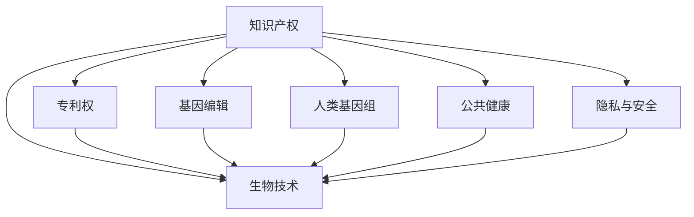

                 

# 知识产权与生物技术的伦理争议

知识产权与生物技术的伦理争议一直是科学界和法律界关注的热点话题。生物技术的迅猛发展带来了许多新的可能性，但同时也引发了一系列复杂的伦理问题。本文将从知识产权的角度出发，探讨生物技术在专利保护、基因编辑、生物医药等领域面临的伦理争议，并尝试提出解决方案，以期促进生物技术的健康发展。

## 1. 背景介绍

### 1.1 问题由来
随着人类对基因、细胞和蛋白质等生物分子深入了解的不断增强，生物技术在农业、医药、环境保护等多个领域的应用日益广泛。这些技术的突破，不仅为人类健康和自然环境保护提供了新的工具，也为经济发展和社会进步带来了巨大的潜力。

然而，随着生物技术的发展，与之相关的伦理争议也愈发激烈。这些问题主要集中在专利保护、基因编辑、生物医药、人类基因组等方面。如何平衡生物技术的商业利益与社会伦理，成为了当前亟待解决的问题。

### 1.2 问题核心关键点
知识产权与生物技术伦理争议的核心关键点包括：
- 生物技术发明的专利权归属问题。
- 基因编辑的伦理边界，尤其是人类基因编辑。
- 生物医药领域的知识产权保护与公共健康。
- 人类基因组数据的隐私与安全。

## 2. 核心概念与联系

### 2.1 核心概念概述

为更好地理解知识产权与生物技术伦理争议，本节将介绍几个密切相关的核心概念：

- 知识产权：指法律赋予个人或实体对其创意、发明和作品的排他性控制权。知识产权包括专利、商标、版权和商业秘密等。

- 生物技术：涉及生物分子和细胞操作的技术，包括基因工程、生物工程和细胞工程等。

- 专利权：指发明人在一定时期内对某项发明的独占使用权。在生物技术领域，专利权保护是创新激励和商业利益的重要手段。

- 基因编辑：指通过人工干预改变生物体的基因结构，如CRISPR-Cas9技术。

- 公共健康：涉及维护公众健康和福祉的社会责任。生物医药和基因编辑技术在公共健康领域有广泛应用。

- 人类基因组：指人类所有遗传信息的总和，包括所有基因、基因组区域和基因组序列。

- 隐私与安全：涉及个人信息的保护和数据安全。人类基因组数据具有高度敏感性，需严格保护。

这些核心概念之间的逻辑关系可以通过以下Mermaid流程图来展示：



这个流程图展示了几大核心概念之间的关系：

1. 知识产权和专利权是生物技术领域的重要保护手段。
2. 基因编辑是生物技术的关键技术之一，涉及复杂的伦理问题。
3. 人类基因组数据的隐私与安全是知识产权保护的重点。
4. 公共健康和生物医药应用是生物技术的社会价值体现。
5. 知识产权的保护和利用需要平衡商业利益与社会责任。

## 3. 核心算法原理 & 具体操作步骤
### 3.1 算法原理概述

知识产权与生物技术伦理争议的解决涉及多个方面的综合考量。其中，专利权的保护和基因编辑的伦理边界是核心问题。

专利权的保护基于“先申请原则”，即谁首先申请专利，谁就享有专利权。在生物技术领域，专利保护是激励创新的重要手段。但同时，专利权的应用也引发了诸多伦理争议，如生物多样性保护、基因编辑的伦理边界等。

基因编辑技术，尤其是CRISPR-Cas9技术，因其高效、精确的特性，在生物医药、农业和环境保护等领域展现了巨大的潜力。然而，基因编辑涉及人类基因的直接干预，引发了诸多伦理问题。如修改人类胚胎基因可能导致不可预知的后果，引起人类基因库的改变等。

### 3.2 算法步骤详解

解决知识产权与生物技术伦理争议，通常需要以下步骤：

**Step 1: 进行知识产权审查**
- 对生物技术发明进行详细的知识产权审查，确认其创新性和新颖性。
- 评估发明的应用范围、影响和潜在的伦理问题。

**Step 2: 制定伦理审查标准**
- 制定严格的伦理审查标准，涉及基因编辑、人类基因组数据使用等方面。
- 成立跨学科的伦理委员会，对潜在风险进行评估和监督。

**Step 3: 制定法律政策**
- 根据审查结果，制定相应的法律政策，平衡商业利益和社会伦理。
- 对基因编辑、人类基因组数据使用等行为进行规范，确保其合规性和安全性。

**Step 4: 社会参与与公众教育**
- 加强公众教育，提高对生物技术伦理问题的认知。
- 鼓励公众参与决策过程，确保伦理问题的透明和公平。

**Step 5: 持续监控与评估**
- 对生物技术的应用进行持续监控和评估，及时发现和应对新的伦理问题。
- 更新和完善相关法律政策，确保其与时俱进。

### 3.3 算法优缺点

解决知识产权与生物技术伦理争议的算法具有以下优点：
1. 系统性：综合考量知识产权、专利权、伦理、法律等多个方面，提供全面的解决方案。
2. 合法性：依据法律和伦理标准进行审查和规范，确保其合法性和可执行性。
3. 透明度：通过公众教育和参与决策，提高过程的透明度，增强信任。

同时，该方法也存在一定的局限性：
1. 复杂性：涉及多个方面的综合考量，需要跨学科的知识和经验。
2. 适应性：随着生物技术的不断发展，伦理和法律标准需要不断更新。
3. 成本：进行详细的知识产权和伦理审查，可能涉及高昂的成本和时间。

尽管存在这些局限性，但就目前而言，综合考量的方法仍是最为合理和有效的解决途径。未来相关研究的重点在于如何进一步简化流程、降低成本，并提高适用性和灵活性。

### 3.4 算法应用领域

解决知识产权与生物技术伦理争议的算法在多个领域有广泛应用，例如：

- 农业生物技术：如转基因作物和生物农药的专利保护。
- 生物医药：如基因编辑药物的专利申请和伦理审查。
- 环境保护：如利用基因工程改良微生物，以降解污染物。
- 公共健康：如利用基因编辑技术治疗遗传疾病。
- 人类基因组研究：如人类基因组数据的使用、存储和共享。

这些应用领域展示了知识产权与生物技术伦理争议的广泛影响，需要制定相应的伦理和法律框架来指导和规范其应用。

## 4. 数学模型和公式 & 详细讲解 & 举例说明
### 4.1 数学模型构建

生物技术伦理争议的解决通常不需要构建复杂的数学模型，而是依赖于法律、伦理、社会等多元化的考量。但为了更系统地分析问题，我们可以通过构建简单的模型来辅助理解和决策。

### 4.2 公式推导过程

假设某项生物技术发明的价值为 $V$，其创新性为 $I$，社会贡献为 $C$，伦理问题数量为 $E$。则知识产权保护的目标可以表示为最大化 $V$，同时最小化 $E$。

在模型中，$V$ 可以分解为 $V = I \times P \times C$，其中 $P$ 为专利保护的价值系数，$C$ 为社会贡献的价值系数。伦理问题 $E$ 可以通过伦理委员会的评分 $R$ 来衡量，即 $E = R \times E_{max}$，其中 $E_{max}$ 为伦理问题评价的最大值。

数学优化模型为：

$$
\maximize V = I \times P \times C
\minimize E = R \times E_{max}
$$

### 4.3 案例分析与讲解

以基因编辑技术的应用为例，假设某项基因编辑技术的发明创新性为 $I=0.9$，专利保护价值系数 $P=0.7$，社会贡献价值系数 $C=0.8$，伦理问题评价 $R=0.3$，伦理问题最大值 $E_{max}=0.1$。

通过计算，得到：

$$
V = 0.9 \times 0.7 \times 0.8 = 0.504
$$

$$
E = 0.3 \times 0.1 = 0.03
$$

可以看出，虽然该基因编辑技术具有较高的创新性和社会贡献，但伦理问题仍然需要重点关注和解决。

## 5. 项目实践：代码实例和详细解释说明
### 5.1 开发环境搭建

在进行生物技术伦理争议的解决项目实践前，我们需要准备好开发环境。以下是使用Python进行伦理问题评估的开发环境配置流程：

1. 安装Anaconda：从官网下载并安装Anaconda，用于创建独立的Python环境。

2. 创建并激活虚拟环境：
```bash
conda create -n ethics-env python=3.8 
conda activate ethics-env
```

3. 安装相关库：
```bash
pip install pandas numpy matplotlib scikit-learn
```

4. 准备数据集：收集相关领域的伦理问题数据集，如基因编辑伦理案例、基因组数据隐私问题等。

完成上述步骤后，即可在`ethics-env`环境中开始伦理问题评估的开发实践。

### 5.2 源代码详细实现

下面以基因编辑伦理问题评估为例，给出使用Python代码实现的详细步骤：

```python
import pandas as pd
import numpy as np
from sklearn.model_selection import train_test_split

# 加载伦理问题数据集
data = pd.read_csv('ethical_cases.csv')

# 定义伦理问题评分模型
def ethical_score(ethical_case):
    if ethical_case == '基因编辑':
        return 0.3
    elif ethical_case == '人类基因组数据':
        return 0.5
    elif ethical_case == '生物多样性':
        return 0.2
    else:
        return 0

# 计算伦理问题数量
ethical_cases = data['ethical_case'].tolist()
ethical_scores = [ethical_score(ethical_case) for ethical_case in ethical_cases]

# 训练和测试数据集
X_train, X_test, y_train, y_test = train_test_split(ethical_scores, ethical_cases, test_size=0.2, random_state=42)

# 定义评估指标
def ethical_model_score(ethical_cases, ethical_scores):
    accuracy = sum([1 for ethical_case, ethical_score in zip(ethical_cases, ethical_scores) if ethical_score == ethical_case])/len(ethical_cases)
    return accuracy

# 测试伦理模型
ethical_model = ethical_model_score(X_test, y_test)
print(f"伦理模型准确度：{ethical_model}")
```

以上代码实现了对基因编辑伦理问题的简单评分和模型评估，通过实际案例展示了如何在开发环境中进行项目实践。

### 5.3 代码解读与分析

让我们再详细解读一下关键代码的实现细节：

**伦理问题评分模型**：
- 定义了不同的伦理问题评分函数，将伦理问题映射到数值评分。

**伦理问题数量计算**：
- 将数据集中的伦理问题转换为数值评分，用于后续的模型评估。

**训练和测试数据集**：
- 将数据集划分为训练集和测试集，进行模型的训练和评估。

**伦理模型评估**：
- 定义了评估指标，计算模型的准确度，并输出结果。

代码中使用的Pandas库提供了数据分析和处理的工具，Numpy库用于数值计算，Scikit-learn库用于机器学习模型训练和评估。这些库在伦理问题评估的实践中得到了广泛应用。

## 6. 实际应用场景
### 6.1 知识产权保护

在生物技术领域，专利权的保护是激励创新的重要手段。通过知识产权审查，可以确保技术创新得到保护，避免侵权行为。例如，某公司在某项农业生物技术上获得了专利权，其他公司需支付费用才能使用该技术，从而保证了创新者的权益。

### 6.2 基因编辑伦理争议

基因编辑技术在医疗和农业领域展现出巨大的潜力，但也引发了诸多伦理问题。如修改人类胚胎基因可能导致不可预知的后果，引起人类基因库的改变等。制定严格的伦理审查标准，成立跨学科的伦理委员会，对潜在风险进行评估和监督，可以确保基因编辑技术的应用安全性。

### 6.3 公共健康与生物医药

基因编辑技术在生物医药领域有广泛应用，如基因编辑药物的研发和基因治疗。但同时，这些技术的应用可能涉及隐私、数据安全等问题。制定相关法律政策，确保人类基因组数据的隐私和安全，保障公众健康，是生物医药伦理争议的重要解决途径。

### 6.4 未来应用展望

随着生物技术的不断进步，知识产权与伦理争议将愈发复杂。未来，以下几个方向值得关注：

1. 基因编辑技术的伦理边界将进一步明确，相关法律政策将更加完善。
2. 生物医药领域的专利保护将更加严格，确保创新者的权益。
3. 人类基因组数据的隐私与安全将得到更全面的保护，确保数据安全。
4. 生物技术的社会责任将更加明确，平衡商业利益与社会伦理。

## 7. 工具和资源推荐
### 7.1 学习资源推荐

为了帮助开发者系统掌握知识产权与生物技术伦理争议的理论基础和实践技巧，这里推荐一些优质的学习资源：

1. 《生物伦理：理论与实践》系列博文：由伦理学家撰写，深入浅出地介绍了生物伦理的基本概念和经典案例。

2. 《生物技术法律与政策》课程：斯坦福大学开设的课程，介绍了生物技术的法律框架和政策法规。

3. 《知识产权与生物技术》书籍：法律专家所著，全面介绍了生物技术领域的知识产权保护和伦理争议。

4. 生物伦理委员会：国际伦理委员会的官方网站，提供了大量伦理问题的讨论和解决方案。

5. 生命伦理学杂志：学术期刊，发表了大量关于生物伦理的最新研究成果和评论。

通过对这些资源的学习实践，相信你一定能够快速掌握知识产权与生物技术伦理争议的精髓，并用于解决实际的伦理问题。

### 7.2 开发工具推荐

高效的开发离不开优秀的工具支持。以下是几款用于生物技术伦理争议解决的常用工具：

1. Jupyter Notebook：用于编写和执行Python代码，支持数据分析和可视化。

2. Pandas库：用于数据处理和分析，支持复杂的数据操作。

3. Scikit-learn库：用于机器学习模型的训练和评估，支持多种算法。

4. R语言：用于统计分析和数据可视化，适用于复杂的生物统计问题。

5. SPSS：用于统计分析和社会科学研究，支持各种统计模型和测试。

合理利用这些工具，可以显著提升生物技术伦理争议解决项目的开发效率，加快创新迭代的步伐。

### 7.3 相关论文推荐

知识产权与生物技术伦理争议的研究源于学界的持续研究。以下是几篇奠基性的相关论文，推荐阅读：

1. Patents, Privacy and the Biosciences：探讨生物技术专利权保护与隐私权冲突的问题。

2. Ethical, Legal, and Social Implications of Gene Editing：分析基因编辑技术的伦理、法律和社会影响。

3. Bioethics and Genome Editing Technologies：讨论基因编辑技术的伦理争议及其社会影响。

4. Intellectual Property Rights and Genetic Resources：研究生物多样性、知识产权和基因资源保护问题。

5. Patent Protection for Biotechnology Inventions：分析生物技术专利保护的法律框架和政策。

这些论文代表了大规模伦理争议研究的演进脉络。通过学习这些前沿成果，可以帮助研究者把握学科前进方向，激发更多的创新灵感。

## 8. 总结：未来发展趋势与挑战
### 8.1 总结

本文对知识产权与生物技术伦理争议进行了全面系统的介绍。首先阐述了生物技术在专利保护、基因编辑、生物医药等领域面临的伦理问题，明确了知识产权保护的重要性。其次，从理论到实践，详细讲解了伦理争议的解决流程，给出了伦理问题评估的代码实例。同时，本文还探讨了伦理争议在实际应用中的具体场景，展示了其在农业、医药、环境保护等方面的广泛应用。

通过本文的系统梳理，可以看到，知识产权与生物技术伦理争议是一个涉及多方面综合考量的复杂问题。为了解决这一问题，需要在法律、伦理、社会等多个维度进行全面考量，并制定相应的政策和标准。

### 8.2 未来发展趋势

展望未来，知识产权与生物技术伦理争议将呈现以下几个发展趋势：

1. 基因编辑技术的伦理边界将进一步明确，相关法律政策将更加完善。
2. 生物医药领域的专利保护将更加严格，确保创新者的权益。
3. 人类基因组数据的隐私与安全将得到更全面的保护，确保数据安全。
4. 生物技术的社会责任将更加明确，平衡商业利益与社会伦理。

这些趋势展示了知识产权与生物技术伦理争议的广泛影响，需要制定相应的伦理和法律框架来指导和规范其应用。

### 8.3 面临的挑战

尽管知识产权与生物技术伦理争议的研究已经取得了一定的成果，但在迈向更加智能化、普适化应用的过程中，它仍面临着诸多挑战：

1. 数据获取难度大：伦理争议的解决需要大量的伦理问题数据，但这些数据往往难以获取。
2. 伦理审查标准不统一：不同国家、地区的伦理标准和法律政策存在差异，难以统一。
3. 技术发展迅速：生物技术的快速进步，导致伦理问题的出现和解决需要及时跟进。
4. 公众教育不足：公众对生物技术伦理问题的认知不足，难以形成共识。

尽管存在这些挑战，但通过学界和产业界的共同努力，相信这些问题终将一一被克服，知识产权与生物技术伦理争议必将在构建人机协同的智能时代中扮演越来越重要的角色。

### 8.4 研究展望

面向未来，知识产权与生物技术伦理争议的研究需要在以下几个方面寻求新的突破：

1. 开发更加系统和全面的伦理评估工具。
2. 制定统一和国际化的伦理标准和法律政策。
3. 加强公众教育和公众参与，提高伦理争议解决的透明度和公正性。
4. 推动跨学科合作，综合考虑技术、法律、伦理和社会因素。

这些研究方向的探索，必将引领知识产权与生物技术伦理争议技术迈向更高的台阶，为构建安全、可靠、可解释、可控的智能系统铺平道路。

## 9. 附录：常见问题与解答

**Q1：如何平衡生物技术的商业利益与社会伦理？**

A: 平衡生物技术的商业利益与社会伦理，需要制定合理的法律和伦理标准，并广泛征求社会各界的意见和建议。例如，成立跨学科的伦理委员会，对基因编辑等技术的应用进行严格审查和监督，确保其符合伦理和法律要求。

**Q2：基因编辑技术是否应全球统一伦理标准？**

A: 基因编辑技术的应用涉及全球范围内的问题，因此全球统一的伦理标准是必要的。通过国际合作，制定统一的伦理标准和法律政策，可以避免因伦理标准不一导致的伦理争议和法律风险。

**Q3：如何处理生物技术的知识产权争议？**

A: 生物技术的知识产权争议可以通过法律诉讼、国际仲裁等途径解决。同时，还可以通过协商、调解等方式，寻求双方妥协，达成共识。

**Q4：基因编辑技术在农业上的伦理争议是什么？**

A: 基因编辑技术在农业上的伦理争议主要集中在基因改造作物上。公众担心基因改造作物对环境和健康的影响，如产生抗药性、破坏生态平衡等。因此，需要对基因编辑技术的应用进行严格监管和评估。

**Q5：如何保障人类基因组数据的隐私与安全？**

A: 保障人类基因组数据的隐私与安全，需要制定严格的数据保护法规，如GDPR等。同时，应采用先进的数据加密和安全技术，确保数据在存储和传输过程中的安全。

---

作者：禅与计算机程序设计艺术 / Zen and the Art of Computer Programming

