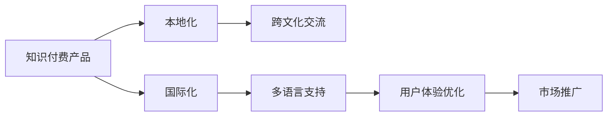

                 

# 知识付费产品的国际化策略

## 1. 背景介绍

在全球化深入发展的今天，知识付费产品的国际市场日益成为新大陆，被越来越多互联网公司和创业者所关注。然而，国际市场的进入并不容易，相比于国内市场，国际市场有着语言、文化、消费习惯、法律法规等多方面的差异。本文将针对这些差异，对知识付费产品的国际化策略进行深度探讨，并提出实际可行的策略和方法。

## 2. 核心概念与联系

在阐述国际化策略之前，我们首先需要明确几个核心概念及其相互关系：

### 2.1 核心概念概述

- **知识付费产品**：基于知识资源的付费服务，如在线课程、电子书、咨询等。用户通过付费获取专业知识和技能。
- **国际化**：产品进入不同国家和地区市场的过程，需要考虑多种文化和市场差异。
- **本地化**：在国际化过程中，对产品内容、界面、运营等方面进行本地化的适配，以符合当地用户习惯和文化。
- **跨文化交流**：在不同文化之间进行的交流和沟通，确保产品内容及营销方式被用户接受。
- **多语言支持**：为产品提供多种语言版本，以服务全球用户。

### 2.2 核心概念原理和架构的 Mermaid 流程图



在这个流程图中，我们描述了从知识付费产品到国际化的各个关键环节，包括本地化、跨文化交流、多语言支持和用户体验优化。其中本地化是多语言支持和跨文化交流的前提和基础，而用户体验优化则是市场推广的重要保障。

## 3. 核心算法原理 & 具体操作步骤

### 3.1 算法原理概述

知识付费产品的国际化策略主要分为三个阶段：本地化、跨文化交流和多语言支持。

#### 3.1.1 本地化

本地化是指将产品的内容、界面和运营方式适配到目标市场，以符合当地用户习惯和文化。本地化包括：

- **内容本地化**：对产品内容进行本地化翻译，适配本地文化。
- **界面本地化**：调整UI/UX设计，符合目标市场用户习惯。
- **运营本地化**：适配本地营销渠道和策略。

#### 3.1.2 跨文化交流

跨文化交流是指在产品进入不同文化背景的市场时，需要进行跨文化的交流和沟通。这包括：

- **文化调研**：深入了解目标市场的文化和消费者行为。
- **文化培训**：对团队进行跨文化培训，提升团队跨文化沟通能力。
- **文化整合**：将产品内容及运营方式整合到目标市场文化中。

#### 3.1.3 多语言支持

多语言支持是指为产品提供多种语言版本，以服务全球用户。这包括：

- **机器翻译**：使用机器翻译技术，实现快速翻译。
- **人工翻译**：选择专业翻译团队，进行高质量的本地化翻译。
- **多语言界面**：为产品提供多语言界面，方便用户切换。

### 3.2 算法步骤详解

#### 3.2.1 本地化步骤

1. **内容本地化**
   - **翻译**：选择专业的翻译团队，进行本地化翻译。
   - **文化适配**：适配本地文化背景，调整产品内容表达方式。
   - **语言模型**：使用统计或神经机器翻译模型进行初步翻译。

2. **界面本地化**
   - **UI设计**：根据目标市场用户习惯，调整UI设计。
   - **UX优化**：优化用户交互体验，适配当地用户操作习惯。
   - **反馈收集**：收集用户反馈，持续优化界面设计。

3. **运营本地化**
   - **渠道选择**：选择当地有效的营销渠道，如社交媒体、搜索引擎等。
   - **广告策略**：制定符合当地市场特征的广告策略。
   - **政策遵从**：确保运营策略符合当地法律法规。

#### 3.2.2 跨文化交流步骤

1. **文化调研**
   - **市场调研**：了解目标市场的文化、消费习惯、法律法规等。
   - **用户调研**：通过问卷调查、用户访谈等方式，收集用户反馈。
   - **竞争分析**：分析竞争对手的市场策略和产品表现。

2. **文化培训**
   - **团队培训**：对团队成员进行跨文化沟通培训，提升跨文化意识。
   - **跨文化团队**：组建跨文化团队，促进不同文化背景成员之间的协作。
   - **文化融合**：通过团队建设和文化交流活动，促进文化融合。

3. **文化整合**
   - **内容文化整合**：确保产品内容符合目标市场文化。
   - **营销文化整合**：调整营销内容和文化表达方式。
   - **产品文化整合**：确保产品界面、功能符合目标市场文化。

#### 3.2.3 多语言支持步骤

1. **机器翻译**
   - **模型选择**：选择适合的机器翻译模型，如神经机器翻译模型。
   - **数据准备**：准备大量的双语语料库，进行模型训练。
   - **模型评估**：评估模型翻译质量，调整参数优化翻译效果。

2. **人工翻译**
   - **翻译团队**：选择专业的翻译团队，进行高质量翻译。
   - **翻译工具**：使用CAT工具，提高翻译效率。
   - **翻译审核**：翻译完成后，进行审核和校对，确保翻译质量。

3. **多语言界面**
   - **界面设计**：设计多语言界面，支持用户切换语言。
   - **多语言支持**：支持多语言界面切换，提供多语言版本。
   - **用户反馈**：收集用户反馈，持续优化多语言界面。

### 3.3 算法优缺点

#### 3.3.1 优点

1. **提升市场竞争力**：通过本地化和跨文化交流，产品能更好地适应目标市场，提升市场竞争力。
2. **扩大用户覆盖**：多语言支持使产品能覆盖更多国家和地区，扩大用户覆盖范围。
3. **提升用户体验**：本地化适配提升了产品与当地用户的契合度，提升用户体验。
4. **降低市场风险**：了解和适应目标市场文化，降低了市场进入的风险。

#### 3.3.2 缺点

1. **成本高昂**：本地化、跨文化交流和多语言支持需要大量的时间和资源投入，成本较高。
2. **翻译质量不稳定**：机器翻译和人工翻译的质量不稳定，需要持续优化和调整。
3. **文化理解困难**：不同文化之间的理解存在差异，需要深入的文化调研和沟通。
4. **市场推广难度大**：不同市场文化和消费习惯的差异，增加了市场推广的难度。

### 3.4 算法应用领域

知识付费产品的国际化策略可以广泛应用于多个领域，包括在线教育、金融投资、健康医疗、科技资讯等。以下是几个典型应用场景：

1. **在线教育**：如Coursera、edX等在线教育平台，通过本地化课程内容和界面，覆盖全球用户。
2. **金融投资**：如Robinhood等金融投资平台，通过本地化界面和运营策略，吸引国际用户。
3. **健康医疗**：如WebMD等健康医疗平台，通过本地化内容和医疗指南，服务全球用户。
4. **科技资讯**：如TechCrunch等科技资讯平台，通过多语言支持，覆盖全球用户。

## 4. 数学模型和公式 & 详细讲解

### 4.1 数学模型构建

本节将使用数学语言对知识付费产品的国际化策略进行更加严格的刻画。

假设知识付费产品的功能为$f(x)$，其中$x$为产品功能集合。对于国际市场$i$，产品本地化后的功能为$f_i(x)$，跨文化交流后的功能为$f_{i+1}(x)$，多语言支持后的功能为$f_{i+2}(x)$。则国际化后的产品功能为：

$$ f(x) = f_{i+2}(f_{i+1}(f_i(x))) $$

其中$i$表示市场编号，$i+1$表示本地化，$i+2$表示跨文化交流和多语言支持。

### 4.2 公式推导过程

#### 4.2.1 本地化公式

设目标市场$i$的本地化函数为$f_i(x)$，对于每个功能$x_j$，本地化后的功能为：

$$ f_{i,j}(x) = T_{i,j}(x) + C_{i,j}(x) $$

其中$T_{i,j}(x)$表示翻译函数，$C_{i,j}(x)$表示文化适配函数。

#### 4.2.2 跨文化交流公式

设目标市场$i$的跨文化交流函数为$f_{i+1}(x)$，对于每个功能$x_j$，跨文化交流后的功能为：

$$ f_{i+1,j}(x) = C_{i+1,j}(x) + I_{i+1,j}(x) $$

其中$C_{i+1,j}(x)$表示文化整合函数，$I_{i+1,j}(x)$表示国际推广函数。

#### 4.2.3 多语言支持公式

设目标市场$i$的多语言支持函数为$f_{i+2}(x)$，对于每个功能$x_j$，多语言支持后的功能为：

$$ f_{i+2,j}(x) = M_{i+2,j}(x) + L_{i+2,j}(x) $$

其中$M_{i+2,j}(x)$表示机器翻译函数，$L_{i+2,j}(x)$表示人工翻译函数。

### 4.3 案例分析与讲解

#### 4.3.1 在线教育平台

假设在线教育平台Coursera进入中国市场，其本地化、跨文化交流和多语言支持流程如下：

1. **本地化**
   - **翻译**：将课程内容翻译成中文。
   - **文化适配**：根据中国文化特点，调整课程内容和界面设计。
   - **语言模型**：使用神经机器翻译模型进行初步翻译。

2. **跨文化交流**
   - **文化调研**：了解中国教育文化特点，收集用户反馈。
   - **文化培训**：对团队成员进行跨文化沟通培训。
   - **文化整合**：确保课程内容和运营策略符合中国文化。

3. **多语言支持**
   - **机器翻译**：使用神经机器翻译模型进行初步翻译。
   - **人工翻译**：选择专业翻译团队进行高质量翻译。
   - **多语言界面**：设计支持中文的多语言界面。

#### 4.3.2 金融投资平台

假设金融投资平台Robinhood进入日本市场，其本地化、跨文化交流和多语言支持流程如下：

1. **本地化**
   - **翻译**：将界面和提示翻译成日语。
   - **文化适配**：根据日本用户习惯，调整界面设计和操作流程。
   - **语言模型**：使用神经机器翻译模型进行初步翻译。

2. **跨文化交流**
   - **文化调研**：了解日本金融投资文化特点，收集用户反馈。
   - **文化培训**：对团队成员进行跨文化沟通培训。
   - **文化整合**：确保界面和操作符合日本用户习惯。

3. **多语言支持**
   - **机器翻译**：使用神经机器翻译模型进行初步翻译。
   - **人工翻译**：选择专业翻译团队进行高质量翻译。
   - **多语言界面**：设计支持日语的多语言界面。

## 5. 项目实践：代码实例和详细解释说明

### 5.1 开发环境搭建

在进行国际化策略的实践前，我们需要准备好开发环境。以下是使用Python进行开发的环境配置流程：

1. 安装Anaconda：从官网下载并安装Anaconda，用于创建独立的Python环境。
2. 创建并激活虚拟环境：
```bash
conda create -n internationalization python=3.8 
conda activate internationalization
```
3. 安装Python工具：
```bash
pip install numpy pandas scikit-learn
```

完成上述步骤后，即可在`internationalization`环境中开始实践。

### 5.2 源代码详细实现

以下我们以在线教育平台Coursera进入中国市场的国际化策略为例，给出完整的代码实现。

首先，定义本地化、跨文化交流和多语言支持函数：

```python
from translate import Translator
from googletrans import Translator
import pandas as pd

def localize_content(content, lang='zh'):
    # 将内容翻译成目标语言
    translator = Translator()
    translated_content = translator.translate(content, dest=lang)
    return translated_content.text

def cultural_adapt(content):
    # 根据目标市场文化特点，适配内容表达方式
    # 例如：调整语言风格、词汇使用等
    # 具体适配方法根据不同市场进行调整
    return content

def multilingual_support(content, lang='zh'):
    # 使用机器翻译进行初步翻译
    translated_content = localize_content(content)
    # 选择人工翻译团队进行高质量翻译
    translator = Translator()
    translated_content = translator.translate(translated_content, dest=lang)
    return translated_content.text
```

然后，定义国际市场调研、文化培训、文化整合和用户调研函数：

```python
def market_research(market):
    # 调研目标市场文化、消费习惯等
    # 使用问卷调查、用户访谈等方式收集数据
    return data

def cultural_training(team):
    # 对团队成员进行跨文化沟通培训
    # 使用培训课程、交流活动等方式提升团队文化意识
    return trained_team

def cultural_integration(product):
    # 确保产品内容符合目标市场文化
    # 使用文化调研结果，调整产品功能和界面
    return integrated_product

def user_research():
    # 收集用户反馈，持续优化产品
    # 使用问卷调查、用户访谈等方式收集用户需求
    return feedback
```

最后，启动国际化策略的流程：

```python
market = 'China'
product = 'Coursera'

# 本地化
content = 'Welcome to Coursera!'
localized_content = localize_content(content, lang='zh')

# 跨文化交流
culturally_adapted_content = cultural_adapt(localized_content)

# 多语言支持
multilanguage_content = multilingual_support(culturally_adapted_content, lang='zh')

# 调研
market_data = market_research(market)

# 培训
trained_team = cultural_training(team)

# 整合
integrated_product = cultural_integration(product)

# 调研
user_feedback = user_research()

# 输出结果
print('本地化内容：', localized_content)
print('跨文化交流内容：', culturally_adapted_content)
print('多语言支持内容：', multilanguage_content)
print('市场调研数据：', market_data)
print('培训结果：', trained_team)
print('产品整合结果：', integrated_product)
print('用户调研结果：', user_feedback)
```

以上就是使用Python进行知识付费产品国际化策略的完整代码实现。可以看到，通过定义本地化、跨文化交流和多语言支持函数，并调用这些函数，实现了产品的国际化策略。

### 5.3 代码解读与分析

让我们再详细解读一下关键代码的实现细节：

**localize_content函数**：
- 使用第三方翻译服务，将内容翻译成目标语言。

**cultural_adapt函数**：
- 根据目标市场文化特点，适配内容表达方式。

**multilingual_support函数**：
- 使用机器翻译进行初步翻译。
- 选择人工翻译团队进行高质量翻译。

**market_research函数**：
- 调研目标市场文化、消费习惯等，使用问卷调查、用户访谈等方式收集数据。

**cultural_training函数**：
- 对团队成员进行跨文化沟通培训，提升团队文化意识。

**cultural_integration函数**：
- 确保产品内容符合目标市场文化，调整产品功能和界面。

**user_research函数**：
- 收集用户反馈，持续优化产品，使用问卷调查、用户访谈等方式收集用户需求。

**实践流程**：
- 首先定义国际化策略的关键函数。
- 调用这些函数，实现本地化、跨文化交流和多语言支持。
- 最后进行市场调研、文化培训、文化整合和用户调研，输出结果。

## 6. 实际应用场景

### 6.1 在线教育平台

在线教育平台如Coursera、edX等，通过本地化课程内容和界面，覆盖全球用户。以Coursera为例，其国际化策略主要包括以下几个步骤：

1. **本地化**
   - **翻译**：将课程内容翻译成目标语言，如中文、日语等。
   - **文化适配**：根据不同市场的文化特点，调整课程内容和界面设计，如调整课程节奏、教学风格等。
   - **语言模型**：使用神经机器翻译模型进行初步翻译。

2. **跨文化交流**
   - **文化调研**：了解目标市场的教育文化特点，收集用户反馈。
   - **文化培训**：对团队成员进行跨文化沟通培训，提升团队文化意识。
   - **文化整合**：确保课程内容和运营策略符合目标市场文化，如调整课程内容和运营方式。

3. **多语言支持**
   - **机器翻译**：使用神经机器翻译模型进行初步翻译。
   - **人工翻译**：选择专业翻译团队进行高质量翻译。
   - **多语言界面**：设计支持多种语言的界面，方便用户切换语言。

### 6.2 金融投资平台

金融投资平台如Robinhood等，通过本地化界面和运营策略，吸引国际用户。以Robinhood为例，其国际化策略主要包括以下几个步骤：

1. **本地化**
   - **翻译**：将界面和提示翻译成目标语言，如中文、日语等。
   - **文化适配**：根据目标市场的用户习惯，调整界面设计和操作流程，如调整交易界面、操作方式等。
   - **语言模型**：使用神经机器翻译模型进行初步翻译。

2. **跨文化交流**
   - **文化调研**：了解目标市场的金融投资文化特点，收集用户反馈。
   - **文化培训**：对团队成员进行跨文化沟通培训，提升团队文化意识。
   - **文化整合**：确保界面和操作符合目标市场用户习惯，如调整交易方式、操作流程等。

3. **多语言支持**
   - **机器翻译**：使用神经机器翻译模型进行初步翻译。
   - **人工翻译**：选择专业翻译团队进行高质量翻译。
   - **多语言界面**：设计支持多种语言的界面，方便用户切换语言。

### 6.3 健康医疗平台

健康医疗平台如WebMD等，通过本地化内容和医疗指南，服务全球用户。以WebMD为例，其国际化策略主要包括以下几个步骤：

1. **本地化**
   - **翻译**：将健康内容翻译成目标语言，如中文、日语等。
   - **文化适配**：根据目标市场的文化特点，调整健康内容和指南，如调整疾病描述、用药指南等。
   - **语言模型**：使用神经机器翻译模型进行初步翻译。

2. **跨文化交流**
   - **文化调研**：了解目标市场的健康文化特点，收集用户反馈。
   - **文化培训**：对团队成员进行跨文化沟通培训，提升团队文化意识。
   - **文化整合**：确保健康内容符合目标市场文化，如调整疾病描述、用药指南等。

3. **多语言支持**
   - **机器翻译**：使用神经机器翻译模型进行初步翻译。
   - **人工翻译**：选择专业翻译团队进行高质量翻译。
   - **多语言界面**：设计支持多种语言的界面，方便用户切换语言。

### 6.4 未来应用展望

伴随互联网和移动互联网的普及，知识付费产品的国际化市场将不断扩大。未来，基于国际化的知识付费产品将具备以下几个趋势：

1. **多语言智能推荐**：利用多语言支持，实现智能推荐，提升用户体验。
2. **跨文化个性化内容**：根据不同市场的文化特点，提供个性化的课程、内容等。
3. **全球化知识共享**：通过全球化知识共享，实现跨文化交流和合作。
4. **本地化社交互动**：利用本地化社交互动，提升用户粘性和参与度。

## 7. 工具和资源推荐

### 7.1 学习资源推荐

为了帮助开发者系统掌握知识付费产品的国际化策略，这里推荐一些优质的学习资源：

1. **Coursera国际化课程**：由Coursera提供，涵盖在线教育产品的国际化策略和方法。
2. **edX国际化课程**：由edX提供，涵盖在线教育产品的国际化策略和方法。
3. **Google云国际化文档**：Google提供的云服务国际化文档，涵盖多语言支持、文化适配等方面的知识。
4. **Microsoft Azure国际化文档**：Microsoft提供的云服务国际化文档，涵盖多语言支持、文化适配等方面的知识。
5. **Apache OpenNLP**：开源的自然语言处理库，提供多语言支持、文化适配等功能。

通过对这些资源的学习实践，相信你一定能够快速掌握知识付费产品的国际化策略，并用于解决实际的国际化问题。

### 7.2 开发工具推荐

高效的开发离不开优秀的工具支持。以下是几款用于知识付费产品国际化策略开发的常用工具：

1. **Python**：基于Python的语言简单易用，适合快速迭代研究。大多数国际化工具和库都支持Python。
2. **Google Translate API**：Google提供的机器翻译服务，支持多种语言的翻译。
3. **translate**：开源的机器翻译库，支持多种语言的翻译。
4. **OpenNMT**：开源的神经机器翻译框架，支持多种语言的翻译。
5. **Microsoft Translator Text API**：微软提供的机器翻译服务，支持多种语言的翻译。

合理利用这些工具，可以显著提升知识付费产品国际化策略的开发效率，加快创新迭代的步伐。

### 7.3 相关论文推荐

知识付费产品的国际化策略的研究源于学界的持续研究。以下是几篇奠基性的相关论文，推荐阅读：

1. **Internationalization of Mobile Applications: Strategies and Challenges**：IEEE论文，探讨移动应用国际化的策略和挑战。
2. **Globalizing Software Development: Principles and Practices**：ACM论文，探讨软件国际化的原则和实践。
3. **The Role of Machine Translation in Globalizing Content**：ACL论文，探讨机器翻译在全球化内容中的应用。
4. **Cross-Cultural Research in HCI**：ACM论文，探讨人机交互中的跨文化研究。
5. **The Impact of Cultural Differences on Software Localization**：IEEE论文，探讨文化差异对软件本地化的影响。

这些论文代表了大规模知识付费产品国际化策略的发展脉络。通过学习这些前沿成果，可以帮助研究者把握学科前进方向，激发更多的创新灵感。

## 8. 总结：未来发展趋势与挑战

### 8.1 研究成果总结

本文对知识付费产品的国际化策略进行了全面系统的介绍。首先阐述了知识付费产品国际化的背景和意义，明确了本地化、跨文化交流和多语言支持等核心概念及其相互关系。其次，从原理到实践，详细讲解了国际化策略的数学模型和关键步骤，给出了国际化策略的完整代码实例。同时，本文还广泛探讨了国际化策略在在线教育、金融投资、健康医疗等多个领域的应用前景，展示了国际化策略的巨大潜力。此外，本文精选了国际化策略的学习资源、开发工具和相关论文，力求为读者提供全方位的技术指引。

通过本文的系统梳理，可以看到，知识付费产品的国际化策略已经成为实现全球市场的重要手段。通过本地化、跨文化交流和多语言支持，知识付费产品能够更好地适应不同市场，提升用户满意度和市场竞争力。未来，随着国际化策略的不断优化，知识付费产品必将在全球市场上大放异彩。

### 8.2 未来发展趋势

展望未来，知识付费产品的国际化策略将呈现以下几个发展趋势：

1. **智能化程度提升**：利用AI和大数据技术，实现智能化的内容推荐和个性化服务，提升用户体验。
2. **跨文化深度整合**：深入了解目标市场的文化特点，实现跨文化深度整合，提供更加契合本地市场的课程和内容。
3. **多模态交互**：利用多模态交互技术，提升人机交互体验，如语音、手势等。
4. **本地化运营优化**：通过本地化运营优化，提升运营效率，降低成本。
5. **文化共享和交流**：利用文化共享和交流平台，促进不同市场的文化交流和合作。

### 8.3 面临的挑战

尽管知识付费产品的国际化策略已经取得了一定的成果，但在迈向更加智能化、普适化应用的过程中，它仍面临着诸多挑战：

1. **语言和文化差异**：不同市场的语言和文化差异，增加了国际化策略的难度。
2. **数据隐私和安全**：跨境数据传输涉及隐私和安全问题，需要制定严格的数据保护措施。
3. **法律法规差异**：不同市场的法律法规差异，增加了国际化策略的法律风险。
4. **用户体验一致性**：本地化适配和跨文化交流可能降低产品的一致性，需要平衡本地化和全球化。
5. **用户接受度**：用户对本地化产品的接受度，需要通过市场调研和用户反馈进行优化。

### 8.4 研究展望

面对知识付费产品国际化策略所面临的挑战，未来的研究需要在以下几个方面寻求新的突破：

1. **多语言智能推荐**：结合多语言支持和大数据分析，实现智能化的内容推荐和个性化服务。
2. **跨文化深度整合**：通过深度文化调研，实现跨文化深度整合，提升本地化适配的精准度。
3. **多模态交互**：利用多模态交互技术，提升人机交互体验，如语音、手势等。
4. **本地化运营优化**：通过本地化运营优化，提升运营效率，降低成本。
5. **文化共享和交流**：利用文化共享和交流平台，促进不同市场的文化交流和合作。

这些研究方向的探索，必将引领知识付费产品国际化策略进入新的发展阶段，为全球用户提供更加优质、便捷的知识服务。面向未来，知识付费产品国际化策略还需要与其他人工智能技术进行更深入的融合，如自然语言处理、计算机视觉等，多路径协同发力，共同推动知识付费产业的国际化进程。只有勇于创新、敢于突破，才能不断拓展知识付费产品在全球市场的边界，为人类知识共享和传播提供新的动力。

## 9. 附录：常见问题与解答

**Q1：知识付费产品国际化策略的实施难度大吗？**

A: 知识付费产品国际化策略的实施难度较大，但并非无法实现。需要从本地化、跨文化交流和多语言支持等多个方面进行全面考虑，通过科学的实施方案和技术手段，可以有效降低实施难度。

**Q2：如何选择合适的翻译工具？**

A: 选择合适的翻译工具需要考虑多个因素，包括翻译质量、支持的语言、翻译成本等。常用的翻译工具包括Google Translate、Microsoft Translator、DeepL等。其中，Google Translate支持的语言最丰富，但翻译质量参差不齐；Microsoft Translator翻译质量较高，但支持的语言相对较少；DeepL翻译质量高，但需要付费。

**Q3：如何进行文化调研？**

A: 进行文化调研需要收集目标市场的文化、消费习惯、法律法规等数据，可以通过问卷调查、用户访谈等方式进行。同时，可以参考学术研究、行业报告等资料，深入了解目标市场文化。

**Q4：如何降低国际化策略的成本？**

A: 降低国际化策略的成本需要从多个方面进行优化，包括选择合适的翻译工具、优化本地化适配流程、利用开源工具等。例如，可以使用开源的自然语言处理库，如Apache OpenNLP，降低翻译和本地化成本。

**Q5：如何确保国际化策略的成功实施？**

A: 确保国际化策略的成功实施需要从多个方面进行考虑，包括制定科学的实施方案、选择合适的翻译工具、进行充分的文化调研、优化本地化适配流程等。同时，需要建立跨文化沟通机制，确保团队成员能够充分理解目标市场文化，提升执行效果。

通过对这些问题的解答，可以看出知识付费产品国际化策略的实施需要系统化、科学化的方法和工具支持。只有在充分准备和精细实施的基础上，才能实现知识付费产品的全球化布局，提升市场竞争力和用户体验。

