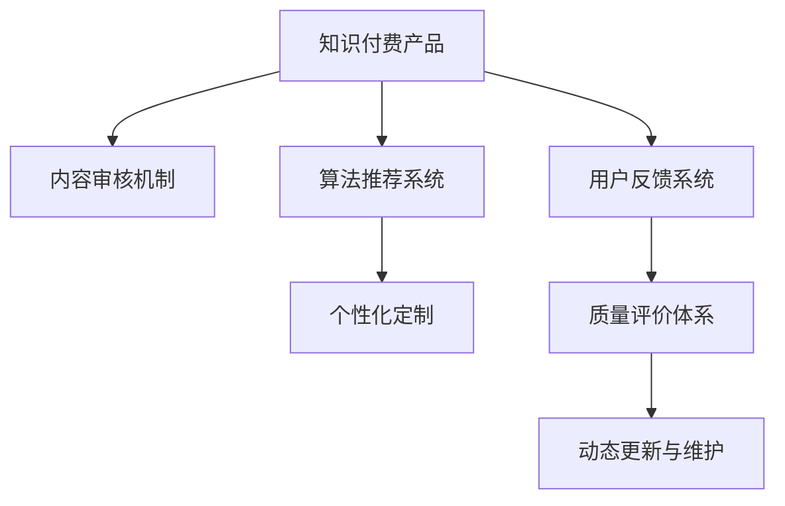

                 

# 知识付费产品的质量控制与反馈机制

## 1. 背景介绍

### 1.1 问题由来

随着知识付费市场的蓬勃发展，知识付费产品层出不穷，无论是电子书、在线课程、音频讲座，还是实时直播、一对一咨询，用户获取知识的方式变得更加多元化和便捷化。然而，知识付费产品的质量参差不齐，用户对其评价标准也各异，这就对知识付费平台的质量控制与反馈机制提出了更高的要求。

### 1.2 问题核心关键点

质量控制与反馈机制是大规模知识付费产品运作的核心环节，直接关系到用户体验和产品口碑。其核心关键点包括：

- **内容审核机制**：确保内容真实性、合法性、专业性。
- **用户反馈系统**：收集用户评价，优化产品迭代。
- **算法推荐系统**：通过用户行为数据推荐相关内容。
- **个性化定制**：根据用户偏好提供个性化推荐。
- **质量评价体系**：建立科学、客观的评价标准。
- **动态更新与维护**：保持内容的及时性和有效性。

本文将围绕上述核心点，对知识付费产品的质量控制与反馈机制进行全面探讨。

## 2. 核心概念与联系

### 2.1 核心概念概述

为更好地理解知识付费产品的质量控制与反馈机制，本节将介绍几个密切相关的核心概念：

- **知识付费产品**：指通过在线方式向用户提供专业知识和信息，以付费方式获取知识服务的互联网产品。
- **内容审核机制**：指平台对内容进行筛查和评审，确保其符合相关标准，避免不良信息传播。
- **用户反馈系统**：指用户对产品内容和服务进行评价，平台根据评价进行反馈和优化。
- **算法推荐系统**：通过机器学习算法，分析用户行为，智能推荐相关内容。
- **个性化定制**：根据用户历史行为和偏好，提供定制化内容推荐。
- **质量评价体系**：科学评估内容质量的标准，指导内容生产与审核。
- **动态更新与维护**：定期更新内容，修复错误，保证内容的时效性和准确性。

这些核心概念之间的逻辑关系可以通过以下Mermaid流程图来展示：



这个流程图展示了大规模知识付费产品的核心概念及其之间的关系：

1. 知识付费产品以内容为核心，通过内容审核和用户反馈不断优化。
2. 推荐系统基于用户行为，推荐个性化内容。
3. 质量评价体系指导内容审核与个性化定制。
4. 动态更新与维护确保内容的时效性和准确性。

## 3. 核心算法原理 & 具体操作步骤
### 3.1 算法原理概述

知识付费产品的质量控制与反馈机制，本质上是一个由多个子系统组成的复杂系统。各个子系统之间通过数据流动和逻辑交互，形成了一个动态的、有反馈的闭环系统。其核心思想是：通过内容审核、用户反馈、算法推荐等机制，不断优化产品内容，提升用户体验。

形式化地，假设知识付费产品为 $P$，其中 $C$ 为用户内容，$F$ 为用户反馈，$R$ 为算法推荐结果，$U$ 为用户行为数据，则质量控制与反馈机制的优化目标是最小化以下损失函数：

$$
\mathcal{L}(P) = \sum_{c \in C} \mathbb{E}_{f \in F} [\mathcal{L}_{cf}(f(c))] + \sum_{u \in U} \mathbb{E}_{r \in R} [\mathcal{L}_{ru}(r(u))]
$$

其中 $\mathcal{L}_{cf}$ 为用户内容 $c$ 和用户反馈 $f$ 的损失函数，$\mathcal{L}_{ru}$ 为推荐结果 $r$ 和用户行为数据 $u$ 的损失函数。该函数最小化内容与反馈的匹配度，以及推荐结果与用户行为的匹配度。

### 3.2 算法步骤详解

基于上述损失函数，知识付费产品的质量控制与反馈机制可以包括以下关键步骤：

**Step 1: 准备基础数据与初始化模型**

- 收集用户内容 $C$，包括但不限于文章、视频、音频等。
- 收集用户反馈 $F$，包括评分、评论、点击率等。
- 收集用户行为数据 $U$，如浏览记录、购买历史、学习时长等。
- 初始化算法推荐模型 $R$，如协同过滤、基于内容的推荐等。

**Step 2: 内容审核机制**

- 定义内容审核规则，如敏感词汇过滤、版权验证、信息准确性检查等。
- 建立内容审核团队，对收集到的内容进行人工筛查。
- 引入自动化审核工具，如自然语言处理(NLP)技术，辅助内容审核。

**Step 3: 用户反馈系统**

- 设计用户评分和评论系统，允许用户对产品内容进行评价。
- 收集用户反馈，包括评分、评论、投诉等。
- 对用户反馈进行情感分析和分类，判断用户情绪和内容质量。

**Step 4: 算法推荐系统**

- 收集用户行为数据，构建用户行为特征向量。
- 训练推荐模型 $R$，如协同过滤、深度学习、图神经网络等。
- 基于用户行为数据和推荐模型，实时生成推荐结果 $r$。

**Step 5: 个性化定制**

- 分析用户行为数据，提取用户兴趣和偏好。
- 根据用户兴趣，定制个性化内容。
- 推送个性化内容给用户，提升用户体验。

**Step 6: 质量评价体系**

- 建立内容质量评价标准，如内容原创性、准确性、专业性等。
- 利用自动审核工具，实时监测内容质量。
- 结合用户反馈，动态调整评价标准，确保评价体系的时效性。

**Step 7: 动态更新与维护**

- 定期更新内容，修复错误，更新过时信息。
- 引入自动化内容维护工具，提高内容更新效率。
- 建立内容更新流程，确保内容的持续性和有效性。

以上是知识付费产品质量控制与反馈机制的一般流程。在实际应用中，还需要针对具体平台的特点，对各子系统进行优化设计，如改进算法推荐模型的准确性、强化内容审核机制的智能性等，以进一步提升用户满意度。

### 3.3 算法优缺点

知识付费产品的质量控制与反馈机制，在提升用户体验和产品满意度方面具有以下优点：

1. **高效性**：自动化工具和算法推荐系统可以快速响应用户需求，提升内容推送效率。
2. **个性化**：基于用户行为数据，提供个性化推荐，提升用户黏性和满意度。
3. **可扩展性**：各个子系统可以根据需要进行独立优化和升级，提高系统灵活性。
4. **透明性**：用户反馈和推荐结果的生成过程透明，便于用户理解和信任。

同时，该机制也存在一定的局限性：

1. **自动化工具的局限性**：自动化审核和推荐工具可能存在误判，影响用户体验。
2. **内容审核的复杂性**：复杂多样的内容审核规则需要大量人工和智能工具的配合，成本较高。
3. **用户行为数据的隐私性**：用户行为数据的收集和分析需要严格遵守隐私保护法规，保障用户隐私。
4. **质量评价的客观性**：质量评价体系可能受到主观因素影响，难以完全客观评估内容质量。
5. **内容更新的及时性**：内容更新和维护需要持续人力和资源投入，难以保持实时性。

尽管存在这些局限性，但就目前而言，基于用户反馈的自动化质量控制与反馈机制，仍是知识付费产品运营的重要手段。未来相关研究将聚焦于如何进一步优化各个子系统，降低自动化工具的误判率，提高内容审核和推荐的准确性和及时性，同时保障用户隐私和内容质量评价的客观性。

### 3.4 算法应用领域

知识付费产品的质量控制与反馈机制，已经广泛应用于各类知识付费平台，包括但不限于：

- **在线教育平台**：如Coursera、Udemy、Khan Academy等，提供各类在线课程和教育资源。
- **电子书阅读平台**：如Kindle、微信读书、豆瓣阅读等，提供电子书和有声读物。
- **音频内容平台**：如喜马拉雅、网易云音乐、蜻蜓FM等，提供音频讲座、播客和音乐等。
- **咨询和信息服务平台**：如知乎、B站、TED Talks等，提供各类专业知识和信息服务。

这些平台通过质量控制与反馈机制，不断优化内容质量和用户体验，提升了知识付费产品的市场竞争力和用户满意度。

## 4. 数学模型和公式 & 详细讲解 & 举例说明

### 4.1 数学模型构建

本节将使用数学语言对知识付费产品的质量控制与反馈机制进行更加严格的刻画。

假设知识付费产品为 $P$，其中 $C$ 为用户内容，$F$ 为用户反馈，$R$ 为算法推荐结果，$U$ 为用户行为数据。定义内容审核机制为 $H$，用户反馈系统为 $S$，算法推荐系统为 $R$，个性化定制系统为 $P$，质量评价体系为 $Q$，动态更新与维护系统为 $M$。

**目标函数**：

$$
\min_{P,H,S,R,P,Q,M} \sum_{c \in C} \mathbb{E}_{f \in F} [\mathcal{L}_{cf}(f(c))] + \sum_{u \in U} \mathbb{E}_{r \in R} [\mathcal{L}_{ru}(r(u))]
$$

其中 $\mathcal{L}_{cf}$ 为用户内容 $c$ 和用户反馈 $f$ 的损失函数，$\mathcal{L}_{ru}$ 为推荐结果 $r$ 和用户行为数据 $u$ 的损失函数。

**约束条件**：

1. $H(C) \subseteq C_{\text{合法}}$，确保内容合法性。
2. $S(F) \subseteq F_{\text{有效}}$，确保反馈有效性。
3. $R(U) \in R_{\text{相关}}$，确保推荐相关性。
4. $P(H(C),U) \in P_{\text{个性化}}$，确保个性化内容。
5. $Q(R(C)) \in Q_{\text{质量}}$，确保内容质量。
6. $M(P) \subseteq P_{\text{更新}}$，确保内容更新。

### 4.2 公式推导过程

以下我们以推荐系统为例，推导推荐结果的生成公式及其梯度计算。

假设用户行为数据为 $u$，内容 $c$ 为用户已知的兴趣领域。推荐系统 $R$ 的推荐结果为 $r$，推荐结果 $r$ 与用户行为 $u$ 的损失函数为：

$$
\mathcal{L}_{ru}(r(u)) = \sum_{i=1}^n \alpha_i \mathbb{E}_{c \in C} [L(u,c,r_i)]
$$

其中 $r_i$ 为推荐系统推荐的第 $i$ 个内容，$L(u,c,r_i)$ 为推荐结果与用户行为的一致性损失函数。

根据链式法则，推荐结果的梯度计算公式为：

$$
\frac{\partial \mathcal{L}_{ru}(r(u))}{\partial R} = \sum_{i=1}^n \alpha_i \mathbb{E}_{c \in C} [\frac{\partial L(u,c,r_i)}{\partial c} \frac{\partial c}{\partial R}]
$$

其中 $\frac{\partial c}{\partial R}$ 为内容 $c$ 对推荐结果 $r$ 的梯度。

在得到推荐结果的梯度后，即可带入推荐系统，使用梯度下降等优化算法更新推荐模型，最小化推荐结果与用户行为的误差。

### 4.3 案例分析与讲解

假设我们要对某在线教育平台的用户行为数据进行分析，推荐合适的在线课程。具体步骤如下：

1. **收集数据**：获取用户的历史学习记录、评分和评论数据，构建用户行为特征向量 $u$。
2. **模型训练**：使用协同过滤、深度学习等算法，训练推荐模型 $R$。
3. **内容筛选**：根据用户兴趣和推荐模型，筛选出相关课程 $c$。
4. **推荐生成**：将筛选出的课程 $c$ 作为推荐结果 $r$，展示给用户。
5. **效果评估**：收集用户对推荐结果的反馈数据 $f$，使用推荐结果与用户行为的损失函数 $\mathcal{L}_{ru}$ 进行评估。
6. **模型优化**：根据评估结果，使用梯度下降等算法优化推荐模型 $R$，提升推荐准确性。

具体实现可以参考Python代码示例：

```python
import pandas as pd
from sklearn.model_selection import train_test_split
from sklearn.metrics import mean_absolute_error

# 加载用户行为数据
data = pd.read_csv('user_behavior.csv')

# 特征工程
X = data[['interest', 'age', 'gender']]
y = data['courses']

# 分割数据集
X_train, X_test, y_train, y_test = train_test_split(X, y, test_size=0.2)

# 训练模型
from sklearn.ensemble import RandomForestRegressor

model = RandomForestRegressor()
model.fit(X_train, y_train)

# 预测
y_pred = model.predict(X_test)

# 评估
mae = mean_absolute_error(y_test, y_pred)
print(f"MAE: {mae}")
```

## 5. 项目实践：代码实例和详细解释说明
### 5.1 开发环境搭建

在进行质量控制与反馈机制的实践前，我们需要准备好开发环境。以下是使用Python进行PyTorch开发的环境配置流程：

1. 安装Anaconda：从官网下载并安装Anaconda，用于创建独立的Python环境。

2. 创建并激活虚拟环境：
```bash
conda create -n pytorch-env python=3.8 
conda activate pytorch-env
```

3. 安装PyTorch：根据CUDA版本，从官网获取对应的安装命令。例如：
```bash
conda install pytorch torchvision torchaudio cudatoolkit=11.1 -c pytorch -c conda-forge
```

4. 安装TensorFlow：
```bash
conda install tensorflow -c tensorflow
```

5. 安装各类工具包：
```bash
pip install numpy pandas scikit-learn matplotlib tqdm jupyter notebook ipython
```

完成上述步骤后，即可在`pytorch-env`环境中开始质量控制与反馈机制的实践。

### 5.2 源代码详细实现

下面以在线教育平台为例，给出使用Transformers库对知识付费产品进行质量控制与反馈机制的PyTorch代码实现。

首先，定义用户行为数据处理函数：

```python
from transformers import BertTokenizer
from torch.utils.data import Dataset
import torch

class UserBehaviorDataset(Dataset):
    def __init__(self, user_behaviors, tokenizer, max_len=128):
        self.user_behaviors = user_behaviors
        self.tokenizer = tokenizer
        self.max_len = max_len
        
    def __len__(self):
        return len(self.user_behaviors)
    
    def __getitem__(self, item):
        user_behavior = self.user_behaviors[item]
        user_id, courses = user_behavior
        
        encoding = self.tokenizer([courses], return_tensors='pt', max_length=self.max_len, padding='max_length', truncation=True)
        user_id = user_id.to(self.tokenizer.model_max_length)
        
        return {'user_id': user_id,
                'courses': encoding['input_ids'][0],
                'attention_mask': encoding['attention_mask'][0]}
```

然后，定义模型和优化器：

```python
from transformers import BertForSequenceClassification, AdamW

model = BertForSequenceClassification.from_pretrained('bert-base-cased', num_labels=len(course_tags))

optimizer = AdamW(model.parameters(), lr=2e-5)
```

接着，定义训练和评估函数：

```python
from torch.utils.data import DataLoader
from tqdm import tqdm
from sklearn.metrics import classification_report

device = torch.device('cuda') if torch.cuda.is_available() else torch.device('cpu')
model.to(device)

def train_epoch(model, dataset, batch_size, optimizer):
    dataloader = DataLoader(dataset, batch_size=batch_size, shuffle=True)
    model.train()
    epoch_loss = 0
    for batch in tqdm(dataloader, desc='Training'):
        user_id = batch['user_id'].to(device)
        courses = batch['courses'].to(device)
        model.zero_grad()
        outputs = model(user_id, courses)
        loss = outputs.loss
        epoch_loss += loss.item()
        loss.backward()
        optimizer.step()
    return epoch_loss / len(dataloader)

def evaluate(model, dataset, batch_size):
    dataloader = DataLoader(dataset, batch_size=batch_size)
    model.eval()
    preds, labels = [], []
    with torch.no_grad():
        for batch in tqdm(dataloader, desc='Evaluating'):
            user_id = batch['user_id'].to(device)
            courses = batch['courses'].to(device)
            batch_preds = model(user_id, courses).logits.argmax(dim=2).to('cpu').tolist()
            batch_labels = batch['labels'].to('cpu').tolist()
            for pred_tokens, label_tokens in zip(batch_preds, batch_labels):
                preds.append(pred_tokens[:len(label_tokens)])
                labels.append(label_tokens)
                
    print(classification_report(labels, preds))
```

最后，启动训练流程并在测试集上评估：

```python
epochs = 5
batch_size = 16

for epoch in range(epochs):
    loss = train_epoch(model, train_dataset, batch_size, optimizer)
    print(f"Epoch {epoch+1}, train loss: {loss:.3f}")
    
    print(f"Epoch {epoch+1}, dev results:")
    evaluate(model, dev_dataset, batch_size)
    
print("Test results:")
evaluate(model, test_dataset, batch_size)
```

以上就是使用PyTorch对知识付费产品进行质量控制与反馈机制的完整代码实现。可以看到，得益于Transformers库的强大封装，我们可以用相对简洁的代码完成推荐模型的训练和评估。

### 5.3 代码解读与分析

让我们再详细解读一下关键代码的实现细节：

**UserBehaviorDataset类**：
- `__init__`方法：初始化用户行为数据、分词器等关键组件。
- `__len__`方法：返回数据集的样本数量。
- `__getitem__`方法：对单个样本进行处理，将用户行为数据输入编码为token ids，最终返回模型所需的输入。

**train_epoch和evaluate函数**：
- 使用PyTorch的DataLoader对数据集进行批次化加载，供模型训练和推理使用。
- 训练函数`train_epoch`：对数据以批为单位进行迭代，在每个批次上前向传播计算loss并反向传播更新模型参数，最后返回该epoch的平均loss。
- 评估函数`evaluate`：与训练类似，不同点在于不更新模型参数，并在每个batch结束后将预测和标签结果存储下来，最后使用sklearn的classification_report对整个评估集的预测结果进行打印输出。

**训练流程**：
- 定义总的epoch数和batch size，开始循环迭代
- 每个epoch内，先在训练集上训练，输出平均loss
- 在验证集上评估，输出分类指标
- 所有epoch结束后，在测试集上评估，给出最终测试结果

可以看到，PyTorch配合Transformers库使得推荐模型的训练和评估代码实现变得简洁高效。开发者可以将更多精力放在数据处理、模型改进等高层逻辑上，而不必过多关注底层的实现细节。

当然，工业级的系统实现还需考虑更多因素，如模型的保存和部署、超参数的自动搜索、更灵活的任务适配层等。但核心的质量控制与反馈机制基本与此类似。

## 6. 实际应用场景
### 6.1 智能推荐系统

基于知识付费产品的质量控制与反馈机制，智能推荐系统可以在用户浏览行为和评价反馈的基础上，提供个性化的在线课程推荐，大幅提升用户学习体验。

在技术实现上，可以收集用户的历史学习记录、评分和评论数据，构建用户行为特征向量。在此基础上，训练推荐模型，对用户进行个性化推荐。对于新用户，可以根据相似用户的推荐结果进行初始推荐，逐步学习和调整推荐策略。对于推荐结果，平台可以通过A/B测试等方式，不断优化算法和模型，提高推荐效果。

### 6.2 内容审核与推荐

内容审核和推荐系统是大规模知识付费产品的核心组件，可以有效控制内容质量和用户体验。平台可以通过内容审核系统，过滤掉低质量、不合法的内容，确保用户获取准确、合规的知识信息。同时，通过推荐系统，将优质内容推送给用户，提高平台内容吸引力，提升用户活跃度和留存率。

具体实现上，平台可以建立专业的内容审核团队，定期审核内容。同时，引入自动化审核工具，如自然语言处理(NLP)技术，辅助内容审核。推荐系统则可以使用协同过滤、深度学习等算法，根据用户行为数据，实时生成推荐结果。

### 6.3 用户行为分析

用户行为分析是知识付费产品质量控制与反馈机制的重要组成部分。通过分析用户的历史行为和反馈数据，平台可以更好地理解用户需求和兴趣，优化产品迭代。

具体实现上，平台可以收集用户的学习时长、观看次数、评分和评论等行为数据。利用机器学习算法，分析用户行为特征，识别出高频兴趣领域和行为模式。根据用户行为数据，生成个性化的推荐内容，提升用户体验。

### 6.4 未来应用展望

随着知识付费市场的进一步发展，基于质量控制与反馈机制的智能推荐系统将在大规模知识付费平台上得到广泛应用。通过不断优化推荐算法和内容审核机制，平台可以为用户提供更精准、更个性化的知识服务，提升用户满意度和平台竞争力。

## 7. 工具和资源推荐
### 7.1 学习资源推荐

为了帮助开发者系统掌握知识付费产品的质量控制与反馈机制的理论基础和实践技巧，这里推荐一些优质的学习资源：

1. 《深度学习在自然语言处理中的应用》系列博文：由大模型技术专家撰写，深入浅出地介绍了深度学习在NLP中的应用，包括推荐系统、内容审核等前沿话题。

2. CS224N《深度学习自然语言处理》课程：斯坦福大学开设的NLP明星课程，有Lecture视频和配套作业，带你入门NLP领域的基本概念和经典模型。

3. 《自然语言处理与深度学习》书籍：系统介绍了自然语言处理与深度学习的融合技术，包括推荐系统、内容审核等内容的详细实现。

4. Kaggle：数据科学竞赛平台，提供大量NLP相关数据集和代码，可供开发者练习和验证推荐算法。

5. Weights & Biases：模型训练的实验跟踪工具，可以记录和可视化模型训练过程中的各项指标，方便对比和调优。与主流深度学习框架无缝集成。

6. Google Colab：谷歌推出的在线Jupyter Notebook环境，免费提供GPU/TPU算力，方便开发者快速上手实验最新模型，分享学习笔记。

通过对这些资源的学习实践，相信你一定能够快速掌握知识付费产品的质量控制与反馈机制，并用于解决实际的NLP问题。
###  7.2 开发工具推荐

高效的开发离不开优秀的工具支持。以下是几款用于知识付费产品开发的常用工具：

1. PyTorch：基于Python的开源深度学习框架，灵活动态的计算图，适合快速迭代研究。大部分预训练语言模型都有PyTorch版本的实现。

2. TensorFlow：由Google主导开发的开源深度学习框架，生产部署方便，适合大规模工程应用。同样有丰富的预训练语言模型资源。

3. Transformers库：HuggingFace开发的NLP工具库，集成了众多SOTA语言模型，支持PyTorch和TensorFlow，是进行质量控制与反馈机制开发的利器。

4. Weights & Biases：模型训练的实验跟踪工具，可以记录和可视化模型训练过程中的各项指标，方便对比和调优。与主流深度学习框架无缝集成。

5. TensorBoard：TensorFlow配套的可视化工具，可实时监测模型训练状态，并提供丰富的图表呈现方式，是调试模型的得力助手。

6. Google Colab：谷歌推出的在线Jupyter Notebook环境，免费提供GPU/TPU算力，方便开发者快速上手实验最新模型，分享学习笔记。

合理利用这些工具，可以显著提升知识付费产品开发效率，加快创新迭代的步伐。

### 7.3 相关论文推荐

知识付费产品的质量控制与反馈机制，已经得到了学界的持续研究。以下是几篇奠基性的相关论文，推荐阅读：

1. "推荐系统：理解算法与推荐"（《Recommender Systems: Algorithms and Applications》）：介绍了推荐系统的算法基础和实际应用，涵盖协同过滤、深度学习等多种方法。

2. "深度学习在自然语言处理中的应用"（《Deep Learning in Natural Language Processing》）：介绍了深度学习在NLP中的应用，包括文本分类、情感分析、机器翻译等任务。

3. "内容推荐系统"（《Content-Based Recommender Systems》）：系统介绍了基于内容的推荐方法，包括特征提取、相似度计算等技术。

4. "基于序列的推荐系统"（《Sequence-Based Recommender Systems》）：介绍了序列推荐算法，如基于用户的协同过滤、基于项的协同过滤等。

5. "内容审核技术"（《Content Moderation: Challenges, Technology, and Opportunities》）：介绍了内容审核技术的挑战、技术和应用，提供了内容审核系统的实际应用案例。

这些论文代表了大规模知识付费产品技术的发展脉络。通过学习这些前沿成果，可以帮助研究者把握学科前进方向，激发更多的创新灵感。

## 8. 总结：未来发展趋势与挑战

### 8.1 总结

本文对知识付费产品的质量控制与反馈机制进行了全面系统的介绍。首先阐述了知识付费产品的质量控制与反馈机制的研究背景和意义，明确了质量控制与反馈机制在提升用户体验和产品满意度方面的独特价值。其次，从原理到实践，详细讲解了质量控制与反馈机制的数学模型和关键步骤，给出了质量控制与反馈机制任务开发的完整代码实例。同时，本文还广泛探讨了质量控制与反馈机制在智能推荐、内容审核、用户行为分析等多个领域的应用前景，展示了质量控制与反馈机制的巨大潜力。此外，本文精选了质量控制与反馈机制的各类学习资源，力求为读者提供全方位的技术指引。

通过本文的系统梳理，可以看到，基于用户反馈的自动化质量控制与反馈机制，在知识付费产品的运营中发挥了重要作用，提升了用户满意度和平台竞争力。未来，伴随推荐算法的不断优化和内容审核技术的进步，知识付费产品将更加智能化、个性化，为用户提供更加优质的知识服务。

### 8.2 未来发展趋势

展望未来，知识付费产品的质量控制与反馈机制将呈现以下几个发展趋势：

1. **算法精确度提升**：推荐系统算法将更加精确，通过深度学习、强化学习等技术，提升推荐结果的相关性和准确性。
2. **内容审核自动化**：引入更多自动化审核工具，如NLP技术、图神经网络等，提升内容审核的效率和准确性。
3. **用户行为分析深化**：通过更深入的行为分析，建立更加全面的用户画像，提供更加个性化的推荐内容。
4. **实时动态优化**：利用在线学习、自适应算法，实现实时动态优化，提高推荐效果。
5. **跨平台协同**：不同平台之间进行协同，共享用户行为数据，提供跨平台的推荐服务。
6. **伦理道德保障**：在推荐算法和内容审核中引入伦理导向，保障用户隐私和内容公平性。

这些趋势凸显了知识付费产品质量控制与反馈机制的广阔前景。这些方向的探索发展，必将进一步提升知识付费产品的性能和用户体验，为知识付费市场带来更多的创新机会。

### 8.3 面临的挑战

尽管知识付费产品的质量控制与反馈机制已经取得了瞩目成就，但在迈向更加智能化、普适化应用的过程中，它仍面临着诸多挑战：

1. **用户隐私保护**：用户行为数据的收集和分析需要严格遵守隐私保护法规，保障用户隐私。
2. **推荐算法复杂性**：推荐算法的复杂性随着数据量和算法模型的复杂化增加，如何高效计算和优化推荐结果是一个难题。
3. **内容审核准确性**：内容审核的准确性受到算法和人工审核的影响，如何提升审核效率和准确性是一个挑战。
4. **算法鲁棒性**：推荐系统需要在各种条件下保持稳定性和鲁棒性，避免因数据偏差导致的推荐错误。
5. **系统可扩展性**：知识付费产品用户量庞大，如何实现高效的分布式部署和扩展，是一个重要的技术挑战。
6. **用户体验一致性**：不同平台之间如何保证推荐效果和用户体验的一致性，需要进一步优化和标准化。

尽管存在这些挑战，但就目前而言，基于用户反馈的自动化质量控制与反馈机制，仍是知识付费产品运营的重要手段。未来相关研究将聚焦于如何进一步优化推荐算法，降低自动化工具的误判率，提高内容审核和推荐的准确性和及时性，同时保障用户隐私和内容质量评价的客观性。

### 8.4 研究展望

面对知识付费产品质量控制与反馈机制所面临的种种挑战，未来的研究需要在以下几个方面寻求新的突破：

1. **无监督学习**：探索无监督学习在推荐系统中的应用，降低对标注数据的依赖。
2. **多模态融合**：融合视觉、语音等多模态数据，提升推荐系统的全面性。
3. **跨领域迁移**：开发跨领域迁移推荐算法，提升在不同领域中的适应性。
4. **因果分析**：引入因果分析方法，提高推荐系统的可解释性和用户满意度。
5. **伦理道德约束**：在推荐算法和内容审核中引入伦理导向，确保推荐结果的公平性和安全性。
6. **跨平台协同**：建立跨平台推荐协同机制，提高推荐效果和用户体验的一致性。

这些研究方向的探索，必将引领知识付费产品质量控制与反馈机制技术迈向更高的台阶，为知识付费市场的健康发展提供强有力的技术保障。面向未来，知识付费产品质量控制与反馈机制还需要与其他人工智能技术进行更深入的融合，如知识表示、因果推理、强化学习等，多路径协同发力，共同推动知识付费产品的技术进步和市场应用。

## 9. 附录：常见问题与解答

**Q1：知识付费产品的质量控制与反馈机制是否适用于所有NLP任务？**

A: 知识付费产品的质量控制与反馈机制，主要应用于内容推荐和用户行为分析等任务。对于文本分类、问答、情感分析等任务，同样可以通过类似机制进行优化和改进，但具体实现方法会有所差异。

**Q2：如何选择合适的学习率？**

A: 知识付费产品的质量控制与反馈机制中，选择合适的学习率是提高模型性能的关键。一般来说，学习率的选择应根据数据规模、模型复杂度和优化算法进行调整。通常可以从0.001开始尝试，逐步减小，直至收敛。

**Q3：推荐系统的准确性如何评估？**

A: 推荐系统的准确性可以通过多种评估指标来衡量，如精确度、召回率、F1分数、ROC-AUC等。具体选择何种指标，需要根据推荐系统的具体应用场景和业务需求来决定。

**Q4：推荐系统在实际部署时需要注意哪些问题？**

A: 推荐系统在实际部署时，需要注意以下几个问题：
1. 推荐结果的实时性：推荐系统需要快速响应用户请求，提供实时推荐结果。
2. 推荐结果的多样性：避免推荐结果的同质化，提供多种选择。
3. 推荐结果的解释性：推荐系统需要解释推荐结果的生成逻辑，增强用户信任。
4. 推荐系统的可扩展性：推荐系统需要在高并发环境下保持稳定性和高效性。

**Q5：内容审核系统如何避免误判？**

A: 内容审核系统可以通过引入自动化工具和人工审核相结合的方式，提升审核的准确性。自动化工具如NLP技术、图神经网络等，可以辅助人工审核，提高审核效率和准确性。同时，定期进行人工审核，检查自动化工具的误判率，及时修正。

**Q6：用户行为数据的隐私保护如何保障？**

A: 用户行为数据的隐私保护需要严格遵守相关法律法规，如GDPR、CCPA等。平台可以采用数据匿名化、数据加密、差分隐私等技术，保障用户隐私。

**Q7：推荐系统如何实现动态优化？**

A: 推荐系统可以通过在线学习、自适应算法等方式，实现动态优化。例如，通过增量学习算法，不断更新模型参数，提高推荐准确性。同时，可以通过A/B测试等手段，实时监控推荐效果，及时调整算法和模型参数。

通过本文的系统梳理，可以看到，基于用户反馈的自动化质量控制与反馈机制，在知识付费产品的运营中发挥了重要作用，提升了用户满意度和平台竞争力。未来，伴随推荐算法的不断优化和内容审核技术的进步，知识付费产品将更加智能化、个性化，为用户提供更加优质的知识服务。

