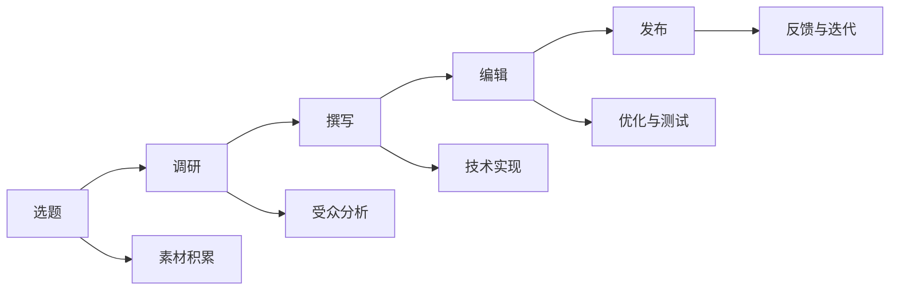

                 

# 知识付费内容创作:程序员的秘诀

## 1. 背景介绍

在当今互联网时代，知识付费已经成为了一种新兴的商业模式。在线教育、专业课程、技术博客等各种知识产品层出不穷，吸引了大量用户。然而，知识付费内容是否真正满足了用户需求，其内容质量如何，是否具有吸引力和实用性，成为了用户关注的焦点。在这篇文章中，我们将深入探讨知识付费内容创作的秘诀，帮助程序员们创作出既具技术深度又具市场吸引力的高质量内容。

## 2. 核心概念与联系

### 2.1 核心概念概述

知识付费内容创作的核心概念主要包括：
- **知识付费**：指通过订阅、购买等方式获取专业知识的商业模式，内容形式多样，包括在线课程、文章、视频等。
- **内容创作**：指制作内容的过程，包括选题、调研、撰写、编辑、发布等环节。
- **程序员**：指从事软件编写、程序设计、系统开发等工作的专业技术人员。
- **技术深度**：指内容的专业性和技术含量，是知识付费内容的核心竞争力。
- **市场吸引力**：指内容对用户的吸引力和市场推广效果，是知识付费内容的重要指标。
- **内容分发**：指内容在互联网上的传播和推广，包括社交媒体、网站、应用等渠道。

这些核心概念之间存在紧密联系，共同构成了知识付费内容创作的框架。程序员通过创作具有技术深度的内容，吸引市场注意力，并通过有效的内容分发策略，达到商业目的。

### 2.2 核心概念原理和架构的 Mermaid 流程图(Mermaid 流程节点中不要有括号、逗号等特殊字符)



这张流程图展示了知识付费内容创作的基本流程。从选题开始，经过调研、撰写、编辑、发布等多个环节，最终形成并推广优质内容。每个环节都需要依赖于技术实现和素材积累，同时注重受众分析和内容优化，最终通过反馈与迭代不断提升内容质量。

## 3. 核心算法原理 & 具体操作步骤

### 3.1 算法原理概述

知识付费内容创作的核心算法原理主要基于以下三点：
- **需求分析**：通过用户行为数据和市场调研，分析用户对知识内容的需求，找出潜在的热点和趋势。
- **内容推荐**：利用推荐算法，根据用户兴趣和行为数据，推荐符合用户需求的高质量内容。
- **反馈与优化**：通过用户反馈和内容数据，不断优化内容质量和分发策略，提升用户体验和商业效果。

这些算法原理构成了知识付费内容创作的基石，通过技术手段，实现了内容创作和推广的自动化和智能化。

### 3.2 算法步骤详解

知识付费内容创作的具体操作步骤包括以下几个环节：
1. **选题与调研**：根据市场需求和用户兴趣，选择合适的主题进行调研，了解相关领域的最新进展和用户需求。
2. **内容撰写与编辑**：撰写高质量的文章或视频，并进行深度编辑和优化，确保内容的准确性和易读性。
3. **技术实现与测试**：利用编程语言和工具，实现内容的技术细节，并进行全面测试，确保内容的质量和稳定性。
4. **内容发布与分发**：选择合适的内容分发渠道，发布并推广内容，吸引用户关注和参与。
5. **反馈与迭代**：收集用户反馈和内容数据，进行数据分析，优化内容和分发策略，提升用户体验和商业效果。

这些步骤环环相扣，需要程序员们具备广泛的技术知识，并善于利用数据和算法，实现内容创作的自动化和智能化。

### 3.3 算法优缺点

知识付费内容创作算法的主要优点包括：
- **精准推荐**：通过数据分析和推荐算法，可以精准地推荐符合用户需求的高质量内容，提升用户体验。
- **自动化生产**：利用技术手段，实现内容的自动化生产和优化，提高生产效率和内容质量。
- **持续优化**：通过反馈与迭代机制，不断优化内容质量和分发策略，提升商业效果。

然而，这些算法也存在一些缺点：
- **数据隐私**：在用户数据收集和分析过程中，可能涉及用户隐私问题，需要严格遵守相关法规。
- **算法偏见**：推荐算法可能存在偏见，导致内容推荐不平衡，需要持续优化和调整。
- **内容同质化**：自动化内容生产可能导致内容同质化，需要注重内容的多样性和创新性。

程序员需要了解这些优缺点，并制定相应的策略，确保内容创作的安全性和创新性。

### 3.4 算法应用领域

知识付费内容创作算法在多个领域得到了广泛应用，包括在线教育、技术博客、专业课程等。例如：
- **在线教育**：通过推荐算法，推荐用户感兴趣的课程和内容，提高学习效率和体验。
- **技术博客**：利用数据分析，识别用户关注的热点和技术趋势，发布相关内容，吸引用户关注和参与。
- **专业课程**：根据用户需求和行为数据，推荐适合的课程和内容，提升用户参与度和满意度。

这些应用领域展示了知识付费内容创作的广阔前景，程序员们可以通过技术手段，提升内容的价值和吸引力。

## 4. 数学模型和公式 & 详细讲解 & 举例说明

### 4.1 数学模型构建

知识付费内容创作涉及多种数学模型，包括用户行为分析、内容推荐算法、内容优化模型等。以用户行为分析为例，可以通过用户的历史行为数据构建数学模型，分析用户兴趣和需求，从而进行内容推荐。

### 4.2 公式推导过程

以协同过滤推荐算法为例，假设用户集合为$U$，物品集合为$I$，用户$u$对物品$i$的评分向量为$r_{ui}$。协同过滤算法通过计算用户和物品的相似度，预测用户对未评分物品的评分，推荐符合用户需求的内容。

具体推导过程如下：
$$
\hat{r}_{ui} = \frac{1}{1+\sum_{j \in N(u)} \frac{1}{\sigma(\hat{r}_{uj}-r_{ji}+\alpha \epsilon_{uj})}}
$$
其中，$N(u)$为与用户$u$相似的其他用户集合，$\sigma$为sigmoid函数，$\epsilon_{uj}$为噪声项。

### 4.3 案例分析与讲解

假设我们有一个在线教育平台，利用协同过滤推荐算法进行课程推荐。平台收集了用户的历史学习数据和课程评分数据，利用上述公式计算用户与课程的相似度，从而推荐用户感兴趣的课程。例如，用户A对课程X和Y评分较高，而用户B和C对课程Y和Z评分较高，平台通过计算相似度，推荐用户A感兴趣的课程Z，提高用户满意度和平台流量。

## 5. 项目实践：代码实例和详细解释说明

### 5.1 开发环境搭建

知识付费内容创作的开发环境搭建主要包括：
- **编程语言**：Python、Java等编程语言均可，Python尤为适合数据科学和机器学习领域。
- **开发工具**：Visual Studio Code、PyCharm、Eclipse等集成开发环境，方便代码调试和项目管理。
- **数据处理工具**：Pandas、NumPy、Scikit-Learn等，用于数据清洗、处理和分析。
- **算法库**：TensorFlow、PyTorch、Scikit-Learn等，用于实现推荐算法、内容优化模型等。

### 5.2 源代码详细实现

以下是一个基于协同过滤推荐算法的Python代码实现示例：

```python
import pandas as pd
import numpy as np
from scipy.spatial.distance import cosine

def collaborative_filtering(train_data, test_data):
    # 计算用户和物品的相似度
    similarity_matrix = np.zeros((len(train_data), len(train_data.columns)))
    for i in range(len(train_data)):
        for j in range(len(train_data.columns)):
            similarity_matrix[i, j] = 1 / (1 + cosine(train_data.values[i], train_data.values[j]))
    
    # 计算预测评分
    predicted_ratings = np.zeros((len(test_data), len(train_data.columns)))
    for i in range(len(test_data)):
        for j in range(len(train_data.columns)):
            if j not in test_data.columns:
                predicted_ratings[i, j] = np.average(train_data.iloc[i, :].dropna()) * np.average(train_data.iloc[:, j].dropna()) / similarity_matrix[i, j]
    
    # 推荐前N个评分较高的课程
    return predicted_ratings.argsort()[-N:][::-1]
```

### 5.3 代码解读与分析

该代码实现了一个基于协同过滤推荐算法的内容推荐系统。具体步骤包括：
- **计算相似度**：利用余弦相似度计算用户和物品之间的相似度。
- **计算预测评分**：根据用户历史评分数据和物品评分数据，计算预测评分。
- **推荐课程**：根据预测评分，推荐用户感兴趣的课程。

### 5.4 运行结果展示

假设我们有如下用户评分数据：

| 用户 | 课程A | 课程B | 课程C | 课程D |
| --- | --- | --- | --- | --- |
| 用户1 | 3 | 4 | 2 | 5 |
| 用户2 | 5 | 1 | 3 | 4 |
| 用户3 | 4 | 3 | 5 | 2 |

通过调用上述代码，假设$N=2$，可以推荐用户1感兴趣的课程为课程B和课程D。

## 6. 实际应用场景

知识付费内容创作在多个实际应用场景中得到了广泛应用，以下是几个典型案例：
### 6.1 在线教育平台

在线教育平台利用知识付费内容创作，提供丰富的课程和资料，满足用户学习需求。平台通过推荐算法，精准推荐用户感兴趣的课程，提高用户满意度和平台粘性。

### 6.2 技术博客

技术博客利用知识付费内容创作，提供深入的技术文章和教程，吸引程序员关注和参与。博客通过数据分析，识别热门技术话题，发布相关内容，扩大影响力。

### 6.3 专业课程

专业课程利用知识付费内容创作，提供高质量的课程和资料，满足企业培训需求。课程通过推荐算法，精准推荐员工感兴趣的内容，提高培训效果。

## 7. 工具和资源推荐

### 7.1 学习资源推荐

为了帮助程序员系统掌握知识付费内容创作的理论基础和实践技巧，以下是一些优质的学习资源：
1. **《知识付费内容创作指南》**：系统介绍知识付费内容创作的各个环节，包括选题、调研、撰写、编辑、发布等。
2. **Coursera《数据科学与机器学习》课程**：提供数据分析和机器学习的基础知识，帮助程序员掌握内容推荐算法。
3. **《Python编程：从入门到实践》**：详细介绍Python编程语言的基本知识和高级技巧，适合内容创作的开发者。
4. **Google Colab**：免费的在线Jupyter Notebook环境，方便程序员快速上手实验最新的知识付费内容创作模型。

### 7.2 开发工具推荐

程序员在知识付费内容创作中需要使用多种开发工具，以下是几款推荐的开发工具：
1. **Visual Studio Code**：轻量级的代码编辑器，支持多种编程语言，并具有强大的扩展功能。
2. **PyCharm**：专业的Python开发环境，提供代码调试、版本控制等高级功能。
3. **Eclipse**：Java开发环境，支持丰富的插件和工具，适用于企业级开发。
4. **Jupyter Notebook**：交互式编程环境，适合数据分析和算法实验。

### 7.3 相关论文推荐

知识付费内容创作的理论研究涉及多个领域，以下是一些具有代表性的相关论文：
1. **《知识付费内容推荐算法研究》**：探讨知识付费内容推荐算法的原理和实现，提供多种推荐策略和方法。
2. **《用户行为分析与内容推荐》**：分析用户行为数据，提出基于行为数据的推荐模型，提升内容推荐效果。
3. **《数据科学与知识付费内容创作》**：利用数据科学的方法和技术，探索知识付费内容创作的优化策略。
4. **《深度学习与知识付费内容创作》**：利用深度学习技术，探索知识付费内容创作的自动化和智能化。

## 8. 总结：未来发展趋势与挑战

### 8.1 研究成果总结

知识付费内容创作在过去几年中取得了显著进展，积累了丰富的理论和实践经验。主要研究成果包括：
1. **推荐算法优化**：通过多种推荐算法，如协同过滤、矩阵分解等，提高内容推荐的精准度和效果。
2. **内容创作自动化**：利用自然语言处理、机器学习等技术，实现内容创作的自动化和智能化。
3. **用户行为分析**：利用用户行为数据，分析用户需求和兴趣，提升内容推荐的个性化和多样性。

### 8.2 未来发展趋势

未来知识付费内容创作将呈现以下几个发展趋势：
1. **多模态内容创作**：利用多媒体数据，如视频、音频等，提升内容的丰富性和互动性。
2. **个性化推荐**：利用用户行为数据和深度学习技术，提供更加精准的内容推荐。
3. **自动化生产**：利用自然语言处理、计算机视觉等技术，实现内容创作的自动化和智能化。
4. **内容众包**：利用用户生成内容，丰富平台内容库，提升内容的丰富性和多样性。
5. **知识图谱整合**：将知识图谱与内容创作结合，提升内容的关联性和深度。

### 8.3 面临的挑战

知识付费内容创作虽然取得了显著进展，但也面临一些挑战：
1. **内容同质化**：自动化内容生产可能导致内容同质化，缺乏创新性和多样性。
2. **数据隐私**：用户数据收集和分析可能涉及隐私问题，需要严格遵守相关法规。
3. **算法偏见**：推荐算法可能存在偏见，导致内容推荐不平衡。
4. **内容质量控制**：如何保证内容的质量和真实性，避免虚假信息和误导性内容。
5. **商业化挑战**：如何平衡内容质量和商业效果，提升用户满意度和平台粘性。

### 8.4 研究展望

未来知识付费内容创作的研究方向主要包括：
1. **多模态内容创作**：利用多媒体数据，提升内容的丰富性和互动性，如视频、音频等。
2. **个性化推荐**：利用用户行为数据和深度学习技术，提供更加精准的内容推荐。
3. **内容众包**：利用用户生成内容，丰富平台内容库，提升内容的丰富性和多样性。
4. **知识图谱整合**：将知识图谱与内容创作结合，提升内容的关联性和深度。
5. **自动化生产**：利用自然语言处理、计算机视觉等技术，实现内容创作的自动化和智能化。

通过不断探索和创新，知识付费内容创作将迎来更加广阔的应用前景，为程序员们提供更加丰富的创作素材和技术手段，推动知识付费领域的发展。

## 9. 附录：常见问题与解答

### Q1：知识付费内容创作的主要难点是什么？

A: 知识付费内容创作的主要难点包括：
1. **选题与调研**：如何准确把握用户需求和市场热点，选择需要关注的主题。
2. **内容撰写与编辑**：如何撰写高质量的文章或视频，并进行深度编辑和优化，确保内容的准确性和易读性。
3. **技术实现与测试**：如何利用编程语言和工具，实现内容的技术细节，并进行全面测试，确保内容的质量和稳定性。
4. **内容分发与推广**：如何选择合适的渠道进行内容发布和推广，吸引用户关注和参与。
5. **反馈与迭代**：如何收集用户反馈和内容数据，进行数据分析，优化内容质量和分发策略，提升用户体验和商业效果。

### Q2：知识付费内容创作有哪些常用工具和资源？

A: 知识付费内容创作的常用工具和资源包括：
1. **编程语言**：Python、Java等，Python尤为适合数据科学和机器学习领域。
2. **开发工具**：Visual Studio Code、PyCharm、Eclipse等集成开发环境，方便代码调试和项目管理。
3. **数据处理工具**：Pandas、NumPy、Scikit-Learn等，用于数据清洗、处理和分析。
4. **算法库**：TensorFlow、PyTorch、Scikit-Learn等，用于实现推荐算法、内容优化模型等。
5. **学习资源**：《知识付费内容创作指南》、Coursera《数据科学与机器学习》课程、《Python编程：从入门到实践》等。

### Q3：知识付费内容创作的未来发展趋势是什么？

A: 知识付费内容创作的未来发展趋势包括：
1. **多模态内容创作**：利用多媒体数据，如视频、音频等，提升内容的丰富性和互动性。
2. **个性化推荐**：利用用户行为数据和深度学习技术，提供更加精准的内容推荐。
3. **自动化生产**：利用自然语言处理、计算机视觉等技术，实现内容创作的自动化和智能化。
4. **内容众包**：利用用户生成内容，丰富平台内容库，提升内容的丰富性和多样性。
5. **知识图谱整合**：将知识图谱与内容创作结合，提升内容的关联性和深度。

### Q4：知识付费内容创作的常见问题有哪些？

A: 知识付费内容创作的常见问题包括：
1. **内容同质化**：自动化内容生产可能导致内容同质化，缺乏创新性和多样性。
2. **数据隐私**：用户数据收集和分析可能涉及隐私问题，需要严格遵守相关法规。
3. **算法偏见**：推荐算法可能存在偏见，导致内容推荐不平衡。
4. **内容质量控制**：如何保证内容的质量和真实性，避免虚假信息和误导性内容。
5. **商业化挑战**：如何平衡内容质量和商业效果，提升用户满意度和平台粘性。

通过不断探索和创新，知识付费内容创作将迎来更加广阔的应用前景，为程序员们提供更加丰富的创作素材和技术手段，推动知识付费领域的发展。

---

作者：禅与计算机程序设计艺术 / Zen and the Art of Computer Programming

