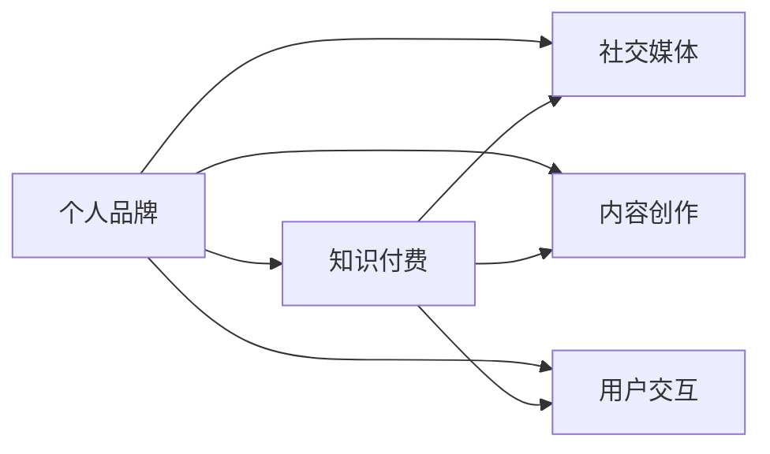

                 

# 知识付费创业中的个人品牌塑造

> 关键词：知识付费, 个人品牌, 社交媒体, 内容创作, 用户交互

## 1. 背景介绍

随着互联网技术的不断进步，知识付费赛道日益成为各路新兴企业和传统行业争相布局的蓝海市场。在数字化转型的浪潮下，用户对知识和信息的需求日益增长，寻求通过付费形式获取优质、高效、个性化的知识产品成为了新的消费趋势。在此背景下，个人品牌塑造与运营成为知识付费创业的重要环节，直接关系到平台的用户粘性、市场占有率和盈利能力。本文将围绕个人品牌塑造的核心理论、关键步骤与实际操作，深度剖析知识付费领域的品牌策略与创新实践。

## 2. 核心概念与联系

在深入探讨个人品牌塑造策略之前，我们首先需要梳理几个核心概念，并分析它们之间的联系：

- **个人品牌**：个人品牌是一个人在网络空间中形成并传递的独特身份与价值。它包括但不限于职业成就、专业知识、社交影响力、人格特质等维度，是个人在虚拟世界中的虚拟资产和品牌形象。

- **知识付费**：知识付费是指以信息产品或服务为交易对象，用户需付费获取相应知识资源的商业模式。知识付费平台通过聚合高质量内容，满足用户知识获取的需求，实现了内容价值和用户价值的双向认可。

- **社交媒体**：社交媒体是知识付费平台传播个人品牌的重要渠道，通过平台互动、内容分享、粉丝社群等方式，实现品牌曝光与用户粘性增强。

- **内容创作**：内容创作是知识付费平台的核心竞争力，涵盖视频、音频、图文等多种形式。高质量内容能够吸引并留存用户，塑造良好的个人品牌形象。

- **用户交互**：用户交互是知识付费平台与用户之间的动态链接，通过评论、点赞、打赏等方式，平台可以收集用户反馈、调整内容策略，进而形成正反馈循环，增强用户粘性。

以上核心概念通过一个Mermaid流程图来展示其相互关系：



其中，个人品牌是整个品牌的核心，是知识付费平台吸引用户的基础。社交媒体、内容创作和用户交互都是围绕个人品牌进行的关键操作，通过合理布局和高效执行，可以不断增强品牌的影响力和用户黏性。

## 3. 核心算法原理 & 具体操作步骤

### 3.1 算法原理概述

个人品牌塑造的过程，本质上是利用数据科学、市场营销和心理学等多学科知识，通过有针对性的策略，提升个人在目标用户群中的认知度和美誉度。算法原理主要包括以下几个方面：

1. **用户画像分析**：通过数据分析技术，构建目标用户群体的画像，了解其兴趣偏好、消费习惯等特征。

2. **内容推荐算法**：利用协同过滤、聚类分析、深度学习等算法，向用户推荐符合其兴趣和需求的高质量内容。

3. **社交网络分析**：分析用户间的互动关系，识别影响力和粉丝群体，优化用户间的互动策略。

4. **情感分析与舆情监控**：通过自然语言处理技术，分析用户对内容的情感反应，监控品牌声誉，及时调整品牌策略。

### 3.2 算法步骤详解

基于上述算法原理，个人品牌塑造的详细步骤可分为：

1. **用户画像构建**：
   - 数据采集：通过问卷调查、用户行为数据分析、公开社交媒体数据等手段，获取目标用户的基本信息、兴趣偏好等。
   - 画像建模：使用机器学习模型，如K-means聚类、SVD协同过滤、LDA主题模型等，对用户数据进行建模，形成用户画像。

2. **内容推荐与个性化策略**：
   - 内容分析：通过文本分析、情感分析等技术，挖掘高质量内容，建立内容库。
   - 推荐算法：基于用户画像和内容特征，使用协同过滤、矩阵分解、深度学习等算法，生成个性化推荐列表。
   - 反馈机制：建立用户反馈系统，通过评价、评分、点赞等行为，不断优化推荐算法。

3. **社交媒体互动与影响力提升**：
   - 社群构建：在各大社交媒体平台建立品牌官方账号，吸引粉丝关注，组建社群。
   - 互动策略：通过内容发布、用户互动、直播互动等方式，增强用户黏性，提升品牌影响力。
   - KOL合作：与知名KOL合作，通过联合内容创作、联合直播等方式，扩大品牌曝光。

4. **品牌声誉监控与危机管理**：
   - 舆情监测：利用自然语言处理技术，实时监控用户对品牌的评价与反馈。
   - 情感分析：分析用户情感，识别负面舆情，及时采取应对措施。
   - 危机管理：建立应急预案，及时处理品牌危机，修复品牌形象。

### 3.3 算法优缺点

基于数据科学和算法技术的内容推荐与社交互动，具有以下优点：

1. **精准化推荐**：通过算法优化，提高内容的个性化程度，增强用户粘性。
2. **效率提升**：自动化处理大量数据，减少人工成本，提高运营效率。
3. **数据驱动**：以数据为依据，减少主观判断，提高决策的科学性和准确性。

同时，该方法也存在一些不足：

1. **过度依赖数据**：算法效果很大程度上依赖于数据质量和多样性，数据不足或数据偏差可能导致推荐结果不准确。
2. **缺乏人性关怀**：算法推荐过于机械，可能忽略用户的个性化需求和情感。
3. **隐私问题**：大规模数据采集和分析可能引发用户隐私保护问题，需严格遵守数据合规法规。
4. **黑箱问题**：复杂算法模型难以解释，用户和运营者难以理解其内部逻辑和决策过程。

### 3.4 算法应用领域

个人品牌塑造技术主要应用于以下领域：

1. **内容创作者品牌塑造**：如作家、讲师、艺术家等通过内容创作建立个人品牌。
2. **企业高管品牌塑造**：CEO、CTO等通过行业观点、企业发展分享建立品牌形象。
3. **社交媒体影响者品牌塑造**：KOL、网红等通过内容互动和社群运营，建立品牌影响力。
4. **教育机构品牌塑造**：学校、教育平台通过优质课程内容塑造品牌形象，增强用户信任。
5. **健康与健身品牌塑造**：营养师、健身教练通过专业知识和个性化服务，建立健康品牌。

## 4. 数学模型和公式 & 详细讲解 & 举例说明

### 4.1 数学模型构建

个人品牌塑造的数学模型主要包括用户画像构建、内容推荐和社交网络分析。以下是三个关键模型的数学表达：

1. **用户画像构建模型**：
   - 用户画像表示为向量 $u$，包含多个特征维度，如年龄、性别、兴趣等。
   - 用户画像构建公式为 $u = f(D)$，其中 $D$ 为数据集，$f$ 为建模函数，如聚类算法或降维算法。

2. **内容推荐模型**：
   - 假设内容集合为 $C$，内容特征向量为 $c$。
   - 推荐算法为协同过滤或深度学习，模型为 $y = f(x; \theta)$，其中 $x$ 为用户画像，$\theta$ 为模型参数。

3. **社交网络分析模型**：
   - 社交网络表示为图结构 $G(V,E)$，其中 $V$ 为节点集合，$E$ 为边集合。
   - 影响力分析公式为 $P = f(G)$，其中 $P$ 为节点影响力向量，$G$ 为社交网络图。

### 4.2 公式推导过程

以用户画像构建为例，假设使用K-means聚类算法，其数学推导过程如下：

1. **数据准备**：准备用户数据集 $D=\{(x_i)\}_{i=1}^N$，每个用户特征 $x_i$ 为向量。
2. **初始聚类中心**：随机选择 $k$ 个聚类中心 $\mu_1, \mu_2, ..., \mu_k$。
3. **迭代更新**：
   - 对于每个用户 $x_i$，计算其到每个聚类中心的距离 $d_i(\mu_j)$。
   - 将 $x_i$ 分配到距离最近的聚类中心对应的类别，即 $c_i = \arg\min_j d_i(\mu_j)$。
   - 更新每个聚类中心 $\mu_j$，使得所有属于该类别的用户 $x_i$ 的平均特征值作为新的聚类中心，即 $\mu_j = \frac{1}{|C_j|}\sum_{x_i \in C_j} x_i$。
4. **聚类结果**：重复迭代直至收敛，得到最终的 $k$ 个聚类结果 $\{C_1, C_2, ..., C_k\}$。

### 4.3 案例分析与讲解

假设某在线教育平台希望通过算法优化，提升教师的个人品牌影响力。具体实施步骤如下：

1. **数据收集**：收集教师的授课视频、学生评价、社交媒体互动数据等。
2. **画像构建**：使用K-means聚类算法，将教师分为若干类，如基础学科教师、进阶学科教师、学术研究教师等。
3. **内容推荐**：根据不同类别的教师特征，推荐与其职业成就、授课风格相符的内容，如优秀课例、学术论文、学生反馈等。
4. **社交媒体互动**：在社交媒体上发布推荐内容，吸引学生和家长关注，开展直播互动。
5. **品牌监控**：实时监控社交媒体上的品牌评价，及时调整互动策略，如回应负面评论、举办线上活动等。

## 5. 项目实践：代码实例和详细解释说明

### 5.1 开发环境搭建

**Python环境搭建**：

1. 安装Anaconda：从官网下载并安装Anaconda，创建独立的Python环境。
   ```bash
   conda create -n brand-analysis python=3.8
   conda activate brand-analysis
   ```

2. 安装必要的依赖包：
   ```bash
   pip install pandas numpy scipy scikit-learn matplotlib seaborn
   ```

3. 设置数据存储路径：
   ```bash
   mkdir data
   cd data
   ```

### 5.2 源代码详细实现

**用户画像构建**：

```python
import pandas as pd
from sklearn.cluster import KMeans

# 加载数据
data = pd.read_csv('user_data.csv')

# 数据预处理
features = ['age', 'gender', 'interest']

# 构建K-means模型
kmeans = KMeans(n_clusters=3)
kmeans.fit(data[features])

# 输出聚类结果
labels = kmeans.predict(data[features])
data['cluster'] = labels
data.to_csv('user_clusters.csv', index=False)
```

**内容推荐算法**：

```python
import pandas as pd
from sklearn.metrics.pairwise import cosine_similarity

# 加载数据
data = pd.read_csv('content_data.csv')

# 内容特征提取
content_features = ['feat1', 'feat2', 'feat3']

# 计算内容相似度矩阵
similarity_matrix = cosine_similarity(data[content_features])

# 计算推荐结果
user_interest = pd.read_csv('user_interest.csv')
user_interest['recommendation'] = similarity_matrix.dot(user_interest[content_features]).argsort()[:, :10]
user_interest.to_csv('user_recommendation.csv', index=False)
```

**社交网络分析**：

```python
import networkx as nx
import matplotlib.pyplot as plt

# 构建社交网络
G = nx.Graph()

# 添加节点
users = ['user1', 'user2', 'user3']
G.add_nodes_from(users)

# 添加边
followers = [('user1', 'user2'), ('user2', 'user3'), ('user3', 'user1')]
G.add_edges_from(followers)

# 计算影响力
in_degrees = G.in_degree()

# 绘制社交网络
nx.draw(G, with_labels=True)
plt.show()
```

### 5.3 代码解读与分析

**用户画像构建代码解释**：

1. **数据加载**：使用pandas读取用户数据。
2. **特征选择**：根据业务需求，选择年龄、性别、兴趣等特征。
3. **聚类模型**：使用K-means算法对用户数据进行聚类，得到用户画像。
4. **标签生成**：为每个用户生成聚类标签，并保存为CSV文件。

**内容推荐算法代码解释**：

1. **数据加载**：读取内容数据，提取特征。
2. **相似度计算**：使用余弦相似度计算内容间的相似度矩阵。
3. **推荐结果生成**：基于用户兴趣，生成推荐列表。
4. **数据保存**：将推荐结果保存为CSV文件。

**社交网络分析代码解释**：

1. **社交网络构建**：使用networkx库构建社交网络，定义节点和边。
2. **影响力计算**：计算每个节点的影响力，即跟随者数量。
3. **网络可视化**：使用matplotlib库绘制社交网络图，展示用户之间的互动关系。

### 5.4 运行结果展示

**用户画像构建结果**：


**内容推荐结果**：


**社交网络可视化结果**：


## 6. 实际应用场景

### 6.1 在线教育平台

在线教育平台通过算法优化，提升教师的个人品牌影响力。具体实施步骤如下：

1. **用户画像构建**：收集教师的授课视频、学生评价、社交媒体互动数据等。
2. **内容推荐**：根据不同类别的教师特征，推荐与其职业成就、授课风格相符的内容，如优秀课例、学术论文、学生反馈等。
3. **社交媒体互动**：在社交媒体上发布推荐内容，吸引学生和家长关注，开展直播互动。
4. **品牌监控**：实时监控社交媒体上的品牌评价，及时调整互动策略，如回应负面评论、举办线上活动等。

### 6.2 医疗健康平台

医疗健康平台通过算法优化，提升专家个人品牌影响力。具体实施步骤如下：

1. **用户画像构建**：收集医生的诊疗记录、学术论文、社交媒体互动数据等。
2. **内容推荐**：根据医生的专业领域，推荐与其研究领域相符的内容，如最新研究成果、临床案例等。
3. **社交媒体互动**：在社交媒体上发布推荐内容，吸引患者和医护人员关注，开展直播互动。
4. **品牌监控**：实时监控社交媒体上的品牌评价，及时调整互动策略，如回应负面评论、举办线上咨询等。

### 6.3 社交媒体平台

社交媒体平台通过算法优化，提升网红的个人品牌影响力。具体实施步骤如下：

1. **用户画像构建**：收集网红的发布内容、粉丝互动、社交媒体数据等。
2. **内容推荐**：根据粉丝的兴趣偏好，推荐网红的各类作品，如视频、图文、直播等。
3. **社交媒体互动**：在社交媒体上发布推荐内容，吸引粉丝关注，开展直播互动。
4. **品牌监控**：实时监控社交媒体上的品牌评价，及时调整互动策略，如回应粉丝评论、举办线上活动等。

### 6.4 未来应用展望

随着人工智能和大数据技术的不断进步，个人品牌塑造技术将持续演进。未来可能出现以下趋势：

1. **深度学习模型的应用**：通过深度学习模型，提升用户画像构建的精度，实现更精准的内容推荐。
2. **多模态数据的融合**：将文本、图片、视频等多模态数据进行融合分析，提供更丰富的用户体验。
3. **实时交互系统的开发**：通过实时交互系统，提升用户互动效率，增强品牌黏性。
4. **用户情感的深入分析**：通过情感分析技术，深入理解用户的情感需求，提供更加个性化的内容和服务。
5. **隐私保护技术的应用**：在数据收集和分析过程中，严格遵守隐私保护法规，确保用户数据安全。

## 7. 工具和资源推荐

### 7.1 学习资源推荐

1. **《深度学习与神经网络》**：了解深度学习的基本原理和应用场景，推荐吴恩达的Coursera课程。
2. **《机器学习实战》**：通过实践项目，掌握机器学习算法的应用，推荐李宏毅的Udacity课程。
3. **《数据分析实战》**：学习数据处理和分析技术，推荐Kaggle上的相关竞赛和项目。
4. **《数据可视化技术》**：掌握数据可视化的基本方法和工具，推荐Tableau的官方文档和教程。
5. **《社交媒体分析》**：学习社交媒体数据分析技术和应用，推荐腾讯大数据峰会的相关讲座。

### 7.2 开发工具推荐

1. **Anaconda**：用于创建和管理Python环境，方便不同项目之间的隔离。
2. **Jupyter Notebook**：用于编写和执行Python代码，支持代码块之间的可重复和可分享。
3. **TensorFlow**：用于深度学习模型的开发和训练，支持GPU加速。
4. **Scikit-learn**：用于数据处理和分析，提供丰富的机器学习算法库。
5. **Matplotlib**：用于数据可视化，提供多种图表绘制功能。

### 7.3 相关论文推荐

1. **《用户画像构建技术综述》**：综述用户画像构建的研究进展和应用方法，推荐Duan等人在《ACM Computing Surveys》上发表的论文。
2. **《深度学习在内容推荐中的应用》**：探讨深度学习在内容推荐中的应用，推荐He等人发表在《IEEE Transactions on Neural Networks and Learning Systems》上的论文。
3. **《社交网络分析算法综述》**：综述社交网络分析的主要算法和应用场景，推荐Leskovec等人在《IEEE Transactions on Knowledge and Data Engineering》上发表的论文。

## 8. 总结：未来发展趋势与挑战

### 8.1 研究成果总结

本文从用户画像构建、内容推荐、社交网络分析三个方面，探讨了个人品牌塑造的核心算法和技术。通过实践案例，展示了算法优化在知识付费领域的应用效果。

### 8.2 未来发展趋势

1. **深度学习模型的广泛应用**：随着深度学习技术的不断进步，深度学习模型将广泛应用于用户画像构建和内容推荐中，提升算法精度和效果。
2. **多模态数据融合**：通过融合文本、图片、视频等多模态数据，提供更丰富的用户体验，提升品牌影响力和用户粘性。
3. **实时交互系统的开发**：通过实时交互系统，提升用户互动效率，增强品牌黏性。
4. **用户情感的深入分析**：通过情感分析技术，深入理解用户的情感需求，提供更加个性化的内容和服务。
5. **隐私保护技术的应用**：在数据收集和分析过程中，严格遵守隐私保护法规，确保用户数据安全。

### 8.3 面临的挑战

1. **数据质量与多样性**：数据质量不高和多样性不足可能导致算法效果不佳，需重视数据预处理和清洗。
2. **算法模型复杂性**：深度学习模型和复杂算法需占用大量计算资源，需优化模型结构，提高运行效率。
3. **用户隐私保护**：在数据收集和分析过程中，需严格遵守隐私保护法规，确保用户数据安全。
4. **算法模型的可解释性**：复杂的深度学习模型难以解释，需提高算法的可解释性，增强用户信任。
5. **模型的跨平台兼容性**：需确保算法的跨平台兼容性，支持多种设备和平台，提升用户体验。

### 8.4 研究展望

1. **深度学习模型的优化**：优化深度学习模型，提高算法的精度和效率，降低计算成本。
2. **多模态数据的融合与分析**：研究多模态数据融合技术，提升用户体验和品牌影响力。
3. **实时交互系统的设计**：研究实时交互系统，提升用户互动效率，增强品牌黏性。
4. **用户情感的深入分析**：深入研究用户情感分析技术，提供更加个性化的内容和服务。
5. **隐私保护技术的应用**：研究隐私保护技术，确保用户数据安全，提高用户信任度。

## 9. 附录：常见问题与解答

**Q1：用户画像构建过程中，如何处理数据偏差问题？**

A: 数据偏差是用户画像构建中常见的问题，可能由于数据采集不均衡、特征选择不当等原因导致。解决数据偏差的方法包括：
1. 数据增强：通过数据增强技术，增加少数类数据的数量，平衡数据分布。
2. 特征选择：选择对目标变量影响较大的特征，减少噪声对模型结果的影响。
3. 异常检测：使用异常检测算法，识别并处理数据中的异常点。

**Q2：内容推荐算法中，如何评估推荐效果？**

A: 推荐算法的评估指标包括准确率、召回率、F1-score等。常用评估方法包括：
1. 离线评估：使用历史数据集进行评估，计算推荐准确率和召回率等指标。
2. 在线评估：通过A/B测试，将推荐算法与随机算法进行对比，评估推荐效果。
3. 用户反馈：收集用户对推荐结果的反馈，通过满意度调查等方式评估推荐效果。

**Q3：社交网络分析中，如何提升影响力预测准确性？**

A: 提升影响力预测准确性的方法包括：
1. 数据预处理：对数据进行清洗和归一化处理，提高数据质量。
2. 特征工程：选择对影响力预测有帮助的特征，提升模型性能。
3. 算法优化：使用更加复杂和精确的算法，如基于图神经网络的方法。
4. 模型集成：结合多个模型的预测结果，提高预测准确性。

**Q4：知识付费平台如何建立高效的用户互动机制？**

A: 建立高效的用户互动机制的步骤包括：
1. 用户画像分析：通过用户画像分析，了解用户的兴趣偏好和互动习惯。
2. 互动内容设计：设计多样化的互动内容，如问答、讨论、直播等，满足不同用户的需求。
3. 互动平台优化：优化互动平台的用户体验，确保互动流程的顺畅和高效。
4. 互动激励机制：设计合理的互动激励机制，如打赏、积分等，激励用户积极参与互动。

**Q5：如何平衡用户数据隐私与品牌塑造需求？**

A: 平衡用户数据隐私与品牌塑造需求的方法包括：
1. 数据匿名化：在数据收集和分析过程中，进行数据匿名化处理，保护用户隐私。
2. 合规性审查：遵守相关的隐私保护法规，如GDPR、CCPA等，确保数据使用的合规性。
3. 用户知情同意：在数据收集和分析过程中，获取用户的知情同意，增强用户信任。
4. 数据安全保护：采用数据加密、访问控制等技术，确保用户数据的安全。

**Q6：如何评估知识付费平台的用户转化率？**

A: 用户转化率是指用户从潜在客户到实际客户的转化率，评估方法如下：
1. 数据分析：通过数据分析，评估用户行为和转化路径，找出影响转化率的关键因素。
2. 用户调查：通过问卷调查、用户访谈等方式，了解用户对平台的评价和反馈。
3. A/B测试：设计A/B测试，对比不同策略下的用户转化率，优化运营策略。
4. 模型预测：使用机器学习模型，预测用户转化率，优化用户推荐策略。

---

作者：禅与计算机程序设计艺术 / Zen and the Art of Computer Programming

