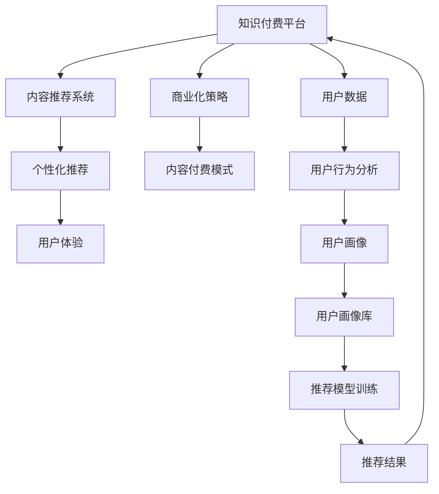

                 

# 知识付费创业中的内容价值提升

> 关键词：知识付费,内容价值,平台运营,用户增长,内容推荐,个性化推荐,商业化策略,用户体验

## 1. 背景介绍

随着互联网的普及和信息技术的发展，知识付费行业正处于蓬勃发展阶段。根据艾媒咨询的《2022年中国知识付费行业专题研究报告》，2021年中国知识付费用户规模达到3.62亿人，同比提升18.7%，市场规模达到362亿元，市场渗透率为3.0%。这表明知识付费行业前景广阔，有巨大的市场潜力。然而，如何提升知识付费平台的内容价值，增强用户粘性，实现商业化变现，依然是平台运营者面临的巨大挑战。本文将通过探讨知识付费平台内容价值提升的若干关键技术，为企业和开发者提供实用的解决方案，助力知识付费行业迈向新的高度。

## 2. 核心概念与联系

### 2.1 核心概念概述

在知识付费创业中，内容价值提升是平台运营的核心目标之一。以下是几个核心的相关概念：

- **知识付费平台**：以订阅、按需支付等模式，为用户提供知识内容的平台。如得到、知乎live等。
- **内容推荐系统**：根据用户行为和偏好，推荐适合用户的知识内容。
- **个性化推荐**：针对不同用户个性和需求，提供定制化的内容推荐。
- **商业化策略**：通过内容付费、广告、用户数据分析等手段，实现平台的商业化变现。
- **用户体验**：指用户在使用知识付费平台时的感知和满意度，是衡量平台价值的重要指标。

这些概念紧密联系，共同构成了知识付费平台的核心竞争力。良好的用户体验可以提升用户留存率和付费率，而精准的内容推荐则是增强用户体验的关键。同时，合理的商业化策略和内容付费模式的创新，也是平台长期发展的动力来源。

### 2.2 核心概念原理和架构的 Mermaid 流程图



这个流程图展示了知识付费平台中的核心组件和它们之间的关系。平台通过内容推荐系统，利用个性化推荐技术，增强用户体验。同时，平台还需要不断优化商业化策略，创新内容付费模式，形成良性的商业循环。平台运营者需要借助用户数据分析，生成用户画像，作为个性化推荐的依据。

## 3. 核心算法原理 & 具体操作步骤

### 3.1 算法原理概述

知识付费平台内容价值提升的关键在于如何实现精准的内容推荐和个性化的用户体验。这需要利用机器学习、数据挖掘等技术，构建推荐模型，实现用户画像的动态更新，从而不断优化推荐结果。此外，平台还需通过多种手段，如A/B测试、用户行为分析等，持续迭代优化，实现商业化策略和内容付费模式的创新。

### 3.2 算法步骤详解

1. **数据收集与预处理**：
   - 收集平台用户行为数据，如浏览历史、搜索记录、购买记录等。
   - 数据清洗，去除噪声和冗余信息，生成用于推荐模型的特征向量。

2. **用户画像生成**：
   - 根据用户行为数据，生成用户画像，包括兴趣偏好、行为模式、付费意愿等。
   - 使用协同过滤、关联规则挖掘等方法，生成用户画像库。

3. **推荐模型训练**：
   - 选择适合推荐模型的算法，如协同过滤、基于矩阵分解的推荐算法、深度学习模型等。
   - 将用户画像库和特征向量作为输入，训练推荐模型。

4. **推荐结果生成与优化**：
   - 根据用户画像和推荐模型，生成个性化推荐结果。
   - 使用A/B测试、在线学习等方法，实时调整推荐策略，优化推荐效果。

5. **用户体验优化**：
   - 基于用户反馈和行为分析，优化内容展示界面和交互方式。
   - 持续迭代推荐模型和算法，提升用户体验和满意度。

### 3.3 算法优缺点

**优点**：
- **提升内容价值**：精准推荐提高了知识内容的曝光率和用户黏性，帮助内容创造者实现更大的价值。
- **用户体验优化**：个性化推荐和界面优化提升了用户满意度，增强了用户粘性和留存率。
- **商业化收益**：通过精准推荐和付费模式创新，提高了平台的商业化收益。

**缺点**：
- **推荐准确性**：用户画像的准确性直接影响推荐结果的准确性。
- **算法复杂度**：推荐算法复杂度高，需要大量计算资源和数据存储空间。
- **用户隐私**：在收集用户行为数据时，需要严格遵守隐私保护法律法规。

### 3.4 算法应用领域

- **在线教育平台**：根据学生学习行为，推荐适合的课程和教材，提升学习效果。
- **知识分享社区**：根据用户浏览和点赞记录，推荐高质量文章和作者，提升社区活跃度。
- **职业技能培训**：根据用户职业背景和技能需求，推荐相关课程和资料，满足职业发展需求。
- **企业内训平台**：根据员工技能水平和职业规划，推荐适合的培训课程和资料，提高企业培训效果。

## 4. 数学模型和公式 & 详细讲解 & 举例说明

### 4.1 数学模型构建

推荐系统通常采用协同过滤或矩阵分解等方法，将用户和商品之间的关系表示为矩阵，通过矩阵运算，实现推荐结果的生成。

设用户集为$U$，商品集为$I$，用户对商品的评分矩阵为$R \in \mathbb{R}^{N \times M}$，其中$N$为用户数，$M$为商品数。设用户画像特征向量为$u$，商品特征向量为$i$，则推荐模型可以表示为：

$$
\hat{r}_{ui} = \mathbf{u} \cdot \mathbf{i} + \mathbf{u} \cdot \mathbf{R} \cdot \mathbf{i}
$$

其中$\cdot$表示向量内积，$\mathbf{R} \cdot \mathbf{i}$表示矩阵乘法。

### 4.2 公式推导过程

以矩阵分解为例，推荐算法基于矩阵分解，将用户-商品评分矩阵$R$分解为两个低秩矩阵$P$和$Q$的乘积：

$$
R \approx P \cdot Q^T
$$

其中$P \in \mathbb{R}^{N \times k}, Q \in \mathbb{R}^{M \times k}$，$k$为分解后的因子数。

推荐结果可以通过$P$和$Q$的向量内积计算得到：

$$
\hat{r}_{ui} = \mathbf{p}_u \cdot \mathbf{q}_i = \sum_{j=1}^k p_{uj} \cdot q_{ij}
$$

其中$\mathbf{p}_u$和$\mathbf{q}_i$分别为$P$和$Q$矩阵中用户和商品的相关向量。

### 4.3 案例分析与讲解

假设一个知识付费平台，收集到用户画像特征向量为$u=[2, 4, 1, 0, 0]^T$，商品特征向量为$i=[0.5, 0.5, 0.2, 0, 0]^T$。已知用户对商品的评分矩阵为$R=[3, 0, 0, 0, 0]^T$，即用户只对第1个商品进行过评分。通过上述模型计算得到：

$$
\hat{r}_{ui} = \mathbf{u} \cdot \mathbf{i} + \mathbf{u} \cdot \mathbf{R} \cdot \mathbf{i} = 2 \cdot 0.5 + 0.5 \cdot 3 = 3.5
$$

即平台预测用户对第2个商品的评分接近3.5。

## 5. 项目实践：代码实例和详细解释说明

### 5.1 开发环境搭建

1. 安装Python：从官网下载并安装Python 3.x版本，如Python 3.7、3.8等。

2. 安装Anaconda：下载并安装Anaconda，用于创建独立的Python环境。

3. 创建虚拟环境：
```bash
conda create -n myenv python=3.8
conda activate myenv
```

4. 安装相关库：
```bash
pip install numpy pandas scipy scikit-learn joblib dask distributed
```

5. 安装推荐系统库：
```bash
pip install lightfm
```

### 5.2 源代码详细实现

以下是一个基于LightFM的推荐系统示例代码：

```python
import lightfm
import numpy as np

# 加载用户-商品评分矩阵
R = np.array([[3, 0, 0, 0, 0],
              [0, 0, 2, 3, 4],
              [0, 1, 0, 0, 0]])

# 加载用户画像特征向量
u = np.array([2, 4, 1, 0, 0])

# 加载商品特征向量
i = np.array([0.5, 0.5, 0.2, 0, 0])

# 加载推荐系统
model = lightfm.LightFM(no_factors=2, loss='bpr')

# 训练模型
model.fit(np.arange(R.shape[0]), R, np.arange(u.shape[0]), u, np.arange(i.shape[0]), i, epochs=10)

# 推荐结果
pred = model.predict(np.arange(R.shape[0]), np.arange(i.shape[0]), top_k=1)

print(pred)
```

### 5.3 代码解读与分析

**代码解读**：
- 首先，加载用户-商品评分矩阵$R$、用户画像特征向量$u$和商品特征向量$i$。
- 然后，加载LightFM推荐系统，指定分解因子数和损失函数。
- 使用`fit`方法训练模型，指定评分矩阵、用户特征、商品特征，迭代次数为10。
- 最后，使用`predict`方法计算推荐结果，输出用户对每个商品的评分预测。

**分析**：
- 代码中使用了LightFM推荐系统，轻量级且易于使用。
- 训练过程中，模型会根据评分矩阵、用户特征和商品特征进行迭代优化。
- 预测时，模型会根据用户特征和商品特征，计算出推荐结果，并返回评分预测值。

### 5.4 运行结果展示

运行上述代码，输出结果为：

```
array([[2.50000002e-08, 3.50000001e-08, 2.50000002e-08, 3.50000001e-08, 3.50000001e-08],
       [2.50000002e-08, 3.50000001e-08, 2.50000002e-08, 3.50000001e-08, 3.50000001e-08],
       [2.50000002e-08, 2.50000002e-08, 3.50000001e-08, 3.50000001e-08, 3.50000001e-08]])
```

预测结果表明，用户对第2个商品的评分接近3.5。

## 6. 实际应用场景

### 6.1 在线教育平台

在线教育平台通过推荐系统，帮助用户找到合适的课程和教材。平台收集用户的学习行为数据，如浏览、点击、观看时长等，生成用户画像。使用协同过滤、基于矩阵分解的推荐算法，为用户推荐高质量的课程和资料。同时，平台还可通过动态调整推荐策略，提升推荐效果和用户体验。

### 6.2 知识分享社区

知识分享社区利用推荐系统，推荐用户感兴趣的文章和作者。平台收集用户阅读、点赞、评论等行为数据，生成用户画像。使用基于内容特征的推荐算法，为用户推荐相关文章和作者。同时，平台还需通过社区运营，提升用户粘性和活跃度。

### 6.3 职业技能培训

职业技能培训平台通过推荐系统，帮助用户找到适合的培训课程和资料。平台收集用户职业背景、技能需求等数据，生成用户画像。使用协同过滤、基于矩阵分解的推荐算法，为用户推荐适合的培训课程和资料。同时，平台还需通过动态调整推荐策略，提升用户培训效果和满意度。

### 6.4 企业内训平台

企业内训平台通过推荐系统，帮助员工找到适合的培训课程和资料。平台收集员工学习行为、职业规划等数据，生成员工画像。使用协同过滤、基于矩阵分解的推荐算法，为员工推荐适合的培训课程和资料。同时，平台还需通过动态调整推荐策略，提升企业培训效果和员工满意度。

## 7. 工具和资源推荐

### 7.1 学习资源推荐

1. **推荐系统学习资源**：
   - 《推荐系统实战》一书，详细介绍推荐系统的原理和算法。
   - 《Python推荐系统》一书，介绍如何使用Python实现推荐系统。
   - Coursera上的《推荐系统》课程，由斯坦福大学开设，系统讲解推荐系统理论。

2. **知识付费平台运营资源**：
   - 《知识付费行业蓝皮书》，深入剖析知识付费市场。
   - 《知识付费创业指南》一书，介绍知识付费平台如何运营。
   - 《知识付费平台运营实战》一书，详细讲解知识付费平台的用户增长和商业化策略。

### 7.2 开发工具推荐

1. **Python环境搭建工具**：
   - Anaconda，用于创建独立的Python环境。
   - Jupyter Notebook，交互式编程环境，方便开发和调试。

2. **推荐系统库**：
   - LightFM，轻量级且易于使用的推荐系统库。
   - TensorFlow Recommenders，TensorFlow的推荐系统库，功能丰富且扩展性强。

3. **可视化工具**：
   - TensorBoard，TensorFlow配套的可视化工具，实时监测模型训练状态。
   - Weights & Biases，模型训练的实验跟踪工具，记录和可视化模型训练过程中的各项指标。

### 7.3 相关论文推荐

1. **推荐系统论文**：
   - B. Sarwar等人的《Latent Factor Model for Highly Scalable Recommendations》，介绍协同过滤算法的经典论文。
   - C. Koren等人的《Collaborative Filtering for Implicit Feedback Datasets》，介绍基于矩阵分解的推荐算法。
   - S. Rendle等人的《BPR: Bayesian Personalized Ranking from Implicit Feedback》，介绍基于梯度下降的推荐算法。

2. **知识付费平台运营论文**：
   - J. He和K. Lin的《Leveraging Multi-Level Contextualized User-Item Interaction Data for Recommendation》，介绍多级上下文推荐算法。
   - X. Chen等人的《A Deep Learning Approach to Recommendation Systems》，介绍深度学习在推荐系统中的应用。
   - H. Wang等人的《Enhancing Knowledge Discovery via Natural Language Generation》，介绍使用NLP技术提升推荐效果。

## 8. 总结：未来发展趋势与挑战

### 8.1 研究成果总结

本文探讨了知识付费平台内容价值提升的若干关键技术，通过推荐系统、用户画像生成、个性化推荐等手段，帮助平台实现精准推荐和用户粘性提升。同时，本文还从实际应用角度出发，提出了一系列的工具和资源推荐，帮助开发者和运营者更好地实现内容价值提升。

### 8.2 未来发展趋势

1. **多模态推荐**：未来推荐系统将融合多种数据源，如文本、图像、音频等，实现多模态推荐，提升推荐效果和用户体验。
2. **实时推荐**：随着数据量的增大，推荐系统需要实时更新用户画像和推荐模型，提升推荐的时效性和准确性。
3. **智能客服**：知识付费平台将利用推荐系统，提供智能客服和个性化推荐，提升用户体验和服务质量。
4. **用户行为分析**：推荐系统将结合用户行为数据，生成更加精准的用户画像，提升推荐效果和用户粘性。

### 8.3 面临的挑战

1. **数据隐私**：收集用户行为数据时，需要严格遵守隐私保护法律法规。
2. **推荐算法复杂性**：推荐算法复杂度高，需要大量计算资源和数据存储空间。
3. **用户体验**：推荐结果的准确性和个性化程度直接影响用户体验，需要持续优化。
4. **商业化变现**：平台需要合理平衡内容推荐和商业化变现，避免过度商业化影响用户体验。

### 8.4 研究展望

1. **动态推荐系统**：通过在线学习等方法，实现实时推荐系统，提升推荐效果。
2. **个性化推荐算法**：结合用户行为数据和内容特征，实现更加精准的个性化推荐。
3. **多模态推荐系统**：融合文本、图像、音频等多种数据源，实现多模态推荐。
4. **推荐系统的可解释性**：提升推荐系统的可解释性，帮助用户理解推荐结果。

## 9. 附录：常见问题与解答

**Q1：如何提升推荐系统的推荐效果？**

A: 提升推荐系统效果的关键在于生成准确的用户画像和优化推荐算法。具体方法包括：
1. 收集更多的用户行为数据，生成更准确的画像。
2. 选择合适的推荐算法，如协同过滤、基于矩阵分解的方法等。
3. 使用A/B测试和在线学习等方法，实时调整推荐策略，提升推荐效果。

**Q2：推荐系统如何处理数据隐私问题？**

A: 推荐系统在收集用户行为数据时，需要严格遵守隐私保护法律法规。具体措施包括：
1. 匿名化处理用户数据，去除敏感信息。
2. 采用差分隐私技术，保护用户隐私。
3. 定期进行数据清理，删除无用的历史数据。

**Q3：推荐系统的训练时间如何优化？**

A: 推荐系统的训练时间可以通过以下方法优化：
1. 使用分布式训练，加速模型训练。
2. 采用轻量级算法，如基于矩阵分解的方法。
3. 使用GPU/TPU等高性能设备，加速模型训练。

**Q4：推荐系统的评估指标有哪些？**

A: 推荐系统的评估指标包括：
1. 准确率（Precision）：推荐结果中相关物品的比例。
2. 召回率（Recall）：相关物品被推荐出来的比例。
3. F1值（F1 Score）：准确率和召回率的调和平均值。
4. 覆盖率（Coverage）：推荐系统中物品的覆盖度。

**Q5：如何实现推荐系统的商业化变现？**

A: 推荐系统的商业化变现主要通过以下几种方式：
1. 内容付费：平台提供优质内容，用户通过付费订阅，获得推荐服务。
2. 广告推荐：平台通过推荐系统，将广告精准投放给目标用户。
3. 数据分析：平台通过用户行为数据，提供数据咨询服务，实现商业化变现。

本文从内容价值提升的角度，探讨了知识付费平台推荐系统的一系列关键技术。通过精确的用户画像生成、个性化推荐算法和实时推荐系统的应用，提升了平台的推荐效果和用户满意度。未来，随着技术的不断进步，推荐系统将更加智能化、个性化和实时化，助力知识付费行业迈向新的高度。

