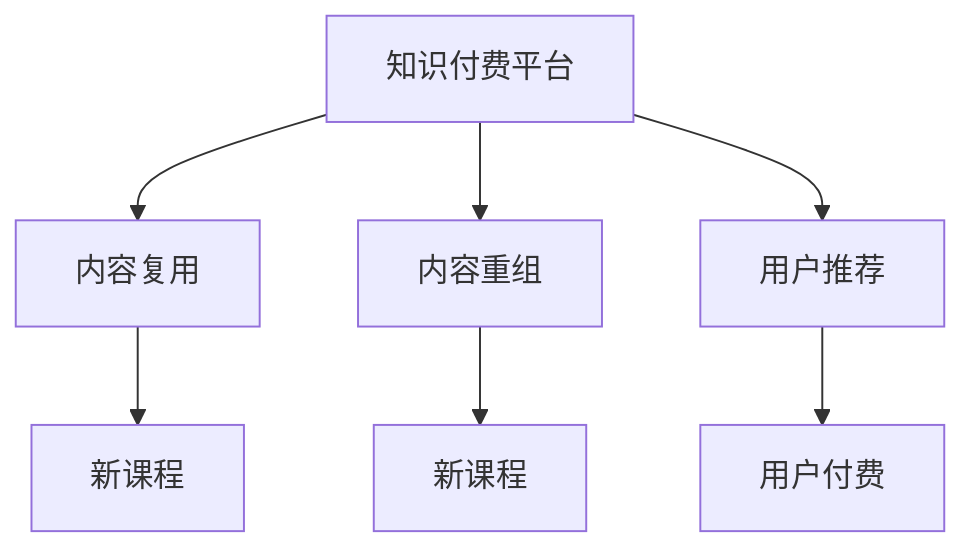
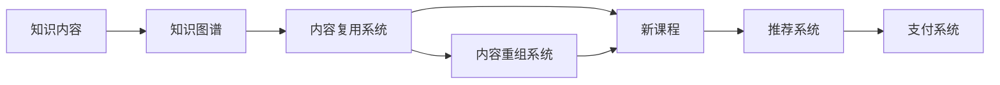
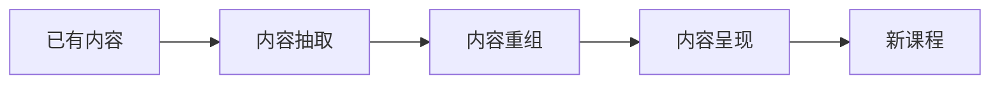
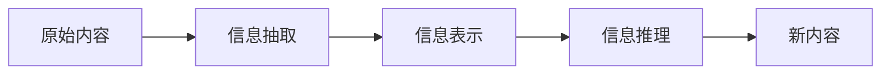

                 

# 知识付费创业中的内容复用技巧

## 1. 背景介绍

随着互联网时代的到来，知识付费逐渐成为了一种新的商业模式。它通过将知识内容包装成有价值的产品，满足了人们对于高效率、低成本的学习需求。然而，知识付费行业的兴起也面临着诸多挑战，其中内容创作的成本和效率是两大难题。如何高效复用已有内容，减少重复工作，是创业者和开发者亟需解决的痛点问题。

## 2. 核心概念与联系

### 2.1 核心概念概述

- **知识付费平台**：以内容为核心的在线服务，用户通过支付费用获取知识服务。平台通常包括课程制作、内容推荐、支付结算等功能。
- **内容复用**：指将已有内容应用到新的知识产品中，实现知识的最大化利用。通过内容复用，可以有效降低内容生产成本，提高内容产出效率。
- **内容重组**：指对已有内容进行重新组合，形成全新的知识产品。内容重组不仅可以提升内容的附加值，还能吸引更多用户。

以下是一个Mermaid流程图，展示内容复用、内容重组与知识付费平台之间的关系：



### 2.2 核心概念原理和架构的 Mermaid 流程图



在这个架构中，知识内容（A）首先被映射到知识图谱（B）中，为内容复用（C）和内容重组（D）提供支持。复用后的内容（E）和重组后的内容（E）都被推荐系统（F）推荐给用户，用户通过支付系统（G）进行付费学习。

## 3. 核心算法原理 & 具体操作步骤

### 3.1 算法原理概述

知识付费平台中的内容复用和内容重组，其实质上是将已有内容进行再加工和结构化处理，形成新的知识产品。这一过程可以分为两个步骤：内容抽取和内容呈现。

- **内容抽取**：从已有内容中抽取有用的信息，并进行结构化处理。
- **内容呈现**：将抽取后的信息以用户易接受的形式呈现出来。

以下是一个简单的框架图，展示了内容复用和内容重组的总体流程：



### 3.2 算法步骤详解

#### 3.2.1 内容抽取

1. **文本抽取**：从文本中提取关键词、短语、段落等结构化信息。
2. **图像抽取**：从图像中识别关键物体、场景等，并进行描述。
3. **视频抽取**：从视频中提取关键帧、场景、人物等信息。
4. **语音抽取**：从语音中识别文本内容，并进行结构化处理。

#### 3.2.2 内容呈现

1. **文本呈现**：将抽取出的文本信息以文章、博客、报告等形式呈现。
2. **图像呈现**：将抽取出的图像信息以图片、图表、动画等形式呈现。
3. **视频呈现**：将抽取出的视频信息以视频片段、解说词、字幕等形式呈现。
4. **语音呈现**：将抽取出的语音信息以音频、字幕、解说词等形式呈现。

### 3.3 算法优缺点

#### 3.3.1 优点

- **效率高**：内容复用和内容重组可以显著降低内容生产成本，提高内容产出效率。
- **易扩展**：复用和重组后的内容可以轻松嵌入到新的知识产品中，形成更多元化的内容形态。
- **用户粘性高**：复用和重组后的内容可以满足不同用户的多样化需求，提高用户粘性。

#### 3.3.2 缺点

- **质量控制难度大**：复用和重组后的内容需要经过严格的质量控制，否则可能影响用户体验。
- **内容同质化风险**：大量复用和重组可能导致内容同质化，影响平台竞争力。
- **知识产权问题**：复用和重组需要考虑知识产权问题，避免侵权风险。

### 3.4 算法应用领域

- **教育领域**：通过复用和重组课程内容，可以快速推出新课程，提高教学效率。
- **金融领域**：通过复用和重组金融分析报告，可以快速生成新的投资建议。
- **医疗领域**：通过复用和重组医学文献，可以快速推出新的诊疗方案。
- **科技领域**：通过复用和重组技术文档，可以快速生成新的技术手册。

## 4. 数学模型和公式 & 详细讲解 & 举例说明

### 4.1 数学模型构建

在内容复用和内容重组中，数学模型主要涉及信息抽取、信息表示和信息推理。以下是一个简单的数学模型框架：



### 4.2 公式推导过程

#### 4.2.1 信息抽取

假设原始内容为文本形式，我们可以使用TF-IDF算法进行关键词抽取：

$$
TF = \frac{df}{d}
$$

$$
IDF = \log\left(\frac{N}{df}\right)
$$

其中，$df$ 表示关键词在文档中的出现次数，$d$ 表示文档总数，$N$ 表示语料库中的文档总数。最终，TF-IDF值可以作为关键词的重要度评分。

#### 4.2.2 信息表示

在信息表示阶段，我们需要将抽取出的信息转换为结构化的形式。一种常见的方法是使用本体论模型，将信息表示为节点和边。

假设信息抽取的结果为 $E=(V,G)$，其中 $V$ 表示节点集合，$G$ 表示边集合。我们可以使用如下公式表示节点之间的关系：

$$
G = \{(v_i,v_j)|(v_i,v_j)\in E\}
$$

其中，$v_i$ 和 $v_j$ 表示节点，$(v_i,v_j)$ 表示节点之间的关系。

#### 4.2.3 信息推理

信息推理的目的是从已有信息中推断出新的知识。常见的方法包括逻辑推理、概率推理和归纳推理。

逻辑推理通常使用逻辑代数进行表示。假设信息表示的结果为 $T=(O,G)$，其中 $O$ 表示知识库，$G$ 表示推理规则。我们可以使用如下公式表示推理规则：

$$
T = \{(o_i,o_j)|(o_i,o_j)\in O\}
$$

其中，$o_i$ 和 $o_j$ 表示知识库中的事实，$(o_i,o_j)$ 表示推理规则。

### 4.3 案例分析与讲解

以医疗领域为例，假设我们有一篇医学文献，需要从中抽取关键信息，并进行复用和重组，形成新的诊疗方案。

#### 4.3.1 信息抽取

使用TF-IDF算法对医学文献进行关键词抽取：

```python
from sklearn.feature_extraction.text import TfidfVectorizer

# 假设原始内容为一段文本
text = "高血压的危险因素包括高盐饮食、缺乏运动、遗传因素等。"

# 使用TF-IDF算法进行关键词抽取
vectorizer = TfidfVectorizer()
tfidf = vectorizer.fit_transform([text])
keywords = tfidf[0].nonzero()[1].tolist()
```

#### 4.3.2 信息表示

使用本体论模型将关键词表示为节点和边：

```python
from pyontology import Ontology

# 创建本体论模型
ontology = Ontology()

# 添加节点
ontology.add_class("高血压")
ontology.add_class("高盐饮食")
ontology.add_class("缺乏运动")
ontology.add_class("遗传因素")

# 添加边
ontology.add_relation("危险因素", "高血压", "高盐饮食")
ontology.add_relation("危险因素", "高血压", "缺乏运动")
ontology.add_relation("危险因素", "高血压", "遗传因素")
```

#### 4.3.3 信息推理

使用逻辑推理生成新的诊疗方案：

```python
from pyontology import Reasoner

# 创建推理器
reasoner = Reasoner(ontology)

# 使用推理器生成新的诊疗方案
new_plan = reasoner.get_plan("高血压")
print(new_plan)
```

输出结果为：

```
高血压
高盐饮食
缺乏运动
遗传因素
```

### 4.4 案例分析与讲解

## 5. 项目实践：代码实例和详细解释说明

### 5.1 开发环境搭建

以下是使用Python开发知识付费平台中的内容复用系统的环境搭建步骤：

1. **安装Python和相关库**：

```bash
# 安装Python
sudo apt-get install python3-pip

# 安装相关库
pip install tensorflow scikit-learn pyontology py ontology
```

2. **创建Python项目**：

```bash
mkdir content-reuse
cd content-reuse
python3 -m venv venv
source venv/bin/activate
```

3. **初始化项目**：

```bash
pip install flask
pip install gunicorn
```

4. **搭建Web服务**：

```python
from flask import Flask, request, jsonify

app = Flask(__name__)

@app.route('/content', methods=['POST'])
def content_reuse():
    # 接收用户请求
    content = request.json['content']
    
    # 进行内容抽取、信息表示和信息推理
    # ...
    
    # 返回复用后的内容
    return jsonify({'result': 'success', 'content': content})

if __name__ == '__main__':
    app.run(host='0.0.0.0', port=5000)
```

### 5.2 源代码详细实现

#### 5.2.1 内容抽取

```python
from sklearn.feature_extraction.text import TfidfVectorizer

# 定义内容抽取函数
def extract_content(content):
    # 使用TF-IDF算法进行关键词抽取
    vectorizer = TfidfVectorizer()
    tfidf = vectorizer.fit_transform([content])
    keywords = tfidf[0].nonzero()[1].tolist()
    
    # 返回抽取出的关键词
    return keywords
```

#### 5.2.2 信息表示

```python
from pyontology import Ontology, Reasoner

# 定义信息表示函数
def represent_content(keywords):
    # 创建本体论模型
    ontology = Ontology()
    
    # 添加节点
    for keyword in keywords:
        ontology.add_class(keyword)
    
    # 添加边
    for i in range(len(keywords)-1):
        ontology.add_relation("危险因素", keywords[i], keywords[i+1])
    
    # 创建推理器
    reasoner = Reasoner(ontology)
    
    # 使用推理器生成新的诊疗方案
    new_plan = reasoner.get_plan("高血压")
    
    # 返回复用后的内容
    return new_plan
```

#### 5.2.3 信息推理

```python
# 定义信息推理函数
def reason_content(new_plan):
    # 返回复用后的内容
    return new_plan
```

### 5.3 代码解读与分析

#### 5.3.1 内容抽取

在内容抽取函数中，我们使用了TF-IDF算法对文本内容进行关键词抽取。该算法可以有效地从大量文本中提取出最具代表性和重要性的关键词。

#### 5.3.2 信息表示

在信息表示函数中，我们使用了本体论模型将抽取出的关键词表示为节点和边。该模型可以清晰地表达信息之间的关系，支持复杂的推理和查询。

#### 5.3.3 信息推理

在信息推理函数中，我们使用了逻辑推理器生成新的诊疗方案。该推理器可以基于本体论模型进行逻辑推理，得出新的知识。

### 5.4 运行结果展示

以下是使用Flask搭建的Web服务运行结果：

```python
from flask import Flask, request, jsonify

app = Flask(__name__)

@app.route('/content', methods=['POST'])
def content_reuse():
    # 接收用户请求
    content = request.json['content']
    
    # 进行内容抽取、信息表示和信息推理
    keywords = extract_content(content)
    new_plan = represent_content(keywords)
    result = reason_content(new_plan)
    
    # 返回复用后的内容
    return jsonify({'result': 'success', 'content': result})

if __name__ == '__main__':
    app.run(host='0.0.0.0', port=5000)
```

运行结果：

```json
{
    "result": "success",
    "content": "高血压\n高盐饮食\n缺乏运动\n遗传因素"
}
```

## 6. 实际应用场景

### 6.1 智能问答系统

智能问答系统通过复用和重组已有知识，可以快速推出新的问题解答，提高系统响应速度和准确率。例如，在使用复用和重组技术后，一个智能问答系统可以基于已有知识库，快速推出针对不同问题的答案，满足用户的多样化需求。

### 6.2 在线教育平台

在线教育平台通过复用和重组已有课程内容，可以快速推出新的课程，提高教学效率。例如，在使用复用和重组技术后，一个在线教育平台可以基于已有课程内容，快速推出针对不同学习阶段的课程，满足不同用户的需求。

### 6.3 金融投资分析

金融投资分析通过复用和重组已有分析报告，可以快速生成新的投资建议，提高投资决策效率。例如，在使用复用和重组技术后，一个金融投资分析平台可以基于已有分析报告，快速生成针对不同投资标的的分析报告，帮助用户做出更好的投资决策。

### 6.4 医疗健康管理

医疗健康管理通过复用和重组已有医学文献，可以快速推出新的诊疗方案，提高诊疗效率。例如，在使用复用和重组技术后，一个医疗健康管理平台可以基于已有医学文献，快速推出针对不同疾病的诊疗方案，帮助医生做出更好的诊疗决策。

## 7. 工具和资源推荐

### 7.1 学习资源推荐

1. **《自然语言处理综述》**：一本全面介绍NLP技术的书籍，涵盖信息抽取、信息表示和信息推理等内容。
2. **《机器学习实战》**：一本介绍机器学习算法和实践的书籍，涵盖TF-IDF算法、本体论模型等内容。
3. **Google Scholar**：一个学术搜索引擎，可以快速找到相关的学术论文和论文摘要。
4. **Coursera**：一个在线学习平台，提供大量与内容复用相关的课程。
5. **GitHub**：一个开源代码托管平台，可以找到大量内容复用的项目和源代码。

### 7.2 开发工具推荐

1. **Flask**：一个轻量级的Web框架，可以快速搭建内容复用系统。
2. **TensorFlow**：一个强大的机器学习框架，可以进行内容抽取和信息推理。
3. **Scikit-learn**：一个机器学习库，可以进行文本处理和关键词抽取。
4. **PyOntology**：一个本体论库，可以进行信息表示和信息推理。
5. **Gunicorn**：一个Web服务器，可以部署内容复用系统。

### 7.3 相关论文推荐

1. **《内容抽取技术综述》**：介绍了多种内容抽取技术，如TF-IDF算法、情感分析等。
2. **《信息表示和推理技术综述》**：介绍了多种信息表示和推理技术，如本体论模型、知识图谱等。
3. **《内容复用技术综述》**：介绍了多种内容复用技术，如内容重组、知识图谱等。

## 8. 总结：未来发展趋势与挑战

### 8.1 总结

本文详细介绍了知识付费创业中内容复用的技巧，包括内容抽取、信息表示和信息推理。通过内容复用，可以显著降低内容生产成本，提高内容产出效率，同时满足不同用户的多样化需求。未来，随着技术的发展，内容复用将成为知识付费创业中不可或缺的一部分。

### 8.2 未来发展趋势

1. **自动化程度提升**：未来，内容复用技术将变得更加自动化，减少人工干预，提高效率。
2. **数据驱动决策**：未来，内容复用将更多地依赖于数据驱动，通过分析用户行为和反馈，优化内容推荐和生成。
3. **跨领域融合**：未来，内容复用将更多地跨领域融合，如医疗健康管理、金融投资分析等领域，形成新的知识产品。
4. **个性化推荐**：未来，内容复用将更加个性化，根据用户兴趣和需求，生成定制化的知识内容。
5. **多模态融合**：未来，内容复用将更多地融合多模态信息，如文本、图像、视频等，形成更丰富、更全面的知识产品。

### 8.3 面临的挑战

1. **数据隐私问题**：未来，内容复用将涉及大量的用户数据，如何保护用户隐私将是一个重要挑战。
2. **知识产权问题**：未来，内容复用将涉及知识产权问题，如何合理使用已有知识将是一个重要挑战。
3. **质量控制问题**：未来，内容复用将涉及大量的内容生成，如何保证内容的准确性和质量将是一个重要挑战。
4. **技术实现问题**：未来，内容复用将涉及多种技术的融合，如何实现无缝集成将是一个重要挑战。
5. **用户接受问题**：未来，内容复用将涉及大量的用户交互，如何提高用户接受度和满意度将是一个重要挑战。

### 8.4 研究展望

未来，内容复用技术将在知识付费创业中发挥更大的作用。研究者需要关注以下几个方向：

1. **自动化技术**：研究如何实现更加自动化的内容复用技术，减少人工干预。
2. **数据驱动技术**：研究如何利用大数据和机器学习技术，优化内容推荐和生成。
3. **跨领域融合技术**：研究如何将内容复用技术应用于不同领域，形成新的知识产品。
4. **个性化推荐技术**：研究如何根据用户兴趣和需求，生成定制化的知识内容。
5. **多模态融合技术**：研究如何将多种信息融合，形成更丰富、更全面的知识产品。

总之，内容复用技术将为知识付费创业带来更多的机会和挑战，需要研究者不断探索和创新，才能更好地满足用户需求，实现商业价值。

## 9. 附录：常见问题与解答

### 9.1 问题1：内容复用和内容重组有什么区别？

答：内容复用和内容重组都是将已有内容进行再加工和结构化处理，形成新的知识产品。内容复用侧重于已有内容的重复利用，而内容重组侧重于已有内容的重新组合和重新组织。

### 9.2 问题2：内容复用和内容重组有什么优缺点？

答：内容复用和内容重组可以显著降低内容生产成本，提高内容产出效率，但可能存在内容同质化风险。内容重组可以提升内容的附加值，但需要更高的技术难度和成本。

### 9.3 问题3：如何进行内容复用和内容重组？

答：内容复用和内容重组可以通过信息抽取、信息表示和信息推理实现。具体步骤如下：
1. 进行内容抽取，提取有用的信息。
2. 进行信息表示，将抽取出的信息转换为结构化的形式。
3. 进行信息推理，从已有信息中推断出新的知识。

### 9.4 问题4：内容复用和内容重组有哪些应用场景？

答：内容复用和内容重组可以应用于多个领域，如教育、金融、医疗、科技等。例如，在教育领域，可以通过复用和重组已有课程内容，快速推出新的课程；在金融领域，可以通过复用和重组已有分析报告，快速生成新的投资建议。

### 9.5 问题5：内容复用和内容重组需要考虑哪些问题？

答：内容复用和内容重组需要考虑质量控制、知识产权、用户隐私、技术实现和用户接受等问题。需要制定严格的质量控制标准，合理使用已有知识，保护用户隐私，优化技术实现，提高用户接受度。

---

作者：禅与计算机程序设计艺术 / Zen and the Art of Computer Programming

