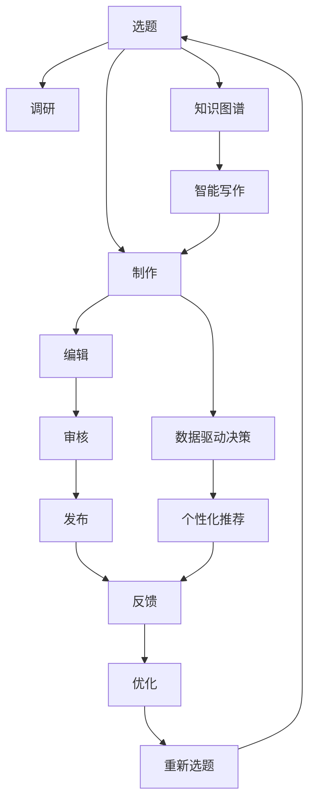

                 

# 知识付费创业中的内容生产效率提升

> 关键词：知识付费、内容生产、效率提升、人工智能、自动化工具

## 1. 背景介绍

随着互联网和移动互联网的普及，知识付费成为越来越多用户获取高质量内容的新方式。无论是学习新技能、拓展视野，还是解决实际问题，知识付费产品都能提供系统化、高质量的内容。而随着市场竞争的加剧，知识付费创业公司必须提升内容生产的效率，才能快速响应市场变化，持续输出优质内容，吸引并留住用户。

### 1.1 知识付费市场现状

当前知识付费市场呈现多样化和快速增长的趋势。根据艾媒咨询的数据，2020年中国知识付费用户规模已达2.56亿，市场规模达到206.8亿元，年复合增长率超过30%。用户对知识付费产品的需求从“碎片化学习”向“系统化教育”转变，对内容的深度、广度、持续性要求日益提高。

**核心需求：**
- **深度内容**：用户希望获得深入系统化的知识，而不仅仅是“标题党”文章。
- **高质量保障**：用户对内容质量和制作水准有高标准，要求知识付费平台能提供稳定、高质量的产出。
- **个性化推荐**：根据用户学习兴趣和历史行为，推荐个性化的课程和内容，提高学习效率。
- **快速更新**：市场变化快，知识付费公司需要快速迭代内容，维持行业领先地位。

### 1.2 内容生产挑战

尽管知识付费市场充满机遇，但内容生产仍面临诸多挑战：

- **人力成本高**：高质量内容的制作需要大量作者、编辑、审核人员，成本较高。
- **生产周期长**：内容从选题、调研、制作到上线，周期往往超过一个月。
- **个性化不足**：内容高度同质化，难以满足不同用户个性化需求。
- **数据驱动的决策**：缺乏有效的数据反馈机制，难以快速调整内容策略。

## 2. 核心概念与联系

### 2.1 核心概念概述

为更好地理解知识付费中内容生产效率提升的方法，本节将介绍几个关键概念：

- **内容生产（Content Production）**：从选题、调研、制作到编辑、审核、发布的全过程。
- **自动化工具（Automation Tools）**：通过人工智能和自动化技术，辅助内容生产各个环节的智能决策，提升生产效率。
- **数据驱动决策（Data-Driven Decision Making）**：基于用户行为数据和内容反馈，优化内容策略，提高内容质量和用户满意度。
- **知识图谱（Knowledge Graph）**：通过图形结构表示知识元素之间的关系，辅助内容选题和推荐。
- **智能写作（AI Writing）**：利用人工智能生成文本，降低人工写作的负担，提高内容生产效率。
- **持续学习（Continuous Learning）**：使内容生产过程不断适应新知识和新趋势，保持内容的时效性和相关性。

这些概念之间通过以下Mermaid流程图展示其联系：



该流程图展示的内容生产过程由选题、调研、制作、编辑、审核、发布组成，并通过知识图谱、智能写作、数据驱动决策等技术辅助，不断优化选题和内容制作流程，实现生产效率提升。

## 3. 核心算法原理 & 具体操作步骤

### 3.1 算法原理概述

知识付费中的内容生产效率提升，涉及算法优化、自动化工具集成和数据驱动决策等多个方面。其核心思想是通过人工智能技术，对内容生产各环节进行智能化优化，同时借助数据驱动的决策机制，不断调整内容策略，以满足用户需求。

### 3.2 算法步骤详解

1. **选题优化**
    - **用户兴趣分析**：通过用户行为数据和反馈，分析用户兴趣变化，辅助选题。
    - **趋势预测**：基于大数据分析和机器学习，预测行业发展趋势，指导选题方向。
    - **选题库管理**：建立选题库，存储潜在话题和相关资源，为选题提供参考。

2. **内容制作自动化**
    - **数据收集**：利用爬虫和API，自动化收集相关领域的文本、图片、视频等数据。
    - **内容生成**：使用自然语言处理(NLP)技术，生成文本、摘要、目录等辅助内容。
    - **视觉制作**：利用图像处理技术，自动制作视频、图表等视觉内容。
    - **多模态融合**：整合文字、图片、视频等多种媒体形式，提升内容表现力。

3. **编辑审核智能化**
    - **智能校对**：使用语言模型和语法检查工具，自动校对文本错误和语病。
    - **情感分析**：通过情感分析技术，评估文本情感色彩，指导内容调整。
    - **主题匹配**：使用主题模型，匹配内容与目标读者，优化主题聚焦。
    - **版权审核**：自动审核内容中使用的图片、音乐、视频等是否存在版权问题。

4. **发布反馈循环**
    - **用户反馈收集**：建立用户反馈渠道，实时收集用户对内容的评价和建议。
    - **数据分析**：利用大数据分析工具，分析用户反馈和行为数据，发现问题点。
    - **内容优化**：根据分析结果，调整内容策略，进行局部优化或重新制作。
    - **持续发布**：建立持续发布机制，保持内容更新频率和质量。

### 3.3 算法优缺点

**优点：**
- **效率提升**：通过自动化工具和智能化决策，大幅提升内容生产速度。
- **成本降低**：减少人力成本，降低制作周期，提高资源利用率。
- **质量保障**：利用智能校对和情感分析，提升内容质量和可读性。
- **用户满意度提高**：根据用户反馈和数据分析，个性化推荐，满足用户需求。

**缺点：**
- **技术门槛高**：需要具备AI和自动化技术，技术实现难度较大。
- **初期投入大**：需要购置和集成各类工具和系统，初期成本较高。
- **数据隐私问题**：处理大量用户数据，需严格保护用户隐私和数据安全。
- **内容质量受限**：自动化工具可能无法完全替代人工，部分内容质量仍需人工把关。

### 3.4 算法应用领域

基于以上算法原理和操作步骤，知识付费内容生产效率提升方法在多个领域都有广泛应用，包括：

- **在线教育平台**：如Coursera、Udemy等，通过内容制作自动化和智能编辑审核，提升课程制作效率和质量。
- **在线咨询平台**：如知乎、得到等，利用数据驱动决策和个性化推荐，提高文章质量和用户粘性。
- **新闻媒体平台**：如人民日报、新华社等，通过自动内容生成和智能选题，提高新闻制作效率和时效性。
- **文化娱乐平台**：如哔哩哔哩、网易云音乐等，利用自动化工具和智能推荐，丰富内容形式和用户体验。
- **企业内部培训**：通过知识图谱和内容生成技术，帮助企业快速构建内部培训课程，提升员工学习效率。

## 4. 数学模型和公式 & 详细讲解 & 举例说明

### 4.1 数学模型构建

在知识付费内容生产效率提升中，主要涉及以下几个数学模型：

1. **选题优化模型**：
   $$
   \max_{x} \log P(x) + \lambda R(x)
   $$
   其中 $P(x)$ 为选题概率，$R(x)$ 为相关性评分函数，$\lambda$ 为正则化系数。

2. **内容生成模型**：
   $$
   p(x|y) = \mathcal{N}(x; \mu(y), \Sigma(y))
   $$
   其中 $x$ 为内容向量，$y$ 为主题标签，$\mu(y)$ 和 $\Sigma(y)$ 分别为内容的均值向量和协方差矩阵。

3. **编辑审核模型**：
   $$
   \min_{y} L(y, y^*) = \frac{1}{2} \|y-y^*\|^2 + \lambda \|y\|_1
   $$
   其中 $L(y, y^*)$ 为损失函数，$y^*$ 为标准编辑结果，$\|y\|_1$ 为稀疏度惩罚项。

4. **用户反馈模型**：
   $$
   \min_{\theta} \sum_{i=1}^N (y_i - f_{\theta}(x_i))^2
   $$
   其中 $y_i$ 为真实反馈，$f_{\theta}(x_i)$ 为预测反馈，$\theta$ 为模型参数。

### 4.2 公式推导过程

以内容生成模型为例，基于深度生成模型（如GPT-3）进行推导：

1. **生成模型框架**：
   $$
   p(x|y) = \prod_{i=1}^T p(x_i|x_{i-1})
   $$

2. **条件概率公式**：
   $$
   p(x_i|x_{i-1}) = \mathcal{N}(x_i; \mu(y), \Sigma(y))
   $$

3. **似然函数**：
   $$
   \mathcal{L} = -\sum_{i=1}^T \log p(x_i|x_{i-1})
   $$

4. **参数学习**：
   通过优化损失函数 $L(\theta) = -\mathcal{L}$，利用梯度下降等方法，训练生成模型参数 $\theta$。

### 4.3 案例分析与讲解

以知乎自动生成问题的过程为例：

1. **用户行为分析**：通过分析用户浏览、搜索、点赞、评论等行为，生成用户兴趣标签。
2. **标签聚类**：利用K-means等聚类算法，将标签分组。
3. **选题生成**：基于兴趣标签和聚类结果，使用语言模型生成潜在问题。
4. **用户反馈优化**：通过A/B测试等方法，收集用户对生成问题的反馈，逐步优化模型。

## 5. 项目实践：代码实例和详细解释说明

### 5.1 开发环境搭建

1. **环境准备**：
   - 安装Python 3.8及以上版本，推荐使用Anaconda创建虚拟环境。
   - 安装Pip依赖库，如TensorFlow、PyTorch、NLTK等。

2. **平台搭建**：
   - 部署AWS、Google Cloud或阿里云等云平台，选择弹性计算资源。
   - 安装相关工具，如Jupyter Notebook、Jenkins等，进行持续集成和自动化测试。

3. **数据准备**：
   - 收集相关领域文本数据，进行清洗和预处理。
   - 将数据分为训练集、验证集和测试集，便于模型训练和评估。

### 5.2 源代码详细实现

以下是一个简单的基于GPT-3的内容生成代码示例：

```python
from transformers import pipeline

# 加载预训练模型
generator = pipeline('text-generation', model='gpt3')

# 生成内容
def generate_content(topic, num_samples=5):
    return generator(topic, num_return_sequences=num_samples)

# 示例
print(generate_content("机器学习入门"))
```

**代码解读与分析**：
- `transformers` 库提供了便捷的接口，可以快速使用预训练模型。
- `pipeline` 函数可以自动加载和运行模型，便于快速实验和调整。
- 生成内容函数 `generate_content` 接受主题和生成样本数量，利用GPT-3生成相关内容。
- 运行示例，生成机器学习入门相关内容。

### 5.3 运行结果展示

运行示例代码，将生成多个与“机器学习入门”相关的内容片段。这些内容可以用于快速生成文章草稿、引导用户问题、推荐学习资源等。

```python
['机器学习是一种人工智能的分支，主要研究如何让计算机从数据中学习和推断...', '机器学习分为监督学习、非监督学习和强化学习...', '机器学习的核心是模型选择和特征工程...', '机器学习的应用广泛，包括自然语言处理、图像识别、语音识别...', '机器学习算法包括线性回归、逻辑回归、决策树、随机森林、支持向量机...']
```

## 6. 实际应用场景

### 6.1 在线教育平台

在线教育平台通过内容生产效率提升，可以提供更多优质课程，满足用户的学习需求。具体应用包括：

- **自动化课程制作**：利用内容生成和智能编辑工具，快速制作课程视频和文字。
- **个性化推荐系统**：根据用户学习行为和反馈，智能推荐课程和资料，提高学习效率。
- **即时互动答疑**：自动生成问答模板，快速回答用户提问，提升互动体验。

### 6.2 在线咨询平台

在线咨询平台通过内容生产优化，可以提供更高效、专业的服务。具体应用包括：

- **文章自动生成**：利用自然语言处理技术，自动生成常见问题和解答，减少人力投入。
- **个性化内容推荐**：根据用户问题，推荐相关文章和资源，满足个性化需求。
- **智能客服机器人**：通过问答模型和自然语言理解技术，实现智能客服，提高响应速度。

### 6.3 新闻媒体平台

新闻媒体平台通过内容生产自动化，可以提升新闻的制作速度和时效性。具体应用包括：

- **自动新闻生成**：利用预训练模型，自动生成新闻标题和内容摘要。
- **实时新闻推送**：基于用户兴趣和行为数据，实时推送新闻，提高用户粘性。
- **智能编辑审核**：使用文本校对和情感分析技术，提升新闻质量。

### 6.4 文化娱乐平台

文化娱乐平台通过内容生产优化，可以丰富用户的多样化体验。具体应用包括：

- **自动内容生成**：利用GPT-3等生成模型，生成文本、视频、图片等多样内容。
- **个性化内容推荐**：根据用户兴趣，推荐相关作品和用户，提升用户体验。
- **智能互动活动**：通过生成互动内容，增强用户参与感和粘性。

## 7. 工具和资源推荐

### 7.1 学习资源推荐

1. **《机器学习实战》**：讲解机器学习的基本概念和算法，适合初学者入门。
2. **Coursera《深度学习》课程**：由斯坦福大学Andrew Ng教授主讲，全面介绍深度学习原理和实践。
3. **《自然语言处理入门》**：讲解NLP基础理论和经典模型，适合进阶学习。
4. **OpenAI GPT-3文档**：详细介绍GPT-3的使用方法和API接口。
5. **NLTK和spaCy文档**：介绍自然语言处理库的使用，适合文本处理和分析。

### 7.2 开发工具推荐

1. **TensorFlow和PyTorch**：深度学习框架，支持复杂的模型构建和训练。
2. **NLTK和spaCy**：自然语言处理库，提供文本预处理和分析工具。
3. **Jupyter Notebook**：交互式开发环境，支持代码实验和协作。
4. **AWS和Google Cloud**：云平台，提供弹性计算资源和存储服务。
5. **Jenkins和GitLab**：持续集成和代码管理工具，支持自动化部署和测试。

### 7.3 相关论文推荐

1. **“Attention Is All You Need”**：提出Transformer模型，开启预训练大模型时代。
2. **“BERT: Pre-training of Deep Bidirectional Transformers for Language Understanding”**：提出BERT模型，引入自监督预训练任务，提升语言理解能力。
3. **“GPT-3: Language Models are Unsupervised Multitask Learners”**：展示GPT-3的零样本学习能力，推动NLP技术进步。
4. **“Parameter-Efficient Transfer Learning for NLP”**：提出适配器(Adapter)等参数高效微调方法，优化内容生成效率。
5. **“AdaLoRA: Adaptive Low-Rank Adaptation for Parameter-Efficient Fine-Tuning”**：提出自适应低秩适应的微调方法，提升模型参数效率。

## 8. 总结：未来发展趋势与挑战

### 8.1 研究成果总结

知识付费创业中，内容生产效率的提升已经取得显著成效。通过算法优化和自动化工具集成，大幅降低了内容生产成本，提升了内容制作速度和质量，满足了用户多样化的需求。

### 8.2 未来发展趋势

未来，知识付费中的内容生产效率提升将呈现以下趋势：

1. **技术迭代加速**：基于深度学习和自然语言处理技术的不断进步，内容生成和编辑审核工具将更加智能和高效。
2. **数据驱动决策**：通过大数据分析和机器学习，优化选题和内容策略，提升用户满意度和留存率。
3. **多模态内容融合**：融合文本、图片、视频等多模态数据，提升内容的丰富性和表现力。
4. **实时动态调整**：通过实时监测和调整内容策略，快速响应市场变化和用户需求。
5. **人机协作优化**：在内容生成和审核过程中，引入人工干预和监督，提高内容质量和可信度。

### 8.3 面临的挑战

尽管内容生产效率提升取得了进步，但仍面临以下挑战：

1. **数据隐私问题**：处理大量用户数据，需严格保护用户隐私和数据安全。
2. **技术实现复杂**：内容生成和编辑审核技术需具备高技术门槛，初期实现难度较大。
3. **内容质量控制**：自动化工具可能无法完全替代人工，需保持人工审核环节。
4. **资源和成本**：构建高效的自动化系统需要大量资源和成本投入。
5. **用户体验平衡**：在提升效率的同时，需保证内容质量和用户体验。

### 8.4 研究展望

未来，需要从以下几个方面进一步提升内容生产效率和质量：

1. **提升技术门槛**：降低技术实现难度，引入开源工具和平台，降低技术门槛。
2. **优化算法模型**：开发高效的内容生成和编辑审核算法，提升模型性能。
3. **加强数据治理**：建立数据隐私保护机制，确保数据安全和合规。
4. **探索新范式**：引入多模态内容生成和智能推荐技术，提升用户体验。
5. **综合评估体系**：建立全面的内容质量评估体系，确保内容高质量、高可信度。

通过综合应对这些挑战，知识付费创业将迎来更多创新和突破，为用户提供更高质量、更高效的内容服务。

