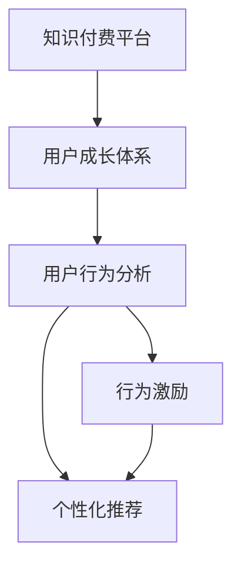

                 

# 知识付费创业中的用户成长体系设计

> 关键词：知识付费,用户成长体系,用户行为分析,行为激励,数据驱动,个性化推荐

## 1. 背景介绍

在知识付费行业蓬勃发展的今天，如何在庞大的用户群体中挖掘潜在价值，构建有效的用户成长体系，成为各大知识付费平台面临的核心问题之一。传统的知识付费模式以内容输出为主，忽略了用户的内在需求和行为习惯。而现代的知识付费平台更注重用户的全生命周期价值，通过精细化的用户管理，提升用户粘性和忠诚度。本文将从用户成长体系设计的角度，探讨如何利用数据驱动，构建一套有效的知识付费用户成长体系，助力平台的可持续发展。

## 2. 核心概念与联系

### 2.1 核心概念概述

为更好地理解知识付费平台的用户成长体系，本节将介绍几个关键概念：

- 知识付费平台(Knowledge Subscription Platform)：以知识生产与消费为核心，提供线上课程、文章、音频、视频等多种内容形式，并通过付费模式实现知识变现的平台。
- 用户成长体系(User Growth System)：围绕用户生命周期的各阶段（如获取、转化、激活、留存、推荐），通过数据驱动的方式，设计一系列用户行为激励机制，引导用户逐步向更高价值层级进化的系统。
- 用户行为分析(User Behavior Analysis)：利用大数据分析技术，对用户的行为数据进行挖掘和分析，发现用户偏好和需求，为个性化推荐提供依据。
- 行为激励(Behavioral Incentives)：通过设置各种奖励和激励机制，如积分、优惠券、成就徽章等，激发用户参与和持续消费，形成良好的用户粘性。
- 个性化推荐(Personalized Recommendation)：基于用户的行为和兴趣数据，利用机器学习算法，提供量身定制的内容推荐，提升用户满意度和转化率。

这些核心概念之间的逻辑关系可以通过以下Mermaid流程图来展示：



这个流程图展示了知识付费平台的用户成长体系与其他核心概念之间的联系：

1. 用户成长体系以知识付费平台为基础，利用平台数据资源，设计和实施用户行为激励和个性化推荐策略。
2. 用户行为分析是用户成长体系的核心，通过分析用户的行为数据，发现用户偏好，为行为激励和个性化推荐提供数据支持。
3. 行为激励和个性化推荐是用户成长体系的重要组成部分，通过激励和推荐策略，引导用户向更高价值层级进化，提升平台的用户粘性和转化率。

## 3. 核心算法原理 & 具体操作步骤

### 3.1 算法原理概述

知识付费平台的用户成长体系设计，本质上是一种基于数据驱动的用户行为管理策略。其核心思想是：通过分析用户行为数据，挖掘用户内在需求，设计一系列激励和推荐机制，逐步引导用户向更高价值层级进化，最终实现平台的可持续发展和用户全生命周期价值的最大化。

具体而言，用户成长体系的设计包括以下几个关键步骤：

1. 用户行为数据收集与整理。从用户的注册、登录、学习、购买、评价等各个环节，收集用户行为数据，并进行清洗和整理。
2. 用户行为数据分析与建模。利用数据分析和机器学习技术，建立用户行为模型，发现用户内在需求和偏好。
3. 用户行为激励设计。根据用户行为模型，设计各种激励机制，如积分、优惠券、成就徽章等，引导用户进行高价值行为。
4. 个性化推荐模型构建。利用机器学习算法，构建个性化推荐模型，根据用户行为数据，提供量身定制的内容推荐。
5. 用户成长路径设计。根据用户行为激励和个性化推荐模型，设计用户成长路径，引导用户逐步进化到更高价值层级。

### 3.2 算法步骤详解

#### 3.2.1 用户行为数据收集与整理

用户行为数据的收集是用户成长体系设计的基础。知识付费平台应从各个环节收集用户数据，具体包括以下几个方面：

1. 注册数据：用户的注册信息，如年龄、性别、地区等。
2. 登录数据：用户的登录行为，如登录时间、登录频率等。
3. 学习数据：用户的学习行为，如观看时长、观看次数、学习进度等。
4. 购买数据：用户的购买行为，如付费金额、购买频率、购买内容等。
5. 评价数据：用户对课程、文章等内容的评价信息，如评分、评论、反馈等。

收集到数据后，需要进行清洗和整理，去除无效和重复数据，确保数据的准确性和完整性。

#### 3.2.2 用户行为数据分析与建模

用户行为数据的分析是用户成长体系设计的核心。通过分析用户的行为数据，可以发现用户的内在需求和偏好，为后续的激励和推荐策略提供依据。以下是常见的用户行为分析方法：

1. 行为轨迹分析(Sequence Analysis)：分析用户的行为序列，如从注册到第一个购买、从学习到评价等，发现用户的生命周期特征。
2. 关联规则挖掘(Association Rule Mining)：利用Apriori算法等，发现用户行为之间的关联性，如购买课程和购买周边产品的关联性。
3. 聚类分析(Cluster Analysis)：利用K-means等算法，将用户划分为不同的群组，发现不同群组的行为特征和需求。
4. 时序预测(Time Series Prediction)：利用ARIMA、LSTM等算法，预测用户未来的行为趋势，如是否会进行下一次购买、是否会完成某个课程等。

通过以上方法，可以建立用户行为模型，发现用户的内在需求和偏好，为后续的激励和推荐策略提供数据支持。

#### 3.2.3 用户行为激励设计

用户行为激励是用户成长体系的重要组成部分。通过设计合理的激励机制，可以引导用户进行高价值行为，提升平台的转化率和用户粘性。以下是常见的用户行为激励方法：

1. 积分系统(Integrated Points System)：用户进行高价值行为，如购买、学习、评价等，获得积分奖励，积分可用于兑换课程、礼品等。
2. 优惠券系统(Coupon System)：用户进行高价值行为，获得优惠券奖励，优惠券可用于购买课程、周边产品等。
3. 成就徽章系统(Achievement Badge System)：用户达到某一里程碑，如完成某个课程、连续学习某段时间等，获得成就徽章奖励，成就徽章可在平台上展示。
4. 会员制度(Membership System)：高级会员享受更多特权，如专属课程、优先购课等，吸引用户进行高价值行为。

#### 3.2.4 个性化推荐模型构建

个性化推荐是用户成长体系的重要工具，通过提供量身定制的内容推荐，提升用户满意度和转化率。以下是常见的个性化推荐方法：

1. 协同过滤(Collaborative Filtering)：利用用户历史行为数据，找到相似用户或物品，推荐用户感兴趣的内容。
2. 基于内容的推荐(Content-Based Recommendation)：分析用户历史行为数据中的内容特征，推荐与用户偏好相似的内容。
3. 混合推荐(Hybrid Recommendation)：结合协同过滤和基于内容的推荐方法，取长补短，提供更精准的推荐结果。
4. 深度学习推荐(Deep Learning Recommendation)：利用神经网络模型，构建深度推荐系统，提升推荐效果。

#### 3.2.5 用户成长路径设计

用户成长路径是用户成长体系设计的最后一步，通过设计一系列高价值行为和激励机制，引导用户逐步向更高价值层级进化。以下是常见的用户成长路径设计方法：

1. 用户分级体系(User Hierarchy System)：将用户分为新用户、普通用户、高级用户等不同级别，根据不同级别设计不同的激励和推荐策略。
2. 行为路径设计(Steps in Path)：设计一系列高价值行为，如购买、学习、评价等，引导用户逐步完成这些行为。
3. 路径奖励设计(Reward Design)：针对不同的行为路径，设计相应的激励和奖励，如积分、优惠券、成就徽章等。
4. 路径提示设计(Prompt Design)：通过提示和引导，帮助用户逐步完成行为路径，如发送提示短信、推送提示邮件等。

通过以上步骤，可以设计出一套有效的用户成长体系，通过数据驱动的方式，引导用户逐步向更高价值层级进化，提升平台的用户粘性和转化率。

### 3.3 算法优缺点

知识付费平台的用户成长体系设计，具有以下优点：

1. 提高用户粘性。通过合理的激励和推荐策略，可以提升用户粘性，增加用户复购率。
2. 提升转化率。通过精准的个性化推荐，可以提升用户的购买和消费行为，增加平台的收益。
3. 优化用户体验。通过用户行为分析，了解用户需求，提升内容质量和用户体验，增加用户满意度和忠诚度。

但该方法也存在一定的局限性：

1. 数据隐私问题。用户行为数据的收集和使用，涉及到用户隐私和数据安全问题，需严格遵守相关法律法规。
2. 模型复杂度。用户行为数据分析和建模，需要复杂的算法模型和大量计算资源，可能影响系统性能和效率。
3. 用户参与度问题。用户激励和推荐策略的设计，需符合用户预期和心理预期，否则可能导致用户反感和流失。

尽管存在这些局限性，但用户成长体系设计仍然是知识付费平台不可或缺的一部分，通过数据驱动的方式，可以更有效地管理用户行为，提升平台的用户粘性和转化率。未来相关研究的重点在于如何进一步优化用户行为激励和推荐策略，兼顾用户隐私和数据安全，提高模型效率和系统性能。

### 3.4 算法应用领域

知识付费平台的用户成长体系设计，在教育、金融、电商等多个领域都有广泛应用。以下是几个典型的应用场景：

1. 教育领域：通过用户行为分析，发现学生的学习习惯和需求，设计合理的激励和推荐策略，提升学生学习效果和课程满意度。
2. 金融领域：通过用户行为分析，发现用户的理财习惯和需求，设计合理的激励和推荐策略，提升用户的理财体验和转化率。
3. 电商领域：通过用户行为分析，发现用户的购物习惯和需求，设计合理的激励和推荐策略，提升用户的购物体验和消费转化率。
4. 健康领域：通过用户行为分析，发现用户的健康习惯和需求，设计合理的激励和推荐策略，提升用户的健康意识和消费体验。
5. 旅游领域：通过用户行为分析，发现用户的旅游习惯和需求，设计合理的激励和推荐策略，提升用户的旅游体验和消费转化率。

除了以上这些领域，用户成长体系设计在更多垂直行业都有应用前景，为平台提供更加精细化的用户管理和优化服务。

## 4. 数学模型和公式 & 详细讲解 & 举例说明

### 4.1 数学模型构建

用户成长体系设计中，数据分析和建模是核心环节。本节将使用数学语言对用户行为模型进行更加严格的刻画。

记用户行为数据集为 $D=\{(x_i,y_i)\}_{i=1}^N$，其中 $x_i$ 为行为特征向量，$y_i$ 为行为标签。例如，购买课程的行为特征向量可能包括用户ID、课程ID、购买时间、购买金额等。

定义用户行为模型为 $F:X \rightarrow Y$，其中 $X$ 为行为特征空间，$Y$ 为行为标签空间。用户行为模型可以表示为：

$$
F(x) = \arg\max_{y \in Y} P(y|x)
$$

其中 $P(y|x)$ 为条件概率，表示在行为特征为 $x$ 的情况下，行为标签为 $y$ 的概率。

用户行为模型的训练过程，即是通过最大似然估计法，最小化交叉熵损失函数：

$$
\mathcal{L}(\theta) = -\frac{1}{N}\sum_{i=1}^N \sum_{y \in Y} y_i \log P(y_i|x_i;\theta)
$$

其中 $\theta$ 为模型参数，包括特征工程、算法模型、正则化等。

### 4.2 公式推导过程

以下我们以协同过滤算法为例，推导协同过滤推荐系统的推荐公式。

协同过滤算法的基本思想是，通过分析用户历史行为数据，找到与目标用户兴趣相似的用户或物品，根据相似用户的兴趣，推荐目标用户可能感兴趣的内容。

假设目标用户为 $u$，历史行为数据为 $I_u=\{(i_j,r_j)\}_{j=1}^M$，其中 $i_j$ 为用户行为序列，$r_j$ 为行为标签。相似用户的兴趣数据为 $I_v=\{(i_k,r_k)\}_{k=1}^N$。协同过滤算法可以表示为：

$$
P(i_u|I_u) = \frac{\sum_{k=1}^N P(i_k|I_v) \delta_{i_k,i_u} \delta_{r_k,r_u}}{\sum_{k=1}^N P(i_k|I_v) \delta_{i_k,i_u}}
$$

其中 $P(i_k|I_v)$ 为相似用户 $v$ 的兴趣概率，$\delta_{i_k,i_u}$ 为行为项 $i_k$ 和 $i_u$ 的匹配度，$\delta_{r_k,r_u}$ 为行为标签 $r_k$ 和 $r_u$ 的匹配度。

在实际应用中，协同过滤算法通常采用基于矩阵分解的方法，如奇异值分解(SVD)、低秩矩阵分解(LRMF)等，对用户行为矩阵进行分解，得到用户和物品的潜在因子表示，再进行推荐。

### 4.3 案例分析与讲解

#### 4.3.1 协同过滤推荐系统

协同过滤推荐系统是用户成长体系中常见的个性化推荐方法之一。以电商平台的推荐系统为例，协同过滤算法可以描述如下：

1. 用户行为数据收集：电商平台收集用户的历史浏览、购买、评价等行为数据。
2. 用户行为数据预处理：对数据进行清洗、特征提取、归一化等预处理，得到用户行为特征向量 $x$。
3. 用户行为模型训练：利用协同过滤算法，训练用户行为模型 $F(x)$，得到用户对不同商品的兴趣概率。
4. 推荐结果生成：根据用户行为模型 $F(x)$，生成推荐结果，推荐用户可能感兴趣的商品。

#### 4.3.2 基于内容的推荐系统

基于内容的推荐系统是另一种常见的个性化推荐方法。以视频平台的推荐系统为例，基于内容的推荐算法可以描述如下：

1. 用户行为数据收集：视频平台收集用户的历史观看、评分、评论等行为数据。
2. 用户行为数据预处理：对数据进行清洗、特征提取、归一化等预处理，得到用户行为特征向量 $x$。
3. 用户行为模型训练：利用基于内容的推荐算法，训练用户行为模型 $F(x)$，得到用户对不同视频的兴趣概率。
4. 推荐结果生成：根据用户行为模型 $F(x)$，生成推荐结果，推荐用户可能感兴趣的视频。

通过以上案例，可以看到，用户成长体系设计中的个性化推荐算法，需要根据不同的应用场景和数据特点，选择合适的算法模型，并设计合理的推荐策略。

## 5. 项目实践：代码实例和详细解释说明

### 5.1 开发环境搭建

在进行用户成长体系实践前，我们需要准备好开发环境。以下是使用Python进行Scikit-learn开发的环境配置流程：

1. 安装Anaconda：从官网下载并安装Anaconda，用于创建独立的Python环境。

2. 创建并激活虚拟环境：
```bash
conda create -n user_growth-env python=3.8 
conda activate user_growth-env
```

3. 安装Scikit-learn：
```bash
pip install scikit-learn
```

4. 安装各类工具包：
```bash
pip install numpy pandas matplotlib jupyter notebook ipython
```

完成上述步骤后，即可在`user_growth-env`环境中开始用户成长体系实践。

### 5.2 源代码详细实现

下面我们以用户行为分析与建模为例，给出使用Scikit-learn库对用户行为进行建模的Python代码实现。

首先，定义用户行为数据集：

```python
import pandas as pd

# 定义用户行为数据集
data = pd.read_csv('user_behavior_data.csv')
```

然后，定义行为数据分析与建模函数：

```python
from sklearn.model_selection import train_test_split
from sklearn.ensemble import RandomForestClassifier
from sklearn.metrics import accuracy_score

# 行为轨迹分析
def sequence_analysis(data):
    # 统计用户行为序列
    sequences = data.groupby(['user_id', 'item_id'])['behavior'].apply(list)
    return sequences

# 关联规则挖掘
def association_rule(data):
    # 使用Apriori算法进行关联规则挖掘
    rules = apriori(data, min_support=0.1, min_confidence=0.5)
    return rules

# 聚类分析
def cluster_analysis(data):
    # 使用K-means算法进行聚类分析
    clusters = kmeans(data, n_clusters=3)
    return clusters

# 时序预测
def time_series(data):
    # 使用ARIMA模型进行时序预测
    model = arima(data, order=(1,1,1))
    return model

# 用户行为分析
def behavior_analysis(data):
    sequences = sequence_analysis(data)
    rules = association_rule(data)
    clusters = cluster_analysis(data)
    model = time_series(data)
    return sequences, rules, clusters, model
```

最后，启动行为分析与建模流程：

```python
sequences, rules, clusters, model = behavior_analysis(data)

print("行为轨迹分析结果：", sequences)
print("关联规则挖掘结果：", rules)
print("聚类分析结果：", clusters)
print("时序预测结果：", model)
```

以上就是使用Scikit-learn对用户行为进行分析与建模的完整代码实现。可以看到，Scikit-learn提供了丰富的机器学习算法和工具，可以用于构建用户行为模型，分析用户行为数据，为后续的用户行为激励和推荐策略提供数据支持。

### 5.3 代码解读与分析

让我们再详细解读一下关键代码的实现细节：

**用户行为数据集**：
- `pd.read_csv`方法：用于读取用户行为数据集，该数据集包含用户ID、行为ID、行为时间等关键信息。

**行为轨迹分析**：
- `sequence_analysis`函数：用于统计用户行为序列，即将用户历史行为数据按照时间顺序排列，生成行为序列列表。

**关联规则挖掘**：
- `association_rule`函数：利用Apriori算法，从用户行为数据集中挖掘关联规则，发现行为之间的关联性。

**聚类分析**：
- `cluster_analysis`函数：利用K-means算法，将用户行为数据进行聚类分析，发现不同用户群体的行为特征。

**时序预测**：
- `time_series`函数：利用ARIMA模型，对用户行为数据进行时序预测，发现用户行为趋势和规律。

**行为分析**：
- `behavior_analysis`函数：综合使用行为轨迹分析、关联规则挖掘、聚类分析和时序预测等方法，分析用户行为数据，为后续的用户行为激励和推荐策略提供数据支持。

通过以上代码实现，可以系统地分析用户行为数据，发现用户的内在需求和偏好，为后续的激励和推荐策略提供数据支持。

## 6. 实际应用场景

### 6.1 智能教育平台

智能教育平台通过用户成长体系设计，可以显著提升用户的学习效果和平台粘性。例如，通过积分系统、成就徽章等激励机制，可以激发学生学习的积极性，增加课程购买和评价频率。同时，利用个性化推荐算法，可以推荐学生感兴趣的学习资源，提升学习效果。

在技术实现上，智能教育平台可以利用用户行为数据，设计合理的行为激励和推荐策略。例如，通过分析学生的学习行为数据，发现学生的学习兴趣和学习难点，设计个性化的推荐内容，提升学习效果。同时，利用成就徽章等激励机制，提升学生参与度和学习成就感，增加平台粘性。

### 6.2 在线金融平台

在线金融平台通过用户成长体系设计，可以提升用户的理财体验和转化率。例如，通过积分系统、优惠券等激励机制，可以吸引用户进行理财行为，增加理财产品的购买频率。同时，利用个性化推荐算法，可以推荐用户感兴趣的投资产品，提升理财效果。

在技术实现上，在线金融平台可以利用用户行为数据，设计合理的行为激励和推荐策略。例如，通过分析用户的理财行为数据，发现用户的理财需求和投资偏好，设计个性化的理财推荐内容，提升理财效果。同时，利用积分系统、优惠券等激励机制，提升用户参与度和理财转化率，增加平台收益。

### 6.3 电商平台

电商平台通过用户成长体系设计，可以提升用户的购物体验和转化率。例如，通过积分系统、优惠券等激励机制，可以吸引用户进行购物行为，增加购物频率和购物金额。同时，利用个性化推荐算法，可以推荐用户感兴趣的商品，提升购物效果。

在技术实现上，电商平台可以利用用户行为数据，设计合理的行为激励和推荐策略。例如，通过分析用户的购物行为数据，发现用户的购物需求和购买偏好，设计个性化的购物推荐内容，提升购物效果。同时，利用积分系统、优惠券等激励机制，提升用户参与度和购物转化率，增加平台收益。

## 7. 工具和资源推荐

### 7.1 学习资源推荐

为了帮助开发者系统掌握用户成长体系设计的理论基础和实践技巧，这里推荐一些优质的学习资源：

1. 《机器学习实战》系列书籍：由机器学习领域的专家撰写，深入浅出地介绍了机器学习的基本概念和常见算法，适合初学者入门。
2. 《Python数据分析实战》系列书籍：由数据科学领域的专家撰写，介绍了Python在数据分析中的各种应用，适合数据工程师和分析师学习。
3. Kaggle：一个全球最大的数据科学竞赛平台，提供丰富的数据集和竞赛项目，适合学习数据科学和机器学习技术。
4. Udacity、Coursera：提供在线课程，涵盖机器学习、数据分析、数据可视化等多个领域，适合自学者学习。
5. GitHub：一个全球最大的代码托管平台，提供了丰富的开源项目和代码示例，适合学习和参考。

通过对这些资源的学习实践，相信你一定能够快速掌握用户成长体系设计的精髓，并用于解决实际的用户管理问题。

### 7.2 开发工具推荐

高效的开发离不开优秀的工具支持。以下是几款用于用户成长体系开发的常用工具：

1. Python：一种灵活的编程语言，适合快速迭代研究，是用户成长体系设计的主流语言。
2. Scikit-learn：一个基于Python的机器学习库，提供了丰富的算法和工具，适合用户行为分析和建模。
3. Pandas：一个基于Python的数据处理库，适合数据清洗、数据预处理、数据可视化等任务。
4. NumPy：一个基于Python的数学库，适合数值计算和数据处理。
5. Jupyter Notebook：一个交互式的编程环境，适合数据科学和机器学习研究。

合理利用这些工具，可以显著提升用户成长体系设计的开发效率，加快创新迭代的步伐。

### 7.3 相关论文推荐

用户成长体系设计的研究源于学界的持续研究。以下是几篇奠基性的相关论文，推荐阅读：

1. 《序列数据分析与机器学习》(Sequence Analysis and Machine Learning)：介绍序列数据分析的基本方法和应用。
2. 《关联规则挖掘与数据挖掘》(Association Rule Mining and Data Mining)：介绍关联规则挖掘的基本方法和应用。
3. 《聚类分析与数据挖掘》(Cluster Analysis and Data Mining)：介绍聚类分析的基本方法和应用。
4. 《时序预测与时间序列分析》(Time Series Prediction and Time Series Analysis)：介绍时序预测的基本方法和应用。
5. 《个性化推荐算法综述》(Survey on Personalized Recommendation Algorithms)：介绍个性化推荐算法的基本方法和应用。

这些论文代表了大数据和机器学习领域的研究进展，通过学习这些前沿成果，可以帮助研究者把握学科前进方向，激发更多的创新灵感。

## 8. 总结：未来发展趋势与挑战

### 8.1 总结

本文对用户成长体系设计进行了全面系统的介绍。首先阐述了用户成长体系设计的重要性，明确了用户成长体系设计在提升用户粘性和转化率方面的独特价值。其次，从原理到实践，详细讲解了用户成长体系设计的核心步骤，给出了用户行为分析与建模的完整代码实现。同时，本文还探讨了用户成长体系设计在智能教育、在线金融、电商平台等多个领域的应用前景，展示了用户成长体系设计的广阔前景。

通过本文的系统梳理，可以看到，用户成长体系设计在知识付费平台中的应用前景广阔，通过数据驱动的方式，可以更有效地管理用户行为，提升用户粘性和转化率。未来相关研究的重点在于如何进一步优化用户行为激励和推荐策略，兼顾用户隐私和数据安全，提高模型效率和系统性能。

### 8.2 未来发展趋势

展望未来，用户成长体系设计将呈现以下几个发展趋势：

1. 数据驱动与AI驱动相结合。未来的用户成长体系设计将更加注重数据驱动与AI驱动的结合，通过机器学习算法，发现用户内在需求和偏好，设计更精准的激励和推荐策略。
2. 多模态数据融合。未来的用户成长体系设计将更多地融合多模态数据，如文本、图像、语音等，提升用户行为分析的准确性和全面性。
3. 用户行为预测与个性化推荐相结合。未来的用户成长体系设计将更多地结合用户行为预测与个性化推荐，预测用户未来的行为趋势，并根据预测结果进行个性化推荐，提升用户满意度。
4. 实时行为分析与响应。未来的用户成长体系设计将更多地采用实时行为分析与响应，对用户行为进行实时监控和处理，提升用户体验和平台效率。
5. 用户隐私保护与数据安全。未来的用户成长体系设计将更加注重用户隐私保护与数据安全，采用加密技术、匿名化处理等手段，确保用户数据的安全性和隐私性。

以上趋势凸显了用户成长体系设计的广阔前景。这些方向的探索发展，必将进一步提升用户行为管理的精准性和有效性，构建更加智能、高效的智能平台。

### 8.3 面临的挑战

尽管用户成长体系设计已经取得了瞩目成就，但在迈向更加智能化、普适化应用的过程中，它仍面临着诸多挑战：

1. 数据隐私问题。用户行为数据的收集和使用，涉及到用户隐私和数据安全问题，需严格遵守相关法律法规。
2. 模型复杂度。用户行为数据分析和建模，需要复杂的算法模型和大量计算资源，可能影响系统性能和效率。
3. 用户参与度问题。用户激励和推荐策略的设计，需符合用户预期和心理预期，否则可能导致用户反感和流失。
4. 实时性问题。用户行为分析与响应的实时性要求高，需要高效的数据处理和算法模型。
5. 系统稳定性问题。用户行为激励和推荐策略的设计，需考虑系统的稳定性和鲁棒性，避免系统崩溃和数据丢失。

尽管存在这些挑战，但用户成长体系设计仍然是知识付费平台不可或缺的一部分，通过数据驱动的方式，可以更有效地管理用户行为，提升用户粘性和转化率。未来相关研究的重点在于如何进一步优化用户行为激励和推荐策略，兼顾用户隐私和数据安全，提高模型效率和系统性能。

### 8.4 研究展望

面向未来，用户成长体系设计的研究需要在以下几个方面寻求新的突破：

1. 探索无监督和半监督学习。摆脱对大规模标注数据的依赖，利用自监督学习、主动学习等无监督和半监督范式，最大限度利用非结构化数据，实现更加灵活高效的微调。
2. 研究参数高效和计算高效的微调范式。开发更加参数高效的微调方法，在固定大部分预训练参数的同时，只更新极少量的任务相关参数。同时优化微调模型的计算图，减少前向传播和反向传播的资源消耗，实现更加轻量级、实时性的部署。
3. 融合因果分析和博弈论工具。将因果分析方法引入微调模型，识别出模型决策的关键特征，增强输出解释的因果性和逻辑性。借助博弈论工具刻画人机交互过程，主动探索并规避模型的脆弱点，提高系统稳定性。
4. 纳入伦理道德约束。在模型训练目标中引入伦理导向的评估指标，过滤和惩罚有偏见、有害的输出倾向。同时加强人工干预和审核，建立模型行为的监管机制，确保输出符合人类价值观和伦理道德。

这些研究方向的探索，必将引领用户成长体系设计技术迈向更高的台阶，为构建安全、可靠、可解释、可控的智能系统铺平道路。面向未来，用户成长体系设计还需要与其他人工智能技术进行更深入的融合，如知识表示、因果推理、强化学习等，多路径协同发力，共同推动自然语言理解和智能交互系统的进步。只有勇于创新、敢于突破，才能不断拓展用户成长体系设计的边界，让智能技术更好地造福人类社会。

## 9. 附录：常见问题与解答

**Q1：用户成长体系设计对用户隐私有何影响？**

A: 用户成长体系设计涉及用户行为数据的收集和使用，可能对用户隐私产生一定影响。为了避免隐私泄露，平台需采取以下措施：
1. 数据匿名化处理：在数据收集和使用过程中，对用户信息进行匿名化处理，去除或掩盖敏感信息。
2. 数据加密技术：采用数据加密技术，确保用户数据在传输和存储过程中的安全性。
3. 数据使用透明：明确告知用户数据使用的范围和目的，并在用户同意后进行数据处理。

**Q2：用户行为数据如何收集和处理？**

A: 用户行为数据的收集是用户成长体系设计的基础。平台需从各个环节收集用户数据，并进行清洗和整理。具体方法如下：
1. 注册数据：用户在注册时，填写基本信息，如年龄、性别、地区等。
2. 登录数据：用户登录时，记录登录时间、登录频率等行为数据。
3. 学习数据：用户在课程、文章等学习平台上的行为数据，如观看时长、观看次数、学习进度等。
4. 购买数据：用户在课程、商品等平台上的购买行为数据，如购买金额、购买时间等。
5. 评价数据：用户对课程、商品等平台上的评价行为数据，如评分、评论、反馈等。

**Q3：用户成长体系设计中的行为激励如何设计？**

A: 用户成长体系设计中的行为激励需结合用户预期和心理预期，设计合理。以下是常见行为激励设计方法：
1. 积分系统：用户进行高价值行为，如购买、学习、评价等，获得积分奖励，积分可用于兑换课程、礼品等。
2. 优惠券系统：用户进行高价值行为，获得优惠券奖励，优惠券可用于购买课程、商品等。
3. 成就徽章系统：用户达到某一里程碑，如完成某个课程、连续学习某段时间等，获得成就徽章奖励，成就徽章可在平台上展示。
4. 会员制度：高级会员享受更多特权，如专属课程、优先购课等，吸引用户进行高价值行为。

**Q4：用户行为数据如何分析与建模？**

A: 用户行为数据的分析与建模是用户成长体系设计的核心。利用数据分析和机器学习技术，建立用户行为模型，发现用户内在需求和偏好。以下是常见用户行为分析方法：
1. 行为轨迹分析(Sequence Analysis)：分析用户的行为序列，如从注册到第一个购买、从学习到评价等，发现用户的生命周期特征。
2. 关联规则挖掘(Association Rule Mining)：利用Apriori算法等，发现用户行为之间的关联性，如购买课程和购买周边产品的关联性。
3. 聚类分析(Cluster Analysis)：利用K-means等算法，将用户划分为不同的群组，发现不同群组的行为特征和需求。
4. 时序预测(Time Series Prediction)：利用ARIMA、LSTM等算法，预测用户未来的行为趋势，如是否会进行下一次购买、是否会完成某个课程等。

通过以上方法，可以建立用户行为模型，发现用户的内在需求和偏好，为后续的激励和推荐策略提供数据支持。

**Q5：用户成长体系设计在实际应用中需注意哪些问题？**

A: 用户成长体系设计在实际应用中，还需注意以下问题：
1. 数据隐私问题：用户行为数据的收集和使用，需严格遵守相关法律法规，确保用户数据的安全性和隐私性。
2. 模型复杂度：用户行为数据分析和建模，需选择合适的算法模型，并设计合理的训练策略，以避免过拟合和资源消耗。
3. 用户参与度问题：用户激励和推荐策略的设计，需符合用户预期和心理预期，否则可能导致用户反感和流失。
4. 实时性问题：用户行为分析与响应的实时性要求高，需采用高效的数据处理和算法模型，确保系统响应速度。
5. 系统稳定性问题：用户行为激励和推荐策略的设计，需考虑系统的稳定性和鲁棒性，避免系统崩溃和数据丢失。

通过对这些问题的深入探讨，可以更好地设计和实施用户成长体系，提升用户粘性和转化率，推动平台的可持续发展。

---

作者：禅与计算机程序设计艺术 / Zen and the Art of Computer Programming

