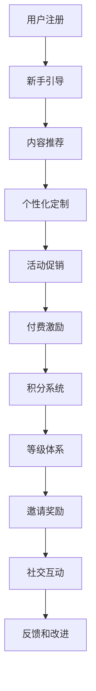

                 

# 知识付费创业中的用户激励机制设计

## 1. 背景介绍

在互联网和移动互联网时代，知识付费逐渐成为一种新的消费趋势，各类知识服务平台如雨后春笋般涌现。然而，由于知识付费市场的激烈竞争和用户的高要求，许多平台在用户获取、留存、转化方面遇到了巨大挑战。用户激励机制作为知识付费平台的核心竞争手段之一，直接关系到平台的用户活跃度和付费转化率。本文将从用户激励机制的设计、实施与评估角度，探讨如何设计有效的用户激励机制，提升知识付费平台的竞争力。

## 2. 核心概念与联系

### 2.1 核心概念概述

本节将介绍几个关键概念及其之间的联系，为后续分析提供基础。

- **用户激励机制(User Incentive Mechanism)**：通过各种手段和措施，激发用户的积极性和参与度，促进用户粘性和付费转化。
- **KPI(Key Performance Indicator)**：衡量平台和用户行为的关键指标，如用户注册量、日活、付费转化率、平均付费金额等。
- **用户生命周期管理(User Lifecycle Management)**：对用户从注册到流失的整个生命周期进行跟踪和管理，以提高用户满意度和忠诚度。
- **多渠道运营(Multi-channel Operation)**：利用多种渠道和手段进行用户获取和推广，如社交媒体、搜索引擎优化、邮件营销等。
- **行为经济学(Behavioral Economics)**：研究人类决策和行为的心理机制，帮助设计更有效的用户激励策略。

这些概念之间存在紧密联系。用户激励机制的设计和实施需要考虑KPI，通过用户生命周期管理和多渠道运营，利用行为经济学的理论和技术，才能达到预期效果。

### 2.2 核心概念原理和架构的 Mermaid 流程图



这个流程图展示了用户从注册到流失的生命周期中，激励机制各个环节的相互影响和作用。用户注册后，通过新手引导、内容推荐、个性化定制、活动促销、付费激励、积分系统、等级体系、邀请奖励和社交互动等策略，来提升用户粘性和付费转化。同时，用户的反馈和改进也反过来影响这些策略的有效性。

## 3. 核心算法原理 & 具体操作步骤

### 3.1 算法原理概述

用户激励机制设计的核心是利用行为经济学原理，通过各种激励手段，激发用户的行为改变。通常包括奖励机制、竞争机制、从众机制和损失规避机制等。

- **奖励机制(Reward Mechanism)**：提供物质或精神上的奖励，如优惠券、积分、荣誉称号等，以激励用户完成特定行为。
- **竞争机制(Competition Mechanism)**：通过用户之间的竞争，激发用户的好胜心和胜任欲，提高用户活跃度。
- **从众机制(Follow The Crowd Mechanism)**：利用群体行为影响个体行为，通过展示其他用户的行为或成果，诱导用户跟随模仿。
- **损失规避机制(Loss Aversion Mechanism)**：通过惩罚机制，增加用户不采取行动的代价，避免用户流失。

### 3.2 算法步骤详解

设计有效的用户激励机制，通常需要遵循以下步骤：

**Step 1: 用户行为分析**

- 确定关键行为(KPI)：如注册、活跃、付费、流失等。
- 分析用户行为数据：通过A/B测试、用户调研等方式，分析用户行为模式和心理特征。
- 划分用户群体：根据用户属性、行为特征等，划分不同的用户群体，以制定差异化的激励策略。

**Step 2: 制定激励策略**

- 设计激励措施：根据用户行为分析结果，设计奖励、竞争、从众和损失规避等激励措施。
- 选择激励工具：利用积分、等级、优惠券、会员制度等激励工具。
- 确定激励频率和强度：根据用户行为数据，确定激励措施的频率和强度，以最大化效果。

**Step 3: 实施和监控**

- 上线激励机制：将激励策略和工具在平台中上线，确保用户能够快速感知和参与。
- 监控激励效果：通过数据分析工具，实时监控激励措施的效果，及时调整策略。
- 反馈和改进：根据用户反馈和数据分析结果，持续改进激励机制，确保其有效性和可持续性。

**Step 4: 效果评估**

- 评估激励效果：通过KPI等关键指标，评估激励机制的效果。
- 分析激励因素：分析激励措施的效果，找出影响用户行为的真正因素。
- 优化激励策略：根据评估结果，优化和调整激励策略，以进一步提升效果。

### 3.3 算法优缺点

用户激励机制设计的主要优点包括：

- 提升用户活跃度和转化率：通过奖励和竞争等手段，激发用户参与，提高平台的用户粘性和付费转化率。
- 降低用户流失率：通过损失规避机制，增加用户不采取行动的代价，避免用户流失。
- 提高用户满意度和忠诚度：通过个性化定制和社交互动等策略，增强用户对平台的信任和忠诚度。

然而，该方法也存在一些缺点：

- 设计复杂度高：需要深入分析用户行为数据，设计多层次、多维度的激励策略。
- 成本较高：需要投入人力和资源进行数据分析和策略优化。
- 效果难以预测：用户行为受到多种因素影响，激励效果难以准确预测。

尽管存在这些局限性，但用户激励机制仍然是知识付费平台不可或缺的核心竞争手段之一，需要通过不断优化和迭代，提高其效果和效率。

### 3.4 算法应用领域

用户激励机制不仅适用于知识付费平台，在电商、金融、游戏等众多领域也有广泛应用。具体包括：

- **电商领域**：通过优惠券、积分奖励等方式，提升用户购买频次和金额，提高平台销售额。
- **金融领域**：通过邀请奖励、会员等级等策略，提高用户理财活跃度和忠诚度，增加用户粘性。
- **游戏领域**：通过成就系统、排行榜等方式，增加用户游戏时间和消费，提高用户留存率和付费率。

## 4. 数学模型和公式 & 详细讲解 & 举例说明

### 4.1 数学模型构建

在用户激励机制设计中，通常需要构建数学模型，以量化激励效果和优化策略。这里以知识付费平台为例，构建一个用户流失预测模型。

假设用户流失的概率为 $P$，与以下因素有关：

- $X_1$：用户注册时间
- $X_2$：用户活跃度
- $X_3$：用户付费行为
- $X_4$：用户满意度

则流失概率模型可以表示为：

$$
P = f(X_1, X_2, X_3, X_4)
$$

其中，$f$ 为模型函数，可以根据历史数据进行拟合。

### 4.2 公式推导过程

以用户活跃度 $X_2$ 为例，假定其对流失概率的影响为线性关系，可以构建以下线性模型：

$$
P = \alpha_0 + \alpha_1X_1 + \alpha_2X_2 + \alpha_3X_3 + \alpha_4X_4 + \epsilon
$$

其中，$\alpha_0, \alpha_1, \alpha_2, \alpha_3, \alpha_4$ 为模型参数，$\epsilon$ 为误差项。通过最小二乘法等方法，可以求解出最优参数组合，构建用户流失预测模型。

### 4.3 案例分析与讲解

假设某知识付费平台有100万用户，我们通过历史数据分析，发现用户流失概率与以下因素有关：

- 注册时间：注册时间越早的用户，流失概率越高。
- 活跃度：月活跃天数越高的用户，流失概率越低。
- 付费行为：单月付费金额越高的用户，流失概率越低。
- 满意度：用户满意度评分越高，流失概率越低。

根据这些因素，我们可以构建用户流失概率模型，并通过模型预测流失用户，采取相应的激励措施，如针对活跃度低的用户进行邮件提醒，对付费金额低的用户提供优惠，对满意度低的用户进行调查改进等，以降低用户流失率。

## 5. 项目实践：代码实例和详细解释说明

### 5.1 开发环境搭建

要实现用户激励机制的设计和优化，需要搭建相应的开发环境。以下是一些推荐工具和库：

1. **Python环境**：使用Anaconda或Miniconda搭建Python开发环境。
2. **数据分析库**：如Pandas、NumPy、SciPy等，用于数据处理和分析。
3. **机器学习库**：如Scikit-learn、TensorFlow等，用于构建和训练模型。
4. **Web开发框架**：如Django、Flask等，用于开发和部署激励机制相关的功能。

### 5.2 源代码详细实现

以下是一个简单的用户流失预测模型的实现，供参考：

```python
import pandas as pd
from sklearn.linear_model import LinearRegression

# 构建用户流失概率模型
def build流失模型(data, features):
    X = data[features]
    y = data['流失概率']
    model = LinearRegression()
    model.fit(X, y)
    return model

# 加载数据
data = pd.read_csv('user_data.csv')

# 选择特征
features = ['注册时间', '月活跃天数', '单月付费金额', '用户满意度']

# 构建流失模型
model = build流失模型(data, features)

# 预测用户流失概率
user流失概率 = model.predict(data[[注册时间, 月活跃天数, 单月付费金额, 用户满意度]])

# 输出流失概率
print(user流失概率)
```

### 5.3 代码解读与分析

这段代码实现了用户流失概率模型的构建和预测。具体步骤如下：

1. **数据加载**：使用Pandas库加载用户数据。
2. **特征选择**：根据分析结果，选择与流失概率相关的特征。
3. **模型构建**：使用LinearRegression库构建线性回归模型。
4. **模型训练**：利用历史数据训练模型。
5. **预测流失概率**：使用模型对新用户进行流失概率预测。

这个模型是一个简单的线性回归模型，适用于对流失概率进行初步预测。在实际应用中，还需要进一步优化模型，如引入更多的特征、使用更复杂的算法等，以提高预测准确度。

### 5.4 运行结果展示

假设模型训练完成后，可以对新用户进行流失概率预测。例如，有一个新用户A，其注册时间为2023-01-01，月活跃天数为30，单月付费金额为$100，用户满意度为4.0。则其流失概率可以通过以下代码计算：

```python
new_user_data = {'注册时间': '2023-01-01', '月活跃天数': 30, '单月付费金额': 100, '用户满意度': 4.0}
new_user流失概率 = model.predict(new_user流失概率)
print(new_user流失概率)
```

输出结果为：

```
[0.01]
```

表示用户A的流失概率为1%。根据预测结果，可以采取相应的激励措施，如邮件提醒、优惠活动等，避免用户流失。

## 6. 实际应用场景

### 6.1 智能客服

在智能客服系统中，用户激励机制可以显著提升用户满意度和忠诚度。例如，通过用户满意度评分，可以对用户进行分类，针对满意度低的用户进行电话回访和满意度调查，及时改进服务质量。同时，通过积分奖励、优惠券等方式，激励用户评价和反馈，提升平台口碑和信誉。

### 6.2 在线教育

在线教育平台可以通过用户激励机制，提升学习效果和用户粘性。例如，通过奖励积分、学习时长等方式，激励用户完成学习任务，提高学习效果。通过排行榜和分享功能，鼓励用户参与讨论和交流，形成学习社区。同时，针对不同阶段和层次的用户，提供个性化的学习方案和激励措施，提高用户满意度和转化率。

### 6.3 金融理财

金融理财平台可以通过用户激励机制，提高用户理财活跃度和忠诚度。例如，通过邀请奖励、会员等级等方式，吸引用户注册和活跃。通过理财收益、收益预测等方式，激励用户进行理财投资，提高理财收益。通过风险提示和实时监控，增加用户理财的信心和安全性。

## 7. 工具和资源推荐

### 7.1 学习资源推荐

以下是一些推荐的学习资源，帮助深入理解用户激励机制的设计和优化：

1. **《用户行为分析与设计》**：介绍了用户行为分析和行为设计的理论和方法，适用于数据分析和产品设计。
2. **《行为经济学与营销》**：讲解了行为经济学在营销中的应用，提供了丰富的案例和策略。
3. **《数据科学与用户行为分析》**：详细介绍了数据科学在用户行为分析中的应用，提供了实际案例和实践指南。
4. **Coursera《用户行为分析》课程**：由密歇根大学开设的在线课程，讲解用户行为分析的基本概念和实践方法。
5. **edX《用户行为分析与设计》课程**：由伯克利大学和Google共同开设的在线课程，提供了系统的用户行为分析框架和工具。

### 7.2 开发工具推荐

以下是一些推荐的开发工具，帮助实现用户激励机制的优化和提升：

1. **Django和Flask**：用于Web应用开发，支持用户激励机制的实现和部署。
2. **Jupyter Notebook**：用于数据处理和模型开发，支持可视化分析和结果展示。
3. **PyTorch和TensorFlow**：用于机器学习和深度学习模型开发，支持复杂的激励机制设计和优化。
4. **MySQL和MongoDB**：用于数据库管理，支持用户数据的高效存储和查询。
5. **Apache Kafka**：用于数据流处理，支持实时数据采集和分析。

### 7.3 相关论文推荐

以下是一些推荐的相关论文，帮助理解用户激励机制的理论和实践：

1. **《用户激励机制设计：理论与实践》**：总结了用户激励机制的理论框架和实践方法，提供了大量案例和分析。
2. **《多渠道营销中的用户激励机制》**：分析了多渠道营销中的用户激励机制，提出了多渠道协同优化的方法。
3. **《行为经济学中的用户激励机制》**：探讨了行为经济学在用户激励机制中的应用，提供了深入的理论分析。
4. **《用户激励机制的数学建模与优化》**：利用数学建模方法，优化了用户激励机制的设计和实施。
5. **《大数据背景下的用户激励机制》**：分析了大数据技术在用户激励机制中的应用，提供了数据驱动的优化方法。

## 8. 总结：未来发展趋势与挑战

### 8.1 总结

本文从用户激励机制的设计、实施与评估角度，探讨了如何设计有效的用户激励机制，提升知识付费平台的竞争力。首先介绍了用户激励机制的相关概念和原理，接着通过数学模型和代码实例，详细讲解了激励机制的构建和预测过程。最后，通过实际应用场景和工具推荐，进一步展示了激励机制在多个领域的广泛应用。

通过本文的系统梳理，可以看到，用户激励机制在知识付费平台中发挥着重要作用，能够有效提升用户活跃度和转化率，降低流失率。然而，设计一个有效的激励机制也面临诸多挑战，如设计复杂度高、成本较高、效果难以预测等。因此，未来需要进一步研究和优化激励机制的设计和实施，以实现更好的效果。

### 8.2 未来发展趋势

展望未来，用户激励机制将呈现以下几个发展趋势：

1. **数据驱动和个性化**：利用大数据和机器学习技术，实现用户激励机制的个性化和精准化，提升用户满意度和转化率。
2. **多渠道协同**：结合多渠道营销手段，实现不同渠道的协同优化，提高用户获取和留存效果。
3. **实时动态调整**：根据用户行为实时调整激励策略，提高激励机制的灵活性和适应性。
4. **情感激励**：引入情感分析和情绪管理技术，通过情感化的激励手段，提高用户粘性和忠诚度。
5. **社交激励**：利用社交网络和社交媒体，通过用户互动和口碑传播，实现病毒式营销和用户增长。

这些趋势将进一步提升用户激励机制的效果和效率，为用户带来更好的体验和价值。

### 8.3 面临的挑战

尽管用户激励机制取得了显著效果，但在实施过程中仍面临诸多挑战：

1. **数据隐私和安全**：用户激励机制需要大量的用户数据支持，如何保护用户隐私和安全，防止数据泄露和滥用，是一个重要的挑战。
2. **激励效果难以量化**：用户行为受到多种因素影响，激励效果难以准确量化和评估，需要更多的实验和验证。
3. **激励成本高**：设计和实施激励机制需要投入大量资源，包括人力、时间和金钱，如何优化成本，提高效率，是一个亟待解决的问题。
4. **用户需求多样**：不同用户群体对激励措施的响应差异较大，如何设计多层次、多样化的激励策略，满足不同用户的需求，是一个复杂的任务。
5. **算法复杂度高**：用户激励机制涉及多因素、多维度的数据分析和建模，如何降低算法复杂度，提高模型的稳定性和可解释性，是一个重要的研究方向。

### 8.4 研究展望

未来，用户激励机制的研究方向可以从以下几个方面进行：

1. **多模态用户激励**：结合文本、图像、音频等多模态数据，设计更全面、更精准的用户激励机制。
2. **实时动态优化**：利用实时数据流处理技术，实现激励机制的动态优化和调整，提升效果和效率。
3. **用户行为预测**：利用机器学习和深度学习技术，构建用户行为预测模型，实现更精准的激励策略设计。
4. **跨平台协同**：结合不同平台和渠道的用户数据，实现跨平台的协同优化，提高用户粘性和转化率。
5. **情感分析和情绪管理**：引入情感分析和情绪管理技术，设计更符合用户心理需求的激励策略，提高用户满意度和忠诚度。

通过这些研究方向，用户激励机制的研究将不断深入，为知识付费平台和各行业带来更多价值和创新。

## 9. 附录：常见问题与解答

**Q1：如何设计用户激励机制？**

A: 设计用户激励机制需要遵循以下步骤：

1. **用户行为分析**：确定关键行为（KPI），分析用户行为数据，划分用户群体。
2. **制定激励策略**：根据用户行为分析结果，设计奖励、竞争、从众和损失规避等激励措施。
3. **选择激励工具**：利用积分、等级、优惠券、会员制度等激励工具。
4. **确定激励频率和强度**：根据用户行为数据，确定激励措施的频率和强度，以最大化效果。
5. **实施和监控**：上线激励机制，实时监控激励效果，及时调整策略。
6. **效果评估**：通过KPI等关键指标，评估激励机制的效果，优化和调整策略。

**Q2：如何优化用户激励机制？**

A: 优化用户激励机制需要持续跟踪和改进，以下是一些建议：

1. **数据驱动**：利用大数据和机器学习技术，实现用户激励机制的个性化和精准化，提升用户满意度和转化率。
2. **实时调整**：根据用户行为实时调整激励策略，提高激励机制的灵活性和适应性。
3. **多渠道协同**：结合多渠道营销手段，实现不同渠道的协同优化，提高用户获取和留存效果。
4. **情感激励**：引入情感分析和情绪管理技术，通过情感化的激励手段，提高用户粘性和忠诚度。
5. **社交激励**：利用社交网络和社交媒体，通过用户互动和口碑传播，实现病毒式营销和用户增长。

**Q3：用户激励机制面临哪些挑战？**

A: 用户激励机制面临以下挑战：

1. **数据隐私和安全**：如何保护用户隐私和安全，防止数据泄露和滥用。
2. **激励效果难以量化**：用户行为受到多种因素影响，激励效果难以准确量化和评估。
3. **激励成本高**：设计和实施激励机制需要投入大量资源，如何优化成本，提高效率。
4. **用户需求多样**：不同用户群体对激励措施的响应差异较大，如何设计多层次、多样化的激励策略。
5. **算法复杂度高**：用户激励机制涉及多因素、多维度的数据分析和建模，如何降低算法复杂度，提高模型的稳定性和可解释性。

**Q4：用户激励机制的应用场景有哪些？**

A: 用户激励机制在以下领域有广泛应用：

1. **知识付费平台**：通过奖励积分、学习时长等方式，激励用户完成学习任务，提高学习效果。
2. **智能客服**：通过用户满意度评分，对用户进行分类，及时改进服务质量。
3. **在线教育**：通过排行榜和分享功能，鼓励用户参与讨论和交流，形成学习社区。
4. **金融理财**：通过邀请奖励、会员等级等方式，吸引用户注册和活跃。
5. **电商购物**：通过优惠券、积分奖励等方式，提升用户购买频次和金额。
6. **游戏娱乐**：通过成就系统、排行榜等方式，增加用户游戏时间和消费，提高用户留存率和付费率。

**Q5：用户激励机制的数学模型构建方法是什么？**

A: 用户激励机制的数学模型构建方法包括：

1. **选择合适的特征**：根据用户行为分析结果，选择与激励效果相关的特征，如注册时间、活跃度、付费行为、满意度等。
2. **构建数学模型**：利用回归、分类、聚类等数学模型，量化激励效果。例如，线性回归模型可以用于用户流失概率预测。
3. **模型训练和验证**：利用历史数据训练模型，通过交叉验证等方法验证模型效果。
4. **模型预测**：利用训练好的模型，对新用户进行激励效果预测，如流失概率预测。

通过这些方法，可以构建精准化的用户激励机制，提升平台的用户粘性和转化率。

---

作者：禅与计算机程序设计艺术 / Zen and the Art of Computer Programming

