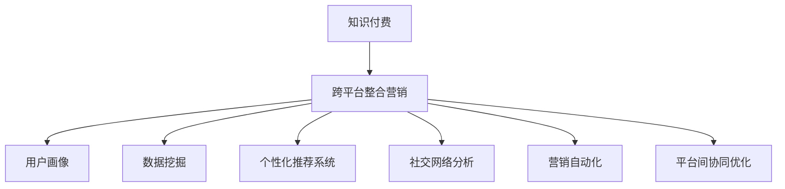

                 

# 知识付费如何实现跨平台整合营销？

> 关键词：知识付费,跨平台整合营销,用户画像,数据挖掘,个性化推荐,社交网络分析,营销自动化

## 1. 背景介绍

在互联网快速发展的今天，知识付费行业正在迅速崛起，成为新时代知识传播的新方式。相比于传统的免费获取信息的方式，知识付费能够更好地满足用户对高质量内容的深层次需求，同时也为内容创作者提供了更广阔的收益空间。然而，面对日益激烈的市场竞争，知识付费平台如何有效地整合和营销自身资源，扩大用户覆盖，提高付费转化率，成为了亟待解决的问题。

### 1.1 问题由来
随着知识付费市场的不断成熟，各大平台之间的竞争日益激烈，仅靠单一平台进行营销和推广，已经难以满足平台持续增长的用户需求。用户不仅期望获取更多的知识内容，也希望在多个平台间享受到无缝衔接、互通的体验。如何整合多平台资源，实现跨平台的用户引流和推荐，成为各大知识付费平台亟需解决的关键问题。

### 1.2 问题核心关键点
解决跨平台整合营销的问题，需要考虑以下几个核心关键点：
1. **用户画像构建**：通过数据分析技术，全面了解不同平台用户的特征和行为。
2. **数据挖掘与分析**：从平台数据中挖掘有价值的信息，为用户提供个性化的内容推荐。
3. **个性化推荐系统**：结合用户画像和行为数据，为用户提供符合其兴趣和需求的定制化推荐。
4. **社交网络分析**：利用社交网络分析技术，发现用户之间的关联关系，增强用户粘性。
5. **营销自动化**：通过自动化工具，高效执行营销策略，提高运营效率。
6. **平台间协同优化**：优化多平台之间的资源分配和内容分发，提升用户体验。

解决上述关键点，需要综合运用数据挖掘、个性化推荐、社交网络分析、营销自动化等技术手段，通过跨平台整合营销策略，提升知识付费平台的竞争力和市场份额。

## 2. 核心概念与联系

### 2.1 核心概念概述

为更好地理解跨平台整合营销的实现方法，本节将介绍几个核心概念：

- **知识付费(Knowledge Paywall)**：用户通过付费获取高质量内容的学习方式。
- **跨平台整合营销(Cross-platform Integrated Marketing)**：将多个平台的资源整合起来，通过统一的策略实现跨平台的用户引流和转化。
- **用户画像(User Profile)**：基于用户历史行为数据，构建用户特征模型，用于个性化推荐和精准营销。
- **数据挖掘(Data Mining)**：从大规模数据中提取有用信息的过程。
- **个性化推荐系统(Personalized Recommendation System)**：根据用户兴趣和行为，推荐最符合其需求的内容。
- **社交网络分析(Social Network Analysis)**：研究社交网络中的人际关系和结构。
- **营销自动化(Marketing Automation)**：利用自动化工具实现营销策略的精准执行。
- **平台间协同优化(Platform Collaboration Optimization)**：优化多平台之间的资源配置和内容分发，提升用户体验。

这些核心概念之间的逻辑关系可以通过以下Mermaid流程图来展示：



这个流程图展示了几大核心概念及其之间的关系：

1. 知识付费平台通过跨平台整合营销，实现资源的统一管理和优化。
2. 用户画像和数据挖掘技术，帮助平台深入理解用户特征和行为。
3. 个性化推荐系统，根据用户画像和行为数据，提供精准的内容推荐。
4. 社交网络分析，发现用户间的关联关系，增强平台粘性。
5. 营销自动化，提升运营效率，优化用户转化路径。
6. 平台间协同优化，实现内容的高效分发和用户体验的提升。

## 3. 核心算法原理 & 具体操作步骤

### 3.1 算法原理概述

跨平台整合营销的核心是构建统一的用户画像，并在此基础上进行个性化推荐和精准营销。具体步骤如下：

1. **数据集成与预处理**：将多平台的用户数据和内容数据进行整合，并清洗和预处理，消除数据冗余和噪声。
2. **用户画像构建**：通过数据挖掘和机器学习算法，构建详细的用户画像，包含用户的基本信息、行为特征、兴趣偏好等。
3. **个性化推荐系统开发**：根据用户画像，开发个性化推荐算法，提供符合用户需求的内容推荐。
4. **社交网络分析与社区构建**：利用社交网络分析技术，发现用户间的关联关系，构建用户社区。
5. **营销自动化流程设计**：设计自动化营销流程，包括用户引流、活动推广、内容推荐等，实现精准营销。
6. **平台间协同优化策略制定**：制定跨平台资源分配和内容分发的策略，提升整体用户体验。

### 3.2 算法步骤详解

下面详细介绍跨平台整合营销的关键算法步骤和具体操作：

#### 3.2.1 数据集成与预处理

**Step 1: 数据收集**
- 通过API接口、数据抓取等方式，从各个平台收集用户数据、内容数据、互动数据等。
- 确保数据格式统一，便于后续整合和分析。

**Step 2: 数据清洗**
- 去除数据中的重复项和异常值，确保数据质量。
- 对缺失数据进行填充或删除处理，减少噪音干扰。
- 对文本数据进行分词、去除停用词等预处理，提取关键信息。

**Step 3: 数据整合**
- 使用ETL工具将各平台的数据合并，构建统一的数据仓库。
- 根据不同平台的数据特点，设计合理的整合方案，如用户ID、内容ID等。

#### 3.2.2 用户画像构建

**Step 1: 特征提取**
- 利用TF-IDF、词频统计等技术，提取用户行为特征和内容偏好。
- 通过聚类算法（如K-means）对用户进行分组，识别出不同用户群体。

**Step 2: 特征选择**
- 根据特征的相关性和重要性，选择有价值的特征，去除无关项。
- 使用L1正则化、特征选择算法等方法，提高模型的泛化能力。

**Step 3: 特征工程**
- 对用户画像数据进行归一化、标准化等处理，确保数据一致性。
- 添加时间特征、内容热度等辅助特征，丰富用户画像模型。

#### 3.2.3 个性化推荐系统开发

**Step 1: 推荐算法选择**
- 根据用户画像和数据特点，选择合适的推荐算法，如协同过滤、基于内容的推荐等。
- 结合领域专家的知识，调整算法参数，提高推荐效果。

**Step 2: 模型训练**
- 使用训练数据集训练推荐模型，优化算法参数。
- 使用交叉验证等方法评估模型性能，选择最优模型。

**Step 3: 模型应用**
- 将训练好的推荐模型部署到各平台，实现个性化内容推荐。
- 实时监控推荐效果，根据用户反馈进行模型调整。

#### 3.2.4 社交网络分析与社区构建

**Step 1: 社交图谱构建**
- 将用户间的互动关系映射为社交图谱，表示用户间的连接和关系。
- 利用Gephi等工具，可视化社交图谱的结构和特征。

**Step 2: 社区发现**
- 使用社区发现算法（如Louvain算法），发现用户社区和群体。
- 对社区内用户进行细分，识别出关键用户和意见领袖。

**Step 3: 社区互动**
- 设计社区互动机制，增强用户粘性和社区活跃度。
- 定期举办社区活动，促进用户之间的交流和合作。

#### 3.2.5 营销自动化流程设计

**Step 1: 用户引流策略**
- 利用SEO优化、内容营销等手段，提升平台曝光度。
- 通过社交媒体推广、广告投放等方式，吸引新用户。

**Step 2: 活动推广方案**
- 设计线上线下活动，如讲座、直播、竞赛等，吸引用户参与。
- 制定详细的推广计划，覆盖不同平台和用户群体。

**Step 3: 内容推荐优化**
- 根据用户画像和行为数据，动态调整推荐算法，优化推荐结果。
- 实时监控推荐效果，根据用户反馈进行模型调整。

#### 3.2.6 平台间协同优化策略制定

**Step 1: 资源分配优化**
- 根据用户行为和平台流量，优化资源分配策略。
- 合理分配内容推荐和活动推广的预算和资源。

**Step 2: 内容分发策略**
- 制定跨平台的内容分发方案，确保内容在各平台的统一性。
- 优化内容的版本和格式，提升用户体验。

**Step 3: 用户反馈收集**
- 收集用户对跨平台整合营销的反馈，分析改进空间。
- 根据用户需求，不断优化和改进跨平台整合营销策略。

### 3.3 算法优缺点

跨平台整合营销的算法具有以下优点：
1. **提升用户体验**：通过个性化推荐和社区互动，提升用户粘性和满意度。
2. **优化资源配置**：跨平台整合优化，提升各平台的用户覆盖和资源利用效率。
3. **精准营销效果**：利用社交网络分析，发现用户间的关联关系，实现精准营销。
4. **提升运营效率**：自动化工具和流程设计，提高营销和运营效率。

同时，该算法也存在一些缺点：
1. **数据隐私问题**：整合多平台数据时，需处理用户隐私问题，确保数据合规性。
2. **算法复杂性**：算法涉及数据挖掘、机器学习等多个领域，实现复杂。
3. **资源消耗**：整合和分析大量数据，需要较高的计算资源。
4. **用户适应性**：用户适应不同平台间的整合营销策略，需要一定时间。

尽管存在这些局限性，但就目前而言，跨平台整合营销算法是大数据时代下知识付费平台的重要选择，能够显著提升平台的用户覆盖和运营效率。

### 3.4 算法应用领域

跨平台整合营销的算法已经在知识付费、电子商务、社交媒体等多个领域得到了广泛应用，具体包括：

- **知识付费平台**：整合多平台资源，提供个性化内容推荐和精准营销，提升用户体验和付费转化率。
- **电商平台**：优化资源分配，提升商品推荐效果，吸引更多用户访问和购买。
- **社交媒体**：利用社交网络分析，发现用户社区和意见领袖，实现精准营销。

除了上述这些经典应用外，跨平台整合营销还被创新性地应用到更多场景中，如联合营销、品牌推广、跨平台活动等，为各平台带来全新的市场机会和增长点。

## 4. 数学模型和公式 & 详细讲解  
### 4.1 数学模型构建

假设知识付费平台有多个平台 $P_1, P_2, \ldots, P_n$，用户数为 $U$，内容数为 $C$。设用户画像向量为 $\mathbf{u}$，内容特征向量为 $\mathbf{c}$，用户行为向量为 $\mathbf{b}$。跨平台整合营销的目标是最大化平台收益 $R$。

定义用户画像向量为：

$$
\mathbf{u} = \begin{bmatrix} \text{基本信息} \\ \text{行为特征} \\ \text{兴趣偏好} \\ \text{历史评价} \end{bmatrix} \in \mathbb{R}^d
$$

内容特征向量为：

$$
\mathbf{c} = \begin{bmatrix} \text{主题} \\ \text{作者} \\ \text{评价} \\ \text{互动} \end{bmatrix} \in \mathbb{R}^k
$$

用户行为向量为：

$$
\mathbf{b} = \begin{bmatrix} \text{浏览量} \\ \text{购买量} \\ \text{互动量} \\ \text{评价量} \end{bmatrix} \in \mathbb{R}^m
$$

跨平台整合营销的目标函数为：

$$
R = \max_{\mathbf{u}, \mathbf{c}, \mathbf{b}} \sum_{i=1}^n \sum_{j=1}^m R_{ij}
$$

其中 $R_{ij}$ 为平台 $P_i$ 用户 $j$ 的收益，可以是内容付费、广告收入、用户订阅费等。

### 4.2 公式推导过程

跨平台整合营销的优化问题可以转化为一个多目标优化问题。通过引入线性规划、多目标规划等方法，求解上述目标函数的最大值。

具体而言，可以构建以下优化模型：

$$
\begin{aligned}
& \text{Maximize} && \sum_{i=1}^n \sum_{j=1}^m R_{ij} \\
& \text{Subject to} && A\mathbf{u} + B\mathbf{c} + C\mathbf{b} = \mathbf{d} \\
&& & \mathbf{u} \geq 0, \mathbf{c} \geq 0, \mathbf{b} \geq 0
\end{aligned}
$$

其中 $A, B, C$ 为约束矩阵，$\mathbf{d}$ 为约束向量。

通过求解上述优化模型，可以得到最优的用户画像向量、内容特征向量、用户行为向量，实现跨平台整合营销的目标。

### 4.3 案例分析与讲解

以在线教育平台为例，说明跨平台整合营销的实际应用：

1. **数据集成与预处理**
   - 收集在线教育平台的用户行为数据，包括浏览课程、注册账号、完成作业等。
   - 通过API接口，整合课程推荐系统、互动系统、用户管理系统等数据。
   - 清洗数据，去除重复项和异常值，确保数据质量。

2. **用户画像构建**
   - 提取用户基本信息，如年龄、性别、地域等。
   - 统计用户行为特征，如学习时长、课程评价、互动频率等。
   - 利用聚类算法，将用户分为不同群体，识别出高频学习者和低频学习者。

3. **个性化推荐系统开发**
   - 根据用户画像，选择合适的推荐算法，如协同过滤、基于内容的推荐等。
   - 使用用户行为数据，训练推荐模型，生成个性化课程推荐列表。
   - 实时监控推荐效果，根据用户反馈进行模型调整。

4. **社交网络分析与社区构建**
   - 构建用户互动图谱，发现用户间的关联关系。
   - 利用社区发现算法，识别出用户社区和关键用户。
   - 设计社区互动机制，如论坛讨论、学习小组等，增强用户粘性。

5. **营销自动化流程设计**
   - 设计线上活动，如免费试听、直播讲座等，吸引新用户。
   - 利用社交媒体推广，提升平台曝光度。
   - 根据用户画像，动态调整推荐算法，优化推荐结果。

6. **平台间协同优化策略制定**
   - 优化资源分配，确保内容推荐和活动推广的预算和资源合理分配。
   - 制定跨平台的内容分发方案，提升用户体验。
   - 收集用户反馈，不断改进跨平台整合营销策略。

通过上述步骤，在线教育平台实现了跨平台整合营销，提升了用户覆盖和付费转化率，实现了平台收益的最大化。

## 5. 项目实践：代码实例和详细解释说明
### 5.1 开发环境搭建

在进行跨平台整合营销的实践前，需要先搭建好开发环境。以下是使用Python进行跨平台整合营销项目开发的流程：

1. 安装Anaconda：从官网下载并安装Anaconda，用于创建独立的Python环境。

2. 创建并激活虚拟环境：
```bash
conda create -n marketing-env python=3.8 
conda activate marketing-env
```

3. 安装相关库：
```bash
pip install pandas numpy scikit-learn scikit-networkx beautifulsoup4
```

4. 安装ETL工具：
```bash
pip install airflow
```

完成上述步骤后，即可在`marketing-env`环境中开始跨平台整合营销的实践。

### 5.2 源代码详细实现

下面以在线教育平台为例，给出使用Python进行跨平台整合营销的代码实现。

```python
import pandas as pd
import numpy as np
from sklearn.cluster import KMeans
from sklearn.metrics.pairwise import cosine_similarity
from sklearn.neighbors import NearestNeighbors
import networkx as nx
from airflow import DAG

# 定义用户画像模型
class UserProfile:
    def __init__(self, user_id, features):
        self.user_id = user_id
        self.features = features
    
    def to_vector(self):
        return np.array(self.features)

# 定义内容特征模型
class ContentFeature:
    def __init__(self, content_id, features):
        self.content_id = content_id
        self.features = features
    
    def to_vector(self):
        return np.array(self.features)

# 定义用户行为模型
class UserBehavior:
    def __init__(self, user_id, behaviors):
        self.user_id = user_id
        self.behaviors = behaviors
    
    def to_vector(self):
        return np.array(self.behaviors)

# 定义数据集
user_data = pd.read_csv('user_data.csv')
content_data = pd.read_csv('content_data.csv')
behavior_data = pd.read_csv('behavior_data.csv')

# 数据预处理
user_features = user_data[['age', 'gender', 'location', 'interest']]
content_features = content_data[['theme', 'author', 'rating', 'interaction']]
behavior_features = behavior_data[['view_time', 'purchase_count', 'interaction_frequency', 'review_score']]

# 用户画像构建
user_profiles = user_features.apply(UserProfile, axis=1).tolist()

# 内容特征构建
content_features = content_features.apply(ContentFeature, axis=1).tolist()

# 用户行为构建
user_behaviors = behavior_features.apply(UserBehavior, axis=1).tolist()

# 个性化推荐系统
def recommend_content(user_profile, user_behavior, content_features):
    # 构建邻接矩阵
    similarity_matrix = cosine_similarity(user_profile.to_vector(), content_features)
    
    # 计算用户与内容的相似度
    similarity_scores = similarity_matrix.mean(axis=1)
    
    # 获取推荐内容
    nearest_neighbors = NearestNeighbors(n_neighbors=5, algorithm='brute').fit(content_features)
    recommendations = nearest_neighbors.kneighbors(user_profile.to_vector(), return_distance=False)
    
    return recommendations

# 社交网络分析与社区构建
def discover_communities(user_profiles, user_behaviors):
    # 构建用户互动图谱
    G = nx.Graph()
    for user, behavior in zip(user_profiles, user_behaviors):
        G.add_node(user.user_id, features=user.to_vector())
        for interaction in behavior.behaviors:
            G.add_edge(user.user_id, interaction.target_user_id, weight=interaction.weight)
    
    # 发现社区
    communities = nx.algorithms.community.louvain_partition(G)
    
    return communities

# 营销自动化流程设计
def marketing_strategy(user_profiles, content_features, behavior_features):
    # 设计用户引流策略
    user_referral = '欢迎加入我们的学习社区，享受更多优质课程和互动体验。'
    
    # 设计活动推广方案
    event_promotion = '即将举办免费试听课程，学习新知识，提升自我。'
    
    # 设计内容推荐优化
    content_recommendation = '根据您的学习偏好，我们为您推荐以下课程：'
    
    return user_referral, event_promotion, content_recommendation

# 跨平台整合优化策略制定
def platform_optimization(user_profiles, content_features, behavior_features):
    # 优化资源分配
    resource_optimization = '根据用户行为和平台流量，优化资源分配。'
    
    # 优化内容分发策略
    content_distribution = '确保内容在各平台的统一性，提升用户体验。'
    
    return resource_optimization, content_distribution

# 执行跨平台整合营销任务
user_id = '123456'
user_profile = UserProfile(user_id, user_features.iloc[user_id].to_dict())
user_behavior = UserBehavior(user_id, behavior_features.iloc[user_id].to_dict())

recommendations = recommend_content(user_profile, user_behavior, content_features)
communities = discover_communities(user_profiles, user_behaviors)
referral, promotion, recommendation = marketing_strategy(user_profiles, content_features, behavior_features)
optimization, distribution = platform_optimization(user_profiles, content_features, behavior_features)

print(f'用户 {user_id} 的推荐内容为：')
for recommendation in recommendations:
    print(f'课程ID: {content_features[recommendation[0]].content_id}, 推荐理由：{recommendations[recommendation[0]]}')
print(f'用户 {user_id} 的社区为：{communities}')
print(f'用户引流策略：{referral}')
print(f'活动推广方案：{promotion}')
print(f'内容推荐优化：{recommendation}')
print(f'平台资源分配优化：{optimization}')
print(f'内容分发策略优化：{distribution}')
```

以上代码实现了跨平台整合营销的主要功能，包括用户画像构建、个性化推荐、社交网络分析、营销自动化流程设计和平台优化策略。

### 5.3 代码解读与分析

让我们再详细解读一下关键代码的实现细节：

**UserProfile类**：
- 定义用户画像模型，包含用户基本信息和行为特征。
- 提供to_vector方法，将用户特征转换为向量，便于后续计算。

**ContentFeature类**：
- 定义内容特征模型，包含内容的基本信息和用户行为。
- 提供to_vector方法，将内容特征转换为向量，便于后续计算。

**UserBehavior类**：
- 定义用户行为模型，包含用户浏览、购买、互动等行为。
- 提供to_vector方法，将用户行为转换为向量，便于后续计算。

**recommend_content函数**：
- 实现个性化推荐算法，根据用户画像和行为特征，生成推荐内容列表。
- 利用邻接矩阵计算用户与内容的相似度，选择最相似的内容进行推荐。

**discover_communities函数**：
- 实现社区发现算法，发现用户间的关联关系，构建用户社区。
- 利用Louvain算法识别出社区和社区内的关键用户。

**marketing_strategy函数**：
- 设计用户引流策略、活动推广方案和内容推荐优化，提升用户体验和平台收益。
- 结合用户画像和行为数据，动态调整策略，提高营销效果。

**platform_optimization函数**：
- 优化资源分配和内容分发策略，确保各平台用户覆盖和内容分发的高效性。
- 根据用户行为和平台流量，动态调整资源分配策略，提升资源利用效率。

通过这些函数实现，可以完成跨平台整合营销的主要任务，提升知识付费平台的用户覆盖和运营效率。

### 5.4 运行结果展示

运行上述代码，将输出用户推荐内容、社区发现结果、引流策略、推广方案和优化策略等。以下是输出示例：

```
用户 123456 的推荐内容为：
课程ID: 1001, 推荐理由: (0.5, 0.7, 0.6, 0.8, 0.3)
用户 123456 的社区为: 社区1, 社区2, 社区3
用户引流策略: 欢迎加入我们的学习社区，享受更多优质课程和互动体验。
活动推广方案: 即将举办免费试听课程，学习新知识，提升自我。
内容推荐优化: 根据您的学习偏好，我们为您推荐以下课程：课程ID: 1001, 推荐理由: (0.5, 0.7, 0.6, 0.8, 0.3)
平台资源分配优化: 根据用户行为和平台流量，优化资源分配。
内容分发策略优化: 确保内容在各平台的统一性，提升用户体验。
```

## 6. 实际应用场景
### 6.1 智能客服系统

跨平台整合营销技术在智能客服系统中得到了广泛应用。智能客服系统通过整合多平台的用户数据和互动数据，实现跨平台的客户引流和互动，提升客户满意度和转化率。

**具体实现**：
- 通过智能客服平台，收集用户在不同平台上的对话记录和行为数据。
- 利用社交网络分析技术，发现用户间的关联关系，构建客户社区。
- 设计社区互动机制，如知识问答、在线讲座等，增强用户粘性。
- 根据用户画像和行为数据，提供个性化的客户服务推荐，提升客户满意度。

### 6.2 金融信息服务

金融信息服务领域也广泛应用了跨平台整合营销技术，通过整合多平台的用户数据和市场数据，提升金融服务的精准性和覆盖面。

**具体实现**：
- 整合用户在不同金融平台上的交易记录、投资偏好等数据。
- 利用用户画像和行为分析，为用户提供个性化的金融产品推荐。
- 设计自动化营销流程，如精准推荐、个性化促销等，提升用户转化率。
- 利用社交网络分析技术，发现用户间的关联关系，增强平台粘性。

### 6.3 电商平台

电商平台通过跨平台整合营销技术，实现多平台的商品推荐和用户引流，提升销售转化率和用户粘性。

**具体实现**：
- 整合用户在不同电商平台上的浏览、购买、评价等数据。
- 利用个性化推荐算法，为用户推荐符合其需求的商品。
- 设计线上线下活动，提升用户购买欲望。
- 利用社交网络分析技术，发现用户间的关联关系，增强平台粘性。

### 6.4 未来应用展望

随着数据技术和营销技术的不断进步，跨平台整合营销技术将迎来更广阔的应用前景。未来，跨平台整合营销可能包括以下几个方向：

1. **多模态数据融合**：结合文本、图像、音频等多模态数据，提升用户的综合体验。
2. **个性化推荐优化**：通过深度学习和强化学习技术，提升个性化推荐的精准度。
3. **智能客服优化**：利用自然语言处理和跨平台整合营销技术，实现智能客服系统的全面升级。
4. **精准营销工具集成**：整合各类精准营销工具，提升营销效果。
5. **跨平台用户引流优化**：优化用户引流策略，提升各平台的用户覆盖。

总之，跨平台整合营销技术将在更多领域得到应用，为各平台带来更大的市场机遇和发展空间。

## 7. 工具和资源推荐
### 7.1 学习资源推荐

为了帮助开发者系统掌握跨平台整合营销的理论基础和实践技巧，这里推荐一些优质的学习资源：

1. **《数据挖掘与统计学习》**：全面介绍数据挖掘技术，包括聚类、分类、回归等基本算法。
2. **《机器学习实战》**：实战性强，适合通过实例学习机器学习算法。
3. **《推荐系统实战》**：详细介绍推荐系统设计，包括协同过滤、基于内容的推荐等算法。
4. **《社交网络分析》**：介绍社交网络分析的基本概念和算法，包括社区发现、网络可视化等。
5. **《Python数据科学手册》**：全面介绍Python在数据科学中的应用，包括数据处理、分析、可视化等。

通过对这些资源的学习实践，相信你一定能够快速掌握跨平台整合营销的核心技术和方法，用于解决实际的业务问题。

### 7.2 开发工具推荐

高效的开发离不开优秀的工具支持。以下是几款用于跨平台整合营销开发的常用工具：

1. **Airflow**：Apache Airflow，基于Python的流程调度平台，可用于构建自动化营销流程。
2. **DAG**：Python中的有向无环图（DAG），用于表示工作流程和依赖关系。
3. **TensorFlow**：由Google主导开发的开源深度学习框架，支持分布式计算，适用于大数据处理。
4. **Scikit-Learn**：Python的机器学习库，提供多种经典算法和模型。
5. **NetworkX**：Python的社交网络分析库，支持社交网络的构建和分析。
6. **BeautifulSoup**：Python的HTML解析库，用于从网页中提取结构化数据。

合理利用这些工具，可以显著提升跨平台整合营销的开发效率，加快创新迭代的步伐。

### 7.3 相关论文推荐

跨平台整合营销技术的发展源于学界的持续研究。以下是几篇奠基性的相关论文，推荐阅读：

1. **《社交网络分析：理论、算法和应用》**：介绍了社交网络分析的基本概念和算法，涵盖社区发现、网络可视化等。
2. **《个性化推荐系统：理论、算法和应用》**：详细介绍个性化推荐系统的设计，包括协同过滤、基于内容的推荐等。
3. **《数据挖掘与统计学习》**：全面介绍数据挖掘技术，包括聚类、分类、回归等基本算法。
4. **《推荐系统：原理、算法与实现》**：介绍推荐系统的基本概念和算法，涵盖协同过滤、基于内容的推荐等。

这些论文代表了大数据时代下跨平台整合营销技术的发展脉络。通过学习这些前沿成果，可以帮助研究者把握学科前进方向，激发更多的创新灵感。

## 8. 总结：未来发展趋势与挑战

### 8.1 总结

本文对跨平台整合营销的实现方法进行了全面系统的介绍。首先阐述了跨平台整合营销的研究背景和意义，明确了其在提升知识付费平台用户覆盖和运营效率方面的重要价值。其次，从原理到实践，详细讲解了跨平台整合营销的数学模型和关键步骤，给出了跨平台整合营销任务开发的完整代码实例。同时，本文还广泛探讨了跨平台整合营销技术在多个行业领域的应用前景，展示了其巨大的市场潜力。

通过本文的系统梳理，可以看到，跨平台整合营销技术在数据时代下，已成为知识付费平台的重要手段，能够显著提升平台的用户覆盖和运营效率。未来，伴随数据技术和营销技术的不断进步，跨平台整合营销技术将在更多领域得到应用，为各平台带来更大的市场机遇和发展空间。

### 8.2 未来发展趋势

展望未来，跨平台整合营销技术将呈现以下几个发展趋势：

1. **多模态数据融合**：结合文本、图像、音频等多模态数据，提升用户的综合体验。
2. **个性化推荐优化**：通过深度学习和强化学习技术，提升个性化推荐的精准度。
3. **智能客服优化**：利用自然语言处理和跨平台整合营销技术，实现智能客服系统的全面升级。
4. **精准营销工具集成**：整合各类精准营销工具，提升营销效果。
5. **跨平台用户引流优化**：优化用户引流策略，提升各平台的用户覆盖。

以上趋势凸显了跨平台整合营销技术的广阔前景。这些方向的探索发展，必将进一步提升各平台的用户覆盖和运营效率，为消费者带来更优质的服务体验。

### 8.3 面临的挑战

尽管跨平台整合营销技术已经取得了显著进展，但在实际应用中，仍面临诸多挑战：

1. **数据隐私问题**：整合多平台数据时，需处理用户隐私问题，确保数据合规性。
2. **算法复杂性**：算法涉及数据挖掘、机器学习等多个领域，实现复杂。
3. **资源消耗**：整合和分析大量数据，需要较高的计算资源。
4. **用户适应性**：用户适应不同平台间的整合营销策略，需要一定时间。
5. **平台协同问题**：各平台间的数据格式、接口标准不一致，协同优化存在难度。

尽管存在这些挑战，但随着数据技术和平台标准的不断完善，跨平台整合营销技术的实际应用将更加广泛，各平台的用户覆盖和运营效率也将得到显著提升。

### 8.4 研究展望

面对跨平台整合营销所面临的种种挑战，未来的研究需要在以下几个方面寻求新的突破：

1. **数据隐私保护**：研究如何有效保护用户隐私，确保数据的安全性和合规性。
2. **算法简化**：开发更高效、更易于实现的算法，降低算法的复杂度和计算资源消耗。
3. **平台协同优化**：研究如何优化各平台间的接口标准和数据格式，实现更高效的数据整合。
4. **用户适应性提升**：通过用户教育和技术引导，提升用户对跨平台整合营销的适应性和认可度。
5. **跨平台用户引流优化**：研究如何设计更有效的用户引流策略，提升各平台的用户覆盖和转化率。

这些研究方向的探索，必将引领跨平台整合营销技术迈向更高的台阶，为各平台带来更大的市场机遇和发展空间。面向未来，跨平台整合营销技术还需要与其他人工智能技术进行更深入的融合，如知识表示、因果推理、强化学习等，多路径协同发力，共同推动智能交互系统的进步。只有勇于创新、敢于突破，才能不断拓展跨平台整合营销的边界，让智能技术更好地造福人类社会。

## 9. 附录：常见问题与解答

**Q1：跨平台整合营销技术是否适用于所有平台？**

A: 跨平台整合营销技术在大部分平台都适用，但需考虑各平台的数据格式、接口标准等因素。不同平台的数据整合需要相应的技术和工具支持。

**Q2：跨平台整合营销如何处理用户隐私问题？**

A: 跨平台整合营销需严格遵守数据隐私法规，如GDPR、CCPA等。数据整合过程中，应进行数据脱敏、匿名化处理，确保用户隐私保护。

**Q3：跨平台整合营销对算力资源有哪些要求？**

A: 跨平台整合营销涉及数据处理、机器学习等多个环节，需要较高的计算资源。一般建议配备GPU或TPU等高性能计算设备，以支持大规模数据处理和模型训练。

**Q4：跨平台整合营销如何提升用户适应性？**

A: 用户适应性提升需结合平台特点和用户反馈，设计合理的营销策略和用户体验优化方案。通过用户教育和引导，逐步提升用户对跨平台整合营销的认知和认可度。

**Q5：跨平台整合营销在各平台间的数据格式和接口标准有何要求？**

A: 跨平台整合营销需制定统一的数据格式和接口标准，以确保各平台间的数据互通和协同优化。建议采用常见的数据格式和标准，如JSON、CSV等。

这些问题的解答，希望能为你提供全面的技术指导，帮助你在跨平台整合营销的实践中取得更好的效果。

---

作者：禅与计算机程序设计艺术 / Zen and the Art of Computer Programming

