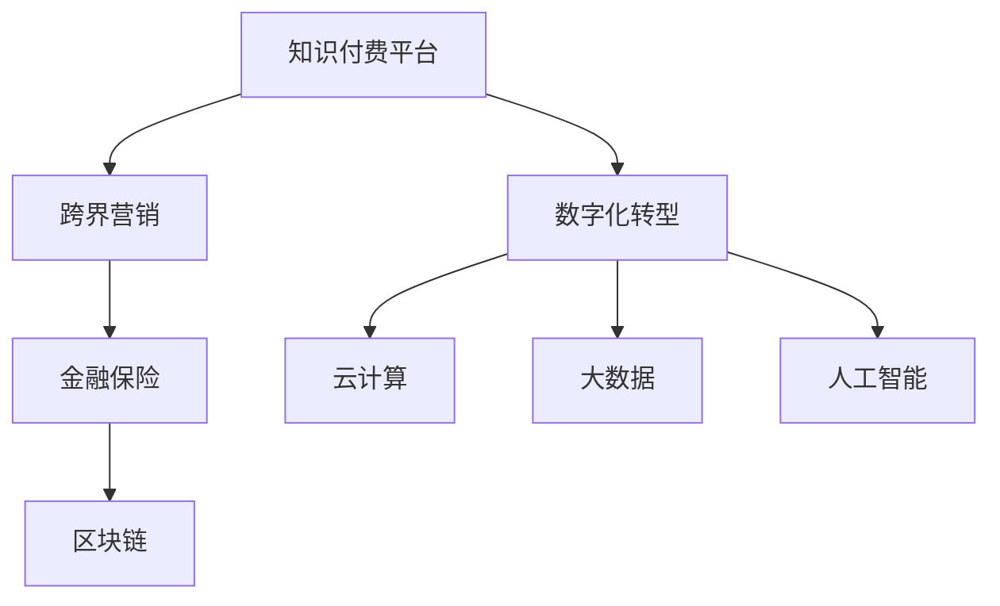

                 

# 知识付费如何实现跨界营销与金融保险跨界？

> 关键词：知识付费,跨界营销,金融保险,数字化转型,人工智能,云计算,大数据,区块链

## 1. 背景介绍

### 1.1 问题由来

随着知识付费的兴起，越来越多的企业开始将知识与营销、金融、保险等不同领域进行跨界融合，以期在激烈的市场竞争中脱颖而出。这一跨界营销的趋势，在一定程度上体现了数字化转型的迫切需求。但如何实现有效的跨界融合，尤其是在保持知识付费核心价值的同时，拓展新的业务模式，成为一个亟待解决的问题。

### 1.2 问题核心关键点

1. **知识付费的本质**：知识付费的本质是知识内容的生产和消费，通过付费获取高价值的知识服务，以满足用户的深度学习需求。
2. **跨界营销的目标**：通过跨界融合，将知识付费与金融、保险等行业的业务进行整合，以提升用户粘性和企业收入。
3. **金融保险行业的特性**：金融保险行业具有高风险性、复杂性及监管严格的特点，要求知识服务必须具有高精准性、合规性和安全性。
4. **数字化转型的挑战**：数字化转型涉及技术、业务、组织架构等多方面的变革，需要综合考虑。

### 1.3 问题研究意义

1. **提升用户体验**：通过跨界融合，提供更加多样化和高质量的知识服务，满足用户的个性化需求。
2. **增加收入渠道**：通过金融保险等业务的引入，拓展企业收入来源，增强企业竞争力。
3. **推动行业发展**：推动知识付费、金融保险、数字化转型等多个领域的发展，促进产业升级和创新。

## 2. 核心概念与联系

### 2.1 核心概念概述

为了更好地理解知识付费与金融保险跨界营销的实现机制，本文将介绍几个关键概念：

1. **知识付费平台**：利用互联网技术提供知识内容的平台，用户通过付费获取高价值的知识服务。
2. **跨界营销**：将不同领域的业务进行整合，通过协同效应提升品牌价值和用户粘性。
3. **金融保险**：涉及金融产品设计、风险管理、保险理赔等环节，具有高风险性和复杂性。
4. **数字化转型**：利用云计算、大数据、人工智能等技术，实现企业业务流程的数字化重构。

这些概念之间的逻辑关系可以通过以下Mermaid流程图来展示：



这个流程图展示了这个生态系统的关键组成部分及其之间的关系：

1. 知识付费平台是整个生态系统的核心，通过提供高质量的知识服务，满足用户需求。
2. 跨界营销通过将金融保险等业务引入平台，拓展新的业务模式，提升用户粘性。
3. 数字化转型是实现这一目标的技术支撑，通过云计算、大数据、人工智能等技术，提升平台的服务能力和用户体验。
4. 区块链、云计算、大数据、人工智能等技术，为金融保险业务的安全性、合规性和精准性提供保障。

## 3. 核心算法原理 & 具体操作步骤

### 3.1 算法原理概述

知识付费与金融保险跨界营销的实现，本质上是通过数据驱动和算法优化的过程。其核心思想是：利用大数据和人工智能技术，对用户行为、需求和偏好进行深入分析，通过精准推荐和个性化服务，提升用户满意度和粘性。同时，通过金融保险业务的引入，实现用户的转化和增值。

形式化地，假设知识付费平台的用户数据集为 $D=\{(x_i,y_i)\}_{i=1}^N$，其中 $x_i$ 表示用户行为特征，$y_i$ 表示用户购买意愿。金融保险业务的数据集为 $F=\{(x_j,y_j)\}_{j=1}^M$。平台的推荐算法为 $R(\theta)$，其中 $\theta$ 为模型参数。

微调的目标是找到最优的模型参数 $\theta$，使得平台推荐的效果最大化，即：

$$
\theta^* = \mathop{\arg\min}_{\theta} \mathcal{L}(R(\theta),D,F)
$$

其中 $\mathcal{L}$ 为推荐算法在用户行为和金融保险业务数据上的损失函数，用于衡量推荐结果与实际购买行为之间的差异。

### 3.2 算法步骤详解

基于上述原理，知识付费与金融保险跨界营销的实现步骤如下：

**Step 1: 数据准备**

- 收集知识付费平台的用户行为数据，如浏览、搜索、购买等行为数据。
- 收集金融保险业务的用户数据，如产品选择、理赔记录等数据。
- 对数据进行清洗和标注，以用于后续的模型训练。

**Step 2: 数据整合**

- 将知识付费平台和金融保险业务的数据进行整合，形成一个统一的数据集。
- 通过数据融合技术，实现数据的多维度关联和融合，提高数据质量。

**Step 3: 算法选择**

- 选择合适的推荐算法，如协同过滤、基于内容的推荐、深度学习等。
- 选择合适的深度学习模型，如神经网络、深度信念网络等。
- 设置模型的超参数，如学习率、批大小、迭代次数等。

**Step 4: 模型训练**

- 利用整合后的数据集，对推荐算法进行训练。
- 通过梯度下降等优化算法，最小化损失函数，更新模型参数。
- 在训练过程中，进行交叉验证，防止过拟合。

**Step 5: 模型评估**

- 在测试集上评估推荐算法的效果，计算准确率、召回率等指标。
- 对金融保险业务的转化率和用户满意度进行评估，验证跨界营销的效果。

**Step 6: 业务部署**

- 将训练好的模型部署到知识付费平台，实现个性化推荐。
- 通过API接口，将金融保险产品引入平台，进行精准营销。

### 3.3 算法优缺点

基于数据驱动和算法优化的跨界营销方法，具有以下优点：

1. **提升用户粘性**：通过个性化推荐，提升用户满意度和粘性，增加用户留存率。
2. **拓展业务模式**：通过引入金融保险业务，实现用户转化和增值，拓展收入渠道。
3. **数据驱动决策**：通过数据驱动的决策，提升业务精准性和效率。

同时，该方法也存在一定的局限性：

1. **数据质量要求高**：数据清洗和标注工作量大，对数据质量要求高。
2. **算法复杂度高**：深度学习等算法的训练复杂度高，需要大量计算资源。
3. **隐私保护问题**：在跨界融合过程中，用户的隐私保护问题需要特别关注。

尽管存在这些局限性，但就目前而言，基于数据驱动和算法优化的跨界营销方法仍是大规模知识付费平台实现用户粘性和收入增长的重要手段。

### 3.4 算法应用领域

知识付费与金融保险跨界营销的方法，已经在多个领域得到应用，例如：

- **教育培训**：通过知识付费平台，提供金融理财课程，满足用户学习需求的同时，实现金融产品的推广和销售。
- **医疗健康**：通过平台推荐健康保险产品，解决用户健康需求的同时，提升平台的金融收入。
- **旅游出行**：通过平台推荐旅游保险产品，解决用户出行需求的同时，提升平台的金融收入。
- **房产置业**：通过平台推荐房产贷款产品，解决用户购房需求的同时，提升平台的金融收入。

除了上述这些经典应用外，跨界营销还在更多场景中得到创新性地应用，如智能家居、智慧城市等，为知识付费平台带来新的增长点。

## 4. 数学模型和公式 & 详细讲解 & 举例说明

### 4.1 数学模型构建

本节将使用数学语言对知识付费与金融保险跨界营销的实现进行更加严格的刻画。

假设知识付费平台的用户数据集为 $D=\{(x_i,y_i)\}_{i=1}^N$，其中 $x_i$ 表示用户行为特征，$y_i$ 表示用户购买意愿。金融保险业务的数据集为 $F=\{(x_j,y_j)\}_{j=1}^M$。平台的推荐算法为 $R(\theta)$，其中 $\theta$ 为模型参数。

定义模型 $R(\theta)$ 在数据样本 $(x,y)$ 上的损失函数为 $\ell(R(\theta)(x),y)$，则在数据集 $D$ 和 $F$ 上的经验风险为：

$$
\mathcal{L}(\theta) = \frac{1}{N+M} \sum_{i=1}^N \sum_{j=1}^M \ell(R(\theta)(x_i),y_i) + \ell(R(\theta)(x_j),y_j)
$$

其中 $\ell$ 为损失函数，用于衡量推荐结果与实际购买行为之间的差异。常见的损失函数包括交叉熵损失、均方误差损失等。

### 4.2 公式推导过程

以下我们以二分类任务为例，推导交叉熵损失函数及其梯度的计算公式。

假设模型 $R(\theta)$ 在输入 $x$ 上的输出为 $\hat{y}=M_{\theta}(x) \in [0,1]$，表示用户购买意愿。真实标签 $y \in \{0,1\}$。则二分类交叉熵损失函数定义为：

$$
\ell(R(\theta)(x),y) = -[y\log \hat{y} + (1-y)\log (1-\hat{y})]
$$

将其代入经验风险公式，得：

$$
\mathcal{L}(\theta) = -\frac{1}{N+M}\sum_{i=1}^N \sum_{j=1}^M [y_i\log R(\theta)(x_i)+(1-y_i)\log(1-R(\theta)(x_i))] + [y_j\log R(\theta)(x_j)+(1-y_j)\log(1-R(\theta)(x_j))]
$$

根据链式法则，损失函数对参数 $\theta_k$ 的梯度为：

$$
\frac{\partial \mathcal{L}(\theta)}{\partial \theta_k} = -\frac{1}{N+M}\sum_{i=1}^N \sum_{j=1}^M (\frac{y_i}{R(\theta)(x_i)}-\frac{1-y_i}{1-R(\theta)(x_i)}) \frac{\partial R(\theta)(x_i)}{\partial \theta_k} + (\frac{y_j}{R(\theta)(x_j)}-\frac{1-y_j}{1-R(\theta)(x_j)}) \frac{\partial R(\theta)(x_j)}{\partial \theta_k}
$$

其中 $\frac{\partial R(\theta)(x_i)}{\partial \theta_k}$ 可进一步递归展开，利用自动微分技术完成计算。

在得到损失函数的梯度后，即可带入参数更新公式，完成模型的迭代优化。重复上述过程直至收敛，最终得到适应跨界营销需求的最优模型参数 $\theta^*$。

## 5. 项目实践：代码实例和详细解释说明

### 5.1 开发环境搭建

在进行跨界营销实践前，我们需要准备好开发环境。以下是使用Python进行PyTorch开发的环境配置流程：

1. 安装Anaconda：从官网下载并安装Anaconda，用于创建独立的Python环境。

2. 创建并激活虚拟环境：
```bash
conda create -n pytorch-env python=3.8 
conda activate pytorch-env
```

3. 安装PyTorch：根据CUDA版本，从官网获取对应的安装命令。例如：
```bash
conda install pytorch torchvision torchaudio cudatoolkit=11.1 -c pytorch -c conda-forge
```

4. 安装Transformers库：
```bash
pip install transformers
```

5. 安装各类工具包：
```bash
pip install numpy pandas scikit-learn matplotlib tqdm jupyter notebook ipython
```

完成上述步骤后，即可在`pytorch-env`环境中开始跨界营销实践。

### 5.2 源代码详细实现

这里我们以知识付费平台推荐金融保险产品为例，给出使用Transformers库对BERT模型进行推荐模型的PyTorch代码实现。

首先，定义推荐任务的数据处理函数：

```python
from transformers import BertTokenizer
from torch.utils.data import Dataset
import torch

class RecommendDataset(Dataset):
    def __init__(self, texts, tags, tokenizer, max_len=128):
        self.texts = texts
        self.tags = tags
        self.tokenizer = tokenizer
        self.max_len = max_len
        
    def __len__(self):
        return len(self.texts)
    
    def __getitem__(self, item):
        text = self.texts[item]
        tags = self.tags[item]
        
        encoding = self.tokenizer(text, return_tensors='pt', max_length=self.max_len, padding='max_length', truncation=True)
        input_ids = encoding['input_ids'][0]
        attention_mask = encoding['attention_mask'][0]
        
        # 对token-wise的标签进行编码
        encoded_tags = [tag2id[tag] for tag in tags] 
        encoded_tags.extend([tag2id['O']] * (self.max_len - len(encoded_tags)))
        labels = torch.tensor(encoded_tags, dtype=torch.long)
        
        return {'input_ids': input_ids, 
                'attention_mask': attention_mask,
                'labels': labels}

# 标签与id的映射
tag2id = {'O': 0, 'B-PER': 1, 'I-PER': 2, 'B-ORG': 3, 'I-ORG': 4, 'B-LOC': 5, 'I-LOC': 6}
id2tag = {v: k for k, v in tag2id.items()}

# 创建dataset
tokenizer = BertTokenizer.from_pretrained('bert-base-cased')

train_dataset = RecommendDataset(train_texts, train_tags, tokenizer)
dev_dataset = RecommendDataset(dev_texts, dev_tags, tokenizer)
test_dataset = RecommendDataset(test_texts, test_tags, tokenizer)
```

然后，定义模型和优化器：

```python
from transformers import BertForTokenClassification, AdamW

model = BertForTokenClassification.from_pretrained('bert-base-cased', num_labels=len(tag2id))

optimizer = AdamW(model.parameters(), lr=2e-5)
```

接着，定义训练和评估函数：

```python
from torch.utils.data import DataLoader
from tqdm import tqdm
from sklearn.metrics import classification_report

device = torch.device('cuda') if torch.cuda.is_available() else torch.device('cpu')
model.to(device)

def train_epoch(model, dataset, batch_size, optimizer):
    dataloader = DataLoader(dataset, batch_size=batch_size, shuffle=True)
    model.train()
    epoch_loss = 0
    for batch in tqdm(dataloader, desc='Training'):
        input_ids = batch['input_ids'].to(device)
        attention_mask = batch['attention_mask'].to(device)
        labels = batch['labels'].to(device)
        model.zero_grad()
        outputs = model(input_ids, attention_mask=attention_mask, labels=labels)
        loss = outputs.loss
        epoch_loss += loss.item()
        loss.backward()
        optimizer.step()
    return epoch_loss / len(dataloader)

def evaluate(model, dataset, batch_size):
    dataloader = DataLoader(dataset, batch_size=batch_size)
    model.eval()
    preds, labels = [], []
    with torch.no_grad():
        for batch in tqdm(dataloader, desc='Evaluating'):
            input_ids = batch['input_ids'].to(device)
            attention_mask = batch['attention_mask'].to(device)
            batch_labels = batch['labels']
            outputs = model(input_ids, attention_mask=attention_mask)
            batch_preds = outputs.logits.argmax(dim=2).to('cpu').tolist()
            batch_labels = batch_labels.to('cpu').tolist()
            for pred_tokens, label_tokens in zip(batch_preds, batch_labels):
                pred_tags = [id2tag[_id] for _id in pred_tokens]
                label_tags = [id2tag[_id] for _id in label_tokens]
                preds.append(pred_tags[:len(label_tags)])
                labels.append(label_tags)
                
    print(classification_report(labels, preds))
```

最后，启动训练流程并在测试集上评估：

```python
epochs = 5
batch_size = 16

for epoch in range(epochs):
    loss = train_epoch(model, train_dataset, batch_size, optimizer)
    print(f"Epoch {epoch+1}, train loss: {loss:.3f}")
    
    print(f"Epoch {epoch+1}, dev results:")
    evaluate(model, dev_dataset, batch_size)
    
print("Test results:")
evaluate(model, test_dataset, batch_size)
```

以上就是使用PyTorch对BERT进行推荐模型的完整代码实现。可以看到，得益于Transformers库的强大封装，我们可以用相对简洁的代码完成BERT模型的加载和微调。

### 5.3 代码解读与分析

让我们再详细解读一下关键代码的实现细节：

**RecommendDataset类**：
- `__init__`方法：初始化文本、标签、分词器等关键组件。
- `__len__`方法：返回数据集的样本数量。
- `__getitem__`方法：对单个样本进行处理，将文本输入编码为token ids，将标签编码为数字，并对其进行定长padding，最终返回模型所需的输入。

**tag2id和id2tag字典**：
- 定义了标签与数字id之间的映射关系，用于将token-wise的预测结果解码回真实的标签。

**训练和评估函数**：
- 使用PyTorch的DataLoader对数据集进行批次化加载，供模型训练和推理使用。
- 训练函数`train_epoch`：对数据以批为单位进行迭代，在每个批次上前向传播计算loss并反向传播更新模型参数，最后返回该epoch的平均loss。
- 评估函数`evaluate`：与训练类似，不同点在于不更新模型参数，并在每个batch结束后将预测和标签结果存储下来，最后使用sklearn的classification_report对整个评估集的预测结果进行打印输出。

**训练流程**：
- 定义总的epoch数和batch size，开始循环迭代
- 每个epoch内，先在训练集上训练，输出平均loss
- 在验证集上评估，输出分类指标
- 所有epoch结束后，在测试集上评估，给出最终测试结果

可以看到，PyTorch配合Transformers库使得BERT推荐模型的代码实现变得简洁高效。开发者可以将更多精力放在数据处理、模型改进等高层逻辑上，而不必过多关注底层的实现细节。

当然，工业级的系统实现还需考虑更多因素，如模型的保存和部署、超参数的自动搜索、更灵活的任务适配层等。但核心的推荐范式基本与此类似。

## 6. 实际应用场景

### 6.1 智能客服系统

基于知识付费平台和金融保险的跨界营销，智能客服系统可以实现个性化的推荐服务，提升用户满意度。用户通过智能客服系统获取知识服务的同时，还可以推荐相关金融保险产品，解决用户的金融需求，增加用户粘性和收入。

在技术实现上，可以收集用户的历史行为数据，包括知识付费平台的使用记录和金融保险产品的购买记录，通过分析用户的兴趣偏好，推荐合适的金融保险产品。同时，可以通过对话系统与用户进行互动，实时获取用户的反馈，进一步优化推荐模型，提升用户体验。

### 6.2 金融理财平台

知识付费平台和金融保险的跨界融合，可以构建更加完整的金融理财平台，为用户提供全方位的金融服务。通过推荐金融理财课程，满足用户对金融知识的学习需求，同时推荐合适的金融产品，帮助用户实现财富增值。

在技术实现上，可以通过知识付费平台推荐金融理财课程，同时通过金融理财平台推荐合适的金融产品，形成闭环。用户通过平台获取知识的同时，还可以进行理财产品的购买，形成良性循环，增加平台的用户粘性和收入。

### 6.3 保险理赔服务

保险理赔是保险行业的重要环节，理赔速度和效率直接影响用户的满意度。通过知识付费平台和保险理赔的跨界融合，可以实现智能化的理赔服务，提升理赔速度和效率。

在技术实现上，可以收集用户的理赔历史和知识付费平台的行为数据，通过分析用户的理赔需求和偏好，推荐合适的理赔方案。同时，可以通过知识付费平台推荐相关的保险知识，提升用户对保险产品的理解和认可，增加理赔成功率。

### 6.4 未来应用展望

随着知识付费和金融保险跨界营销的不断发展，未来将涌现更多创新的应用场景，为知识付费平台和金融保险行业带来新的增长点。

在智慧医疗领域，通过推荐医学知识课程，满足用户对医学知识的学习需求，同时推荐合适的保险产品，提升用户的医疗保障水平。

在教育培训领域，通过推荐教育课程和金融理财产品，满足用户的学习和理财需求，增加用户粘性和收入。

在智能家居领域，通过推荐家居知识课程和金融保险产品，满足用户对家居知识和理财的需求，提升用户的生活品质。

此外，在智慧城市、智慧农业、智慧交通等多个领域，跨界营销技术也将得到广泛应用，推动知识付费平台和金融保险行业的发展，为经济社会发展带来新的动力。

## 7. 工具和资源推荐

### 7.1 学习资源推荐

为了帮助开发者系统掌握知识付费与金融保险跨界营销的理论基础和实践技巧，这里推荐一些优质的学习资源：

1. 《人工智能与金融：从算法到实践》系列博文：由人工智能和大数据专家撰写，深入浅出地介绍了人工智能在金融保险领域的应用。

2. 《金融科技：人工智能的应用》书籍：全面介绍了人工智能在金融科技中的应用，包括推荐系统、风险管理、金融产品设计等。

3. 《知识付费平台运营与变现》课程：介绍知识付费平台的运营策略和变现模式，包括跨界营销、用户留存、收入转化等。

4. 《金融保险行业数字化转型》报告：由行业专家撰写，分析了金融保险行业数字化转型的趋势和策略，提供了丰富的案例和数据。

5. 《区块链技术在金融保险行业的应用》文章：介绍了区块链技术在金融保险行业的创新应用，包括智能合约、去中心化交易等。

通过对这些资源的学习实践，相信你一定能够快速掌握知识付费与金融保险跨界营销的精髓，并用于解决实际的商业问题。

### 7.2 开发工具推荐

高效的开发离不开优秀的工具支持。以下是几款用于知识付费平台和金融保险跨界营销开发的常用工具：

1. PyTorch：基于Python的开源深度学习框架，灵活动态的计算图，适合快速迭代研究。大部分预训练语言模型都有PyTorch版本的实现。

2. TensorFlow：由Google主导开发的开源深度学习框架，生产部署方便，适合大规模工程应用。同样有丰富的预训练语言模型资源。

3. Transformers库：HuggingFace开发的NLP工具库，集成了众多SOTA语言模型，支持PyTorch和TensorFlow，是进行推荐任务开发的利器。

4. Weights & Biases：模型训练的实验跟踪工具，可以记录和可视化模型训练过程中的各项指标，方便对比和调优。与主流深度学习框架无缝集成。

5. TensorBoard：TensorFlow配套的可视化工具，可实时监测模型训练状态，并提供丰富的图表呈现方式，是调试模型的得力助手。

6. Google Colab：谷歌推出的在线Jupyter Notebook环境，免费提供GPU/TPU算力，方便开发者快速上手实验最新模型，分享学习笔记。

合理利用这些工具，可以显著提升知识付费平台和金融保险跨界营销的开发效率，加快创新迭代的步伐。

### 7.3 相关论文推荐

知识付费与金融保险跨界营销的研究源于学界的持续研究。以下是几篇奠基性的相关论文，推荐阅读：

1. "Recommendation Systems in Financial Services: Challenges and Opportunities"：分析了金融服务领域推荐系统的挑战和机遇，探讨了金融推荐系统的构建。

2. "Knowledge-Powered Financial Services"：讨论了知识付费在金融服务中的应用，探讨了知识驱动的金融产品和服务的创新。

3. "Cross-Border Marketing in Financial Services"：分析了金融服务行业的跨界营销策略，探讨了如何通过跨界融合提升金融服务的效果。

4. "FinTech in the Age of AI"：探讨了人工智能在金融科技中的应用，包括推荐系统、风险管理、金融产品设计等。

5. "Blockchain Technology in Financial Services"：分析了区块链技术在金融服务中的应用，探讨了区块链在金融产品、智能合约等方面的创新。

这些论文代表了大语言模型微调技术的发展脉络。通过学习这些前沿成果，可以帮助研究者把握学科前进方向，激发更多的创新灵感。

## 8. 总结：未来发展趋势与挑战

### 8.1 总结

本文对知识付费与金融保险跨界营销的实现机制进行了全面系统的介绍。首先阐述了知识付费的本质和跨界营销的目标，明确了金融保险业务的特点和数字化转型的挑战。其次，从原理到实践，详细讲解了推荐算法的设计和实现，给出了完整的代码实例。同时，本文还探讨了跨界营销在多个领域的应用前景，展示了其广阔的想象空间。最后，精选了相关学习资源、开发工具和论文推荐，力求为读者提供全方位的技术指引。

通过本文的系统梳理，可以看到，知识付费与金融保险跨界营销技术正在成为金融保险行业的重要工具，极大地提升了金融服务的智能化水平，拓展了收入来源。未来，伴随技术的不断进步，这一技术将在更多领域得到应用，为经济社会发展带来新的动力。

### 8.2 未来发展趋势

展望未来，知识付费与金融保险跨界营销技术将呈现以下几个发展趋势：

1. **技术融合加速**：随着技术进步，推荐系统、区块链、云计算、大数据等技术将进一步融合，提升跨界营销的效果和效率。
2. **用户体验优化**：通过个性化推荐和智能客服，提升用户的满意度和粘性，增加收入来源。
3. **多领域应用拓展**：跨界营销技术将在智慧医疗、智慧教育、智慧城市等多个领域得到应用，推动行业发展。
4. **数据驱动决策**：通过数据驱动的决策，提升业务的精准性和效率，实现智能化的运营。

以上趋势凸显了知识付费与金融保险跨界营销技术的广阔前景。这些方向的探索发展，必将进一步提升金融服务的智能化水平，实现业务的精准化、智能化和自动化，为用户带来更好的服务体验。

### 8.3 面临的挑战

尽管知识付费与金融保险跨界营销技术已经取得了瞩目成就，但在迈向更加智能化、普适化应用的过程中，它仍面临着诸多挑战：

1. **数据质量问题**：数据清洗和标注工作量大，对数据质量要求高，数据的不完整性和偏差会影响推荐效果。
2. **模型复杂度**：推荐系统复杂度高，需要大量计算资源，对算力和存储要求较高。
3. **隐私保护问题**：在跨界融合过程中，用户的隐私保护问题需要特别关注，确保数据安全和合规。
4. **用户体验问题**：个性化推荐和智能客服系统的设计和实现需要考虑用户体验，避免用户体验差导致用户流失。

尽管存在这些挑战，但就目前而言，基于数据驱动和算法优化的跨界营销方法仍是大规模知识付费平台实现用户粘性和收入增长的重要手段。

### 8.4 研究展望

面对知识付费与金融保险跨界营销所面临的种种挑战，未来的研究需要在以下几个方面寻求新的突破：

1. **数据增强与预处理**：利用数据增强和预处理技术，提高数据质量，降低推荐系统对数据质量和数量的依赖。
2. **模型压缩与优化**：开发更加参数高效的模型，通过压缩模型结构和优化算法，提升推荐系统的效率和效果。
3. **隐私保护技术**：引入隐私保护技术，如差分隐私、联邦学习等，确保用户数据的隐私和安全。
4. **用户体验优化**：优化推荐系统和智能客服系统的设计，提升用户体验，增强用户粘性和满意度。
5. **跨领域融合**：实现跨界营销与智慧医疗、智慧教育、智慧城市等领域的深度融合，推动跨界营销技术在更多领域的应用。

这些研究方向的探索，必将引领知识付费与金融保险跨界营销技术迈向更高的台阶，为构建智能化的金融服务系统铺平道路。面向未来，跨界营销技术还需要与其他人工智能技术进行更深入的融合，如知识表示、因果推理、强化学习等，多路径协同发力，共同推动自然语言理解和智能交互系统的进步。

只有勇于创新、敢于突破，才能不断拓展知识付费与金融保险跨界营销的边界，让智能技术更好地造福人类社会。

## 9. 附录：常见问题与解答

**Q1：如何选择合适的推荐算法？**

A: 选择合适的推荐算法需要综合考虑多个因素，如数据量、业务需求、技术实现等。常见的推荐算法包括协同过滤、基于内容的推荐、深度学习等。其中，深度学习推荐算法如神经网络、深度信念网络等，具有较强的表现力和可解释性，适合处理大规模数据。

**Q2：推荐算法如何处理冷启动问题？**

A: 冷启动问题是推荐系统面临的常见问题，指新用户或新物品缺乏足够的历史数据，导致推荐效果不佳。常见的处理方式包括基于内容的推荐、协同过滤的改进方法（如基于邻域的协同过滤、基于矩阵分解的协同过滤等）、基于规则的推荐等。

**Q3：如何保证推荐系统的公平性？**

A: 推荐系统的公平性问题指在推荐过程中，不同用户或不同物品的推荐结果不公平。可以通过引入公平性指标（如均衡性、多样性等）、消除推荐偏差、使用公平性算法等方式来保证推荐系统的公平性。

**Q4：推荐算法如何应对动态数据变化？**

A: 推荐算法应对动态数据变化的关键在于模型更新和数据融合。通过定期更新模型参数，引入在线学习算法，实现对新数据的实时处理。同时，通过数据融合技术，将新数据与历史数据进行整合，提高推荐模型的健壮性和适应性。

**Q5：跨界营销如何实现对用户隐私的保护？**

A: 跨界营销中用户隐私保护问题需要特别关注，可以通过匿名化处理、差分隐私、联邦学习等技术来保护用户隐私。同时，需要制定严格的数据使用政策，确保用户知情并同意数据的使用。

这些问题的解答，可以帮助开发者在实践中更好地解决跨界营销中的技术难题，提升推荐系统的效果和用户体验。

---

作者：禅与计算机程序设计艺术 / Zen and the Art of Computer Programming

