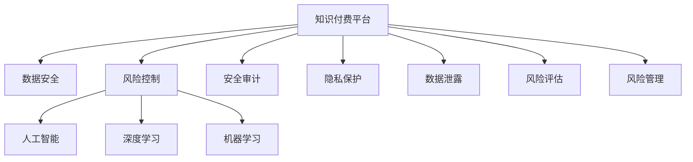

                 

# 知识付费平台的数据安全与风险控制

> 关键词：知识付费、数据安全、风险控制、人工智能、深度学习、机器学习、安全审计、隐私保护、数据泄露、风险评估

## 1. 背景介绍

### 1.1 问题由来
随着互联网技术的快速发展和普及，知识付费平台（如得到、喜马拉雅、得到大学等）迅速崛起，成为知识传播和商业化的一个重要形式。这些平台提供各种专业课程、电子书、听书等内容，用户可以通过付费订阅或购买的方式获取知识，从而满足自身学习和娱乐的需求。

然而，知识付费平台的数据安全与风险控制问题日益突出。平台上的数据涉及用户隐私、版权保护、交易安全等多个方面，一旦发生数据泄露或安全事故，将给平台带来巨大的损失。此外，知识付费平台涉及大量支付交易，如何防范支付欺诈、保障用户支付安全，也是平台建设过程中必须要解决的重要问题。

本文章将围绕知识付费平台的数据安全与风险控制问题，详细介绍核心概念和关键技术，通过理论和实践相结合的方式，为知识付费平台的安全和风险控制提供有力的支撑。

## 2. 核心概念与联系

### 2.1 核心概念概述

为了更好地理解知识付费平台的数据安全与风险控制问题，本节将介绍几个关键核心概念：

- **知识付费平台**：以提供知识内容的付费服务和产品为核心业务的在线平台。
- **数据安全**：在知识付费平台中，确保用户数据（如个人信息、支付信息、学习行为数据等）不被未授权访问、泄露、修改和破坏。
- **风险控制**：通过评估、监控、预测和响应等手段，降低或消除潜在的风险事件，保障知识付费平台的正常运营。
- **人工智能（AI）**：利用机器学习、深度学习等技术，提高知识付费平台的数据分析和决策能力。
- **深度学习（DL）**：一种特定的机器学习方法，通过神经网络等模型对大量数据进行学习，提取数据中的复杂特征和规律。
- **机器学习（ML）**：通过让机器从数据中学习规律，实现智能决策和问题解决。
- **安全审计**：通过系统化的检查、测试和评估，发现并修复知识付费平台的安全漏洞。
- **隐私保护**：在知识付费平台中，确保用户数据隐私权得到充分保护，避免未经授权的访问和使用。
- **数据泄露**：指未授权的人员非法获取知识付费平台的数据。
- **风险评估**：通过模型和工具对知识付费平台面临的风险进行评估，找出潜在的安全隐患和威胁。
- **风险管理**：通过一系列措施和机制，减少或转移知识付费平台的风险，保障业务连续性。

这些核心概念之间的关系可以通过以下Mermaid流程图来展示：



这个流程图展示了知识付费平台的数据安全与风险控制的关键概念及其之间的逻辑关系：

1. 知识付费平台的数据安全与风险控制是相辅相成的，保障数据安全是风险控制的前提。
2. 数据安全、风险控制、人工智能、深度学习、机器学习等概念都是实现数据安全与风险控制的重要手段。
3. 安全审计、隐私保护、数据泄露、风险评估、风险管理等是保障数据安全和风险控制的具体措施和手段。

## 3. 核心算法原理 & 具体操作步骤

### 3.1 算法原理概述

知识付费平台的数据安全与风险控制涉及到多个层面，包括技术层面的数据加密、安全审计，业务层面的风险评估和管理，以及法律和政策层面的隐私保护和合规性要求。其中，基于人工智能和深度学习的算法被广泛应用于数据分析、风险预测和识别等方面，为数据安全与风险控制提供了有力支撑。

基于人工智能和深度学习的风险控制算法，本质上是一种监督学习或无监督学习的过程。其核心思想是：通过大量标注数据（如安全事件、攻击行为、异常行为等），训练模型，识别潜在的安全威胁，并预测未来的风险事件。常见的算法包括：

- 监督学习算法：如逻辑回归、决策树、随机森林、支持向量机、神经网络等。
- 无监督学习算法：如聚类分析、异常检测、隐马尔可夫模型等。
- 半监督学习算法：结合标注数据和未标注数据进行训练，提高模型泛化能力。
- 强化学习算法：通过与环境交互，优化策略，提高风险管理的效率和效果。

这些算法在知识付费平台中的应用，主要包括以下几个关键环节：

1. **数据预处理**：对原始数据进行清洗、归一化、特征提取等处理，为模型训练做好准备。
2. **模型训练**：使用历史数据训练模型，使其具备识别潜在威胁和预测风险的能力。
3. **风险评估**：对新数据进行风险评估，识别可能的威胁和风险。
4. **安全响应**：根据风险评估结果，采取相应的安全措施，如阻止攻击、修复漏洞等。
5. **持续监控**：对知识付费平台进行持续监控，及时发现和应对新的威胁和风险。

### 3.2 算法步骤详解

以基于监督学习算法的风险控制为例，其核心步骤包括：

**Step 1: 数据收集与预处理**
- 从知识付费平台中收集各种数据，如用户行为数据、交易数据、访问日志等。
- 对数据进行清洗、归一化、特征提取等预处理，生成模型训练所需的输入特征。

**Step 2: 模型选择与训练**
- 根据具体需求选择合适的监督学习算法，如神经网络、随机森林等。
- 使用历史数据进行模型训练，调整模型参数，使其具备良好的泛化能力。
- 通过交叉验证等方法，评估模型的性能和稳定性。

**Step 3: 风险评估**
- 对新数据进行风险评估，输入模型进行预测，识别可能的威胁和风险。
- 根据预测结果，对知识付费平台进行风险分类，如高风险、中风险和低风险。

**Step 4: 安全响应**
- 对高风险的数据和行为进行拦截、阻止或修复，采取相应的安全措施。
- 记录风险事件，进行定期的安全审计，总结经验教训，不断优化安全策略。

**Step 5: 持续监控**
- 对知识付费平台进行持续监控，及时发现和应对新的威胁和风险。
- 根据监控结果，动态调整模型参数，优化风险评估模型。

### 3.3 算法优缺点

基于人工智能和深度学习的风险控制算法，具有以下优点：

1. 高效性：能够快速处理大量数据，及时识别潜在威胁和风险。
2. 自适应性：通过持续学习和优化，能够适应新的威胁和风险，提高模型的鲁棒性。
3. 自动化：自动进行数据处理、风险评估和安全响应，减少人力成本。

同时，这些算法也存在一些局限性：

1. 数据依赖：需要大量标注数据进行训练，数据不足可能导致模型性能下降。
2. 模型复杂：深度学习模型复杂，训练和推理计算成本较高。
3. 解释性差：模型的决策过程较为复杂，难以解释其内部工作机制。
4. 误报率：模型误报率较高，可能会误报正常行为为安全威胁。
5. 对抗攻击：深度学习模型容易受到对抗样本的攻击，可能被伪造的恶意数据欺骗。

### 3.4 算法应用领域

基于人工智能和深度学习的风险控制算法，已经广泛应用于多个领域，如金融、医疗、电商、物联网等。在知识付费平台中，这些算法主要应用于以下几个方面：

1. **用户行为分析**：通过分析用户的行为数据，识别异常行为，预防欺诈和恶意攻击。
2. **交易安全监控**：对交易数据进行分析，识别可疑交易行为，防止支付欺诈。
3. **内容审核**：对用户上传的内容进行审核，预防违法违规行为。
4. **异常检测**：通过异常检测算法，识别系统中的异常行为和攻击行为。
5. **风险预测**：对知识付费平台面临的风险进行预测和评估，提前采取防范措施。

## 4. 数学模型和公式 & 详细讲解 & 举例说明

### 4.1 数学模型构建

本节将使用数学语言对基于人工智能和深度学习的风险控制算法进行更加严格的刻画。

假设知识付费平台面临的风险事件为 $R$，包括用户行为数据 $X$、交易数据 $Y$、访问日志 $Z$ 等。设 $R = (R_1, R_2, ..., R_n)$，其中 $R_i$ 表示第 $i$ 个风险事件。风险事件的特征向量为 $x_i = (x_{i1}, x_{i2}, ..., x_{im})$，其中 $x_{ik}$ 表示第 $i$ 个风险事件的第 $k$ 个特征。

定义风险评估模型的输出为 $y_i$，表示第 $i$ 个风险事件的风险等级，$y_i \in [0, 1]$。其中，$y_i = 0$ 表示风险等级为低，$y_i = 1$ 表示风险等级为高。

风险评估模型的数学模型为：

$$
y_i = f(x_i; \theta)
$$

其中 $f$ 表示风险评估函数，$\theta$ 为模型参数。常见的风险评估函数包括逻辑回归、神经网络等。

### 4.2 公式推导过程

以逻辑回归模型为例，其公式推导如下：

假设风险评估模型为逻辑回归模型，输出为 $y_i$，特征向量为 $x_i$，模型参数为 $\theta$。则逻辑回归模型的数学表达式为：

$$
y_i = \frac{1}{1 + e^{-x_i \cdot \theta}}
$$

其中 $x_i \cdot \theta$ 为特征向量和模型参数的内积。

通过损失函数（如交叉熵损失函数），对模型进行训练，调整参数 $\theta$，使得模型输出 $y_i$ 与真实标签 $y_{true}$ 尽可能接近。训练的优化目标为：

$$
\min_{\theta} \frac{1}{N} \sum_{i=1}^N - y_{true} \log y_i - (1 - y_{true}) \log (1 - y_i)
$$

使用梯度下降等优化算法，更新模型参数 $\theta$，使得损失函数最小化。

### 4.3 案例分析与讲解

假设知识付费平台收集了大量的用户行为数据，包括用户登录次数、支付次数、下载次数等。通过逻辑回归模型，对数据进行训练，得到用户行为风险评估模型。

将新用户行为数据输入模型，计算其风险等级。例如，某用户某段时间内登录次数过多、支付次数频繁，但未下载任何课程，则其风险等级较高，需进一步监控和分析。

## 5. 项目实践：代码实例和详细解释说明

### 5.1 开发环境搭建

在进行风险控制项目实践前，我们需要准备好开发环境。以下是使用Python进行TensorFlow开发的环境配置流程：

1. 安装Anaconda：从官网下载并安装Anaconda，用于创建独立的Python环境。

2. 创建并激活虚拟环境：
```bash
conda create -n tf-env python=3.7 
conda activate tf-env
```

3. 安装TensorFlow：从官网获取对应的安装命令。例如：
```bash
pip install tensorflow
```

4. 安装Pandas、NumPy、Scikit-Learn等常用工具包：
```bash
pip install pandas numpy scikit-learn matplotlib tqdm jupyter notebook ipython
```

完成上述步骤后，即可在`tf-env`环境中开始项目开发。

### 5.2 源代码详细实现

这里我们以用户行为分析为例，给出使用TensorFlow进行风险评估的Python代码实现。

首先，定义风险评估的数据处理函数：

```python
import pandas as pd
from sklearn.model_selection import train_test_split
from sklearn.preprocessing import StandardScaler
import tensorflow as tf
from tensorflow.keras.models import Sequential
from tensorflow.keras.layers import Dense, Dropout

def preprocess_data(data):
    # 数据清洗、特征提取
    data = data.fillna(0)
    data = data.dropna()
    
    # 特征选择
    features = ['login_count', 'purchase_count', 'download_count']
    data = data[features]
    
    # 标准化处理
    scaler = StandardScaler()
    data = scaler.fit_transform(data)
    
    return data

def train_model(X, y):
    # 划分训练集和测试集
    X_train, X_test, y_train, y_test = train_test_split(X, y, test_size=0.2, random_state=42)
    
    # 定义模型
    model = Sequential([
        Dense(64, activation='relu', input_shape=(3,)),
        Dropout(0.5),
        Dense(1, activation='sigmoid')
    ])
    
    # 编译模型
    model.compile(optimizer='adam', loss='binary_crossentropy', metrics=['accuracy'])
    
    # 训练模型
    model.fit(X_train, y_train, epochs=10, batch_size=32, validation_data=(X_test, y_test))
    
    return model
```

然后，定义风险评估函数：

```python
def predict_risk(model, new_data):
    # 标准化新数据
    new_data = scaler.transform(new_data)
    
    # 预测风险等级
    y_pred = model.predict(new_data)
    
    return y_pred
```

最后，启动风险评估流程：

```python
# 加载数据
data = pd.read_csv('user_behavior_data.csv')

# 数据预处理
X = preprocess_data(data)

# 加载标签数据
y = data['risk_level']

# 训练模型
model = train_model(X, y)

# 预测风险等级
new_data = pd.read_csv('new_user_behavior_data.csv')
y_pred = predict_risk(model, new_data)

print(y_pred)
```

以上就是使用TensorFlow对用户行为进行风险评估的完整代码实现。可以看到，TensorFlow提供了一站式工具链，从数据预处理到模型训练，再到风险评估，能够快速构建并验证风险控制模型。

### 5.3 代码解读与分析

让我们再详细解读一下关键代码的实现细节：

**preprocess_data函数**：
- 对原始数据进行清洗，填充缺失值，删除缺失样本。
- 选择有用的特征，如用户登录次数、支付次数、下载次数等。
- 对特征进行标准化处理，使得数据在模型中具有相同的权重。

**train_model函数**：
- 将数据划分为训练集和测试集。
- 定义一个包含两个密集层和 Dropout 层的神经网络模型。
- 编译模型，使用二元交叉熵损失函数和 Adam 优化器进行训练。

**predict_risk函数**：
- 对新数据进行标准化处理。
- 使用训练好的模型对新数据进行预测，输出风险等级。

**风险评估流程**：
- 加载数据，进行数据预处理。
- 训练模型，对新数据进行风险评估。
- 输出预测结果。

可以看到，TensorFlow提供了一站式工具链，从数据预处理到模型训练，再到风险评估，能够快速构建并验证风险控制模型。

当然，工业级的系统实现还需考虑更多因素，如模型的保存和部署、超参数的自动搜索、更灵活的特征工程等。但核心的风险控制范式基本与此类似。

## 6. 实际应用场景

### 6.1 智能客服系统

在智能客服系统中，基于人工智能和深度学习的风险控制算法可以广泛应用于客户行为分析、风险识别和预测等方面。通过分析客户的通话记录、聊天记录等行为数据，可以识别出潜在的欺诈和恶意行为，及时采取相应措施，保障系统安全。

例如，某客服系统收到大量投诉电话，通过分析用户语音数据，识别出语音攻击和异常行为，自动封锁相关用户，防止欺诈行为扩散。此外，系统还可以通过异常检测算法，提前预警可能发生的大规模投诉事件，及时调整服务策略，保障系统稳定运行。

### 6.2 金融交易平台

在金融交易平台中，基于人工智能和深度学习的风险控制算法可以广泛应用于交易安全监控、风险评估和预测等方面。通过分析用户的交易行为数据，可以识别出潜在的欺诈行为和异常交易，及时采取相应措施，保障用户资金安全。

例如，某金融交易平台监控到用户的交易行为异常，通过分析其交易金额、频率和模式，识别出可能的信用卡盗刷行为，自动拦截交易，避免损失。此外，系统还可以通过风险评估模型，预测用户未来的交易行为，提前采取防范措施，保障平台安全。

### 6.3 电商购物平台

在电商购物平台中，基于人工智能和深度学习的风险控制算法可以广泛应用于用户行为分析、欺诈检测和风险预警等方面。通过分析用户的购物行为数据，可以识别出潜在的欺诈行为和异常交易，及时采取相应措施，保障用户资金安全。

例如，某电商购物平台监控到用户的购物行为异常，通过分析其购物金额、频率和模式，识别出可能的信用卡盗刷行为，自动拦截交易，避免损失。此外，系统还可以通过风险评估模型，预测用户未来的购物行为，提前采取防范措施，保障平台安全。

### 6.4 未来应用展望

随着人工智能和深度学习技术的不断进步，基于人工智能和深度学习的风险控制算法将得到更广泛的应用，为知识付费平台和其他在线应用提供更加精准、高效、安全的技术支撑。

未来，这些技术有望在以下方面取得更大的突破：

1. **数据融合与协同**：通过多源数据融合和协同分析，提升风险控制模型的准确性和鲁棒性。
2. **模型优化与自适应**：通过模型优化和自适应算法，提高风险控制模型的泛化能力和自适应能力，更好地应对新的威胁和风险。
3. **跨领域应用**：将风险控制技术应用于更多领域，如医疗、教育、交通等，提升各领域的风险管理水平。
4. **联邦学习**：通过联邦学习技术，保护用户数据隐私，实现跨平台的风险控制和协作。
5. **边缘计算**：通过边缘计算技术，提升风险控制系统的实时性和响应速度，保障系统稳定运行。

这些方向的探索发展，必将引领基于人工智能和深度学习的风险控制技术迈向更高的台阶，为构建安全、可靠、可解释、可控的智能系统铺平道路。面向未来，这些技术需要与其他人工智能技术进行更深入的融合，如知识表示、因果推理、强化学习等，多路径协同发力，共同推动人工智能技术的进步。

## 7. 工具和资源推荐

### 7.1 学习资源推荐

为了帮助开发者系统掌握人工智能和深度学习的风险控制技术，这里推荐一些优质的学习资源：

1. **《TensorFlow官方文档》**：提供丰富的API文档、教程和示例代码，是学习TensorFlow的必备资源。
2. **《深度学习》课程**：斯坦福大学提供的深度学习课程，涵盖了深度学习的基本概念和常用算法。
3. **《机器学习实战》书籍**：介绍了机器学习的基本概念和常用算法，结合Python代码实现，适合初学者学习。
4. **Kaggle竞赛平台**：提供大量的数据集和竞赛任务，通过实战练习，提升数据处理和模型训练能力。
5. **GitHub开源项目**：搜索相关开源项目，学习他人的实现思路和代码风格，提升代码编写能力。

通过对这些资源的学习实践，相信你一定能够快速掌握人工智能和深度学习的风险控制技术，并用于解决实际的问题。

### 7.2 开发工具推荐

高效的开发离不开优秀的工具支持。以下是几款用于人工智能和深度学习的风险控制开发的常用工具：

1. **TensorFlow**：由Google主导开发的开源深度学习框架，生产部署方便，适合大规模工程应用。
2. **PyTorch**：Facebook开发的深度学习框架，灵活性高，适合快速迭代研究。
3. **Scikit-Learn**：基于Python的机器学习库，提供丰富的机器学习算法和工具。
4. **Jupyter Notebook**：用于编写和执行Python代码的交互式环境，支持代码高亮和数据可视化。
5. **GitHub**：代码托管平台，提供版本控制和代码协作功能，方便项目管理。
6. **Anaconda**：开源科学计算环境，提供Python及其常用库的安装和管理，方便环境搭建。

合理利用这些工具，可以显著提升人工智能和深度学习的风险控制任务的开发效率，加快创新迭代的步伐。

### 7.3 相关论文推荐

人工智能和深度学习的风险控制技术源于学界的持续研究。以下是几篇奠基性的相关论文，推荐阅读：

1. **《深度学习理论与实践》**：提供了深度学习的基本理论和常用算法，适合初学者学习。
2. **《机器学习实战》**：介绍了机器学习的基本概念和常用算法，结合Python代码实现，适合初学者学习。
3. **《TensorFlow官方文档》**：提供丰富的API文档、教程和示例代码，是学习TensorFlow的必备资源。
4. **《机器学习实战》**：介绍了机器学习的基本概念和常用算法，结合Python代码实现，适合初学者学习。
5. **《深度学习》**：斯坦福大学提供的深度学习课程，涵盖了深度学习的基本概念和常用算法。

这些论文代表了大语言模型微调技术的发展脉络。通过学习这些前沿成果，可以帮助研究者把握学科前进方向，激发更多的创新灵感。

## 8. 总结：未来发展趋势与挑战

### 8.1 总结

本文对基于人工智能和深度学习的风险控制技术进行了全面系统的介绍。首先阐述了知识付费平台的数据安全与风险控制问题，明确了风险控制在保障平台安全和用户利益中的重要意义。其次，从原理到实践，详细讲解了风险控制算法的核心步骤和具体实现，提供了完整的代码示例。最后，本文还探讨了风险控制技术在未来应用中的广泛前景和面临的挑战。

通过本文的系统梳理，可以看到，基于人工智能和深度学习的风险控制技术在大数据时代具备广阔的应用前景，能够有效保障知识付费平台和其他在线应用的安全和稳定运行。未来，伴随技术的不断进步和优化，这些技术将进一步提升在线应用的风险管理水平，为构建更加安全、可靠、可解释、可控的智能系统提供坚实的基础。

### 8.2 未来发展趋势

展望未来，人工智能和深度学习的风险控制技术将呈现以下几个发展趋势：

1. **数据融合与协同**：通过多源数据融合和协同分析，提升风险控制模型的准确性和鲁棒性。
2. **模型优化与自适应**：通过模型优化和自适应算法，提高风险控制模型的泛化能力和自适应能力，更好地应对新的威胁和风险。
3. **跨领域应用**：将风险控制技术应用于更多领域，如医疗、教育、交通等，提升各领域的风险管理水平。
4. **联邦学习**：通过联邦学习技术，保护用户数据隐私，实现跨平台的风险控制和协作。
5. **边缘计算**：通过边缘计算技术，提升风险控制系统的实时性和响应速度，保障系统稳定运行。
6. **跨模态融合**：将图像、音频、文本等多模态数据进行融合，提升风险控制的准确性和鲁棒性。

这些趋势凸显了基于人工智能和深度学习的风险控制技术的广阔前景。这些方向的探索发展，必将进一步提升在线应用的风险管理水平，为构建安全、可靠、可解释、可控的智能系统铺平道路。

### 8.3 面临的挑战

尽管人工智能和深度学习的风险控制技术已经取得了瞩目成就，但在迈向更加智能化、普适化应用的过程中，它仍面临着诸多挑战：

1. **数据依赖**：需要大量标注数据进行训练，数据不足可能导致模型性能下降。
2. **模型复杂**：深度学习模型复杂，训练和推理计算成本较高。
3. **解释性差**：模型的决策过程较为复杂，难以解释其内部工作机制。
4. **误报率**：模型误报率较高，可能会误报正常行为为安全威胁。
5. **对抗攻击**：深度学习模型容易受到对抗样本的攻击，可能被伪造的恶意数据欺骗。
6. **数据隐私**：在保护用户隐私和数据隐私方面，如何平衡模型性能和安全需求，仍是一个重要挑战。

### 8.4 研究展望

面对人工智能和深度学习的风险控制技术所面临的种种挑战，未来的研究需要在以下几个方面寻求新的突破：

1. **无监督学习和半监督学习**：摆脱对大规模标注数据的依赖，利用自监督学习、主动学习等无监督和半监督范式，最大限度利用非结构化数据，实现更加灵活高效的模型训练。
2. **跨模态融合**：将图像、音频、文本等多模态数据进行融合，提升风险控制的准确性和鲁棒性。
3. **模型优化与自适应**：开发更加参数高效的微调方法，在固定大部分预训练参数的同时，只更新极少量的任务相关参数。同时优化模型的计算图，减少前向传播和反向传播的资源消耗，实现更加轻量级、实时性的部署。
4. **对抗攻击检测**：引入对抗样本检测技术，提高模型对抗攻击的能力，提升模型的安全性和鲁棒性。
5. **隐私保护与数据匿名化**：采用隐私保护技术，保护用户数据隐私，同时保留模型的性能和效果。

这些研究方向的探索，必将引领人工智能和深度学习的风险控制技术迈向更高的台阶，为构建安全、可靠、可解释、可控的智能系统铺平道路。面向未来，这些技术需要与其他人工智能技术进行更深入的融合，如知识表示、因果推理、强化学习等，多路径协同发力，共同推动人工智能技术的进步。

## 9. 附录：常见问题与解答

**Q1：人工智能和深度学习的风险控制技术是否适用于所有在线应用？**

A: 人工智能和深度学习的风险控制技术在大多数在线应用中都能取得不错的效果，特别是对于数据量较大的应用。但对于一些特定领域的在线应用，如医疗、金融等，仍需根据实际情况进行针对性的优化和调整。

**Q2：如何选择合适的模型和算法？**

A: 在选择模型和算法时，需要考虑以下几个因素：
1. 数据特点：选择适合处理特定类型数据的模型和算法。
2. 性能需求：根据实际需求选择性能较高的模型和算法。
3. 计算资源：考虑模型的计算复杂度和资源消耗。
4. 可解释性：选择易于解释和理解的模型和算法，便于系统维护和调试。
5. 对抗攻击：选择具有较强对抗攻击能力的模型和算法，提升模型的安全性和鲁棒性。

**Q3：如何评估和优化风险控制模型的性能？**

A: 评估和优化风险控制模型的性能，可以采用以下几个方法：
1. 数据集划分：将数据集划分为训练集、验证集和测试集，使用验证集评估模型性能，调整模型参数。
2. 交叉验证：使用交叉验证方法，避免模型过拟合，提升模型泛化能力。
3. 超参数调优：通过网格搜索、随机搜索等方法，寻找最优的超参数组合。
4. 集成学习：使用多个模型的预测结果进行集成，提升模型的准确性和鲁棒性。
5. 在线监控：对系统进行持续监控，及时发现和修复安全漏洞，提升系统安全性。

**Q4：如何保护用户数据隐私？**

A: 保护用户数据隐私，可以采用以下几个方法：
1. 数据匿名化：对用户数据进行匿名化处理，去除敏感信息。
2. 数据加密：对用户数据进行加密处理，防止数据泄露。
3. 访问控制：限制对敏感数据的访问权限，确保只有授权人员可以访问。
4. 审计和监控：对系统进行审计和监控，及时发现和修复安全漏洞。
5. 隐私保护算法：使用隐私保护算法，如差分隐私、联邦学习等，保护用户隐私。

**Q5：如何应对新的威胁和风险？**

A: 应对新的威胁和风险，可以采用以下几个方法：
1. 持续学习：通过持续学习，及时更新模型参数，适应新的威胁和风险。
2. 多模型融合：使用多个模型的预测结果进行融合，提升模型的鲁棒性和准确性。
3. 实时监控：对系统进行实时监控，及时发现和应对新的威胁和风险。
4. 跨领域合作：与行业内的其他企业合作，共享数据和资源，提升风险管理水平。

这些方法可以结合实际应用场景，灵活应用，保障系统的安全性和稳定性。

---

作者：禅与计算机程序设计艺术 / Zen and the Art of Computer Programming

