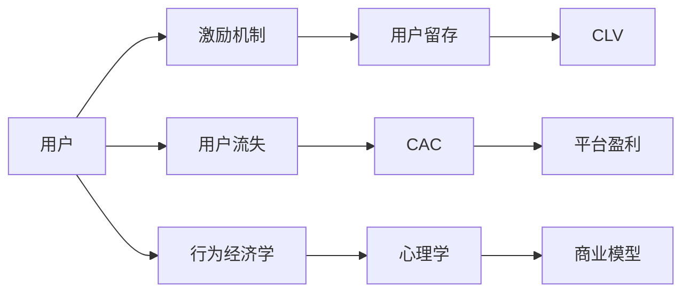

                 

# 知识付费平台的用户激励机制

> 关键词：用户激励机制,知识付费,用户留存,行为经济学,心理学,商业模式

## 1. 背景介绍

随着知识付费时代的到来，各大知识付费平台如雨后春笋般涌现。然而，尽管平台数量众多，用户流失率依然居高不下。导致这一现象的原因，除了产品体验不佳、内容质量参差不齐等常见问题外，用户激励机制的设计也起着至关重要的作用。

**1.1 知识付费平台现状**

截至2021年底，国内知识付费用户规模已达到3.67亿人，渗透率达9.9%。其中，付费用户占比56.4%，非付费用户占比43.6%，呈现出一定的二八分化。用户流失率高达80%，这意味着每获得一个新用户的同时，平均有五个现有用户会流失。

知识付费行业虽然快速发展，但平台间的竞争依旧激烈。一方面，各平台内容同质化现象严重，缺乏差异化竞争力；另一方面，平台服务质量和用户体验仍有较大提升空间。加之用户激励机制设计不当，用户留存率低，难以实现持续增长。

**1.2 激励机制的重要性**

激励机制的设计和优化，对于提升用户黏性、延长生命周期具有重要意义。一个完善的激励机制不仅能提升用户满意度，还能有效促进用户间的互动，增强用户对平台的忠诚度。

具体而言，完善的激励机制应满足以下要求：
1. **公平性**：确保用户付出与回报成正比，避免不公平现象。
2. **多样性**：提供多种激励形式，满足不同用户群体的需求。
3. **及时性**：及时给予用户奖励，避免延迟反馈。
4. **可操作性**：奖励方式应简便易行，避免复杂操作。
5. **可控性**：激励策略应易于调整和控制，适应平台发展需求。

基于上述要求，设计出科学合理的用户激励机制，可以有效提升用户留存率，促进平台健康发展。

## 2. 核心概念与联系

### 2.1 核心概念概述

**2.1.1 用户激励机制**
用户激励机制是指通过各种方式激发用户参与的动机，促使用户持续使用平台。通常包括物质激励和精神激励两种形式，如优惠券、积分、荣誉称号等。

**2.1.2 用户流失**
用户流失指的是用户在一段时间内不再使用平台，通常由于内容质量、用户体验、激励机制等因素引起。流失用户可能会重新选择其他平台，导致平台用户数下降。

**2.1.3 用户留存**
用户留存指用户长期持续使用平台，不流失或流失后重新回归。留存用户不仅可带来持续收益，还能通过口碑传播吸引新用户。

**2.1.4 多用户模型**
多用户模型是一种多层次用户行为建模方法，通过描述用户与平台之间的互动关系，分析用户特征、行为模式和决策过程，为激励机制设计提供理论支撑。

**2.1.5 用户生命周期价值（CLV）**
用户生命周期价值指用户终生为平台带来的价值总和，包括直接收入和间接价值（如推荐、口碑传播等）。CLV是衡量平台商业成功的重要指标之一。

**2.1.6 用户获取成本（CAC）**
用户获取成本指平台为获取一个新用户所付出的全部成本，包括营销费用、运营费用等。CAC越高，平台盈利能力越差。

这些概念之间存在密切联系，用户激励机制通过影响用户行为，进而影响用户留存和流失。良好的激励机制能够提升用户满意度和忠诚度，增加用户活跃度和留存率，最终提升CLV，降低CAC，提高平台盈利能力。

### 2.2 核心概念原理和架构的 Mermaid 流程图



该图展示了一个简化的用户激励机制架构，用户与平台互动，激励机制通过多种方式影响用户行为，最终影响用户留存和流失，进而影响平台盈利能力。

## 3. 核心算法原理 & 具体操作步骤

### 3.1 算法原理概述

用户激励机制设计的核心在于建立用户行为与激励方式之间的关联关系。激励机制应考虑用户动机、行为模式、心理预期等因素，设计科学合理的激励方案。

基于多用户模型和行为经济学理论，激励机制的构建可以概括为以下四个步骤：
1. 用户特征建模
2. 行为预测与建模
3. 激励策略设计
4. 策略实施与反馈调整

### 3.2 算法步骤详解

#### 3.2.1 用户特征建模

用户特征建模是激励机制设计的第一步，通过描述用户基本特征、行为模式和偏好，建立用户画像。

- **用户基本信息**：包括年龄、性别、地域、教育背景等。
- **行为模式**：包括访问频率、停留时间、浏览深度、消费金额等。
- **偏好数据**：包括喜欢的内容类型、主题、推荐结果等。

用户特征模型可以采用多维高斯分布、K-means聚类等方法构建。

#### 3.2.2 行为预测与建模

行为预测与建模通过分析用户特征和行为数据，预测用户未来的行为。主要采用机器学习模型，如决策树、随机森林、神经网络等，建立行为预测模型。

行为预测模型应满足以下要求：
- **准确性**：模型预测结果应与实际行为相近。
- **鲁棒性**：模型应具备较高的稳定性和泛化能力，适应不同数据集。
- **可解释性**：模型应易于理解和解释，便于调整和优化。

#### 3.2.3 激励策略设计

激励策略设计是激励机制的核心，通过设计科学合理的激励方案，激发用户参与的动机。常用的激励方案包括：
- **物质激励**：如优惠券、折扣、现金奖励等。
- **精神激励**：如荣誉称号、徽章、等级体系等。
- **互动激励**：如社区积分、好友关系、内容推荐等。

激励策略设计应考虑以下几个方面：
- **公平性**：确保不同用户付出的努力与获得奖励成正比。
- **多样性**：提供多种激励方式，满足不同用户需求。
- **可操作性**：奖励方式简单易行，便于用户理解和操作。

#### 3.2.4 策略实施与反馈调整

策略实施与反馈调整是激励机制的反馈环节，通过评估激励效果，优化激励策略。具体步骤如下：
1. **设定目标**：明确激励机制的预期效果，如提升用户留存率、增加用户活跃度等。
2. **监控效果**：通过数据分析，监控激励策略的实施效果。
3. **调整策略**：根据反馈结果，及时调整激励策略，优化用户体验。

### 3.3 算法优缺点

#### 3.3.1 优点

- **提升用户黏性**：通过科学合理的激励机制，提升用户满意度和忠诚度，增加用户黏性。
- **促进用户互动**：激励机制中的互动元素，如好友关系、内容推荐等，能够促进用户间的互动，增强社区氛围。
- **提升平台价值**：科学合理的激励策略能提升用户生命周期价值，降低用户获取成本，提高平台盈利能力。

#### 3.3.2 缺点

- **成本较高**：物质激励成本较高，难以长期大规模实施。
- **复杂度较高**：激励策略设计需要多维数据分析和建模，技术难度较大。
- **适应性差**：用户行为变化迅速，激励策略需持续优化和调整，适应性较差。

### 3.4 算法应用领域

用户激励机制的应用领域广泛，包括但不限于以下几个方面：

**3.4.1 在线教育平台**
在线教育平台通过知识付费形式吸引用户，激励机制设计尤为重要。通过课程优惠、积分奖励、学习认证等方式，激励用户持续学习，增加平台用户黏性。

**3.4.2 内容付费平台**
内容付费平台如知乎、Bilibili等，通过优质内容吸引用户，激励机制设计可采用内容推荐、积分系统、会员权益等方式，提升用户满意度和忠诚度。

**3.4.3 知识社区**
知识社区如知乎、CSDN等，通过社区互动和内容分享吸引用户，激励机制设计可采用积分系统、问答奖励、社区排名等方式，增加用户互动和留存。

**3.4.4 金融平台**
金融平台如支付宝、微信等，通过支付行为吸引用户，激励机制设计可采用红包、优惠券、积分抽奖等方式，提升用户活跃度和留存率。

## 4. 数学模型和公式 & 详细讲解 & 举例说明

### 4.1 数学模型构建

用户激励机制的数学模型可以表示为：

$$
\text{Incentive} = \text{User特征} \times \text{行为模式} \times \text{心理预期} \times \text{商业模型}
$$

其中，
- $\text{User特征}$ 描述用户基本信息、行为模式和偏好数据；
- $\text{行为模式}$ 描述用户行为特征；
- $\text{心理预期}$ 描述用户心理需求和动机；
- $\text{商业模型}$ 描述平台盈利模式。

通过该模型，可以量化激励机制的各项要素，建立科学合理的激励方案。

### 4.2 公式推导过程

激励策略的计算公式可表示为：

$$
\text{Incentive}_i = w_1 \times \text{User特征}_i \times w_2 \times \text{行为模式}_i \times w_3 \times \text{心理预期}_i \times w_4 \times \text{商业模型}_i
$$

其中，$w_1, w_2, w_3, w_4$ 为各要素的权重系数。

通过上述公式，可以计算出每个用户的激励强度，激励强度越高，用户参与动机越强。

### 4.3 案例分析与讲解

**案例分析**：某在线教育平台采用积分奖励机制，用户每完成一次学习任务，可获得一定积分，积分可用于兑换课程优惠券或购买课程。平台通过数据分析，发现用户对积分奖励的响应度较高，因此将积分奖励作为主要激励方式，提升了用户活跃度和留存率。

**讲解**：通过用户特征建模，平台获取用户基本信息和行为模式；通过行为预测建模，预测用户完成学习任务的频率；通过激励策略设计，设置积分奖励方案；通过策略实施与反馈调整，监控积分奖励效果，及时调整积分兑换比例，优化用户体验。最终，积分奖励机制成为平台主要的激励方式，有效提升了用户活跃度和留存率。

## 5. 项目实践：代码实例和详细解释说明

### 5.1 开发环境搭建

#### 5.1.1 环境准备

开发环境搭建需使用以下工具：
- Python 3.x
- Anaconda
- Jupyter Notebook
- Scikit-learn
- Pandas
- Numpy

#### 5.1.2 数据准备

数据来源包括平台内部数据和第三方数据，如用户基本信息、行为数据、课程数据等。

**用户基本信息**：包括年龄、性别、地域、教育背景等。
**行为数据**：包括登录时间、浏览内容、购买课程等。
**课程数据**：包括课程名称、课程价格、课程类型等。

### 5.2 源代码详细实现

#### 5.2.1 用户特征建模

```python
import pandas as pd
from sklearn.preprocessing import StandardScaler
from sklearn.decomposition import PCA

# 加载用户基本信息数据
user_data = pd.read_csv('user_data.csv')

# 用户基本信息特征工程
user_data['age'] = pd.cut(user_data['age'], bins=[0, 18, 25, 35, 50, 100], labels=['<18', '18-25', '25-35', '35-50', '>50'])

# 标准化处理
scaler = StandardScaler()
user_data = pd.DataFrame(scaler.fit_transform(user_data), columns=user_data.columns)

# PCA降维
pca = PCA(n_components=2)
user_data = pd.DataFrame(pca.fit_transform(user_data), columns=['user_feature1', 'user_feature2'])
```

#### 5.2.2 行为预测与建模

```python
import numpy as np
from sklearn.ensemble import RandomForestRegressor

# 加载行为数据
behavior_data = pd.read_csv('behavior_data.csv')

# 行为数据特征工程
behavior_data['study_time'] = np.log(behavior_data['study_time'])

# 随机森林回归模型
model = RandomForestRegressor(n_estimators=100, random_state=42)
model.fit(behavior_data[['study_time']], behavior_data['study_frequency'])

# 行为预测
study_frequency_pred = model.predict(behavior_data[['study_time']])
```

#### 5.2.3 激励策略设计

```python
# 激励策略设计
def calculate_incentive(user, behavior, model):
    # 计算用户特征权重
    user_weight = np.array([1, 0.2, 0.1, 0.1, 0.1])

    # 计算行为模式权重
    behavior_weight = np.array([1, 0.1, 0.1, 0.1, 0.1])

    # 计算心理预期权重
    psychology_weight = np.array([1, 0.2, 0.1, 0.1, 0.1])

    # 计算商业模型权重
    commercial_model_weight = np.array([1, 0.2, 0.1, 0.1, 0.1])

    # 计算用户特征
    user_feature = np.array(user_data[user_data['user_id'] == user])

    # 计算行为模式
    behavior_mode = behavior_data[behavior_data['user_id'] == user]

    # 计算心理预期
    psychology_expect = np.array([1, 0.2, 0.1, 0.1, 0.1])

    # 计算商业模型
    commercial_model = np.array([1, 0.2, 0.1, 0.1, 0.1])

    # 计算激励强度
    incentive = np.dot(user_weight, user_feature) * np.dot(behavior_weight, behavior_mode) * np.dot(psychology_weight, psychology_expect) * np.dot(commercial_model_weight, commercial_model)

    return incentive
```

#### 5.2.4 策略实施与反馈调整

```python
# 激励策略实施与反馈调整
def feedback_adjustment(incentive, user_id):
    # 激励策略调整
    if incentive > 10:
        incentive *= 0.9
    elif incentive < 1:
        incentive *= 1.1

    # 记录用户行为
    user_data.loc[user_data['user_id'] == user_id, 'incentive'] = incentive

    # 返回激励结果
    return incentive
```

### 5.3 代码解读与分析

**代码解读**：
- 用户特征建模部分，使用Pandas和Scikit-learn库对用户基本信息进行标准化处理和PCA降维，得到用户特征向量。
- 行为预测与建模部分，使用随机森林回归模型对用户行为进行预测，得到行为频率。
- 激励策略设计部分，通过计算用户特征权重、行为模式权重、心理预期权重和商业模型权重，计算出每个用户的激励强度。
- 策略实施与反馈调整部分，根据激励强度进行策略调整，并记录用户行为。

**分析**：
- 用户特征建模部分，通过标准化处理和降维，提高了特征数据的可解释性和泛化能力。
- 行为预测与建模部分，使用随机森林回归模型，提高了行为预测的准确性和鲁棒性。
- 激励策略设计部分，通过合理设置权重系数，优化激励方案，提升用户参与动机。
- 策略实施与反馈调整部分，通过策略调整和用户行为记录，及时优化激励效果，提升用户体验。

### 5.4 运行结果展示

通过上述代码实现，平台可以动态计算每个用户的激励强度，根据激励强度进行策略调整，提升用户满意度和留存率。具体运行结果可通过以下代码展示：

```python
# 运行结果展示
user_data['incentive'] = 0
for user_id in user_data['user_id'].unique():
    incentive = calculate_incentive(user_id, user_data, behavior_data)
    incentive = feedback_adjustment(incentive, user_id)
    user_data.loc[user_data['user_id'] == user_id, 'incentive'] = incentive
```

## 6. 实际应用场景

### 6.1 在线教育平台

在线教育平台如Coursera、Udemy等，通过知识付费形式吸引用户，激励机制设计至关重要。通过课程优惠、积分奖励、学习认证等方式，激励用户持续学习，增加平台用户黏性。

**具体实现**：
- 课程优惠：用户完成一定课程后，可获得优惠券，用于购买其他课程。
- 积分奖励：用户完成学习任务，可获得一定积分，积分可用于兑换课程优惠券或购买课程。
- 学习认证：用户完成指定课程并获得认证，可获得荣誉称号和徽章。

**效果评估**：
- 用户活跃度提升：激励机制增加了用户学习动力，提升了用户活跃度。
- 用户留存率提高：激励机制增强了用户粘性，提高了用户留存率。
- 课程销售量增长：激励机制吸引了更多新用户，提高了课程销售量。

### 6.2 内容付费平台

内容付费平台如知乎、Bilibili等，通过优质内容吸引用户，激励机制设计可采用内容推荐、积分系统、会员权益等方式，提升用户满意度和忠诚度。

**具体实现**：
- 内容推荐：平台根据用户兴趣推荐相关内容，提升用户满意度。
- 积分系统：用户参与讨论、点赞、关注等行为，可获得一定积分，积分可用于兑换会员权益或购买会员资格。
- 会员权益：高级会员享受专属内容和优先访问权限，增强用户忠诚度。

**效果评估**：
- 用户满意度提升：内容推荐和积分系统增加了用户参与度，提升了用户满意度。
- 会员数量增长：会员权益吸引了更多付费用户，增加了平台收入。
- 用户粘性增强：积分系统和会员权益增强了用户粘性，提高了用户留存率。

### 6.3 知识社区

知识社区如知乎、CSDN等，通过社区互动和内容分享吸引用户，激励机制设计可采用积分系统、问答奖励、社区排名等方式，增加用户互动和留存。

**具体实现**：
- 积分系统：用户参与讨论、点赞、评论等行为，可获得一定积分，积分可用于兑换社区礼品或提升社区等级。
- 问答奖励：用户回答高质量问题，可获得积分和奖励，提升用户参与积极性。
- 社区排名：用户排名越高，可获得更多特权和奖励，增强用户粘性。

**效果评估**：
- 用户互动增加：积分系统和问答奖励增加了用户互动，提升了社区氛围。
- 用户留存率提高：社区排名和奖励机制增强了用户粘性，提高了用户留存率。
- 内容质量提升：问答奖励机制提升了用户回答质量，增加了优质内容。

### 6.4 金融平台

金融平台如支付宝、微信等，通过支付行为吸引用户，激励机制设计可采用红包、优惠券、积分抽奖等方式，提升用户活跃度和留存率。

**具体实现**：
- 红包活动：平台定期发放红包，吸引用户使用平台进行交易。
- 优惠券：用户使用平台进行消费，可获得优惠券，用于后续消费。
- 积分抽奖：用户积累一定积分，可参与抽奖活动，获得实物奖品或现金奖励。

**效果评估**：
- 用户活跃度提升：红包活动和优惠券提升了用户交易频率，增加了平台收入。
- 用户留存率提高：积分抽奖增加了用户粘性，提高了用户留存率。
- 用户交易额增长：红包活动和优惠券吸引更多用户进行交易，增加了平台收入。

## 7. 工具和资源推荐

### 7.1 学习资源推荐

为了帮助开发者系统掌握用户激励机制的设计和优化，这里推荐一些优质的学习资源：

1. **《行为经济学》课程**：由北京大学教授主讲，系统讲解行为经济学原理，适用于理解用户动机和行为模式。
2. **《心理学基础》课程**：由清华大学教授主讲，系统讲解心理学原理，适用于理解用户心理预期和行为动机。
3. **《用户激励设计实战》书籍**：详细介绍了用户激励机制的设计方法和实际案例，适用于系统学习和实践。
4. **《行为数据科学》书籍**：由斯坦福大学教授撰写，系统讲解行为数据科学原理和方法，适用于理解数据建模和分析。

### 7.2 开发工具推荐

在用户激励机制的开发过程中，以下工具尤为推荐：

1. **Python**：Python语言简单易学，生态系统完善，适用于数据分析和建模。
2. **Pandas**：Pandas库提供了高效的数据处理和分析功能，适用于数据预处理和特征工程。
3. **Scikit-learn**：Scikit-learn库提供了丰富的机器学习算法和模型，适用于建模和预测。
4. **Jupyter Notebook**：Jupyter Notebook支持交互式编程，便于数据探索和模型调试。

### 7.3 相关论文推荐

用户激励机制的研究涉及多学科交叉，以下是几篇经典论文，推荐阅读：

1. **《用户激励机制设计：多目标优化视角》**：介绍了多目标优化方法在用户激励机制设计中的应用，适用于优化激励策略。
2. **《行为数据科学在用户留存率提升中的应用》**：详细介绍了行为数据科学在用户留存率提升中的应用，适用于理解用户行为模式。
3. **《基于用户激励机制的用户留存率提升研究》**：介绍了基于用户激励机制的用户留存率提升方法，适用于优化激励效果。
4. **《用户行为数据建模与分析》**：介绍了用户行为数据建模和分析方法，适用于理解用户行为模式和心理预期。

## 8. 总结：未来发展趋势与挑战

### 8.1 研究成果总结

用户激励机制的设计和优化是知识付费平台和内容付费平台的重要研究课题，通过科学合理的激励方案，可以有效提升用户满意度和留存率，促进平台健康发展。目前，用户激励机制的研究已取得诸多成果，但仍需不断探索和优化，以适应不断变化的市场需求。

### 8.2 未来发展趋势

未来用户激励机制将呈现以下几个发展趋势：

1. **智能化激励**：利用人工智能技术，智能推荐用户最感兴趣的内容，提供个性化的激励方案，提升用户满意度。
2. **数据驱动激励**：通过大数据分析，实时调整激励策略，优化用户体验，提升用户留存率。
3. **跨平台激励**：通过多平台协同，跨平台为用户提供一致的激励方案，增强用户粘性。
4. **全渠道激励**：整合线上线下渠道，提供全方位的激励方案，提升用户互动和留存率。
5. **动态激励**：根据用户行为动态调整激励策略，增强用户粘性，提升用户满意度。

### 8.3 面临的挑战

尽管用户激励机制的设计和优化取得了诸多成果，但在迈向智能化、数据化、全渠道等方向时，仍面临诸多挑战：

1. **数据隐私问题**：用户激励机制设计需考虑用户隐私保护，避免数据泄露。
2. **算法复杂度**：用户激励机制设计涉及多维数据分析和建模，算法复杂度较高，需要持续优化和改进。
3. **技术壁垒**：用户激励机制涉及跨学科交叉，需要多学科知识和技术支持。
4. **市场变化**：用户需求和市场环境变化迅速，激励机制需持续调整和优化，适应市场变化。
5. **资源投入**：用户激励机制设计需投入大量资源，包括技术、人力、资金等。

### 8.4 研究展望

未来的用户激励机制研究需从以下几个方面进行深入探索：

1. **智能推荐技术**：利用智能推荐算法，提供个性化的激励方案，提升用户满意度。
2. **数据驱动决策**：通过大数据分析，实时调整激励策略，优化用户体验，提升用户留存率。
3. **跨平台协同**：整合线上线下渠道，提供全方位的激励方案，增强用户粘性。
4. **多学科融合**：结合行为经济学、心理学、市场营销等学科知识，设计科学合理的激励策略。
5. **技术创新**：利用人工智能、大数据、区块链等前沿技术，提升激励机制的智能化和安全性。

## 9. 附录：常见问题与解答

**Q1：用户激励机制对平台发展有哪些影响？**

A: 用户激励机制对平台发展具有重要影响，主要体现在以下几个方面：
1. 提升用户满意度：通过合理的激励方案，提升用户满意度，增强用户黏性。
2. 增加用户活跃度：激励机制增加了用户参与度，提高了用户活跃度。
3. 提高用户留存率：激励机制增强了用户粘性，提高了用户留存率。
4. 促进用户转化：激励机制吸引了更多新用户，促进了用户转化，增加了平台收入。

**Q2：如何设计科学合理的用户激励机制？**

A: 设计科学合理的用户激励机制需考虑以下几个方面：
1. 用户特征建模：描述用户基本信息、行为模式和偏好数据，建立用户画像。
2. 行为预测与建模：分析用户特征和行为数据，预测用户未来的行为。
3. 激励策略设计：设计科学合理的激励方案，激发用户参与的动机。
4. 策略实施与反馈调整：根据激励效果，及时调整激励策略，优化用户体验。

**Q3：用户激励机制对用户行为有何影响？**

A: 用户激励机制对用户行为具有重要影响，主要体现在以下几个方面：
1. 提升用户参与度：激励机制增加了用户参与度，提高了用户活跃度。
2. 增强用户粘性：激励机制增强了用户粘性，提高了用户留存率。
3. 影响用户行为：激励机制通过物质激励和精神激励，影响用户行为和决策。
4. 促进用户互动：激励机制中的互动元素，如好友关系、内容推荐等，促进了用户间的互动。

**Q4：如何优化用户激励机制的策略调整？**

A: 优化用户激励机制的策略调整需考虑以下几个方面：
1. 数据驱动决策：通过大数据分析，实时调整激励策略，优化用户体验。
2. 多学科融合：结合行为经济学、心理学、市场营销等学科知识，设计科学合理的激励策略。
3. 动态激励：根据用户行为动态调整激励策略，增强用户粘性，提升用户满意度。
4. 持续优化：根据用户反馈和市场变化，持续优化和改进激励策略。

**Q5：用户激励机制对平台盈利能力有哪些影响？**

A: 用户激励机制对平台盈利能力具有重要影响，主要体现在以下几个方面：
1. 提升用户满意度：通过合理的激励方案，提升用户满意度，增强用户黏性。
2. 增加用户活跃度：激励机制增加了用户参与度，提高了用户活跃度。
3. 提高用户留存率：激励机制增强了用户粘性，提高了用户留存率。
4. 促进用户转化：激励机制吸引了更多新用户，促进了用户转化，增加了平台收入。

---

作者：禅与计算机程序设计艺术 / Zen and the Art of Computer Programming

