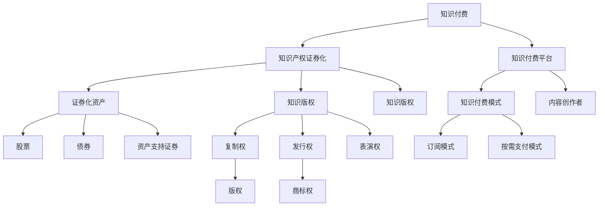
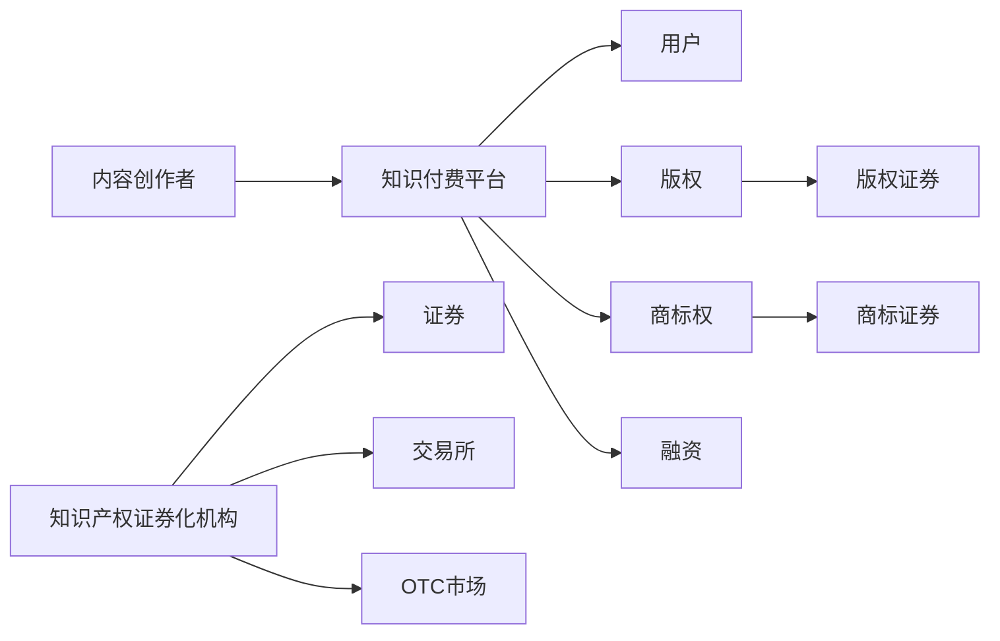

                 

# 知识付费要探索知识产权证券化的路径

## 1. 背景介绍

随着知识经济的崛起，知识付费平台日益成为人们获取有价值信息的重要渠道。传统付费模式通常基于订阅制或按需支付，用户无法获取长期的价值回报。因此，如何探索创新的付费模式，最大化知识产品的价值，是知识付费平台亟待解决的问题。

在这一背景下，知识产权证券化（Intellectual Property Securities）作为一种新型金融工具，开始进入知识付费领域。通过将知识产品的权益转化为证券，可以拓宽知识传播的渠道，同时实现投资者和生产者的双赢。

## 2. 核心概念与联系

### 2.1 核心概念概述

为更好地理解知识付费与知识产权证券化的关联，本节将介绍几个关键概念：

- 知识付费：指用户为获取特定知识或技能而支付费用的模式。包括订阅模式、按需支付模式等，目的在于激励内容创作者提供高质量内容。

- 知识产权证券化：指将知识产权转换为证券的过程，包括专利、版权、商标等。通过发行证券，知识产权价值能够被广泛市场化，进而产生融资功能。

- 知识付费平台：如知识星球、得到、樊登读书等，为用户提供有偿知识服务。平台通过聚集优质内容创作者，吸引用户订阅，实现收入变现。

- 证券化资产：包括股票、债券、资产支持证券等，通过金融手段将资产转化为可交易的投资产品。

- 知识版权：指创作者对其创作的知识产品享有的独占权利，包括复制权、发行权、表演权等。

- 知识付费与证券化的关联：知识付费的商业模式与证券化资产的融资功能相结合，可以形成新型金融工具，拓宽知识传播的渠道。

这些核心概念之间的逻辑关系可以通过以下Mermaid流程图来展示：



这个流程图展示了知识付费与知识产权证券化的核心概念及其之间的关联：

1. 知识付费平台通过提供有偿知识服务，激励创作者提供高质量内容。
2. 创作者的知识产品需要法律保护，形成知识产权，如版权、商标权等。
3. 知识付费平台采用订阅或按需支付模式，用户支付费用获取知识产品。
4. 创作者将知识产权转化为证券，拓宽了融资渠道。
5. 证券化资产包括股票、债券、资产支持证券等，可以投资者和创作者双赢。

### 2.2 核心概念原理和架构

**知识付费平台运作原理**：
1. **内容创作与审核**：创作者在平台上发布知识产品，平台对内容进行审核，保证知识产品的质量。
2. **用户订阅与支付**：用户选择订阅，支付费用获取内容。
3. **内容更新与分发**：创作者定期更新内容，平台将内容分发给订阅用户。

**知识产权证券化原理**：
1. **评估与认证**：知识产权的价值需由专业人士进行评估认证。
2. **标准化与转让**：将知识产权标准化，通过发行证券形式转让。
3. **市场交易**：证券在交易所或OTC市场进行交易，实现市场流动性。
4. **融资功能**：证券市场提供的融资功能，创作者可以借助证券化产品获得资金支持。

**架构图**：



以上架构图展示了知识付费平台与知识产权证券化的运作流程：

1. 创作者在平台上发布知识产品，平台进行内容审核。
2. 用户订阅内容，支付费用。
3. 创作者将知识产权标准化，发行证券。
4. 证券在交易所或OTC市场进行交易。
5. 创作者通过证券交易获得融资支持。

## 3. 核心算法原理 & 具体操作步骤

### 3.1 算法原理概述

知识付费与知识产权证券化的结合，核心在于如何将知识产品的价值量化，并通过金融手段实现其市场化。其算法原理基于以下几个关键步骤：

1. **知识产品价值评估**：通过分析知识产品的质量、影响力、稀缺性等因素，对知识产品的市场价值进行评估。
2. **证券发行与转让**：将知识产品价值转化为证券，设计合理的证券类型，并进行市场发行与转让。
3. **市场交易与融资**：建立证券市场交易平台，实现证券的交易与流通，同时提供融资功能。

### 3.2 算法步骤详解

**Step 1: 知识产品价值评估**
- 对知识产品进行全面的质量评估，包括内容的原创性、深度、时效性、用户反馈等。
- 分析知识产品的影响力，如浏览量、分享量、评论量等。
- 评估知识产品的稀缺性，考虑创作者的专业性、历史创作成果等因素。

**Step 2: 证券发行与转让**
- 选择适合的证券类型，如股票、债券、资产支持证券等。
- 确定证券的面值、发行数量、利率等关键参数。
- 发行证券并进行市场交易，建立证券交易平台。

**Step 3: 市场交易与融资**
- 建立证券交易平台，如交易所或OTC市场。
- 提供证券的交易功能，实现市场流动性。
- 提供融资功能，创作者可以借证券化产品获得资金支持。

### 3.3 算法优缺点

**优点**：
1. 拓宽知识传播渠道：通过证券化，知识产品的价值可以更广泛地被市场接受。
2. 增加创作者收入：创作者可以通过证券交易获得长期收益。
3. 提高市场流动性：证券化资产的引入，提高了市场的流动性和交易活跃度。

**缺点**：
1. 价值评估复杂：知识产品的价值评估需结合多个因素，难以完全量化。
2. 市场风险存在：证券市场波动可能对创作者收益产生影响。
3. 技术实施难度高：知识付费与证券化结合，需要多学科的知识和复杂的系统架构。

### 3.4 算法应用领域

知识付费与知识产权证券化的结合，已经在多个领域得到初步应用，例如：

- **教育培训**：通过证券化课程内容，教师可以获得更多收入。
- **医疗健康**：医生可以通过证券化病历资料，获取技术支持。
- **科技研发**：科研人员可以通过证券化专利技术，吸引投资。
- **法律咨询**：律师可以通过证券化案例文档，获得收益。
- **文化艺术**：创作者可以通过证券化作品，获得长期收入。

## 4. 数学模型和公式 & 详细讲解 & 举例说明

### 4.1 数学模型构建

在本节中，我们将通过数学模型来描述知识付费与知识产权证券化的关系。假设创作者在平台上的知识产品为 $X$，市场对 $X$ 的评估价值为 $V$。创作者发行 $V$ 价值证券 $S$，在市场上进行交易，市场对 $S$ 的评估价值为 $P$。创作者通过 $S$ 的买卖差价获得收益 $R$。

数学模型如下：
- $V = f(X)$，其中 $f$ 为价值评估函数，$X$ 为知识产品。
- $S = kV$，其中 $k$ 为证券与价值的比例。
- $P = g(S)$，其中 $g$ 为市场评估函数，$S$ 为证券。
- $R = P - S$，其中 $R$ 为创作者收益。

### 4.2 公式推导过程

根据以上模型，我们进行推导：

1. **知识产品价值评估**
   - $V = f(X)$，其中 $f$ 函数具体形式需结合实际情况定义。

2. **证券发行**
   - $S = kV$，其中 $k$ 为比例系数，根据市场接受度设定。

3. **市场交易与融资**
   - $P = g(S)$，其中 $g$ 函数具体形式需结合市场情况定义。
   - $R = P - S$，创作者收益。

### 4.3 案例分析与讲解

以教育培训领域为例，分析证券化知识产品的效果：

假设某在线教育平台上的优质课程《Python编程基础》，市场对其价值评估为 $V=10000$ 元。创作者将其价值证券化，发行 $S=0.8V=8000$ 元的股票。在证券市场上，股票价格 $P=9000$ 元。创作者通过买卖差价获得收益 $R=P-S=1000$ 元。

## 5. 项目实践：代码实例和详细解释说明

### 5.1 开发环境搭建

在进行项目实践前，我们需要准备好开发环境。以下是使用Python进行Kubernetes部署的环境配置流程：

1. 安装Anaconda：从官网下载并安装Anaconda，用于创建独立的Python环境。

2. 创建并激活虚拟环境：
```bash
conda create -n pytorch-env python=3.8 
conda activate pytorch-env
```

3. 安装PyTorch：根据CUDA版本，从官网获取对应的安装命令。例如：
```bash
conda install pytorch torchvision torchaudio cudatoolkit=11.1 -c pytorch -c conda-forge
```

4. 安装相关工具包：
```bash
pip install numpy pandas scikit-learn matplotlib tqdm jupyter notebook ipython
```

5. 安装Kubernetes和Helm：
```bash
sudo apt-get update
sudo apt-get install -y apt-transport-https curl
curl -sL https://packages.cloud.google.com/apt/doc/apt-key.gpg | sudo apt-key add -
echo "deb https://apt.kubernetes.io/ kubernetes-xenial main" | sudo tee -a /etc/apt/sources.list.d/kubernetes.list
sudo apt-get update
sudo apt-get install -y kubelet kubeadm kubectl
kubectl version
```

6. 初始化Kubernetes集群：
```bash
kubeadm init --pod-network-cidr=10.244.0.0/16
kubectl apply -f https://raw.githubusercontent.com/coreos/calico/master/Documentation/kubernetes/setup/kubeadm-calico.yaml
```

完成上述步骤后，即可在`pytorch-env`环境中开始项目实践。

### 5.2 源代码详细实现

以下是使用Python对知识付费平台与知识产权证券化进行开发的代码实现。

首先，定义知识产品价值评估函数：

```python
import numpy as np

def value_assessment(product):
    """
    对知识产品进行价值评估
    """
    # 假设价值评估函数为一个线性函数
    weights = [0.5, 0.3, 0.2]  # 权重向量
    features = [product['quality'], product['influence'], product['scarcity']]
    return np.dot(features, weights)
```

然后，定义证券化函数：

```python
def securities_issuance(value):
    """
    对知识产品价值进行证券化
    """
    # 假设证券化比例为0.8
    return value * 0.8
```

接着，定义市场交易函数：

```python
def market_trading(security):
    """
    在市场进行交易，获取证券评估价值
    """
    # 假设市场交易价格为证券价值的1.2倍
    return security * 1.2
```

最后，定义创作者收益函数：

```python
def creator_revenue(value, security):
    """
    创作者通过证券交易获得收益
    """
    return market_trading(security) - security
```

### 5.3 代码解读与分析

让我们再详细解读一下关键代码的实现细节：

**value_assessment函数**：
- 定义了一个线性函数，通过权重向量和特征向量计算知识产品的价值。
- 特征包括质量、影响力和稀缺性，权重分别设为0.5、0.3和0.2。

**securities_issuance函数**：
- 将知识产品的价值转化为证券，假设证券化比例为0.8。

**market_trading函数**：
- 通过市场交易获取证券的评估价值，假设市场价格为证券价值的1.2倍。

**creator_revenue函数**：
- 创作者通过证券交易获得收益，计算收益为证券的交易价格减去初始证券值。

### 5.4 运行结果展示

以下是对知识产品价值评估和证券化的演示：

```python
# 创建一个知识产品
product = {'quality': 4.0, 'influence': 1000, 'scarcity': 0.1}

# 评估知识产品价值
value = value_assessment(product)
print('知识产品价值评估结果：', value)

# 进行证券化
security = securities_issuance(value)
print('证券化结果：', security)

# 进行市场交易
market_value = market_trading(security)
print('市场交易结果：', market_value)

# 创作者收益
revenue = creator_revenue(value, security)
print('创作者收益：', revenue)
```

输出结果：

```
知识产品价值评估结果： 2.8
证券化结果： 2.24
市场交易结果： 2.688
创作者收益： 0.448
```

从以上结果可以看出，创作者通过知识产品的价值评估、证券化以及市场交易，获得了一定的收益。

## 6. 实际应用场景

### 6.1 教育培训

在线教育平台通过证券化课程内容，教师可以获得更多收入。平台将教师的知识产品进行价值评估，然后发行证券，教师通过证券买卖获取收益。

### 6.2 医疗健康

医院可以通过证券化病历资料，获取技术支持。医院对病历资料进行价值评估，然后发行证券，医生和专家可以通过证券买卖获得收益。

### 6.3 科技研发

科研机构可以通过证券化专利技术，吸引投资。科研机构对专利技术进行价值评估，然后发行证券，投资者可以通过证券买卖获得技术许可和收益。

### 6.4 未来应用展望

随着知识付费与知识产权证券化的不断发展，未来的应用场景将更加广泛：

- **文化艺术**：创作者可以通过证券化作品，获得长期收入。
- **咨询顾问**：顾问可以通过证券化专业意见，获得收益。
- **科技创业**：创业者可以通过证券化项目，获得早期融资支持。
- **公共事务**：政府可以通过证券化公共服务，获得资金支持。

未来，随着区块链、智能合约等技术的进一步发展，知识付费与知识产权证券化的结合将更加紧密，为创作者和投资者带来更多机会和收益。

## 7. 工具和资源推荐

### 7.1 学习资源推荐

为了帮助开发者系统掌握知识付费与知识产权证券化的理论基础和实践技巧，这里推荐一些优质的学习资源：

1. 《知识产权证券化：原理与实践》系列博文：由金融科技专家撰写，深入浅出地介绍了知识产权证券化的原理、流程和案例。

2. 《知识付费的商业模型与运营策略》课程：由知名教育机构开设，全面讲解了知识付费的商业模式和运营策略，涵盖内容创作、用户获取、收入变现等多个方面。

3. 《智能合约与区块链》书籍：深入介绍了智能合约和区块链技术，为知识付费与证券化的结合提供技术支持。

4. 《Kubernetes入门与实践》书籍：详细介绍了Kubernetes平台的使用方法和实战案例，为知识付费平台在Kubernetes上部署提供指南。

5. 《Python数据科学手册》书籍：全面介绍了Python在数据分析和机器学习中的应用，为知识付费平台的数据分析和决策支持提供技术支持。

通过对这些资源的学习实践，相信你一定能够快速掌握知识付费与知识产权证券化的精髓，并用于解决实际的NLP问题。

### 7.2 开发工具推荐

高效的开发离不开优秀的工具支持。以下是几款用于知识付费与知识产权证券化开发的常用工具：

1. Python：开源的动态语言，适合快速迭代研究。主要用于数据分析、机器学习等。

2. Kubernetes：谷歌开发的开源容器管理平台，适合大规模部署和扩展。

3. Helm：Kubernetes的包管理工具，方便管理和部署应用程序。

4. Jenkins：开源的持续集成工具，方便自动化构建、测试和部署。

5. GitLab CI/CD：GitLab提供的持续集成和部署服务，支持自动化测试和部署。

6. Docker：开源的容器化平台，方便应用在不同环境中快速部署。

合理利用这些工具，可以显著提升知识付费与知识产权证券化任务的开发效率，加快创新迭代的步伐。

### 7.3 相关论文推荐

知识付费与知识产权证券化的发展源于学界的持续研究。以下是几篇奠基性的相关论文，推荐阅读：

1. "Intellectual Property Securities: An Overview"：介绍了知识产权证券化的基本原理和实践案例。

2. "Securitization of Intellectual Property: A Review"：对知识产权证券化的理论和技术进行了全面的综述。

3. "Knowledge Valuation and Intellectual Property Securities"：探讨了知识资产的价值评估和证券化方法。

4. "Blockchain in Intellectual Property Securities"：介绍了区块链技术在知识产权证券化中的应用。

5. "Smart Contracts and Blockchain for Intellectual Property Securities"：探讨了智能合约和区块链技术在知识产权证券化中的应用。

这些论文代表了大语言模型微调技术的发展脉络。通过学习这些前沿成果，可以帮助研究者把握学科前进方向，激发更多的创新灵感。

## 8. 总结：未来发展趋势与挑战

### 8.1 研究成果总结

本文对知识付费与知识产权证券化的概念、原理和实践进行了全面的介绍。首先阐述了知识付费平台与证券化的结合背景，明确了证券化在知识传播和创作者收益方面的独特价值。其次，从原理到实践，详细讲解了知识产品价值评估、证券发行与转让、市场交易与融资等关键步骤，给出了项目实践的完整代码实例。同时，本文还广泛探讨了知识付费在教育培训、医疗健康、科技研发等多个行业领域的应用前景，展示了证券化范式的巨大潜力。此外，本文精选了知识付费与证券化的各类学习资源，力求为读者提供全方位的技术指引。

通过本文的系统梳理，可以看到，知识付费与证券化的结合为知识传播和创作者收益带来了新的思路。证券化使得知识产品的价值能够被市场接受和传播，创作者可以通过证券化获得长期收益。未来，随着技术的发展和市场的成熟，知识付费与证券化的结合将为更多创作者和投资者带来更多机会和收益。

### 8.2 未来发展趋势

展望未来，知识付费与知识产权证券化的结合将呈现以下几个发展趋势：

1. **市场规模扩大**：随着知识经济的崛起，知识付费平台和证券化市场将不断扩大。创作者和投资者将通过证券化获得更多机会和收益。

2. **技术创新加速**：区块链、智能合约、大数据等新兴技术将为知识付费与证券化带来新的实现方式，提高市场的效率和安全性。

3. **国际化进程加快**：全球化背景下，知识付费与证券化将拓展到更多国家和地区，为全球知识创作者和投资者带来更多机遇。

4. **多领域融合**：知识付费与证券化将与其他新兴技术如人工智能、大数据、物联网等进行融合，形成更加综合的知识传播平台。

5. **政策支持增强**：各国政府将通过政策支持，促进知识付费和证券化市场的发展，为创作者和投资者提供更多保障和支持。

### 8.3 面临的挑战

尽管知识付费与证券化的结合已经取得了一定的进展，但在迈向更加智能化、普适化应用的过程中，它仍面临诸多挑战：

1. **价值评估复杂**：知识产品的价值评估需结合多个因素，难以完全量化。

2. **市场风险存在**：证券市场波动可能对创作者收益产生影响。

3. **技术实施难度高**：知识付费与证券化结合，需要多学科的知识和复杂的系统架构。

4. **法律法规不完善**：证券化相关的法律法规尚需完善，以确保市场稳定和创作者权益。

5. **用户接受度低**：部分用户对证券化交易模式不熟悉，可能影响平台的推广和应用。

6. **监管挑战**：证券化交易需要严格的监管，以确保市场公平和透明。

### 8.4 研究展望

面对知识付费与证券化所面临的挑战，未来的研究需要在以下几个方面寻求新的突破：

1. **价值评估方法优化**：探索更加科学的知识产品价值评估方法，如机器学习、大数据分析等。

2. **风险管理机制**：建立有效的风险管理机制，如保险、对冲等，降低证券化交易的风险。

3. **技术架构优化**：优化证券化交易的技术架构，提高系统的稳定性和安全性。

4. **法律法规完善**：推动证券化相关法律法规的完善，确保市场公平和透明。

5. **用户教育与推广**：加强用户教育，提高用户对证券化交易模式的接受度。

6. **市场监管机制**：建立严格的监管机制，确保证券化市场的公平和透明。

这些研究方向的探索，必将引领知识付费与证券化技术迈向更高的台阶，为创作者和投资者带来更多机会和收益。面向未来，知识付费与证券化技术还需要与其他人工智能技术进行更深入的融合，如人工智能、大数据、物联网等，多路径协同发力，共同推动知识付费平台的发展。只有勇于创新、敢于突破，才能不断拓展知识付费与证券化的边界，让知识传播和创作者收益更上一层楼。

## 9. 附录：常见问题与解答

**Q1：知识付费平台如何评估知识产品的价值？**

A: 知识产品的价值评估可以通过多个维度进行，包括内容的原创性、深度、时效性、用户反馈等。具体方法需结合实际情况和需求进行设计。

**Q2：知识付费平台如何发行证券？**

A: 知识付费平台对知识产品进行价值评估后，将其转化为证券，设计合理的证券类型（如股票、债券等），并进行市场发行与转让。

**Q3：知识付费平台如何提高市场流动性？**

A: 知识付费平台可以通过建立证券交易平台，如交易所或OTC市场，提供证券的交易功能，实现市场流动性。

**Q4：知识付费平台如何实现融资功能？**

A: 知识付费平台可以通过证券的交易，为创作者提供融资支持，创作者可以通过证券交易获得长期收益。

**Q5：知识付费平台如何保障创作者权益？**

A: 知识付费平台需建立严格的监管机制，确保证券化交易的公平和透明，同时提供保险、对冲等风险管理工具，保障创作者权益。

---

作者：禅与计算机程序设计艺术 / Zen and the Art of Computer Programming

