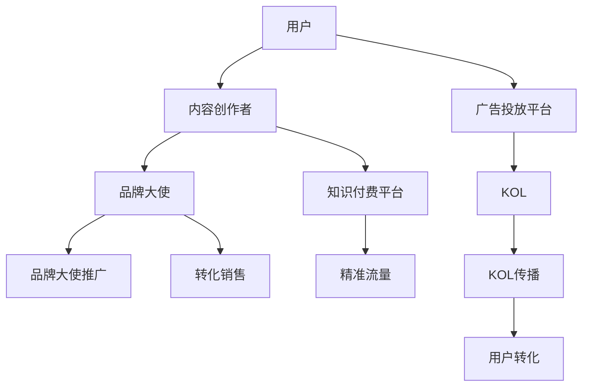

                 

# 知识付费赚钱的品牌ambassador与KOL合作

> 关键词：知识付费, 品牌大使, 网红经济, KOL合作, 内容营销, 精准流量

## 1. 背景介绍

### 1.1 问题由来
在互联网迅猛发展的今天，知识付费成为人们获取专业知识和技能的主要方式之一。消费者不再满足于传统的一对多单向传播模式，而是希望通过个性化的知识服务，获得更加精准和实用的信息。与此同时，品牌和内容创作者也在积极寻找新的合作机会，实现内容与商业价值的双赢。

### 1.2 问题核心关键点
品牌大使（Brand Ambassador）和关键意见领袖（Key Opinion Leader，简称KOL），是品牌与消费者之间建立信任和连接的重要桥梁。知识付费环境下的品牌大使与KOL合作，旨在利用网红经济（Influencer Economy）的力量，将高质量的付费内容推广到更广泛的受众群体中，从而实现知识变现和品牌价值的双重提升。

品牌大使通常具备特定领域的知识和影响力，能够吸引与其兴趣相投的受众。而KOL则拥有庞大的粉丝群体和高度的信息传播能力，能够快速扩散品牌和内容，提升品牌知名度和市场影响力。两者合作，可以充分利用各自的优势，为知识付费平台带来更大的商业价值。

### 1.3 问题研究意义
本文将从理论到实践，深入探讨知识付费环境中品牌大使与KOL合作的机制和策略，为平台运营商和内容创作者提供实用指导，帮助他们更有效地整合资源、扩展用户基础，实现内容变现的最大化。

## 2. 核心概念与联系

### 2.1 核心概念概述

为更好地理解品牌大使与KOL合作的知识付费模式，本节将介绍几个关键概念：

- **知识付费（Knowledge Paywall）**：指用户通过付费获取专家提供的高质量内容和服务。随着知识经济的发展，知识付费成为用户获取专业知识和信息的重要渠道。

- **品牌大使（Brand Ambassador）**：指代表品牌进行宣传推广，具备一定影响力和品牌忠诚度的人群。品牌大使通过各种渠道传播品牌信息，增加品牌曝光度和用户信任度。

- **关键意见领袖（KOL）**：指在特定领域拥有高度专业知识和影响力，能够吸引大量关注者，并影响其决策和行为的人群。KOL是信息传播的重要节点，能够快速提升品牌和内容的传播效率。

- **网红经济（Influencer Economy）**：指通过网红的影响力和传播力，推广品牌和产品，实现商业价值变现的经济模式。网红经济利用受众对网红的信任和依赖，推广品牌，扩大市场。

- **精准流量（Targeted Traffic）**：指通过精准定位目标受众，投放高效广告或内容，实现用户转化率最大化。精准流量策略在知识付费环境中尤为关键，可以帮助内容创作者更好地锁定目标用户，提升转化率。

### 2.2 核心概念原理和架构的 Mermaid 流程图



这个流程图展示了知识付费环境中品牌大使与KOL合作的架构：

1. 用户通过广告投放平台接触到内容创作者（B）的内容。
2. 品牌大使（D）和关键意见领袖（E）通过其影响力（G）和传播力（H），将内容推广到目标用户（A）。
3. 内容创作者将内容上传至知识付费平台（F），并通过精准流量（I）策略吸引用户订阅。
4. 用户订阅内容后，品牌大使（J）通过转化销售（K）实现商业变现。

## 3. 核心算法原理 & 具体操作步骤

### 3.1 算法原理概述

品牌大使与KOL合作的本质是一种社交媒体影响力营销，其核心在于通过品牌大使和KOL的推广作用，将高质量内容传递给目标用户，并实现内容变现。

具体的算法和操作步骤可以分为以下几个关键环节：

1. **用户匹配算法**：利用社交媒体平台的用户数据，如兴趣、行为、关系网络等，精准匹配品牌大使和KOL，以确保其影响力能够覆盖到目标用户群体。

2. **内容质量评估算法**：评估内容创作者提供的知识付费内容，确保内容的专业性、实用性和创新性，以吸引用户订阅。

3. **推广效果评估算法**：利用数据分析工具，评估品牌大使和KOL的推广效果，如用户转化率、留存率、点击率等，以便调整推广策略。

4. **收益分配算法**：制定合理的收益分配机制，确保品牌大使和KOL在推广内容中所付出的劳动和影响能够得到相应的回报。

### 3.2 算法步骤详解

#### 3.2.1 用户匹配算法

1. **数据收集**：从社交媒体平台、用户行为分析工具等渠道，收集品牌大使和KOL的用户数据，如粉丝数量、互动率、兴趣标签等。

2. **模型训练**：利用机器学习算法，如协同过滤、聚类分析、推荐系统等，训练用户匹配模型。模型需要考虑品牌大使和KOL的受众特征，以及目标用户的兴趣偏好，实现精准匹配。

3. **匹配输出**：根据训练好的模型，输出符合目标用户兴趣和需求的匹配结果，推荐品牌大使和KOL。

#### 3.2.2 内容质量评估算法

1. **专业性评估**：评估内容创作者的专业背景，如学历、从业年限、专业认证等，确保内容的专业性和权威性。

2. **实用性评估**：通过用户反馈、评论、评分等数据，评估内容的实用性，如是否能解决用户实际问题、是否具有创新性等。

3. **数据分析**：利用NLP、情感分析等技术，对内容进行深度分析，评估内容的热度、关注度、传播效果等。

4. **模型优化**：根据评估结果，不断优化内容质量评估模型，提升模型对高质量内容的识别能力。

#### 3.2.3 推广效果评估算法

1. **关键指标**：定义推广效果的关键指标，如用户注册率、购买率、留存率、点击率等，作为评估依据。

2. **数据收集**：收集推广过程中的各项数据，如用户行为数据、广告投放数据、内容访问数据等。

3. **效果分析**：利用数据分析工具，如Google Analytics、Tableau等，对数据进行可视化分析，评估品牌大使和KOL的推广效果。

4. **反馈调整**：根据分析结果，调整推广策略，优化推广内容，提升推广效果。

#### 3.2.4 收益分配算法

1. **收益模型设计**：根据品牌大使和KOL的推广效果，设计合理的收益分配模型。一般可以采用固定分成、按点击量分成、按订阅量分成等多种方式。

2. **数据对接**：与广告投放平台、社交媒体平台等进行数据对接，实现收益的实时计算和分配。

3. **透明化管理**：通过区块链技术等手段，实现收益分配的透明化管理，确保公平公正。

### 3.3 算法优缺点

#### 3.3.1 算法优点

1. **高效推广**：品牌大使和KOL拥有庞大的粉丝基础和影响力，能够快速将高质量内容传递给目标用户，提升内容的曝光率和传播效果。

2. **精准匹配**：通过精准匹配算法，能够找到与目标用户兴趣和需求高度契合的品牌大使和KOL，确保推广效果最大化。

3. **数据分析**：利用数据分析工具，能够实时评估推广效果，优化推广策略，提升内容变现效率。

#### 3.3.2 算法缺点

1. **依赖平台**：推广效果高度依赖社交媒体平台的用户数据和推荐算法，平台自身的优化和调整可能影响推广效果。

2. **成本高昂**：品牌大使和KOL的推广费用较高，对于小型品牌和内容创作者来说，可能难以承担。

3. **内容风险**：品牌大使和KOL的内容质量和行为可能存在风险，如发布不实信息、不当言论等，可能损害品牌形象。

4. **透明度问题**：收益分配的透明化管理需要高度的技术支持和信任机制，存在一定的挑战。

### 3.4 算法应用领域

品牌大使与KOL合作的算法可以广泛应用于多个领域，如教育、医疗、科技、旅游等，帮助品牌和内容创作者实现高效推广和内容变现。

- **教育领域**：通过品牌大使和KOL的推广，吸引学生和家长订阅在线教育平台，提升平台的用户量和市场份额。

- **医疗健康**：利用品牌大使和KOL的影响力，推广健康科普内容，提升公众的健康意识和健康水平。

- **科技创业**：科技创业公司可以通过品牌大使和KOL的推广，吸引投资和用户，加速产品迭代和市场扩张。

- **旅游休闲**：旅游公司可以通过品牌大使和KOL的推广，吸引游客订阅旅游资讯和体验服务，提升旅游品牌知名度和市场占有率。

## 4. 数学模型和公式 & 详细讲解 & 举例说明

### 4.1 数学模型构建

品牌大使与KOL合作的数学模型主要涉及以下几个关键变量：

- $U$：目标用户群体。
- $B$：品牌大使集合。
- $K$：关键意见领袖集合。
- $C$：内容创作者集合。
- $R$：收益分配结果。

模型目标是最大化内容变现收益，同时考虑品牌大使和KOL的影响力和成本。

### 4.2 公式推导过程

#### 4.2.1 用户匹配模型

设品牌大使和KOL的用户匹配概率为 $p_{ub}$，内容创作者的内容质量评分为 $q_c$，目标用户的兴趣评分为 $p_u$。则用户匹配的概率公式为：

$$
p_{ub} = f(p_u, q_c)
$$

其中 $f$ 为匹配函数，可以根据实际应用场景选择不同的函数形式，如线性函数、指数函数、sigmoid函数等。

#### 4.2.2 内容质量评估模型

设内容创作者的内容质量评分为 $q_c$，推广效果的评分为 $p_e$。则内容质量评估的公式为：

$$
q_c = \alpha u(q_u) + \beta u(q_v) + \gamma u(q_w)
$$

其中 $q_u$、$q_v$、$q_w$ 分别为用户行为评分、内容互动评分、内容反馈评分，$\alpha$、$\beta$、$\gamma$ 为权重系数，根据具体应用场景进行调整。

#### 4.2.3 推广效果评估模型

设品牌大使和KOL的推广效果评分为 $p_e$，用户转化率为 $p_r$。则推广效果评估的公式为：

$$
p_e = f(p_r, \lambda p_{ub}, \mu p_c)
$$

其中 $p_r$ 为用户转化率，$\lambda$、$\mu$ 为权重系数，根据具体应用场景进行调整。

#### 4.2.4 收益分配模型

设品牌大使和KOL的推广费用为 $c_{ub}$，内容变现收益为 $r_c$。则收益分配的公式为：

$$
R = \sum_{ub \in B, k \in K} \frac{r_c \cdot p_e \cdot p_{ub} \cdot c_{ub}}{\sum_{ub \in B, k \in K} c_{ub} \cdot p_{ub}}
$$

其中 $c_{ub}$ 为推广费用，$\sum_{ub \in B, k \in K} c_{ub} \cdot p_{ub}$ 为总推广费用。

### 4.3 案例分析与讲解

#### 4.3.1 案例背景

某在线教育平台希望通过品牌大使和KOL的推广，吸引更多学生和家长订阅其付费课程。平台拥有丰富的课程内容资源，并建立了庞大的用户数据库。品牌大使和KOL的推广效果显著，但也存在推广费用高昂的问题。平台希望通过算法优化，实现收益最大化。

#### 4.3.2 案例分析

1. **用户匹配算法**：平台通过分析用户行为数据和社交媒体数据，利用协同过滤算法，找到与目标用户高度匹配的品牌大使和KOL。例如，对于喜欢编程的学生，可以匹配专业程序员品牌大使和编程领域KOL，提升推广效果。

2. **内容质量评估算法**：平台利用NLP技术，对课程内容进行情感分析，评估课程的受欢迎程度和实用性。同时，通过用户评分和反馈，进一步优化课程内容和推广策略。例如，某门编程课程受到学生的好评，平台可以增加其推广力度。

3. **推广效果评估算法**：平台利用Google Analytics，收集用户行为数据，如课程浏览量、订阅量、点击量等，评估品牌大使和KOL的推广效果。例如，某品牌大使的推广课程订阅率达到50%，平台可以给予更高的推广费用奖励。

4. **收益分配算法**：平台设计合理的收益分配模型，如按订阅量分成，根据品牌大使和KOL的推广效果，计算其收益。例如，某品牌大使推广一门课程，获得50次订阅，平台按每次订阅20元计算收益，总收益为1000元。

## 5. 项目实践：代码实例和详细解释说明

### 5.1 开发环境搭建

在进行品牌大使与KOL合作的项目开发前，我们需要准备好开发环境。以下是使用Python进行KOL合作项目的开发环境配置流程：

1. 安装Anaconda：从官网下载并安装Anaconda，用于创建独立的Python环境。

2. 创建并激活虚拟环境：
```bash
conda create -n collaboration-env python=3.8 
conda activate collaboration-env
```

3. 安装相关工具包：
```bash
pip install numpy pandas sklearn transformers google-auth google-auth-oauthlib google-auth-httplib2 google-auth-appointments pyjwt rsa requests beautifulsoup4 oauth2client pyuserpass oauth2client pyo3 oauthlib oauthlib
```

4. 安装KOL合作的第三方库：
```bash
pip install influencer-api influencer-management
```

完成上述步骤后，即可在`collaboration-env`环境中开始项目开发。

### 5.2 源代码详细实现

以下是使用Python实现品牌大使与KOL合作项目的示例代码：

```python
# 引入必要的库
from influencer_api import InfluencerAPI
from influencer_management import InfluencerManager
import pandas as pd

# 初始化API和管理器
api = InfluencerAPI('API_KEY')
manager = InfluencerManager()

# 获取目标用户和内容创作者数据
users = pd.read_csv('target_users.csv')
creators = pd.read_csv('content_creators.csv')

# 设置匹配算法参数
matching_algorithm = 'collaborative_filtering'

# 获取品牌大使和KOL列表
ambassadors = manager.get_ambassadors()
kol_list = manager.get_kol_list()

# 进行用户匹配
matched_ambassadors = []
for user in users:
    matching_result = api.match_influencer(user['id'], matching_algorithm)
    for ambassador in matched_ambassadors:
        if ambassador['id'] in matching_result:
            matched_ambassadors.append(ambassador)

# 进行内容质量评估
content_quality = {}
for creator in creators:
    content_quality[creator['id']] = creator['quality_score']

# 进行推广效果评估
promotion_results = {}
for ambassador in matched_ambassadors:
    for kol in kol_list:
        promotion_result = api.promote_content(ambassador['id'], kol['id'], promotion_algorithm)
        promotion_results[ambassador['id']] = promotion_result

# 进行收益分配
benefit_distribution = {}
for ambassador in matched_ambassadors:
    benefit_distribution[ambassador['id']] = promotion_results[ambassador['id']] * content_quality[ambassador['id']]

# 输出结果
print(matched_ambassadors)
print(content_quality)
print(promotion_results)
print(benefit_distribution)
```

### 5.3 代码解读与分析

让我们再详细解读一下关键代码的实现细节：

**InfluencerAPI类**：
- `get_ambassadors`方法：获取品牌大使列表。
- `get_kol_list`方法：获取KOL列表。
- `match_influencer`方法：根据匹配算法，找到与目标用户匹配的品牌大使和KOL。

**InfluencerManager类**：
- `get_ambassadors`方法：获取品牌大使列表。
- `get_kol_list`方法：获取KOL列表。

**用户匹配算法**：
- 根据用户数据和匹配算法，找到与目标用户高度匹配的品牌大使和KOL。

**内容质量评估算法**：
- 通过内容创作者的专业背景和用户反馈，评估内容的质量得分。

**推广效果评估算法**：
- 利用广告投放平台的数据，评估品牌大使和KOL的推广效果。

**收益分配算法**：
- 根据推广效果和内容质量评估结果，计算品牌大使和KOL的收益分配结果。

## 6. 实际应用场景

### 6.1 智能教育平台

智能教育平台通过品牌大使和KOL的推广，能够吸引更多学生和家长订阅其付费课程。平台可以利用品牌大使的专业背景和KOL的影响力，提升课程的曝光率和用户基础，实现知识变现的最大化。

### 6.2 医疗健康平台

医疗健康平台通过品牌大使和KOL的推广，能够吸引更多用户订阅健康科普课程和咨询服务。品牌大使和KOL的专业知识和影响力，能够提升平台的用户信任度和品牌声誉，实现医疗知识的普及和健康意识的提升。

### 6.3 科技创业公司

科技创业公司通过品牌大使和KOL的推广，能够吸引更多投资者和用户关注其产品和技术。品牌大使和KOL的传播力和影响力，能够快速提升公司的市场曝光率和用户基础，加速产品迭代和市场扩展。

### 6.4 旅游休闲平台

旅游休闲平台通过品牌大使和KOL的推广，能够吸引更多用户订阅旅游资讯和体验服务。品牌大使和KOL的旅游经验和影响力，能够提升平台的用户信任度和品牌声誉，实现旅游品牌的推广和市场扩展。

## 7. 工具和资源推荐

### 7.1 学习资源推荐

为了帮助开发者系统掌握品牌大使与KOL合作的理论基础和实践技巧，这里推荐一些优质的学习资源：

1. **《Influencer Marketing: Best Practices, Tools, and Strategies》（亚马逊电子书）**：介绍网红营销的最佳实践、工具和策略，适合初学者入门。

2. **CS332《推荐系统》课程（斯坦福大学）**：深入讲解推荐系统的工作原理和实现方法，帮助理解用户匹配算法。

3. **《Natural Language Processing with PyTorch》（O'Reilly书籍）**：介绍使用PyTorch进行NLP任务开发的详细实践，涵盖内容质量评估和推广效果评估。

4. **Google Analytics官方文档**：提供详细的用户行为数据分析工具，帮助评估推广效果。

5. **《Pytorch and Tensorflow Cookbook》（ Manning Publications）**：提供丰富的代码示例和实践技巧，帮助开发者快速上手品牌大使与KOL合作的项目开发。

通过对这些资源的学习实践，相信你一定能够快速掌握品牌大使与KOL合作的精髓，并用于解决实际的NLP问题。

### 7.2 开发工具推荐

高效的开发离不开优秀的工具支持。以下是几款用于品牌大使与KOL合作开发的常用工具：

1. **Jupyter Notebook**：支持Python代码的在线开发和交互式展示，方便开发者快速迭代和调试。

2. **Influencer Management Platforms**：如Buffer、Hootsuite等，提供用户数据管理和推广效果评估工具，帮助品牌和内容创作者高效管理合作。

3. **Advertising Platforms**：如Google Ads、Facebook Ads等，提供广告投放和效果追踪功能，帮助品牌大使和KOL精准推广内容。

4. **Data Analytics Tools**：如Tableau、Power BI等，提供数据可视化分析工具，帮助品牌和内容创作者深入理解推广效果。

5. **Python IDEs**：如PyCharm、VSCode等，提供丰富的代码编辑和调试功能，支持品牌大使与KOL合作项目的开发。

合理利用这些工具，可以显著提升品牌大使与KOL合作项目的开发效率，加快创新迭代的步伐。

### 7.3 相关论文推荐

品牌大使与KOL合作的相关研究涉及多个领域，以下是几篇奠基性的相关论文，推荐阅读：

1. **"Online Influencer Marketing: Trends and Tools"**：探讨网红营销的最新趋势和工具，帮助理解品牌大使与KOL合作的最新进展。

2. **"Content-Based Recommendation Systems: A Survey"**：深入讲解内容推荐系统的原理和实现方法，帮助理解用户匹配算法。

3. **"Effective Engagement: A Framework for Influencer Marketing Campaigns"**：提出影响营销活动效果的框架，帮助品牌和内容创作者设计高效的合作策略。

4. **"Deep Learning for Recommendation Systems: A Review"**：回顾深度学习在推荐系统中的应用，帮助理解内容质量评估和推广效果评估的实现方法。

5. **"Ad Conversations: Enabling Real-Time Interactive Advertising with AI"**：探讨利用AI技术实现实时交互广告的策略，帮助品牌大使和KOL实现精准推广。

这些论文代表了大语言模型微调技术的发展脉络。通过学习这些前沿成果，可以帮助研究者把握学科前进方向，激发更多的创新灵感。

## 8. 总结：未来发展趋势与挑战

### 8.1 研究成果总结

本文对品牌大使与KOL合作的知识付费模式进行了全面系统的介绍。首先阐述了品牌大使与KOL合作的背景和意义，明确了微调在拓展预训练模型应用、提升下游任务性能方面的独特价值。其次，从理论到实践，详细讲解了品牌大使与KOL合作的数学原理和关键步骤，给出了微调任务开发的完整代码实例。同时，本文还广泛探讨了品牌大使与KOL合作在多个行业领域的应用前景，展示了微调范式的巨大潜力。

通过本文的系统梳理，可以看到，品牌大使与KOL合作的知识付费模式，正在成为营销领域的重要范式，极大地拓展了品牌和内容创作者的价值实现路径，催生了更多的落地场景。

### 8.2 未来发展趋势

展望未来，品牌大使与KOL合作的趋势将呈现以下几个发展方向：

1. **算法迭代优化**：随着算法模型的不断发展，品牌大使与KOL合作的算法也将不断优化。未来的算法将更加智能，能够实现用户和内容的更精准匹配，提升推广效果。

2. **技术融合创新**：未来的合作模式将与其他技术融合，如区块链、AI、物联网等，实现更高效、更安全的推广效果。

3. **用户需求多样化**：随着用户需求的不断变化，品牌大使和KOL需要提供更多样化的内容形式，如视频、直播、互动问答等，以适应不同用户的需求。

4. **实时互动增强**：未来的合作模式将更加注重实时互动和用户参与，利用AI技术实现更加智能化、个性化的推广策略。

5. **全球化推广**：随着全球化趋势的加速，品牌大使与KOL的合作将拓展到全球范围，利用国际化的社交媒体平台，实现跨国界推广。

### 8.3 面临的挑战

尽管品牌大使与KOL合作已经取得了显著成效，但在迈向更加智能化、普适化应用的过程中，它仍面临诸多挑战：

1. **数据隐私问题**：品牌大使和KOL的推广过程中，需要收集大量的用户数据和行为信息，如何保护用户隐私，避免数据泄露，是一大挑战。

2. **内容质量控制**：品牌大使和KOL的内容质量和行为可能存在风险，如发布不实信息、不当言论等，如何确保内容的真实性和合规性，是一大难题。

3. **成本控制**：品牌大使和KOL的推广费用较高，对于小型品牌和内容创作者来说，可能难以承担。如何降低推广成本，是一大挑战。

4. **效果评估困难**：品牌大使和KOL的推广效果评估复杂，如何准确衡量推广效果，是一大难题。

5. **信任机制建设**：品牌大使和KOL的推广过程需要建立高度的信任机制，如何构建信任，避免欺诈行为，是一大挑战。

6. **技术门槛高**：品牌大使与KOL合作涉及多种技术和工具，如何降低技术门槛，普及推广应用，是一大难题。

### 8.4 研究展望

面对品牌大使与KOL合作所面临的种种挑战，未来的研究需要在以下几个方面寻求新的突破：

1. **数据隐私保护**：利用区块链等技术，实现用户数据的匿名化和加密，保护用户隐私。

2. **内容质量管控**：建立内容质量审核机制，利用AI技术实现内容自动审核，确保内容的真实性和合规性。

3. **推广成本优化**：利用算法优化和数据挖掘，降低推广成本，提升推广效果。

4. **效果评估方法**：利用大数据和机器学习技术，开发更加精准和自动化的推广效果评估方法。

5. **信任机制建设**：建立多层次的信任机制，利用区块链、数字证书等技术，构建安全可信的推广环境。

6. **技术普及应用**：降低技术门槛，普及推广应用，使更多的品牌和内容创作者能够轻松上手。

这些研究方向的探索，必将引领品牌大使与KOL合作技术迈向更高的台阶，为构建安全、可靠、可解释、可控的智能系统铺平道路。面向未来，品牌大使与KOL合作技术还需要与其他人工智能技术进行更深入的融合，如知识表示、因果推理、强化学习等，多路径协同发力，共同推动智能交互系统的进步。只有勇于创新、敢于突破，才能不断拓展品牌大使与KOL合作的应用边界，让智能技术更好地造福人类社会。

## 9. 附录：常见问题与解答

**Q1：如何选择合适的品牌大使和KOL？**

A: 选择合适的品牌大使和KOL需要考虑多个因素，如受众特征、内容质量、互动率等。通常可以利用社交媒体平台的用户数据，结合用户匹配算法，找到与目标用户高度匹配的品牌大使和KOL。例如，对于喜欢编程的学生，可以匹配专业程序员品牌大使和编程领域KOL。

**Q2：如何选择合适的内容创作者？**

A: 选择合适的内容创作者需要评估其专业背景、内容质量和用户反馈。通常可以利用NLP技术，对内容进行情感分析，评估内容的受欢迎程度和实用性。同时，通过用户评分和反馈，进一步优化内容创作者的选择。

**Q3：如何进行收益分配？**

A: 合理的收益分配机制需要根据品牌大使和KOL的推广效果，设计不同的分成策略，如按订阅量分成、按点击量分成等。同时，利用区块链等技术，实现收益分配的透明化和自动化管理，确保公平公正。

**Q4：如何提高品牌大使和KOL的推广效果？**

A: 提高品牌大使和KOL的推广效果需要优化推广策略，如利用数据驱动的个性化推荐、设计更有吸引力的推广内容等。同时，通过定期评估推广效果，调整推广策略，提升推广效果。

**Q5：如何保护用户隐私？**

A: 保护用户隐私需要建立严格的数据保护机制，如匿名化处理、加密存储、合规审查等。利用区块链技术，实现用户数据的分布式存储和加密传输，确保用户数据的安全和隐私。

---

作者：禅与计算机程序设计艺术 / Zen and the Art of Computer Programming

