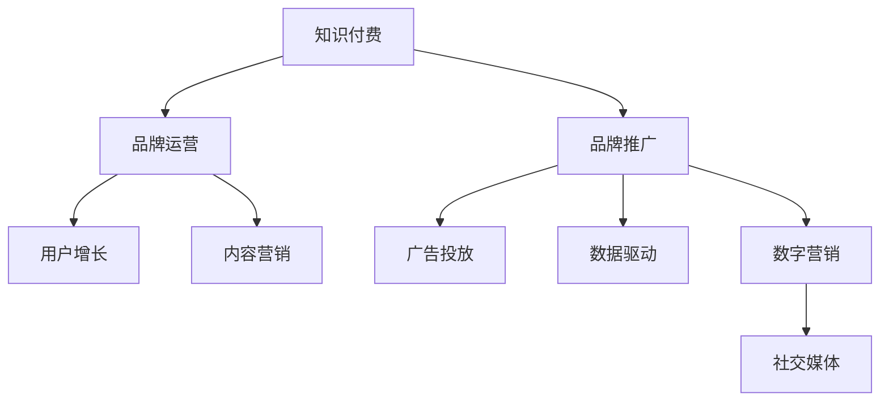

                 

# 知识付费赚钱的品牌品牌运营与品牌推广策略

> 关键词：知识付费, 品牌运营, 品牌推广, 用户增长, 内容营销, 广告投放, 数据驱动, 数字营销, 社交媒体

## 1. 背景介绍

### 1.1 问题由来
随着互联网和移动互联网的快速发展，知识付费市场逐渐兴起，吸引了越来越多的用户和商家。根据艾瑞咨询的数据，2020年我国知识付费市场规模达到318亿元，用户规模达到4.9亿，预计到2023年将达到628亿元。知识付费已经成为互联网经济中不可或缺的一部分，成为很多企业和个人的重要收入来源。

### 1.2 问题核心关键点
知识付费领域的一个核心问题是品牌运营与品牌推广。一个成功的知识付费品牌不仅要有优质的内容，还需要有强大的品牌运营和推广能力，才能吸引更多的用户，实现稳定的收入增长。品牌运营与推广的关键在于建立品牌认知，增强用户粘性，提升品牌价值，最终实现知识付费业务的可持续增长。

### 1.3 问题研究意义
研究知识付费品牌的品牌运营与品牌推广策略，对提升品牌知名度，扩大用户规模，提升用户忠诚度和付费转化率具有重要意义。掌握科学的品牌运营与推广方法，可以有效降低营销成本，提升品牌形象，加速知识付费业务的成长，为品牌带来更大的商业价值。

## 2. 核心概念与联系

### 2.1 核心概念概述

为更好地理解知识付费品牌的品牌运营与品牌推广方法，本节将介绍几个密切相关的核心概念：

- **知识付费(Knowledge Paywall)**：用户付费获取知识和信息的服务模式，涵盖在线课程、电子书、音频、视频等多种形式。
- **品牌运营(Brand Operations)**：品牌在日常经营活动中，通过一系列策略、方法、工具和资源，实现品牌的价值传递、形象塑造和用户互动等。
- **品牌推广(Brand Promotion)**：通过各种渠道和手段，推广品牌的理念、产品和服务，提升品牌的市场认知和用户认可度。
- **用户增长(User Acquisition)**：通过各种营销手段，获取更多的潜在用户，提升品牌的影响力和市场份额。
- **内容营销(Content Marketing)**：通过内容创造与传播，吸引用户，建立品牌认知，提升品牌价值。
- **广告投放(Advertising Placement)**：在各种媒介平台上投放广告，扩大品牌曝光度，提升用户转化率。
- **数据驱动(Data-Driven)**：利用数据分析工具和技术，优化品牌运营和推广策略，提升运营效率。
- **数字营销(Digital Marketing)**：利用互联网和数字技术手段，实现品牌信息的传播和推广。
- **社交媒体(Social Media)**：通过社交平台，进行品牌宣传、用户互动和内容传播。

这些核心概念之间的逻辑关系可以通过以下Mermaid流程图来展示：



这个流程图展示知识付费品牌的核心概念及其之间的关系：

1. 知识付费通过提供高质量的内容，吸引用户进行付费。
2. 品牌运营通过一系列策略，提升品牌形象，增强用户粘性。
3. 品牌推广通过各种手段，提升品牌知名度和用户认可度。
4. 用户增长通过营销策略，获取更多的潜在用户。
5. 内容营销通过内容创造与传播，吸引用户，提升品牌价值。
6. 广告投放通过投放广告，扩大品牌曝光度，提升用户转化率。
7. 数据驱动通过数据分析，优化运营和推广策略，提升效率。
8. 数字营销通过互联网手段，实现品牌信息的传播和推广。
9. 社交媒体通过社交平台，进行品牌宣传和用户互动。

这些概念共同构成了知识付费品牌运营和推广的框架，使其能够更好地吸引用户，实现商业价值。通过理解这些核心概念，我们可以更好地把握知识付费品牌运营和推广的精髓。

## 3. 核心算法原理 & 具体操作步骤
### 3.1 算法原理概述

知识付费品牌的品牌运营与品牌推广，本质上是一个多维度的品牌价值传递和市场扩展过程。其核心思想是：通过精心设计的运营和推广策略，建立品牌认知，增强用户粘性，提升品牌价值，最终实现用户规模和收入的增长。

形式化地，假设品牌价值为 $V$，市场认知度为 $C$，用户粘性为 $S$，运营成本为 $O$。品牌运营与推广的目标是最大化品牌价值 $V$，即：

$$
\max_{O} V = C \cdot S - O
$$

其中 $C$ 和 $S$ 是品牌运营策略和推广策略的函数，$O$ 是运营成本。通过优化 $C$ 和 $S$，在固定运营成本 $O$ 的情况下，最大化品牌价值 $V$。

### 3.2 算法步骤详解

知识付费品牌的品牌运营与品牌推广一般包括以下几个关键步骤：

**Step 1: 准备品牌基础资料**
- 收集品牌相关的背景资料，包括品牌定位、使命和愿景、核心价值观等。
- 梳理品牌历史和产品线，明确品牌的独特卖点和竞争优势。
- 确定目标市场和目标用户，进行市场细分和用户画像分析。

**Step 2: 设计品牌运营策略**
- 制定品牌营销策略，包括品牌定位、品牌传播、品牌形象设计等。
- 设计品牌推广渠道，如社交媒体、搜索引擎、视频平台、内容社区等。
- 确定用户获取策略，如SEO优化、内容营销、社交媒体广告等。
- 制定用户互动策略，如用户反馈、社群运营、用户满意度调查等。

**Step 3: 实施品牌推广策略**
- 在目标平台上进行品牌广告投放，提高品牌曝光度。
- 在社交媒体上进行品牌推广，建立品牌社交资产。
- 通过内容营销，发布高质量的博客、文章、视频等，吸引用户关注。
- 举办线上线下活动，提升品牌互动性和用户粘性。

**Step 4: 监测和优化**
- 通过数据分析工具，监测品牌运营和推广效果。
- 根据数据反馈，调整和优化品牌运营和推广策略。
- 定期评估品牌价值和用户粘性，根据市场变化进行调整。

**Step 5: 反馈和迭代**
- 根据用户反馈和市场变化，持续改进品牌运营和推广策略。
- 不断优化产品和服务，提升用户体验和满意度。
- 保持品牌运营和推广策略的持续更新和迭代，确保品牌活力。

以上是知识付费品牌的品牌运营与品牌推广的一般流程。在实际应用中，还需要针对具体品牌和市场环境，对运营和推广的各个环节进行优化设计，如改进品牌形象设计，选择合适的推广渠道，搜索优化策略等，以进一步提升品牌推广效果。

### 3.3 算法优缺点

知识付费品牌的品牌运营与品牌推广方法具有以下优点：
1. 提升品牌知名度。通过各种渠道和手段，品牌能够快速提升市场认知度，扩大品牌影响力。
2. 增强用户粘性。通过建立品牌社交资产，提升用户互动性和满意度，增强用户忠诚度。
3. 提升品牌价值。通过优化运营和推广策略，提升品牌价值，实现商业价值增长。
4. 数据驱动优化。通过数据分析工具，优化运营和推广策略，提升效率和效果。
5. 成本可控。通过精细化的运营策略，控制运营成本，提升品牌投资回报率。

同时，该方法也存在一定的局限性：
1. 市场变化快。知识付费市场竞争激烈，品牌需要不断调整和优化运营策略，以应对市场变化。
2. 品牌形象风险。品牌形象一旦受损，可能需要较长时间恢复，影响品牌价值。
3. 用户需求多样。不同用户对品牌的需求各异，品牌需要精准定位，才能满足大部分用户需求。
4. 用户付费意愿不稳定。用户付费意愿受多种因素影响，品牌需要通过多种手段提升用户粘性。
5. 数据隐私问题。品牌推广中涉及大量用户数据，需要严格遵守数据隐私保护法规，避免数据泄露风险。

尽管存在这些局限性，但就目前而言，品牌运营与品牌推广仍是知识付费品牌提升市场地位和用户规模的重要手段。未来相关研究的重点在于如何进一步提升品牌推广效果，降低运营成本，增强品牌抗风险能力，同时兼顾用户隐私保护和品牌形象管理。

### 3.4 算法应用领域

知识付费品牌的品牌运营与品牌推广方法在各个领域得到了广泛应用，包括但不限于以下方面：

1. **在线教育平台**：如Coursera、Udemy等，通过品牌运营和推广策略，提升课程知名度和用户粘性，实现平台用户规模和收入的快速增长。
2. **电子书出版平台**：如Kindle、多看等，通过品牌运营和推广，扩大电子书品牌影响力，提升用户购买率和阅读体验。
3. **在线培训平台**：如Tencent AI Lab、DeepLearning.AI等，通过品牌运营和推广，提升课程和培训内容的市场认可度，实现商业价值增长。
4. **付费内容社区**：如Medium、知乎等，通过品牌运营和推广，提升社区的影响力和用户粘性，实现广告收入和内容付费收入的双重增长。
5. **知识付费应用**：如喜马拉雅、得到等，通过品牌运营和推广，提升应用的品牌知名度和用户覆盖率，实现广告、会员和付费内容的多元化收入。

除了上述这些经典应用外，知识付费品牌运营与品牌推广还被创新性地应用到更多场景中，如可控内容生成、知识图谱构建、用户行为分析等，为知识付费技术带来了新的突破。

## 4. 数学模型和公式 & 详细讲解  
### 4.1 数学模型构建

本节将使用数学语言对知识付费品牌运营与品牌推广过程进行更加严格的刻画。

假设品牌价值为 $V$，市场认知度为 $C$，用户粘性为 $S$，运营成本为 $O$。品牌运营与推广的目标是最大化品牌价值 $V$，即：

$$
\max_{O} V = C \cdot S - O
$$

其中 $C$ 和 $S$ 是品牌运营策略和推广策略的函数，$O$ 是运营成本。

### 4.2 公式推导过程

以下我们以品牌推广中的广告投放为例，推导广告投放的优化公式。

假设品牌在平台 $P$ 上投放广告 $A$ 次，每次广告的点击率 $R$，每次点击的费用 $C_A$，平台上的用户数 $U$，每个用户转化率为 $\eta$，品牌在平台上的转化率提升比例为 $K$。则广告投放带来的转化量 $T$ 和品牌价值提升量 $V_A$ 分别为：

$$
T = A \cdot R \cdot \eta \cdot K \cdot U
$$

$$
V_A = T \cdot \frac{V}{C}
$$

其中 $C$ 为每次转化的成本。广告投放的总费用 $F_A$ 为：

$$
F_A = A \cdot C_A
$$

广告投放的目标是最大化品牌价值提升量 $V_A$，即：

$$
\max_{A} V_A = (A \cdot R \cdot \eta \cdot K \cdot U) \cdot \frac{V}{C} - A \cdot C_A
$$

根据导数公式，对 $A$ 求导，并令导数等于零，可得最优的广告投放次数：

$$
\frac{dV_A}{dA} = R \cdot \eta \cdot K \cdot U \cdot \frac{V}{C} - C_A = 0
$$

解得：

$$
A_{opt} = \frac{C_A}{R \cdot \eta \cdot K \cdot U \cdot \frac{V}{C}}
$$

通过以上推导，我们可以看到，品牌投放广告的最优次数取决于点击率 $R$、每次点击费用 $C_A$、用户转化率 $\eta$、转化率提升比例 $K$、用户数 $U$、品牌价值 $V$ 和每次转化成本 $C$ 等因素。通过精细化的分析和优化，品牌能够在有限的预算内，最大化广告投放的效果。

### 4.3 案例分析与讲解

以某在线教育平台的品牌推广为例，分析广告投放的优化过程。

某在线教育平台主要提供编程课程和在线辅导，希望通过广告投放提升课程知名度和用户粘性，增加平台收入。该平台在今日头条、微博、微信公众号等多个平台上进行广告投放，每次点击费用为0.5元，每次转化的成本为50元，用户转化率为5%，平台上的用户数为100万。通过数据分析，该平台发现每次投放100次广告，平均能够转化50次，平台转化率为2%，品牌价值提升比例为10%。

假设该平台希望每月投放1万元的广告费用，即每天投放约333次广告。通过上述优化公式计算，每天投放广告的最优次数为：

$$
A_{opt} = \frac{1000}{0.5 \cdot 0.05 \cdot 0.02 \cdot 1000000 \cdot 0.1} \approx 37.5
$$

因此，每天投放广告的次数应调整为37.5次，以实现最大的品牌价值提升和最低的广告成本。通过不断优化广告投放策略，该平台能够快速提升课程知名度和用户粘性，实现收入的快速增长。

## 5. 项目实践：代码实例和详细解释说明
### 5.1 开发环境搭建

在进行品牌运营与品牌推广实践前，我们需要准备好开发环境。以下是使用Python进行Web开发的环境配置流程：

1. 安装Anaconda：从官网下载并安装Anaconda，用于创建独立的Python环境。

2. 创建并激活虚拟环境：
```bash
conda create -n web-env python=3.8 
conda activate web-env
```

3. 安装Web开发工具包：
```bash
pip install flask
```

4. 安装数据处理和分析工具：
```bash
pip install pandas numpy scikit-learn matplotlib
```

完成上述步骤后，即可在`web-env`环境中开始品牌运营与品牌推广实践。

### 5.2 源代码详细实现

下面以品牌推广中的社交媒体广告投放为例，给出使用Flask框架对社交媒体广告进行投放的PyTorch代码实现。

首先，定义广告投放的基本参数：

```python
from flask import Flask, request, jsonify

app = Flask(__name__)

# 广告投放参数
daily_budget = 1000
cost_per_click = 0.5
eta = 0.05
conversion_rate_k = 0.02
users = 1000000
value_per_conversion = 10
cost_per_conversion = 50

# 计算最优广告投放次数
def optimal_advertise_days():
    A_opt = (cost_per_click / (cost_per_conversion * eta * conversion_rate_k * users * value_per_conversion))
    return int(A_opt)

# 模拟广告投放效果
def simulate_advertise(days):
    daily_clicks = days * cost_per_click / cost_per_conversion
    daily_conversions = daily_clicks * eta * conversion_rate_k * users
    daily_value = daily_conversions * value_per_conversion
    return daily_value

# 输出最优广告投放次数和效果
daily_optimal = optimal_advertise_days()
daily_value = simulate_advertise(daily_optimal)
print(f"每天最优广告投放次数: {daily_optimal}, 每天品牌价值提升: {daily_value}")
```

然后，定义Flask路由和数据返回：

```python
@app.route('/advertise', methods=['POST'])
def advertise():
    daily_budget = request.json.get('daily_budget', 1000)
    cost_per_click = request.json.get('cost_per_click', 0.5)
    eta = request.json.get('eta', 0.05)
    conversion_rate_k = request.json.get('conversion_rate_k', 0.02)
    users = request.json.get('users', 1000000)
    value_per_conversion = request.json.get('value_per_conversion', 10)
    cost_per_conversion = request.json.get('cost_per_conversion', 50)

    daily_optimal = (daily_budget / (cost_per_click * eta * conversion_rate_k * users * value_per_conversion))
    daily_value = simulate_advertise(daily_optimal)

    return jsonify({'optimal_advertise_days': daily_optimal, 'daily_value': daily_value})

if __name__ == '__main__':
    app.run(debug=True)
```

最后，启动Flask服务器进行测试：

```bash
python app.py
```

在浏览器中访问 `http://127.0.0.1:5000/advertise`，并通过POST请求提交测试参数，即可得到最优广告投放次数和预期效果。

### 5.3 代码解读与分析

让我们再详细解读一下关键代码的实现细节：

**optimal_advertise_days函数**：
- 计算每天最优广告投放次数，根据广告投放效果最大化模型价值。

**simulate_advertise函数**：
- 模拟广告投放效果，根据广告投放次数计算每天的品牌价值提升量。

**Flask路由和数据返回**：
- 通过Flask定义API路由，接收POST请求参数，计算并返回最优广告投放次数和预期效果。

可以看到，通过Flask框架，我们可以快速构建一个简单的品牌推广API，进行广告投放效果的模拟和计算。开发者可以将此API与实际的广告投放平台对接，实现品牌推广效果的实时监控和优化。

当然，实际的工业级系统实现还需考虑更多因素，如广告投放平台的对接、数据实时采集和处理、广告效果实时评估和优化等。但核心的品牌推广范式基本与此类似。

## 6. 实际应用场景
### 6.1 在线教育平台

在线教育平台如Coursera、Udemy等，通过品牌运营与品牌推广，能够快速提升课程知名度和用户粘性，实现收入的快速增长。具体而言，平台可以通过以下方式实现：

1. **内容营销**：发布高质量的课程介绍、学员评价、课程案例等内容，吸引潜在用户关注。
2. **社交媒体广告**：在各大社交媒体平台上投放课程广告，提升课程曝光度。
3. **SEO优化**：通过优化网站结构和关键词，提升课程在搜索引擎中的排名。
4. **用户互动**：通过社群运营、在线答疑等方式，提升用户互动性和满意度。
5. **用户推荐**：通过推荐系统，推荐相关课程给潜在用户，提升课程转化率。

通过这些运营策略，在线教育平台能够快速提升品牌认知和用户粘性，实现课程订阅和付费收入的双重增长。

### 6.2 电子书出版平台

电子书出版平台如Kindle、多看等，通过品牌运营与品牌推广，能够快速扩大品牌影响力，提升用户购买率和阅读体验。具体而言，平台可以通过以下方式实现：

1. **优质内容**：精选优质电子书，并通过内容营销推广，吸引用户购买。
2. **品牌活动**：通过品牌活动，如新书发布会、限时优惠等，提升品牌认知度。
3. **社交媒体广告**：在各大社交媒体平台上投放电子书广告，提升曝光度。
4. **电子书推荐**：通过推荐系统，推荐相关电子书给用户，提升购买率。
5. **用户评价**：收集用户评价，并进行展示，提升用户信任度。

通过这些运营策略，电子书出版平台能够快速提升品牌影响力，实现用户购买和付费收入的增长。

### 6.3 在线培训平台

在线培训平台如Tencent AI Lab、DeepLearning.AI等，通过品牌运营与品牌推广，能够提升课程和培训内容的市场认可度，实现商业价值增长。具体而言，平台可以通过以下方式实现：

1. **课程推广**：通过内容营销、社交媒体广告等方式，提升课程知名度和用户粘性。
2. **品牌活动**：通过举办研讨会、技术沙龙等活动，提升品牌认知度。
3. **用户互动**：通过在线答疑、社群运营等方式，提升用户互动性和满意度。
4. **用户推荐**：通过推荐系统，推荐相关课程和培训内容给用户，提升转化率。
5. **数据分析**：通过数据分析，优化课程内容和推广策略，提升效果。

通过这些运营策略，在线培训平台能够快速提升品牌认知和用户粘性，实现课程订阅和付费收入的双重增长。

### 6.4 未来应用展望

随着品牌运营与品牌推广技术的不断发展，知识付费品牌的推广方式将呈现更多元化的趋势，为品牌带来更大的商业价值。

1. **多渠道推广**：品牌将通过多渠道推广，如搜索引擎、社交媒体、视频平台、内容社区等，扩大品牌影响力。
2. **内容创新**：品牌将通过内容创新，如视频课程、直播答疑、互动式学习等，提升用户体验和满意度。
3. **个性化推广**：品牌将通过个性化推荐，提升用户粘性和转化率，实现更精准的市场营销。
4. **数据驱动优化**：品牌将通过数据驱动，优化品牌运营和推广策略，提升效率和效果。
5. **跨界合作**：品牌将通过跨界合作，如与知名博主、自媒体等合作，提升品牌认知度和用户覆盖率。
6. **品牌国际化**：品牌将通过国际化推广，拓展海外市场，提升全球影响力。

未来，随着品牌运营与品牌推广技术的不断进步，知识付费品牌将能够更有效地实现品牌价值传递和市场扩展，为品牌带来更大的商业价值。

## 7. 工具和资源推荐
### 7.1 学习资源推荐

为了帮助开发者系统掌握品牌运营与品牌推广的理论基础和实践技巧，这里推荐一些优质的学习资源：

1. **《品牌运营与推广实战》**：一本系统介绍品牌运营与推广的书籍，涵盖品牌定位、市场细分、用户分析、内容营销等多个方面。
2. **《社交媒体营销》**：一本详细介绍社交媒体营销的书籍，涵盖社交媒体广告、社群运营、用户互动等多个方面。
3. **《数字营销》**：一本全面介绍数字营销的书籍，涵盖搜索引擎优化、搜索引擎广告、内容营销等多个方面。
4. **《用户增长黑客》**：一本介绍用户增长的书籍，涵盖用户获取、用户留存、用户分析等多个方面。
5. **《数据驱动的品牌营销》**：一本介绍数据驱动品牌营销的书籍，涵盖数据分析、数据可视化、品牌优化等多个方面。

通过对这些资源的学习实践，相信你一定能够快速掌握品牌运营与品牌推广的精髓，并用于解决实际的商业问题。

### 7.2 开发工具推荐

高效的开发离不开优秀的工具支持。以下是几款用于品牌运营与品牌推广开发的常用工具：

1. **Flask**：一个轻量级的Python Web框架，适合快速开发品牌推广API，进行广告投放效果的模拟和计算。
2. **Tableau**：一个数据可视化工具，适合进行品牌运营效果的监测和优化。
3. **Google Analytics**：一个网站分析工具，适合监测品牌推广效果和用户行为。
4. **SEMrush**：一个SEO优化工具，适合进行关键词分析、竞争对手分析等。
5. **HubSpot**：一个营销自动化平台，适合进行用户获取、用户留存、用户分析等。
6. **Social Media Management Tools**：如Hootsuite、Buffer等，适合进行社交媒体广告投放和用户互动。

合理利用这些工具，可以显著提升品牌运营与品牌推广任务的开发效率，加快创新迭代的步伐。

### 7.3 相关论文推荐

品牌运营与品牌推广技术的发展源于学界的持续研究。以下是几篇奠基性的相关论文，推荐阅读：

1. **《品牌价值的影响因素研究》**：研究品牌价值的影响因素，如品牌认知、用户粘性、用户满意度等。
2. **《社交媒体广告效果分析》**：研究社交媒体广告的投放效果，如广告点击率、转化率等。
3. **《数据驱动的品牌营销策略》**：研究如何利用数据进行品牌运营和推广策略的优化。
4. **《个性化推荐系统》**：研究如何通过推荐系统提升用户粘性和转化率。
5. **《品牌国际化的策略》**：研究品牌国际化的策略，提升全球影响力。

这些论文代表了大品牌运营与品牌推广技术的发展脉络。通过学习这些前沿成果，可以帮助研究者把握学科前进方向，激发更多的创新灵感。

## 8. 总结：未来发展趋势与挑战
### 8.1 总结

本文对知识付费品牌的品牌运营与品牌推广方法进行了全面系统的介绍。首先阐述了知识付费品牌的背景和运营与推广的核心关键点，明确了品牌运营与推广在提升品牌知名度、增强用户粘性、提升品牌价值方面的重要性。其次，从原理到实践，详细讲解了品牌运营与推广的数学模型和操作步骤，给出了品牌推广效果的优化计算方法。最后，本文还广泛探讨了品牌运营与品牌推广在各个领域的应用前景，展示了其广阔的想象空间。

通过本文的系统梳理，可以看到，品牌运营与品牌推广方法正在成为知识付费品牌提升市场地位和用户规模的重要手段。掌握科学的品牌运营与推广方法，可以有效降低营销成本，提升品牌形象，加速知识付费业务的成长，为品牌带来更大的商业价值。

### 8.2 未来发展趋势

展望未来，品牌运营与品牌推广技术将呈现以下几个发展趋势：

1. **多渠道融合**：品牌将通过多渠道推广，如搜索引擎、社交媒体、视频平台、内容社区等，扩大品牌影响力。
2. **数据驱动优化**：品牌将通过数据驱动，优化品牌运营和推广策略，提升效率和效果。
3. **个性化推荐**：品牌将通过个性化推荐，提升用户粘性和转化率，实现更精准的市场营销。
4. **内容创新**：品牌将通过内容创新，如视频课程、直播答疑、互动式学习等，提升用户体验和满意度。
5. **跨界合作**：品牌将通过跨界合作，如与知名博主、自媒体等合作，提升品牌认知度和用户覆盖率。
6. **品牌国际化**：品牌将通过国际化推广，拓展海外市场，提升全球影响力。

以上趋势凸显了品牌运营与品牌推广技术的广阔前景。这些方向的探索发展，必将进一步提升品牌推广效果，降低运营成本，增强品牌抗风险能力，同时兼顾用户隐私保护和品牌形象管理。

### 8.3 面临的挑战

尽管品牌运营与品牌推广技术已经取得了显著成效，但在迈向更加智能化、普适化应用的过程中，它仍面临着诸多挑战：

1. **市场变化快**：知识付费市场竞争激烈，品牌需要不断调整和优化运营策略，以应对市场变化。
2. **品牌形象风险**：品牌形象一旦受损，可能需要较长时间恢复，影响品牌价值。
3. **用户需求多样**：不同用户对品牌的需求各异，品牌需要精准定位，才能满足大部分用户需求。
4. **用户付费意愿不稳定**：用户付费意愿受多种因素影响，品牌需要通过多种手段提升用户粘性。
5. **数据隐私问题**：品牌推广中涉及大量用户数据，需要严格遵守数据隐私保护法规，避免数据泄露风险。

尽管存在这些挑战，但就目前而言，品牌运营与品牌推广仍是知识付费品牌提升市场地位和用户规模的重要手段。未来相关研究的重点在于如何进一步提升品牌推广效果，降低运营成本，增强品牌抗风险能力，同时兼顾用户隐私保护和品牌形象管理。

### 8.4 研究展望

面对品牌运营与品牌推广面临的挑战，未来的研究需要在以下几个方面寻求新的突破：

1. **无监督和半监督推广方法**：摆脱对大规模标注数据的依赖，利用自监督学习、主动学习等无监督和半监督范式，最大限度利用非结构化数据，实现更加灵活高效的推广。
2. **参数高效推广方法**：开发更加参数高效的推广方法，在固定大部分推广参数的情况下，只更新极少量的任务相关参数。
3. **因果推断与对比学习**：通过引入因果推断和对比学习思想，增强品牌推广模型建立稳定因果关系的能力，学习更加普适、鲁棒的品牌价值传递方式。
4. **多模态数据融合**：将视觉、语音等多模态信息与文本信息进行协同建模，提升品牌推广的效果和精度。
5. **元学习与迁移学习**：通过元学习和迁移学习，提升品牌推广模型的泛化能力和跨领域迁移能力。
6. **数据驱动品牌优化**：利用大数据分析工具，优化品牌推广策略，提升推广效果和用户转化率。
7. **品牌鲁棒性提升**：研究如何提高品牌推广模型的鲁棒性，避免灾难性遗忘，提高模型的抗干扰能力。
8. **品牌隐私保护**：研究如何在品牌推广过程中保护用户隐私，遵守数据隐私保护法规，提升用户信任度。
9. **品牌情感分析**：研究如何通过情感分析，提升品牌推广的效果和用户满意度。

这些研究方向的探索，必将引领品牌运营与品牌推广技术迈向更高的台阶，为构建安全、可靠、可解释、可控的智能品牌推广系统铺平道路。面向未来，品牌运营与品牌推广技术还需要与其他人工智能技术进行更深入的融合，如知识表示、因果推理、强化学习等，多路径协同发力，共同推动品牌推广技术的进步。只有勇于创新、敢于突破，才能不断拓展品牌推广技术的边界，让品牌推广技术更好地造福人类社会。

## 9. 附录：常见问题与解答

**Q1：如何评估品牌推广效果？**

A: 品牌推广效果可以通过多种方式进行评估，包括但不限于以下几种：
1. **品牌知名度提升**：通过问卷调查、社交媒体关注度等指标，评估品牌知名度的提升情况。
2. **用户增长**：通过网站流量、注册用户数、付费用户数等指标，评估用户增长情况。
3. **用户互动**：通过社交媒体互动数、评论数、分享数等指标，评估用户互动情况。
4. **用户转化率**：通过付费用户数、课程订阅数、商品购买数等指标，评估用户转化率。
5. **用户满意度**：通过用户满意度调查、用户评价等指标，评估用户满意度。

综合这些指标，可以全面评估品牌推广的效果。

**Q2：品牌推广中需要注意哪些数据隐私问题？**

A: 品牌推广中涉及大量用户数据，需要严格遵守数据隐私保护法规，避免数据泄露风险。具体来说，需要注意以下几点：
1. **数据收集**：只收集必要的数据，并明确告知用户数据的使用目的和范围。
2. **数据存储**：采用安全的数据存储方式，如加密存储、数据匿名化等。
3. **数据共享**：在数据共享过程中，确保数据的合法性和安全性。
4. **数据访问控制**：对数据进行严格的访问控制，确保只有授权人员可以访问和使用数据。
5. **数据安全**：采用先进的数据安全技术，如防火墙、入侵检测系统等，保障数据安全。

通过严格的数据隐私保护措施，品牌推广可以最大限度地保护用户隐私，增强用户信任，提升品牌形象。

**Q3：如何优化品牌推广策略？**

A: 品牌推广策略的优化需要从多个方面进行：
1. **渠道选择**：根据目标用户的特点和行为，选择合适的推广渠道，如社交媒体、搜索引擎、视频平台等。
2. **内容设计**：设计有吸引力的推广内容，如广告文案、视频、图片等，提升用户的点击率和转化率。
3. **用户分析**：通过数据分析，了解目标用户的偏好和行为，进行个性化推广。
4. **广告投放**：通过优化广告投放策略，如预算分配、投放时间、投放频率等，提高广告效果。
5. **效果监测**：通过实时监测品牌推广效果，及时调整和优化推广策略。
6. **用户反馈**：收集用户反馈，进行策略优化和改进。

通过这些优化措施，品牌推广可以不断提高效果，提升品牌认知度和用户粘性。

**Q4：品牌推广中如何进行数据驱动优化？**

A: 数据驱动优化是品牌推广的重要手段，具体步骤如下：
1. **数据采集**：通过各种渠道采集品牌推广相关的数据，如网站流量、广告点击率、用户行为等。
2. **数据清洗**：对采集到的数据进行清洗和预处理，去除噪音和异常值。
3. **数据分析**：利用数据分析工具和技术，分析数据背后的规律和趋势，找出品牌推广的关键因素。
4. **模型训练**：建立品牌推广的优化模型，如线性回归、逻辑回归、随机森林等，进行训练和预测。
5. **策略优化**：根据模型预测结果，优化品牌推广策略，如优化广告投放、改进内容设计等。
6. **效果评估**：通过A/B测试等方法，评估策略优化效果，进行迭代改进。

通过数据驱动优化，品牌推广可以不断提升效果，降低运营成本，提升品牌价值。

**Q5：如何构建品牌推广API？**

A: 构建品牌推广API需要进行以下步骤：
1. **需求分析**：明确品牌推广API的需求和功能，如广告投放效果模拟、用户增长预测等。
2. **API设计**：设计API的接口和数据格式，确定输入输出参数。
3. **数据存储**：选择适合的数据存储方式，如数据库、缓存等。
4. **API开发**：使用Python等编程语言，开发品牌推广API，实现相应的功能。
5. **测试与优化**：对品牌推广API进行测试和优化，确保其稳定性和性能。
6. **部署与维护**：将品牌推广API部署到生产环境，进行维护和更新。

通过构建品牌推广API，品牌可以实现推广效果的实时监控和优化，提高品牌推广效率。

---

作者：禅与计算机程序设计艺术 / Zen and the Art of Computer Programming

