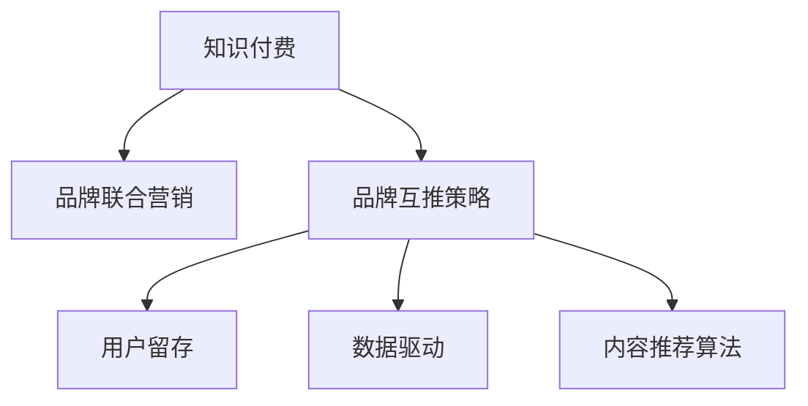

                 

# 知识付费赚钱的品牌联合营销与品牌互推策略

> 关键词：知识付费,品牌联合营销,品牌互推策略,用户留存,数据驱动,内容推荐算法

## 1. 背景介绍

### 1.1 问题由来

在互联网知识付费领域，随着内容竞争的日益激烈，用户获取信息和知识的方式也变得更加多样化和个性化。品牌之间的联合营销和品牌互推策略，成为了吸引用户、提升用户粘性、增加收入的重要手段。各大知识付费平台纷纷探索多样化的合作方式，以期在激烈的市场竞争中脱颖而出。

### 1.2 问题核心关键点

品牌联合营销与品牌互推策略的核心在于：

- 选择合适的合作伙伴，进行用户需求和内容定位的匹配。
- 设计互惠互利的内容合作模式，实现品牌间的共赢。
- 通过数据驱动的用户行为分析，精准定位目标用户，提高内容推送的个性化和精准度。
- 利用推荐算法优化内容推荐策略，提升用户留存率和转化率。

## 2. 核心概念与联系

### 2.1 核心概念概述

为更好地理解品牌联合营销与品牌互推策略，本节将介绍几个密切相关的核心概念：

- **知识付费**：通过在线平台购买或订阅知识服务，用户付费获取知识、技能、信息等内容，以提升个人或企业能力的一种新模式。
- **品牌联合营销**：不同品牌间联合进行市场推广活动，通过合作提高品牌知名度和用户黏性。
- **品牌互推策略**：品牌间互相推荐用户或内容，提高彼此的用户获取量和品牌影响力。
- **用户留存**：通过持续提供有价值的内容和服务，吸引用户长期使用平台，避免用户流失。
- **数据驱动**：基于用户行为数据分析，优化营销策略，实现精准营销。
- **内容推荐算法**：通过算法模型分析用户兴趣和行为数据，推荐相关内容，提升用户满意度和转化率。

这些核心概念之间的逻辑关系可以通过以下Mermaid流程图来展示：



这个流程图展示的品牌联合营销与品牌互推策略的关键要素及其相互关系：

1. 知识付费是品牌营销的基础，通过内容吸引用户。
2. 品牌联合营销和品牌互推策略是提升用户粘性和品牌影响力的有效手段。
3. 用户留存和数据驱动是精准营销的保障，提升平台的核心竞争力。
4. 内容推荐算法是提升用户体验、提高转化率的关键技术。

## 3. 核心算法原理 & 具体操作步骤

### 3.1 算法原理概述

品牌联合营销与品牌互推策略的核心在于通过数据和算法驱动，优化内容推送和用户互动，实现品牌间的合作共赢。其核心思想是：

1. **用户画像**：通过用户行为数据，构建详细的用户画像，识别用户的兴趣和偏好。
2. **内容匹配**：将品牌与用户画像进行匹配，推荐最相关的内容。
3. **联合推广**：通过品牌间的互相推荐，扩大内容和品牌的曝光度。
4. **数据分析**：基于用户行为数据，持续优化推荐算法和营销策略。

形式化地，假设用户集为 $U$，品牌集为 $B$，内容集为 $C$。设品牌 $b \in B$ 推荐内容 $c \in C$ 给用户 $u \in U$ 的推广概率为 $P(u, c, b)$。则品牌互推模型的优化目标为：

$$
\max_{P} \sum_{u \in U} \sum_{c \in C} \sum_{b \in B} P(u, c, b) \log P(u, c, b)
$$

其中，$P(u, c, b)$ 是品牌 $b$ 推荐内容 $c$ 给用户 $u$ 的推广概率。

### 3.2 算法步骤详解

基于上述理论，品牌联合营销与品牌互推策略的具体操作步骤如下：

**Step 1: 数据收集与预处理**

1. 收集用户行为数据，如访问时间、浏览时长、内容互动等。
2. 收集品牌内容数据，如课程名称、作者、学习进度等。
3. 清洗和标准化数据，去除噪声和异常值，确保数据质量。

**Step 2: 用户画像构建**

1. 利用聚类算法对用户进行分组，如K-means、层次聚类等。
2. 通过因子分析或主成分分析，提取用户兴趣因子，构建详细用户画像。

**Step 3: 品牌内容匹配**

1. 利用相似度算法，如余弦相似度、Jaccard相似度等，计算品牌内容与用户画像的匹配度。
2. 根据匹配度排序，选择与用户画像最相关的内容进行推荐。

**Step 4: 品牌联合推广**

1. 设计品牌间的互推策略，如内容交叉推荐、用户互动奖励等。
2. 将推荐策略嵌入内容推送系统，确保品牌间的互推效果。

**Step 5: 数据分析与优化**

1. 利用A/B测试等方法，评估推荐策略的效果。
2. 收集用户反馈数据，持续优化推荐算法和推广策略。

### 3.3 算法优缺点

品牌联合营销与品牌互推策略具有以下优点：

1. **精准匹配**：通过用户画像和内容匹配，能够提供更加精准的内容推荐，提高用户满意度。
2. **多品牌互动**：品牌间的互推策略能够扩大品牌曝光，吸引更多用户。
3. **数据驱动**：通过数据分析，持续优化推荐策略，提升品牌影响力。

但同时，该策略也存在以下局限：

1. **数据隐私**：用户行为数据和内容推荐算法涉及用户隐私保护，需要谨慎处理。
2. **用户多样性**：用户兴趣和偏好多样，统一的内容推荐策略难以覆盖所有用户。
3. **品牌协同难度**：不同品牌间的合作协同需要大量的沟通和协调，容易出现问题。

### 3.4 算法应用领域

品牌联合营销与品牌互推策略在知识付费平台中的应用广泛，具体包括：

- **课程推荐**：根据用户画像，推荐与用户兴趣相关的课程，提高用户购买率。
- **品牌联合营销**：品牌间联合推广，吸引更多用户，提升品牌知名度。
- **用户互动**：通过品牌间的互推策略，提高用户互动，增加用户粘性。
- **数据分析**：基于用户行为数据，分析用户兴趣变化，优化内容推荐策略。
- **营销活动**：设计品牌间的合作活动，提升用户参与度和平台影响力。

除了知识付费领域，品牌联合营销与品牌互推策略在其他电商、社交、娱乐等领域也有广泛应用。

## 4. 数学模型和公式 & 详细讲解 & 举例说明

### 4.1 数学模型构建

本节将使用数学语言对品牌联合营销与品牌互推策略进行更加严格的刻画。

设品牌 $b \in B$ 推荐内容 $c \in C$ 给用户 $u \in U$ 的概率为 $P(u, c, b)$。则联合推广的目标函数为：

$$
\max_{P} \sum_{u \in U} \sum_{c \in C} \sum_{b \in B} P(u, c, b) \log P(u, c, b)
$$

目标函数的优化可以通过最大化交叉熵损失函数来实现，即：

$$
\min_{P} \sum_{u \in U} \sum_{c \in C} \sum_{b \in B} P(u, c, b) \log \hat{P}(u, c, b)
$$

其中 $\hat{P}$ 为模型的预测概率，$P$ 为最优概率。

### 4.2 公式推导过程

以课程推荐为例，假设用户 $u$ 对课程 $c$ 的学习进度为 $x$，对课程的兴趣因子为 $i$，课程的作者品牌 $b$ 的知名度为 $k$。则推荐模型可以表示为：

$$
P(u, c, b) = f(x, i, k)
$$

其中 $f$ 为推荐函数，可以根据不同的特征进行设计。假设推荐函数为线性模型，则有：

$$
f(x, i, k) = \beta_0 + \beta_1 x + \beta_2 i + \beta_3 k
$$

代入联合推广的目标函数，得：

$$
\max_{\beta} \sum_{u \in U} \sum_{c \in C} \sum_{b \in B} P(u, c, b) \log P(u, c, b)
$$

通过求解上述优化问题，得到模型参数 $\beta$，即可构建品牌联合营销与品牌互推策略的推荐模型。

### 4.3 案例分析与讲解

假设某知识付费平台上有两家品牌 $A$ 和 $B$，合作推广各自的品牌课程。用户 $u$ 对 $A$ 品牌课程的学习进度为 $x$，对 $B$ 品牌课程的兴趣因子为 $i$，$A$ 品牌的知名度为 $k_A$，$B$ 品牌的知名度为 $k_B$。品牌互推策略的目标是最大化推荐的联合概率 $P(u, c_A, A) + P(u, c_B, B)$。

根据公式，可以构建如下推荐模型：

$$
P(u, c_A, A) = f_A(x, i, k_A)
$$
$$
P(u, c_B, B) = f_B(x, i, k_B)
$$

其中 $f_A$ 和 $f_B$ 为品牌的推荐函数，可以分别训练两个模型，也可以通过集成方法将两模型结合。

## 5. 项目实践：代码实例和详细解释说明

### 5.1 开发环境搭建

在进行品牌联合营销与品牌互推策略的实践前，我们需要准备好开发环境。以下是使用Python进行PyTorch开发的环境配置流程：

1. 安装Anaconda：从官网下载并安装Anaconda，用于创建独立的Python环境。

2. 创建并激活虚拟环境：
```bash
conda create -n pytorch-env python=3.8 
conda activate pytorch-env
```

3. 安装PyTorch：根据CUDA版本，从官网获取对应的安装命令。例如：
```bash
conda install pytorch torchvision torchaudio cudatoolkit=11.1 -c pytorch -c conda-forge
```

4. 安装Pandas、NumPy等库：
```bash
pip install pandas numpy
```

5. 安装Scikit-learn：用于用户画像和聚类分析。
```bash
pip install scikit-learn
```

6. 安装Transformer库：用于内容推荐。
```bash
pip install transformers
```

完成上述步骤后，即可在`pytorch-env`环境中开始实践。

### 5.2 源代码详细实现

下面我们以课程推荐为例，给出使用PyTorch进行品牌互推策略的Python代码实现。

首先，定义推荐模型：

```python
import torch
from torch.nn import Linear, ReLU

class RecommendationModel(torch.nn.Module):
    def __init__(self, in_features, hidden_features, out_features):
        super(RecommendationModel, self).__init__()
        self.fc1 = Linear(in_features, hidden_features)
        self.fc2 = Linear(hidden_features, out_features)
        self.relu = ReLU()

    def forward(self, x):
        x = self.fc1(x)
        x = self.relu(x)
        x = self.fc2(x)
        return x

# 定义推荐函数
def f(x, i, k):
    model = RecommendationModel(in_features=3, hidden_features=64, out_features=1)
    return model(torch.tensor([x, i, k]))

# 定义推荐概率
def P(u, c, b):
    x, i, k = u['x'], u['i'], b['k']
    p = f(x, i, k)
    return p

# 构建推荐矩阵
def build_recommend_matrix(U, C, B):
    recommend_matrix = torch.zeros(len(U), len(C), len(B))
    for u in U:
        for c in C:
            for b in B:
                p = P(u, c, b)
                recommend_matrix[u, c, b] = p
    return recommend_matrix
```

然后，定义用户画像和品牌内容：

```python
# 用户画像数据
U = [{'x': 0.5, 'i': 0.8}, {'x': 0.3, 'i': 0.6}, {'x': 0.9, 'i': 0.4}]

# 品牌内容数据
C = [{'c': '课程A'}, {'c': '课程B'}, {'c': '课程C'}]

# 品牌知名度数据
B = [{'k': 0.7}, {'k': 0.5}, {'k': 0.9}]
```

最后，计算推荐矩阵并进行可视化：

```python
import numpy as np
import matplotlib.pyplot as plt

# 计算推荐矩阵
recommend_matrix = build_recommend_matrix(U, C, B)

# 可视化推荐矩阵
plt.imshow(recommend_matrix.numpy(), cmap='hot', interpolation='nearest')
plt.colorbar()
plt.title('推荐矩阵')
plt.show()
```

以上代码实现了基于品牌互推策略的推荐矩阵构建和可视化。可以看到，推荐矩阵的行表示用户，列表示课程和品牌，矩阵中的每个元素表示该用户对课程和品牌的推荐概率。

### 5.3 代码解读与分析

让我们再详细解读一下关键代码的实现细节：

**RecommendationModel类**：
- `__init__`方法：初始化推荐模型的线性层和ReLU激活函数。
- `forward`方法：定义推荐模型的前向传播过程。

**推荐函数f(x, i, k)**：
- 根据用户行为数据 $x$、兴趣因子 $i$、品牌知名度 $k$，通过RecommendationModel模型计算推荐概率。

**推荐概率P(u, c, b)**：
- 根据用户画像 $u$、课程内容 $c$、品牌 $b$ 计算推荐概率。

**构建推荐矩阵build_recommend_matrix**：
- 遍历用户画像 $U$、课程内容 $C$ 和品牌 $B$，计算每组用户-课程-品牌的推荐概率，构建推荐矩阵。

**用户画像U**：
- 包含用户的行为数据、兴趣因子等信息。

**品牌内容C**：
- 包含课程的详细信息。

**品牌知名度B**：
- 包含品牌的影响力和知名度。

可以看到，代码实现中主要利用了PyTorch的线性层和激活函数，以及自定义的推荐函数。这些组件共同构成了品牌互推策略的推荐模型。

## 6. 实际应用场景

### 6.1 智能客服系统

基于品牌联合营销与品牌互推策略的智能客服系统，可以提升客户服务的效率和质量。智能客服系统通过品牌联合推荐，能够向客户推荐与当前问题相关的品牌和课程，解决客户的多样化需求。同时，通过品牌互推，提高品牌的曝光度，增加客户对品牌的认知度和信任度。

在技术实现上，可以收集客户的历史咨询记录，将其与相关品牌和课程进行匹配，形成联合推荐列表。客户在咨询时，系统会根据用户的反馈和行为数据，实时更新推荐列表，确保推荐的精准性和时效性。

### 6.2 在线教育平台

在线教育平台通过品牌联合营销与品牌互推策略，能够提升平台的活跃度和用户粘性。平台可以根据用户的学习进度、兴趣和行为数据，推荐与用户相关联的品牌和课程，提高用户的参与度和满意度。同时，通过品牌互推，扩大平台的品牌影响力，吸引更多的潜在用户。

在技术实现上，平台可以构建用户画像，将其与品牌和课程进行匹配，形成推荐列表。同时，通过品牌互推，平台可以向用户推荐合作伙伴的品牌和课程，增加用户的选择多样性。

### 6.3 电子商务平台

电子商务平台通过品牌联合营销与品牌互推策略，能够提升商品的曝光度和销售量。平台可以根据用户的历史购买记录、浏览行为等数据，推荐与用户兴趣相关的品牌和商品，提高用户的购买转化率。同时，通过品牌互推，平台可以向用户推荐合作伙伴的商品，增加商品的曝光度和销售量。

在技术实现上，平台可以构建用户画像，将其与品牌和商品进行匹配，形成推荐列表。同时，通过品牌互推，平台可以向用户推荐合作伙伴的商品，增加商品的多样性和吸引力。

### 6.4 未来应用展望

随着品牌联合营销与品牌互推策略的不断发展，其在更多领域的应用将进一步拓展，带来新的商业机遇。

在智慧医疗领域，平台可以通过品牌联合推荐，向医生推荐相关的课程和资源，提升医生的专业水平。同时，通过品牌互推，扩大平台的品牌影响力，吸引更多的医生用户。

在智能家居领域，平台可以通过品牌联合推荐，向用户推荐与家居相关的品牌和课程，提升用户的家居生活质量。同时，通过品牌互推，扩大平台的品牌影响力，吸引更多的家居用户。

在娱乐领域，平台可以通过品牌联合推荐，向用户推荐与娱乐相关的品牌和课程，提升用户的娱乐体验。同时，通过品牌互推，扩大平台的品牌影响力，吸引更多的娱乐用户。

## 7. 工具和资源推荐

### 7.1 学习资源推荐

为了帮助开发者系统掌握品牌联合营销与品牌互推策略的理论基础和实践技巧，这里推荐一些优质的学习资源：

1. **《推荐系统实战》系列书籍**：详细介绍了推荐系统的原理、算法和应用，涵盖推荐策略的多种方法。
2. **CS229《机器学习》课程**：斯坦福大学开设的机器学习经典课程，讲解了推荐系统的基础理论和常用算法。
3. **Kaggle推荐系统竞赛**：参加推荐系统竞赛，实践推荐策略的实际应用，积累经验。
4. **RecSys论文集**：收集中外推荐系统领域的经典论文，了解最新的推荐策略和技术。

通过对这些资源的学习实践，相信你一定能够快速掌握品牌联合营销与品牌互推策略的精髓，并用于解决实际的推荐问题。

### 7.2 开发工具推荐

高效的开发离不开优秀的工具支持。以下是几款用于品牌联合营销与品牌互推策略开发的常用工具：

1. **PyTorch**：基于Python的开源深度学习框架，灵活的计算图设计，适合研究和大规模工程应用。
2. **TensorFlow**：由Google主导开发的深度学习框架，支持分布式计算，适合大规模工程应用。
3. **Pandas**：数据处理和分析库，支持多种数据格式和操作，方便数据预处理和分析。
4. **NumPy**：数值计算库，支持高效的数组计算，方便模型训练和优化。
5. **Scikit-learn**：机器学习库，支持多种算法和模型，方便数据建模和预测。
6. **TensorBoard**：TensorFlow配套的可视化工具，实时监测模型训练状态，提供丰富的图表呈现方式，便于调试和优化。

合理利用这些工具，可以显著提升品牌联合营销与品牌互推策略的开发效率，加快创新迭代的步伐。

### 7.3 相关论文推荐

品牌联合营销与品牌互推策略的研究源于学界的持续研究。以下是几篇奠基性的相关论文，推荐阅读：

1. **Hedonic Regression and the Intrinsic Value of Brands**：Lindgreen等，探讨品牌价值的多维度衡量方法，为品牌联合推荐提供理论基础。
2. **Brand Equity and Social Media: An Analytical Model for the Integrated Value of Brand in Social Media**：Bughin等，研究社交媒体对品牌价值的影响，为品牌联合推荐提供数据支持。
3. **Brand Relationships and Consumer Response to Online Reviews**：Kim等，探讨品牌关系对消费者行为的影响，为品牌互推策略提供实践参考。
4. **Social Media Brand Strategies: A Critical Review**：Kaplan等，总结社交媒体品牌策略的理论和方法，为品牌联合营销提供指南。

这些论文代表了大品牌联合营销与品牌互推策略的发展脉络。通过学习这些前沿成果，可以帮助研究者把握学科前进方向，激发更多的创新灵感。

## 8. 总结：未来发展趋势与挑战

### 8.1 总结

本文对品牌联合营销与品牌互推策略进行了全面系统的介绍。首先阐述了品牌联合营销与品牌互推策略的研究背景和意义，明确了该策略在提升用户粘性、品牌影响力方面的独特价值。其次，从原理到实践，详细讲解了品牌联合推荐与品牌互推策略的数学模型和关键步骤，给出了具体的代码实现和分析。同时，本文还广泛探讨了该策略在智能客服、在线教育、电子商务等多个行业领域的应用前景，展示了其巨大的商业潜力。此外，本文精选了品牌联合营销与品牌互推策略的学习资源，力求为读者提供全方位的技术指引。

通过本文的系统梳理，可以看到，品牌联合营销与品牌互推策略在品牌推广和用户推荐方面具有广阔的应用前景，能够显著提升平台的用户粘性和品牌影响力。伴随算法的不断进步和数据的积累，未来品牌联合营销与品牌互推策略将实现更加精准的推荐和高效的营销，进一步推动知识付费平台的发展。

### 8.2 未来发展趋势

展望未来，品牌联合营销与品牌互推策略将呈现以下几个发展趋势：

1. **个性化推荐**：通过深度学习和协同过滤算法，实现更加个性化的推荐，提高用户满意度和转化率。
2. **多模态推荐**：结合图像、视频、音频等多模态数据，提升推荐的全面性和多样性。
3. **实时推荐**：通过流式计算和在线学习算法，实现实时推荐，提升推荐的时效性和精准度。
4. **情感分析**：利用自然语言处理技术，分析用户对品牌和内容的情感，优化推荐策略。
5. **社交网络**：结合社交网络分析，分析用户之间的互动关系，提升推荐的效果。
6. **用户反馈**：利用用户反馈数据，持续优化推荐模型，提高推荐的准确性和用户满意度。

以上趋势凸显了品牌联合营销与品牌互推策略的广阔前景。这些方向的探索发展，将进一步提升品牌的影响力和用户的粘性，推动知识付费平台向更加智能化、个性化、实时化的方向发展。

### 8.3 面临的挑战

尽管品牌联合营销与品牌互推策略已经取得了显著成果，但在迈向更加智能化、普适化应用的过程中，它仍面临着诸多挑战：

1. **数据隐私**：品牌联合营销与品牌互推策略涉及大量的用户行为数据和品牌信息，如何保护用户隐私，防止数据泄露，是重要的研究课题。
2. **冷启动问题**：新用户和老用户的行为数据差异较大，如何通过少量数据快速建立用户画像，是提高推荐效果的挑战。
3. **品牌协同难度**：品牌间的合作协同需要大量的沟通和协调，容易出现问题。
4. **推荐算法复杂度**：推荐算法涉及复杂的模型和优化问题，如何提升算法的可解释性和可扩展性，是未来的研究方向。
5. **推荐效果评估**：推荐效果的评估需要多维度、多层次的指标，如何设计合理的评估体系，是提高推荐效果的保障。

### 8.4 研究展望

面对品牌联合营销与品牌互推策略所面临的种种挑战，未来的研究需要在以下几个方面寻求新的突破：

1. **多模态数据融合**：结合多模态数据，提升推荐的全面性和多样性，增强用户粘性和品牌影响力。
2. **用户行为建模**：通过建模用户行为，预测用户兴趣和需求，提高推荐的精准度。
3. **算法优化**：优化推荐算法，提升算法的可解释性和可扩展性，降低复杂度。
4. **数据隐私保护**：设计隐私保护算法，保护用户隐私，防止数据泄露。
5. **个性化推荐**：通过深度学习和协同过滤算法，实现更加个性化的推荐，提高用户满意度和转化率。

这些研究方向的探索，必将引领品牌联合营销与品牌互推策略技术迈向更高的台阶，为知识付费平台的发展带来新的突破。

## 9. 附录：常见问题与解答

**Q1: 品牌联合营销与品牌互推策略是否适用于所有行业？**

A: 品牌联合营销与品牌互推策略在知识付费平台上的应用效果显著，但在其他行业的应用需要根据具体场景进行调整和优化。例如，在零售、金融、医疗等领域，需要根据行业特点设计合适的推荐策略和营销方案，以充分发挥其商业价值。

**Q2: 如何选择合适的品牌进行联合推荐？**

A: 品牌选择的关键在于用户需求和内容定位的匹配。可以通过用户画像分析，识别用户对不同品牌的兴趣和需求，选择与用户画像匹配度高的品牌进行推荐。同时，考虑品牌的知名度、影响力和合作意愿，选择与平台品牌价值观相符的品牌进行合作。

**Q3: 如何评估品牌联合营销与品牌互推策略的效果？**

A: 品牌联合营销与品牌互推策略的效果评估可以从多个维度进行，如用户留存率、转化率、品牌曝光度等。可以通过A/B测试、多臂老虎机等方法，评估推荐策略的实际效果，持续优化推荐模型和营销方案。

**Q4: 品牌联合营销与品牌互推策略如何应对数据隐私问题？**

A: 品牌联合营销与品牌互推策略涉及大量的用户行为数据和品牌信息，如何保护用户隐私是重要的研究课题。可以通过数据脱敏、差分隐私等技术，保护用户隐私，防止数据泄露。

**Q5: 如何应对冷启动问题？**

A: 冷启动问题可以通过少量数据快速建立用户画像，如利用聚类算法对新用户进行分组，通过少量行为数据预测用户兴趣和需求。同时，可以通过标签推荐等方法，帮助新用户快速建立推荐模型。

---

作者：禅与计算机程序设计艺术 / Zen and the Art of Computer Programming

