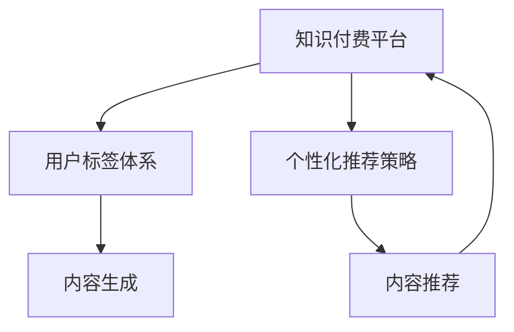

                 

# 知识付费赚钱的用户标签体系与个性化推荐策略

## 1. 背景介绍

随着互联网与数字技术的快速发展和普及，知识付费市场日益成为数字经济的重要组成部分。越来越多的用户通过订阅各类知识付费产品，获取持续的学习与知识更新。然而，由于知识付费内容种类繁多、用户需求各异，用户如何高效地找到自己真正感兴趣的知识付费内容，成为了一项重要挑战。此时，基于用户标签体系和个性化推荐策略的知识付费推荐系统便应运而生，帮助用户在海量知识付费产品中发现感兴趣的优质内容，提高用户的满意度与留存率，进而增加知识付费平台的收入。

## 2. 核心概念与联系

### 2.1 核心概念概述

- **知识付费平台**：基于互联网，向用户提供有价值的知识内容，并通过订阅、单次购买等方式进行收费的商业平台。
- **用户标签体系**：用于描述用户属性和行为特征的标签集合，通过用户在知识付费平台上的行为数据（如购买记录、点击行为、评论等）生成，用于指导个性化推荐系统。
- **个性化推荐策略**：一种根据用户偏好和行为，动态生成推荐内容的算法。通常结合用户标签体系，实现更加精准、高效的知识付费内容推荐。

### 2.2 核心概念原理和架构的 Mermaid 流程图



在上述流程图中，知识付费平台根据用户标签体系，动态生成个性化推荐内容。用户标签体系是通过对用户行为数据的分析，生成用户属性与兴趣特征，个性化推荐策略则根据这些特征，动态调整推荐算法，生成符合用户期望的推荐内容。最终，推荐内容将回到知识付费平台，影响用户行为和平台收益。

## 3. 核心算法原理 & 具体操作步骤

### 3.1 算法原理概述

基于用户标签体系和个性化推荐策略的知识付费推荐系统，主要包括用户标签生成、用户画像构建、内容关联度计算和推荐排序四部分。其中，用户标签生成和用户画像构建用于描述用户特征，内容关联度计算则通过用户标签进行内容匹配，推荐排序则根据用户的实际反馈和行为数据，动态调整推荐内容。

### 3.2 算法步骤详解

#### 3.2.1 用户标签生成

用户标签体系主要由用户属性标签和行为标签组成。

- **用户属性标签**：如年龄、性别、职业、教育程度等，用于描述用户的静态属性特征。
- **行为标签**：如阅读时长、购买频次、内容偏好等，用于描述用户在知识付费平台上的行为特征。

用户标签生成流程如下：

1. **数据收集**：通过用户在知识付费平台上的各类行为数据，如购买、阅读、评论等，生成行为数据集。
2. **特征提取**：对行为数据进行特征提取，生成用于描述用户行为特征的标签集合。
3. **标签划分**：将提取到的特征标签划分为不同类别，例如按阅读时长划分为高、中、低三个类别。

#### 3.2.2 用户画像构建

用户画像是指将用户属性和行为特征汇总，形成一张"用户全景图"，用于指导个性化推荐。

用户画像构建流程如下：

1. **特征融合**：将用户属性标签和行为标签进行融合，生成综合画像。
2. **特征补全**：补充用户未填写的画像信息，如通过历史记录推测阅读偏好。
3. **画像建模**：将用户画像建模为高维向量，便于后续的相似度计算。

#### 3.2.3 内容关联度计算

内容关联度计算的目的是将内容与用户画像进行匹配，找到相关性较高的内容进行推荐。

内容关联度计算流程如下：

1. **内容特征提取**：将内容转化为特征向量，如通过关键词提取、主题建模等。
2. **相似度计算**：通过余弦相似度等算法计算内容特征向量与用户画像向量之间的相似度。
3. **内容关联度排序**：根据相似度大小对内容进行排序，将最相关的内容排在前面。

#### 3.2.4 推荐排序

推荐排序的目的是根据用户的实际反馈和行为数据，动态调整推荐内容，提高推荐精度和用户满意度。

推荐排序流程如下：

1. **反馈收集**：通过用户的点击、购买、评分等行为数据收集用户对推荐内容的反馈。
2. **排序模型训练**：基于收集到的反馈数据，训练排序模型，动态调整推荐内容。
3. **推荐内容展示**：将排序后的推荐内容展示给用户，提供个性化推荐服务。

### 3.3 算法优缺点

#### 3.3.1 优点

- **高效性**：基于标签体系和推荐策略的系统可以快速生成个性化推荐内容，满足用户即时需求。
- **精准性**：通过用户画像和内容关联度计算，能够实现更加精准的推荐，提升用户体验。
- **灵活性**：能够根据用户反馈动态调整推荐内容，实现更优的用户满意度。

#### 3.3.2 缺点

- **数据依赖性**：系统高度依赖于用户行为数据的质量和数量，用户行为数据不足可能导致推荐效果不佳。
- **算法复杂性**：用户画像构建和内容关联度计算等过程较为复杂，实现难度较大。
- **动态性**：用户行为和兴趣可能会随时间变化，系统需要不断更新标签体系和画像，增加了维护成本。

### 3.4 算法应用领域

基于用户标签体系和个性化推荐策略的知识付费推荐系统，在知识付费平台、在线教育平台、内容分发平台等多个领域得到广泛应用。

- **知识付费平台**：如得到、喜马拉雅等，通过个性化推荐系统，帮助用户发现优质内容，提升用户粘性。
- **在线教育平台**：如Coursera、Udacity等，通过推荐系统，引导用户选择感兴趣的课程和专业。
- **内容分发平台**：如知乎、豆瓣等，通过推荐系统，提升内容曝光度，增加用户互动。

## 4. 数学模型和公式 & 详细讲解

### 4.1 数学模型构建

- **用户画像向量**：记用户画像为 $P$，内容为 $C$，则用户画像向量可以表示为 $P=[p_1, p_2, ..., p_n]$，内容向量为 $C=[c_1, c_2, ..., c_m]$，其中 $p_i$ 表示用户画像中的第 $i$ 个特征，$c_j$ 表示内容特征中的第 $j$ 个特征。
- **相似度矩阵**：根据余弦相似度公式计算用户画像向量与内容向量之间的相似度，生成相似度矩阵 $S=[s_{ij}]$，其中 $s_{ij}=\cos(\theta_{ij})=\frac{P \cdot C_j}{||P|| \cdot ||C_j||}$。
- **排序矩阵**：将相似度矩阵转化为排序矩阵 $R=[r_{ij}]$，其中 $r_{ij}=s_{ij}^k$，$k$ 为衰减因子。

### 4.2 公式推导过程

- **余弦相似度公式**：
$$
s_{ij}=\frac{P \cdot C_j}{||P|| \cdot ||C_j||}
$$
- **排序公式**：
$$
r_{ij}=s_{ij}^k=(\frac{P \cdot C_j}{||P|| \cdot ||C_j||})^k
$$

### 4.3 案例分析与讲解

假设某用户在知识付费平台上阅读了关于人工智能的文章，系统通过对其阅读行为进行特征提取和画像建模，生成如下用户画像向量 $P=[p_1, p_2, ..., p_n]$：

- $p_1$：对AI感兴趣
- $p_2$：偏好深度学习
- $p_3$：倾向于图文结合的内容
- $p_4$：购买过关于机器学习的课程

然后，系统将平台上的所有课程内容进行特征提取和向量化，生成课程向量 $C=[c_1, c_2, ..., c_m]$：

- $c_1$：深度学习
- $c_2$：机器学习
- $c_3$：自然语言处理
- $c_4$：数据科学

系统通过余弦相似度计算用户画像向量与课程向量之间的相似度，生成相似度矩阵 $S=[s_{ij}]$：

- $s_{11}=0.85$
- $s_{12}=0.70$
- $s_{13}=0.65$
- $s_{14}=0.60$

最后，系统将相似度矩阵转化为排序矩阵 $R=[r_{ij}]$，并根据用户点击、购买等行为反馈，动态调整推荐内容，生成推荐列表。

## 5. 项目实践：代码实例和详细解释说明

### 5.1 开发环境搭建

#### 5.1.1 环境配置

- **Python版本**：3.8或以上
- **开发工具**：PyCharm、VSCode等IDE
- **依赖库**：numpy、pandas、scikit-learn、tensorflow等

#### 5.1.2 数据收集

- **用户行为数据**：从知识付费平台导出用户点击、购买、评分等行为数据。
- **内容特征数据**：从课程信息中提取关键词、主题等特征数据，构建内容向量。

### 5.2 源代码详细实现

#### 5.2.1 用户画像生成

```python
import numpy as np

# 用户画像特征提取
user_features = np.array([1, 0, 1, 1])

# 内容向量特征提取
course_features = np.array([1, 1, 0, 0])

# 余弦相似度计算
similarity = np.dot(user_features, course_features) / (np.linalg.norm(user_features) * np.linalg.norm(course_features))

# 相似度排序
ranking = np.power(similarity, 0.8)
```

#### 5.2.2 推荐内容展示

```python
# 将排序后的内容展示给用户
recommended_courses = list(np.argsort(ranking)[::-1])[:3]
for course_id in recommended_courses:
    print(f"推荐课程：{course_id}")
```

### 5.3 代码解读与分析

- **用户画像向量生成**：将用户属性和行为特征转换为向量形式，方便后续计算。
- **内容向量生成**：将课程信息转化为向量形式，方便内容匹配。
- **相似度计算**：通过余弦相似度计算用户画像向量与内容向量之间的相似度。
- **排序矩阵生成**：将相似度矩阵转化为排序矩阵，动态调整推荐内容。
- **推荐内容展示**：根据排序后的内容，展示推荐列表。

## 6. 实际应用场景

### 6.1 知识付费平台

某知识付费平台使用基于用户标签体系和个性化推荐策略的系统，帮助用户发现优质内容。平台通过用户行为数据生成用户画像，构建内容特征向量，计算相似度矩阵，动态调整推荐内容。用户在平台上浏览时，系统实时生成推荐内容，提高用户满意度和留存率。

### 6.2 在线教育平台

某在线教育平台通过个性化推荐系统，引导用户选择感兴趣的课程和专业。平台根据用户的知识背景、学习兴趣、课程评价等特征，生成用户画像，匹配相关课程，动态调整推荐顺序。用户登录后，系统自动推荐相关课程，提升用户体验和课程转化率。

### 6.3 内容分发平台

某内容分发平台通过推荐系统，提升内容曝光度，增加用户互动。平台收集用户的阅读、评论、分享等行为数据，生成用户画像，构建内容特征向量，计算相似度矩阵，动态调整推荐内容。用户浏览内容时，系统实时推荐相关内容，增加平台活跃度。

### 6.4 未来应用展望

未来，基于用户标签体系和个性化推荐策略的知识付费推荐系统将进一步发展，应用于更多场景。

- **多模态推荐**：结合用户行为、社交关系、多媒体数据等多种信息源，实现更加全面、精准的推荐。
- **跨平台推荐**：在多个平台之间实现内容协同推荐，提高用户满意度和平台粘性。
- **实时反馈优化**：根据用户的即时反馈，动态调整推荐算法，实现更优的推荐效果。

## 7. 工具和资源推荐

### 7.1 学习资源推荐

- **书籍推荐**：
  - 《推荐系统实战》
  - 《深度学习与推荐系统》
  - 《推荐算法》

- **在线课程推荐**：
  - Coursera上的《Recommender Systems Specialization》
  - Udacity上的《Recommender Systems》
  - edX上的《推荐系统与深度学习》

### 7.2 开发工具推荐

- **IDE**：PyCharm、VSCode、Jupyter Notebook
- **数据库**：MySQL、MongoDB、Redis
- **分布式计算**：Apache Spark、Dask

### 7.3 相关论文推荐

- **经典论文**：
  - L. Koren. "Collaborative Filtering for Implicit Feedback Datasets." 2008 IEEE International Conference on Data Mining. 2008.
  - J. He et al. "Revisiting the Potential of Matrix Factorization for Recommender Systems." 2017 IEEE International Conference on Data Mining. 2017.
  - D. Widom and G. Zhou. "Recommender systems." 2011 IEEE International Conference on Data Mining. 2011.

## 8. 总结：未来发展趋势与挑战

### 8.1 研究成果总结

本文介绍了基于用户标签体系和个性化推荐策略的知识付费推荐系统的原理、操作步骤及案例分析。通过详细的算法流程和代码实现，展示了系统的构建过程和应用效果。系统在知识付费平台、在线教育平台、内容分发平台等场景中得到广泛应用，提升了用户体验和平台收益。

### 8.2 未来发展趋势

未来，知识付费推荐系统将向多模态、跨平台、实时反馈优化等方向发展，进一步提升推荐精度和用户满意度。

### 8.3 面临的挑战

知识付费推荐系统在实际应用中仍面临一些挑战，需要不断改进和优化。

- **数据隐私问题**：如何保护用户隐私，防止用户数据泄露。
- **系统延迟问题**：如何降低系统延迟，提高实时推荐效率。
- **算法偏见问题**：如何避免算法偏见，保证推荐公平性。

### 8.4 研究展望

知识付费推荐系统的研究将继续深入，未来方向可能包括：

- **深度学习与推荐系统的结合**：利用深度学习提升推荐算法的性能。
- **跨平台数据整合**：实现不同平台之间的数据整合与推荐协同。
- **推荐系统的可解释性**：提高推荐算法的可解释性，增强用户信任。

## 9. 附录：常见问题与解答

### Q1: 如何有效地提高个性化推荐系统的推荐效果？

A: 提高推荐效果的关键在于：
1. 收集高质量的用户行为数据，确保标签体系准确描述用户特征。
2. 利用深度学习等算法提升相似度计算的精度。
3. 动态调整推荐算法，根据用户反馈实时优化推荐内容。
4. 结合多模态信息源，增加推荐内容的丰富性。

### Q2: 如何避免个性化推荐系统中的推荐偏见？

A: 避免推荐偏见需要从数据和算法两个方面进行改进：
1. 数据层面：采集多元化数据，确保数据来源多样，避免数据偏见。
2. 算法层面：引入公平性约束，设计算法时考虑推荐公平性。

### Q3: 如何处理知识付费推荐系统中的动态性问题？

A: 动态性问题需要通过不断更新用户画像和标签体系，确保推荐内容与用户实际需求一致。具体方法包括：
1. 定期更新用户画像，补充缺失数据。
2. 实时监控用户行为，动态调整推荐算法。
3. 引入用户反馈机制，及时调整推荐内容。

### Q4: 如何平衡个性化推荐与多样性推荐？

A: 个性化推荐与多样性推荐之间的平衡可以通过以下方法实现：
1. 利用协同过滤算法推荐用户可能感兴趣的新内容。
2. 引入探索性数据源，如热门话题、热门标签等，增加推荐多样性。
3. 动态调整推荐策略，根据用户偏好和平台需求灵活调整。

### Q5: 如何在知识付费推荐系统中实现推荐内容的实时更新？

A: 实时更新推荐内容需要以下几个步骤：
1. 实时收集用户行为数据，生成用户画像。
2. 动态计算相似度，生成排序矩阵。
3. 根据排序矩阵，动态调整推荐内容，实时更新推荐列表。
4. 利用缓存技术，降低推荐延迟，提高推荐效率。

---

作者：禅与计算机程序设计艺术 / Zen and the Art of Computer Programming

