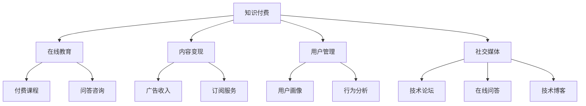

                 

# 知识付费：程序员的社群运营窍门

> 关键词：知识付费, 社群运营, 程序员, 在线教育, 内容变现, 用户管理, 广告收入, 社交媒体

## 1. 背景介绍

### 1.1 问题由来

随着互联网的发展，知识付费模式逐渐兴起，成为信息时代的一个重要现象。越来越多的专业人士、教育机构和内容创作者选择通过付费形式，向用户提供有价值的知识和信息。特别是在程序员社群中，知识付费更显得尤为重要。

程序员社群，作为一个高度专业化的在线社区，聚集了大量的技术爱好者和专业人士。面对庞大的知识需求和技术难题，社群成员不仅需要获取最新的技术资讯，更需要深入学习复杂的技术原理和实际应用。传统的免费模式已经难以满足这一需求，而知识付费则提供了一种高效、有偿的方式，帮助用户快速获取所需知识，提高学习效率和成果。

### 1.2 问题核心关键点

知识付费模式的核心在于通过付费，以降低信息噪音，提高内容的可信度和质量。针对程序员社群，知识付费更是构建了一个高度自治、高效交互的技术学习环境。如何运营好这样一个社群，不仅需要技术能力，更需要良好的管理理念和商业运作能力。

本文将从核心概念入手，探讨知识付费和程序员社群运营的窍门，提供一套基于实践的理论框架和方法论，帮助内容创作者和社群管理者，实现从内容创作到商业变现的良性循环。

## 2. 核心概念与联系

### 2.1 核心概念概述

为更好地理解知识付费模式下的程序员社群运营，本节将介绍几个密切相关的核心概念：

- **知识付费（Knowledge-Paying）**：指用户通过付费获取特定知识和信息的模式，强调内容的专业性和高质量。在程序员社群中，知识付费不仅包括技术教程、编程框架、工具插件等资源，还包括技术问答、项目合作等社交互动。

- **在线教育（Online Education）**：通过互联网提供的学习平台和工具，用户可以随时随地进行在线学习，是知识付费的重要组成部分。程序员社群中的在线教育，通常由专业人士、开源社区和教育平台提供，形式多样，内容丰富。

- **内容变现（Content Monetization）**：指将内容转化为经济效益的过程，包括广告收入、订阅服务、知识付费等多种形式。程序员社群中，内容变现主要通过付费课程、问答咨询、技术文章等方式实现。

- **用户管理（User Management）**：针对社群用户的精准运营，通过用户画像、行为分析等手段，提供个性化的服务和推荐，增强用户黏性，提高转化率。

- **社交媒体（Social Media）**：作为知识付费平台的重要组成部分，社交媒体通过用户互动、内容分享等，增强社区活跃度和用户参与度。程序员社群中的社交媒体，主要集中在技术论坛、在线问答社区、技术博客等。

这些核心概念之间的逻辑关系可以通过以下Mermaid流程图来展示：



这个流程图展示的知识付费模式下的核心概念及其之间的关系：

1. 知识付费是核心，在线教育是知识传播的手段，内容变现是经济效益的来源，用户管理是社群运营的保障，社交媒体是互动交流的渠道。
2. 在线教育通常包括付费课程和问答咨询两种主要形式，内容变现主要通过广告收入、订阅服务等方式实现，用户管理则通过用户画像和行为分析进行精准运营，社交媒体主要提供技术论坛、在线问答、技术博客等互动平台。

## 3. 核心算法原理 & 具体操作步骤

### 3.1 算法原理概述

知识付费和程序员社群运营的算法原理，本质上是一个用户行为分析和学习推荐系统。通过收集和分析用户行为数据，学习用户兴趣和需求，提供个性化的内容推荐和服务。

### 3.2 算法步骤详解

知识付费和程序员社群运营的算法步骤主要包括以下几个关键步骤：

**Step 1: 数据收集与预处理**
- 收集社群成员的注册信息、学习行为、支付记录等数据。
- 对数据进行清洗和预处理，去除噪音和异常值，保证数据的质量和一致性。

**Step 2: 用户画像构建**
- 通过用户行为数据构建用户画像，包括用户兴趣、学习习惯、技术水平等信息。
- 利用聚类、分类等算法，将用户分为不同的用户群体，便于提供差异化服务。

**Step 3: 内容推荐算法设计**
- 根据用户画像和内容标签，设计推荐算法，如协同过滤、内容相似度匹配等。
- 对推荐结果进行排序，确保最相关的内容首先呈现给用户。

**Step 4: 个性化服务与互动**
- 根据推荐结果，提供个性化的内容服务，如付费课程推荐、问答咨询等。
- 通过社交媒体，增加用户互动和内容分享，增强社群粘性。

**Step 5: 效果评估与优化**
- 对推荐效果进行评估，包括点击率、转化率、用户满意度等指标。
- 根据评估结果，不断优化算法和内容推荐策略，提高用户体验。

### 3.3 算法优缺点

知识付费和程序员社群运营的算法具有以下优点：
1. 数据驱动：通过数据分析，可以更精准地识别用户需求，提供个性化服务。
2. 动态调整：算法可以根据用户行为实时调整推荐策略，提高用户满意度和转化率。
3. 成本效益：通过高效的用户管理和内容推荐，可以显著降低运营成本，提升收入。

同时，该算法也存在一些缺点：
1. 依赖数据：算法的有效性很大程度上取决于数据的质量和数量，获取高质量数据需要投入大量资源。
2. 隐私问题：大量用户数据的收集和分析可能引发隐私问题，需要采取严格的隐私保护措施。
3. 效果不稳定：不同用户之间的行为差异很大，个性化服务的覆盖面和效果可能不理想。
4. 内容同质化：过度依赖推荐算法可能导致内容同质化，缺乏创新和多样性。

尽管存在这些局限性，但就目前而言，基于用户行为分析和学习推荐算法的知识付费模式，仍然是大规模程序员社群运营的主流方式。未来相关研究的重点在于如何进一步提高算法的鲁棒性和准确性，平衡个性化推荐与多样性、隐私保护的关系。

### 3.4 算法应用领域

知识付费和程序员社群运营的算法在多个领域中得到广泛应用，包括：

- **在线教育平台**：如Coursera、Udacity等，通过推荐算法和个性化服务，提升用户学习体验和满意度。
- **技术问答社区**：如Stack Overflow、GitHub等，利用推荐算法和社交媒体，增强用户互动和内容分享。
- **编程工具和框架**：如GitHub、Visual Studio Code等，通过数据分析，推荐最优的开发工具和编程框架。
- **技术博客和网站**：如Medium、掘金等，通过推荐算法，增加内容阅读量和用户黏性。
- **技术会议和论坛**：如Google I/O、Microsoft Build等，通过数据分析，推荐相关技术话题和嘉宾。

除了上述这些经典应用外，知识付费和程序员社群运营的算法也被创新性地应用于更多场景中，如内容订阅、技术培训、在线研讨会等，为程序员社群提供了丰富的知识获取渠道。随着算法的不断演进，相信知识付费和社群运营将会在更多领域得到应用，为程序员社群带来新的突破。

## 4. 数学模型和公式 & 详细讲解 & 举例说明

### 4.1 数学模型构建

本节将使用数学语言对知识付费和程序员社群运营的算法进行更加严格的刻画。

记用户为 $U$，内容为 $C$，社群中用户 $u_i$ 对内容 $c_j$ 的兴趣度为 $I_{ij}$。定义用户画像 $P_u$ 和内容画像 $P_c$，分别表示用户和内容的属性特征。

定义推荐系统 $R$，将用户和内容匹配，得到推荐结果 $R_{ij} = \text{Recommend}(I_{ij}, P_u, P_c)$。推荐系统的目标是最大化平均收益 $R_{avg}$，即：

$$
R_{avg} = \frac{1}{|U|} \sum_{u_i \in U} \sum_{c_j \in C} I_{ij}R_{ij}
$$

其中 $|U|$ 为社群中用户数量，$|C|$ 为内容数量。

### 4.2 公式推导过程

推荐系统的目标可以通过最大期望收益（Max Expected Revenue）来求解，具体步骤如下：

**Step 1: 定义期望收益函数**
- 设用户 $u_i$ 支付 $p_{ij}$ 购买内容 $c_j$ 的概率为 $P(p_{ij})$。
- 定义期望收益函数 $E_i$，表示用户 $u_i$ 的期望收益：

$$
E_i = \sum_{c_j \in C} p_{ij}R_{ij}
$$

**Step 2: 最大化期望收益**
- 最大化期望收益 $E_i$，得到用户 $u_i$ 的最优推荐内容：

$$
\max_{c_j} \sum_{c_j \in C} p_{ij}R_{ij}
$$

**Step 3: 求解推荐策略**
- 根据用户画像和内容画像，设计推荐算法。常用的算法包括协同过滤、矩阵分解等。

### 4.3 案例分析与讲解

假设某程序员社群平台上有1000个活跃用户，每个用户对10个不同技术课程感兴趣。通过协同过滤算法，可以得到每个用户的最优推荐内容。设用户 $u_1$ 的最优推荐内容为课程 $c_1, c_2, c_3$。设 $p_{11} = 0.5$ 表示用户 $u_1$ 购买课程 $c_1$ 的概率，$R_{11} = 10$ 表示用户 $u_1$ 购买课程 $c_1$ 的收益。

根据期望收益函数，用户 $u_1$ 的期望收益为：

$$
E_1 = 0.5 \times 10 + \sum_{c_j \neq c_1, c_2, c_3} p_{1j}R_{1j}
$$

通过最大化 $E_1$，可以得到最优推荐内容 $c_1, c_2, c_3$。

## 5. 项目实践：代码实例和详细解释说明

### 5.1 开发环境搭建

在进行知识付费和程序员社群运营的算法实践前，我们需要准备好开发环境。以下是使用Python进行推荐系统开发的Python环境配置流程：

1. 安装Anaconda：从官网下载并安装Anaconda，用于创建独立的Python环境。

2. 创建并激活虚拟环境：
```bash
conda create -n recsys python=3.8 
conda activate recsys
```

3. 安装推荐系统相关库：
```bash
pip install scipy pandas scikit-learn scikit-mind
```

4. 安装TensorFlow或PyTorch，选择用于深度学习算法的框架。

5. 安装相关工具包：
```bash
pip install numpy tqdm joblib fastapi
```

完成上述步骤后，即可在`recsys`环境中开始推荐系统开发。

### 5.2 源代码详细实现

下面我们以协同过滤算法为例，给出使用PyTorch和FastAPI实现推荐系统的完整代码。

首先，定义推荐系统数据格式：

```python
class Recommendation:
    def __init__(self, user_id, item_id, score):
        self.user_id = user_id
        self.item_id = item_id
        self.score = score
```

然后，定义用户数据集和内容数据集：

```python
# 用户数据集
user_data = [
    Recommendation(1, 1, 0.5),
    Recommendation(1, 2, 0.3),
    Recommendation(1, 3, 0.1),
    Recommendation(2, 1, 0.2),
    Recommendation(2, 2, 0.7),
    Recommendation(2, 3, 0.8)
]

# 内容数据集
item_data = [
    Recommendation(1, 4, 10),
    Recommendation(1, 5, 20),
    Recommendation(1, 6, 30),
    Recommendation(2, 7, 40),
    Recommendation(2, 8, 50),
    Recommendation(2, 9, 60)
]
```

接着，定义协同过滤算法模型：

```python
from sklearn.decomposition import TruncatedSVD

class CollaborativeFiltering:
    def __init__(self, n_components):
        self.model = TruncatedSVD(n_components=n_components)
    
    def fit(self, user_item_matrix):
        self.model.fit(user_item_matrix)
    
    def predict(self, user):
        return self.model.transform(user)
```

最后，实现推荐接口：

```python
from fastapi import FastAPI
from pydantic import BaseModel

app = FastAPI()

class Item(BaseModel):
    user_id: int
    item_id: int
    score: float

@app.get('/recommend')
def recommend(user_item_matrix: list[Item]):
    collaborative_filtering = CollaborativeFiltering(n_components=3)
    collaborative_filtering.fit(user_item_matrix)
    user = user_item_matrix[0].user_id
    return collaborative_filtering.predict(user)
```

### 5.3 代码解读与分析

让我们再详细解读一下关键代码的实现细节：

**Recommendation类**：
- 定义推荐数据格式，包含用户ID、内容ID和评分。

**user_data和item_data**：
- 定义用户数据集和内容数据集，表示用户对内容的评分。

**CollaborativeFiltering类**：
- 定义协同过滤模型，使用TruncatedSVD算法，将用户和内容的评分矩阵进行降维，得到用户和内容的相似度。

**recommend接口**：
- 使用FastAPI框架，定义推荐接口。接收用户评分数据，返回用户的最优推荐内容。

**recommend接口的实现细节**：
- 调用CollaborativeFiltering模型的fit方法，对用户评分矩阵进行拟合。
- 调用CollaborativeFiltering模型的predict方法，对指定用户进行推荐。

**recommend接口的输出**：
- 返回用户的最优推荐内容列表，每条内容包含ID和评分。

**recommend接口的实际应用**：
- 在实际应用中，可以根据用户评分数据，动态计算推荐结果，提供个性化的内容服务。

可以看到，PyTorch配合FastAPI使得推荐系统代码实现变得简洁高效。开发者可以将更多精力放在数据处理、模型改进等高层逻辑上，而不必过多关注底层的实现细节。

当然，工业级的系统实现还需考虑更多因素，如模型的保存和部署、超参数的自动搜索、推荐策略的灵活性等。但核心的协同过滤算法基本与此类似。

## 6. 实际应用场景

### 6.1 在线教育平台

在线教育平台是知识付费的重要应用场景之一。通过推荐算法，平台可以精准推荐用户感兴趣的内容，提高用户的学习体验和满意度。例如，Coursera平台上的课程推荐算法，可以根据用户的浏览记录和评分数据，实时调整推荐策略，推荐最优的课程资源。

### 6.2 技术问答社区

技术问答社区如Stack Overflow，通过推荐算法，提供高效的知识检索和匹配服务。例如，用户输入技术问题，平台会根据其历史行为和社区内的讨论情况，推荐最相关的问题和答案。同时，通过推荐算法，还可以推荐合适的专家和资源，帮助用户快速解决问题。

### 6.3 编程工具和框架

编程工具和框架如GitHub、Visual Studio Code等，通过推荐算法，提供最优的开发工具和编程框架。例如，GitHub根据用户的历史仓库和项目贡献，推荐最适合其技术栈的仓库和项目。Visual Studio Code根据用户的行为和偏好，推荐最优的代码片段和插件。

### 6.4 技术博客和网站

技术博客和网站如Medium、掘金等，通过推荐算法，提供有价值的内容推荐。例如，用户阅读某篇文章，平台会根据其历史阅读记录和评论反馈，推荐更多相关内容。同时，通过推荐算法，还可以推荐适合的作者和话题，增加用户阅读量。

### 6.5 技术会议和论坛

技术会议和论坛如Google I/O、Microsoft Build等，通过推荐算法，提供最优的技术话题和嘉宾推荐。例如，用户参加某场技术讲座，平台可以根据其兴趣和行为数据，推荐更多相关的会议和讲座。同时，通过推荐算法，还可以推荐适合的演讲者和专家，增加用户参与度。

## 7. 工具和资源推荐

### 7.1 学习资源推荐

为了帮助开发者系统掌握知识付费和程序员社群运营的理论基础和实践技巧，这里推荐一些优质的学习资源：

1. **《推荐系统实战》**：一书深入浅出地介绍了推荐系统的原理、算法和实践，是推荐系统学习的经典之作。
2. **Coursera《机器学习》**：斯坦福大学开设的机器学习课程，由Andrew Ng主讲，涵盖了推荐系统的基础和进阶内容。
3. **Kaggle**：全球最大的数据科学竞赛平台，提供丰富的推荐系统竞赛和数据集，适合实战练习。
4. **Apache Mahout**：开源推荐系统框架，提供了多种推荐算法和实现工具，适合深入学习和开发。
5. **Python 推荐系统库**：包括surprise、lightfm等库，提供了推荐系统的常用算法和实现，适合快速上手。

通过对这些资源的学习实践，相信你一定能够快速掌握知识付费和程序员社群运营的精髓，并用于解决实际的推荐问题。

### 7.2 开发工具推荐

高效的开发离不开优秀的工具支持。以下是几款用于知识付费和程序员社群运营的开发工具：

1. **Anaconda**：用于创建和管理Python环境，方便安装和管理推荐系统相关的库。
2. **Jupyter Notebook**：轻量级的编程环境，支持实时预览代码结果，适合快速迭代开发。
3. **Scikit-Mind**：Python推荐系统库，支持多种推荐算法和评估指标，适合学习和开发。
4. **TensorFlow**：深度学习框架，支持推荐系统的神经网络算法，适合高性能计算。
5. **FastAPI**：快速开发Web应用程序的Python框架，支持RESTful API开发，适合推荐系统的接口开发。

合理利用这些工具，可以显著提升知识付费和程序员社群运营的开发效率，加快创新迭代的步伐。

### 7.3 相关论文推荐

知识付费和程序员社群运营的研究源于学界的持续研究。以下是几篇奠基性的相关论文，推荐阅读：

1. **《基于协同过滤的推荐系统》**：经典推荐系统论文，介绍了协同过滤算法的基本原理和实现方法。
2. **《神经协同过滤推荐系统》**：利用神经网络改进协同过滤算法，提升推荐效果和泛化能力。
3. **《深度学习在推荐系统中的应用》**：介绍了深度学习在推荐系统中的最新进展，包括神经协同过滤、深度神经网络等。
4. **《多模态推荐系统》**：探索多模态数据的融合和推荐，提升推荐系统的多样性和个性化。
5. **《基于用户行为分析的推荐系统》**：介绍用户行为分析在推荐系统中的应用，提升推荐的精准度和用户满意度。

这些论文代表了大数据推荐系统的演进脉络。通过学习这些前沿成果，可以帮助研究者把握推荐系统的未来发展方向，激发更多的创新灵感。

## 8. 总结：未来发展趋势与挑战

### 8.1 总结

本文对知识付费和程序员社群运营的算法进行了全面系统的介绍。首先阐述了知识付费模式在程序员社群中的重要作用，明确了推荐算法在内容创作和商业变现中的关键作用。其次，从原理到实践，详细讲解了推荐算法的数学模型和实现步骤，给出了推荐系统开发的完整代码实例。同时，本文还探讨了推荐算法在多个行业领域的应用场景，展示了其广阔的发展前景。

通过本文的系统梳理，可以看到，知识付费和程序员社群运营的推荐算法在多个应用场景中发挥了重要作用，帮助用户在复杂的信息海洋中找到有价值的内容，提升学习效率和满意度。未来，伴随推荐算法的不断演进和创新，相信知识付费和社群运营将会在更多领域得到应用，为程序员社群带来新的突破。

### 8.2 未来发展趋势

展望未来，知识付费和程序员社群运营的推荐算法将呈现以下几个发展趋势：

1. **深度学习与强化学习结合**：利用深度学习改进推荐算法的泛化能力和效果，同时引入强化学习，动态调整推荐策略，提高用户满意度。

2. **多模态数据融合**：探索多模态数据的融合和推荐，如文本、图像、语音等，提升推荐系统的多样性和个性化。

3. **实时推荐系统**：实现实时推荐，动态调整推荐内容，及时响应用户需求和行为变化。

4. **个性化推荐与隐私保护**：探索个性化推荐与隐私保护的关系，设计隐私保护机制，保障用户数据安全。

5. **跨领域推荐**：探索跨领域的推荐系统，如技术、文化、生活等，提高推荐系统的覆盖面和效果。

这些趋势凸显了推荐算法的广阔前景。这些方向的探索发展，必将进一步提升推荐系统的性能和应用范围，为程序员社群带来新的突破。

### 8.3 面临的挑战

尽管知识付费和程序员社群运营的推荐算法已经取得了瞩目成就，但在迈向更加智能化、普适化应用的过程中，它仍面临着诸多挑战：

1. **数据稀缺性**：推荐算法的有效性很大程度上取决于数据的质量和数量，获取高质量数据需要投入大量资源，特别是在垂直领域。

2. **算法复杂度**：深度学习算法模型的复杂度较高，需要高性能计算资源支持，难以在低端设备上部署。

3. **效果不稳定**：不同用户之间的行为差异很大，个性化服务的覆盖面和效果可能不理想，需要更复杂的算法设计和优化。

4. **隐私保护**：大量用户数据的收集和分析可能引发隐私问题，需要采取严格的隐私保护措施，确保用户数据安全。

5. **内容同质化**：过度依赖推荐算法可能导致内容同质化，缺乏创新和多样性，需要引入更多人工干预和审核机制。

正视推荐算法面临的这些挑战，积极应对并寻求突破，将使知识付费和程序员社群运营更加成熟。相信随着学界和产业界的共同努力，这些挑战终将一一被克服，推荐算法必将在构建人机协同的智能时代中扮演越来越重要的角色。

### 8.4 研究展望

面对知识付费和程序员社群运营的推荐算法所面临的种种挑战，未来的研究需要在以下几个方面寻求新的突破：

1. **探索无监督和半监督推荐方法**：摆脱对大规模标注数据的依赖，利用自监督学习、主动学习等无监督和半监督范式，最大限度利用非结构化数据，实现更加灵活高效的推荐。

2. **研究参数高效和计算高效的推荐范式**：开发更加参数高效的推荐方法，在固定大部分预训练参数的同时，只更新极少量的任务相关参数。同时优化推荐模型的计算图，减少前向传播和反向传播的资源消耗，实现更加轻量级、实时性的部署。

3. **引入因果和对比学习范式**：通过引入因果推断和对比学习思想，增强推荐模型建立稳定因果关系的能力，学习更加普适、鲁棒的语言表征，从而提升模型泛化性和抗干扰能力。

4. **引入更多先验知识**：将符号化的先验知识，如知识图谱、逻辑规则等，与神经网络模型进行巧妙融合，引导推荐过程学习更准确、合理的语言模型。同时加强不同模态数据的整合，实现视觉、语音等多模态信息与文本信息的协同建模。

5. **结合因果分析和博弈论工具**：将因果分析方法引入推荐模型，识别出模型决策的关键特征，增强推荐结果的因果性和逻辑性。借助博弈论工具刻画人机交互过程，主动探索并规避推荐模型的脆弱点，提高系统稳定性。

6. **纳入伦理道德约束**：在推荐目标中引入伦理导向的评估指标，过滤和惩罚有害的输出倾向，确保推荐内容的健康和正能量。同时加强人工干预和审核，建立推荐系统的监管机制，确保用户数据和隐私安全。

这些研究方向的探索，必将引领推荐算法迈向更高的台阶，为知识付费和程序员社群运营带来新的突破。面向未来，推荐算法还需要与其他人工智能技术进行更深入的融合，如知识表示、因果推理、强化学习等，多路径协同发力，共同推动自然语言理解和智能交互系统的进步。只有勇于创新、敢于突破，才能不断拓展推荐算法的边界，让智能技术更好地造福人类社会。

## 9. 附录：常见问题与解答

**Q1：知识付费模式是否适用于程序员社群？**

A: 知识付费模式在程序员社群中具有很强的适用性。程序员社群是一个高度专业化且需求复杂化的在线社区，传统的免费模式难以满足用户的需求，而知识付费模式能够提供高效、高质量的知识获取途径，帮助用户快速掌握技术知识和提高工作效率。

**Q2：推荐算法如何应对数据稀缺性？**

A: 推荐算法可以通过半监督学习和自监督学习，在数据稀缺的条件下，利用结构化数据和无标签数据，进行模型训练和推荐。例如，利用用户的浏览记录和行为数据，进行协同过滤推荐。

**Q3：如何保证推荐算法的准确性和鲁棒性？**

A: 保证推荐算法的准确性和鲁棒性，需要在算法设计和数据处理上多管齐下。例如，引入因果推断方法和对抗训练技术，提高推荐的稳定性和公平性。同时，通过数据增强和样本平衡，提升推荐算法的泛化能力。

**Q4：推荐系统如何实现实时推荐？**

A: 实时推荐系统可以通过缓存和流式计算技术，实现实时动态推荐。例如，利用缓存技术，将推荐结果缓存到内存中，快速响应用户请求。同时，采用流式计算技术，实时更新推荐策略，动态调整推荐内容。

**Q5：如何平衡个性化推荐和隐私保护？**

A: 平衡个性化推荐和隐私保护，需要设计隐私保护机制，限制用户数据的收集和使用范围。例如，采用差分隐私技术，对用户数据进行扰动，保障用户隐私。同时，设计可解释性和可控性的推荐模型，使用户能够主动管理和控制自己的隐私数据。

**Q6：推荐系统如何应对内容同质化问题？**

A: 应对内容同质化问题，需要引入多样化推荐策略，如多臂老虎机算法、跨领域推荐等。同时，通过人工干预和专家审核，保证推荐内容的多样性和高质量。例如，利用专家团队对推荐结果进行审核，确保推荐内容的准确性和实用性。

通过本文的详细介绍，相信你对于知识付费和程序员社群运营的推荐算法有了更深入的理解和掌握。知识付费和程序员社群运营正处于快速发展阶段，未来将有更多的创新应用和突破。无论你是开发者、运营者还是内容创作者，掌握这些核心知识和技能，都将为你的职业生涯带来新的机遇和挑战。

