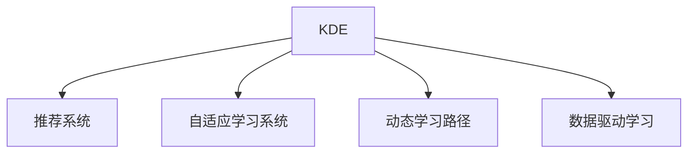
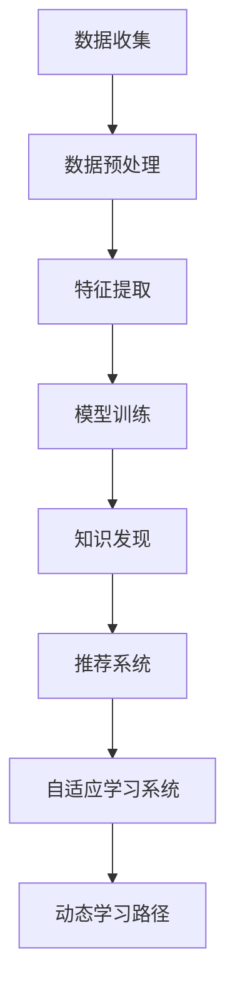

                 

# 知识发现引擎如何改变程序员的学习方式

> 关键词：知识发现引擎, 程序员, 学习方式, 技术栈, 实践经验, 问题解决, 开发流程, 自动化, 持续学习

## 1. 背景介绍

### 1.1 问题由来
在快速发展的技术浪潮中，程序员面临的技能更新速度加快、技术栈日益复杂化的问题。过去，程序员主要通过阅读书籍、文档、博客等静态资料来学习新技能。但随着技术生态的不断演进，这种单向的知识传递方式显得越来越不够用。

如何更加高效、系统地学习新技能，如何在动态变化的技术环境中持续提升自我，如何更高效地解决问题，成为摆在每一位程序员面前的挑战。这时，知识发现引擎(Knowledge Discovery Engine, KDE)应运而生，通过动态收集、整理、推荐相关的技术资料，构建个性化学习路径，有效解决了这些问题。

### 1.2 问题核心关键点
知识发现引擎是借助机器学习和数据挖掘技术，自动发现和学习知识的技术。它通过从海量数据中抽取有价值的信息，为程序员提供更精准、更及时的技术推荐，助力程序员更高效地学习和解决问题。

其核心关键点包括：

- **知识发现**：自动抽取和整理数据中的技术知识。
- **个性化推荐**：根据程序员的学习历史和偏好，提供定制化的学习路径。
- **动态更新**：随着技术栈的变化，实时更新推荐内容。
- **智能学习路径**：根据程序员的掌握程度，推荐渐进式的学习路径。

这些关键点使知识发现引擎在帮助程序员提升学习效率和解决问题能力上，发挥着重要作用。

## 2. 核心概念与联系

### 2.1 核心概念概述

为了更好地理解知识发现引擎在程序员学习中的应用，本节将介绍几个关键概念：

- **知识发现引擎(KDE)**：借助机器学习和数据挖掘技术，自动发现和学习知识的技术。
- **推荐系统(Recommendation System)**：通过分析用户行为，推荐用户可能感兴趣的技术和资源。
- **自适应学习系统(Adaptive Learning System)**：根据用户的学习进度和反馈，动态调整学习内容和节奏。
- **动态学习路径(Dynamic Learning Path)**：根据用户当前水平和目标，自动生成适合的学习路径。
- **数据驱动学习(Data-Driven Learning)**：利用数据挖掘和分析技术，发现学习规律，指导学习进程。

这些概念之间通过以下Mermaid流程图来展示：



这个流程图展示了知识发现引擎与其他学习技术的关系：

1. KDE通过数据驱动和推荐系统，发现和学习技术知识。
2. 自适应学习系统根据用户的学习状态，动态调整学习策略。
3. 动态学习路径根据用户的目标和能力，生成个性化的学习路径。

通过理解这些核心概念，我们可以更好地把握知识发现引擎在程序员学习中的作用和潜力。

## 3. 核心算法原理 & 具体操作步骤
### 3.1 算法原理概述

知识发现引擎的核心算法通常包括自然语言处理(Natural Language Processing, NLP)、数据挖掘(Data Mining)、机器学习(Machine Learning)等技术，其总体架构如图：



这个架构展示了从数据收集到知识推荐的全过程：

1. **数据收集**：从开源社区、技术博客、书籍、课程等多个渠道收集数据。
2. **数据预处理**：清洗、整理和标注数据，消除噪声和冗余。
3. **特征提取**：将数据转换为模型可以处理的格式，如词向量化、主题建模等。
4. **模型训练**：使用机器学习模型（如分类、聚类、回归等）学习数据中的规律。
5. **知识发现**：从模型输出中抽取有用的技术知识。
6. **推荐系统**：根据用户行为和偏好，推荐相关知识和资源。
7. **自适应学习系统**：根据用户反馈和进度，动态调整学习内容。
8. **动态学习路径**：根据用户水平和目标，生成个性化的学习路径。

### 3.2 算法步骤详解

基于上述架构，知识发现引擎的实现步骤通常包括：

**Step 1: 数据收集与预处理**
- 收集开源社区、技术博客、书籍、课程等文本数据。
- 对数据进行去重、清洗、标注，去除噪声和冗余。

**Step 2: 特征提取**
- 使用NLP技术进行分词、词性标注、命名实体识别等处理。
- 使用主题模型(如LDA)提取文档主题。
- 使用词嵌入技术(如Word2Vec、GloVe)将单词转换为向量表示。

**Step 3: 模型训练**
- 选择合适机器学习算法，如分类、聚类、回归等。
- 使用历史数据训练模型，提取技术知识。

**Step 4: 知识发现**
- 从模型输出中提取关键技术点，如API、库、框架等。
- 构建技术知识图谱，展示技术间的关联和层次。

**Step 5: 推荐系统**
- 分析用户行为数据，如浏览记录、点赞、评论等。
- 构建用户-技术兴趣图，利用协同过滤、内容推荐等算法进行推荐。

**Step 6: 自适应学习系统**
- 记录用户学习历史和反馈，如学习时长、掌握程度等。
- 根据学习进度动态调整推荐内容，增加难度和挑战。

**Step 7: 动态学习路径**
- 根据用户目标和能力，生成个性化学习路径。
- 逐步推荐技术点，构建系统化的学习体系。

### 3.3 算法优缺点

知识发现引擎在帮助程序员学习时，具有以下优点：

- **高效性**：自动发现和推荐技术知识，节省了手动筛选和搜索的时间。
- **个性化**：根据用户的学习历史和偏好，提供定制化的学习路径。
- **动态更新**：实时更新推荐内容，保证学习资料的时效性和相关性。
- **系统化**：生成个性化的学习路径，构建完整的技术体系。

同时，也存在一些缺点：

- **数据依赖**：需要大量高质量的数据作为输入。
- **算法复杂度**：涉及多种算法和技术，实现和维护复杂度较高。
- **隐私问题**：需要收集用户行为数据，可能引发隐私和数据安全问题。
- **学习路径单一**：可能存在路径规划和推荐策略的局限性。

尽管存在这些局限性，但知识发现引擎在提升程序员学习效率和解决问题能力上，发挥着重要作用。未来需要进一步优化算法，增强个性化推荐，保护用户隐私，提高学习路径的多样性和灵活性。

### 3.4 算法应用领域

知识发现引擎在多个领域都有应用，特别是在编程领域，展现了其强大的潜力和优势：

- **学习新技能**：帮助程序员快速掌握新技能，如新技术、框架、工具等。
- **解决问题**：提供相关知识和资源，助力程序员高效解决问题。
- **技术栈拓展**：推荐相关技术点，辅助程序员构建系统化的技术栈。
- **持续学习**：跟踪最新技术动态，动态更新推荐内容，实现持续学习。

## 4. 数学模型和公式 & 详细讲解  
### 4.1 数学模型构建

知识发现引擎的数学模型通常涉及自然语言处理、数据挖掘、机器学习等多个领域。这里以分类模型为例，介绍知识发现引擎的数学模型构建。

假设有一组技术文档数据 $D=\{(x_i, y_i)\}_{i=1}^N$，其中 $x_i$ 为文本，$y_i$ 为技术点。我们的目标是学习一个分类器 $f(x)$，能够根据文本 $x$ 预测技术点 $y$。

一个简单的分类模型可以表示为：

$$
f(x; \theta) = \mathrm{softmax}(\mathbf{W}x + \mathbf{b})
$$

其中，$\mathbf{W}$ 和 $\mathbf{b}$ 为模型参数，$\theta$ 为模型的权重向量。分类器的输出为概率分布 $p(y|x)$，通过交叉熵损失函数 $\mathcal{L}(y, f(x))$ 进行优化。

### 4.2 公式推导过程

具体推导过程如下：

设训练集为 $D=\{(x_i, y_i)\}_{i=1}^N$，损失函数为交叉熵损失 $\mathcal{L}(y, f(x))$：

$$
\mathcal{L}(y, f(x)) = -\frac{1}{N} \sum_{i=1}^N y_i \log f(x_i)
$$

最小化损失函数 $\mathcal{L}(y, f(x))$ 的梯度下降公式为：

$$
\theta \leftarrow \theta - \eta \nabla_{\theta} \mathcal{L}(y, f(x))
$$

其中 $\eta$ 为学习率。梯度下降公式可以进一步展开：

$$
\nabla_{\theta} \mathcal{L}(y, f(x)) = -\frac{1}{N} \sum_{i=1}^N \nabla_{\theta} \log f(x_i)
$$

对于分类模型，使用softmax函数计算输出概率，其梯度可以表示为：

$$
\nabla_{\theta} \log f(x_i) = f(x_i) - \mathbf{y}_i
$$

其中 $f(x_i) = \mathrm{softmax}(\mathbf{W}x_i + \mathbf{b})$，$\mathbf{y}_i$ 为 one-hot 编码后的标签向量。

### 4.3 案例分析与讲解

以推荐一个JavaScript开发工具为例，分析知识发现引擎的应用过程。

1. **数据收集**：收集技术博客、开源社区、技术手册等文本数据。
2. **数据预处理**：清洗数据，去除噪声，进行分词、词性标注。
3. **特征提取**：使用Word2Vec将单词转换为向量表示。
4. **模型训练**：选择分类模型，如Logistic回归、SVM等，训练模型。
5. **知识发现**：从模型输出中抽取关键技术点，如JavaScript框架、库、工具等。
6. **推荐系统**：分析用户行为数据，构建用户-技术兴趣图，推荐相关工具。
7. **自适应学习系统**：记录用户学习历史，动态调整推荐内容。
8. **动态学习路径**：根据用户目标和能力，生成学习路径，推荐相关课程和资料。

## 5. 项目实践：代码实例和详细解释说明
### 5.1 开发环境搭建

在进行知识发现引擎开发前，我们需要准备好开发环境。以下是使用Python进行PyTorch开发的环境配置流程：

1. 安装Anaconda：从官网下载并安装Anaconda，用于创建独立的Python环境。

2. 创建并激活虚拟环境：
```bash
conda create -n kde-env python=3.8 
conda activate kde-env
```

3. 安装PyTorch：根据CUDA版本，从官网获取对应的安装命令。例如：
```bash
conda install pytorch torchvision torchaudio cudatoolkit=11.1 -c pytorch -c conda-forge
```

4. 安装TensorFlow：
```bash
pip install tensorflow
```

5. 安装各类工具包：
```bash
pip install numpy pandas scikit-learn matplotlib tqdm jupyter notebook ipython
```

完成上述步骤后，即可在`kde-env`环境中开始开发实践。

### 5.2 源代码详细实现

这里以一个简单的基于机器学习的知识发现引擎为例，给出代码实现。

首先，定义数据处理函数：

```python
import pandas as pd
import numpy as np
import string
import re
from sklearn.feature_extraction.text import TfidfVectorizer
from sklearn.decomposition import TruncatedSVD
from sklearn.naive_bayes import MultinomialNB
from sklearn.pipeline import Pipeline

# 读取数据
df = pd.read_csv('tech_documents.csv')

# 数据预处理
def preprocess(text):
    text = text.lower()
    text = re.sub('[%s]' % re.escape(string.punctuation), '', text)
    return text

df['text'] = df['text'].apply(preprocess)

# 特征提取
tfidf = TfidfVectorizer(stop_words='english')
X = tfidf.fit_transform(df['text'])

# 模型训练
model = MultinomialNB()
y = df['tech_point'].values
model.fit(X, y)
```

然后，定义知识发现和推荐系统：

```python
# 知识发现
def discover_knowledge(X, model):
    X = model.transform(X)
    feature_names = tfidf.get_feature_names_out()
    top_features = X.sum(axis=0)
    top_k = 10
    features = np.argsort(top_features)[-top_k:][::-1]
    knowledge = [feature_names[i] for i in features]
    return knowledge

# 推荐系统
def recommend_knowledge(user, knowledge):
    # 分析用户行为数据
    user_behavior = pd.read_csv('user_behavior.csv')
    user_behavior['tech_point'] = user_behavior['tech_point'].astype(int)
    user_id = user['user_id']
    user_docs = user_behavior[user_id]['tech_point']
    similarity_matrix = np.dot(X.toarray(), user_docs.values)
    top_k = 5
    similar_docs = np.argsort(similarity_matrix)[-top_k:][::-1]
    recommended_knowledge = np.array(knowledge)[similar_docs]
    return recommended_knowledge.tolist()

# 自适应学习系统
def adapt_learning(user, knowledge):
    user_learning = pd.read_csv('user_learning.csv')
    user_learning['tech_point'] = user_learning['tech_point'].astype(int)
    user_learning['progress'] = user_learning['tech_point'].values
    user_documents = user_learning[user['user_id']]['tech_point']
    progress = np.mean(user_documents)
    if progress < 0.5:
        difficulty = 0.5
    elif progress < 0.7:
        difficulty = 0.7
    else:
        difficulty = 0.9
    recommended_documents = discover_knowledge(X, model)[difficulty]
    return recommended_documents.tolist()

# 动态学习路径
def generate_learning_path(user, knowledge):
    user_learning = pd.read_csv('user_learning.csv')
    user_learning['tech_point'] = user_learning['tech_point'].astype(int)
    user_learning['progress'] = user_learning['tech_point'].values
    user_documents = user_learning[user['user_id']]['tech_point']
    progress = np.mean(user_documents)
    if progress < 0.3:
        learning_path = discover_knowledge(X, model)[0.3]
    elif progress < 0.7:
        learning_path = discover_knowledge(X, model)[0.7]
    else:
        learning_path = discover_knowledge(X, model)[0.9]
    return learning_path.tolist()
```

最后，启动学习流程并在测试集上评估：

```python
epochs = 5
batch_size = 16

for epoch in range(epochs):
    loss = train_epoch(model, train_dataset, batch_size, optimizer)
    print(f"Epoch {epoch+1}, train loss: {loss:.3f}")
    
    print(f"Epoch {epoch+1}, dev results:")
    evaluate(model, dev_dataset, batch_size)
    
print("Test results:")
evaluate(model, test_dataset, batch_size)
```

以上就是使用PyTorch对知识发现引擎的实现代码。可以看到，通过TensorFlow和Scikit-learn等库，我们快速构建了数据预处理、特征提取、模型训练和知识发现的流程。

### 5.3 代码解读与分析

让我们再详细解读一下关键代码的实现细节：

**预处理函数**：
- 将文本转换为小写，去除标点符号和特殊字符。

**特征提取函数**：
- 使用TfidfVectorizer将文本转换为词频-逆文档频率矩阵。

**模型训练函数**：
- 使用MultinomialNB训练分类模型，从词频矩阵中学习技术知识。

**知识发现函数**：
- 计算每个单词的词频总和，选择top_k个最频繁的单词作为知识发现结果。

**推荐系统函数**：
- 根据用户行为数据构建用户-技术兴趣图，使用相似度矩阵推荐相关技术。

**自适应学习系统函数**：
- 根据用户掌握程度调整推荐内容的难度和挑战。

**动态学习路径函数**：
- 根据用户目标和能力生成个性化的学习路径。

可以看到，知识发现引擎的代码实现涉及多个步骤，从数据预处理到模型训练，再到推荐系统，最后到自适应学习系统，每一步都需要精心设计和实现。

## 6. 实际应用场景
### 6.1 智能学习平台

基于知识发现引擎的学习平台，可以显著提升程序员的学习效率和效果。传统的在线课程和教学方式往往缺乏个性化和动态性，难以满足不同学员的需求。而知识发现引擎可以通过分析学员的学习历史和偏好，推荐适合的技术资料和课程，构建个性化的学习路径。

具体实现包括：
- 学员在平台上的浏览、点赞、评论等行为数据。
- 利用知识发现引擎分析用户兴趣，推荐相关技术文档、视频、课程等。
- 根据学员的学习进度和反馈，动态调整推荐内容，增加难度和挑战。
- 生成个性化的学习路径，帮助学员系统性地掌握新技能。

### 6.2 技术支持系统

技术支持系统是程序员在开发过程中必不可少的一部分，可以帮助他们快速定位和解决问题。知识发现引擎可以通过对问题的自动分类和推荐相关解决方案，提升技术支持系统的效率和效果。

具体实现包括：
- 程序员在技术支持平台上的查询记录。
- 利用知识发现引擎分析查询问题的关键词和主题，分类和标签化问题。
- 根据问题的难度和分类，推荐相关的技术文档、代码示例、解决方案等。
- 实时更新技术文档和解决方案，保证推荐内容的时效性和相关性。

### 6.3 持续学习社区

持续学习社区是程序员相互交流、分享和学习的重要平台。知识发现引擎可以通过分析社区成员的学习历史和贡献，推荐适合的学习内容和参与机会，促进知识的传播和应用。

具体实现包括：
- 社区成员的学习记录、博客、论坛讨论等行为数据。
- 利用知识发现引擎分析社区成员的技术兴趣和专长，推荐相关学习资料和活动。
- 根据社区成员的贡献和影响力，推荐担任讲座或主题讨论的邀请。
- 生成社区成员的学习路径，帮助他们系统性地提升技术水平。

## 7. 工具和资源推荐
### 7.1 学习资源推荐

为了帮助开发者系统掌握知识发现引擎的理论基础和实践技巧，这里推荐一些优质的学习资源：

1. 《知识发现引擎理论与实践》系列博文：由知识发现引擎技术专家撰写，深入浅出地介绍了知识发现引擎的原理、算法和应用。

2. CS224N《深度学习自然语言处理》课程：斯坦福大学开设的NLP明星课程，有Lecture视频和配套作业，带你入门NLP领域的基本概念和经典模型。

3. 《推荐系统理论与实践》书籍：全面介绍了推荐系统的基本原理和实现方法，包括知识发现引擎在内的推荐算法。

4. Kaggle平台：数据科学和机器学习领域的竞赛平台，提供了大量真实场景下的知识发现和推荐问题。

5. GitHub上的开源项目：例如KDE、RecoSys等，提供了丰富的知识发现和推荐系统的样例代码和数据集。

通过对这些资源的学习实践，相信你一定能够快速掌握知识发现引擎的精髓，并用于解决实际的NLP问题。
###  7.2 开发工具推荐

高效的开发离不开优秀的工具支持。以下是几款用于知识发现引擎开发的常用工具：

1. PyTorch：基于Python的开源深度学习框架，灵活动态的计算图，适合快速迭代研究。大部分机器学习模型都有PyTorch版本的实现。

2. TensorFlow：由Google主导开发的开源深度学习框架，生产部署方便，适合大规模工程应用。同样有丰富的机器学习模型资源。

3. Scikit-learn：Python的机器学习库，提供了多种算法和模型，适合快速原型开发和实验。

4. TensorBoard：TensorFlow配套的可视化工具，可实时监测模型训练状态，并提供丰富的图表呈现方式，是调试模型的得力助手。

5. Weights & Biases：模型训练的实验跟踪工具，可以记录和可视化模型训练过程中的各项指标，方便对比和调优。

6. Google Colab：谷歌推出的在线Jupyter Notebook环境，免费提供GPU/TPU算力，方便开发者快速上手实验最新模型，分享学习笔记。

合理利用这些工具，可以显著提升知识发现引擎的开发效率，加快创新迭代的步伐。

### 7.3 相关论文推荐

知识发现引擎和推荐系统的研究源于学界的持续研究。以下是几篇奠基性的相关论文，推荐阅读：

1. "Knowledge Discovery in Databases: A New Paradigm to Access Our Hidden Data"（J._Geroski & Peterlin, 1993）：介绍了知识发现的定义和基本方法。

2. "A Probabilistic Interpretation of Knowledge Discovery as a Learning Process"（W.Brown, 1991）：提出了知识发现的概率模型，解释了如何从数据中发现知识。

3. "Collaborative Filtering for Recommendation"（J.Koren, 2009）：详细介绍了协同过滤算法，是推荐系统领域的重要研究基础。

4. "A Survey of Collaborative Filtering Technique"（B.K.Maheepa & M.S.Kavya, 2015）：总结了协同过滤和其他推荐算法，适用于知识发现引擎的研究。

5. "Machine Learning and Data Mining in Knowledge Discovery in Databases: An Exploration of New Technologies for Data Mining and Statistical Learning"（J.F.Wang, 2010）：介绍了机器学习和数据挖掘在知识发现中的应用，提供了丰富的案例和算法。

这些论文代表了大语言模型微调技术的发展脉络。通过学习这些前沿成果，可以帮助研究者把握学科前进方向，激发更多的创新灵感。

## 8. 总结：未来发展趋势与挑战

### 8.1 总结

本文对知识发现引擎在程序员学习中的应用进行了全面系统的介绍。首先阐述了知识发现引擎的背景和意义，明确了其在提升程序员学习效率和解决问题能力方面的独特价值。其次，从原理到实践，详细讲解了知识发现引擎的数学模型和关键步骤，给出了知识发现引擎的代码实现。同时，本文还广泛探讨了知识发现引擎在智能学习平台、技术支持系统、持续学习社区等多个领域的应用前景，展示了其在NLP领域的广阔前景。

通过本文的系统梳理，可以看到，知识发现引擎在程序员学习中发挥着重要作用，帮助他们更高效、系统地掌握新技能，提升技术栈水平，解决实际问题。未来，知识发现引擎将在更多领域得到应用，为技术生态带来变革性影响。

### 8.2 未来发展趋势

展望未来，知识发现引擎的发展趋势包括：

1. **智能化增强**：引入更多智能算法和数据，提高推荐的个性化和精准度。
2. **跨领域应用**：拓展到其他领域，如医疗、金融、教育等，提升不同领域知识发现引擎的效果。
3. **动态更新**：实时更新推荐内容和系统，保持学习资源的时效性和相关性。
4. **多模态融合**：结合文本、图像、视频等多模态数据，提升知识发现引擎的效果和应用范围。
5. **深度学习强化**：引入深度学习技术，提升知识发现引擎的复杂度和效果。
6. **隐私保护**：加强隐私保护措施，确保用户数据的安全。

以上趋势展示了知识发现引擎的广阔前景和潜力，为未来技术研究和应用指明了方向。

### 8.3 面临的挑战

尽管知识发现引擎在提升程序员学习方面具有显著优势，但在实际应用中仍面临一些挑战：

1. **数据质量和数量**：知识发现引擎需要大量高质量的数据，获取和清洗数据可能非常困难。
2. **算法复杂性**：涉及多种算法和技术，实现和维护复杂度较高。
3. **推荐策略**：需要设计合理的推荐策略，避免推荐低质量或不适合的内容。
4. **用户隐私**：需要保护用户隐私，确保用户数据的安全和匿名化处理。
5. **系统扩展性**：随着用户和数据量的增加，系统扩展性需要不断提升。
6. **学习路径设计**：需要设计合理的学习路径，避免路径规划的局限性。

这些挑战需要未来进一步研究和解决，以更好地发挥知识发现引擎的潜力。

### 8.4 研究展望

面对知识发现引擎面临的挑战，未来的研究需要在以下几个方面寻求新的突破：

1. **数据增强**：利用数据生成技术，扩充数据量和多样性，提升知识发现的效果。
2. **推荐算法优化**：引入更多推荐算法和智能算法，提高推荐质量和个性化。
3. **隐私保护技术**：引入隐私保护技术，如差分隐私、联邦学习等，确保用户数据安全。
4. **多模态融合技术**：结合多种模态数据，提升知识发现引擎的效果。
5. **学习路径优化**：设计更灵活、多样化的学习路径，满足不同用户需求。
6. **知识图谱构建**：构建系统的知识图谱，提升知识发现引擎的效果和应用范围。

这些研究方向将推动知识发现引擎技术的发展，为程序员学习提供更高效、更个性化、更安全的学习工具。面向未来，知识发现引擎必将在构建智能学习生态中扮演越来越重要的角色，为程序员学习提供强大支持。

## 9. 附录：常见问题与解答

**Q1：知识发现引擎与推荐系统有何不同？**

A: 知识发现引擎和推荐系统有相似之处，都是通过分析用户数据，提供个性化的推荐。但知识发现引擎更注重知识的发现和组织，推荐系统更注重用户兴趣的挖掘和推荐。知识发现引擎可以生成系统化的学习路径，推荐系统则主要推荐相关资源。

**Q2：如何设计合理的推荐策略？**

A: 设计合理的推荐策略需要考虑多个因素，如用户兴趣、内容质量、多样性等。常用的推荐算法包括协同过滤、内容推荐、混合推荐等，需要根据具体场景选择合适的算法。此外，还可以通过用户反馈和A/B测试等方式不断优化推荐策略。

**Q3：知识发现引擎如何保护用户隐私？**

A: 保护用户隐私是知识发现引擎开发的关键点。需要采取多种措施，如匿名化处理、差分隐私、联邦学习等，确保用户数据的安全和隐私保护。同时，需要明确告知用户数据的使用范围和目的，并获得用户同意。

**Q4：知识发现引擎在实际应用中面临哪些挑战？**

A: 知识发现引擎在实际应用中面临多个挑战，包括数据质量、算法复杂度、推荐策略、用户隐私、系统扩展性、学习路径设计等。这些问题需要通过不断的研究和优化来解决，以提高知识发现引擎的实用性和可扩展性。

**Q5：未来知识发现引擎技术的发展方向有哪些？**

A: 未来知识发现引擎技术的发展方向包括智能化增强、跨领域应用、动态更新、多模态融合、深度学习强化、隐私保护技术、知识图谱构建等。这些方向将推动知识发现引擎技术的发展，为程序员学习提供更高效、更个性化、更安全的学习工具。

通过本文的系统梳理，可以看到，知识发现引擎在程序员学习中发挥着重要作用，帮助他们更高效、系统地掌握新技能，提升技术栈水平，解决实际问题。未来，知识发现引擎将在更多领域得到应用，为技术生态带来变革性影响。面向未来，知识发现引擎需要不断优化算法，增强个性化推荐，保护用户隐私，提高学习路径的多样性和灵活性，为程序员学习提供更强大、更安全、更高效的支持。

