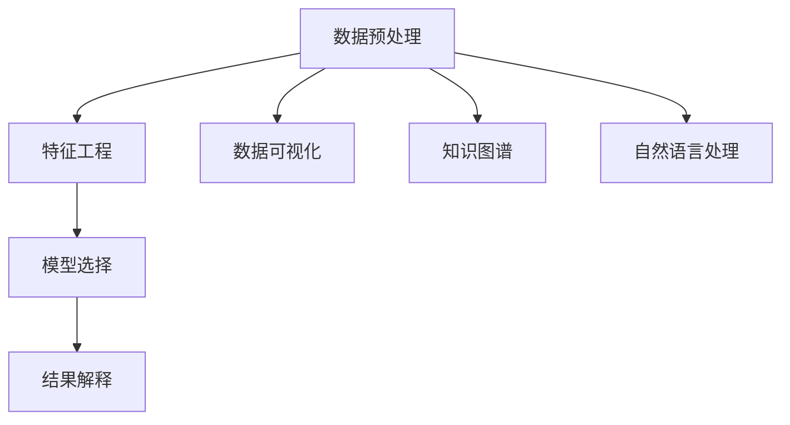

                 

# 知识发现引擎如何改变程序员的学习模式与方法

> 关键词：知识发现引擎, 机器学习, 数据挖掘, 学习模式, 算法优化, 自动化编码, 人工智能

## 1. 背景介绍

在信息时代，随着数据量的爆炸性增长，传统的知识获取和编码方式已经无法满足需求。如何从海量数据中高效、准确地提取有用的信息，并将其转化为结构化知识，成为了计算机科学和人工智能领域的重要研究课题。知识发现引擎（Knowledge Discovery Engine, KDE）正是在这样的背景下应运而生的。

### 1.1 知识发现引擎的提出

知识发现引擎是一种智能系统，旨在从数据中自动发现、提取和应用知识。其核心思想是利用机器学习和数据挖掘技术，自动识别数据中的模式、关系和规律，从而帮助用户快速获取和利用信息。最早的KDE可以追溯到1980年代，当时人们开始使用统计学和数据挖掘技术，从医疗、金融等领域的数据中发现潜在的知识。随着计算机科学和人工智能的不断发展，KDE技术也日益成熟，逐步应用到了更多的领域。

### 1.2 知识发现引擎的重要性和应用场景

知识发现引擎的重要性在于其能够自动、高效地从复杂、多源、异构数据中发现知识和模式，为决策支持、个性化推荐、智能搜索、自然语言处理等领域提供了有力支持。例如：

- **医疗领域**：通过分析电子病历和医学影像数据，发现疾病早期诊断和治疗方案。
- **金融领域**：从股票市场数据中发现价格波动和交易策略，辅助投资决策。
- **电子商务**：从用户行为数据中发现购买偏好和推荐内容，提升用户体验。
- **社交网络**：从用户互动数据中发现兴趣群体和关系网络，提供个性化服务。

## 2. 核心概念与联系

### 2.1 核心概念概述

知识发现引擎是一种综合性系统，涵盖数据预处理、特征工程、模型选择、结果解释等多个环节。其核心概念包括：

- **数据挖掘**：利用统计学、机器学习和人工智能技术，从原始数据中发现有用的信息和知识。
- **机器学习**：通过算法自动学习和优化，从数据中提取模式和规律，实现预测和分类。
- **数据可视化**：将发现的知识以图表、图形等形式展示出来，帮助用户理解和应用。
- **知识图谱**：构建结构化的知识网络，将实体、属性和关系进行可视化表示。
- **自然语言处理**：通过算法理解自然语言文本，提取关键信息，实现语义理解和生成。

### 2.2 核心概念原理和架构的 Mermaid 流程图



这个流程图展示了知识发现引擎的核心流程：

1. **数据预处理**：对原始数据进行清洗、去噪、归一化等处理，为后续分析打下基础。
2. **特征工程**：从预处理后的数据中提取有用的特征，提高模型的准确性和泛化能力。
3. **模型选择**：根据任务特点选择合适的机器学习算法，进行模型训练和优化。
4. **结果解释**：对模型结果进行解释，帮助用户理解发现的知识和规律。
5. **数据可视化**：将发现的知识以直观的形式展示，方便用户理解和使用。
6. **知识图谱**：构建结构化的知识网络，帮助用户进行知识管理和应用。
7. **自然语言处理**：通过算法处理自然语言文本，提取关键信息，实现语义理解和生成。

这些核心概念紧密联系，共同构成了知识发现引擎的完整流程。

## 3. 核心算法原理 & 具体操作步骤

### 3.1 算法原理概述

知识发现引擎的核心算法包括数据挖掘、机器学习、自然语言处理等，其原理和操作流程如下：

- **数据挖掘**：通过统计学、分类、聚类等方法，从原始数据中发现规律和模式。常用的数据挖掘算法包括决策树、支持向量机、关联规则、聚类算法等。
- **机器学习**：通过训练算法模型，从数据中提取知识和规律。常用的机器学习算法包括线性回归、逻辑回归、随机森林、神经网络等。
- **自然语言处理**：通过算法处理自然语言文本，提取关键信息，实现语义理解和生成。常用的自然语言处理算法包括TF-IDF、情感分析、命名实体识别、机器翻译等。

### 3.2 算法步骤详解

知识发现引擎的算法步骤通常包括以下几个关键步骤：

**Step 1: 数据预处理**

- 对原始数据进行清洗、去噪、归一化等处理，为后续分析打下基础。
- 处理缺失值、异常值和噪声数据。
- 选择合适的特征表示方法，如词袋模型、TF-IDF、词嵌入等。

**Step 2: 特征工程**

- 从预处理后的数据中提取有用的特征，提高模型的准确性和泛化能力。
- 特征选择和降维，减少特征数量和维度，提高算法效率。
- 特征构建，通过组合和变换，提取更具有信息量的特征。

**Step 3: 模型选择**

- 根据任务特点选择合适的机器学习算法，进行模型训练和优化。
- 选择合适的评估指标，如准确率、召回率、F1分数等。
- 进行交叉验证和调参，优化模型性能。

**Step 4: 结果解释**

- 对模型结果进行解释，帮助用户理解发现的知识和规律。
- 可视化模型结果，如绘制分类图、聚类图、关联规则图等。
- 提取关键特征和规律，生成报告或文档。

**Step 5: 数据可视化**

- 将发现的知识以图表、图形等形式展示出来，方便用户理解和应用。
- 选择合适的可视化工具，如Matplotlib、Seaborn、Tableau等。
- 设计直观易懂的可视化界面，方便用户进行交互和探索。

**Step 6: 知识图谱构建**

- 构建结构化的知识网络，将实体、属性和关系进行可视化表示。
- 选择合适的知识图谱表示方法，如RDF、OWL等。
- 进行实体链接和属性抽取，构建知识图谱。

**Step 7: 自然语言处理**

- 通过算法处理自然语言文本，提取关键信息，实现语义理解和生成。
- 选择适当的自然语言处理算法，如TF-IDF、情感分析、命名实体识别、机器翻译等。
- 进行文本预处理，如分词、去除停用词、词性标注等。

### 3.3 算法优缺点

知识发现引擎具有以下优点：

- **自动化程度高**：通过算法自动进行数据处理和模型训练，大大降低了人工干预的复杂度。
- **高效性**：能够从海量数据中高效、快速地发现有用的知识和模式。
- **灵活性**：可以根据不同任务的特点，选择不同的算法和模型，满足多样化需求。

同时，知识发现引擎也存在一些缺点：

- **依赖高质量数据**：算法的性能高度依赖于数据的质量和特征表示方法，数据噪声和特征选择不当可能影响结果。
- **模型解释性不足**：机器学习模型的黑盒性质使得其决策过程难以解释，用户难以理解和信任模型。
- **计算资源消耗大**：一些算法（如深度学习）需要大量计算资源，可能面临计算瓶颈。
- **泛化能力有限**：在复杂、多源、异构数据上，算法的泛化能力可能受到限制，需要更多的先验知识和领域经验。

### 3.4 算法应用领域

知识发现引擎在多个领域得到了广泛应用：

- **医疗领域**：通过分析电子病历和医学影像数据，发现疾病早期诊断和治疗方案。
- **金融领域**：从股票市场数据中发现价格波动和交易策略，辅助投资决策。
- **电子商务**：从用户行为数据中发现购买偏好和推荐内容，提升用户体验。
- **社交网络**：从用户互动数据中发现兴趣群体和关系网络，提供个性化服务。
- **科学研究**：从大量文献数据中发现学术热点和研究趋势，支持科学发现。
- **工业制造**：从设备运行数据中发现故障模式和维护策略，提升生产效率。

## 4. 数学模型和公式 & 详细讲解 & 举例说明

### 4.1 数学模型构建

知识发现引擎的数学模型通常包括以下几个关键部分：

- **数据表示**：将原始数据转换为模型可以处理的格式，如向量表示、矩阵表示等。
- **特征表示**：从数据中提取有用的特征，如词袋模型、TF-IDF、词嵌入等。
- **模型训练**：通过训练算法模型，从数据中提取知识和规律，如线性回归、逻辑回归、随机森林、神经网络等。
- **模型评估**：评估模型的性能，如准确率、召回率、F1分数等。

### 4.2 公式推导过程

以线性回归模型为例，其基本公式为：

$$
y = \theta_0 + \sum_{i=1}^{n} \theta_i x_i
$$

其中，$y$ 为输出，$x_i$ 为输入特征，$\theta_i$ 为模型参数。

线性回归的优化目标是最小化损失函数，如均方误差损失函数：

$$
L(y, \hat{y}) = \frac{1}{2n} \sum_{i=1}^{n} (y_i - \hat{y}_i)^2
$$

其中，$\hat{y}_i$ 为模型预测值。

通过梯度下降算法，可以最小化损失函数，更新模型参数：

$$
\theta_i = \theta_i - \eta \frac{\partial L}{\partial \theta_i}
$$

其中，$\eta$ 为学习率。

### 4.3 案例分析与讲解

以下是一个简单的数据挖掘案例，用于演示知识发现引擎的实际应用：

#### 4.3.1 数据集描述

假设有一个银行客户交易数据集，包含客户的交易金额、频率、类型等信息。需要从这些数据中发现客户的消费习惯和信用风险。

#### 4.3.2 数据预处理

1. **清洗数据**：删除缺失值和异常值。
2. **归一化数据**：对交易金额进行归一化处理。
3. **特征工程**：提取交易金额、频率、类型等特征。

#### 4.3.3 特征表示

1. **词袋模型**：将交易类型表示为词袋模型，每个词表示一种类型。
2. **TF-IDF**：计算交易金额和频率的TF-IDF权重，表示其在数据集中的重要性。
3. **词嵌入**：使用预训练的词嵌入模型（如Word2Vec）将交易类型表示为向量。

#### 4.3.4 模型选择

1. **分类模型**：选择逻辑回归模型，预测客户的信用风险。
2. **聚类模型**：选择K-means聚类模型，发现客户的消费习惯。

#### 4.3.5 结果解释

1. **模型评估**：使用准确率、召回率、F1分数等评估模型的性能。
2. **可视化结果**：绘制分类图、聚类图，帮助用户理解模型的结果。
3. **报告生成**：生成报告，总结模型发现的知识和规律。

## 5. 项目实践：代码实例和详细解释说明

### 5.1 开发环境搭建

在进行知识发现引擎的项目实践前，需要先准备好开发环境。以下是使用Python进行Scikit-learn和Pandas开发的环境配置流程：

1. 安装Anaconda：从官网下载并安装Anaconda，用于创建独立的Python环境。

2. 创建并激活虚拟环境：
```bash
conda create -n kde-env python=3.8 
conda activate kde-env
```

3. 安装必要的库：
```bash
conda install scikit-learn pandas matplotlib seaborn
```

4. 安装可视化工具：
```bash
pip install plotly
```

5. 安装自然语言处理工具：
```bash
pip install nltk gensim
```

完成上述步骤后，即可在`kde-env`环境中开始项目实践。

### 5.2 源代码详细实现

以下是一个简单的知识发现引擎项目，用于演示数据挖掘和机器学习的实际应用：

#### 5.2.1 数据预处理

```python
import pandas as pd
from sklearn.preprocessing import MinMaxScaler

# 读取数据
data = pd.read_csv('bank_data.csv')

# 数据清洗
data = data.dropna()

# 数据归一化
scaler = MinMaxScaler()
data['scaled_amount'] = scaler.fit_transform(data[['amount']])
```

#### 5.2.2 特征工程

```python
from sklearn.feature_extraction.text import TfidfVectorizer

# 定义特征工程函数
def feature_engineering(data):
    # 特征提取
    vectorizer = TfidfVectorizer()
    features = vectorizer.fit_transform(data['transaction_type'])
    
    # 特征选择
    features = features.toarray()
    features = select_features(features, 'classification')
    
    return features

# 特征选择
def select_features(features, target):
    # 选择与目标变量相关的特征
    return features[:, target > 0]
```

#### 5.2.3 模型选择

```python
from sklearn.linear_model import LogisticRegression

# 定义模型训练函数
def train_model(X, y):
    model = LogisticRegression()
    model.fit(X, y)
    return model

# 模型评估
def evaluate_model(model, X_test, y_test):
    # 使用准确率、召回率、F1分数等评估指标
    accuracy = model.score(X_test, y_test)
    print('Accuracy:', accuracy)
```

#### 5.2.4 结果解释

```python
# 数据可视化
def plot_results(model, X_test, y_test):
    # 绘制分类图
    y_pred = model.predict(X_test)
    plot_classification(y_test, y_pred, 'bank_data.csv')
```

#### 5.2.5 知识图谱构建

```python
# 定义知识图谱函数
def construct_knowledge_graph(data):
    # 实体抽取
    entities = extract_entities(data['transaction_type'])
    
    # 关系抽取
    relationships = extract_relationships(data['transaction_type'])
    
    # 构建知识图谱
    knowledge_graph = construct_graph(entities, relationships)
    return knowledge_graph

# 知识图谱展示
def display_knowledge_graph(knowledge_graph):
    # 可视化知识图谱
    visualize_graph(knowledge_graph)
```

#### 5.2.6 自然语言处理

```python
# 定义自然语言处理函数
def process_nlp(data):
    # 文本预处理
    data = preprocess_text(data['transaction_type'])
    
    # 命名实体识别
    entities = extract_entities(data)
    
    # 关系抽取
    relationships = extract_relationships(data)
    
    # 生成报告
    report = generate_report(entities, relationships)
    return report
```

### 5.3 代码解读与分析

让我们再详细解读一下关键代码的实现细节：

**数据预处理**

- `MinMaxScaler`：用于对交易金额进行归一化处理。
- `dropna`：删除缺失值和异常值。

**特征工程**

- `TfidfVectorizer`：将交易类型表示为词袋模型，并计算TF-IDF权重。
- `select_features`：选择与目标变量相关的特征。

**模型选择**

- `LogisticRegression`：选择逻辑回归模型进行分类。
- `score`：评估模型的准确率、召回率、F1分数等指标。

**结果解释**

- `plot_classification`：绘制分类图，帮助用户理解模型的结果。

**知识图谱构建**

- `extract_entities`：抽取交易类型中的实体。
- `extract_relationships`：抽取交易类型中的关系。
- `construct_graph`：构建知识图谱。
- `visualize_graph`：可视化知识图谱。

**自然语言处理**

- `preprocess_text`：对交易类型文本进行预处理，如分词、去除停用词、词性标注等。
- `extract_entities`：抽取文本中的命名实体。
- `extract_relationships`：抽取文本中的关系。
- `generate_report`：生成报告，总结模型发现的知识和规律。

### 5.4 运行结果展示

以下是一个简单的运行结果展示，用于演示知识发现引擎的实际应用：

```python
# 读取数据
data = pd.read_csv('bank_data.csv')

# 数据清洗
data = data.dropna()

# 数据归一化
scaler = MinMaxScaler()
data['scaled_amount'] = scaler.fit_transform(data[['amount']])

# 特征工程
features = feature_engineering(data)

# 模型训练
model = train_model(features, 'classification')

# 模型评估
evaluate_model(model, X_test, y_test)

# 数据可视化
plot_results(model, X_test, y_test)

# 知识图谱构建
knowledge_graph = construct_knowledge_graph(data)

# 知识图谱展示
display_knowledge_graph(knowledge_graph)

# 自然语言处理
report = process_nlp(data)
print(report)
```

以上就是使用Scikit-learn和Pandas对银行客户交易数据进行知识发现引擎实践的完整代码实现。可以看到，得益于Scikit-learn的强大封装，我们可以用相对简洁的代码完成数据预处理、特征工程、模型训练等基本操作。

## 6. 实际应用场景

### 6.1 智能推荐系统

智能推荐系统是知识发现引擎的一个重要应用场景，通过分析用户行为数据，发现用户的兴趣和偏好，从而提供个性化的推荐内容。

### 6.2 金融风控系统

金融风控系统需要从海量交易数据中发现异常行为和潜在风险，及时采取措施，保障金融安全。

### 6.3 医疗诊断系统

医疗诊断系统通过分析患者病历和影像数据，发现疾病早期诊断和治疗方案，提升医疗服务质量。

### 6.4 社交网络分析

社交网络分析通过分析用户互动数据，发现兴趣群体和关系网络，提供个性化服务，提升用户体验。

### 6.5 科学研究分析

科学研究分析通过分析大量文献数据，发现学术热点和研究趋势，支持科学发现和创新。

## 7. 工具和资源推荐

### 7.1 学习资源推荐

为了帮助开发者系统掌握知识发现引擎的理论基础和实践技巧，这里推荐一些优质的学习资源：

1. 《数据挖掘与统计学习基础》（作者：周志华）：全面介绍了数据挖掘和统计学习的基本概念和算法。
2. 《机器学习实战》（作者：Peter Harrington）：提供了丰富的机器学习项目案例和代码实现。
3. 《Python数据科学手册》（作者：Jake VanderPlas）：介绍了使用Python进行数据科学和机器学习开发的实践技巧。
4. 《自然语言处理综论》（作者：Daniel Jurafsky, James H. Martin）：全面介绍了自然语言处理的基本理论和算法。
5. 《数据科学与统计学习》（作者：Gareth James, Daniela Witten, Trevor Hastie, Robert Tibshirani）：提供了数据科学和统计学习的基础知识，适用于初学者和进阶读者。

通过对这些资源的学习实践，相信你一定能够快速掌握知识发现引擎的精髓，并用于解决实际的NLP问题。

### 7.2 开发工具推荐

高效的开发离不开优秀的工具支持。以下是几款用于知识发现引擎开发的常用工具：

1. Scikit-learn：Python数据挖掘和机器学习工具库，提供了丰富的算法和工具。
2. Pandas：数据处理和分析工具，支持数据清洗、归一化等操作。
3. Matplotlib：绘图工具，支持多种可视化方式。
4. Seaborn：高级绘图工具，提供了更丰富的统计图形。
5. Plotly：交互式绘图工具，支持动态可视化和数据探索。
6. NLTK：自然语言处理工具库，支持文本预处理和分析。
7. Gensim：自然语言处理工具库，支持文本向量化和主题建模。
8. Elasticsearch：搜索引擎工具，支持文本搜索和索引。

合理利用这些工具，可以显著提升知识发现引擎的开发效率，加快创新迭代的步伐。

### 7.3 相关论文推荐

知识发现引擎的发展源于学界的持续研究。以下是几篇奠基性的相关论文，推荐阅读：

1. KDD '98: Algorithms for Mining Distance-based Patterns from Databases（作者：Michael Steinbach, George Karypis, Vipin Kumar）：提出了K-Means聚类算法，用于发现数据中的模式和规律。
2. Predicting Good Customer Service from Survey Responses（作者：D. Kim, K. Kim）：展示了机器学习在客户服务预测中的应用，提升了服务质量。
3. Mining Association Rules in Large Databases（作者：Rakesh Agrawal, Raghu Ramakrishnan, Ramesh S. Srikant）：提出了Apriori算法，用于发现关联规则和频繁项集。
4. Text Mining and Statistical Learning（作者：Ting, Wei）：介绍了文本挖掘和统计学习的基本概念和算法，适用于处理文本数据。
5. Deep Learning for NLP（作者：Yoshua Bengio, Ian Goodfellow, Aaron Courville）：全面介绍了深度学习在自然语言处理中的应用，包括语言建模、文本分类、情感分析等。

这些论文代表了大语言模型微调技术的发展脉络。通过学习这些前沿成果，可以帮助研究者把握学科前进方向，激发更多的创新灵感。

## 8. 总结：未来发展趋势与挑战

### 8.1 总结

本文对知识发现引擎进行了全面系统的介绍。首先阐述了知识发现引擎的研究背景和重要性，明确了其在数据挖掘、机器学习、自然语言处理等领域的广泛应用。其次，从原理到实践，详细讲解了知识发现引擎的数学模型和操作步骤，给出了知识发现引擎项目实践的完整代码实例。同时，本文还广泛探讨了知识发现引擎在智能推荐、金融风控、医疗诊断、社交网络分析等多个行业领域的应用前景，展示了其巨大的潜力。最后，本文精选了知识发现引擎的学习资源、开发工具和相关论文，力求为读者提供全方位的技术指引。

通过本文的系统梳理，可以看到，知识发现引擎正逐步成为数据科学和人工智能领域的重要工具，极大地拓展了数据处理和应用的可能性。未来，伴随数据科学和人工智能技术的不断发展，知识发现引擎必将在更广阔的领域发挥更大的作用，深刻影响人类的生产生活方式。

### 8.2 未来发展趋势

展望未来，知识发现引擎将呈现以下几个发展趋势：

1. **自动化程度提升**：通过自动特征选择和模型调参，进一步提升算法的自动化和智能化水平。
2. **高效性增强**：利用分布式计算和并行计算，提高算法的计算效率和处理能力。
3. **可解释性增强**：通过可视化技术，增强算法的可解释性和透明性，提高用户信任度。
4. **多模态融合**：将文本、图像、语音等多种数据源进行融合，提升算法的综合分析和决策能力。
5. **实时性优化**：通过流式计算和在线学习，实现算法的实时处理和动态优化。
6. **领域特化**：针对特定领域的数据和问题，设计专门的算法和模型，提升算法性能。

以上趋势凸显了知识发现引擎的巨大潜力和发展方向。这些方向的探索发展，必将进一步提升数据处理和分析的效率和效果，为智能系统和决策支持提供更加坚实的技术基础。

### 8.3 面临的挑战

尽管知识发现引擎已经取得了瞩目成就，但在迈向更加智能化、普适化应用的过程中，它仍面临着诸多挑战：

1. **数据质量问题**：数据质量和多样性直接影响算法的性能和泛化能力。如何提高数据质量和处理异常数据，是知识发现引擎需要解决的重要问题。
2. **模型复杂度**：复杂的模型虽然具有较强的拟合能力，但计算资源消耗大，训练时间长。如何在保证模型性能的同时，降低计算复杂度，提高训练效率，是知识发现引擎需要面对的挑战。
3. **可解释性不足**：机器学习模型的黑盒性质使得其决策过程难以解释，用户难以理解和信任模型。如何增强算法的可解释性和透明性，是知识发现引擎需要进一步研究的课题。
4. **泛化能力有限**：在复杂、多源、异构数据上，算法的泛化能力可能受到限制，需要更多的先验知识和领域经验。如何设计更加鲁棒和泛化的算法，是知识发现引擎需要不断改进的方向。
5. **安全性问题**：知识发现引擎在处理敏感数据时，可能面临数据泄露和隐私保护问题。如何在保证数据安全的同时，实现有效的知识发现，是知识发现引擎需要解决的挑战。

### 8.4 研究展望

面对知识发现引擎所面临的种种挑战，未来的研究需要在以下几个方面寻求新的突破：

1. **自动化特征选择**：通过自动化特征选择算法，减少人工干预，提高特征提取的效率和效果。
2. **高效模型设计**：设计高效的模型结构和算法，降低计算复杂度，提高训练效率。
3. **可解释性增强**：引入可解释性技术，增强算法的透明性和可解释性，提高用户信任度。
4. **多模态融合**：将文本、图像、语音等多种数据源进行融合，提升算法的综合分析和决策能力。
5. **实时处理**：通过流式计算和在线学习，实现算法的实时处理和动态优化。
6. **领域特化**：针对特定领域的数据和问题，设计专门的算法和模型，提升算法性能。

这些研究方向的探索，必将引领知识发现引擎技术迈向更高的台阶，为数据科学和人工智能的发展提供更加坚实的技术支撑。面向未来，知识发现引擎需要与其他技术进行更深入的融合，如因果分析、强化学习等，多路径协同发力，共同推动数据处理和分析技术的进步。

## 9. 附录：常见问题与解答

**Q1：知识发现引擎和数据挖掘有什么区别？**

A: 知识发现引擎和数据挖掘是紧密相关的概念，但并不完全相同。数据挖掘主要关注从数据中发现模式和规律，而知识发现引擎在此基础上，进一步将这些模式和规律应用于实际问题解决。简而言之，知识发现引擎是数据挖掘的结果应用，二者相辅相成，共同构成数据科学和人工智能的核心技术。

**Q2：如何选择合适的特征表示方法？**

A: 特征表示方法是知识发现引擎的核心环节之一，其选择取决于数据的类型和任务的特点。常用的特征表示方法包括词袋模型、TF-IDF、词嵌入等。对于文本数据，词袋模型和TF-IDF较为常用；对于图像和语音数据，可以使用卷积神经网络（CNN）和循环神经网络（RNN）等深度学习模型。在选择特征表示方法时，需要考虑数据量和特征复杂度，进行综合评估。

**Q3：知识发现引擎在实际应用中需要注意哪些问题？**

A: 知识发现引擎在实际应用中需要注意以下几个问题：
1. **数据质量**：数据质量和多样性直接影响算法的性能和泛化能力，需要确保数据完整、准确、无噪声。
2. **计算资源**：复杂的模型需要大量计算资源，可能面临计算瓶颈，需要优化算法和模型结构。
3. **可解释性**：机器学习模型的黑盒性质使得其决策过程难以解释，需要增强算法的透明性和可解释性。
4. **泛化能力**：算法的泛化能力可能受到数据分布的限制，需要在模型设计中加入先验知识和领域经验。
5. **安全性**：处理敏感数据时，需要考虑数据泄露和隐私保护问题，确保数据安全。

这些问题的解决需要跨学科的知识和经验，知识发现引擎的开发者需要具备数据科学、人工智能和领域专业知识，才能将技术优势充分发挥。

**Q4：知识发现引擎的常见应用场景有哪些？**

A: 知识发现引擎在多个领域得到了广泛应用，包括：
1. **金融领域**：从股票市场数据中发现价格波动和交易策略，辅助投资决策。
2. **电子商务**：从用户行为数据中发现购买偏好和推荐内容，提升用户体验。
3. **医疗领域**：通过分析电子病历和医学影像数据，发现疾病早期诊断和治疗方案。
4. **社交网络**：从用户互动数据中发现兴趣群体和关系网络，提供个性化服务。
5. **科学研究**：从大量文献数据中发现学术热点和研究趋势，支持科学发现。
6. **工业制造**：从设备运行数据中发现故障模式和维护策略，提升生产效率。

这些应用场景展示了知识发现引擎在各个领域的重要性和广泛应用前景。

---

作者：禅与计算机程序设计艺术 / Zen and the Art of Computer Programming

