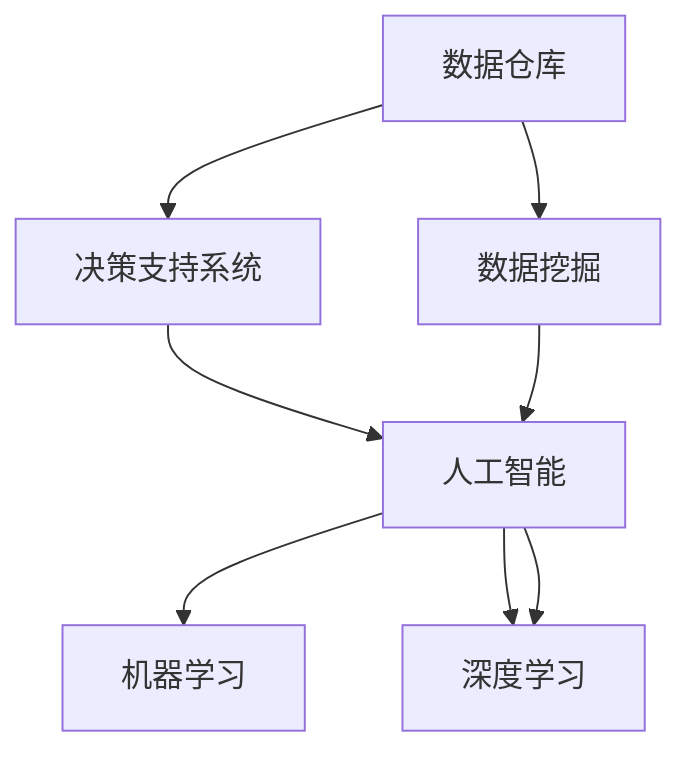

                 

# 知识发现引擎如何改变程序员的工作方式

## 1. 背景介绍

### 1.1 问题由来
在当今信息爆炸的时代，数据量呈指数级增长。如何从中快速高效地获取有用信息，成为企业决策和创新驱动的关键。传统的企业内部数据仓库和报表系统虽然能提供一定的信息聚合功能，但缺乏对数据背后知识和模式挖掘的能力。现代企业需要更加智能、灵活的数据分析工具，即知识发现(Knowledge Discovery)引擎。

### 1.2 问题核心关键点
知识发现引擎利用人工智能和机器学习技术，从海量数据中自动抽取和挖掘出知识、模式和洞察力，帮助决策者理解和利用数据。程序员作为企业信息化建设的主力军，如何高效使用和开发知识发现引擎，提高数据价值挖掘的效率，已成为亟待解决的问题。

### 1.3 问题研究意义
知识发现引擎的广泛应用，对于提升数据驱动决策能力、加快企业信息化转型、推动智能化创新具有重要意义：

1. **提升数据价值**：通过自动化、智能化的数据挖掘，发现数据中的隐含知识和模式，为决策者提供更有价值的洞见。
2. **加速信息化建设**：知识发现引擎提供从数据到知识的全链路支持，加速企业内部系统建设，降低信息不对称。
3. **促进智能化创新**：知识发现引擎与业务场景深度结合，支持业务模式创新、产品迭代和智能分析，提升企业竞争力。
4. **数据驱动决策**：知识发现引擎提供基于数据的决策支持，减少主观臆断，提高决策的科学性和精准性。
5. **支持跨领域创新**：跨领域的知识发现引擎可以将不同数据源、不同业务领域的数据整合，促进知识的交叉融合，实现跨领域的创新突破。

## 2. 核心概念与联系

### 2.1 核心概念概述

为更好地理解知识发现引擎的核心工作机制，本节将介绍几个密切相关的核心概念：

- **知识发现(Knowledge Discovery)**：通过人工智能和机器学习技术，从大量数据中自动挖掘出有价值的知识和模式。知识发现不仅仅是简单的数据检索或报表统计，而是深度挖掘数据背后的隐含信息。
- **数据仓库(Data Warehouse)**：集中存储和管理企业内部数据的系统，支持跨部门、跨时间段的查询和分析。数据仓库是知识发现的基础数据源。
- **数据挖掘(Data Mining)**：从数据中自动抽取知识和模式的过程。数据挖掘常包括分类、聚类、关联规则挖掘、异常检测等方法。
- **决策支持系统(Decision Support System, DSS)**：基于数据挖掘、知识发现的系统，提供辅助决策的支持，提升决策科学性和合理性。
- **人工智能(Artificial Intelligence, AI)**：通过模拟人类智能行为，使机器具备理解、学习、推理等能力。知识发现引擎是AI在商业应用中的重要体现。
- **机器学习(Machine Learning, ML)**：通过算法让机器自动学习和优化，以提高特定任务的性能。机器学习是实现知识发现的主要技术手段。
- **深度学习(Deep Learning, DL)**：利用多层神经网络实现对复杂数据模式的学习，是现代知识发现引擎的核心技术。

这些核心概念之间的逻辑关系可以通过以下Mermaid流程图来展示：



这个流程图展示的知识发现引擎的核心概念及其之间的关系：

1. 数据仓库是知识发现的基础数据源。
2. 数据挖掘从数据中抽取知识和模式，是知识发现的主要方法。
3. 决策支持系统基于数据挖掘结果提供辅助决策支持。
4. 人工智能是实现知识发现的高级技术，涵盖机器学习和深度学习。
5. 机器学习是实现人工智能的主要方法。
6. 深度学习是机器学习的重要分支，主要用于处理复杂数据模式。

## 3. 核心算法原理 & 具体操作步骤
### 3.1 算法原理概述

知识发现引擎的核心原理是利用机器学习算法从大量数据中挖掘出有价值的知识模式，并形成可应用的洞察力。其核心思想是：将数据看作是随机变量，通过统计模型建立变量之间的关系，自动发现变量之间的关联、依赖和趋势，从而形成知识。

知识发现引擎的算法框架通常包括数据预处理、特征工程、模型训练、知识抽取、结果解释五个步骤。

### 3.2 算法步骤详解

以下是知识发现引擎的算法步骤详解：

**Step 1: 数据预处理**
- 数据清洗：去除噪声、缺失值、异常值等。
- 数据转换：归一化、标准化、降维等，以提高数据质量。
- 数据集成：将来自不同数据源的数据整合在一起，形成统一的数据集。

**Step 2: 特征工程**
- 特征选择：根据业务需求选择最有用的特征，提升模型效率。
- 特征提取：从原始数据中提取新的特征，如文本数据的词袋模型、TF-IDF等。
- 特征转换：使用技术手段将原始特征转换为更易于模型处理的形式。

**Step 3: 模型训练**
- 选择合适的机器学习算法，如分类、回归、聚类、关联规则挖掘等。
- 设计损失函数，确定模型训练目标。
- 使用训练数据集，通过优化算法调整模型参数，最小化损失函数。

**Step 4: 知识抽取**
- 利用机器学习模型在训练集上学习知识模式。
- 通过测试集评估模型的泛化能力，验证知识抽取的准确性。
- 根据业务需求，提取有用的知识模式，形成报告和可视化。

**Step 5: 结果解释**
- 将知识模式转化为易于理解的业务洞见。
- 生成决策支持报告，提供辅助决策。
- 可视化展示知识模式，便于理解和应用。

### 3.3 算法优缺点

知识发现引擎具备以下优点：
1. 自动化程度高。从数据处理到知识抽取，整个流程自动化执行，减少了人工干预。
2. 处理能力强大。可以处理大规模、多源异构数据，发现数据中的隐含模式。
3. 灵活性高。模型选择和参数调整非常灵活，能够根据需求进行定制化开发。
4. 适用范围广。支持多种数据类型和业务场景，具有广泛的应用前景。
5. 结果可视化。通过图表、报告等形式，直观展示发现的知识模式，便于理解应用。

同时，知识发现引擎也存在一定的局限性：
1. 对数据质量要求高。如果数据存在噪声、缺失或异常，将影响模型效果。
2. 对模型选择敏感。选择合适的模型和算法，是知识发现的关键，需要具备较强的专业知识和经验。
3. 对数据分布依赖。模型需要在特定分布的数据上训练，无法处理全新或未知数据。
4. 结果解释性不足。知识发现引擎的输出结果往往缺乏可解释性，难以理解其推理过程。
5. 数据隐私风险。处理敏感数据时，需要注意数据隐私保护，防止数据泄露。

尽管存在这些局限性，知识发现引擎仍然是目前企业决策分析的重要工具。未来相关研究的重点在于如何进一步提高算法的自动化程度和鲁棒性，增强结果的可解释性和隐私保护，以及拓展其在更多业务场景中的应用。

### 3.4 算法应用领域

知识发现引擎在多个行业领域都得到了广泛应用，如：

- **零售业**：通过分析消费者行为数据，发现销售趋势、商品推荐模式等。支持个性化推荐系统，提升客户满意度。
- **金融业**：从金融交易数据中发现投资机会、风险预警信号等。支持量化投资、风险管理等。
- **医疗健康**：从患者数据中挖掘疾病模式、治疗效果等。支持医疗决策、健康管理等。
- **制造业**：从设备运行数据中发现故障模式、生产效率提升方法等。支持生产调度、设备维护等。
- **物流行业**：从运输数据中发现路线优化、库存管理策略等。支持物流成本控制、运输路径优化等。

除了上述这些经典应用外，知识发现引擎还在智慧城市、智能制造、智能家居等多个新兴领域发挥着重要作用，为各行各业带来智能化升级的机遇。

## 4. 数学模型和公式 & 详细讲解 & 举例说明

### 4.1 数学模型构建

知识发现引擎的数学模型通常包括以下几个组成部分：

1. **特征表示**：将原始数据转换为模型可以处理的向量形式，如词袋模型、TF-IDF等。
2. **模型选择**：选择合适的机器学习模型，如分类、回归、聚类等。
3. **损失函数**：设计损失函数，衡量模型预测结果与真实标签之间的差距。
4. **优化算法**：通过优化算法调整模型参数，最小化损失函数。

假设知识发现引擎的输入数据为 $X$，输出为 $Y$，特征表示为 $f(X)$，选择的机器学习模型为 $M$，损失函数为 $\mathcal{L}$，优化算法为 $\mathcal{O}$。则知识发现引擎的数学模型可以表示为：

$$
\hat{Y} = M(f(X); \theta)
$$

其中 $\theta$ 为模型参数，通过优化算法 $\mathcal{O}$ 更新，以最小化损失函数 $\mathcal{L}$：

$$
\theta^* = \mathop{\arg\min}_{\theta} \mathcal{L}(\hat{Y}, Y)
$$

以分类问题为例，常见的损失函数包括交叉熵损失、对数损失等。以下以交叉熵损失为例，推导其数学公式：

### 4.2 公式推导过程

假设 $M$ 为分类模型，输出 $y_i$ 表示输入 $x_i$ 属于某一类别的概率。真实标签为 $y^i$，则交叉熵损失公式为：

$$
\mathcal{L}(y^i, y_i) = -y^i \log y_i - (1-y^i) \log (1-y_i)
$$

对于整个数据集 $D$，经验风险函数为：

$$
\mathcal{L}(D) = \frac{1}{N} \sum_{i=1}^N \mathcal{L}(y^i, y_i)
$$

使用优化算法 $\mathcal{O}$ 最小化经验风险函数：

$$
\theta^* = \mathop{\arg\min}_{\theta} \mathcal{L}(D)
$$

优化算法通常为梯度下降或其变种，如随机梯度下降、动量梯度下降、Adam等。

以梯度下降为例，每次迭代更新参数 $\theta$ 的公式为：

$$
\theta \leftarrow \theta - \eta \nabla_{\theta}\mathcal{L}(D)
$$

其中 $\eta$ 为学习率，控制参数更新的步长。

### 4.3 案例分析与讲解

以文本分类任务为例，知识发现引擎可以将自然语言处理技术和机器学习模型结合，从文本数据中挖掘分类知识。具体实现步骤如下：

1. **数据预处理**：将文本数据转换为向量形式，如词袋模型、TF-IDF等。
2. **模型选择**：选择分类模型，如朴素贝叶斯、支持向量机、神经网络等。
3. **特征选择**：根据业务需求选择最相关的特征，提升模型效率。
4. **模型训练**：使用训练集数据，最小化交叉熵损失函数，更新模型参数。
5. **知识抽取**：在测试集上评估模型性能，提取分类知识模式。
6. **结果解释**：将分类知识转化为可理解的洞见，形成决策支持报告。

以下是一个简单的文本分类案例：

- 数据集：包含电影评论和评分，每个样本包括一段电影评论文本和相应的评分标签。
- 特征表示：使用词袋模型将文本转换为向量形式。
- 模型选择：选择朴素贝叶斯分类器。
- 损失函数：交叉熵损失。
- 优化算法：梯度下降。
- 结果解释：将分类结果转化为评分预测，辅助电影推荐系统。

### 5. 项目实践：代码实例和详细解释说明

### 5.1 开发环境搭建

在进行知识发现引擎的开发和测试前，需要准备开发环境。以下是使用Python进行scikit-learn框架开发的知识发现引擎环境配置流程：

1. 安装Anaconda：从官网下载并安装Anaconda，用于创建独立的Python环境。

2. 创建并激活虚拟环境：
```bash
conda create -n sklearn-env python=3.8 
conda activate sklearn-env
```

3. 安装scikit-learn：
```bash
conda install scikit-learn
```

4. 安装各类工具包：
```bash
pip install numpy pandas matplotlib jupyter notebook
```

完成上述步骤后，即可在`sklearn-env`环境中开始知识发现引擎的开发和测试。

### 5.2 源代码详细实现

以下是使用scikit-learn框架实现文本分类任务的知识发现引擎代码实现：

```python
from sklearn.feature_extraction.text import CountVectorizer
from sklearn.naive_bayes import MultinomialNB
from sklearn.metrics import accuracy_score
from sklearn.model_selection import train_test_split
from sklearn.pipeline import Pipeline
import pandas as pd

# 加载数据集
data = pd.read_csv('movie_reviews.csv')
text = data['review']
label = data['sentiment']

# 划分训练集和测试集
train_text, test_text, train_label, test_label = train_test_split(text, label, test_size=0.2)

# 构建特征提取器和分类器
vectorizer = CountVectorizer()
clf = MultinomialNB()

# 构建知识发现引擎的流程
pipeline = Pipeline([
    ('vectorizer', vectorizer),
    ('clf', clf)
])

# 训练模型
pipeline.fit(train_text, train_label)

# 评估模型
train_pred = pipeline.predict(train_text)
test_pred = pipeline.predict(test_text)
train_acc = accuracy_score(train_label, train_pred)
test_acc = accuracy_score(test_label, test_pred)

print(f'Train Accuracy: {train_acc:.2f}')
print(f'Test Accuracy: {test_acc:.2f}')
```

### 5.3 代码解读与分析

让我们再详细解读一下关键代码的实现细节：

**数据预处理**：
- 使用Pandas库加载数据集，使用train_test_split方法划分训练集和测试集。
- 文本数据使用CountVectorizer进行词袋模型表示，转换为向量形式。

**模型训练**：
- 选择朴素贝叶斯分类器作为模型。
- 使用Pipeline封装特征提取器和分类器，构建知识发现引擎的流程。
- 在训练集上调用fit方法训练模型，自动完成特征提取和模型训练。

**结果评估**：
- 在训练集和测试集上分别使用predict方法进行预测。
- 使用accuracy_score方法计算模型在训练集和测试集上的准确率，并进行打印输出。

可以看出，scikit-learn库为知识发现引擎的开发提供了简单易用的API接口，极大降低了算法实现难度。开发者可以将更多精力放在数据预处理、模型选择和结果解释等环节上。

## 6. 实际应用场景

### 6.1 智能推荐系统

智能推荐系统是知识发现引擎的重要应用场景之一。通过分析用户历史行为数据，发现用户的兴趣偏好和行为模式，从而推荐符合用户喜好的商品、内容或服务。

在实现上，知识发现引擎可以从用户行为数据中提取特征，使用分类模型进行用户兴趣分类，再结合用户画像和商品信息，生成推荐结果。通过持续学习和反馈机制，推荐系统能够不断优化用户画像和模型参数，提升推荐效果。

### 6.2 智能客服

智能客服系统利用知识发现引擎从历史客户咨询数据中挖掘常见问题和解决方案，形成知识库。通过自然语言处理技术和机器学习算法，自动匹配客户咨询问题和知识库中的答案，提供智能回复。

知识发现引擎可以从客户咨询记录中提取特征，使用分类或聚类模型识别出常见问题类型，自动分配至相应的知识库单元。通过上下文理解，智能客服系统能够生成更为准确的回答，提升客户满意度。

### 6.3 风险预警

风险预警系统利用知识发现引擎从历史数据中挖掘出风险模式和异常信号，为决策者提供实时预警。

在金融领域，知识发现引擎可以从历史交易数据中发现异常交易行为和潜在的风险模式，生成预警报告，帮助决策者及时采取措施。在制造业，知识发现引擎可以识别出设备的异常运行状态和潜在的故障模式，提前发出维护预警。

### 6.4 市场分析

市场分析系统通过知识发现引擎从市场数据中挖掘出市场趋势、价格波动和影响因素，提供市场分析和投资建议。

知识发现引擎可以从股票市场数据中提取特征，使用回归模型预测股票价格变化，发现市场趋势。通过关联规则挖掘，识别出影响股票价格的关键因素，形成投资建议。

## 7. 工具和资源推荐

### 7.1 学习资源推荐

为了帮助开发者系统掌握知识发现引擎的理论基础和实践技巧，这里推荐一些优质的学习资源：

1. 《机器学习实战》：通过简单的Python代码实现，深入浅出地介绍了机器学习的基本概念和经典算法，适合初学者入门。
2. 《统计学习方法》：清华大学出版社出版的经典教材，系统讲解了统计学习的基本理论和算法，适合进一步学习。
3. 《Python数据科学手册》：通过实例和代码，介绍了数据处理、机器学习、数据可视化等领域的实用技巧，适合实用学习。
4. Kaggle竞赛：参与Kaggle数据科学竞赛，实战练习知识发现引擎的应用，提升实战经验。
5. Coursera《数据科学与机器学习》课程：由斯坦福大学开设的机器学习课程，涵盖基础知识和高级技术，适合深入学习。

通过对这些资源的学习实践，相信你一定能够快速掌握知识发现引擎的精髓，并用于解决实际的业务问题。

### 7.2 开发工具推荐

高效的开发离不开优秀的工具支持。以下是几款用于知识发现引擎开发的常用工具：

1. Python：作为数据科学和机器学习的主流语言，Python提供了丰富的数据处理和机器学习库，如scikit-learn、TensorFlow、PyTorch等。
2. Jupyter Notebook：提供交互式编程环境，支持代码片段的可视化展示和快速迭代。
3. R语言：适合数据统计和可视化，提供了丰富的数据分析和机器学习库，如ggplot2、caret等。
4. Weka：开源机器学习库，提供可视化界面和多种算法实现，适合初学者快速上手。
5. RapidMiner：商业智能分析工具，提供拖放式操作界面和丰富的数据预处理功能。

合理利用这些工具，可以显著提升知识发现引擎的开发效率，加快创新迭代的步伐。

### 7.3 相关论文推荐

知识发现引擎的研究源于学界的持续探索。以下是几篇奠基性的相关论文，推荐阅读：

1. A Framework for Relational Reasoning over Knowledge Bases（王晓东等人，SIGIR 1994）：提出基于图结构的关联规则挖掘方法，为知识发现引擎奠定了基础。
2. Association Rules: Approaches to a Fundamental Problem of Knowledge Discovery（Ross Quinlan，IDKDD 1993）：介绍关联规则挖掘的基本方法和应用，是知识发现领域的经典论文。
3. Machine Learning: A Probabilistic Perspective（Kun Zhang，Springer）：全面介绍机器学习的基本理论和算法，适合进一步学习。
4. Data Mining: Concepts and Techniques（Han等人，Wiley）：经典教材，系统讲解数据挖掘的基本方法和技术。
5. KDD Cup 2021 Challenge Problem: Quantum Fridge Recommendation（Rajalakshmi等，KDD 2021）：真实数据集挑战赛，展示了知识发现引擎在实际应用中的强大能力。

这些论文代表了大语言模型微调技术的发展脉络。通过学习这些前沿成果，可以帮助研究者把握学科前进方向，激发更多的创新灵感。

## 8. 总结：未来发展趋势与挑战

### 8.1 总结

本文对知识发现引擎的核心工作原理和实现方法进行了全面系统的介绍。首先阐述了知识发现引擎的背景和研究意义，明确了其在提升数据价值、加速企业信息化转型、促进智能化创新方面的独特价值。其次，从原理到实践，详细讲解了知识发现引擎的数学模型和关键步骤，给出了知识发现引擎的代码实现。同时，本文还广泛探讨了知识发现引擎在智能推荐、智能客服、风险预警、市场分析等多个行业领域的应用前景，展示了其广阔的发展潜力。

通过本文的系统梳理，可以看到，知识发现引擎已经成为数据驱动决策的重要工具，其广泛的应用前景和发展潜力令人期待。未来，伴随技术的发展和应用的深入，知识发现引擎必将在更多领域大放异彩，为智能系统的构建和优化提供强大的数据支持。

### 8.2 未来发展趋势

展望未来，知识发现引擎将呈现以下几个发展趋势：

1. 自动化程度持续提高。随着自动化算法和工具的不断完善，知识发现引擎将更加智能化，自动化的程度将大幅提升。
2. 深度学习的应用加深。深度学习技术将进一步融入知识发现引擎，提升模型的表达能力和泛化能力。
3. 多模态融合增强。知识发现引擎将支持多模态数据的融合，利用图像、语音、视频等数据，提升对现实世界的理解能力。
4. 跨领域应用扩展。知识发现引擎将在更多领域得到应用，如智慧城市、智能制造等，为各行各业带来智能化升级的机遇。
5. 数据隐私保护加强。随着数据隐私问题的日益突出，知识发现引擎将更加注重数据隐私保护，防止数据泄露和滥用。
6. 结果可视化优化。知识发现引擎将更加注重结果的可解释性和可视化，提升决策支持的科学性和合理性。

这些趋势凸显了知识发现引擎的广阔前景。这些方向的探索发展，必将进一步提升知识发现引擎的性能和应用范围，为智能系统的构建和优化提供强有力的数据支持。

### 8.3 面临的挑战

尽管知识发现引擎已经取得了瞩目成就，但在迈向更加智能化、普适化应用的过程中，它仍面临着诸多挑战：

1. 数据质量瓶颈。数据质量直接决定模型的效果，数据预处理和清洗是知识发现引擎的核心环节。如何保证数据的高质量和一致性，是知识发现引擎的难点之一。
2. 模型泛化能力不足。现有知识发现引擎往往依赖特定领域的训练数据，对全新或未知数据泛化能力不足。如何提升模型泛化能力，增强模型在新数据上的表现，是未来的重要研究方向。
3. 结果可解释性不足。知识发现引擎的输出结果往往缺乏可解释性，难以理解其推理过程。如何提高结果的可解释性，增强模型的透明度和可信度，是知识发现引擎面临的重要挑战。
4. 计算资源消耗大。知识发现引擎需要处理大规模数据，计算资源消耗大。如何提高算法效率，减少计算资源消耗，是优化知识发现引擎的重要方向。
5. 数据隐私风险。处理敏感数据时，需要注意数据隐私保护，防止数据泄露。如何在保护隐私的同时，实现知识发现引擎的效用最大化，是未来亟待解决的问题。

尽管存在这些挑战，知识发现引擎的发展前景依然广阔。未来需要在数据质量、模型泛化、结果可解释性、计算资源和隐私保护等方面持续改进和优化，推动知识发现引擎技术的不断进步。

### 8.4 未来突破

面对知识发现引擎所面临的种种挑战，未来的研究需要在以下几个方面寻求新的突破：

1. 数据质量和清洗技术：探索自动化数据清洗和质量提升方法，提升数据预处理效率和效果。
2. 模型泛化能力提升：引入迁移学习、多任务学习等方法，提升模型在新数据上的泛化能力。
3. 结果可解释性增强：引入因果推理、可解释AI等技术，提高模型的透明度和可信度。
4. 计算资源优化：开发高效算法和优化工具，减少知识发现引擎的计算资源消耗。
5. 数据隐私保护强化：探索差分隐私、联邦学习等技术，保护数据隐私，增强数据安全性。

这些研究方向的探索，必将引领知识发现引擎技术迈向更高的台阶，为构建安全、可靠、可解释、可控的智能系统铺平道路。面向未来，知识发现引擎还需要与其他人工智能技术进行更深入的融合，如知识表示、因果推理、强化学习等，多路径协同发力，共同推动智能系统的进步。只有勇于创新、敢于突破，才能不断拓展知识发现引擎的边界，让智能技术更好地造福人类社会。

## 9. 附录：常见问题与解答

**Q1：知识发现引擎是否适用于所有数据类型？**

A: 知识发现引擎可以处理多种数据类型，如结构化数据、半结构化数据、非结构化数据等。但不同类型的数据，其特征提取和模型选择会有所不同。例如，文本数据可以使用TF-IDF等技术进行特征提取，而图像数据则可以使用卷积神经网络等技术进行处理。

**Q2：知识发现引擎是否能够处理多源异构数据？**

A: 知识发现引擎可以处理来自不同来源、不同格式的数据，只需进行统一的数据集成和预处理。通过数据融合技术，可以将多源异构数据整合在一起，形成统一的数据集，供模型进行训练和预测。

**Q3：知识发现引擎在实际应用中需要注意哪些问题？**

A: 知识发现引擎在实际应用中需要注意以下问题：
1. 数据质量：保证数据的高质量和一致性，避免噪声、缺失和异常数据对模型造成干扰。
2. 模型选择：根据业务需求选择合适的模型，并不断优化和调整模型参数。
3. 数据隐私：处理敏感数据时，注意数据隐私保护，防止数据泄露和滥用。
4. 结果解释：提高结果的可解释性，增强模型的透明度和可信度，帮助用户理解和应用结果。
5. 实时性：对于需要实时处理的应用场景，需优化算法和计算资源，提升系统响应速度。

这些问题的处理需要综合考虑技术、业务和管理等多个方面，才能充分发挥知识发现引擎的优势，实现数据的价值最大化。

---

作者：禅与计算机程序设计艺术 / Zen and the Art of Computer Programming

