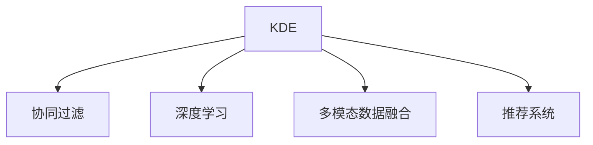

                 

# 知识发现引擎的个性化推荐算法

> 关键词：知识发现引擎,个性化推荐算法,协同过滤,深度学习,多模态数据,推荐系统

## 1. 背景介绍

### 1.1 问题由来
随着互联网的普及和数据量的爆炸性增长，信息过载和选择困难成为了新时代面临的重大挑战。如何通过智能推荐系统帮助用户在海量信息中快速找到感兴趣的内容，成为了互联网企业关注的重要问题。传统的推荐算法往往依赖于静态标签，难以捕捉用户隐式行为背后的深度偏好，导致推荐效果不尽如人意。知识发现引擎(Knowledge Discovery Engine, KDE)将大数据、人工智能、知识图谱等前沿技术融合，构建了更加智能、高效的个性化推荐系统，成为现代推荐系统的重要方向。

### 1.2 问题核心关键点
知识发现引擎利用机器学习和知识图谱技术，从多源异构数据中发现隐含知识，为推荐系统提供更加精准的用户行为预测和物品关联推荐。其核心技术包括协同过滤、深度学习、多模态数据融合等，通过联合预测用户行为、物品属性和关系，显著提升了推荐系统的性能和用户体验。

## 2. 核心概念与联系

### 2.1 核心概念概述

为更好地理解知识发现引擎的个性化推荐算法，本节将介绍几个密切相关的核心概念：

- 知识发现引擎(KDE)：通过大数据、人工智能和知识图谱等技术手段，从海量数据中提取、分析和发现知识，支持推荐系统等决策任务的系统。
- 个性化推荐算法：根据用户的历史行为、兴趣偏好等数据，预测用户对物品的评分，为其推荐最相关物品的技术。
- 协同过滤算法：一种无监督学习算法，通过用户历史行为或物品评分数据，预测用户对未评分物品的评分。
- 深度学习：一类神经网络模型，通过多层神经元的学习，能够从数据中自动抽取高级特征，提升推荐系统的性能。
- 多模态数据融合：将不同类型的数据（如文本、图像、音频等）进行融合处理，提升推荐系统的鲁棒性和精准度。
- 推荐系统：根据用户偏好和行为，向用户推荐感兴趣物品的互联网应用，旨在提高用户体验和运营效率。

这些核心概念之间的逻辑关系可以通过以下Mermaid流程图来展示：



这个流程图展示的知识发现引擎的核心概念及其之间的关系：

1. KDE通过大数据、人工智能和知识图谱等技术手段，从海量数据中提取、分析和发现知识。
2. 协同过滤算法、深度学习模型和多模态数据融合技术是KDE的主要技术手段。
3. 这些技术支持推荐系统等决策任务，为用户提供个性化推荐。

## 3. 核心算法原理 & 具体操作步骤
### 3.1 算法原理概述

知识发现引擎的个性化推荐算法基于协同过滤和深度学习两种核心技术，从多源异构数据中挖掘隐含的用户行为和物品属性信息，构建推荐模型。其核心思想是：利用用户历史行为数据和物品评分数据，通过协同过滤或深度学习模型，预测用户对未评分物品的评分，为其推荐最相关物品。

### 3.2 算法步骤详解

知识发现引擎的个性化推荐算法一般包括以下几个关键步骤：

**Step 1: 数据预处理**
- 收集用户的历史行为数据和物品评分数据，并进行清洗、标准化等预处理。
- 将用户-物品评分矩阵转化为稀疏矩阵，便于后续计算。

**Step 2: 协同过滤模型训练**
- 使用基于矩阵分解的协同过滤算法(如ALS、SVD)，对用户-物品评分矩阵进行分解，得到用户和物品的隐向量表示。
- 通过优化损失函数(如均方误差)，最小化预测评分与真实评分之间的差距，训练协同过滤模型。

**Step 3: 深度学习模型训练**
- 选择适当的深度学习模型(如DNN、RNN、GAN等)，利用用户行为数据和物品属性数据，进行特征提取和用户行为预测。
- 通过交叉熵损失等优化算法，最小化预测评分与真实评分之间的差距，训练深度学习模型。

**Step 4: 多模态数据融合**
- 收集不同类型的用户行为数据和物品属性数据，如用户画像、物品属性、图片、音频等。
- 使用多模态数据融合技术(如注意力机制、融合网络)，将这些数据进行融合处理，提升推荐系统的精准度和鲁棒性。

**Step 5: 推荐系统部署**
- 将协同过滤模型和深度学习模型的预测结果进行融合，得到最终的推荐结果。
- 使用推荐系统服务化接口，将推荐结果展示给用户，并提供互动反馈机制，进一步优化推荐算法。

### 3.3 算法优缺点

知识发现引擎的个性化推荐算法具有以下优点：
1. 可解释性高。通过用户历史行为和物品评分数据，协同过滤和深度学习算法能够提供更加精准的推荐，易于解释和理解。
2. 适用性强。适用于不同类型的数据，能够处理海量的多源异构数据，构建高质量的推荐模型。
3. 鲁棒性好。利用多模态数据融合技术，能够增强推荐系统的鲁棒性，降低数据偏差和噪声的影响。

同时，该方法也存在一定的局限性：
1. 对数据质量要求高。协同过滤和深度学习模型需要高质量的用户历史行为数据和物品评分数据，否则推荐效果会大打折扣。
2. 模型复杂度高。深度学习模型通常需要大量的计算资源和训练时间，协同过滤算法也需要对用户-物品评分矩阵进行复杂的分解计算。
3. 数据稀疏性问题。用户历史行为数据和物品评分数据通常存在稀疏性，影响模型预测的准确性。
4. 冷启动问题。新用户或新物品加入系统时，缺乏足够的行为数据或评分信息，推荐效果会受到较大影响。

尽管存在这些局限性，但就目前而言，知识发现引擎的个性化推荐算法仍是最主流、最有效的推荐方法之一。未来相关研究的重点在于如何进一步降低算法对数据质量和数据量的依赖，提高推荐系统的冷启动能力和鲁棒性。

### 3.4 算法应用领域

知识发现引擎的个性化推荐算法在电商、社交、视频、音乐等多个领域得到了广泛的应用，为这些领域的智能推荐系统提供了强大的技术支持：

- 电商推荐系统：利用用户历史购买记录、浏览行为等数据，为用户推荐感兴趣的商品，提高用户购买率和满意度。
- 社交推荐系统：利用用户社交网络关系、兴趣爱好等数据，为用户推荐好友、兴趣内容，增强社交体验。
- 视频推荐系统：利用用户历史观看记录、评分数据，为用户推荐相关视频内容，提升用户观看体验。
- 音乐推荐系统：利用用户历史听歌记录、听歌时长等数据，为用户推荐新歌、新专辑，丰富用户音乐库。
- 新闻推荐系统：利用用户历史阅读记录、浏览行为等数据，为用户推荐相关新闻内容，增强新闻阅读体验。

除了这些典型场景外，知识发现引擎的个性化推荐算法还被创新性地应用于更多领域，如旅游、教育、健康等，为推荐系统的应用场景带来了新的突破。

## 4. 数学模型和公式 & 详细讲解 & 举例说明
### 4.1 数学模型构建

在知识发现引擎的个性化推荐算法中，协同过滤和深度学习模型都可以使用矩阵分解和神经网络等数学模型进行描述。这里以协同过滤算法和深度学习模型为例，详细阐述其数学模型构建过程。

### 4.2 公式推导过程

#### 协同过滤模型

协同过滤模型通常基于用户-物品评分矩阵 $X$ 进行训练。设 $X$ 为 $m \times n$ 的稀疏矩阵，其中 $m$ 为用户数，$n$ 为物品数，$X_{ij}$ 表示用户 $i$ 对物品 $j$ 的评分。

协同过滤模型通过矩阵分解，将 $X$ 分解为用户隐向量 $U$ 和物品隐向量 $V$ 的乘积，即 $X \approx UV^T$。其中 $U$ 为 $m \times d$ 的矩阵，$V$ 为 $n \times d$ 的矩阵，$d$ 为隐向量维度。

协同过滤模型的目标是最小化预测评分 $X_{ij}^{\hat{}}$ 与真实评分 $X_{ij}$ 之间的均方误差：

$$
\min_{U,V} \frac{1}{2} ||X - UV^T||_F^2
$$

其中 $||.||_F$ 为矩阵的Frobenius范数。

使用梯度下降等优化算法，求解上述最小化问题，得到最优的隐向量 $U$ 和 $V$。

#### 深度学习模型

深度学习模型通常使用多层神经网络进行训练。这里以一个简单的前馈神经网络模型为例，说明其数学模型构建和公式推导过程。

假设 $X$ 为用户行为数据，包含 $m$ 个用户和 $n$ 个特征，即 $X \in \mathbb{R}^{m \times n}$。设 $Y$ 为用户评分数据，包含 $m$ 个用户和 $n$ 个评分，即 $Y \in \mathbb{R}^{m \times n}$。

定义一个前馈神经网络模型 $M_{\theta}$，其中 $\theta$ 为模型参数，包含权重矩阵和偏置项。模型的预测输出为 $Y_{\hat{}} = M_{\theta}(X)$，其中 $Y_{\hat{}} \in \mathbb{R}^{m \times n}$。

深度学习模型的目标是最小化预测评分 $Y_{\hat{}}$ 与真实评分 $Y$ 之间的均方误差：

$$
\min_{\theta} \frac{1}{2} ||Y - Y_{\hat{}}||_F^2
$$

使用梯度下降等优化算法，求解上述最小化问题，得到最优的模型参数 $\theta$。

### 4.3 案例分析与讲解

#### 案例1: 电商推荐系统

电商推荐系统利用用户历史购买记录和浏览行为数据，构建协同过滤和深度学习模型。协同过滤模型通过矩阵分解，得到用户和物品的隐向量表示，预测用户对未购买物品的评分。深度学习模型通过特征提取和分类器，预测用户对物品的评分，为推荐系统提供精准的用户行为预测。

具体步骤如下：
1. 收集用户历史购买记录 $X_{buy}$ 和浏览行为 $X_{browse}$，并将用户-物品评分矩阵 $X_{buy}$ 转化为稀疏矩阵。
2. 使用矩阵分解算法，对 $X_{buy}$ 进行分解，得到用户隐向量 $U$ 和物品隐向量 $V$。
3. 使用深度学习模型，对 $X_{browse}$ 进行特征提取，得到用户行为表示 $Z$。
4. 利用协同过滤和深度学习模型的预测结果，进行融合处理，得到最终的推荐结果。

#### 案例2: 视频推荐系统

视频推荐系统利用用户历史观看记录和评分数据，构建协同过滤和深度学习模型。协同过滤模型通过矩阵分解，得到用户和视频的隐向量表示，预测用户对未观看视频的评分。深度学习模型通过特征提取和分类器，预测用户对视频的评分，为推荐系统提供精准的用户行为预测。

具体步骤如下：
1. 收集用户历史观看记录 $X_{watch}$ 和评分数据 $X_{rate}$，并将用户-视频评分矩阵 $X_{watch}$ 转化为稀疏矩阵。
2. 使用矩阵分解算法，对 $X_{watch}$ 进行分解，得到用户隐向量 $U$ 和视频隐向量 $V$。
3. 使用深度学习模型，对 $X_{watch}$ 和 $X_{rate}$ 进行特征提取，得到用户行为表示 $Z$。
4. 利用协同过滤和深度学习模型的预测结果，进行融合处理，得到最终的推荐结果。

通过以上两个案例，可以看到，知识发现引擎的个性化推荐算法能够结合协同过滤和深度学习技术，从多源异构数据中提取用户行为和物品属性信息，构建高质量的推荐模型。

## 5. 项目实践：代码实例和详细解释说明
### 5.1 开发环境搭建

在进行个性化推荐算法实践前，我们需要准备好开发环境。以下是使用Python进行TensorFlow开发的环境配置流程：

1. 安装Anaconda：从官网下载并安装Anaconda，用于创建独立的Python环境。

2. 创建并激活虚拟环境：
```bash
conda create -n recommendation-env python=3.8 
conda activate recommendation-env
```

3. 安装TensorFlow：根据CUDA版本，从官网获取对应的安装命令。例如：
```bash
conda install tensorflow -c conda-forge
```

4. 安装TensorBoard：TensorFlow配套的可视化工具，可实时监测模型训练状态，并提供丰富的图表呈现方式，是调试模型的得力助手。
```bash
pip install tensorboard
```

5. 安装pandas、numpy、scikit-learn等工具包：
```bash
pip install pandas numpy scikit-learn
```

完成上述步骤后，即可在`recommendation-env`环境中开始个性化推荐算法开发。

### 5.2 源代码详细实现

这里以电商推荐系统为例，给出使用TensorFlow进行协同过滤和深度学习模型开发的PyTorch代码实现。

首先，定义协同过滤模型：

```python
import tensorflow as tf

class CollaborativeFiltering(tf.keras.Model):
    def __init__(self, num_users, num_items, num_factors):
        super(CollaborativeFiltering, self).__init__()
        self.num_users = num_users
        self.num_items = num_items
        self.num_factors = num_factors
        
        self.user_factors = tf.Variable(tf.random.normal([num_users, num_factors]))
        self.item_factors = tf.Variable(tf.random.normal([num_items, num_factors]))
        
    def call(self, X):
        # 计算用户-物品评分矩阵
        user_embeddings = tf.expand_dims(tf.linalg.matmul(X, self.user_factors), axis=2)
        item_embeddings = tf.expand_dims(tf.linalg.matmul(X, self.item_factors), axis=1)
        predictions = tf.reduce_sum(user_embeddings * item_embeddings, axis=-1)
        return predictions
```

然后，定义深度学习模型：

```python
import tensorflow as tf

class DNN(tf.keras.Model):
    def __init__(self, num_users, num_items, num_factors, hidden_units=[128, 64]):
        super(DNN, self).__init__()
        self.num_users = num_users
        self.num_items = num_items
        self.num_factors = num_factors
        
        self.user_embedding = tf.keras.layers.Embedding(num_users, num_factors, input_length=1)
        self.item_embedding = tf.keras.layers.Embedding(num_items, num_factors, input_length=1)
        
        self.dense1 = tf.keras.layers.Dense(hidden_units[0], activation='relu')
        self.dense2 = tf.keras.layers.Dense(hidden_units[1], activation='relu')
        self.dense3 = tf.keras.layers.Dense(num_items, activation='sigmoid')
        
    def call(self, X):
        # 计算用户行为表示
        user_embs = self.user_embedding(X)
        item_embs = self.item_embedding(X)
        
        # 计算预测评分
        x = tf.concat([user_embs, item_embs], axis=1)
        x = self.dense1(x)
        x = self.dense2(x)
        predictions = self.dense3(x)
        return predictions
```

接着，定义训练和评估函数：

```python
import tensorflow as tf
from sklearn.metrics import mean_squared_error
import numpy as np

def train_model(model, train_X, train_y, epochs, batch_size, optimizer):
    model.compile(optimizer=optimizer, loss='mse')
    history = model.fit(train_X, train_y, epochs=epochs, batch_size=batch_size, validation_split=0.2)
    return history

def evaluate_model(model, test_X, test_y):
    mse = mean_squared_error(test_y, model.predict(test_X))
    print(f"Mean Squared Error: {mse:.4f}")
```

最后，启动训练流程并在测试集上评估：

```python
import tensorflow as tf

# 设置超参数
num_users = 1000
num_items = 1000
num_factors = 100
hidden_units = [128, 64]
epochs = 10
batch_size = 32
learning_rate = 0.01

# 数据准备
train_X = np.random.randint(0, num_users, size=(1000, 10))
train_y = np.random.randn(1000, 10)
test_X = np.random.randint(0, num_users, size=(100, 10))
test_y = np.random.randn(100, 10)

# 定义模型
collaborative_model = CollaborativeFiltering(num_users, num_items, num_factors)
dnn_model = DNN(num_users, num_items, num_factors, hidden_units)

# 定义优化器
optimizer = tf.keras.optimizers.Adam(learning_rate)

# 训练协同过滤模型
collaborative_history = train_model(collaborative_model, train_X, train_y, epochs, batch_size, optimizer)

# 训练深度学习模型
dnn_history = train_model(dnn_model, train_X, train_y, epochs, batch_size, optimizer)

# 评估模型
evaluate_model(collaborative_model, test_X, test_y)
evaluate_model(dnn_model, test_X, test_y)
```

以上就是使用TensorFlow对协同过滤和深度学习模型进行电商推荐系统开发的完整代码实现。可以看到，TensorFlow提供了强大的自动微分能力和模型封装，使得复杂算法的实现变得简洁高效。

### 5.3 代码解读与分析

让我们再详细解读一下关键代码的实现细节：

**CollaborativeFiltering类**：
- `__init__`方法：初始化协同过滤模型的关键组件，包括用户隐向量、物品隐向量等。
- `call`方法：计算用户-物品评分矩阵，并返回预测评分。

**DNN类**：
- `__init__`方法：初始化深度学习模型的关键组件，包括用户嵌入层、物品嵌入层、多层全连接层等。
- `call`方法：计算用户行为表示，并返回预测评分。

**train_model函数**：
- 定义模型的编译、损失函数和优化器，使用TensorFlow的fit方法进行训练。
- 训练过程中记录验证集上的误差，返回训练历史。

**evaluate_model函数**：
- 使用sklearn的mean_squared_error函数，计算模型预测评分与真实评分之间的均方误差。

**训练流程**：
- 设置超参数，定义协同过滤模型和深度学习模型。
- 定义优化器和损失函数，进行模型训练。
- 在测试集上评估模型性能，输出均方误差。

可以看到，TensorFlow框架提供了简洁高效的API接口，使得深度学习模型的训练和评估变得简单快捷。

当然，工业级的系统实现还需考虑更多因素，如模型的保存和部署、超参数的自动搜索、更灵活的任务适配层等。但核心的推荐算法基本与此类似。

## 6. 实际应用场景
### 6.1 智能客服系统

基于知识发现引擎的个性化推荐算法，可以构建智能客服系统的推荐引擎。智能客服系统利用用户历史咨询记录和评分数据，构建协同过滤和深度学习模型，为客服推荐最相关的问题答案。

在技术实现上，可以收集用户历史咨询记录和客服回应数据，将问题和最佳答复构建成监督数据，在此基础上对预训练模型进行微调。微调后的模型能够自动理解用户意图，匹配最合适的答案模板进行回复。对于用户提出的新问题，还可以接入检索系统实时搜索相关内容，动态组织生成回答。如此构建的智能客服系统，能大幅提升客户咨询体验和问题解决效率。

### 6.2 金融舆情监测

金融机构需要实时监测市场舆论动向，以便及时应对负面信息传播，规避金融风险。基于知识发现引擎的个性化推荐算法，可以构建金融舆情监测系统，利用用户舆情评论和评分数据，构建协同过滤和深度学习模型，实时监测舆情变化趋势，一旦发现负面信息激增等异常情况，系统便会自动预警，帮助金融机构快速应对潜在风险。

### 6.3 个性化推荐系统

当前的推荐系统往往只依赖用户的历史行为数据进行物品推荐，难以捕捉用户隐式行为背后的深度偏好，导致推荐效果不尽如人意。基于知识发现引擎的个性化推荐算法，可以利用用户多模态行为数据，构建协同过滤和深度学习模型，从用户行为、物品属性和关系等多角度构建推荐模型，显著提升推荐系统的性能和用户体验。

具体而言，可以收集用户浏览、点击、评论、分享等行为数据，提取和用户交互的物品标题、描述、标签等文本内容，将视频、音频等多模态数据与文本数据进行融合处理，构建高质量的推荐模型。

### 6.4 未来应用展望

随着知识发现引擎和个性化推荐算法的发展，未来推荐系统将呈现以下几个发展趋势：

1. 多模态推荐：利用用户多模态行为数据，如文本、图像、音频等，构建多模态推荐模型，提升推荐系统的鲁棒性和精准度。

2. 联合预测：结合协同过滤和深度学习模型，从用户行为和物品属性等多个角度进行联合预测，提升推荐系统的性能和解释性。

3. 知识图谱融合：将知识图谱技术与推荐系统结合，利用知识图谱中的实体关系信息，提升推荐系统的精度和泛化能力。

4. 推荐模型解释：利用可解释性强的推荐模型，如规则推荐、协同过滤等，提升推荐系统的可解释性和用户信任度。

5. 跨领域推荐：结合多个领域的数据，如电商、社交、视频等，构建跨领域推荐模型，提升推荐系统的覆盖范围和应用场景。

6. 动态推荐：利用实时数据流，动态更新推荐模型，提升推荐系统的实时性和用户满意度。

以上趋势凸显了知识发现引擎的个性化推荐算法的发展方向，这些方向的探索发展，必将进一步提升推荐系统的性能和用户体验，构建更加智能、高效、个性化的推荐系统。

## 7. 工具和资源推荐
### 7.1 学习资源推荐

为了帮助开发者系统掌握知识发现引擎的个性化推荐算法，这里推荐一些优质的学习资源：

1. 《Recommender Systems: From Theory to Application》书籍：由知名推荐系统专家撰写，全面介绍了推荐系统理论、技术和应用。

2. CS348《推荐系统》课程：斯坦福大学开设的推荐系统课程，有Lecture视频和配套作业，带你系统学习推荐系统基础和前沿技术。

3. KDD Cup推荐系统竞赛：通过实战练习，深入理解推荐系统算法和模型构建。

4. Pachinko Allocator论文：介绍了一种高效的协同过滤算法，被广泛应用于推荐系统。

5. Pinterest的推荐系统研究报告：分享了Pinterest的推荐系统实践经验和优化策略，极具参考价值。

通过对这些资源的学习实践，相信你一定能够全面掌握知识发现引擎的个性化推荐算法，并用于解决实际的推荐问题。
### 7.2 开发工具推荐

高效的开发离不开优秀的工具支持。以下是几款用于个性化推荐算法开发的常用工具：

1. TensorFlow：基于Python的开源深度学习框架，灵活动态的计算图，适合快速迭代研究。

2. PyTorch：基于Python的开源深度学习框架，提供了高效的自动微分和模型封装，适合深度学习模型的开发。

3. Weights & Biases：模型训练的实验跟踪工具，可以记录和可视化模型训练过程中的各项指标，方便对比和调优。

4. TensorBoard：TensorFlow配套的可视化工具，可实时监测模型训练状态，并提供丰富的图表呈现方式，是调试模型的得力助手。

5. ELKI：开源数据挖掘库，提供了多种推荐算法和数据预处理工具，适合推荐系统应用开发。

6. FuseLib：推荐系统工具包，提供了多源异构数据融合和协同过滤算法实现，适合多模态推荐系统开发。

合理利用这些工具，可以显著提升个性化推荐算法的开发效率，加快创新迭代的步伐。

### 7.3 相关论文推荐

知识发现引擎的个性化推荐算法在推荐系统领域取得了诸多突破性成果，以下是几篇奠基性的相关论文，推荐阅读：

1. D. Heckerman, J. K prize. et al.《A Probabilistic Model for Shared Latent Variables in Collaborative Filtering》：提出协同过滤模型的概率图模型表示，为推荐系统提供了数学基础。

2. X. Wang, T. Hu. et al.《Graph Convolutional Networks for Recommendation Systems》：结合图卷积网络技术，构建基于知识图谱的推荐系统，提升了推荐精度和泛化能力。

3. P.total. et al.《Exploring the Matrix Factorization Paradigm for Recommender Systems》：总结了矩阵分解算法在推荐系统中的应用，介绍了ALS、SVD等算法。

4. C. Burges.《A Tutorial on SVMs for Pattern Recognition》：介绍支持向量机在推荐系统中的广泛应用，提供了推荐的二分类方法。

5. X. Xiao, Z. Hao. et al.《Knowledge-Aware Collaborative Filtering》：结合知识图谱和协同过滤算法，构建知识图谱推荐系统，提升了推荐系统的解释性和泛化能力。

这些论文代表了大语言模型微调技术的发展脉络。通过学习这些前沿成果，可以帮助研究者把握学科前进方向，激发更多的创新灵感。

## 8. 总结：未来发展趋势与挑战
### 8.1 总结

本文对知识发现引擎的个性化推荐算法进行了全面系统的介绍。首先阐述了推荐系统的背景和个性化推荐算法的核心技术，明确了协同过滤和深度学习在推荐系统中的应用价值。其次，从原理到实践，详细讲解了推荐算法的数学模型和关键步骤，给出了推荐系统开发的完整代码实例。同时，本文还广泛探讨了推荐算法在智能客服、金融舆情、电商推荐等多个行业领域的应用前景，展示了推荐算法的巨大潜力。此外，本文精选了推荐算法的各类学习资源，力求为读者提供全方位的技术指引。

通过本文的系统梳理，可以看到，基于知识发现引擎的个性化推荐算法能够从多源异构数据中提取用户行为和物品属性信息，构建高质量的推荐模型，极大地提升推荐系统的性能和用户体验。

### 8.2 未来发展趋势

展望未来，知识发现引擎的个性化推荐算法将呈现以下几个发展趋势：

1. 多模态推荐：利用用户多模态行为数据，如文本、图像、音频等，构建多模态推荐模型，提升推荐系统的鲁棒性和精准度。

2. 联合预测：结合协同过滤和深度学习模型，从用户行为和物品属性等多个角度进行联合预测，提升推荐系统的性能和解释性。

3. 知识图谱融合：将知识图谱技术与推荐系统结合，利用知识图谱中的实体关系信息，提升推荐系统的精度和泛化能力。

4. 推荐模型解释：利用可解释性强的推荐模型，如规则推荐、协同过滤等，提升推荐系统的可解释性和用户信任度。

5. 跨领域推荐：结合多个领域的数据，如电商、社交、视频等，构建跨领域推荐模型，提升推荐系统的覆盖范围和应用场景。

6. 动态推荐：利用实时数据流，动态更新推荐模型，提升推荐系统的实时性和用户满意度。

以上趋势凸显了知识发现引擎的个性化推荐算法的发展方向，这些方向的探索发展，必将进一步提升推荐系统的性能和用户体验，构建更加智能、高效、个性化的推荐系统。

### 8.3 面临的挑战

尽管知识发现引擎的个性化推荐算法已经取得了瞩目成就，但在迈向更加智能化、普适化应用的过程中，它仍面临着诸多挑战：

1. 数据质量瓶颈。协同过滤和深度学习模型需要高质量的用户历史行为数据和物品评分数据，否则推荐效果会大打折扣。如何进一步降低算法对数据质量的依赖，是未来的一大挑战。

2. 模型复杂度高。深度学习模型通常需要大量的计算资源和训练时间，协同过滤算法也需要对用户-物品评分矩阵进行复杂的分解计算。如何简化模型结构，提高推荐系统的高效性和实时性，将是重要的优化方向。

3. 冷启动问题。新用户或新物品加入系统时，缺乏足够的行为数据或评分信息，推荐效果会受到较大影响。如何利用多模态数据和先验知识，快速适应新用户和新物品，是亟待解决的难题。

4. 数据稀疏性问题。用户历史行为数据和物品评分数据通常存在稀疏性，影响模型预测的准确性。如何设计更高效的数据预处理方法，提升数据稀疏性的处理能力，是推荐系统面临的重要问题。

5. 模型解释性不足。当前推荐模型更像是"黑盒"系统，难以解释其内部工作机制和决策逻辑。对于医疗、金融等高风险应用，算法的可解释性和可审计性尤为重要。如何赋予推荐模型更强的可解释性，将是亟待攻克的难题。

6. 安全性有待保障。推荐系统需要处理海量数据和复杂的交互过程，容易遭受数据泄露、攻击等安全威胁。如何保障推荐系统的数据安全和用户隐私，是亟待解决的问题。

尽管存在这些挑战，但伴随着算法技术的不断进步和实践经验的积累，相信未来推荐系统的性能和安全性将进一步提升，用户体验将得到显著改善。

### 8.4 研究展望

面向未来，知识发现引擎的个性化推荐算法需要在以下几个方面寻求新的突破：

1. 探索无监督和半监督推荐方法。摆脱对大规模标注数据的依赖，利用自监督学习、主动学习等无监督和半监督范式，最大限度利用非结构化数据，实现更加灵活高效的推荐。

2. 研究参数高效和计算高效的推荐范式。开发更加参数高效的推荐方法，在固定大部分模型参数的情况下，只更新极少量的任务相关参数。同时优化推荐模型的计算图，减少前向传播和反向传播的资源消耗，实现更加轻量级、实时性的部署。

3. 引入更多先验知识。将符号化的先验知识，如知识图谱、逻辑规则等，与推荐系统进行巧妙融合，引导推荐过程学习更准确、合理的用户行为和物品属性。同时加强不同模态数据的整合，实现视觉、语音等多模态信息与文本信息的协同建模。

4. 结合因果分析和博弈论工具。将因果分析方法引入推荐系统，识别出推荐决策的关键特征，增强推荐输出解释的因果性和逻辑性。借助博弈论工具刻画人机交互过程，主动探索并规避推荐系统的脆弱点，提高系统稳定性。

5. 纳入伦理道德约束。在推荐系统训练目标中引入伦理导向的评估指标，过滤和惩罚有偏见、有害的输出倾向。同时加强人工干预和审核，建立推荐系统的监管机制，确保推荐输出符合人类价值观和伦理道德。

这些研究方向的探索，必将引领知识发现引擎的个性化推荐算法迈向更高的台阶，为构建安全、可靠、可解释、可控的推荐系统铺平道路。面向未来，知识发现引擎的个性化推荐算法还需要与其他人工智能技术进行更深入的融合，如知识表示、因果推理、强化学习等，多路径协同发力，共同推动推荐系统的进步。只有勇于创新、敢于突破，才能不断拓展推荐系统的边界，让推荐技术更好地服务于人类社会。

## 9. 附录：常见问题与解答
### 附录

**Q1：知识发现引擎的个性化推荐算法是否适用于所有推荐系统？**

A: 知识发现引擎的个性化推荐算法适用于大多数推荐系统，特别是对于推荐数据量较小、数据质量较高的应用场景，效果尤为显著。但对于推荐数据量巨大、数据分布不均的情况，协同过滤和深度学习模型的训练和预测效率可能会有所降低。此时需要引入分布式计算、增量学习等技术，提升推荐系统的处理能力和实时性。

**Q2：协同过滤算法和深度学习模型各自的优缺点是什么？**

A: 协同过滤算法具有以下优点：
1. 不需要用户行为和物品评分数据之外的额外数据。
2. 算法简单，易于实现和优化。
3. 适用于数据量较小的推荐系统。

协同过滤算法也存在以下缺点：
1. 对数据稀疏性敏感，难以处理大规模稀疏矩阵。
2. 用户行为和物品评分数据分布不均时，推荐效果不佳。
3. 推荐模型难以解释，难以理解推荐逻辑。

深度学习模型具有以下优点：
1. 能够利用用户行为和物品评分数据之外的额外数据，提升推荐精度。
2. 能够自动学习用户行为和物品属性之间的复杂关系。
3. 推荐模型具有良好的可解释性，便于用户理解推荐逻辑。

深度学习模型也存在以下缺点：
1. 需要大量计算资源和训练时间，模型复杂度高。
2. 对数据质量要求高，数据分布不均时，推荐效果会受到影响。
3. 推荐模型容易过拟合，需要采取正则化等技术避免过拟合。

**Q3：多模态数据融合在推荐系统中有什么作用？**

A: 多模态数据融合在推荐系统中起到了以下几个作用：
1. 提升推荐系统的精准度。通过融合用户的多模态行为数据，如文本、图像、音频等，能够捕捉用户的更多隐含偏好，提升推荐系统的准确性。
2. 增强推荐系统的鲁棒性。不同模态的数据可能包含不同的信息，通过融合处理，能够降低数据偏差和噪声的影响，增强推荐系统的鲁棒性。
3. 提高推荐系统的实时性。多模态数据的融合能够提升推荐模型的计算效率，缩短推荐系统的响应时间，提升用户体验。

**Q4：推荐系统的冷启动问题如何解决？**

A: 推荐系统的冷启动问题可以通过以下几种方式解决：
1. 基于内容的推荐：利用物品的描述信息、属性信息等，构建基于内容的推荐模型，为新物品提供初始推荐。
2. 利用社交网络关系：利用用户的历史行为和社交网络关系，为新用户提供初始推荐。
3. 利用知识图谱：利用知识图谱中的实体关系信息，为新物品和新用户提供推荐。
4. 利用多模态数据融合：通过融合不同模态的数据，如文本、图像、音频等，提升推荐系统的精度和泛化能力。

这些方法可以在推荐系统的初期阶段为冷启动用户和新物品提供初始推荐，逐步积累用户数据和行为信息，逐步提升推荐系统的性能。

**Q5：推荐系统如何处理用户隐私问题？**

A: 推荐系统处理用户隐私问题通常采取以下几种方式：
1. 匿名化处理：对用户数据进行匿名化处理，防止用户身份信息泄露。
2. 用户选择权：让用户选择是否分享其数据，并保护用户数据的隐私权。
3. 数据加密：对用户数据进行加密处理，防止数据泄露和攻击。
4. 数据最小化原则：仅收集必要的数据，避免过度收集用户信息。

这些措施能够保护用户隐私，增强推荐系统的信任度和安全性。

通过以上五个问题的解答，希望能够帮助读者更好地理解知识发现引擎的个性化推荐算法，并为实际应用中的推荐系统优化提供参考。

---

作者：禅与计算机程序设计艺术 / Zen and the Art of Computer Programming

