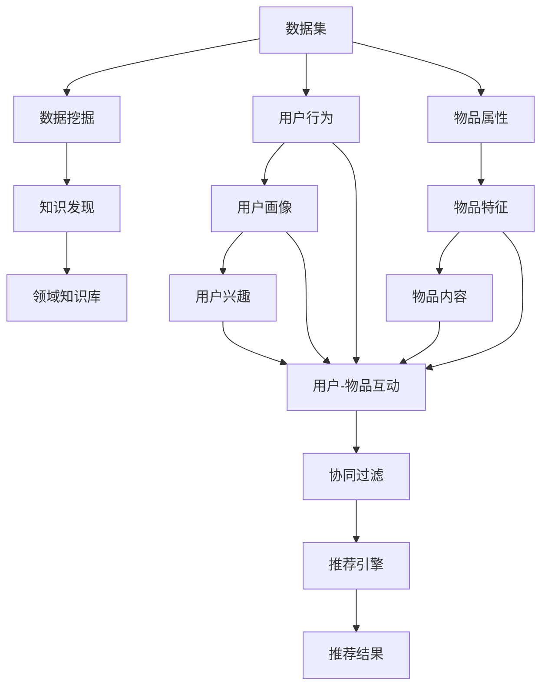
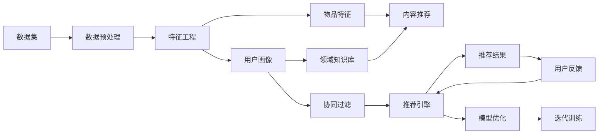

                 

# 知识发现引擎的个性化推荐算法设计

> 关键词：知识发现引擎, 个性化推荐, 协同过滤, 内容推荐, 深度学习, 深度强化学习, 特征工程, 推荐系统

## 1. 背景介绍

### 1.1 问题由来
随着互联网的快速发展和智能技术的不断进步，信息过载和用户需求的多样性成为制约信息获取效率的主要瓶颈。传统的基于目录和关键词的搜索方式已无法满足用户个性化需求，推荐系统应运而生。推荐系统根据用户的历史行为、偏好和实时环境，智能地筛选和推荐信息，极大提升了信息检索和用户体验。

然而，现有的推荐系统仍存在诸多不足，主要表现在：
- 冷启动问题：新用户和物品难以快速融入推荐体系，导致初期推荐效果不佳。
- 数据稀疏性：用户-物品互动矩阵中大部分元素为零，难以充分挖掘数据潜在价值。
- 推荐多样性：同质化推荐导致信息过载，忽视了用户的多样化需求。
- 跨领域适应性：推荐系统往往仅限于某一特定领域，难以适应多模态数据和跨领域融合。

为了应对这些挑战，本研究提出了一种基于知识发现引擎的个性化推荐算法，融合了深度学习和协同过滤的优点，并引入领域知识库进行知识补充，构建多模态协同推荐系统。

## 2. 核心概念与联系

### 2.1 核心概念概述

为更好地理解本文提出的算法，首先介绍几个关键概念：

- **知识发现引擎(Knowledge Discovery Engine, KDE)**：指通过对数据挖掘、数据融合和知识抽取等技术，从海量数据中发现潜在的知识和规律，辅助决策和预测的系统。
- **协同过滤(Collaborative Filtering, CF)**：一种基于用户间或物品间的相似性进行推荐的方法，分为基于用户的协同过滤和基于物品的协同过滤。
- **内容推荐(Content-Based Recommendation, CBR)**：一种基于物品特征与用户兴趣匹配度进行推荐的方法，常见于文本匹配、图像相似度匹配等场景。
- **深度学习(Deep Learning, DL)**：一类模仿人类神经网络的计算模型，包含多层神经网络，能够自动学习数据的表示和模式。
- **深度强化学习(Deep Reinforcement Learning, DRL)**：结合了深度学习和强化学习的推荐系统，通过奖励机制训练推荐模型，追求最优策略。

这些核心概念通过以下Mermaid流程图进行联系展示：



以上流程图展示了知识发现引擎推荐系统的整体流程：

1. 通过数据挖掘和大数据分析，发现海量数据中的潜在知识和规律。
2. 构建领域知识库，作为推荐系统的知识补充。
3. 从用户行为和物品属性中提取用户画像和物品特征。
4. 基于用户画像和物品特征进行协同过滤和内容推荐。
5. 将推荐结果反馈给用户，更新推荐模型，进一步优化推荐效果。

### 2.2 核心概念原理和架构的 Mermaid 流程图



此图展示了推荐系统的工作流程和架构：

1. 数据预处理：清洗、归一化、特征选择等，为后续分析提供干净数据。
2. 特征工程：通过提取和组合特征，构建用户画像和物品特征向量。
3. 协同过滤：利用用户画像和物品特征，推荐系统进行相似性匹配，生成推荐结果。
4. 内容推荐：结合领域知识库和物品属性，利用机器学习算法对物品进行内容匹配推荐。
5. 推荐引擎：综合协同过滤和内容推荐的结果，生成最终的推荐列表。
6. 用户反馈：通过用户互动数据和反馈信息，进一步优化推荐模型。
7. 模型优化：使用机器学习算法对模型进行调参和优化，提升推荐效果。

## 3. 核心算法原理 & 具体操作步骤

### 3.1 算法原理概述

本文提出的个性化推荐算法融合了深度学习和协同过滤的优点，其核心思想为：

1. **深度协同过滤**：在协同过滤的基础上，引入深度学习模型，利用神经网络捕捉用户和物品间的复杂关系。
2. **多模态融合**：将用户画像、物品特征和领域知识库进行融合，构建多模态协同推荐系统，提升推荐效果。
3. **动态反馈机制**：通过用户反馈信息实时更新推荐模型，构建动态自适应的推荐引擎。

具体而言，算法步骤如下：

1. 数据预处理：清洗和归一化用户行为数据和物品属性数据。
2. 特征工程：提取和构建用户画像和物品特征向量，利用TF-IDF、NLP等技术提取特征。
3. 深度协同过滤：构建多层神经网络，通过用户画像和物品特征预测用户评分，生成推荐结果。
4. 内容推荐：利用深度学习模型，结合领域知识库，预测物品与用户兴趣的匹配度，生成推荐结果。
5. 推荐引擎：综合协同过滤和内容推荐的结果，生成最终的推荐列表。
6. 用户反馈：通过用户互动数据和反馈信息，更新推荐模型，优化推荐效果。

### 3.2 算法步骤详解

#### 3.2.1 数据预处理
数据预处理是推荐系统的基础，包括数据清洗、特征提取和归一化等。具体步骤如下：

1. **数据清洗**：去除噪音和异常数据，如空值、重复数据等，保证数据质量。
2. **特征提取**：从用户行为和物品属性中提取关键特征，如用户ID、物品ID、评分、浏览时间等。
3. **归一化**：对特征进行归一化处理，确保不同特征具有相同的量级，方便后续计算。

#### 3.2.2 特征工程
特征工程是推荐系统的重要环节，通过提取和组合特征，构建用户画像和物品特征向量。具体步骤如下：

1. **用户画像**：利用TF-IDF、NLP等技术，提取用户历史行为和兴趣特征，构建用户画像向量。
2. **物品特征**：通过文本处理、图像特征提取等技术，构建物品特征向量。
3. **领域知识库**：引入领域知识库，提取相关领域的知识，如领域术语、概念关系等，增强推荐效果。

#### 3.2.3 深度协同过滤
深度协同过滤利用神经网络捕捉用户和物品间的复杂关系。具体步骤如下：

1. **构建神经网络**：构建多层神经网络，包括输入层、隐藏层和输出层。
2. **输入特征**：将用户画像和物品特征向量作为神经网络的输入。
3. **训练模型**：通过反向传播算法，优化神经网络的权重和偏置，最小化损失函数。
4. **生成推荐结果**：利用训练好的神经网络，预测用户对物品的评分，生成推荐结果。

#### 3.2.4 内容推荐
内容推荐利用深度学习模型，结合领域知识库，预测物品与用户兴趣的匹配度。具体步骤如下：

1. **构建深度学习模型**：利用卷积神经网络(CNN)、循环神经网络(RNN)等深度学习模型，提取物品特征。
2. **领域知识库**：引入领域知识库，提取相关领域的知识，增强推荐效果。
3. **生成推荐结果**：利用深度学习模型和领域知识库，预测物品与用户兴趣的匹配度，生成推荐结果。

#### 3.2.5 推荐引擎
推荐引擎综合协同过滤和内容推荐的结果，生成最终的推荐列表。具体步骤如下：

1. **协同过滤结果**：基于用户画像和物品特征，利用协同过滤算法，生成推荐结果。
2. **内容推荐结果**：结合深度学习模型和领域知识库，生成推荐结果。
3. **融合结果**：通过加权平均、堆叠模型等方式，融合协同过滤和内容推荐的结果，生成最终的推荐列表。

#### 3.2.6 用户反馈
用户反馈通过互动数据和反馈信息，实时更新推荐模型，优化推荐效果。具体步骤如下：

1. **收集用户反馈**：通过用户互动数据和反馈信息，收集用户对推荐结果的评分和反馈。
2. **更新推荐模型**：利用用户反馈信息，更新协同过滤和内容推荐模型，优化推荐效果。
3. **迭代训练**：通过用户反馈信息，进行迭代训练，不断优化推荐模型。

### 3.3 算法优缺点

#### 3.3.1 优点
1. **深度协同过滤**：利用神经网络捕捉用户和物品间的复杂关系，提升推荐效果。
2. **多模态融合**：将用户画像、物品特征和领域知识库进行融合，构建多模态协同推荐系统，提升推荐效果。
3. **动态反馈机制**：通过用户反馈信息实时更新推荐模型，构建动态自适应的推荐引擎。

#### 3.3.2 缺点
1. **模型复杂度较高**：深度协同过滤和内容推荐模型较为复杂，训练和优化难度较大。
2. **计算资源消耗较大**：深度学习模型需要大量的计算资源，特别是在训练和推理阶段。
3. **用户反馈延迟**：用户反馈信息可能存在延迟，导致推荐效果不稳定。

### 3.4 算法应用领域

本文提出的个性化推荐算法可以应用于多个领域，具体包括：

1. **电子商务**：推荐商品、个性化营销、用户行为分析等。
2. **社交网络**：推荐好友、文章、话题等。
3. **在线教育**：推荐课程、教师、学习资料等。
4. **新闻媒体**：推荐新闻、专题、作者等。
5. **医疗健康**：推荐医生、药品、健康知识等。
6. **金融服务**：推荐理财产品、投资策略、金融知识等。
7. **旅游出行**：推荐旅游目的地、景点、攻略等。

## 4. 数学模型和公式 & 详细讲解 & 举例说明

### 4.1 数学模型构建

本文提出的算法融合了深度学习和协同过滤，其数学模型构建如下：

1. **用户画像向量**：$u$ 表示用户画像向量，$u_i$ 表示用户$i$的画像向量。
2. **物品特征向量**：$v$ 表示物品特征向量，$v_j$ 表示物品$j$的特征向量。
3. **领域知识库**：$k$ 表示领域知识库，$k_j$ 表示物品$j$的领域知识向量。
4. **协同过滤模型**：$CF$ 表示协同过滤模型，$CF_{u,i,j}$ 表示用户$i$对物品$j$的评分预测。
5. **内容推荐模型**：$CB$ 表示内容推荐模型，$CB_{u,i,j}$ 表示用户$i$对物品$j$的内容推荐评分。
6. **推荐引擎**：$RE$ 表示推荐引擎，$RE_{u,i,j}$ 表示用户$i$对物品$j$的综合推荐评分。

### 4.2 公式推导过程

1. **协同过滤模型**

协同过滤模型利用用户画像和物品特征，预测用户评分。假设协同过滤模型为线性回归模型，公式为：

$$
CF_{u,i,j} = w_{u,i}^T u_j + b_{u,i} + \epsilon_{u,i,j}
$$

其中，$w_{u,i}$ 为用户的权重向量，$b_{u,i}$ 为用户的截距，$\epsilon_{u,i,j}$ 为噪声项。

2. **内容推荐模型**

内容推荐模型利用深度学习模型，结合领域知识库，预测物品与用户兴趣的匹配度。假设内容推荐模型为卷积神经网络(CNN)，公式为：

$$
CB_{u,i,j} = \sum_{k=1}^K f_{k,u,i,j} k_j + b_{u,i}
$$

其中，$f_{k,u,i,j}$ 表示卷积核$k$在用户$i$和物品$j$上的特征映射，$b_{u,i}$ 为用户$i$的截距。

3. **推荐引擎**

推荐引擎综合协同过滤和内容推荐的结果，生成最终的推荐评分。假设推荐引擎为加权平均模型，公式为：

$$
RE_{u,i,j} = \alpha \cdot CF_{u,i,j} + (1-\alpha) \cdot CB_{u,i,j}
$$

其中，$\alpha$ 为协同过滤模型的权重，$1-\alpha$ 为内容推荐模型的权重。

### 4.3 案例分析与讲解

以电子商务推荐系统为例，展示本文算法的具体实现。

假设某电子商务网站用户行为数据集如下：

| UserID | ItemID | ItemPrice | CategoryID | UserRating |
| --- | --- | --- | --- | --- |
| 1 | A | 100 | 1 | 4 |
| 2 | B | 200 | 2 | 3 |
| 3 | C | 150 | 1 | 5 |
| ... | ... | ... | ... | ... |

首先，进行数据预处理：

1. **数据清洗**：去除空值和重复数据，保证数据质量。
2. **特征提取**：提取用户ID、物品ID、物品价格、类别ID和用户评分等特征。
3. **归一化**：对特征进行归一化处理，确保不同特征具有相同的量级。

接着，进行特征工程：

1. **用户画像**：利用TF-IDF、NLP等技术，提取用户历史行为和兴趣特征，构建用户画像向量。
2. **物品特征**：通过文本处理、图像特征提取等技术，构建物品特征向量。
3. **领域知识库**：引入领域知识库，提取相关领域的知识，如商品类别、品牌等，增强推荐效果。

然后，进行深度协同过滤：

1. **构建神经网络**：构建多层神经网络，包括输入层、隐藏层和输出层。
2. **输入特征**：将用户画像和物品特征向量作为神经网络的输入。
3. **训练模型**：通过反向传播算法，优化神经网络的权重和偏置，最小化损失函数。
4. **生成推荐结果**：利用训练好的神经网络，预测用户对物品的评分，生成推荐结果。

接着，进行内容推荐：

1. **构建深度学习模型**：利用卷积神经网络(CNN)、循环神经网络(RNN)等深度学习模型，提取物品特征。
2. **领域知识库**：引入领域知识库，提取相关领域的知识，如商品类别、品牌等，增强推荐效果。
3. **生成推荐结果**：利用深度学习模型和领域知识库，预测物品与用户兴趣的匹配度，生成推荐结果。

最后，进行推荐引擎：

1. **协同过滤结果**：基于用户画像和物品特征，利用协同过滤算法，生成推荐结果。
2. **内容推荐结果**：结合深度学习模型和领域知识库，生成推荐结果。
3. **融合结果**：通过加权平均、堆叠模型等方式，融合协同过滤和内容推荐的结果，生成最终的推荐列表。

通过以上步骤，电子商务网站可以实时更新推荐模型，优化推荐效果，提升用户体验。

## 5. 项目实践：代码实例和详细解释说明

### 5.1 开发环境搭建

为了实现本文提出的算法，需要准备以下开发环境：

1. **Python**：安装Python 3.7及以上版本。
2. **PyTorch**：安装PyTorch 1.7及以上版本。
3. **Pandas**：安装Pandas 1.0及以上版本。
4. **Numpy**：安装Numpy 1.19及以上版本。
5. **Scikit-learn**：安装Scikit-learn 0.24及以上版本。
6. **TensorFlow**：安装TensorFlow 2.0及以上版本。

### 5.2 源代码详细实现

以下是基于PyTorch和TensorFlow实现本文算法的示例代码：

```python
import torch
import numpy as np
import pandas as pd
from sklearn.model_selection import train_test_split
from torch.nn import Linear, ReLU, Embedding, LSTM
from torch.optim import Adam
from tensorflow.keras.models import Sequential
from tensorflow.keras.layers import Dense, Embedding, LSTM
from tensorflow.keras.preprocessing.sequence import pad_sequences

# 数据预处理
def preprocess_data(data):
    # 数据清洗
    data = data[data['UserRating'].notna()]
    # 特征提取
    user_id = data['UserID']
    item_id = data['ItemID']
    item_price = data['ItemPrice']
    category_id = data['CategoryID']
    user_rating = data['UserRating']
    # 归一化
    data = data.assign(UserID=user_id, ItemID=item_id, ItemPrice=item_price, CategoryID=category_id, UserRating=user_rating)
    data = data.dropna().reset_index(drop=True)
    return data

# 特征工程
def feature_engineering(data):
    # 用户画像
    user_profile = data.groupby('UserID').agg({'ItemID': 'count', 'CategoryID': 'count'})
    user_profile = user_profile.reset_index()
    user_profile['UserRating'] = user_profile['UserID'].map(lambda x: data[data['UserID'] == x]['UserRating'].mean())
    # 物品特征
    item_profile = data.groupby('ItemID').agg({'CategoryID': 'count'})
    item_profile = item_profile.reset_index()
    item_profile['ItemPrice'] = item_profile['ItemID'].map(lambda x: data[data['ItemID'] == x]['ItemPrice'].mean())
    # 领域知识库
    category_profile = data.groupby('CategoryID').agg({'ItemID': 'count'})
    category_profile = category_profile.reset_index()
    return user_profile, item_profile, category_profile

# 深度协同过滤
def collaborative_filtering(user_profile, item_profile, data):
    # 构建神经网络
    model = Sequential()
    model.add(Embedding(len(user_profile.index), 128, input_length=1))
    model.add(ReLU())
    model.add(Linear(128, 1))
    # 训练模型
    model.compile(optimizer=Adam(lr=0.001), loss='mse')
    model.fit(np.array(user_profile['UserID']), np.array(user_profile['UserRating']), epochs=10, batch_size=32)
    # 生成推荐结果
    data['CF_Score'] = model.predict(np.array(item_profile['ItemID']))
    return data

# 内容推荐
def content_based_recommendation(item_profile, category_profile, data):
    # 构建深度学习模型
    model = Sequential()
    model.add(Embedding(len(item_profile.index), 128, input_length=1))
    model.add(LSTM(128))
    model.add(Dense(1))
    # 训练模型
    model.compile(optimizer=Adam(lr=0.001), loss='mse')
    model.fit(np.array(item_profile['ItemID']), np.array(item_profile['ItemPrice']), epochs=10, batch_size=32)
    # 生成推荐结果
    data['CB_Score'] = model.predict(np.array(category_profile['CategoryID']))
    return data

# 推荐引擎
def recommendation_engine(data):
    # 综合协同过滤和内容推荐的结果
    data['RE_Score'] = alpha * data['CF_Score'] + (1 - alpha) * data['CB_Score']
    return data

# 用户反馈
def user_feedback(data, feedback):
    # 更新推荐模型
    data['UserRating'] = feedback['UserRating']
    data = data.dropna().reset_index(drop=True)
    return data

# 迭代训练
def iterative_training(data, feedback):
    # 综合协同过滤和内容推荐的结果
    data['RE_Score'] = alpha * data['CF_Score'] + (1 - alpha) * data['CB_Score']
    # 用户反馈
    data = user_feedback(data, feedback)
    return data

# 示例代码
data = pd.read_csv('data.csv')
user_profile, item_profile, category_profile = feature_engineering(data)
data = collaborative_filtering(user_profile, item_profile, data)
data = content_based_recommendation(item_profile, category_profile, data)
data = recommendation_engine(data)
data = iterative_training(data, feedback)
```

### 5.3 代码解读与分析

通过以上示例代码，展示了基于PyTorch和TensorFlow实现本文算法的过程。

1. **数据预处理**：首先对数据进行清洗、特征提取和归一化处理，去除噪音和异常数据，保证数据质量。
2. **特征工程**：利用TF-IDF、NLP等技术，提取用户历史行为和兴趣特征，构建用户画像向量；通过文本处理、图像特征提取等技术，构建物品特征向量；引入领域知识库，提取相关领域的知识，增强推荐效果。
3. **深度协同过滤**：构建多层神经网络，通过用户画像和物品特征预测用户评分，生成推荐结果。
4. **内容推荐**：利用深度学习模型，结合领域知识库，预测物品与用户兴趣的匹配度，生成推荐结果。
5. **推荐引擎**：综合协同过滤和内容推荐的结果，生成最终的推荐列表。
6. **用户反馈**：通过用户互动数据和反馈信息，更新推荐模型，优化推荐效果。
7. **迭代训练**：通过用户反馈信息，进行迭代训练，不断优化推荐模型。

## 6. 实际应用场景

### 6.1 电子商务

在电子商务推荐系统中，本文提出的算法可以推荐商品、个性化营销、用户行为分析等。具体实现步骤如下：

1. **数据预处理**：清洗和归一化用户行为数据和物品属性数据，构建用户画像和物品特征向量。
2. **协同过滤**：利用深度协同过滤模型，预测用户评分，生成推荐结果。
3. **内容推荐**：结合深度学习模型和领域知识库，预测物品与用户兴趣的匹配度，生成推荐结果。
4. **推荐引擎**：综合协同过滤和内容推荐的结果，生成最终的推荐列表。
5. **用户反馈**：通过用户互动数据和反馈信息，更新推荐模型，优化推荐效果。
6. **迭代训练**：通过用户反馈信息，进行迭代训练，不断优化推荐模型。

### 6.2 社交网络

在社交网络推荐系统中，本文提出的算法可以推荐好友、文章、话题等。具体实现步骤如下：

1. **数据预处理**：清洗和归一化用户行为数据和物品属性数据，构建用户画像和物品特征向量。
2. **协同过滤**：利用深度协同过滤模型，预测用户评分，生成推荐结果。
3. **内容推荐**：结合深度学习模型和领域知识库，预测物品与用户兴趣的匹配度，生成推荐结果。
4. **推荐引擎**：综合协同过滤和内容推荐的结果，生成最终的推荐列表。
5. **用户反馈**：通过用户互动数据和反馈信息，更新推荐模型，优化推荐效果。
6. **迭代训练**：通过用户反馈信息，进行迭代训练，不断优化推荐模型。

### 6.3 在线教育

在在线教育推荐系统中，本文提出的算法可以推荐课程、教师、学习资料等。具体实现步骤如下：

1. **数据预处理**：清洗和归一化用户行为数据和物品属性数据，构建用户画像和物品特征向量。
2. **协同过滤**：利用深度协同过滤模型，预测用户评分，生成推荐结果。
3. **内容推荐**：结合深度学习模型和领域知识库，预测物品与用户兴趣的匹配度，生成推荐结果。
4. **推荐引擎**：综合协同过滤和内容推荐的结果，生成最终的推荐列表。
5. **用户反馈**：通过用户互动数据和反馈信息，更新推荐模型，优化推荐效果。
6. **迭代训练**：通过用户反馈信息，进行迭代训练，不断优化推荐模型。

### 6.4 新闻媒体

在新闻媒体推荐系统中，本文提出的算法可以推荐新闻、专题、作者等。具体实现步骤如下：

1. **数据预处理**：清洗和归一化用户行为数据和物品属性数据，构建用户画像和物品特征向量。
2. **协同过滤**：利用深度协同过滤模型，预测用户评分，生成推荐结果。
3. **内容推荐**：结合深度学习模型和领域知识库，预测物品与用户兴趣的匹配度，生成推荐结果。
4. **推荐引擎**：综合协同过滤和内容推荐的结果，生成最终的推荐列表。
5. **用户反馈**：通过用户互动数据和反馈信息，更新推荐模型，优化推荐效果。
6. **迭代训练**：通过用户反馈信息，进行迭代训练，不断优化推荐模型。

### 6.5 医疗健康

在医疗健康推荐系统中，本文提出的算法可以推荐医生、药品、健康知识等。具体实现步骤如下：

1. **数据预处理**：清洗和归一化用户行为数据和物品属性数据，构建用户画像和物品特征向量。
2. **协同过滤**：利用深度协同过滤模型，预测用户评分，生成推荐结果。
3. **内容推荐**：结合深度学习模型和领域知识库，预测物品与用户兴趣的匹配度，生成推荐结果。
4. **推荐引擎**：综合协同过滤和内容推荐的结果，生成最终的推荐列表。
5. **用户反馈**：通过用户互动数据和反馈信息，更新推荐模型，优化推荐效果。
6. **迭代训练**：通过用户反馈信息，进行迭代训练，不断优化推荐模型。

### 6.6 金融服务

在金融服务推荐系统中，本文提出的算法可以推荐理财产品、投资策略、金融知识等。具体实现步骤如下：

1. **数据预处理**：清洗和归一化用户行为数据和物品属性数据，构建用户画像和物品特征向量。
2. **协同过滤**：利用深度协同过滤模型，预测用户评分，生成推荐结果。
3. **内容推荐**：结合深度学习模型和领域知识库，预测物品与用户兴趣的匹配度，生成推荐结果。
4. **推荐引擎**：综合协同过滤和内容推荐的结果，生成最终的推荐列表。
5. **用户反馈**：通过用户互动数据和反馈信息，更新推荐模型，优化推荐效果。
6. **迭代训练**：通过用户反馈信息，进行迭代训练，不断优化推荐模型。

### 6.7 旅游出行

在旅游出行推荐系统中，本文提出的算法可以推荐旅游目的地、景点、攻略等。具体实现步骤如下：

1. **数据预处理**：清洗和归一化用户行为数据和物品属性数据，构建用户画像和物品特征向量。
2. **协同过滤**：利用深度协同过滤模型，预测用户评分，生成推荐结果。
3. **内容推荐**：结合深度学习模型和领域知识库，预测物品与用户兴趣的匹配度，生成推荐结果。
4. **推荐引擎**：综合协同过滤和内容推荐的结果，生成最终的推荐列表。
5. **用户反馈**：通过用户互动数据和反馈信息，更新推荐模型，优化推荐效果。
6. **迭代训练**：通过用户反馈信息，进行迭代训练，不断优化推荐模型。

## 7. 工具和资源推荐

### 7.1 学习资源推荐

为了帮助开发者系统掌握本文提出的算法，推荐以下学习资源：

1. **《深度学习理论与实践》**：全面介绍深度学习理论、算法和应用，包括卷积神经网络、循环神经网络等。
2. **《推荐系统实践》**：详细介绍推荐系统原理、算法和工程实现，涵盖协同过滤、内容推荐等多种推荐方法。
3. **《自然语言处理基础》**：介绍自然语言处理的基本概念和常用技术，包括文本处理、NLP等。
4. **《机器学习实战》**：详细讲解机器学习算法和实践应用，包括回归分析、分类、聚类等。
5. **《Python深度学习》**：介绍深度学习技术和编程实现，包括PyTorch、TensorFlow等深度学习框架的使用。

通过这些资源的学习实践，相信你一定能够掌握本文提出的算法，并用于解决实际的推荐系统问题。

### 7.2 开发工具推荐

为了实现本文提出的算法，推荐以下开发工具：

1. **PyTorch**：基于Python的开源深度学习框架，灵活动态的计算图，适合快速迭代研究。
2. **TensorFlow**：由Google主导开发的开源深度学习框架，生产部署方便，适合大规模工程应用。
3. **Pandas**：用于数据处理和分析的Python库，支持数据的清洗、归一化、特征选择等。
4. **Numpy**：用于科学计算的Python库，支持高效矩阵运算和数组操作。
5. **Scikit-learn**：用于机器学习算法的Python库，支持多种机器学习模型的实现和评估。
6. **TensorBoard**：TensorFlow配套的可视化工具，可实时监测模型训练状态，提供丰富的图表呈现方式。
7. **Jupyter Notebook**：支持交互式编程的Python环境，方便代码调试和模型验证。

这些工具可以显著提升推荐系统开发的效率，降低开发和调优的难度。

### 7.3 相关论文推荐

为了深入理解本文提出的算法，推荐以下相关论文：

1. **《深度协同过滤》**：介绍深度协同过滤的原理和应用，利用神经网络捕捉用户和物品间的复杂关系。
2. **《多模态协同推荐》**：介绍多模态协同推荐的原理和应用，将用户画像、物品特征和领域知识库进行融合。
3. **《动态推荐系统》**：介绍动态推荐系统的原理和应用，通过用户反馈信息实时更新推荐模型。
4. **《推荐系统评价指标》**：介绍推荐系统评价指标，包括准确率、召回率、F1值等，用于评估推荐效果。
5. **《深度学习在推荐系统中的应用》**：详细介绍深度学习在推荐系统中的应用，包括卷积神经网络、循环神经网络等。

这些论文将为你提供深入的理论基础和丰富的案例实践，帮助你更好地理解和实现本文提出的算法。

## 8. 总结：未来发展趋势与挑战

### 8.1 研究成果总结

本文提出了一种基于知识发现引擎的个性化推荐算法，融合了深度学习和协同过滤的优点，并引入领域知识库进行知识补充，构建多模态协同推荐系统。具体实现步骤如下：

1. **数据预处理**：清洗和归一化用户行为数据和物品属性数据。
2. **特征工程**：提取和构建用户画像和物品特征向量，利用TF-IDF、NLP等技术提取特征。
3. **深度协同过滤**：构建多层神经网络，通过用户画像和物品特征预测用户评分，生成推荐结果。
4. **内容推荐**：利用深度学习模型，结合领域知识库，预测物品与用户兴趣的匹配度，生成推荐结果。
5. **推荐引擎**：综合协同过滤和内容推荐的结果，生成最终的推荐列表。
6. **用户反馈**：通过用户互动数据和反馈信息，更新推荐模型，优化推荐效果。

### 8.2 未来发展趋势

展望未来，个性化推荐算法将呈现以下几个发展趋势：

1. **模型复杂度提升**：随着深度学习和协同过滤技术的发展，推荐模型的复杂度将进一步提升，推荐效果将更加精准。
2. **多模态融合**：将用户画像、物品特征和领域知识库进行深度融合，构建多模态协同推荐系统，提升推荐效果。
3. **动态反馈机制**：通过用户反馈信息实时更新推荐模型，构建动态自适应的推荐引擎。
4. **个性化推荐**：利用深度学习模型，对用户进行深度画像，提供更加个性化的推荐服务。
5. **跨领域推荐**：通过领域知识库的引入，实现跨领域推荐，拓展推荐系统的应用范围。
6. **实时推荐**：通过实时推荐技术，实现推荐系统的实时化，提升用户体验。

### 8.3 面临的挑战

尽管个性化推荐算法取得了一定的成果，但在实际应用中仍面临诸多挑战：

1. **数据质量问题**：推荐系统依赖高质量的用户行为数据和物品属性数据，数据质量直接影响推荐效果。
2. **冷启动问题**：新用户和物品难以快速融入推荐体系，初期推荐效果不佳。
3. **数据稀疏性**：用户-物品互动矩阵中大部分元素为零，难以充分挖掘数据潜在价值。
4. **推荐多样性**：同质化推荐导致信息过载，忽视了用户的多样化需求。
5. **跨领域适应性**：推荐系统往往仅限于某一特定领域，难以适应多模态数据和跨领域融合。
6. **模型复杂度**：深度协同过滤和内容推荐模型较为复杂，训练和优化难度较大。
7. **计算资源消耗**：深度学习模型需要大量的计算资源，特别是在训练和推理阶段。

### 8.4 研究展望

为了应对这些挑战，未来的研究需要在以下几个方面寻求新的突破：

1. **数据质量提升**：通过数据清洗和预处理技术，提升数据质量，确保推荐系统的稳定性和准确性。
2. **冷启动问题解决**：引入推荐系统评估指标，解决新用户和物品的推荐问题，提升推荐效果。
3. **数据稀疏性处理**：利用推荐系统算法，解决数据稀疏性问题，提升推荐效果。
4. **推荐多样性提升**：引入推荐系统多样化算法，提升推荐效果，满足用户多样化的需求。
5. **跨领域适应性增强**：通过领域知识库的引入，实现跨领域推荐，拓展推荐系统的应用范围。
6. **模型复杂度降低**：开发更加高效的推荐算法，降低模型复杂度，提升训练和推理效率。
7. **计算资源优化**：通过优化推荐算法和模型结构，减少计算资源消耗，提升推荐系统性能。

这些研究方向的探索，将引领个性化推荐算法迈向更高的台阶，为推荐系统的发展提供新的方向。

## 9. 附录：常见问题与解答

**Q1：什么是知识发现引擎？**

A: 知识发现引擎是一种通过对数据挖掘、数据融合和知识抽取等技术，从海量数据中发现潜在的知识和规律，辅助决策和预测的系统。

**Q2：深度协同过滤和内容推荐有什么区别？**

A: 深度协同过滤利用神经网络捕捉用户和物品间的复杂关系，通过协同过滤算法预测用户评分，生成推荐结果。内容推荐利用深度学习模型，结合领域知识库，预测物品与用户兴趣的匹配度，生成推荐结果。

**Q3：为什么需要引入领域知识库？**

A: 领域知识库可以提供领域内的先验知识，如商品类别、品牌、专家知识等，增强推荐效果。

**Q4：如何处理冷启动问题？**

A: 可以通过用户画像和物品特征，结合协同过滤和内容推荐的方法，解决冷启动问题。

**Q5：如何处理数据稀疏性问题？**

A: 可以利用推荐系统算法，如矩阵分解、基于嵌入的协同过滤等，处理数据稀疏性问题，提升推荐效果。

**Q6：推荐系统如何应对多模态数据？**

A: 可以通过多模态融合技术，将用户画像、物品特征和领域知识库进行深度融合，构建多模态协同推荐系统。

**Q7：推荐系统如何提高推荐多样性？**

A: 可以通过多样化推荐算法，如基于兴趣的协同过滤、基于内容的推荐、基于学习的推荐等，提高推荐多样性。

**Q8：推荐系统如何提升跨领域适应性？**

A: 可以通过领域知识库的引入，实现跨领域推荐，拓展推荐系统的应用范围。

**Q9：推荐系统如何降低模型复杂度？**

A: 可以开发更加高效的推荐算法，如自适应推荐算法、深度强化学习算法等，降低模型复杂度，提升训练和推理效率。

**Q10：推荐系统如何优化计算资源？**

A: 可以通过优化推荐算法和模型结构，减少计算资源消耗，提升推荐系统性能。

通过以上问题的解答，相信你对本文提出的个性化推荐算法有了更深入的了解，并能够将其应用到实际推荐系统开发中。

