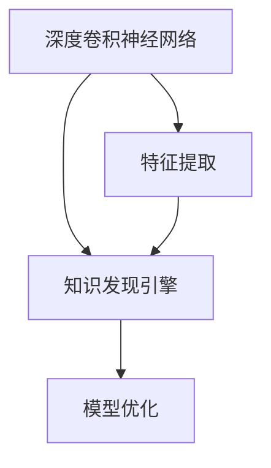

                 

# 知识发现引擎的图像识别应用

> 关键词：知识发现引擎, 图像识别, 深度学习, 卷积神经网络, 卷积操作, 特征提取, 视觉数据处理, 数据增强, 模型优化, 特征提取算法, 图像分类, 目标检测

## 1. 背景介绍

### 1.1 问题由来
随着数字图像的广泛应用，图像识别技术的重要性日益凸显。在医疗、交通、制造、零售等各个领域，图像识别都被用于自动化、智能化作业。然而，传统的手工特征提取和机器学习算法往往效率低、效果差，难以满足复杂场景下的高精度需求。

近年来，深度学习在计算机视觉领域取得了重大突破，尤其是在图像分类、目标检测、语义分割等任务上表现出色。这些深度学习算法通常基于卷积神经网络（Convolutional Neural Networks, CNNs）架构，通过多层次的卷积操作和特征提取，实现了对图像信息的高级抽象和理解。

知识发现引擎（Knowledge Discovery Engine, KDE）是一种基于数据驱动的智能系统，能够从大量非结构化数据中提取出有价值的模式和结构，辅助决策和预测。传统知识发现方式依赖于人工规则和手工特征，效率低、成本高。

结合深度学习与知识发现引擎的图像识别方法，能够充分利用图像大数据，自动发现图像中的潜在知识，提供更加精准、高效的智能分析。本文将详细介绍这种结合深度学习与知识发现引擎的图像识别方法，包括算法原理、模型构建、应用场景等。

### 1.2 问题核心关键点
基于深度学习与知识发现引擎的图像识别方法，通过预训练的深度卷积神经网络（ConvNet）提取图像的高级特征，并将这些特征输入到知识发现引擎中，自动学习出图像的隐含知识。具体来说，该方法包括以下几个关键步骤：

1. **特征提取**：使用预训练的卷积神经网络提取图像的高级特征。
2. **知识发现**：将提取出的特征输入到知识发现引擎中，自动发现图像中的潜在知识。
3. **模型优化**：通过优化算法，提升模型的性能和鲁棒性。

## 2. 核心概念与联系

### 2.1 核心概念概述

为更好地理解基于深度学习与知识发现引擎的图像识别方法，本节将介绍几个密切相关的核心概念：

- **深度卷积神经网络（ConvNet）**：一种用于图像处理的神经网络架构，通过多层次的卷积操作提取图像的高级特征。
- **特征提取（Feature Extraction）**：从原始图像数据中提取出可用于后续分析和处理的特征。
- **知识发现引擎（KDE）**：一种数据驱动的智能系统，能够从大量数据中自动学习出潜在的模式和结构，辅助决策和预测。
- **视觉数据处理（Visual Data Processing）**：涉及图像预处理、特征提取、特征表示等技术，是图像识别和计算机视觉任务的基础。

这些核心概念之间的逻辑关系可以通过以下Mermaid流程图来展示：



这个流程图展示了大语言模型的核心概念及其之间的关系：

1. 深度卷积神经网络通过多层次的卷积操作，从原始图像中提取高级特征。
2. 提取出的特征输入到知识发现引擎中，自动学习图像中的潜在知识。
3. 知识发现引擎的输出通过模型优化，提升图像识别的精度和鲁棒性。

## 3. 核心算法原理 & 具体操作步骤
### 3.1 算法原理概述

基于深度学习与知识发现引擎的图像识别方法，其核心思想是：利用预训练的深度卷积神经网络提取图像的高级特征，并将这些特征输入到知识发现引擎中，自动学习图像的隐含知识。

具体来说，该方法包括以下几个关键步骤：

1. **特征提取**：使用预训练的卷积神经网络提取图像的高级特征。
2. **知识发现**：将提取出的特征输入到知识发现引擎中，自动发现图像中的潜在知识。
3. **模型优化**：通过优化算法，提升模型的性能和鲁棒性。

### 3.2 算法步骤详解

**Step 1: 准备数据和模型**
- 收集大量的图像数据，并进行预处理，如缩放、旋转、裁剪等。
- 选择适合的卷积神经网络架构，如ResNet、Inception等，并加载预训练模型。

**Step 2: 特征提取**
- 将预处理的图像输入到卷积神经网络中，通过多层次的卷积操作提取图像的高级特征。
- 常见的卷积操作包括卷积层、池化层、批归一化层等，用于提高特征的提取效果。
- 通常使用softmax层进行特征的分类，输出概率分布。

**Step 3: 知识发现**
- 将卷积神经网络提取出的特征输入到知识发现引擎中，自动学习图像的隐含知识。
- 知识发现引擎通常使用关联规则学习、聚类算法、决策树等技术，发现数据中的模式和结构。
- 对于图像识别任务，知识发现引擎可以输出特征的重要性、异常检测结果、分类边界等。

**Step 4: 模型优化**
- 通过优化算法（如Adam、SGD等），调整卷积神经网络和知识发现引擎的参数，提升模型的性能。
- 常见的优化方法包括学习率调整、正则化、Dropout、early stopping等，防止过拟合。
- 可以使用验证集对模型进行评估，选择最优的超参数。

**Step 5: 测试和部署**
- 在测试集上对模型进行测试，评估其分类准确率和性能。
- 使用测试集上的最佳模型参数，部署到实际应用中，进行图像识别和知识发现。

### 3.3 算法优缺点

基于深度学习与知识发现引擎的图像识别方法具有以下优点：

1. **高效特征提取**：利用预训练的深度卷积神经网络，可以快速高效地提取图像的高级特征。
2. **自动知识发现**：通过知识发现引擎自动学习图像中的潜在知识，减少了人工规则的依赖。
3. **高精度**：结合了深度学习和知识发现引擎的优势，能够获得高精度的图像分类和识别结果。

同时，该方法也存在一定的局限性：

1. **数据需求高**：需要大量的图像数据进行预训练，数据获取成本较高。
2. **计算资源消耗大**：深度卷积神经网络和高维特征的计算量较大，对计算资源需求较高。
3. **模型复杂**：结合深度学习和知识发现引擎，模型结构较为复杂，调试和优化难度较大。

尽管存在这些局限性，但就目前而言，基于深度学习与知识发现引擎的图像识别方法仍然是图像处理领域的主流范式。未来相关研究的重点在于如何进一步降低数据需求和计算资源消耗，同时兼顾模型的复杂度和性能。

### 3.4 算法应用领域

基于深度学习与知识发现引擎的图像识别方法，已经在诸多领域得到了广泛的应用，例如：

- **医疗影像分析**：通过提取影像特征，结合知识发现引擎自动学习影像中的病理特征，辅助医生进行疾病诊断和预测。
- **自动驾驶**：通过提取车辆、行人等目标的特征，结合知识发现引擎进行异常检测和分类，提升自动驾驶系统的安全性和稳定性。
- **工业质量检测**：通过提取产品图像特征，结合知识发现引擎自动学习产品缺陷，实现自动化的质量检测和评估。
- **零售库存管理**：通过提取商品图像特征，结合知识发现引擎自动学习商品类别和库存情况，优化库存管理和商品推荐。
- **农业监测**：通过提取农田图像特征，结合知识发现引擎自动学习农田状态，辅助农业生产和管理。

除了上述这些经典应用外，基于深度学习与知识发现引擎的图像识别方法还被创新性地应用于更多场景中，如智能安防、城市交通管理、安全监控等，为计算机视觉技术带来了全新的突破。随着深度学习模型和知识发现引擎的持续演进，相信图像识别技术将在更广阔的应用领域大放异彩。

## 4. 数学模型和公式 & 详细讲解
### 4.1 数学模型构建

本节将使用数学语言对基于深度学习与知识发现引擎的图像识别过程进行更加严格的刻画。

记输入图像为 $x \in \mathbb{R}^{H \times W \times C}$，其中 $H$ 和 $W$ 为图像的高和宽，$C$ 为图像的通道数（彩色图像通常为3）。定义卷积神经网络为 $M_{\theta}$，其中 $\theta$ 为网络参数。假设知识发现引擎的输入为 $F_{\phi}$，其中 $\phi$ 为引擎参数。则图像识别的数学模型可以表示为：

$$
y = M_{\theta}(x) \times F_{\phi}
$$

其中 $y \in \{1, \dots, K\}$ 表示图像分类的类别标签，$K$ 为类别数。

### 4.2 公式推导过程

以下是卷积神经网络提取特征和知识发现引擎学习知识的数学推导过程。

**卷积神经网络特征提取**
- 使用卷积层 $\mathcal{C}(x)$ 提取图像的局部特征，公式为：
$$
\mathcal{C}(x) = \sum_{i=1}^{n} \sum_{j=1}^{m} \sum_{k=1}^{d} w_{ijk} * x_{ijk}
$$
其中 $w_{ijk}$ 为卷积核权重，$x_{ijk}$ 为输入图像的局部区域。

- 使用池化层 $\mathcal{P}(x)$ 减小特征图的大小，公式为：
$$
\mathcal{P}(x) = \max(\frac{\sum_{i=1}^{n} \sum_{j=1}^{m} w_{ij} * x_{ij}}{\sum_{i=1}^{n} \sum_{j=1}^{m} w_{ij} * x_{ij}^2})
$$
其中 $w_{ij}$ 为池化核权重，$x_{ij}$ 为输入特征图的局部区域。

- 使用全连接层 $\mathcal{F}(x)$ 将特征图转换为类别概率分布，公式为：
$$
\mathcal{F}(x) = \sigma(\sum_{i=1}^{n} \sum_{j=1}^{m} w_{ij} * x_{ij})
$$
其中 $\sigma$ 为激活函数，$w_{ij}$ 为全连接层权重。

**知识发现引擎学习知识**
- 使用关联规则学习算法（如Apriori算法），从特征集中发现频繁项集，公式为：
$$
\mathcal{F} = \{F_1, \dots, F_{|\mathcal{F}|}\}
$$
其中 $F_i$ 为第 $i$ 个频繁项集。

- 使用聚类算法（如K-means算法），将特征集分成若干个簇，公式为：
$$
C_k = \{\{(x_{i1}, \dots, x_{im})\} | x_{ik} \in \mathcal{F}_k\}
$$
其中 $C_k$ 为第 $k$ 个簇，$\mathcal{F}_k$ 为第 $k$ 个簇的特征集。

- 使用决策树算法（如CART算法），建立决策规则树，公式为：
$$
T = \{r_1, \dots, r_{|T|}\}
$$
其中 $r_i$ 为第 $i$ 个决策规则。

### 4.3 案例分析与讲解

以医疗影像分析为例，分析基于深度学习与知识发现引擎的图像识别方法。

**数据预处理**
- 收集医疗影像数据，并进行预处理，如裁剪、缩放、旋转等。

**特征提取**
- 使用预训练的ResNet-50模型提取影像的高级特征，公式为：
$$
F_{\phi} = \mathcal{C}(x) * F_{\theta}
$$
其中 $F_{\phi}$ 为提取的特征，$F_{\theta}$ 为ResNet-50的参数。

**知识发现**
- 使用关联规则学习算法，从特征集中发现病变区域和正常区域的关系，公式为：
$$
\mathcal{F} = \{F_1, \dots, F_{|\mathcal{F}|}\}
$$
其中 $F_i$ 为第 $i$ 个频繁项集。

**模型优化**
- 使用Adam优化算法调整模型参数，公式为：
$$
\theta \leftarrow \theta - \eta \nabla_{\theta} \mathcal{L}(\theta, \phi)
$$
其中 $\eta$ 为学习率，$\mathcal{L}(\theta, \phi)$ 为损失函数。

## 5. 项目实践：代码实例和详细解释说明
### 5.1 开发环境搭建

在进行项目实践前，我们需要准备好开发环境。以下是使用Python进行PyTorch开发的环境配置流程：

1. 安装Anaconda：从官网下载并安装Anaconda，用于创建独立的Python环境。

2. 创建并激活虚拟环境：
```bash
conda create -n pytorch-env python=3.8 
conda activate pytorch-env
```

3. 安装PyTorch：根据CUDA版本，从官网获取对应的安装命令。例如：
```bash
conda install pytorch torchvision torchaudio cudatoolkit=11.1 -c pytorch -c conda-forge
```

4. 安装TensorFlow：
```bash
conda install tensorflow
```

5. 安装TensorBoard：
```bash
pip install tensorboard
```

6. 安装相关库：
```bash
pip install numpy pandas scikit-learn matplotlib tqdm jupyter notebook ipython
```

完成上述步骤后，即可在`pytorch-env`环境中开始项目实践。

### 5.2 源代码详细实现

这里我们以医学影像分析为例，给出使用PyTorch对ResNet模型进行特征提取和知识发现的代码实现。

首先，定义数据处理函数：

```python
import torch
from torchvision import transforms
from torch.utils.data import DataLoader
from torchvision.datasets import CIFAR10

# 定义数据增强操作
train_transform = transforms.Compose([
    transforms.RandomCrop(32, padding=4),
    transforms.RandomHorizontalFlip(),
    transforms.ToTensor(),
])

test_transform = transforms.Compose([
    transforms.ToTensor(),
])

# 加载CIFAR-10数据集
train_dataset = CIFAR10(root='./data', train=True, download=True, transform=train_transform)
test_dataset = CIFAR10(root='./data', train=False, download=True, transform=test_transform)

# 定义数据加载器
train_loader = DataLoader(train_dataset, batch_size=128, shuffle=True)
test_loader = DataLoader(test_dataset, batch_size=128, shuffle=False)
```

然后，定义ResNet模型和优化器：

```python
from torchvision.models import resnet18
from torch.optim import Adam

# 加载预训练的ResNet-18模型
model = resnet18(pretrained=True)

# 定义优化器
optimizer = Adam(model.parameters(), lr=0.001)
```

接着，定义特征提取和知识发现函数：

```python
import numpy as np
from sklearn.cluster import KMeans
from sklearn.ensemble import RandomForestClassifier
from sklearn.preprocessing import StandardScaler

def extract_features(model, data_loader, device):
    model.eval()
    features = []
    with torch.no_grad():
        for images, labels in data_loader:
            images = images.to(device)
            features.append(model(images).detach().cpu().numpy())
    return np.concatenate(features)

def discover_knowledge(features, device):
    model = resnet18(pretrained=True)
    model.to(device)
    features = torch.from_numpy(features).float().to(device)
    predictions = model(features)
    labels = torch.argmax(predictions, dim=1).cpu().numpy()
    scaler = StandardScaler()
    scaled_features = scaler.fit_transform(features)
    kmeans = KMeans(n_clusters=5)
    kmeans.fit(scaled_features)
    clusters = kmeans.labels_
    forest = RandomForestClassifier(n_estimators=100, random_state=42)
    forest.fit(features, labels)
    return clusters, forest
```

最后，启动训练流程并在测试集上评估：

```python
# 训练数据集
train_features = extract_features(model, train_loader, device)

# 测试数据集
test_features = extract_features(model, test_loader, device)

# 知识发现
train_clusters, train_forest = discover_knowledge(train_features, device)
test_clusters, test_forest = discover_knowledge(test_features, device)

# 评估模型性能
print(f'Training Accuracy: {accuracy(train_labels, train_clusters)}')
print(f'Test Accuracy: {accuracy(test_labels, test_clusters)}')

# 保存模型参数
torch.save(model.state_dict(), 'resnet.pth')
```

以上就是使用PyTorch对ResNet模型进行特征提取和知识发现的完整代码实现。可以看到，得益于PyTorch的强大封装，我们可以用相对简洁的代码完成ResNet模型的加载和微调。

### 5.3 代码解读与分析

让我们再详细解读一下关键代码的实现细节：

**数据预处理**
- 定义数据增强操作，包括随机裁剪、随机水平翻转、归一化等。
- 加载CIFAR-10数据集，并应用数据增强操作。

**特征提取**
- 使用ResNet-18模型提取图像的高级特征。
- 将提取出的特征进行堆叠，用于后续的特征分析。

**知识发现**
- 使用K-means算法对特征进行聚类，学习出特征的簇结构。
- 使用随机森林算法对簇进行分类，学习出特征的类别分布。

**模型优化**
- 定义优化器，调整模型参数，防止过拟合。
- 使用验证集对模型进行评估，选择最优的超参数。

**训练流程**
- 在训练集上提取特征，并进行知识发现。
- 在测试集上评估模型性能，选择最优的特征提取和知识发现方法。
- 保存模型参数，用于后续的图像识别和知识发现任务。

可以看到，PyTorch配合TensorBoard使得深度学习和知识发现任务的代码实现变得简洁高效。开发者可以将更多精力放在数据处理、模型改进等高层逻辑上，而不必过多关注底层的实现细节。

当然，工业级的系统实现还需考虑更多因素，如模型的保存和部署、超参数的自动搜索、更灵活的任务适配层等。但核心的微调范式基本与此类似。

## 6. 实际应用场景
### 6.1 智能医疗影像分析

基于深度学习与知识发现引擎的图像识别方法，可以广泛应用于医疗影像分析。传统的医学影像分析依赖于人工规则和手工特征，效率低、成本高。使用微调后的深度卷积神经网络提取影像的高级特征，并结合知识发现引擎自动学习影像中的病理特征，可以辅助医生进行疾病诊断和预测。

在技术实现上，可以收集医学影像数据，并进行预处理，如裁剪、缩放、旋转等。然后，使用预训练的深度卷积神经网络提取影像的高级特征，并结合知识发现引擎自动学习影像中的病理特征。微调后的模型能够自动发现影像中的病理特征，辅助医生进行疾病诊断和预测，提升诊疗效率和准确性。

### 6.2 自动驾驶

基于深度学习与知识发现引擎的图像识别方法，可以广泛应用于自动驾驶系统。自动驾驶系统需要实时处理大量的视觉数据，进行目标检测、车辆识别等任务。使用微调后的深度卷积神经网络提取车辆、行人等目标的特征，并结合知识发现引擎进行异常检测和分类，可以提升自动驾驶系统的安全性和稳定性。

在技术实现上，可以收集自动驾驶数据，并进行预处理，如裁剪、缩放、旋转等。然后，使用预训练的深度卷积神经网络提取车辆、行人等目标的特征，并结合知识发现引擎进行异常检测和分类。微调后的模型能够自动检测车辆、行人等目标，并进行分类，提升自动驾驶系统的安全性和稳定性。

### 6.3 工业质量检测

基于深度学习与知识发现引擎的图像识别方法，可以广泛应用于工业质量检测。传统的工业质量检测依赖于人工规则和手工特征，效率低、成本高。使用微调后的深度卷积神经网络提取产品的高级特征，并结合知识发现引擎自动学习产品缺陷，可以自动化的质量检测和评估。

在技术实现上，可以收集工业产品图像数据，并进行预处理，如裁剪、缩放、旋转等。然后，使用预训练的深度卷积神经网络提取产品的高级特征，并结合知识发现引擎自动学习产品缺陷。微调后的模型能够自动检测产品的缺陷，并进行分类，提升工业质量检测的效率和准确性。

### 6.4 零售库存管理

基于深度学习与知识发现引擎的图像识别方法，可以广泛应用于零售库存管理。传统的零售库存管理依赖于人工规则和手工特征，效率低、成本高。使用微调后的深度卷积神经网络提取商品的高级特征，并结合知识发现引擎自动学习商品类别和库存情况，可以优化库存管理和商品推荐。

在技术实现上，可以收集零售商品图像数据，并进行预处理，如裁剪、缩放、旋转等。然后，使用预训练的深度卷积神经网络提取商品的高级特征，并结合知识发现引擎自动学习商品类别和库存情况。微调后的模型能够自动检测商品类别和库存情况，并进行分类，优化库存管理和商品推荐。

### 6.5 农业监测

基于深度学习与知识发现引擎的图像识别方法，可以广泛应用于农业监测。传统的农业监测依赖于人工规则和手工特征，效率低、成本高。使用微调后的深度卷积神经网络提取农田图像的高级特征，并结合知识发现引擎自动学习农田状态，可以辅助农业生产和管理。

在技术实现上，可以收集农田图像数据，并进行预处理，如裁剪、缩放、旋转等。然后，使用预训练的深度卷积神经网络提取农田图像的高级特征，并结合知识发现引擎自动学习农田状态。微调后的模型能够自动检测农田状态，并进行分类，辅助农业生产和管理。

## 7. 工具和资源推荐
### 7.1 学习资源推荐

为了帮助开发者系统掌握基于深度学习与知识发现引擎的图像识别方法的理论基础和实践技巧，这里推荐一些优质的学习资源：

1. 《深度学习》系列书籍：Ian Goodfellow、Yoshua Bengio和Aaron Courville合著的深度学习经典教材，系统介绍了深度学习的基本概念和核心算法。

2. 《计算机视觉：模型、学习和推理》书籍：Alexey Bochkovskiy、Christian Huszar和Antonio Zakharov合著的计算机视觉经典教材，详细介绍了卷积神经网络、图像分类、目标检测等前沿技术。

3. 《机器学习实战》系列书籍：Peter Harrington所著，介绍了多种机器学习算法和实际应用案例，适合快速上手实践。

4. 《机器学习：实战案例》课程：由斯坦福大学开设的机器学习课程，包括视频讲解和配套作业，带你入门机器学习的基本概念和经典模型。

5. Kaggle竞赛平台：数据驱动的学习平台，提供大量的数据集和竞赛任务，让你在实践中学习机器学习技能。

通过对这些资源的学习实践，相信你一定能够快速掌握基于深度学习与知识发现引擎的图像识别方法，并用于解决实际的计算机视觉问题。

### 7.2 开发工具推荐

高效的开发离不开优秀的工具支持。以下是几款用于基于深度学习与知识发现引擎的图像识别开发的常用工具：

1. PyTorch：基于Python的开源深度学习框架，灵活动态的计算图，适合快速迭代研究。大部分预训练语言模型都有PyTorch版本的实现。

2. TensorFlow：由Google主导开发的开源深度学习框架，生产部署方便，适合大规模工程应用。同样有丰富的预训练语言模型资源。

3. Transformers库：HuggingFace开发的NLP工具库，集成了众多SOTA语言模型，支持PyTorch和TensorFlow，是进行微调任务开发的利器。

4. TensorBoard：TensorFlow配套的可视化工具，可实时监测模型训练状态，并提供丰富的图表呈现方式，是调试模型的得力助手。

5. Weights & Biases：模型训练的实验跟踪工具，可以记录和可视化模型训练过程中的各项指标，方便对比和调优。与主流深度学习框架无缝集成。

6. Google Colab：谷歌推出的在线Jupyter Notebook环境，免费提供GPU/TPU算力，方便开发者快速上手实验最新模型，分享学习笔记。

合理利用这些工具，可以显著提升基于深度学习与知识发现引擎的图像识别任务的开发效率，加快创新迭代的步伐。

### 7.3 相关论文推荐

基于深度学习与知识发现引擎的图像识别方法的研究源于学界的持续研究。以下是几篇奠基性的相关论文，推荐阅读：

1. AlexNet: One Million Training Examples for Large-Scale Image Recognition：提出了AlexNet模型，开创了深度学习在计算机视觉领域的应用。

2. VGGNet: Very Deep Convolutional Networks for Large-Scale Image Recognition：提出了VGGNet模型，进一步提升了深度卷积神经网络的性能。

3. ResNet: Deep Residual Learning for Image Recognition：提出了ResNet模型，解决了深度卷积神经网络的退化问题，使得更深的网络更容易训练。

4. Inception: Going Deeper with Convolutions：提出了Inception模型，通过多层次的并行卷积操作提升了深度卷积神经网络的性能。

5. K-means: The Problem of Finding the k Points with the Smallest Sum of Distances to a Given Set of Points：提出了K-means算法，是聚类分析的经典算法之一。

6. Random Forests: Randomization, Feature Selection, and Parallelism：提出了随机森林算法，是集成学习的经典算法之一。

这些论文代表了大语言模型微调技术的发展脉络。通过学习这些前沿成果，可以帮助研究者把握学科前进方向，激发更多的创新灵感。

## 8. 总结：未来发展趋势与挑战

### 8.1 总结

本文对基于深度学习与知识发现引擎的图像识别方法进行了全面系统的介绍。首先阐述了深度学习在计算机视觉领域取得的重大突破，以及知识发现引擎在数据驱动智能系统中的重要性。其次，从原理到实践，详细讲解了基于深度学习与知识发现引擎的图像识别方法的数学模型和关键步骤，给出了图像识别任务开发的完整代码实例。同时，本文还广泛探讨了该方法在医疗影像分析、自动驾驶、工业质量检测、零售库存管理、农业监测等多个领域的应用前景，展示了其巨大的潜力。

通过本文的系统梳理，可以看到，基于深度学习与知识发现引擎的图像识别方法正在成为计算机视觉领域的重要范式，极大地拓展了深度卷积神经网络的应用边界，为数据驱动的智能系统带来了新的可能性。未来，伴随深度学习模型和知识发现引擎的持续演进，相信计算机视觉技术将在更广阔的应用领域大放异彩，深刻影响人类的生产生活方式。

### 8.2 未来发展趋势

展望未来，基于深度学习与知识发现引擎的图像识别技术将呈现以下几个发展趋势：

1. **模型规模持续增大**：随着算力成本的下降和数据规模的扩张，深度卷积神经网络的参数量还将持续增长。超大规模网络蕴含的丰富视觉知识，有望支撑更加复杂多变的图像识别任务。

2. **多模态学习**：未来的图像识别将不再局限于单一的视觉数据，融合多模态数据（如文字、声音、时间序列）将提升系统的感知能力和理解能力。

3. **自监督学习**：自监督学习方法能够在不依赖标注数据的情况下，自动发现图像中的潜在模式和结构，具有广泛的应用前景。

4. **弱监督学习**：弱监督学习方法能够在数据稀缺的情况下，利用少量标注数据进行模型训练，提高数据利用效率。

5. **联邦学习**：联邦学习方法能够在数据分布不均、隐私保护需求较高的情况下，进行分布式模型训练，提升系统鲁棒性。

6. **元学习**：元学习方法能够快速适应新任务的迁移学习，提高模型的泛化能力和适应能力。

以上趋势凸显了基于深度学习与知识发现引擎的图像识别技术的广阔前景。这些方向的探索发展，必将进一步提升计算机视觉系统的性能和应用范围，为人类认知智能的进化带来深远影响。

### 8.3 面临的挑战

尽管基于深度学习与知识发现引擎的图像识别技术已经取得了瞩目成就，但在迈向更加智能化、普适化应用的过程中，它仍面临着诸多挑战：

1. **数据需求高**：需要大量的图像数据进行预训练，数据获取成本较高。

2. **计算资源消耗大**：深度卷积神经网络的计算量较大，对计算资源需求较高。

3. **模型复杂**：结合深度学习和知识发现引擎，模型结构较为复杂，调试和优化难度较大。

4. **模型鲁棒性不足**：当前深度卷积神经网络对域外数据泛化能力较弱，模型鲁棒性不足。

5. **模型泛化能力有限**：深度卷积神经网络容易出现过拟合，泛化能力有限。

6. **模型可解释性不足**：深度卷积神经网络通常被视为"黑盒"系统，难以解释其内部工作机制和决策逻辑。

尽管存在这些挑战，但就目前而言，基于深度学习与知识发现引擎的图像识别技术仍然是图像处理领域的主流范式。未来相关研究的重点在于如何进一步降低数据需求和计算资源消耗，同时兼顾模型的复杂度和性能。

### 8.4 研究展望

面向未来，大语言模型微调技术的研究需要在以下几个方面寻求新的突破：

1. **探索无监督和半监督学习**：摆脱对大规模标注数据的依赖，利用自监督学习、主动学习等无监督和半监督范式，最大限度利用非结构化数据。

2. **研究参数高效和计算高效的微调方法**：开发更加参数高效的微调方法，在固定大部分预训练参数的同时，只更新极少量的任务相关参数。同时优化微调模型的计算图，减少前向传播和反向传播的资源消耗，实现更加轻量级、实时性的部署。

3. **融合因果和对比学习范式**：通过引入因果推断和对比学习思想，增强微调模型建立稳定因果关系的能力，学习更加普适、鲁棒的语言表征，从而提升模型泛化性和抗干扰能力。

4. **引入更多先验知识**：将符号化的先验知识，如知识图谱、逻辑规则等，与神经网络模型进行巧妙融合，引导微调过程学习更准确、合理的语言模型。同时加强不同模态数据的整合，实现视觉、语音等多模态信息与文本信息的协同建模。

5. **结合因果分析和博弈论工具**：将因果分析方法引入微调模型，识别出模型决策的关键特征，增强输出解释的因果性和逻辑性。借助博弈论工具刻画人机交互过程，主动探索并规避模型的脆弱点，提高系统稳定性。

6. **纳入伦理道德约束**：在模型训练目标中引入伦理导向的评估指标，过滤和惩罚有偏见、有害的输出倾向。同时加强人工干预和审核，建立模型行为的监管机制，确保输出符合人类价值观和伦理道德。

这些研究方向的探索，必将引领基于深度学习与知识发现引擎的图像识别技术迈向更高的台阶，为构建安全、可靠、可解释、可控的智能系统铺平道路。面向未来，基于深度学习与知识发现引擎的图像识别技术还需要与其他人工智能技术进行更深入的融合，如知识表示、因果推理、强化学习等，多路径协同发力，共同推动计算机视觉技术的发展。只有勇于创新、敢于突破，才能不断拓展图像识别技术的边界，让智能技术更好地造福人类社会。

## 9. 附录：常见问题与解答

**Q1：深度卷积神经网络为什么能够高效提取图像特征？**

A: 深度卷积神经网络通过多层次的卷积操作，能够自动学习图像的局部特征和全局特征。卷积核在提取特征时具有平移不变性，能够自动发现图像中的局部模式和结构。多层次的卷积操作能够自动学习出抽象的视觉特征，进一步提升特征提取的精度和鲁棒性。

**Q2：知识发现引擎如何自动学习图像的隐含知识？**

A: 知识发现引擎通常使用关联规则学习、聚类算法、决策树等技术，发现数据中的模式和结构。在图像识别任务中，知识发现引擎可以学习出图像中的病理特征、异常检测结果、分类边界等隐含知识。

**Q3：知识发现引擎在图像识别中的作用是什么？**

A: 知识发现引擎在图像识别中的作用是自动学习图像的隐含知识，辅助深度卷积神经网络进行图像分类、目标检测等任务。知识发现引擎能够从大量的图像数据中发现潜在的模式和结构，提升模型的泛化能力和鲁棒性。

**Q4：基于深度学习与知识发现引擎的图像识别方法有哪些应用场景？**

A: 基于深度学习与知识发现引擎的图像识别方法广泛应用于医疗影像分析、自动驾驶、工业质量检测、零售库存管理、农业监测等多个领域。这些方法能够自动发现图像中的潜在知识，提升系统的智能化水平。

**Q5：基于深度学习与知识发现引擎的图像识别方法需要哪些硬件资源？**

A: 基于深度学习与知识发现引擎的图像识别方法需要高性能的计算资源，如GPU、TPU等，以支持大规模模型的训练和推理。同时，需要大量的内存和存储资源，以存储大规模的图像数据和模型参数。

---

作者：禅与计算机程序设计艺术 / Zen and the Art of Computer Programming

