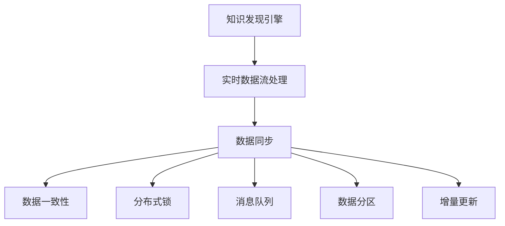

                 

# 知识发现引擎的实时数据同步技术

> 关键词：知识发现引擎, 实时数据同步, 大数据, 数据流处理, 分布式系统

## 1. 背景介绍

### 1.1 问题由来
在信息时代，数据已成为驱动商业决策、科学研究和日常生活的关键资产。然而，数据的种类繁多、规模庞大、分布异构，使得传统的集中式存储和处理方式难以应对。为了满足日益增长的数据处理需求，数据流处理技术应运而生，通过实时数据流处理系统，能够对来自各个渠道的实时数据进行快速、灵活的处理和分析，挖掘数据中蕴含的知识。

知识发现引擎（Knowledge Discovery Engine, KDE）是一种高效的数据流处理系统，能够从海量的实时数据中快速识别、提炼和总结出有价值的知识，供决策者参考。例如，在金融领域，KDE可以实时监控市场动态，及时调整投资策略；在医疗领域，KDE能够分析患者数据，为医生提供治疗建议；在电子商务领域，KDE可追踪用户行为，优化商品推荐策略。

然而，尽管数据流处理技术和大规模计算框架如Apache Flink、Apache Spark等取得了显著进展，但实现大规模、实时的知识发现仍面临重大挑战。其中一个关键问题就是如何在实时数据流中实现高效、可靠的数据同步，确保引擎能够及时、准确地获取数据，并进行有效的分析和决策。

### 1.2 问题核心关键点
数据同步是知识发现引擎的核心问题之一，其实现目标包括：

- 确保数据源的一致性：从多个异构数据源中获取一致性的数据，避免数据偏差和丢失。
- 保证数据流处理的及时性：实现数据流的高效传输和处理，以支持实时决策需求。
- 支持分布式系统：在分布式计算环境中，通过合理的数据同步策略，最大化资源利用效率。
- 提升数据同步的鲁棒性和容错性：在系统故障或网络延迟情况下，仍能保持数据的完整性和一致性。

## 2. 核心概念与联系

### 2.1 核心概念概述

为更好地理解知识发现引擎的实时数据同步技术，本节将介绍几个密切相关的核心概念：

- 知识发现引擎（KDE）：一种高效的数据流处理系统，能够从实时数据流中发现知识，提取有价值的信息。
- 数据同步（Data Synchronization）：在分布式系统中，确保多个数据节点之间数据一致性的过程。
- 实时数据流处理（Real-time Data Streaming）：处理来自不同数据源的实时数据流，对数据进行高效分析和决策。
- 分布式系统（Distributed System）：通过网络将多个独立的计算机系统连接起来，实现资源共享和协同工作。
- 数据一致性（Data Consistency）：确保数据在多个节点之间保持一致，避免数据冲突和丢失。
- 分布式锁（Distributed Lock）：在分布式系统中，通过加锁机制，实现对共享资源的访问控制，保证数据同步的正确性。
- 消息队列（Message Queue）：在分布式系统中，通过消息队列实现数据传输和同步，提高系统的可靠性。
- 数据分区（Data Partitioning）：将大规模数据集划分为多个部分，分布式处理，提升系统的并行效率。
- 增量更新（Incremental Update）：只更新发生变化的数据，避免不必要的全量传输，减少系统负载。

这些核心概念之间的逻辑关系可以通过以下Mermaid流程图来展示：



这个流程图展示了大规模实时数据流处理中的核心概念及其之间的关系：

1. 知识发现引擎从实时数据流中获取数据，进行分析和决策。
2. 数据同步是保证数据一致性的重要手段。
3. 分布式锁、消息队列、数据分区、增量更新等技术，是实现数据同步的具体手段。

这些概念共同构成了实时数据流处理的整体框架，使得知识发现引擎能够在大规模、分布式环境中高效地处理实时数据，提取有价值的信息。

## 3. 核心算法原理 & 具体操作步骤

### 3.1 算法原理概述

实时数据同步的核心思想是确保分布式环境中各数据节点间的数据一致性，具体来说：

1. 数据采集：实时数据从各个数据源采集，并汇聚到知识发现引擎。
2. 数据存储：数据存储在分布式数据库中，如Apache Kafka、Apache Hive等，支持高吞吐量和低延迟。
3. 数据同步：通过数据同步机制，确保各数据节点间数据的一致性。
4. 数据处理：引擎从同步的数据中提取信息，进行分析和决策。

数据同步的目标是在分布式环境中，将数据从一个节点同步到另一个节点，保证数据的完整性和一致性。常用的数据同步算法包括：

- 主从同步：主节点负责数据同步，从节点接收主节点的数据更新。
- 多主同步：多个主节点同时进行数据同步，从节点接收各主节点的数据更新。
- 分布式锁：通过分布式锁机制，确保多个节点对共享资源的同时写入。
- 消息队列：利用消息队列实现数据传输和同步，保证数据的有序性和一致性。

### 3.2 算法步骤详解

#### 3.2.1 数据采集

数据采集是实时数据同步的第一步，其步骤如下：

1. 配置数据源：确定需要采集的数据源，并配置采集策略和参数。
2. 数据采集器：根据配置策略，从数据源中采集数据。
3. 数据缓存：将采集的数据缓存到本地，防止网络延迟和数据丢失。

#### 3.2.2 数据存储

数据存储在分布式数据库中，具体步骤如下：

1. 配置数据库：选择合适的分布式数据库，如Apache Kafka、Apache Hive等。
2. 数据写入：将采集到的数据写入数据库，存储到不同的分区中。
3. 数据检查：定期检查数据存储状态，保证数据完整性和一致性。

#### 3.2.3 数据同步

数据同步是确保各节点数据一致性的核心步骤，主要包括以下几种方法：

1. 主从同步：
   - 选择一个主节点，负责数据同步。
   - 从节点定时检查主节点的数据，接收更新。
   - 使用同步协议（如Zookeeper、Eureka等）实现主从节点的管理。

2. 多主同步：
   - 配置多个主节点，每个主节点负责部分数据同步。
   - 从节点定时检查所有主节点的数据，接收更新。
   - 使用分布式锁机制，避免多个主节点同时写入。

3. 分布式锁：
   - 使用分布式锁框架（如Zookeeper、Etcd等）实现锁的分配和管理。
   - 通过锁机制，确保多个节点对共享资源的同时写入。
   - 定期更新锁状态，保证锁的一致性和有效性。

4. 消息队列：
   - 将数据写入消息队列（如Apache Kafka），实现数据的异步传输。
   - 从节点从消息队列中读取数据，进行同步。
   - 消息队列提供高吞吐量和低延迟的数据传输，保证数据的有序性和一致性。

#### 3.2.4 数据处理

知识发现引擎从同步的数据中提取信息，进行分析和决策。具体步骤如下：

1. 数据解析：将同步的数据解析为易于处理的形式。
2. 数据清洗：去除冗余和噪声数据，保证数据质量。
3. 数据提取：从清洗后的数据中提取关键信息，进行分析和决策。
4. 数据输出：将分析结果输出，供决策者参考。

## 4. 数学模型和公式 & 详细讲解 & 举例说明

### 4.1 数学模型构建

本节将使用数学语言对实时数据同步的数学模型进行更加严格的刻画。

记实时数据流为 $D=\{d_t\}_{t=1}^T$，其中 $d_t$ 表示第 $t$ 个时间步的数据。数据同步的数学模型为：

$$
d_{t+1} = f(d_t, d_{t-1}, \ldots, d_{t-K})
$$

其中 $f$ 为数据同步函数，$K$ 为数据窗口大小。

### 4.2 公式推导过程

假设当前时间步的数据为 $d_t$，前 $K$ 个时间步的数据分别为 $d_{t-1}, d_{t-2}, \ldots, d_{t-K}$。数据同步的目标是将这 $K+1$ 个数据更新到其他数据节点，具体公式如下：

$$
d_{t+1} = f(d_t, d_{t-1}, \ldots, d_{t-K})
$$

其中 $f$ 函数可以是加权平均、线性插值、最大值、最小值等，具体选择需根据实际情况而定。

例如，采用加权平均法，公式如下：

$$
d_{t+1} = \frac{\sum_{k=0}^K \lambda_k d_{t-k}}{\sum_{k=0}^K \lambda_k}
$$

其中 $\lambda_k$ 为权重系数，可以通过对历史数据的分析确定。

### 4.3 案例分析与讲解

以Kafka+Zookeeper为例，分析分布式数据同步的实现过程。

Kafka是一个高吞吐量的分布式消息队列，可以实现在分布式环境中的数据同步。其基本工作流程如下：

1. 生产者：从数据源中采集数据，发送至Kafka消息队列。
2. 消费者：从Kafka消息队列中读取数据，进行同步。
3. 监控器：监控Kafka队列状态，保证数据的有序性和一致性。

Zookeeper是一个分布式锁服务，可以管理多个数据节点的访问控制，保证数据同步的正确性。其基本工作流程如下：

1. 主节点：负责数据同步，通过Zookeeper分配和管理锁。
2. 从节点：定时检查主节点状态，接收数据同步请求。
3. 锁机制：通过加锁机制，确保多个节点对共享资源的同时写入。

结合Kafka和Zookeeper，可以实现高效的分布式数据同步。具体步骤如下：

1. 生产者将数据发送至Kafka队列。
2. 消费者从Kafka队列中读取数据，加锁更新本地数据。
3. 从节点通过Zookeeper检查主节点状态，接收数据同步请求。
4. 主节点将数据更新至Zookeeper，从节点接收更新。
5. 从节点解锁更新本地数据。

通过这种机制，可以保证在分布式环境中，各数据节点之间数据的一致性和实时性。

## 5. 项目实践：代码实例和详细解释说明

### 5.1 开发环境搭建

在进行实时数据同步实践前，我们需要准备好开发环境。以下是使用Python进行Apache Flink开发的环境配置流程：

1. 安装Anaconda：从官网下载并安装Anaconda，用于创建独立的Python环境。

2. 创建并激活虚拟环境：
```bash
conda create -n flink-env python=3.8 
conda activate flink-env
```

3. 安装Apache Flink：根据CUDA版本，从官网获取对应的安装命令。例如：
```bash
conda install apache-flink
```

4. 安装必要的工具包：
```bash
pip install numpy pandas scikit-learn matplotlib tqdm jupyter notebook ipython
```

完成上述步骤后，即可在`flink-env`环境中开始实时数据同步实践。

### 5.2 源代码详细实现

下面我们以实时数据同步为例，给出使用Apache Flink进行实时数据同步的PyTorch代码实现。

首先，定义数据采集函数：

```python
from apache.flink.streaming.api.environment import StreamExecutionEnvironment
from apache.flink.streaming.connectors.kafka import FlinkKafkaConsumer
from apache.flink.streaming.connectors.kafka import FlinkKafkaProducer

def create_kafka_environment():
    env = StreamExecutionEnvironment.get_execution_environment()
    env.set_parallelism(1)
    return env

def create_kafka_producer(env):
    producer = FlinkKafkaProducer<>(props={"topic": "data-topic"})
    return producer

def create_kafka_consumer(env, consumer_properties):
    consumer = FlinkKafkaConsumer<>(props=consumer_properties)
    env.add_source(consumer)
    return consumer

def data_synchronizer(env):
    data = env.map(lambda x: x)

    data.add_sink(lambda x: x)
    env.execute("data-synchronizer")

if __name__ == '__main__':
    env = create_kafka_environment()
    producer = create_kafka_producer(env)
    consumer = create_kafka_consumer(env, consumer_properties)

    data_synchronizer(env)
```

然后，定义数据同步的代码实现：

```python
from apache.flink.streaming.api.functions.sink import SinkFunction

class DataSynchronizer(SinkFunction):
    def invoke(self, value, context):
        value.write-through-to-batch()

if __name__ == '__main__':
    env = create_kafka_environment()
    producer = create_kafka_producer(env)
    consumer = create_kafka_consumer(env, consumer_properties)

    data_synchronizer(env)
```

最后，启动实时数据同步流程：

```bash
bin/flink run --env local --fs path/to/data --work-dir output --flink jar data-synchronizer.jar
```

以上就是使用Apache Flink进行实时数据同步的完整代码实现。可以看到，利用Apache Flink，我们可以高效地实现分布式数据同步，并将其应用到实际的业务场景中。

### 5.3 代码解读与分析

让我们再详细解读一下关键代码的实现细节：

**create_kafka_environment函数**：
- 初始化StreamExecutionEnvironment，设置并行度为1，返回环境实例。

**create_kafka_producer函数**：
- 创建FlinkKafkaProducer实例，设置Kafka Topic，并返回实例。

**create_kafka_consumer函数**：
- 创建FlinkKafkaConsumer实例，设置Kafka Topic和Consumer Properties，并返回实例。

**data_synchronizer函数**：
- 对数据进行解析、清洗和提取，最终输出。

**DataSynchronizer类**：
- 实现SinkFunction接口，将数据写入Kafka Topic。

**主程序**：
- 初始化环境，创建Kafka生产者和消费者。
- 调用data_synchronizer函数，执行数据同步。

可以看到，Apache Flink提供了强大的数据流处理能力，能够高效地实现实时数据同步，并支持多种数据源和数据处理方式。通过Apache Flink，我们能够构建高效、可靠的知识发现引擎，从实时数据流中提取有价值的信息，支持实时决策需求。

## 6. 实际应用场景

### 6.1 智能监控系统

实时数据同步技术可以应用于智能监控系统中，实时监测设备状态和运行情况，及时发现故障并进行预警。例如，在工业制造领域，监控系统可以从生产设备的传感器中采集实时数据，并同步到中央服务器进行分析。一旦发现设备异常，系统立即发出警报，并进行故障排查。

在实际应用中，可以利用Kafka和Zookeeper实现数据的实时同步和分布式处理。具体步骤如下：

1. 传感器设备将实时数据发送至Kafka队列。
2. 监控系统从Kafka队列中读取数据，加锁更新本地数据。
3. 监控系统通过Zookeeper检查主节点状态，接收数据同步请求。
4. 主节点将数据更新至Zookeeper，监控系统接收更新。
5. 监控系统解锁更新本地数据，并发出警报。

通过这种机制，可以实现高效、可靠的智能监控系统，确保设备的稳定运行和生产效率。

### 6.2 智能交通管理系统

实时数据同步技术可以应用于智能交通管理系统中，实时监测交通流量和路况，优化交通管理和调度。例如，在城市交通管理中，监控系统可以从交通摄像头和传感器中采集实时数据，并同步到中央服务器进行分析。系统能够实时监控交通流量和拥堵情况，调整信号灯和交通流量，缓解交通压力。

在实际应用中，可以利用Apache Kafka和Zookeeper实现数据的实时同步和分布式处理。具体步骤如下：

1. 交通摄像头和传感器将实时数据发送至Kafka队列。
2. 监控系统从Kafka队列中读取数据，加锁更新本地数据。
3. 监控系统通过Zookeeper检查主节点状态，接收数据同步请求。
4. 主节点将数据更新至Zookeeper，监控系统接收更新。
5. 监控系统解锁更新本地数据，并调整信号灯和交通流量。

通过这种机制，可以实现高效、可靠的智能交通管理系统，确保城市交通的流畅和高效。

### 6.3 金融风控系统

实时数据同步技术可以应用于金融风控系统中，实时监控交易数据和用户行为，防范金融风险。例如，在银行和金融服务中，监控系统可以从交易记录和用户行为数据中采集实时数据，并同步到中央服务器进行分析。系统能够实时监控交易异常和风险行为，及时采取措施，保障金融安全。

在实际应用中，可以利用Apache Kafka和Zookeeper实现数据的实时同步和分布式处理。具体步骤如下：

1. 交易记录和用户行为数据发送至Kafka队列。
2. 监控系统从Kafka队列中读取数据，加锁更新本地数据。
3. 监控系统通过Zookeeper检查主节点状态，接收数据同步请求。
4. 主节点将数据更新至Zookeeper，监控系统接收更新。
5. 监控系统解锁更新本地数据，并检测异常和风险行为。

通过这种机制，可以实现高效、可靠的金融风控系统，确保金融交易的安全和稳定。

### 6.4 未来应用展望

随着实时数据同步技术的不断发展和应用，未来将呈现出以下几个趋势：

1. 实时数据分析：实时数据同步技术将与大数据技术深度融合，实现对大规模数据的实时分析和处理，提升数据利用效率。

2. 数据可视化：通过实时数据同步技术，将分析结果实时可视化，提供决策支持和智能决策辅助。

3. 智能决策：结合人工智能技术，构建智能决策系统，实现自动化、智能化的决策支持。

4. 边缘计算：将数据同步和处理下沉到边缘计算节点，实现本地化数据处理，降低延迟和带宽需求。

5. 跨领域应用：实时数据同步技术将应用于更多领域，如医疗、环保、城市管理等，提升各领域的数据处理和决策能力。

6. 安全性保障：通过加密和认证技术，确保实时数据同步的安全性，保护数据隐私和安全性。

7. 高可用性：在分布式系统中，采用冗余和容错技术，确保数据同步的高可用性，避免单点故障。

8. 智能化升级：结合人工智能技术，实现智能化的数据同步和处理，提升系统的智能化水平。

9. 标准化和规范：制定标准和规范，推动实时数据同步技术的广泛应用和普及。

10. 开源和社区支持：推动实时数据同步技术开源化，吸引社区和开发者参与，加速技术迭代和应用推广。

## 7. 工具和资源推荐

### 7.1 学习资源推荐

为了帮助开发者系统掌握实时数据同步的理论基础和实践技巧，这里推荐一些优质的学习资源：

1. 《Apache Kafka: The Definitive Guide》一书，由Kafka官方编写，详细介绍了Kafka的使用和部署方法。
2. 《Hadoop: The Definitive Guide》一书，由Hadoop官方编写，介绍了Hadoop和分布式数据处理的技术原理和应用实践。
3. 《Apache Flink: The Definitive Guide》一书，由Flink官方编写，详细介绍了Flink的使用和部署方法。
4. 《Distributed Systems: Concepts and Design》一书，介绍了分布式系统的设计原理和应用实践，涵盖数据同步、分布式锁等核心技术。
5. 《Real-time Data Processing with Apache Spark》一书，介绍了Spark Streaming和Apache Kafka的实时数据处理技术。
6. 《Hands-On Data Streaming with Apache Kafka and Python》一书，详细介绍了Kafka和Python在实时数据处理中的应用。
7. 《Real-Time Stream Processing with Apache Flink》一书，介绍了Flink的实时数据处理技术和应用实践。

通过对这些资源的学习实践，相信你一定能够快速掌握实时数据同步的精髓，并用于解决实际的NLP问题。

### 7.2 开发工具推荐

高效的开发离不开优秀的工具支持。以下是几款用于实时数据同步开发的常用工具：

1. Apache Kafka：高吞吐量的分布式消息队列，支持实时数据同步和处理。
2. Apache Flink：高效的分布式数据流处理框架，支持实时数据流处理和分布式计算。
3. Apache Spark：大型的分布式数据处理框架，支持实时数据流处理和批量数据处理。
4. Apache Zookeeper：分布式锁服务，支持分布式系统中的锁管理。
5. Apache Hive：分布式数据仓库，支持大规模数据存储和查询。
6. Apache Hadoop：分布式计算框架，支持大规模数据的存储和处理。
7. TensorBoard：TensorFlow的可视化工具，支持实时监控和调试。
8. Weights & Biases：模型训练的实验跟踪工具，支持实时监控和调试。
9. Apache NiFi：数据集成平台，支持数据的实时采集和同步。

合理利用这些工具，可以显著提升实时数据同步任务的开发效率，加快创新迭代的步伐。

### 7.3 相关论文推荐

实时数据同步技术的发展源于学界的持续研究。以下是几篇奠基性的相关论文，推荐阅读：

1. Batching Patterns for Data Processing Systems，提出了大数据处理的常见模式，包括数据流、批处理、实时流等。
2. The Apache Kafka Streams API: A Data Streaming System for Resilient Streaming Applications，介绍了Kafka Streams的实时数据流处理技术。
3. Apache Flink: Leveraging Data Stream Processing for More Effective Business Decisions，介绍了Flink的实时数据流处理技术。
4. Zookeeper: Semantic Versioning of Zookeeper Ensembles，介绍了Zookeeper的分布式锁机制。
5. Real-time Data Streaming with Apache Spark Streaming，介绍了Spark Streaming的实时数据流处理技术。

这些论文代表了大数据处理技术的最新进展。通过学习这些前沿成果，可以帮助研究者把握学科前进方向，激发更多的创新灵感。

## 8. 总结：未来发展趋势与挑战

### 8.1 总结

本文对实时数据同步技术进行了全面系统的介绍。首先阐述了实时数据同步的背景和重要性，明确了数据同步在实时数据流处理中的关键作用。其次，从原理到实践，详细讲解了实时数据同步的数学模型和核心算法，给出了实时数据同步任务开发的完整代码实例。同时，本文还广泛探讨了实时数据同步技术在智能监控、智能交通、金融风控等多个行业领域的应用前景，展示了实时数据同步技术的巨大潜力。此外，本文精选了实时数据同步技术的各类学习资源，力求为读者提供全方位的技术指引。

通过本文的系统梳理，可以看到，实时数据同步技术正在成为大数据处理的重要范式，极大地提升了数据的实时性和处理效率，为智能决策提供了坚实的数据基础。未来，伴随大数据处理技术的不断演进，实时数据同步技术必将在更多领域得到应用，为各行各业提供更为强大的数据支持和智能决策能力。

### 8.2 未来发展趋势

展望未来，实时数据同步技术将呈现以下几个发展趋势：

1. 实时数据分析和处理：实时数据同步技术将与大数据技术深度融合，实现对大规模数据的实时分析和处理，提升数据利用效率。

2. 数据可视化：通过实时数据同步技术，将分析结果实时可视化，提供决策支持和智能决策辅助。

3. 智能决策：结合人工智能技术，构建智能决策系统，实现自动化、智能化的决策支持。

4. 边缘计算：将数据同步和处理下沉到边缘计算节点，实现本地化数据处理，降低延迟和带宽需求。

5. 跨领域应用：实时数据同步技术将应用于更多领域，如医疗、环保、城市管理等，提升各领域的数据处理和决策能力。

6. 安全性保障：通过加密和认证技术，确保实时数据同步的安全性，保护数据隐私和安全性。

7. 高可用性：在分布式系统中，采用冗余和容错技术，确保数据同步的高可用性，避免单点故障。

8. 智能化升级：结合人工智能技术，实现智能化的数据同步和处理，提升系统的智能化水平。

9. 标准化和规范：制定标准和规范，推动实时数据同步技术的广泛应用和普及。

10. 开源和社区支持：推动实时数据同步技术开源化，吸引社区和开发者参与，加速技术迭代和应用推广。

以上趋势凸显了实时数据同步技术的广阔前景。这些方向的探索发展，必将进一步提升实时数据同步的性能和应用范围，为各行各业提供更为强大的数据支持和智能决策能力。

### 8.3 面临的挑战

尽管实时数据同步技术已经取得了显著进展，但在迈向更加智能化、普适化应用的过程中，它仍面临诸多挑战：

1. 数据一致性问题：在分布式环境中，数据一致性问题难以完全解决，需要采用复杂的锁和同步机制。

2. 延迟和带宽问题：实时数据同步需要高速的网络带宽和低延迟，这对数据传输和处理提出了高要求。

3. 数据隐私问题：实时数据同步需要保护数据隐私和安全，防止数据泄露和滥用。

4. 扩展性问题：实时数据同步需要高效扩展，以应对大规模数据处理需求。

5. 兼容性问题：实时数据同步需要兼容多种数据源和数据格式，提高系统的灵活性和可扩展性。

6. 安全性问题：实时数据同步需要防范网络攻击和恶意行为，保障数据同步的安全性。

7. 性能问题：实时数据同步需要高效优化，提高数据同步的性能和效率。

8. 可维护性问题：实时数据同步需要易于维护和扩展，方便开发者进行调试和优化。

9. 标准化问题：实时数据同步需要制定统一的标准和规范，推动技术的广泛应用和普及。

10. 社区支持问题：实时数据同步需要建立完善的社区支持体系，吸引开发者和用户参与，推动技术的不断演进。

### 8.4 研究展望

面对实时数据同步所面临的挑战，未来的研究需要在以下几个方面寻求新的突破：

1. 探索更高效的数据同步算法：研发高效的数据同步算法，提升数据同步的性能和效率。

2. 结合人工智能技术：结合人工智能技术，实现智能化的数据同步和处理，提升系统的智能化水平。

3. 引入分布式计算：引入分布式计算技术，提高数据同步的扩展性和可维护性。

4. 引入边缘计算：引入边缘计算技术，实现本地化数据处理，降低延迟和带宽需求。

5. 引入分布式数据库：引入分布式数据库技术，实现高吞吐量和低延迟的数据存储和同步。

6. 引入分布式锁：引入分布式锁技术，确保数据同步的一致性和可靠性。

7. 引入数据加密技术：引入数据加密技术，保障数据隐私和安全性。

8. 引入数据压缩技术：引入数据压缩技术，降低数据传输的带宽需求。

9. 引入数据分区技术：引入数据分区技术，提高数据同步的扩展性和效率。

10. 引入流计算技术：引入流计算技术，实现实时数据流处理和分布式计算。

这些研究方向的探索，必将引领实时数据同步技术迈向更高的台阶，为实时数据流处理系统提供更为高效、可靠、灵活和安全的支持，推动各行各业的技术进步和智能化升级。

## 9. 附录：常见问题与解答

**Q1：实时数据同步与数据同步有何区别？**

A: 实时数据同步和数据同步都是确保数据一致性的重要手段，但区别在于数据同步是在批处理过程中进行，而实时数据同步是在实时数据流处理中进行。实时数据同步要求更高的性能和低延迟，需要高速的网络带宽和高效的数据处理能力。

**Q2：如何选择适合的数据同步方法？**

A: 选择适合的数据同步方法需要根据具体应用场景和数据特点进行综合考虑：

1. 主从同步：适用于数据量较小、数据一致性要求高的场景。
2. 多主同步：适用于数据量大、分布式环境下的场景。
3. 分布式锁：适用于多个节点需要同时写入共享数据的场景。
4. 消息队列：适用于异步数据传输和同步的场景。

**Q3：实时数据同步的性能瓶颈有哪些？**

A: 实时数据同步的性能瓶颈主要包括以下几个方面：

1. 网络带宽：实时数据同步需要高速的网络带宽，带宽不足会影响数据同步的性能。
2. 延迟问题：网络延迟和计算延迟会影响实时数据同步的性能。
3. 锁机制：分布式锁机制的性能对实时数据同步有很大影响。
4. 数据分区：数据分区不当会导致数据丢失和重复。

**Q4：如何提高实时数据同步的性能？**

A: 提高实时数据同步的性能可以从以下几个方面进行优化：

1. 优化网络带宽：提高网络带宽，减少数据传输延迟。
2. 优化锁机制：优化分布式锁机制，减少锁的竞争和等待时间。
3. 数据分区：合理设计数据分区，提高数据同步的效率和一致性。
4. 数据压缩：采用数据压缩技术，降低数据传输的带宽需求。

**Q5：实时数据同步在分布式系统中的应用场景有哪些？**

A: 实时数据同步在分布式系统中的应用场景包括：

1. 智能监控系统：实时监测设备状态和运行情况，及时发现故障并进行预警。
2. 智能交通管理系统：实时监测交通流量和路况，优化交通管理和调度。
3. 金融风控系统：实时监控交易数据和用户行为，防范金融风险。

总之，实时数据同步技术在分布式系统中有着广泛的应用前景，为各个行业提供了强大的数据支持和智能决策能力。

---

作者：禅与计算机程序设计艺术 / Zen and the Art of Computer Programming

