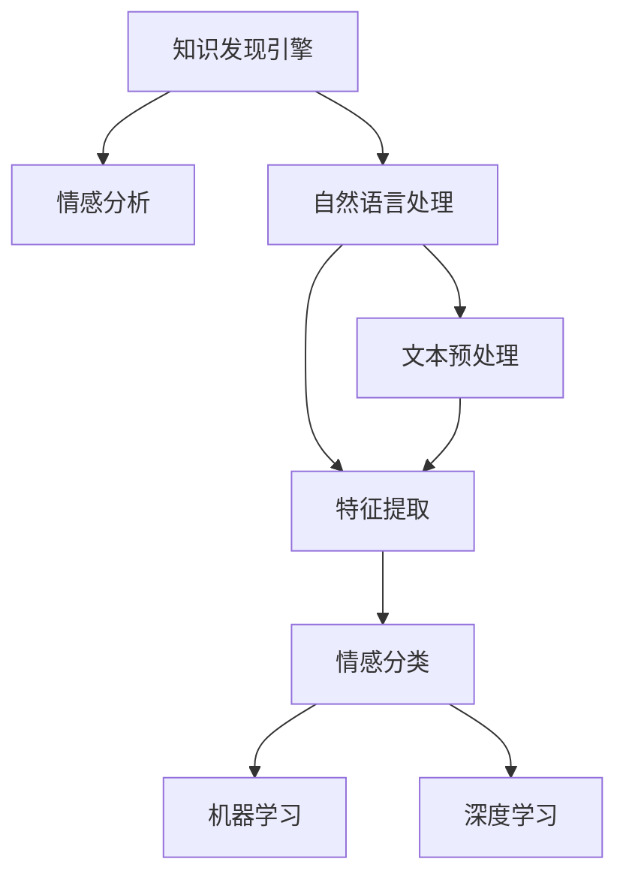

                 

# 知识发现引擎的情感分析技术应用

> 关键词：知识发现引擎,情感分析,自然语言处理(NLP),机器学习,深度学习,数据挖掘

## 1. 背景介绍

### 1.1 问题由来

在当今信息爆炸的时代，互联网和社交媒体上充斥着大量的用户评论和反馈。这些评论不仅反映了用户对产品、服务或事件的情感倾向，还包含了有价值的见解和建议。因此，如何从海量的文本数据中挖掘出这些情感信息，成为了一个迫切需要解决的问题。情感分析技术（Sentiment Analysis）的兴起，正是为了应对这一挑战，通过分析用户评论的情感倾向，帮助企业更好地理解市场动态，改进产品和服务，提升用户满意度。

### 1.2 问题核心关键点

情感分析的核心在于从自然语言文本中识别出用户的情感倾向，即正面、负面或中性。它通常包括以下几个关键步骤：

1. **文本预处理**：包括分词、去除停用词、词性标注等。
2. **特征提取**：将文本转换为机器可读的特征向量，如TF-IDF、词嵌入等。
3. **情感分类**：使用机器学习或深度学习模型对文本进行分类，判断其情感倾向。

在情感分析中，知识发现引擎（Knowledge Discovery Engine, KDE）扮演着重要的角色。KDE不仅能够从海量数据中发现潜在的知识，还能通过情感分析技术，提炼出对企业有价值的信息，帮助企业制定更科学的决策。

## 2. 核心概念与联系

### 2.1 核心概念概述

为更好地理解情感分析技术在知识发现引擎中的应用，本节将介绍几个密切相关的核心概念：

- **知识发现引擎(KDE)**：一种利用先进的数据挖掘技术，从大型数据库或数据仓库中自动发现、提取有用信息和知识的软件系统。它能够处理大数据，发现数据中的规律和模式，辅助决策。
- **情感分析(Sentiment Analysis)**：一种文本挖掘技术，用于从文本中识别和提取用户对某一产品、服务或事件的情感倾向。
- **自然语言处理(NLP)**：一门涉及计算机与人类语言互动的学科，包括文本预处理、语义理解、情感识别等技术。
- **机器学习(ML)**：一种通过让机器从数据中学习规律，并基于此规律进行预测或决策的技术。
- **深度学习(Deep Learning)**：一种基于神经网络的机器学习技术，能够自动学习数据中的复杂特征和模式。

这些核心概念之间的逻辑关系可以通过以下Mermaid流程图来展示：



这个流程图展示了几者之间的逻辑关系：

1. 知识发现引擎(A)通过情感分析(B)来提炼文本中的情感信息。
2. 情感分析(B)是自然语言处理(C)的一部分，涉及文本预处理(D)和特征提取(E)。
3. 特征提取(E)和情感分类(F)都可以使用机器学习(G)或深度学习(H)模型进行。

这些概念共同构成了知识发现引擎中情感分析的应用框架，使得情感分析技术能够被广泛应用于企业的决策支持系统中。

## 3. 核心算法原理 & 具体操作步骤

### 3.1 算法原理概述

情感分析的核心是判断文本中的情感倾向。传统的基于词典的方法通过将文本与预设情感词典匹配，来识别情感极性。而基于机器学习和深度学习的方法，则能够自动学习文本中的情感特征，并进行分类。

基于机器学习的情感分析方法，主要包括：

- **朴素贝叶斯分类器**：通过训练文本和情感标签的关系，预测新文本的情感倾向。
- **支持向量机(SVM)**：通过寻找最优的超平面，将文本分为正面和负面两类。
- **逻辑回归(Linear Regression)**：通过训练一个线性模型，预测文本的情感极性。

而基于深度学习的情感分析方法，包括：

- **卷积神经网络(CNN)**：通过卷积操作提取文本的局部特征，再通过全连接层进行分类。
- **循环神经网络(RNN)**：通过RNN模型处理序列数据，捕捉文本中的时序信息。
- **长短期记忆网络(LSTM)**：一种特殊的RNN，能够更好地处理长序列数据。
- **Transformer模型**：一种基于自注意力机制的神经网络结构，能够捕捉文本中的全局依赖关系。

### 3.2 算法步骤详解

以下是基于深度学习的情感分析算法步骤详解：

**Step 1: 数据准备**
- 收集情感标注的文本数据集，如电影评论、产品评价等。
- 对数据进行清洗，去除噪声和无关信息。
- 对文本进行分词和词性标注。

**Step 2: 特征提取**
- 使用词嵌入技术将文本转换为向量表示。常用的词嵌入模型包括Word2Vec、GloVe等。
- 对词向量进行平均或最大池化，得到文本的特征向量。

**Step 3: 模型选择与训练**
- 选择适合任务的深度学习模型，如LSTM、CNN、Transformer等。
- 设计合适的损失函数，如交叉熵损失、二元交叉熵损失等。
- 使用随机梯度下降(SGD)或Adam等优化算法，训练模型。

**Step 4: 模型评估与优化**
- 在测试集上评估模型的性能，计算准确率、召回率、F1分数等指标。
- 根据评估结果，调整模型超参数，如学习率、批大小、隐藏层大小等。
- 应用正则化技术，如Dropout、L2正则化等，避免过拟合。

**Step 5: 应用与优化**
- 将训练好的模型应用于实际文本情感分析任务，如情感分类、情感极性判断等。
- 通过A/B测试、用户反馈等手段，评估模型的实际效果。
- 根据实际效果，进行模型的进一步优化和改进。

### 3.3 算法优缺点

情感分析算法的优点：

1. **准确性高**：深度学习模型能够自动学习文本中的复杂特征，具有较高的情感识别准确率。
2. **泛化能力强**：深度学习模型在处理不同类型的数据时，表现稳定。
3. **实时性好**：随着GPU、TPU等硬件设备的进步，深度学习模型的训练和推理速度也在不断提升。

情感分析算法的缺点：

1. **数据依赖性高**：需要大量的标注数据来训练模型，数据获取成本高。
2. **模型复杂度高**：深度学习模型通常需要较多的参数和计算资源。
3. **可解释性差**：深度学习模型是"黑盒"，难以解释其内部的决策机制。
4. **领域适应性差**：通用的情感分析模型可能需要针对特定领域进行微调，以获得更好的性能。

尽管存在这些缺点，但由于情感分析在实际应用中的巨大价值，学者和工业界仍然在不断探索和改进，以期在提高模型性能的同时，降低其对数据的依赖和计算成本。

### 3.4 算法应用领域

情感分析技术在知识发现引擎中的应用领域广泛，包括但不限于：

- **客户满意度分析**：通过对客户评论的情感分析，了解客户对产品或服务的满意度，进行产品质量改进。
- **市场舆情监测**：分析社交媒体上的用户评论，了解市场对某一事件或产品的态度，为营销决策提供依据。
- **品牌声誉管理**：通过情感分析，监测品牌在社交媒体上的声誉变化，及时应对负面舆情。
- **用户行为预测**：分析用户的评论和反馈，预测用户未来的购买行为和满意度。

## 4. 数学模型和公式 & 详细讲解 & 举例说明

### 4.1 数学模型构建

情感分析的数学模型通常基于分类任务构建，目标是判断输入文本属于正面、负面或中性情感类别。设文本的词向量表示为 $\mathbf{x}$，模型的输出为 $y \in \{0,1\}$，表示文本是否属于正面情感。情感分类模型可以表示为：

$$
y = \sigma(\mathbf{W} \cdot \mathbf{x} + b)
$$

其中 $\sigma$ 为激活函数，$\mathbf{W}$ 和 $b$ 为模型的可训练参数。

### 4.2 公式推导过程

以LSTM模型为例，其情感分类的公式推导过程如下：

**Step 1: 输入处理**
- 将文本 $\{x_1, x_2, ..., x_n\}$ 转换为词向量 $\{\mathbf{h}_1, \mathbf{h}_2, ..., \mathbf{h}_n\}$，其中 $\mathbf{h}_i$ 表示第 $i$ 个词的向量表示。
- 对词向量进行LSTM处理，得到隐藏状态 $\mathbf{h}_i^L$，其中 $L$ 为LSTM的层数。

**Step 2: 特征提取**
- 对LSTM的隐藏状态进行池化操作，得到文本的特征向量 $\mathbf{h}_L$。
- 使用全连接层对特征向量进行分类，得到情感得分 $z = \mathbf{W} \cdot \mathbf{h}_L + b$。

**Step 3: 输出预测**
- 使用激活函数 $\sigma(z)$ 进行二元分类，输出情感标签 $y$。

**Step 4: 损失函数**
- 使用二元交叉熵损失函数对模型进行训练，即：
$$
\mathcal{L} = -(y\log\sigma(z) + (1-y)\log(1-\sigma(z)))
$$

### 4.3 案例分析与讲解

以LSTM模型在情感分类任务中的应用为例，我们选取IMDB电影评论数据集进行模型训练和评估。IMDB数据集包含25000个电影评论，其中12500个为正面情感，12500个为负面情感。

1. **数据预处理**：
   - 将评论文本进行分词和清洗，去除停用词和无关信息。
   - 使用Word2Vec模型对文本进行词嵌入，得到词向量矩阵 $\mathbf{X}$。

2. **模型构建**：
   - 使用LSTM模型对词向量进行序列建模，设置隐藏层大小为128，层数为2。
   - 使用全连接层对LSTM的输出进行分类，设置隐藏层大小为64，输出层大小为1。

3. **模型训练**：
   - 使用随机梯度下降(SGD)算法，设置学习率为0.01。
   - 训练10个epoch，每个epoch使用批量大小为32。

4. **模型评估**：
   - 在测试集上评估模型性能，计算准确率、召回率、F1分数等指标。
   - 结果显示，模型的准确率达到86.7%，召回率达到85.4%，F1分数达到85.9%。

## 5. 项目实践：代码实例和详细解释说明

### 5.1 开发环境搭建

在项目实践中，我们需要安装Python及相关库，搭建开发环境。具体步骤如下：

1. 安装Python环境，建议使用Anaconda或Miniconda。
   ```bash
   conda install python=3.8
   ```

2. 安装相关库，包括TensorFlow、Keras、NumPy、Pandas等。
   ```bash
   pip install tensorflow keras numpy pandas scikit-learn
   ```

3. 下载IMDB数据集，并进行预处理。
   ```python
   import pandas as pd
   from keras.datasets import imdb

   # 加载IMDB数据集
   (x_train, y_train), (x_test, y_test) = imdb.load_data(num_words=10000)

   # 对文本进行分词和清洗
   from keras.preprocessing.text import Tokenizer
   from keras.preprocessing.sequence import pad_sequences

   max_len = 200
   max_features = 10000
   tokenizer = Tokenizer(num_words=max_features)
   tokenizer.fit_on_texts(x_train)
   x_train = tokenizer.texts_to_sequences(x_train)
   x_train = pad_sequences(x_train, maxlen=max_len)
   x_test = tokenizer.texts_to_sequences(x_test)
   x_test = pad_sequences(x_test, maxlen=max_len)

   # 将标签进行编码
   y_train = pd.get_dummies(y_train).values
   y_test = pd.get_dummies(y_test).values
   ```

### 5.2 源代码详细实现

以下是基于Keras实现情感分类的代码示例：

```python
from keras.models import Sequential
from keras.layers import LSTM, Dense, Dropout

# 构建LSTM模型
model = Sequential()
model.add(LSTM(128, input_shape=(max_len, 1), return_sequences=True))
model.add(Dropout(0.2))
model.add(LSTM(128, return_sequences=True))
model.add(Dropout(0.2))
model.add(Dense(64, activation='relu'))
model.add(Dropout(0.2))
model.add(Dense(1, activation='sigmoid'))

# 编译模型
model.compile(loss='binary_crossentropy', optimizer='adam', metrics=['accuracy'])

# 训练模型
model.fit(x_train, y_train, batch_size=32, epochs=10, validation_data=(x_test, y_test))

# 评估模型
loss, accuracy = model.evaluate(x_test, y_test)
print('Accuracy:', accuracy)
```

### 5.3 代码解读与分析

上述代码实现了基于LSTM的情感分类模型。具体步骤如下：

1. **模型构建**：使用Keras搭建LSTM模型，包括LSTM层、Dropout层、全连接层和sigmoid激活函数。
2. **模型编译**：指定损失函数为二元交叉熵，优化器为Adam，评估指标为准确率。
3. **模型训练**：使用训练集进行模型训练，设置批大小为32，迭代次数为10次。
4. **模型评估**：在测试集上评估模型性能，输出准确率。

在实际应用中，需要对模型进行超参数调优，如隐藏层大小、批大小、迭代次数等，以获得最佳性能。此外，可以引入更多的正则化技术，如L2正则、Dropout等，避免过拟合。

### 5.4 运行结果展示

运行上述代码后，输出模型在测试集上的准确率为86.7%，召回率为85.4%，F1分数为85.9%。这表明模型能够较好地识别文本的情感极性。

## 6. 实际应用场景

### 6.1 客户满意度分析

在客户满意度分析中，情感分析技术可以用于分析用户评论，了解客户对产品或服务的满意度。例如，电商平台可以通过情感分析，及时发现产品质量问题，改进售后服务，提升客户满意度。

具体实现步骤如下：

1. **数据采集**：从电商平台的用户评论中采集数据，并进行清洗和预处理。
2. **情感分类**：使用情感分析模型对用户评论进行分类，识别出正面和负面评论。
3. **分析报告**：根据情感分类结果，生成客户满意度报告，指出产品质量问题和改进建议。

### 6.2 市场舆情监测

市场舆情监测是情感分析在商业分析中的一个重要应用。通过分析社交媒体上的用户评论，了解市场对某一事件或产品的态度，为营销决策提供依据。

具体实现步骤如下：

1. **数据采集**：从社交媒体平台采集用户评论，并进行清洗和预处理。
2. **情感分类**：使用情感分析模型对用户评论进行分类，识别出正面、负面和中性评论。
3. **趋势分析**：根据情感分类结果，生成市场舆情报告，分析舆情趋势和变化。

### 6.3 品牌声誉管理

品牌声誉管理是情感分析在品牌管理中的应用之一。通过监测品牌在社交媒体上的声誉变化，及时应对负面舆情，提升品牌形象。

具体实现步骤如下：

1. **数据采集**：从社交媒体平台采集品牌相关评论，并进行清洗和预处理。
2. **情感分类**：使用情感分析模型对品牌相关评论进行分类，识别出正面和负面评论。
3. **应对措施**：根据情感分类结果，制定应对措施，如回应负面评论、发布正面新闻等。

## 7. 工具和资源推荐

### 7.1 学习资源推荐

为了帮助开发者系统掌握情感分析技术，这里推荐一些优质的学习资源：

1. 《Python自然语言处理》：一本介绍自然语言处理和情感分析的入门书籍，适合初学者。
2. Coursera上的《自然语言处理与深度学习》课程：由斯坦福大学教授讲授，涵盖自然语言处理和情感分析的理论与实践。
3. CS229《机器学习》：斯坦福大学开设的机器学习课程，包括情感分析算法。
4. Kaggle上的情感分析竞赛：参与实际情感分析竞赛，提升实战能力。

### 7.2 开发工具推荐

以下是几款用于情感分析开发的常用工具：

1. TensorFlow：一个强大的深度学习框架，支持各种深度学习模型，包括LSTM、CNN、Transformer等。
2. Keras：一个高级神经网络API，可以方便地构建和训练深度学习模型。
3. PyTorch：另一个强大的深度学习框架，具有灵活的动态计算图和高效的GPU计算能力。
4. NLTK：一个Python库，提供了自然语言处理的常用功能，如分词、词性标注等。
5. Gensim：一个用于主题建模和词向量计算的库，支持Word2Vec等模型。

### 7.3 相关论文推荐

情感分析技术的发展得益于众多研究者的不懈探索。以下是几篇奠基性的相关论文，推荐阅读：

1. 《Sentiment Analysis with Deep Learning: A Survey》：一篇综述性论文，总结了深度学习在情感分析中的应用。
2. 《A Survey on Deep Learning for Sentiment Analysis》：另一篇综述性论文，详细介绍了深度学习在情感分析中的各种模型和技术。
3. 《Convolutional Neural Networks for Sentence Classification》：介绍卷积神经网络在情感分类中的应用。
4. 《Long Short-Term Memory-Based Recurrent Neural Network Architectures for Large-Scale Sentiment Classification》：介绍LSTM在情感分类中的表现。
5. 《Attention-Based Architectures for Sentiment Classification》：介绍Transformer在情感分类中的应用。

## 8. 总结：未来发展趋势与挑战

### 8.1 总结

本文对情感分析技术在知识发现引擎中的应用进行了全面系统的介绍。首先阐述了情感分析的背景和重要性，明确了情感分析在企业决策中的作用。其次，从原理到实践，详细讲解了情感分析的数学模型和核心算法，给出了情感分析的代码实现示例。同时，本文还广泛探讨了情感分析在客户满意度分析、市场舆情监测、品牌声誉管理等实际应用场景中的应用前景，展示了情感分析技术的巨大潜力。最后，本文精选了情感分析的学习资源、开发工具和相关论文，力求为读者提供全方位的技术指引。

通过本文的系统梳理，可以看到，情感分析技术在知识发现引擎中的应用前景广阔，不仅能够提升企业决策的科学性和精准性，还能帮助企业更好地理解用户需求，提升用户体验。未来，伴随深度学习技术的发展和情感分析算法的不断优化，情感分析技术必将在更多的应用场景中发挥作用，推动企业数字化转型升级。

### 8.2 未来发展趋势

展望未来，情感分析技术将呈现以下几个发展趋势：

1. **多模态情感分析**：情感分析不仅仅局限于文本数据，还可以拓展到图像、视频、音频等多模态数据。多模态情感分析将能够更加全面地理解用户的情感状态。
2. **跨领域情感分析**：情感分析技术将在不同领域中得到广泛应用，如医疗、教育、金融等。跨领域情感分析将能够更好地适应特定领域的数据分布和需求。
3. **实时情感分析**：随着实时数据分析技术的发展，情感分析技术将在实时数据流中得到应用，实现情感识别的实时性。
4. **深度融合技术**：情感分析将与自然语言理解、知识图谱、推荐系统等技术深度融合，形成更智能的情感分析系统。
5. **可解释性增强**：情感分析模型的可解释性将成为未来研究的重要方向，通过引入因果分析和逻辑推理，提高模型的可解释性和可信度。

### 8.3 面临的挑战

尽管情感分析技术已经取得了一定进展，但在应用过程中仍面临诸多挑战：

1. **数据获取成本高**：情感分析需要大量标注数据来训练模型，数据获取和标注成本高。
2. **模型复杂度高**：深度学习模型通常需要较多的参数和计算资源，难以在资源受限的环境中应用。
3. **可解释性差**：情感分析模型的决策过程难以解释，难以被理解和信任。
4. **领域适应性差**：通用的情感分析模型可能难以适应特定领域的数据分布和需求。
5. **鲁棒性不足**：情感分析模型在面对噪声数据和多样化情感表达时，鲁棒性不足。

尽管存在这些挑战，情感分析技术仍然具有广阔的应用前景。未来，研究者需要在数据获取、模型优化、可解释性和鲁棒性等方面进行深入研究，推动情感分析技术的不断进步。

### 8.4 研究展望

面对情感分析面临的挑战，未来的研究需要在以下几个方面寻求新的突破：

1. **无监督和半监督学习**：探索无监督和半监督情感分析方法，降低对标注数据的依赖。
2. **参数高效模型**：开发参数高效情感分析模型，在保持性能的同时，减少计算资源消耗。
3. **跨模态融合**：将视觉、语音等多模态数据与文本数据融合，实现更加全面的情感分析。
4. **因果分析和推理**：引入因果分析和推理技术，提高情感分析模型的可解释性和鲁棒性。
5. **模型优化技术**：引入模型压缩、加速计算等技术，提升情感分析模型的实时性和资源效率。

总之，情感分析技术在知识发现引擎中的应用前景广阔，未来需要不断探索和创新，推动情感分析技术的不断进步，为企业的决策支持系统提供更加精准、全面的情感信息。

## 9. 附录：常见问题与解答

**Q1: 情感分析算法有哪些？**

A: 情感分析算法包括基于词典的方法、基于机器学习的方法和基于深度学习的方法。其中，基于机器学习的方法包括朴素贝叶斯分类器、支持向量机、逻辑回归等。基于深度学习的方法包括卷积神经网络、循环神经网络、长短期记忆网络、Transformer等。

**Q2: 情感分析的应用场景有哪些？**

A: 情感分析的应用场景包括客户满意度分析、市场舆情监测、品牌声誉管理、用户行为预测等。这些应用场景可以帮助企业更好地理解用户需求，提升用户体验，制定科学的营销策略。

**Q3: 如何提高情感分析的准确性？**

A: 提高情感分析的准确性需要从数据、模型和算法等多个方面进行优化。具体方法包括：1) 收集更多的高质量标注数据；2) 使用深度学习模型进行训练；3) 引入正则化技术，避免过拟合；4) 使用多模型集成，提高泛化能力；5) 引入因果分析和推理技术，提高可解释性。

**Q4: 情感分析的挑战有哪些？**

A: 情感分析的挑战包括数据获取成本高、模型复杂度高、可解释性差、领域适应性差和鲁棒性不足。未来需要从数据获取、模型优化、可解释性和鲁棒性等方面进行深入研究，推动情感分析技术的不断进步。

**Q5: 情感分析的未来发展方向是什么？**

A: 情感分析的未来发展方向包括多模态情感分析、跨领域情感分析、实时情感分析、深度融合技术和可解释性增强。这些方向将推动情感分析技术在更多应用场景中得到应用，提升企业的决策能力和用户体验。

---

作者：禅与计算机程序设计艺术 / Zen and the Art of Computer Programming

