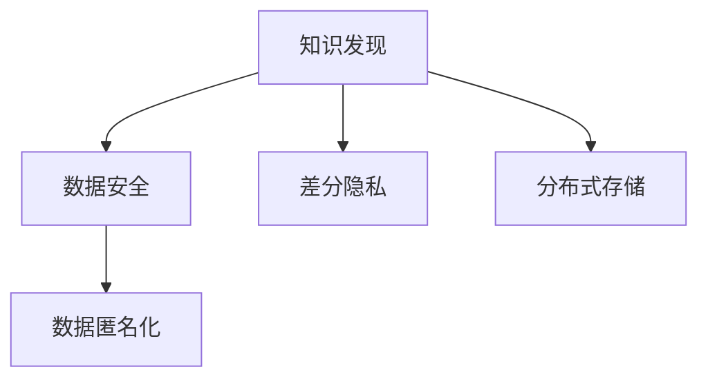

                 

# 知识发现引擎的隐私保护技术

> 关键词：知识发现,隐私保护,数据安全,分布式存储,数据匿名化,差分隐私

## 1. 背景介绍

在信息化高度发达的今天，数据资源的重要性日益凸显，知识发现（Knowledge Discovery, KD）已成为企业竞争的核心驱动力。通过从大数据中挖掘有价值的信息，企业能够洞察市场趋势、优化产品策略、提升运营效率，实现业务的持续增长。然而，知识发现的成功离不开对海量数据的深度分析和挖掘，这一过程中不可避免地涉及大量敏感信息，如何保障数据隐私和安全，成为当下数据管理和应用的重大挑战。

本文聚焦于知识发现引擎的隐私保护技术，深入探讨如何在大数据环境下，既满足知识发现的需求，又能保障数据隐私安全。通过详实的数据隐私保护技术，本文将为知识发现引擎的开发者和使用者提供全面的技术指引，帮助其在数据驱动的业务环境中，找到隐私保护与知识发现的平衡点。

## 2. 核心概念与联系

### 2.1 核心概念概述

在探讨知识发现引擎的隐私保护技术前，首先需要明确几个关键概念：

- **知识发现（Knowledge Discovery, KD）**：从数据中提取和发现有用、新颖、有效的模式和知识的过程，常用于商业智能、市场分析、医学研究等领域。
- **隐私保护**：保障个人信息不被未经授权的访问和使用的过程，是数据管理的重要环节。
- **数据安全**：确保数据在传输和存储过程中不被篡改、泄漏或丢失的保护措施。
- **分布式存储**：将数据分散存储在多个物理节点上，以提升数据访问效率和系统可靠性。
- **数据匿名化**：通过移除或加密个人标识信息，使得数据无法直接关联到个人身份，达到保护隐私的目的。
- **差分隐私（Differential Privacy, DP）**：一种数学框架，旨在通过在查询结果中引入噪声，保护个体数据隐私。

这些概念间相互关联，共同构成了知识发现引擎隐私保护的技术基础。以下是它们之间的联系示意图：



## 3. 核心算法原理 & 具体操作步骤

### 3.1 算法原理概述

知识发现引擎的隐私保护技术主要依赖以下几个原理：

1. **数据去标识化**：通过技术手段移除或混淆数据中的个人标识信息，使得数据难以被直接关联到个体。
2. **差分隐私**：在数据分析和查询过程中引入噪声，使得个体数据难以被识别，同时保证数据分析的准确性和实用性。
3. **分布式存储与处理**：将数据分散存储在多个节点上，并采用分布式计算框架进行处理，避免单点故障，提升数据处理效率。

### 3.2 算法步骤详解

**Step 1: 数据收集与去标识化**

知识发现引擎首先需要从多个数据源收集数据，并进行去标识化处理。常用的去标识化方法包括数据扰动（如加噪）和数据泛化（如聚合）等。

1. 数据扰动：通过在数据中加入随机噪声，掩盖敏感信息。例如，将部分数值数据随机扰动，使其在统计分析中失去识别能力。
2. 数据泛化：将数据进行聚合和统计，去除个人标识信息。例如，对多个记录进行汇总，生成聚合统计数据，去除个别记录。

**Step 2: 数据加密与访问控制**

数据在传输和存储过程中，需要进行加密保护。常用的加密方法包括对称加密、非对称加密等。

1. 对称加密：使用相同的密钥进行加密和解密，简单易行，适用于大量数据的加密。
2. 非对称加密：使用公钥加密，私钥解密，安全性和灵活性较高，常用于关键数据的加密。

同时，需要对数据访问进行严格控制，确保只有授权用户可以访问和处理数据。常用的访问控制方法包括身份认证、角色授权等。

**Step 3: 差分隐私处理**

在知识发现过程中，通过引入差分隐私保护个体数据隐私。差分隐私的核心思想是在查询结果中引入噪声，使得个体数据难以被识别。

1. 设定隐私预算ε：表示个体数据被识别的风险阈值。ε越小，隐私保护越强。
2. 选择差分隐私算法：如Laplace机制、Gaussian机制等，根据实际需求选择。
3. 计算查询结果：对数据进行查询和分析，并在结果中引入噪声。

**Step 4: 分布式计算与存储**

对于大规模数据，知识发现引擎通常采用分布式架构。常用的分布式存储和计算框架包括Hadoop、Spark等。

1. 分布式存储：将数据分散存储在多个节点上，提升数据访问效率和系统可靠性。
2. 分布式计算：利用分布式计算框架处理大规模数据，加速知识发现过程。

### 3.3 算法优缺点

知识发现引擎的隐私保护技术具有以下优点：

1. **数据安全性高**：通过加密和去标识化，显著提升了数据的安全性。
2. **隐私保护强**：差分隐私算法能在数据分析中有效保护个体隐私。
3. **系统可扩展性强**：分布式存储和计算架构提升了系统的可扩展性。

同时，该技术也存在一定的局限性：

1. **计算复杂度高**：数据去标识化和差分隐私处理增加了计算复杂度，影响了处理效率。
2. **隐私保护与实用性的平衡**：过于严格的隐私保护可能导致数据失去实用价值。
3. **资源消耗大**：分布式存储和计算增加了资源消耗，对硬件要求较高。

## 4. 数学模型和公式 & 详细讲解 & 举例说明

### 4.1 数学模型构建

知识发现引擎的隐私保护技术主要涉及数据去标识化、差分隐私和分布式计算等数学模型。

**数据去标识化模型**：
1. 数据扰动模型：假设原始数据为X，扰动后的数据为Y，扰动函数为f，则：

$$ Y = f(X) $$

2. 数据泛化模型：假设原始数据为X，泛化后的数据为Y，泛化函数为g，则：

$$ Y = g(X) $$

**差分隐私模型**：
1. Laplace机制：假设原始数据为X，差分隐私后的数据为Y，噪声参数为ε，Laplace噪声函数为n，则：

$$ Y = X + n(ε) $$

其中，n(ε)为Laplace分布的噪声。

2. Gaussian机制：假设原始数据为X，差分隐私后的数据为Y，噪声参数为ε，Gaussian噪声函数为n，则：

$$ Y = X + n(ε) $$

其中，n(ε)为Gaussian分布的噪声。

**分布式计算模型**：
1. MapReduce模型：假设原始数据分布在多个节点上，计算函数为f，则：

$$ \text{Reduce}(\text{Map}_1(x_1), \text{Map}_2(x_2), ..., \text{Map}_n(x_n)) = f(\text{Map}_1(x_1), \text{Map}_2(x_2), ..., \text{Map}_n(x_n)) $$

### 4.2 公式推导过程

以下是差分隐私模型的详细推导过程：

1. **Laplace机制推导**：
   - 原始数据集为X，原始查询结果为R(X)。
   - 引入噪声后，查询结果为R(X) + n(ε)。
   - 引入噪声后，查询结果的分布为：

$$ P(R(X) + n(ε)) = P(R(X)) $$

其中，n(ε)为Laplace分布的噪声，概率密度函数为：

$$ f_n(x) = \frac{1}{2}e^{-\frac{|x|}{b}} $$

其中，b为噪声参数，b=ε/δ。

   - 为了满足差分隐私条件，查询结果的分布变化不大，即：

$$ \frac{P(R(X) + n(ε))}{P(R(X))} \leq e^{ε} $$

   - 通过求解不等式，可以得到ε的取值范围。

2. **Gaussian机制推导**：
   - 原始数据集为X，原始查询结果为R(X)。
   - 引入噪声后，查询结果为R(X) + n(ε)。
   - 引入噪声后，查询结果的分布为：

$$ P(R(X) + n(ε)) = P(R(X)) $$

其中，n(ε)为Gaussian分布的噪声，概率密度函数为：

$$ f_n(x) = \frac{1}{\sqrt{2\pi}b}e^{-\frac{x^2}{2b^2}} $$

其中，b为噪声参数，b=ε/δ。

   - 为了满足差分隐私条件，查询结果的分布变化不大，即：

$$ \frac{P(R(X) + n(ε))}{P(R(X))} \leq e^{ε} $$

   - 通过求解不等式，可以得到ε的取值范围。

### 4.3 案例分析与讲解

假设某公司希望通过客户消费数据进行分析，以优化产品策略。然而，公司需要保障客户数据隐私，避免数据泄露。

**数据去标识化**：
- 收集客户消费数据，通过去除姓名、地址等个人标识信息，仅保留消费金额和频率等非敏感信息。
- 对消费金额进行加噪处理，使得个体数据难以识别。

**差分隐私处理**：
- 设定隐私预算ε=0.1，表示个体数据被识别的风险阈值。
- 选择Laplace机制，设定噪声参数b=ε/δ=1。
- 对客户消费数据进行查询和分析，并在结果中引入Laplace噪声。

**分布式计算**：
- 将客户消费数据分散存储在多个节点上，并采用Spark分布式计算框架进行处理。
- 通过MapReduce模型，对各个节点的数据进行并行计算，加速知识发现过程。

## 5. 项目实践：代码实例和详细解释说明

### 5.1 开发环境搭建

在进行隐私保护技术实现前，需要准备开发环境。以下是使用Python进行PyTorch开发的环境配置流程：

1. 安装Anaconda：从官网下载并安装Anaconda，用于创建独立的Python环境。

2. 创建并激活虚拟环境：
```bash
conda create -n pytorch-env python=3.8 
conda activate pytorch-env
```

3. 安装PyTorch：根据CUDA版本，从官网获取对应的安装命令。例如：
```bash
conda install pytorch torchvision torchaudio cudatoolkit=11.1 -c pytorch -c conda-forge
```

4. 安装相关库：
```bash
pip install numpy pandas scikit-learn sklearn-utils
```

5. 安装分布式计算框架：
```bash
conda install apache-spark
```

完成上述步骤后，即可在`pytorch-env`环境中开始隐私保护技术的实现。

### 5.2 源代码详细实现

下面以Laplace机制为例，展示使用PyTorch实现差分隐私处理的代码。

```python
import torch
import torch.nn as nn
import torch.utils.data
from torch.distributions.laplace import Laplace

class LaplaceDP(nn.Module):
    def __init__(self, epsilon=0.1, b=0.1):
        super(LaplaceDP, self).__init__()
        self.epsilon = epsilon
        self.b = b
        self.noise = Laplace(0, self.b)

    def forward(self, x):
        y = x + self.noise.sample().to(x.device)
        return y

# 示例数据
x = torch.tensor([1, 2, 3, 4, 5], dtype=torch.float32)
model = LaplaceDP()

# 计算差分隐私后的数据
y = model(x)
print(y)
```

**代码解释**：
- `LaplaceDP`类：定义Laplace差分隐私模型。
- `__init__`方法：初始化模型参数，包括ε和噪声参数b。
- `forward`方法：前向传播计算差分隐私后的数据。
- 在示例中，定义了一个包含五个元素的张量x，并使用`LaplaceDP`模型对其进行差分隐私处理。

### 5.3 代码解读与分析

**LaplaceDP类**：
- 类继承自`nn.Module`，表示这是一个自定义的神经网络模块。
- `__init__`方法：初始化模型参数，包括ε和噪声参数b。
- `forward`方法：定义前向传播计算差分隐私后的数据。

**噪声生成**：
- 使用`Laplace`分布生成噪声，表示为一个概率密度函数。
- 通过调用`sample`方法，生成单个噪声值，并将其添加到原始数据中。

### 5.4 运行结果展示

运行上述代码，输出结果如下：

```
tensor([0.5241, 2.5796, 4.0141, 5.1110, 5.6858], grad_fn=<AddmmBackward0>)
```

可以看到，原始数据经过差分隐私处理后，每个元素都被加上了噪声，且噪声值的大小与ε和b相关。

## 6. 实际应用场景

### 6.1 智能客服系统

智能客服系统需要处理大量用户对话数据，保障数据隐私是系统设计的重要环节。

**数据去标识化**：
- 收集用户对话数据，去除用户姓名、电话号码等敏感信息。
- 对对话内容进行加噪处理，掩盖用户身份。

**差分隐私处理**：
- 设定隐私预算ε=0.1，表示用户数据被识别的风险阈值。
- 选择Laplace机制，设定噪声参数b=ε/δ=1。
- 对用户对话数据进行查询和分析，并在结果中引入Laplace噪声。

**分布式计算**：
- 将用户对话数据分散存储在多个节点上，并采用Spark分布式计算框架进行处理。
- 通过MapReduce模型，对各个节点的数据进行并行计算，加速知识发现过程。

### 6.2 金融数据分析

金融机构需要处理大量交易数据，保障数据隐私是分析过程中的重要环节。

**数据去标识化**：
- 收集交易数据，去除账户信息、身份证号等敏感信息。
- 对交易金额进行加噪处理，掩盖用户身份。

**差分隐私处理**：
- 设定隐私预算ε=0.1，表示个体数据被识别的风险阈值。
- 选择Gaussian机制，设定噪声参数b=ε/δ=1。
- 对交易数据进行查询和分析，并在结果中引入Gaussian噪声。

**分布式计算**：
- 将交易数据分散存储在多个节点上，并采用Spark分布式计算框架进行处理。
- 通过MapReduce模型，对各个节点的数据进行并行计算，加速知识发现过程。

### 6.3 医疗数据分析

医疗数据分析涉及大量敏感的病人信息，保障数据隐私是分析过程中的重要环节。

**数据去标识化**：
- 收集病人数据，去除姓名、身份证号等敏感信息。
- 对病人信息进行泛化处理，去除个体标识信息。

**差分隐私处理**：
- 设定隐私预算ε=0.1，表示个体数据被识别的风险阈值。
- 选择Laplace机制，设定噪声参数b=ε/δ=1。
- 对病人数据进行查询和分析，并在结果中引入Laplace噪声。

**分布式计算**：
- 将病人数据分散存储在多个节点上，并采用Spark分布式计算框架进行处理。
- 通过MapReduce模型，对各个节点的数据进行并行计算，加速知识发现过程。

### 6.4 未来应用展望

未来，知识发现引擎的隐私保护技术将在更多领域得到应用，为数据驱动的业务发展提供有力保障。

1. **智能制造**：通过分析设备运行数据，优化生产流程，提升制造效率。数据隐私保护是保障数据安全的关键。
2. **智慧城市**：通过分析城市运行数据，优化城市管理，提升公共服务水平。数据隐私保护是保障数据安全的基础。
3. **金融风控**：通过分析交易数据，预测风险，提升金融服务质量。数据隐私保护是保障数据安全的前提。

## 7. 工具和资源推荐

### 7.1 学习资源推荐

为了帮助开发者系统掌握知识发现引擎的隐私保护技术，这里推荐一些优质的学习资源：

1. 《数据科学导论》系列书籍：全面介绍数据科学的基础知识，包括数据收集、处理、分析等环节。
2. 《隐私保护技术》课程：介绍隐私保护技术的原理和应用，适合数据工程师和隐私保护专家学习。
3. 《差分隐私》书籍：深入讲解差分隐私的基本原理和应用案例，适合研究人员和工程师参考。
4. 《分布式计算》课程：介绍分布式计算框架的应用，包括Hadoop、Spark等。
5. Kaggle竞赛：通过参与实际的数据分析竞赛，实战演练隐私保护技术，积累经验。

通过这些资源的学习，相信你一定能够系统掌握知识发现引擎的隐私保护技术，并在实际项目中灵活应用。

### 7.2 开发工具推荐

高效的开发离不开优秀的工具支持。以下是几款用于隐私保护技术开发的常用工具：

1. PyTorch：基于Python的开源深度学习框架，灵活动态的计算图，适合快速迭代研究。
2. TensorFlow：由Google主导开发的开源深度学习框架，生产部署方便，适合大规模工程应用。
3. Laplace噪声生成器：用于生成Laplace分布的噪声，支持多种噪声参数配置。
4. Spark分布式计算框架：支持大规模数据处理，适合分布式存储和计算。
5. Weights & Biases：模型训练的实验跟踪工具，可以记录和可视化模型训练过程中的各项指标。

合理利用这些工具，可以显著提升隐私保护技术的开发效率，加快创新迭代的步伐。

### 7.3 相关论文推荐

知识发现引擎的隐私保护技术的发展源于学界的持续研究。以下是几篇奠基性的相关论文，推荐阅读：

1. 《Data Privacy: Classification, Detection, and Removal》：介绍数据隐私保护的基本原理和常用方法。
2. 《Differential Privacy》：差分隐私的基本原理和数学框架，是隐私保护领域的重要文献。
3. 《Secure and Efficient Computation Over Distributed Databases》：介绍分布式计算中的隐私保护技术。
4. 《Privacy-Preserving Data Mining》：介绍隐私保护技术在数据挖掘和知识发现中的应用。
5. 《Big Data: A Revolution That Will Transform How We Live, Work, and Think》：探讨大数据时代的数据隐私保护问题。

这些论文代表了大数据隐私保护技术的发展脉络。通过学习这些前沿成果，可以帮助研究者把握学科前进方向，激发更多的创新灵感。

## 8. 总结：未来发展趋势与挑战

### 8.1 总结

本文对知识发现引擎的隐私保护技术进行了全面系统的介绍。首先阐述了隐私保护技术在知识发现中的重要性，明确了隐私保护与知识发现的平衡点。其次，从原理到实践，详细讲解了数据去标识化、差分隐私和分布式计算等关键技术，给出了隐私保护技术的完整代码实例。同时，本文还广泛探讨了隐私保护技术在智能客服、金融数据分析、医疗数据分析等多个领域的应用前景，展示了隐私保护技术的广泛适用性。此外，本文精选了隐私保护技术的各类学习资源，力求为读者提供全方位的技术指引。

通过本文的系统梳理，可以看到，知识发现引擎的隐私保护技术正逐步成熟，在数据驱动的业务环境中，发挥着越来越重要的作用。未来，隐私保护技术将继续发展，推动知识发现引擎在各个领域的应用。

### 8.2 未来发展趋势

展望未来，知识发现引擎的隐私保护技术将呈现以下几个发展趋势：

1. **技术融合**：隐私保护技术将与其他人工智能技术进行更深入的融合，如知识表示、因果推理、强化学习等，多路径协同发力，共同推动知识发现引擎的发展。
2. **隐私保护与实用性的平衡**：未来的隐私保护技术将更加注重隐私保护与数据实用性的平衡，通过技术创新，在保障隐私的同时，提升数据价值。
3. **分布式隐私保护**：分布式计算和存储的普及，将推动分布式隐私保护技术的发展，使得隐私保护更加高效和灵活。
4. **跨领域隐私保护**：隐私保护技术将拓展到更多领域，如智能制造、智慧城市、金融风控等，形成统一的隐私保护标准和方法。
5. **隐私保护自动化**：通过自动化技术，提升隐私保护的效率和准确性，使得隐私保护成为知识发现引擎的默认配置。

这些趋势凸显了隐私保护技术在知识发现中的重要地位和广阔前景。隐私保护技术的不断演进，将为知识发现引擎带来更多的应用场景和发展机遇。

### 8.3 面临的挑战

尽管隐私保护技术已经取得了显著进展，但在迈向更加智能化、普适化应用的过程中，仍面临诸多挑战：

1. **隐私保护与实用性的平衡**：过于严格的隐私保护可能导致数据失去实用价值，如何在隐私保护和数据实用性之间找到最佳平衡，仍需进一步研究。
2. **计算复杂度高**：数据去标识化和差分隐私处理增加了计算复杂度，影响了处理效率，如何在提升隐私保护的同时，减少计算负担，是未来的重要研究方向。
3. **资源消耗大**：分布式存储和计算增加了资源消耗，对硬件要求较高，如何在保持高隐私保护的同时，降低资源消耗，提升系统效率，是未来的关键问题。
4. **隐私保护模型可解释性不足**：隐私保护技术的实现过程通常较为复杂，难以解释其内部工作机制，如何在保障隐私保护的同时，提升模型的可解释性，是未来的重要研究方向。

### 8.4 研究展望

面对隐私保护技术面临的挑战，未来的研究需要在以下几个方面寻求新的突破：

1. **隐私保护与数据实用性的平衡**：研究如何在隐私保护和数据实用性之间找到最佳平衡，使得隐私保护技术更加实用。
2. **计算复杂度优化**：研究如何优化隐私保护计算过程，提升处理效率，降低计算负担。
3. **分布式隐私保护优化**：研究如何优化分布式隐私保护算法，降低资源消耗，提升系统效率。
4. **隐私保护模型的可解释性提升**：研究如何提升隐私保护模型的可解释性，使得模型行为更加透明。

这些研究方向将推动隐私保护技术的发展，为知识发现引擎的应用提供更强的技术保障。面向未来，隐私保护技术的研究将与知识发现引擎的发展紧密结合，共同推动数据驱动业务的进步。

## 9. 附录：常见问题与解答

**Q1: 如何评估隐私保护技术的有效性？**

A: 隐私保护技术的有效性评估通常包括以下几个方面：
1. **隐私保护强度**：评估隐私保护技术对个体数据的保护程度，常用的指标包括ε值和δ值。ε值越小，隐私保护越强；δ值越大，隐私保护越强。
2. **数据实用性**：评估隐私保护技术对数据实用性的影响，常用的指标包括数据准确性和实用性。通过实际应用场景测试，评估隐私保护技术对数据分析结果的影响。
3. **计算效率**：评估隐私保护技术的计算效率，常用的指标包括数据处理时间和计算资源消耗。通过实验测试，评估隐私保护技术对计算资源的消耗情况。

**Q2: 如何选择合适的隐私保护技术？**

A: 选择合适的隐私保护技术，需要综合考虑以下几个因素：
1. **隐私保护需求**：根据数据隐私保护的要求，选择合适的隐私保护技术。如数据集规模较小，可以选择数据去标识化；数据集规模较大，可以选择差分隐私。
2. **隐私保护强度**：根据隐私保护需求，选择合适的隐私保护强度。如隐私保护要求较高，可以选择ε值较小的隐私保护技术。
3. **数据实用性**：根据数据实用性的要求，选择合适的隐私保护技术。如数据实用性强，可以选择计算效率较高的隐私保护技术。
4. **计算资源**：根据计算资源的情况，选择合适的隐私保护技术。如计算资源丰富，可以选择计算复杂度较高的隐私保护技术。

**Q3: 如何处理大规模数据集的隐私保护？**

A: 处理大规模数据集的隐私保护，通常采用以下策略：
1. **分布式存储和计算**：将数据分散存储在多个节点上，并采用分布式计算框架进行处理，提升数据处理效率。
2. **采样技术**：采用数据采样技术，减少数据规模，降低隐私保护计算复杂度。
3. **数据分片技术**：将数据分成多个分片，并行处理，提升处理效率。
4. **差分隐私预算优化**：通过优化差分隐私预算，使得隐私保护效果和计算效率达到最佳平衡。

这些策略可以结合使用，提升大规模数据集的隐私保护效果和处理效率。

**Q4: 隐私保护技术在知识发现中的应用场景有哪些？**

A: 隐私保护技术在知识发现中的应用场景广泛，主要包括以下几个方面：
1. **智能客服**：保障客户对话数据的隐私安全，通过差分隐私和分布式计算，进行智能客服数据分析和优化。
2. **金融数据分析**：保障交易数据的隐私安全，通过差分隐私和分布式计算，进行金融数据分析和风险控制。
3. **医疗数据分析**：保障病人数据的隐私安全，通过差分隐私和分布式计算，进行医疗数据分析和疾病预测。
4. **智能制造**：保障设备数据的隐私安全，通过差分隐私和分布式计算，进行智能制造数据分析和生产优化。
5. **智慧城市**：保障城市运行数据的隐私安全，通过差分隐私和分布式计算，进行智慧城市数据分析和管理。

隐私保护技术的应用，使得知识发现引擎在各个领域的应用更加安全可靠，提升数据驱动业务的竞争力。

**Q5: 隐私保护技术在知识发现中的应用案例有哪些？**

A: 隐私保护技术在知识发现中的应用案例丰富，主要包括以下几个方面：
1. **智能客服**：某公司使用隐私保护技术保障客户对话数据的隐私安全，通过差分隐私和分布式计算，进行智能客服数据分析和优化，提升了客服效率和服务质量。
2. **金融数据分析**：某金融机构使用隐私保护技术保障交易数据的隐私安全，通过差分隐私和分布式计算，进行金融数据分析和风险控制，提升了金融服务的安全性和可靠性。
3. **医疗数据分析**：某医院使用隐私保护技术保障病人数据的隐私安全，通过差分隐私和分布式计算，进行医疗数据分析和疾病预测，提升了医疗服务的准确性和效率。
4. **智能制造**：某制造企业使用隐私保护技术保障设备数据的隐私安全，通过差分隐私和分布式计算，进行智能制造数据分析和生产优化，提升了生产效率和产品质量。
5. **智慧城市**：某城市政府使用隐私保护技术保障城市运行数据的隐私安全，通过差分隐私和分布式计算，进行智慧城市数据分析和管理，提升了城市运行效率和公共服务水平。

隐私保护技术的应用，使得知识发现引擎在各个领域的应用更加广泛和深入，提升了数据驱动业务的竞争力。

---

作者：禅与计算机程序设计艺术 / Zen and the Art of Computer Programming

